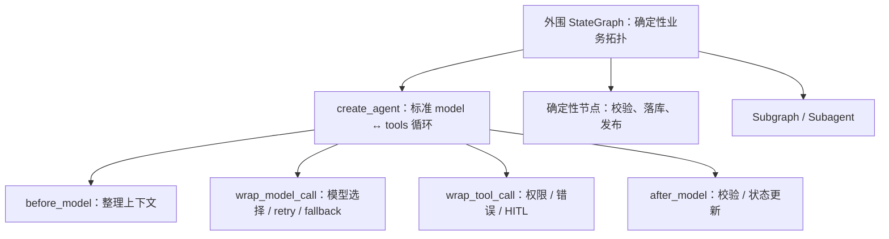
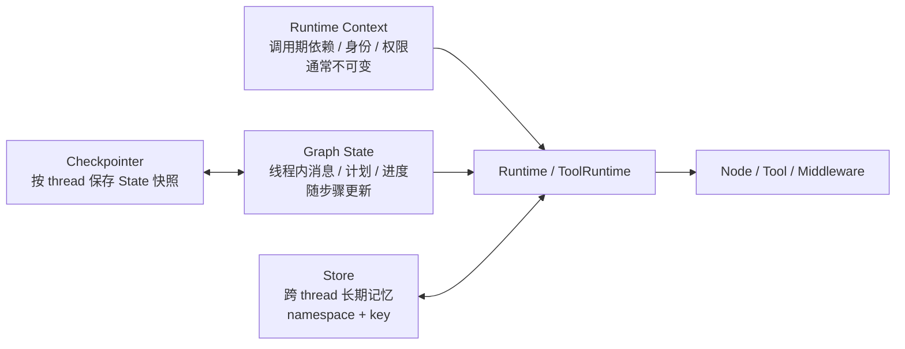
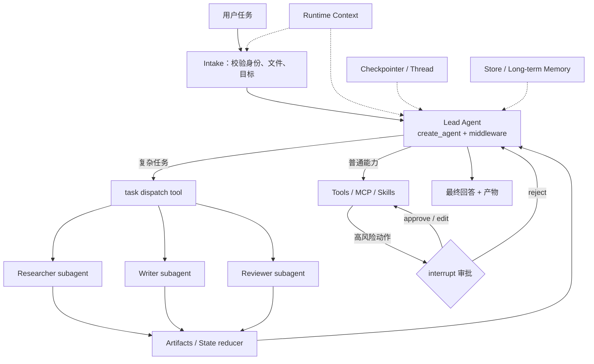

# LangChain / LangGraph / LangSmith 官方 Agent 开发能力基线

> 调研日期：2026-07-13  
> 资料边界：只使用 LangChain 官方文档、`langchain-ai` 官方 GitHub 仓库、官方 Release 与官方模板。  
> 用途：为本项目后续课程重构、示例代码、依赖锁定、测试与 Mini DeerFlow 实战提供统一事实基线。

## 1. 执行摘要

截至调研日期，官方推荐的 Python Agent 开发主线已经非常明确：

1. **普通工具型 Agent 优先从 `langchain.agents.create_agent` 起步**。它不是一个与 LangGraph 无关的“旧式 LangChain Agent”，而是构建在 LangGraph runtime 上的高层 Agent 工厂。`langgraph.prebuilt.create_react_agent` 是 v1.0 以前的推荐入口，新课程不应继续把它作为主入口。[LangChain v1 迁移指南](https://docs.langchain.com/oss/python/migrate/langchain-v1)
2. **通过 Agent Middleware 做上下文工程和横切治理**。动态提示词、模型/工具选择、消息裁剪、重试、回退、HITL、调用限额等都应放入 middleware，而不是用 Runnable listener/fallback 冒充 middleware。[Middleware Overview](https://docs.langchain.com/oss/python/langchain/middleware/overview)
3. **把 Runtime Context、Graph State、Store 分开建模**：Context 是调用期依赖和静态配置；State 是线程内、会变化的短期状态；Store 是跨线程长期数据。Checkpointer 保存线程状态，Store 不等于 Checkpointer。[Context Engineering](https://docs.langchain.com/oss/python/langchain/context-engineering)、[Runtime](https://docs.langchain.com/oss/python/langchain/runtime)、[Persistence](https://docs.langchain.com/oss/python/langgraph/persistence)
4. **需要明确业务控制流时使用 LangGraph**。Graph API 用 `StateGraph + node + edge + reducer` 显式表达拓扑；Functional API 用 `@entrypoint + @task` 在普通 Python 控制流中获得持久化、HITL 和 durable execution。两者共享底层 runtime，也可以混用。[Graph API](https://docs.langchain.com/oss/python/langgraph/graph-api)、[Functional API](https://docs.langchain.com/oss/python/langgraph/functional-api)
5. **生产级 Agent 的核心不是“多调用几次模型”，而是 durable execution**：checkpoint、thread、interrupt/resume、重试、幂等副作用、replay/fork、故障恢复必须一起学习。[Interrupts](https://docs.langchain.com/oss/python/langgraph/interrupts)、[Time Travel](https://docs.langchain.com/oss/python/langgraph/use-time-travel)
6. **多 Agent 不是只有“子图”一种形态**。官方当前区分 Subagents、Handoffs、Skills、Router 和 Custom Workflow。类 DeerFlow 的核心更接近“有状态 Lead Agent + 作为工具调用的隔离型 subagents + middleware + 自定义 workflow”，而不是简单地把多个翻译图首尾相连。[Multi-agent](https://docs.langchain.com/oss/python/langchain/multi-agent/index)、[Subagents](https://docs.langchain.com/oss/python/langchain/multi-agent/subagents)
7. **交付结构应是可导入 Python 包 + `langgraph.json` + 依赖文件 + 测试，而不是只提供 Notebook**。本地用 `langgraph dev`，部署目标是 Agent Server / LangSmith Deployment 或 standalone Agent Server。[Application Structure](https://docs.langchain.com/langsmith/application-structure)、[LangGraph CLI](https://docs.langchain.com/langsmith/cli)
8. **测试与评测分层**：确定性逻辑用 pytest；模型/工具决策做单步、轨迹和端到端评测；LangSmith 负责 trace、实验对比、离线评测与线上反馈闭环。[LangGraph Test](https://docs.langchain.com/oss/python/langgraph/test)、[Agent Evals](https://docs.langchain.com/oss/python/langchain/test/evals)、[LangSmith Evaluation](https://docs.langchain.com/langsmith/evaluation)

因此，本项目最合适的教学路径不是“LangChain 学完后抛弃它，转去 LangGraph”，而是：

```mermaid
flowchart LR
    A["模型与消息"] --> B["工具与结构化输出"]
    B --> C["create_agent：标准工具循环"]
    C --> D["Middleware：上下文与治理"]
    D --> E["State / Context / Store"]
    E --> F["StateGraph：显式业务流程"]
    F --> G["持久化 / HITL / Durable Execution"]
    G --> H["Subagents / Router / Handoffs"]
    H --> I["测试、评测与可观测性"]
    I --> J["langgraph.json + Agent Server"]
    J --> K["Mini DeerFlow 实战"]
```



---

## 2. 版本基线与版本策略

### 2.1 调研时的官方稳定版本快照

官方 GitHub Releases 在 2026-07-13 显示：

| 包 | 调研时最新稳定发布 | 官方记录 |
|---|---:|---|
| `langchain` | `1.3.13`（2026-07-10） | [langchain==1.3.13](https://github.com/langchain-ai/langchain/releases/tag/langchain%3D%3D1.3.13) |
| `langchain-core` | `1.4.9`（2026-07-08） | [langchain-core==1.4.9](https://github.com/langchain-ai/langchain/releases/tag/langchain-core%3D%3D1.4.9) |
| `langgraph` | `1.2.9`（2026-07-10） | [LangGraph 1.2.9](https://github.com/langchain-ai/langgraph/releases/tag/1.2.9) |
| `langsmith` Python SDK | `0.10.2`（2026-07-10） | [LangSmith SDK v0.10.2](https://github.com/langchain-ai/langsmith-sdk/releases/tag/v0.10.2) |

说明：LangChain 单仓库会分别发布 `langchain`、`langchain-core` 及各 provider 包，GitHub 的“Latest”标签不必然等于顶层 `langchain` 包。课程版本矩阵必须分别记录顶层包、core、LangGraph、LangSmith 和模型 provider，不能只写一句“当前 LangChain 版本”。

### 2.2 本项目的版本风险

当前 `pyproject.toml` 只声明 `langchain>=1.2.14`，没有直接声明 `langgraph`，也没有上界或锁定一组经过验证的 provider 版本。风险包括：

- `langgraph` 仅作为间接依赖被安装，课程却直接导入它；依赖意图不清晰。
- 2026 年的流式协议、Runtime 字段和 middleware 已有跨 minor 版本差异，仅使用 `>=` 会使 Notebook 在不同日期产生不同返回形状。
- `langchain-core`、`langchain-openai`、`langchain-deepseek`、`langsmith` 各自独立发布，单独升级可能改变消息 content blocks、模型 profile、stream metadata 或 tracing 行为。

建议课程采用两层策略：

1. `pyproject.toml` 声明课程实际直接使用的包及兼容范围，例如 `langchain>=1.3,<1.4`、`langgraph>=1.2,<1.3`；
2. 提交 `uv.lock` 作为“已验证快照”，CI 按 lock 执行所有离线示例与测试；另设周期性“latest compatible”任务发现上游变化。

官方版本政策还要求课程区分稳定、beta、alpha 和 internal API：稳定公开 API 在 1.x 内按 SemVer 演进；deprecated API 通常保留到下一个 major；beta 仍可能小幅变化；alpha 和以下划线开头的内部 API 不适合作为教程契约。[Versioning](https://docs.langchain.com/oss/python/versioning)、[Release Policy](https://docs.langchain.com/oss/python/release-policy)

另外，不能把“升级依赖”只理解为修复 import：LangGraph 部署新代码后，旧 thread/checkpoint 恢复时会执行新 graph 定义。对 interrupted thread，删除或重命名它即将进入的 node 可能使其无法恢复；state 字段重命名会让旧值无法自动迁移，不兼容的类型变化也会破坏旧 checkpoint。[Backward Compatibility](https://docs.langchain.com/oss/python/langgraph/backward-compatibility)、[Graph API - Graph migrations](https://docs.langchain.com/oss/python/langgraph/graph-api)

### 2.3 API 状态标签

本文后续统一使用：

| 标签 | 含义 | 教学处理 |
|---|---|---|
| **推荐 API** | 当前官方主文档与迁移指南推荐 | 正文主路径，提供完整可运行示例 |
| **兼容 API** | 仍可使用，但不是新代码的优先表达 | 只在迁移、返回形状对照或调试附录出现 |
| **旧 API** | 已被新入口替代、迁入 classic、停止维护或仓库归档 | 显式标红，不能作为毕业项目基础 |
| **预览 API** | 官方已文档化，但仍标注 preview/beta | 作为进阶观察，不纳入课程稳定验收接口 |

---

## 3. “能力 → 官方来源 → 推荐示例 → 项目落点 → 版本风险”矩阵

| 能力 | API 状态与当前规范 | 官方来源 | 推荐转化的官方示例 | 本项目落点 | 版本风险 / 审核点 |
|---|---|---|---|---|---|
| Agent 创建与工具循环 | **推荐：** `langchain.agents.create_agent`；返回基于 LangGraph 的 compiled graph，支持工具循环、并行工具调用、结构化输出、middleware、state、context、checkpointer、store | [Agents](https://docs.langchain.com/oss/python/langchain/agents)、[v1 Migration](https://docs.langchain.com/oss/python/migrate/langchain-v1) | 官方 Quickstart 的工具 Agent；从一次模型调用逐步升级到 Agent | 第 01、04 章；Mini DeerFlow 的 Lead Agent 工厂 | `langgraph.prebuilt.create_react_agent` 为旧主入口；流式节点名由 `agent` 变为 `model`；pre-bound model 与 structured output 有限制 |
| 结构化输出 | **推荐：** 模型层 `with_structured_output`；Agent 层 `response_format=Schema/ProviderStrategy/ToolStrategy` | [Agents](https://docs.langchain.com/oss/python/langchain/agents)、[v1 Migration](https://docs.langchain.com/oss/python/migrate/langchain-v1) | 对照“增强模型”和“完整 Agent 最终响应”两条路线 | 第 02 章；路由分类、研究计划、审批请求 schema | v1 Agent 已移除旧 prompted response format；传 schema 时 provider-native 可用则选 ProviderStrategy，否则回退 ToolStrategy |
| Agent Middleware | **推荐：** `AgentMiddleware` 或装饰器；节点式 hooks：`before_agent/before_model/after_model/after_agent`；wrap hooks：`wrap_model_call/wrap_tool_call` | [Overview](https://docs.langchain.com/oss/python/langchain/middleware/overview)、[Custom Middleware](https://docs.langchain.com/oss/python/langchain/middleware/custom)、[Built-in Middleware](https://docs.langchain.com/oss/python/langchain/middleware/built-in) | 调用计数、动态 prompt、工具异常重试、模型 fallback、HITL、summarization | **重写第 05 章**；最终项目 `middleware/` | Runnable `with_listeners/with_fallbacks` 是兼容的 Runnable 能力，但不能替代 Agent Middleware；middleware 顺序影响嵌套和状态可见性 |
| Runtime Context | **推荐：** `context_schema` + invoke/stream 的 `context=`；工具用 `ToolRuntime.context`，节点用 `Runtime[Context]` | [Runtime](https://docs.langchain.com/oss/python/langchain/runtime)、[Tools](https://docs.langchain.com/oss/python/langchain/tools) | 注入 `user_id`、权限、数据库连接、sandbox、模型选择，不暴露给 LLM schema | 第 04、05 章；Mini DeerFlow 的 runtime/sandbox/config | 旧做法把依赖塞进 `config["configurable"]`；当前迁移指南推荐 `context`。`execution_info/server_info` 需较新 LangGraph，且 server_info 本地为 `None` |
| Graph State / 短期记忆 | **推荐：** Graph 使用 `TypedDict/dataclass/Pydantic` state；`create_agent` 自定义 state 必须扩展 `AgentState` 且为 `TypedDict`，优先由 middleware 声明 | [Graph API](https://docs.langchain.com/oss/python/langgraph/graph-api)、[Short-term Memory](https://docs.langchain.com/oss/python/langchain/short-term-memory) | messages + todo + artifacts + usage + current phase；工具返回 `Command(update=...)` | 第 05–08 章；Mini DeerFlow `state.py` | `create_agent(state_schema=...)` 仍兼容，但 middleware-local state schema 更推荐；Agent state 不再支持 Pydantic/dataclass |
| Reducer 与并行状态合并 | **推荐：** state field 用 `Annotated[..., reducer]`；消息用 `add_messages`；并行 fan-out 结果必须定义可合并 reducer | [Use Graph API](https://docs.langchain.com/oss/python/langgraph/use-graph-api) | map-reduce 报告：多个研究员追加 `sections`，聚合器统一生成报告 | **重写第 07 章**；多 subagent 结果汇总 | 不定义 reducer 时同一 superstep 多写可能触发 `INVALID_CONCURRENT_GRAPH_UPDATE`；不要让 node 返回整个旧 state |
| Store / 长期记忆 | **推荐：** `BaseStore`，按 namespace + key 存 JSON 文档；`runtime.store` 访问；跨 thread 保留 | [Long-term Memory](https://docs.langchain.com/oss/python/langchain/long-term-memory)、[Persistence](https://docs.langchain.com/oss/python/langgraph/persistence) | 跨两个 thread 保存/读取用户偏好；按 user id namespace 隔离 | 第 06 章；Mini DeerFlow 用户记忆和 skill metadata | `InMemoryStore` 仅开发/测试；生产用 Postgres/Mongo/Redis 等持久实现；Store 不是消息历史 |
| StateGraph | **推荐：** 显式 state、node、`START/END`、edge、conditional edge、loop、retry、subgraph | [Graph API](https://docs.langchain.com/oss/python/langgraph/graph-api)、[Thinking in LangGraph](https://docs.langchain.com/oss/python/langgraph/thinking-in-langgraph) | 官方 email agent：离散步骤、错误分类、HITL 和持久化 | **重写第 07、08 章**；最终项目外围业务图 | state schema 可以比 AgentState 更自由；节点粒度决定 checkpoint/重试/观测边界；图迁移时重命名 state key 会丢旧值 |
| Functional API | **推荐（按场景）：** `@entrypoint` + `@task`，适合保留普通 Python `if/for` 控制流并获得 persistence/HITL/streaming | [Functional API](https://docs.langchain.com/oss/python/langgraph/functional-api)、[Choosing APIs](https://docs.langchain.com/oss/python/langgraph/choosing-apis) | 并行 API 调用、带 task retry 的研究流程、在 entrypoint 内调用 StateGraph | 第 07 章增加对照实验；后台任务/子 Agent 执行器候选 | Functional API 不支持静态图可视化；恢复时 entrypoint 从头 replay，以缓存的 task result 跳过已完成工作；非确定性和副作用必须包在 task 中 |
| `Command` | **推荐：** node/tool 返回 `Command(update=..., goto=..., graph=...)`；恢复 interrupt 时把 `Command(resume=...)` 作为 invoke/stream 输入 | [Graph API - Command](https://docs.langchain.com/oss/python/langgraph/graph-api)、[Interrupts](https://docs.langchain.com/oss/python/langgraph/interrupts) | 工具更新 state；一次完成“写状态 + 跳转”；handoff 用 `Command.PARENT`；审批后 goto | 第 07、08、09 章 | `Command(update=...)` 不是多轮会话的继续输入；只有 `resume` 形态用于恢复。静态类型应给出可能 goto 的 `Literal` |
| `Send` | **推荐：** 条件边返回多个 `Send(node, state)` 实现动态并行 fan-out/map-reduce | [Use Graph API](https://docs.langchain.com/oss/python/langgraph/use-graph-api)、[Router](https://docs.langchain.com/oss/python/langchain/multi-agent/router) | 多源知识库：分类后同时派发 GitHub/Notion/Slack specialist，再综合 | 第 07、09 章；Mini DeerFlow 并行研究任务 | 并行写共享 key 必须 reducer；外部系统还需限流、timeout、重试和部分失败策略 |
| Checkpointer / thread persistence | **推荐：** compile/create_agent 时传 checkpointer；调用时传稳定 `thread_id`；每个 graph step 保存 checkpoint | [Persistence](https://docs.langchain.com/oss/python/langgraph/persistence)、[Checkpointer Integrations](https://docs.langchain.com/oss/python/integrations/checkpointers/index) | 同 thread 延续消息、不同 thread 隔离；查看 `get_state/get_state_history` | **修正第 06 章**；第 08 章恢复机制 | `InMemorySaver`/`MemorySaver` 仅进程内教学；SQLite 适合本地；Postgres 等用于生产。Agent Server 自动管理持久化，不要在 server graph 中硬接本地 saver |
| Durable execution / fault tolerance | **推荐：** 节点或 task 作为 durable 边界；retry policy；pending writes；副作用幂等；恢复失败 superstep | [Persistence](https://docs.langchain.com/oss/python/langgraph/persistence)、[Fault Tolerance](https://docs.langchain.com/oss/python/langgraph/fault-tolerance)、[Thinking in LangGraph](https://docs.langchain.com/oss/python/langgraph/thinking-in-langgraph) | 模拟一个并行分支失败，恢复后不重跑同 superstep 已成功分支 | 第 08 章；最终项目长任务执行 | “恢复”不是从 Python 某一行继续；node/entrypoint 可能重执行。外部写操作需幂等键、事务或任务隔离 |
| Interrupt / Resume | **推荐：** 节点/工具内动态 `interrupt(payload)`，同 `thread_id` 用 `Command(resume=value)` 恢复 | [Interrupts](https://docs.langchain.com/oss/python/langgraph/interrupts) | approve/reject、review/edit、输入校验、多 interrupt、工具内审批 | **重写第 08 章**；高风险工具审批 middleware | 静态 `interrupt_before/after` 适合调试但不推荐作为 HITL 主路径；interrupt 不应被 try/except 吞掉；payload 要可序列化；interrupt 前副作用会重跑 |
| Time travel | **推荐：** `get_state_history` 找 checkpoint；replay 或 `update_state` 后 fork | [Use Time Travel](https://docs.langchain.com/oss/python/langgraph/use-time-travel) | 从“写报告”前 checkpoint 重跑；修改研究资料后创建替代分支 | 第 08 章进阶；调试与审计 | replay 会重执行 checkpoint 之后的 LLM/API/interrupt，不是读取缓存；subgraph 默认只具父图粒度，`checkpointer=True` 才有内部 checkpoint 粒度 |
| Streaming v1 | **兼容 API：** 默认旧返回形状；单 mode 通常直接产生 payload，多 mode/子图组合会改变 tuple 包装 | [Streaming](https://docs.langchain.com/oss/python/langgraph/streaming) | 只用于与历史教程对照，展示为何直接 tuple unpack 容易错 | 附录保留兼容矩阵 | 返回形状依赖 stream_mode 数量与 subgraphs，教学代码若隐式依赖默认版本容易随升级漂移 |
| Streaming v2 | **推荐稳定主线：** `stream/astream(..., version="v2")`，每个 `StreamPart` 都是统一 dict：`type/ns/data`；LangGraph >= 1.1 | [Streaming](https://docs.langchain.com/oss/python/langgraph/streaming) | 同时消费 `updates/messages/custom`；展示 interrupt 在 v2 输出的位置 | 第 01、04、06、09 章统一；最终 SSE adapter 输入 | 现有第 04 章把 v2 事件直接解包为 `(chunk, metadata)`，必须修正；不要混淆 Runnable `astream_events` 的历史事件 schema |
| Event Streaming v3 | **预览 API：** `stream_events(..., version="v3")` 提供 messages/values/subgraphs/output/interrupts typed projections；官方称其为大多数 in-process 代码的推荐模型，但页面仍标 preview | [Event Streaming](https://docs.langchain.com/oss/python/langgraph/event-streaming) | 最终项目可做一节“未来协议观察”，将 typed projection 适配为前端领域事件 | 第 09/部署章进阶附录，不作为第一轮验收依赖 | 仍属 preview；课程必须锁版本并隔离 adapter，不能让 UI 直接绑定预览对象。v3 与 `stream(..., version="v2")` 是不同层级接口 |
| Subgraph | **推荐：** 将 compiled graph 作为 node 或在 node 中调用；父子 state 相同可直接挂载，不同 schema 用 wrapper 转换 | [Subgraphs](https://docs.langchain.com/oss/python/langgraph/use-subgraphs) | 独立 specialist graph；演示 inherited checkpointer、state inspection 和 interrupt | 第 09 章；Mini DeerFlow 可测试的业务子流程 | 默认继承父 checkpointer；有私有 memory 的 stateful subgraph 与并行重复调用要谨慎；持久化粒度取决于编译配置 |
| Supervisor + subagent-as-tool | **推荐模式：** 主 Agent 保持会话，stateless subagent 作为工具被调用，获得上下文隔离和并行能力 | [Subagents](https://docs.langchain.com/oss/python/langchain/multi-agent/subagents)、[Personal Assistant](https://docs.langchain.com/oss/python/langchain/multi-agent/subagents-personal-assistant) | calendar/email supervisor；单 dispatch `task(agent_name, description)`；控制输入输出上下文 | **重写第 09 章**；Mini DeerFlow 核心 | Supervisor 只能看到 subagent 最终输出；需明确输出契约。同步/后台任务不是 Python sync/async 的同义词；subagent 默认无状态 |
| Router | **推荐模式（按场景）：** 专门分类步骤，`Command` 单路，`Send` 多路并行，最后 synthesis | [Router](https://docs.langchain.com/oss/python/langchain/multi-agent/router)、[Routing Tutorial](https://docs.langchain.com/oss/python/langchain/multi-agent/router-knowledge-base) | 多源 KB 路由 | 第 09 章模式对照 | Router 通常无持续会话；若需要多轮动态编排，优先 supervisor 或 handoff。不要把 router 与 supervisor 混称 |
| Handoff | **推荐模式（按场景）：** 工具更新 `active_agent/current_step`，单 Agent middleware 或多 subgraph 改变行为 | [Handoffs](https://docs.langchain.com/oss/python/langchain/multi-agent/handoffs) | 客服流程：先验证身份，再解锁退款；ToolMessage 完成 tool-call 配对 | 第 09 章模式对照 | handoff 必须保持合法消息序列，工具调用要有匹配 ToolMessage；跨 subgraph 需显式控制消息上下文 |
| Skills | **推荐模式（按场景）：** 按需加载 prompt/domain knowledge，实现 progressive disclosure | [Skills](https://docs.langchain.com/oss/python/langchain/multi-agent/skills)、[SQL Skills Tutorial](https://docs.langchain.com/oss/python/langchain/multi-agent/skills-sql-assistant) | SQL assistant 按需加载 schema/规则；文件型 skill | Mini DeerFlow skills 章节 | Skill 不是独立 Agent；大量 skill 全量注入会造成上下文膨胀；需做发现、选择和版本边界 |
| Custom workflow | **推荐模式（复杂业务）：** 用 LangGraph 混合确定性节点、`create_agent` 节点、并行分支和业务规则 | [Custom Workflow](https://docs.langchain.com/oss/python/langchain/multi-agent/custom-workflow) | 外层 intake/plan/review/publish，内层 Agent 处理开放式任务 | Mini DeerFlow 外层架构 | 只有复杂拓扑才值得自定义图；简单工具 Agent 不应过早手写 ReAct 循环 |
| 单元与路径测试 | **推荐：** pytest；每个测试新建/编译 graph 和 checkpointer；测试 node、edge、partial execution、interrupt/resume | [LangGraph Test](https://docs.langchain.com/oss/python/langgraph/test) | fake model/tool；断言 state reducer、路由、权限和恢复路径 | 所有章节离线测试；最终项目 `tests/` | 不要让基础 CI 依赖真实模型随机输出；直接调用 `graph.nodes[name]` 会绕过 checkpointer，需要在文中说明 |
| Agent 评测 | **推荐：** final response、single-step/tool selection、trajectory；LangSmith pytest integration 或 `Client.evaluate()` | [Agent Evals](https://docs.langchain.com/oss/python/langchain/test/evals)、[Evaluation Approaches](https://docs.langchain.com/langsmith/evaluation-approaches) | 确定性 trajectory、unordered tools、LLM-as-judge；数据集实验对比 | **重写第 09 章评测**；最终项目 `evals/` | `langchain.smith.RunEvalConfig/run_on_dataset` 为旧 API；轨迹“完全相等”过脆，应按任务选择 subset/superset/order/LLM judge |
| Observability | **推荐：** `LANGSMITH_TRACING=true` 自动 trace LangChain/LangGraph；tags/metadata；必要时 `@traceable` 或 `tracing_context` | [Observability](https://docs.langchain.com/oss/python/langgraph/observability)、[Tracing Quickstart](https://docs.langchain.com/langsmith/observability-quickstart) | 给 thread/run/tenant/build 版本加 metadata；关联 model/tool/subagent trace | 第 06 章；最终项目 trace 规范 | 追踪可能包含敏感输入/输出，生产需 anonymizer、采样和数据治理；LangSmith 不应成为单元测试运行前提 |
| App 结构与 `langgraph.json` | **推荐：** 可导入包、graph export、依赖文件、`.env`、`langgraph.json`；导出 compiled graph 优先 | [Application Structure](https://docs.langchain.com/langsmith/application-structure)、[New LangGraph Project](https://github.com/langchain-ai/new-langgraph-project) | 官方模板的 `src/agent/graph.py + tests + langgraph.json + pyproject.toml` | 新增 `mini_deerflow/` 实战项目 | Graph factory 每次加载可能增加开销；Server 推荐导出已编译图。Secrets 不应写入 `langgraph.json` inline 示例 |
| 本地开发与部署 | **推荐：** `langgraph dev`；Agent Server 管理 assistant/thread/run/store、持久化、队列和 SSE；云或 standalone self-host | [CLI](https://docs.langchain.com/langsmith/cli)、[Agent Server](https://docs.langchain.com/langsmith/agent-server)、[Standalone Server](https://docs.langchain.com/langsmith/deploy-standalone-server) | 本地启动后通过 SDK/HTTP 创建 thread 和 stream run | 最终部署章；替换 LangServe 示例 | `langgraph deploy` 文档仍标 beta；部署平台与 OSS 库版本需分别验证。Agent Server 下通常无需手工 checkpointer/store |
| LangServe | **旧 API / 归档路线：** 不再作为本课程 Agent 部署终点 | [官方 LangServe 仓库（已于 2026-05-05 归档）](https://github.com/langchain-ai/langserve) | 仅在迁移说明中展示历史位置 | 删除第 09 章主路径中的 `add_routes` | 仓库只读且停止维护；继续教学会把用户带向旧部署栈 |

---

## 4. 关键概念的标准解释

### 4.1 `create_agent`、Middleware 与 StateGraph 的关系

`create_agent` 是标准工具循环的高层入口；middleware 是这个循环的扩展与治理机制；StateGraph 是需要自定义外围拓扑时的低层编排。三者可以嵌套而不是互斥：官方明确说明 middleware hooks 运行在 `create_agent` 返回的 compiled LangGraph 内，因此整个 Agent 可以继续作为更大 StateGraph 的 node/subgraph。[Middleware Overview](https://docs.langchain.com/oss/python/langchain/middleware/overview)



课程应先让读者体验 `create_agent`，再打开它的 middleware 扩展点，最后才在确有业务需要时使用 StateGraph。直接把 `create_agent` 描述为“黑盒，应彻底告别”不准确；官方 custom workflow 正是把它作为可组合节点使用。[Custom Workflow](https://docs.langchain.com/oss/python/langchain/multi-agent/custom-workflow)

### 4.2 Runtime Context、Graph State、Checkpointer 与 Store



判断一个值放在哪里，可以按三个问题：

1. **它是否是一次调用的依赖或身份信息，并且不应由模型改写？** 放 Context，例如 user id、权限、DB connection、sandbox handle。
2. **它是否属于当前对话/任务执行过程，会被 node/tool 更新？** 放 State，例如 messages、todo、artifacts、当前阶段、审批状态。
3. **它是否要跨不同 thread 被长期检索？** 放 Store，例如用户偏好、历史洞察、可复用记忆。

Checkpointer 的职责是保存 State 的时间序列，不是长期知识库；Store 的职责是跨线程数据，不自动等于对话恢复。这个边界必须贯穿第 04–09 章。[Tools](https://docs.langchain.com/oss/python/langchain/tools)、[Persistence](https://docs.langchain.com/oss/python/langgraph/persistence)

### 4.3 Graph API 与 Functional API 的选择

| 选择 Graph API | 选择 Functional API |
|---|---|
| 需要可视化拓扑 | 已有过程式 Python 代码，希望最小改造 |
| 共享 state 与 reducer 是核心 | 数据主要在函数局部流动 |
| 多分支、循环、handoff 需要清晰展示 | `if/for` 比静态图更自然 |
| 需要按 node 测试、观察和迁移 | 需要把 API/随机性/副作用封装成 durable task |

二者不是“新旧 API”。官方说明它们共享 runtime，可以互相调用。课程应至少提供同一小问题的两种实现，让学习者理解表示方式和 checkpoint 粒度差异。[Choosing APIs](https://docs.langchain.com/oss/python/langgraph/choosing-apis)

### 4.4 Interrupt 恢复的真实语义

调用 `interrupt()` 时图通过 persistence 保存状态并暂停；恢复时使用同一个 `thread_id`，把 `Command(resume=value)` 作为新的输入。关键点是：**所在 node 会从头重新执行，`interrupt()` 之前的代码也会再次运行**。因此：

- 不要用 `try/except` 捕获 interrupt 的内部控制异常；
- 同一 node 中多个 interrupt 的顺序必须稳定；
- payload 和 resume value 应可序列化；
- interrupt 前的 API/文件/数据库副作用必须幂等，或移到 interrupt 之后，或封装成 durable task；
- 静态 `interrupt_before/after` 更适合调试断点，不是生产 HITL 的首选。

这些不是附加注意事项，而是课程必须让学生通过失败实验亲眼看到的执行语义。[Interrupts](https://docs.langchain.com/oss/python/langgraph/interrupts)

### 4.5 v1、v2 与 v3 流式接口不要混讲

当前至少要区分三层：

| 层 | 入口 | 状态 | 教学结论 |
|---|---|---|---|
| 原始流 v1 | `graph.stream/astream(..., version="v1")` 或省略版本 | 兼容/历史默认 | 返回形状随 mode 组合变化，只用于迁移对照 |
| 统一原始流 v2 | `graph.stream/astream(..., version="v2")` | 稳定主线，LangGraph >= 1.1 | 每项是 `{"type", "ns", "data"}`，正文统一使用 |
| typed event stream v3 | `graph.stream_events(..., version="v3")` | 预览 | typed projections 更适合应用层，但暂放进阶附录并通过 adapter 隔离 |

`version="v2"` 下 `stream_mode="messages"` 的 `(message, metadata)` 位于 `part["data"]`，不能直接 `async for message, metadata in ...`。本项目第 01 章已经解释该点，第 04 章仍有不一致，后续应统一。[Streaming](https://docs.langchain.com/oss/python/langgraph/streaming)

`invoke/ainvoke(..., version="v2")` 也有独立迁移点：返回的是带 `.value` 和 `.interrupts` 的 `GraphOutput`，不应继续假定结果永远是裸 dict。课程的流式 contract test 和 invoke contract test 应分开编写。[Interrupts - v2 output](https://docs.langchain.com/oss/python/langgraph/interrupts)

---

## 5. 官方优质教程与可复用教学实验

以下清单优先选择能映射到本项目最终目标的官方例子，而不是追求链接数量。

| 官方材料 | 最值得复用的教学结构 | 建议改造成的中文实验 | 引用边界 |
|---|---|---|---|
| [LangChain Quickstart](https://docs.langchain.com/oss/python/langchain/quickstart) | 从工具、Agent 到 tracing 的最短闭环 | 第 01 章最小 Agent；要求学生查看完整 message/tool loop | 改写解释和业务数据，保留 API 事实并链接来源 |
| [LangChain v1 Migration](https://docs.langchain.com/oss/python/migrate/langchain-v1) | `create_react_agent → create_agent` 全量差异表 | 附录“看到旧教程时如何翻译” | 不复制整张原表；选本项目实际出现的差异 |
| [Middleware Overview](https://docs.langchain.com/oss/python/langchain/middleware/overview) / [Custom](https://docs.langchain.com/oss/python/langchain/middleware/custom) | Agent loop 生命周期和两类 hooks | 第 05 章实现日志、动态 prompt、模型 fallback、tool retry、state extension | 重新绘制中文流程图，示例使用本项目统一业务域 |
| [Context Engineering](https://docs.langchain.com/oss/python/langchain/context-engineering) | transient/persistent context 与三个数据源 | 用错误放置 `user_id`/偏好的反例建立 Context-State-Store 边界 | 概念应转述，不长段照录 |
| [Thinking in LangGraph](https://docs.langchain.com/oss/python/langgraph/thinking-in-langgraph) | email agent 的步骤分解、错误分类、HITL、node 粒度 | 第 07–08 章贯穿“研究任务处理器” | 学其问题分解方法，换成课程自己的领域 |
| [Use Graph API](https://docs.langchain.com/oss/python/langgraph/use-graph-api) | sequence/branch/loop、reducer、Send、Command | 第 07 章从线性图逐步增加循环、并行、工具状态更新 | 每个概念给最小测试，避免整页搬运 |
| [Functional API](https://docs.langchain.com/oss/python/langgraph/use-functional-api) | task 并行、retry、HITL、previous state | 同一研究流水线的 Functional API 版本 | 明确它是平行选择，不把它描述成 Graph API 简写 |
| [Interrupts](https://docs.langchain.com/oss/python/langgraph/interrupts) | approve/reject、edit、validation、tools、规则反例 | 第 08 章设计“重复副作用”失败实验与修复 | 必须覆盖重执行语义，不能只演示成功审批 |
| [Time Travel](https://docs.langchain.com/oss/python/langgraph/use-time-travel) | replay、fork、subgraph checkpoint 粒度 | 从报告生成前分叉，比较不同资料源结果 | 明确 replay 会重新调用模型/API |
| [Personal Assistant with Subagents](https://docs.langchain.com/oss/python/langchain/multi-agent/subagents-personal-assistant) | 三层：刚性 API tools → domain subagents → supervisor | 第 09 章先复现，再演进为 research/writer/reviewer | 不使用其 calendar/email 文本作为最终项目业务域 |
| [Router Knowledge Base](https://docs.langchain.com/oss/python/langchain/multi-agent/router-knowledge-base) | structured classification + `Send` 并行 + synthesis | GitHub/docs/web 三源并行研究 | 用 stub/offline source 保证基础测试可离线执行 |
| [SQL Skills Assistant](https://docs.langchain.com/oss/python/langchain/multi-agent/skills-sql-assistant) | 按需加载 skill 的 progressive disclosure | Mini DeerFlow 从本地 skill 目录发现并加载说明 | 重点讲上下文预算，不只讲文件读取 |
| [LangGraph Test](https://docs.langchain.com/oss/python/langgraph/test) | node、edge、partial execution | 每章配 offline pytest；断言路由和 state，不断言模型文案 | 真实模型测试单独标 integration/eval |
| [Agent Evals](https://docs.langchain.com/oss/python/langchain/test/evals) | trajectory evaluator + pytest/LangSmith evaluate | 最终项目的 tool path、参数和最终答案三层评测 | 避免把 LLM judge 当唯一质量门禁 |
| [Application Structure](https://docs.langchain.com/langsmith/application-structure) / [New Project Template](https://github.com/langchain-ai/new-langgraph-project) | `src package + tests + langgraph.json` | Mini DeerFlow 从第一天就是包，不在最后从 Notebook 复制代码 | 模板是结构参考，不要求保留其单节点业务 |
| [Retrieval Agent Template](https://github.com/langchain-ai/retrieval-agent-template) | index/retrieval 分图、用户隔离、测试与配置 | RAG 章节演进到“Agent 可调用检索 + 可部署图” | 检查模板当前依赖后再移植，不盲拷贝旧锁文件 |

---

## 6. 对现有课程的直接调整建议

### 第 01–04 章：保留主线，统一当前协议

- 第 01 章保留 `invoke → Runnable → create_agent` 的层级解释；补上 `create_agent` 返回 compiled graph 的可验证实验。
- 第 02 章增加“模型层结构化输出”和“Agent 最终结构化响应”对照，不让学生误以为 schema 只属于 parser。
- 第 03 章保留基础 RAG，但结尾必须把 retriever 包装为 Agent tool，并说明索引图和查询图可以分开部署。
- 第 04 章以 `context_schema + ToolRuntime` 为主；修复 v2 流式事件直接 tuple unpack；把旧 `InjectedState` 方案放迁移对照而非主线。

### 第 05 章：从 Runnable 回调重写为真正的 Agent Middleware

推荐实验顺序：

1. 画出 model/tools loop 与 hook 位置；
2. `@before_model` 记录调用和裁剪消息；
3. `dynamic_prompt` 读取 runtime context；
4. `wrap_model_call` 做模型选择/fallback；
5. `wrap_tool_call` 做错误重试、权限和审计；
6. middleware 自定义 `AgentState`；
7. 组合 Summarization、call limit、HITL 等 built-in middleware；
8. 用测试验证 middleware 顺序和 jump/early termination。

Runnable listeners/fallbacks 可以保留为“底层 Runnable 仍有自己的生命周期能力”的附录，但章名和验收必须围绕 Agent Middleware。

### 第 06 章：从“MemorySaver 长效记忆”重写为持久化模型

必须清晰拆成：

- `InMemorySaver`：进程内教学/测试，内核重启即丢失；
- SQLite：本地持久化；
- Postgres 等：生产 checkpointer；
- `thread_id`：线程状态游标；
- Store：跨 thread 长期记忆；
- LangSmith trace：观测，不等于业务持久化；
- Agent Server：部署后自动提供 persistence/store。

### 第 07 章：完成可运行图，而不是留下脚手架

至少实现一张完整研究工作流图：输入归一化 → 规划 → `Send` 并行研究 → reducer 聚合 → review → 条件返工或结束，并加入 `Command`、retry 和最大循环次数。另给一个 Functional API 对照版，让学生能够解释二者选择，而非死记语法。

### 第 08 章：以动态 interrupt 和 durable execution 为核心

主实验必须使用 `interrupt()` + `Command(resume=...)`，包含 approve/edit/reject 和工具内审批。再故意把“发送通知”放到 interrupt 前制造重复副作用，最后通过幂等键、节点拆分或 task 封装修复。静态 `interrupt_before` 留作 Studio/debug breakpoint。

### 第 09 章：重建多 Agent、评测与部署

建议拆成三章或三个大单元：

1. Router / Handoff / Skills / Subagents 的适用场景；
2. Lead Agent 通过 task tool 调用隔离 subagents，并控制 input/output context；
3. pytest + trajectory eval + LangSmith experiment + `langgraph.json` + Agent Server。

必须删除或迁移：

- `langchain.smith.RunEvalConfig` / `run_on_dataset`：改为 LangSmith pytest integration 或 `Client.evaluate()`；
- LangServe `add_routes` 主部署路线：官方仓库已归档，改为 Agent Server。

---

## 7. Mini DeerFlow 实战的官方能力映射

最终项目不应复刻 DeerFlow 的全部产品功能，而应实现一个能解释其核心架构选择的可运行纵切面：

```text
mini_deerflow/
├── langgraph.json
├── pyproject.toml
├── src/mini_deerflow/
│   ├── graph.py              # 外围 StateGraph / compiled graph export
│   ├── lead_agent.py         # create_agent
│   ├── state.py              # ThreadState、reducers、input/output schema
│   ├── context.py            # user/tenant/sandbox/config runtime context
│   ├── middleware/
│   │   ├── context_budget.py # summarization / context editing
│   │   ├── permissions.py    # tool policy / HITL
│   │   ├── artifacts.py      # 文件与产物状态
│   │   └── observability.py
│   ├── tools/
│   │   ├── research.py
│   │   ├── files.py
│   │   └── task.py           # subagent dispatch tool
│   ├── subagents/
│   │   ├── registry.py
│   │   ├── researcher.py
│   │   ├── writer.py
│   │   └── reviewer.py
│   ├── memory/
│   ├── skills/
│   └── adapters/streaming.py # v2 → 稳定领域事件 / SSE
├── tests/
└── evals/
```

能力映射：

| Mini DeerFlow 模块 | 官方基线 |
|---|---|
| Lead Agent | `create_agent` + Agent Middleware |
| ThreadState | `AgentState` / Graph state + reducers + checkpointer |
| 用户/权限/sandbox | Runtime Context，不写入 LLM tool schema |
| 长期偏好 | Store namespace，不混入 thread checkpoint |
| task 工具 | subagent-as-tool；清晰的 input/output contract |
| 并行研究 | 模型并行 tool calls 或外层 `Send` fan-out |
| 动态能力 | Skills progressive disclosure / registry |
| 高风险工具 | `wrap_tool_call` + `interrupt()` + resume |
| 断点恢复 | durable node/task + checkpointer + idempotency |
| 前端流 | v2 StreamPart 经 adapter 转成稳定领域事件；v3 仅进阶实验 |
| API/部署 | compiled graph + `langgraph.json` + Agent Server |
| 质量 | deterministic pytest + trajectory eval + LangSmith traces |

建议外层流程：



---

## 8. 验收基线

后续任何章节或实战变更，应至少满足：

1. 所用 API 在本报告矩阵中有明确状态；旧/预览 API 必须显式标注。
2. Markdown 示例与 Notebook 使用同一版本和同一返回形状。
3. 每个核心机制同时解释“何时用、状态放哪里、失败后如何恢复、如何测试”。
4. 基础测试不依赖真实 API key；真实模型测试标为 integration/eval。
5. `InMemorySaver/InMemoryStore` 不得被描述为重启后仍持久或生产默认。
6. HITL 示例必须验证 node 重执行和副作用幂等。
7. 多 Agent 示例必须说明上下文输入、输出、隔离、并行、失败与 token cost，而不只画多个方框。
8. 流式示例必须写出协议版本并对返回 shape 做断言。
9. 最终项目必须通过 `langgraph dev` 加载，并从 `langgraph.json` 找到 compiled graph。
10. 部署文档以 Agent Server 为主线；LangServe 仅作历史迁移说明。
11. 至少保留一组旧 checkpoint 的恢复回归测试；state 字段改名采用“新增字段 → 双写/迁移 → 清理旧字段”，不能直接覆盖。

## 9. 研究限制与更新机制

- 生态发布频率很高；本文版本号是 2026-07-13 的快照，不应永久硬编码到叙述性正文。
- `stream_events(..., version="v3")` 当前官方文档虽称推荐的 in-process 模型，但仍标 preview；应等待课程锁定版本的执行验证后再决定是否升为主线。
- LangSmith Deployment、CLI 和云部署命令可能独立于 OSS 包演进；部署章节发布前应重新核对 [LangGraph CLI](https://docs.langchain.com/langsmith/cli) 与 [Agent Server](https://docs.langchain.com/langsmith/agent-server)。
- 每次升级 lockfile 后，应自动执行 Notebook、pytest、graph import、`langgraph.json` 加载和流式 shape contract tests，并在变更日志记录官方 release 链接。

这份基线的核心不是固定某一个 patch 版本，而是固定课程的**架构边界、推荐入口、验证方法和升级纪律**。
