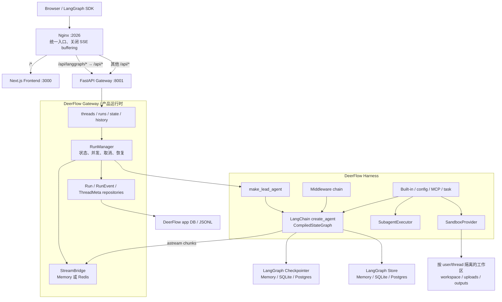
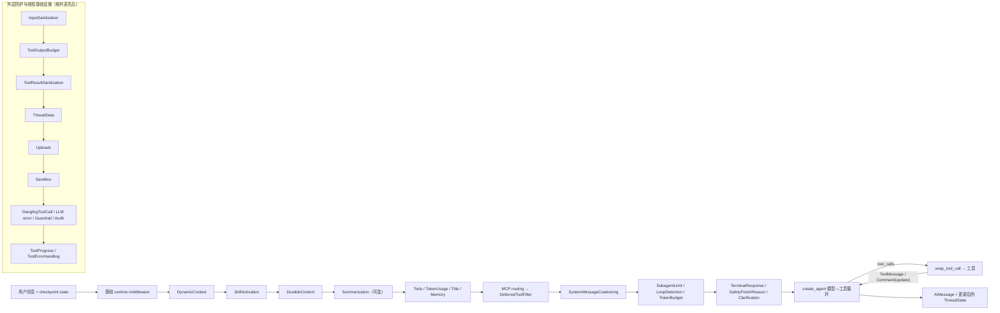
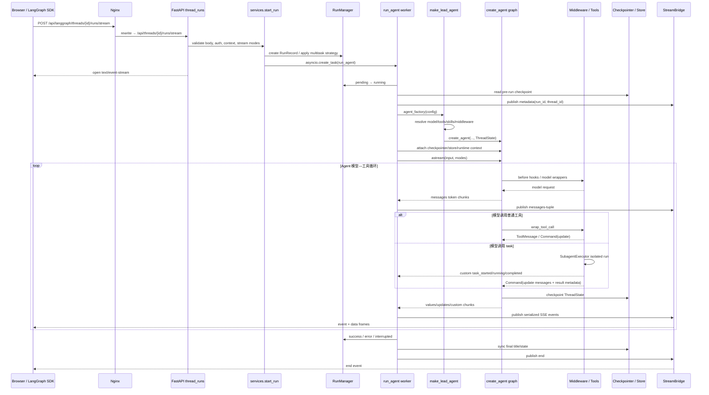

# DeerFlow 官方 `main` 架构阅读基线
> 调研日期：2026-07-13  
> 源码快照：`bytedance/deer-flow` `main`，提交 `2bd0f56a0f5a418d126cb4a18e23001f54ccf024`  
> 资料边界：只使用 DeerFlow 官方 GitHub 仓库源码及仓库内 README/docs；涉及 LangChain/LangGraph 的判断以 DeerFlow 实际 import、调用方式和仓库说明为依据。  
> 用途：为本课程建立“先学 LangGraph Agent 工程，再按层阅读 DeerFlow”的源码地图，而不是复刻 DeerFlow 的全部产品复杂度。

## 1. 执行摘要
当前 DeerFlow 已不是早期的“研究报告 StateGraph 示例”，而是一套以 LangChain `create_agent` 和 LangGraph runtime 为内核、由 DeerFlow Harness 与 FastAPI Gateway 包裹的 Agent 应用平台。最重要的架构事实如下。
1. **默认 Web 部署没有单独运行 LangGraph Server。** Browser 访问 Nginx `:2026`；`/api/langgraph/*` 被改写为 Gateway 的 `/api/*`。FastAPI Gateway 内嵌 compiled graph、RunManager、checkpointer、Store 和 SSE bridge，并自行实现 LangGraph-compatible threads/runs API。[架构说明](https://github.com/bytedance/deer-flow/blob/main/backend/docs/ARCHITECTURE.md) [Nginx 配置](https://github.com/bytedance/deer-flow/blob/main/docker/nginx/nginx.conf) [Gateway 入口](https://github.com/bytedance/deer-flow/blob/main/backend/app/gateway/app.py)
2. **`langgraph.json` 仍是重要的标准入口，但不是默认 Docker 服务入口。** 它把 `lead_agent` 指向 `deerflow.agents:make_lead_agent`，并配置 auth 与 checkpointer factory，供 LangGraph tooling、Studio 或直接 Agent Server 兼容使用；默认 Docker 则启动 `uvicorn app.gateway.app:app`。[`langgraph.json`](https://github.com/bytedance/deer-flow/blob/main/backend/langgraph.json) [Docker Compose](https://github.com/bytedance/deer-flow/blob/main/docker/docker-compose.yaml)
3. **Lead Agent 本质是 LangChain `create_agent` 返回的 compiled LangGraph。** `make_lead_agent(config)` 读取运行配置，解析模型、工具、skills 与 middleware，最后以 `ThreadState` 调用 `create_agent`；DeerFlow 没有手写一套替代 ReAct 的模型—工具循环。[Lead Agent factory](https://github.com/bytedance/deer-flow/blob/main/backend/packages/harness/deerflow/agents/lead_agent/agent.py)
4. **DeerFlow 的核心价值在 Agent Harness，而不是新的图原语。** `ThreadState`、middleware chain、工具策略、subagent executor、sandbox、memory、tracing 都是在 LangChain/LangGraph 扩展点上实现的应用约束。[Harness 目录说明](https://github.com/bytedance/deer-flow/blob/main/backend/README.md)
5. **Gateway compatible 不等于完整复刻 LangGraph Platform。** Gateway 支持 thread/run 创建、stream/wait/join/cancel、state/history、SSE 和常用 stream modes；但 worker 明确不支持 `events` mode，因为它需要 `astream_events()`，而当前 worker 同时依赖 `astream()` 的 `values` 快照。[Run worker](https://github.com/bytedance/deer-flow/blob/main/backend/packages/harness/deerflow/runtime/runs/worker.py)
6. **State、Runtime Context 与持久化各有边界。** `ThreadState` 保存对话及线程内业务状态；Runtime Context 注入 thread/run/user/role/secrets/AppConfig；checkpointer 保存图状态；LangGraph Store 保存跨线程/元数据；DeerFlow SQL/JSONL repository 另存 run、run event、feedback 等产品数据。[ThreadState](https://github.com/bytedance/deer-flow/blob/main/backend/packages/harness/deerflow/agents/thread_state.py) [Run worker](https://github.com/bytedance/deer-flow/blob/main/backend/packages/harness/deerflow/runtime/runs/worker.py) [Runtime bootstrap](https://github.com/bytedance/deer-flow/blob/main/backend/app/gateway/deps.py)
7. **Subagent 是“作为工具调用的隔离 Agent”，不是静态子图。** Lead Agent 调用 `task`；后端创建 `SubagentExecutor`，过滤工具、禁止递归 task、注入父 sandbox/thread/auth context，在隔离 event loop 中执行另一个 `create_agent`，再把结果以 `Command(update={messages: [...]})` 回写主图。[task tool](https://github.com/bytedance/deer-flow/blob/main/backend/packages/harness/deerflow/tools/builtins/task_tool.py) [Subagent executor](https://github.com/bytedance/deer-flow/blob/main/backend/packages/harness/deerflow/subagents/executor.py)
8. **Sandbox 是 provider abstraction，不天然等于安全容器。** `LocalSandboxProvider` 只是带线程路径映射的宿主机文件系统适配，默认禁用 host bash；`AioSandboxProvider` 才通过独立容器/远端 backend 提供更强隔离。[Sandbox security](https://github.com/bytedance/deer-flow/blob/main/backend/packages/harness/deerflow/sandbox/security.py) [Local provider](https://github.com/bytedance/deer-flow/blob/main/backend/packages/harness/deerflow/sandbox/local/local_sandbox_provider.py) [AIO provider](https://github.com/bytedance/deer-flow/blob/main/backend/packages/harness/deerflow/community/aio_sandbox/aio_sandbox_provider.py)
9. **测试资产很强，通用 Agent 评测体系相对较弱。** 仓库有大量 pytest、middleware/contract/integration 测试，以及无 API key 的 Gateway SSE golden replay + 全栈 Playwright replay；可观测性支持 LangSmith 与 Langfuse，但仓库没有一套面向普通 Agent 质量的 LangSmith dataset/evaluator 主线。[单测 workflow](https://github.com/bytedance/deer-flow/blob/main/.github/workflows/backend-unit-tests.yml) [Replay E2E](https://github.com/bytedance/deer-flow/blob/main/.github/workflows/replay-e2e.yml) [Tracing factory](https://github.com/bytedance/deer-flow/blob/main/backend/packages/harness/deerflow/tracing/factory.py)
对课程而言，正确目标不是“复制 DeerFlow”，而是实现一条可运行纵切面：
```text
create_agent + ThreadState + 关键 middleware
→ 工具与 Command 更新
→ task/subagent-as-tool
→ 最小线程工作区与安全 adapter
→ checkpointer/store
→ RunManager + SSE adapter
→ 测试、轨迹评测与源码映射
```
---

## 2. 能力归属：三层而不是一层
### 2.1 LangChain / LangGraph 原生层
以下是 DeerFlow 直接复用的原生能力：
- `langchain.agents.create_agent`：模型—工具循环、middleware graph、compiled graph。
- `AgentState`、`AgentMiddleware` 及 `before_agent`、`before_model`、`after_model`、`after_agent`、`wrap_model_call`、`wrap_tool_call`。
- `ToolRuntime`：向工具注入 `state/context/config/store/tool_call_id`。
- `Command(update=...)`：工具返回消息并更新 graph state。
- reducers：`Annotated[field, reducer]` 合并并行或重复写入。
- checkpointer、Store、`thread_id`、checkpoint history、interrupt config。
- `graph.astream()` 的 `values/messages/custom/...` 流。
这些能力不应被讲成 DeerFlow 发明；DeerFlow 的代码展示了如何把它们组合为真实产品。[Lead Agent](https://github.com/bytedance/deer-flow/blob/main/backend/packages/harness/deerflow/agents/lead_agent/agent.py) [工具 Runtime 类型](https://github.com/bytedance/deer-flow/blob/main/backend/packages/harness/deerflow/tools/types.py)
### 2.2 DeerFlow Harness 自研层
Harness 是可脱离 Web Gateway 使用的 Agent 工程包，核心包括：
- 模型、工具、MCP、skills 与 agent factory；
- `ThreadState` 业务字段和 reducers；
- 生产级 middleware 组合与顺序约束；
- subagent registry/executor/status contract；
- sandbox provider、虚拟路径与工具；
- checkpointer/store factory；
- tracing、memory、uploads、workspace changes；
- 同进程同步 `DeerFlowClient` 与 TUI。
源码边界是 [`backend/packages/harness/deerflow/`](https://github.com/bytedance/deer-flow/tree/main/backend/packages/harness/deerflow)，包说明也明确将它作为 `deerflow-harness` 发布。[Backend README](https://github.com/bytedance/deer-flow/blob/main/backend/README.md)
### 2.3 DeerFlow Gateway / 产品运行时自研层
Gateway 负责网络和产品语义：
- FastAPI auth/authorization/CSRF 与用户隔离；
- LangGraph-compatible thread/run/state/history HTTP 路由；
- RunManager 状态机、并发策略、取消/回滚、worker ownership；
- StreamBridge、SSE、断线续传、跨 worker Redis stream；
- run/event/product persistence；
- uploads、artifacts、skills、MCP、memory 等管理 API。
这不是 LangGraph OSS 自动提供的功能，而是 DeerFlow 为内嵌运行方式实现的兼容服务器。[Gateway routers](https://github.com/bytedance/deer-flow/tree/main/backend/app/gateway/routers) [RunManager](https://github.com/bytedance/deer-flow/blob/main/backend/packages/harness/deerflow/runtime/runs/manager.py) [StreamBridge](https://github.com/bytedance/deer-flow/tree/main/backend/packages/harness/deerflow/runtime/stream_bridge)
---

## 3. 系统架构图

图中 Nginx 路由、Gateway embedded runtime 和默认部署入口均可由官方架构说明与部署文件互相验证。[Architecture](https://github.com/bytedance/deer-flow/blob/main/backend/docs/ARCHITECTURE.md) [Nginx](https://github.com/bytedance/deer-flow/blob/main/docker/nginx/nginx.conf) [Compose](https://github.com/bytedance/deer-flow/blob/main/docker/docker-compose.yaml)
---

## 4. 请求入口、threads/runs 与 SSE
### 4.1 Browser → Nginx → Gateway
Nginx 将 UI、普通 API 和 LangGraph-compatible API 放在同一 origin：
- `/*` → Next.js `frontend:3000`；
- `/api/langgraph/*` → rewrite 为 `/api/*` 后转发 `gateway:8001`；
- 其他 `/api/*` → Gateway；
- SSE 路由关闭 proxy buffering/cache，设置 `X-Accel-Buffering: no`，并使用长超时。
这使前端可把 `/api/langgraph` 当 LangGraph SDK 基础 URL，但后端实际是 DeerFlow Gateway。[Nginx 配置](https://github.com/bytedance/deer-flow/blob/main/docker/nginx/nginx.conf)
### 4.2 LangGraph-compatible 路由范围
Gateway 提供的关键兼容路由包括：
| 语义 | 代表路由 | 实现入口 |
|---|---|---|
| 创建/查找/删除 thread | `POST /api/threads`、`POST /search`、`GET/DELETE /{thread_id}` | [`threads.py`](https://github.com/bytedance/deer-flow/blob/main/backend/app/gateway/routers/threads.py) |
| thread state/history | `GET/POST /{thread_id}/state`、`POST /{thread_id}/history` | [`threads.py`](https://github.com/bytedance/deer-flow/blob/main/backend/app/gateway/routers/threads.py) |
| 创建 run | `POST /{thread_id}/runs` | [`thread_runs.py`](https://github.com/bytedance/deer-flow/blob/main/backend/app/gateway/routers/thread_runs.py) |
| 创建并流式返回 | `POST /{thread_id}/runs/stream` | [`thread_runs.py`](https://github.com/bytedance/deer-flow/blob/main/backend/app/gateway/routers/thread_runs.py) |
| 等待最终状态 | `POST /{thread_id}/runs/wait` | [`thread_runs.py`](https://github.com/bytedance/deer-flow/blob/main/backend/app/gateway/routers/thread_runs.py) |
| join / reconnect | `GET /runs/{run_id}/join`、`GET/POST /runs/{run_id}/stream` | [`thread_runs.py`](https://github.com/bytedance/deer-flow/blob/main/backend/app/gateway/routers/thread_runs.py) |
| cancel / rollback | `POST /runs/{run_id}/cancel?action=interrupt|rollback` | [`thread_runs.py`](https://github.com/bytedance/deer-flow/blob/main/backend/app/gateway/routers/thread_runs.py) |
| 无预建 thread 的 run | `POST /api/runs/stream|wait`，自动生成临时 thread id | [`runs.py`](https://github.com/bytedance/deer-flow/blob/main/backend/app/gateway/routers/runs.py) |
### 4.3 SSE 是两段异步管线
`start_run()` 创建 RunRecord，并用 `asyncio.create_task(run_agent(...))` 启动生产者；`sse_consumer()` 订阅 StreamBridge，格式化 `event: ...\ndata: ...` 帧。HTTP disconnect 时根据 `on_disconnect=cancel|continue` 决定是否取消后台 run。[Gateway services](https://github.com/bytedance/deer-flow/blob/main/backend/app/gateway/services.py)
Worker 把 wire mode `messages-tuple` 映射为 Python graph mode `messages`，然后运行 `agent.astream()`；`values/messages/custom/checkpoints/tasks/debug/updates` 被映射为 SSE 事件。`events` 被显式跳过，不属于当前兼容范围。[Run worker](https://github.com/bytedance/deer-flow/blob/main/backend/packages/harness/deerflow/runtime/runs/worker.py) [Streaming 设计](https://github.com/bytedance/deer-flow/blob/main/backend/docs/STREAMING.md)
StreamBridge 有 memory 与 Redis 实现。Redis 解决跨 worker SSE 传递和 retained stream 重连，但 RunManager 的取消、request dedup 和部分服务仍可能是 worker-local；官方 Compose 因此默认一个 Gateway worker，并要求多 worker 使用 Postgres、heartbeat 和 Redis 前提。[Compose 注释](https://github.com/bytedance/deer-flow/blob/main/docker/docker-compose.yaml) [Runtime bootstrap](https://github.com/bytedance/deer-flow/blob/main/backend/app/gateway/deps.py)
---

## 5. `langgraph.json` 与 Lead Agent factory
`backend/langgraph.json` 声明：
```json
{
  "graphs": {"lead_agent": "deerflow.agents:make_lead_agent"},
  "auth": {"path": "./app/gateway/langgraph_auth.py:auth"},
  "checkpointer": {
    "path": "./packages/harness/deerflow/runtime/checkpointer/async_provider.py:make_checkpointer"
  }
}
```
它体现标准 LangGraph Application contract；Gateway 内嵌路径则在启动时显式创建 checkpointer/store，并在 worker 中把它们挂到 compiled graph 上。[`langgraph.json`](https://github.com/bytedance/deer-flow/blob/main/backend/langgraph.json) [Gateway deps](https://github.com/bytedance/deer-flow/blob/main/backend/app/gateway/deps.py) [Run worker](https://github.com/bytedance/deer-flow/blob/main/backend/packages/harness/deerflow/runtime/runs/worker.py)
`make_lead_agent` 的核心步骤是：
1. 合并 legacy `configurable` 与 LangGraph runtime `context`；
2. 解析用户、model、thinking、plan、subagent、agent profile；
3. 在根 graph config 注入 tracing metadata/callbacks；
4. 加载 enabled skills，并用 skill policy 过滤工具；
5. 从配置工具、内置工具、MCP、ACP 与可选 `task` 组装工具；
6. 将大 MCP 工具集合变成 deferred catalog；
7. 构建 middleware chain 和 system prompt；
8. 调用 `create_agent(model, tools, middleware, system_prompt, state_schema=ThreadState)`。
源码入口是 [`lead_agent/agent.py`](https://github.com/bytedance/deer-flow/blob/main/backend/packages/harness/deerflow/agents/lead_agent/agent.py)。另有一个面向 SDK/嵌入场景的轻量 `create_deerflow_agent()` 工厂，不应与默认产品 Lead Agent 混为同一个入口。[Generic factory](https://github.com/bytedance/deer-flow/blob/main/backend/packages/harness/deerflow/agents/factory.py)
---

## 6. State、reducers 与 Runtime Context
### 6.1 `ThreadState`
`ThreadState` 扩展 LangChain `AgentState`，当前主要字段为：
| 字段 | 含义 | reducer / 写入策略 |
|---|---|---|
| `messages` | Agent 标准消息状态 | 继承 `AgentState` 的消息 reducer |
| `sandbox` | 当前 sandbox id | `merge_sandbox`；只接受幂等同值，并发不同 id fail closed |
| `thread_data` | workspace/uploads/outputs 路径 | 中间件初始化，普通 last-write 语义 |
| `artifacts` | 交付文件路径 | 合并、去重、保持顺序 |
| `todos` | 计划模式任务 | `None` 表示未触碰，显式空列表允许清空 |
| `goal` | 长目标状态 | `None` 保留旧值，否则新值覆盖 |
| `viewed_images` | 已读取图片数据 | merge；显式 `{}` 清空 |
| `promoted` | deferred tools 已提升列表 | catalog hash 变化则替换，同 hash 则有序 union |
| `delegations` | subagent delegation ledger | 按 id 更新；终态不回退；最多 50 条 |
| `skill_context` | 已加载 skill 的耐久引用 | 按 path 去重、限制描述长度、最多 8 条 |
| `summary_text` | 压缩后的会话摘要 | 可选字段 |
这些 reducer 不是装饰性代码：并行工具/子代理可能在一个 superstep 写同一 state key；没有 reducer 会产生竞争或丢失更新。[ThreadState 源码](https://github.com/bytedance/deer-flow/blob/main/backend/packages/harness/deerflow/agents/thread_state.py)
### 6.2 Runtime Context
Gateway worker 为每个 run 构造至少包含 `thread_id`、`run_id`、`app_config` 的 context，并合并白名单 caller context；认证层再加入 `user_id/user_role/oauth_provider/oauth_id`。短期 GitHub token 等 secret 只写 `context`，不写会被 checkpoint 持久化的 `configurable`。[Worker `_build_runtime_context`](https://github.com/bytedance/deer-flow/blob/main/backend/packages/harness/deerflow/runtime/runs/worker.py) [Gateway context merge](https://github.com/bytedance/deer-flow/blob/main/backend/app/gateway/services.py)
由于 Gateway 直接驱动 `agent.astream(config=...)`，它手动创建 `langgraph.runtime.Runtime(context=..., store=...)` 并放入 `configurable["__pregel_runtime"]`，从而让 middleware 与 `ToolRuntime` 获得 context/store。这是内嵌 runtime 的适配细节，不应复制成普通课程应用的业务 API。[Run worker](https://github.com/bytedance/deer-flow/blob/main/backend/packages/harness/deerflow/runtime/runs/worker.py)
### 6.3 必须避免的混淆
- `ThreadState`：当前 thread 的可 checkpoint 状态；
- Runtime Context：本次 run 的身份、配置与依赖；
- Checkpointer：保存 Graph State 的版本历史；
- Store：LangGraph 跨 thread 的 KV/search 数据；
- DeerFlow repositories：run、run_event、feedback、thread metadata 等产品表；
- thread filesystem：workspace/uploads/outputs 与 artifacts。
---

## 7. Agent 内部链与 middleware 顺序
仓库内 `docs/middleware-execution-flow.md` 描述的是较早的 14 项链；当前 `main` 的 `build_middlewares()` 已明显扩展。阅读时应以 factory 源码为准，文档只用于理解 hook 顺序。[当前 factory](https://github.com/bytedance/deer-flow/blob/main/backend/packages/harness/deerflow/agents/lead_agent/agent.py) [历史流程文档](https://github.com/bytedance/deer-flow/blob/main/backend/docs/middleware-execution-flow.md)

核心 hook 例子：
| Middleware | 关键 hook | 作用 |
|---|---|---|
| `ThreadDataMiddleware` | `before_agent` | 按 user/thread 初始化路径，扩展 state schema |
| `UploadsMiddleware` | `before_agent` | 把上传文件信息转成模型上下文 |
| `SandboxMiddleware` | `before_agent/after_agent/wrap_tool_call` | eager/lazy acquire、release，并把 lazy id 通过 `Command` 耐久写回 state |
| `DynamicContextMiddleware` | `before_agent` | 注入当前日期、记忆提醒等动态内容，保持基础 system prompt 可缓存 |
| `DurableContextMiddleware` | `before_model/after_model/wrap_model_call` | 在 summarization 前捕获 delegation/skill，压缩后仍可恢复 |
| `ToolErrorHandlingMiddleware` | `wrap_tool_call` | 把普通异常转为错误 ToolMessage；`GraphBubbleUp` 必须继续抛出 |
| `DeferredToolFilterMiddleware` | `wrap_model_call/wrap_tool_call` | 未 promotion 的 schema 不绑定给模型，且阻止绕过过滤直接调用 |
| `SubagentLimitMiddleware` | `after_model` | 截断超过并发上限的并行 `task` calls |
| `SafetyFinishReasonMiddleware` | `after_model` | provider 安全终止时清除工具调用；其注册位置利用 `after_*` 反序执行 |
基础链的精确构建与 wrapper 外内层关系见 [`tool_error_handling_middleware.py`](https://github.com/bytedance/deer-flow/blob/main/backend/packages/harness/deerflow/agents/middlewares/tool_error_handling_middleware.py)。Sandbox 的 state 扩展和 `Command` 合并见 [`sandbox/middleware.py`](https://github.com/bytedance/deer-flow/blob/main/backend/packages/harness/deerflow/sandbox/middleware.py)。
必须掌握的顺序规则：`before_*` 通常按注册顺序，`after_*` 反向；wrap hook 是洋葱层，列表靠前者为外层。顺序错误会导致未清洗输入进入内层、ToolProgress 看不到错误 metadata、Safety 清工具调用太晚，或 Clarification 失去最后拦截位置。
---

## 8. 工具、MCP、skills 与 deferred discovery
### 8.1 工具注册
`get_available_tools()` 按以下来源组装工具：
1. `config.yaml` 中用 import path 声明的工具；
2. 内置 `present_files / ask_clarification / review_skill_package` 等；
3. runtime 开关控制的 `task`；
4. model supports vision 时加入 `view_image`；
5. 缓存的 MCP tools；
6. ACP agent tool；
7. 按 name 去重，优先级为 config → built-in → MCP → ACP。
LocalSandbox 下 host bash 默认从配置工具中过滤掉；skill allowed-tools policy 会在 deferred catalog 之前再次缩小集合。[工具组装](https://github.com/bytedance/deer-flow/blob/main/backend/packages/harness/deerflow/tools/tools.py) [Skill tool policy](https://github.com/bytedance/deer-flow/blob/main/backend/packages/harness/deerflow/skills/tool_policy.py)
### 8.2 `ToolRuntime` 与 `Command`
所有 DeerFlow 工具统一使用 `Runtime = ToolRuntime[dict[str, Any], ThreadState]`。工具参数 schema 不向模型暴露 runtime，但函数可访问：
- `runtime.state`：当前 `ThreadState`；
- `runtime.context`：thread/run/user/auth/AppConfig；
- `runtime.config`：Runnable config 与 metadata；
- `runtime.store`：LangGraph Store；
- `runtime.tool_call_id`：构造配对 ToolMessage。
返回 `Command(update=...)` 的典型工具包括 `tool_search`、`task`、`view_image`、`present_files` 和 agent setup/update。它们同时写 messages 与业务状态，避免“直接 mutate runtime.state 但 reducer/checkpointer 看不到”的错误。[Runtime alias](https://github.com/bytedance/deer-flow/blob/main/backend/packages/harness/deerflow/tools/types.py) [tool_search](https://github.com/bytedance/deer-flow/blob/main/backend/packages/harness/deerflow/tools/builtins/tool_search.py) [view_image](https://github.com/bytedance/deer-flow/blob/main/backend/packages/harness/deerflow/tools/builtins/view_image_tool.py)
### 8.3 MCP deferred tools
MCP tool 初始化后被缓存并打 `deerflow_mcp` metadata tag。Lead/subagent 在完成 agent/skill policy 过滤后才建立 `DeferredToolCatalog`，因此 catalog 不可能重新暴露已禁止工具。模型最初只看到名称；`tool_search` 根据查询返回完整 schema，并用：
```python
Command(update={
    "promoted": {"catalog_hash": ..., "names": [...]},
    "messages": [ToolMessage(...)],
})
```
把 promotion 写入 thread state。`DeferredToolFilterMiddleware` 随后的 model call 才绑定这些工具。catalog hash 防止 persisted bare name 在工具集合变化后错误指向另一个 schema。[Deferred tool 实现](https://github.com/bytedance/deer-flow/blob/main/backend/packages/harness/deerflow/tools/builtins/tool_search.py) [过滤 middleware](https://github.com/bytedance/deer-flow/blob/main/backend/packages/harness/deerflow/agents/middlewares/deferred_tool_filter_middleware.py)
Skills 与 deferred tools 不同：skill 是 prompt/规则/资源包，通过 prompt metadata、`describe_skill` 或 slash activation 渐进加载；它可声明 allowed tools，进而参与能力授权。不要把 skill 当 Agent，也不要把 MCP tool 当 skill。[Skills 目录](https://github.com/bytedance/deer-flow/tree/main/backend/packages/harness/deerflow/skills) [Lead prompt](https://github.com/bytedance/deer-flow/blob/main/backend/packages/harness/deerflow/agents/lead_agent/prompt.py)
---

## 9. `task` tool 与 Subagent executor
### 9.1 调度契约
`task(description, prompt, subagent_type)` 是 Lead Agent 看见的单一 delegation 工具。Registry 的解析顺序是 built-in → custom config → per-agent overrides；built-in 至少包括 `general-purpose` 和条件可用的 `bash`。[Registry](https://github.com/bytedance/deer-flow/blob/main/backend/packages/harness/deerflow/subagents/registry.py) [Built-ins](https://github.com/bytedance/deer-flow/tree/main/backend/packages/harness/deerflow/subagents/builtins)
执行时它：
1. 校验 subagent type 与 host bash 安全门；
2. 从父 `ToolRuntime` 提取 sandbox、thread_data、thread_id、model、tool groups、skills 与认证 context；
3. 获取工具时强制 `subagent_enabled=False`，禁止递归 delegation；
4. 创建 `SubagentExecutor`，以 tool_call_id 作为 task id；
5. 后台执行并由后端轮询，模型不需要再调用 status tool；
6. 通过 LangGraph custom stream writer 发 `task_started/running/completed/failed`；
7. 返回带结构化 metadata 的 ToolMessage/`Command`。
源码见 [`task_tool.py`](https://github.com/bytedance/deer-flow/blob/main/backend/packages/harness/deerflow/tools/builtins/task_tool.py)。仓库内 `task_tool_improvements.md` 能解释取消 LLM polling 的动机，但其中部分时间间隔描述已落后，应以源码为准。[设计说明](https://github.com/bytedance/deer-flow/blob/main/backend/docs/task_tool_improvements.md)
### 9.2 上下文隔离与共享
Subagent **不会接收完整主对话消息历史**。它的 initial state 主要是自身 system prompt、允许的 skills 和此次 task prompt；这实现 token/context isolation。它会显式继承：
- 父 sandbox state 与 thread_data，因而可在同一线程工作区协作；
- 父 model 或配置的 override；
- 父 tool groups 与 skill allowlist 的交集；
- user/role/oauth/run/channel identity，用于 delegated guardrail；
- trace id 与 token usage callback。
Subagent 自己再次调用 `create_agent(... state_schema=ThreadState, checkpointer=False)`，所以它不是有独立持久化 thread 的长期 Agent；真正长期状态留在 Lead Agent thread。[Executor](https://github.com/bytedance/deer-flow/blob/main/backend/packages/harness/deerflow/subagents/executor.py)
### 9.3 并发、超时与结果契约
- Lead model 可在同一 AIMessage 发多个 `task` tool calls；LangChain tool node 可并行执行，`SubagentLimitMiddleware` 截断超过 `max_concurrent_subagents` 的 calls。[Subagent limit](https://github.com/bytedance/deer-flow/blob/main/backend/packages/harness/deerflow/agents/middlewares/subagent_limit_middleware.py)
- Executor 使用持久隔离 event loop 与后台执行机制，支持 cancel flag、`max_turns`、execution timeout、poll timeout、loop/token caps。[Executor](https://github.com/bytedance/deer-flow/blob/main/backend/packages/harness/deerflow/subagents/executor.py)
- 状态值为 `completed/failed/cancelled/timed_out/polling_timed_out`；另用 `token_capped/turn_capped/loop_capped` 表示 guardrail 截止原因。[Status contract](https://github.com/bytedance/deer-flow/blob/main/backend/packages/harness/deerflow/subagents/status_contract.py)
- 完成结果在 ToolMessage 文本中对模型可见，同时 `additional_kwargs` 带 bounded brief、SHA-256、model 与 token usage；失败则带结构化 error。主状态的 delegation ledger 只保留摘要/引用，避免把大结果反复塞入模型上下文。[Status contract](https://github.com/bytedance/deer-flow/blob/main/backend/packages/harness/deerflow/subagents/status_contract.py) [Delegation reducer](https://github.com/bytedance/deer-flow/blob/main/backend/packages/harness/deerflow/agents/thread_state.py)
---

## 10. Sandbox、线程工作区与安全边界
### 10.1 Provider abstraction
`SandboxProvider` 定义 `acquire/acquire_async/get/release/reset`，并由配置中的 import path 动态选择 provider。Provider 是进程 singleton，但构造/销毁在 lock 外完成，避免 plugin 重入死锁。[Provider interface](https://github.com/bytedance/deer-flow/blob/main/backend/packages/harness/deerflow/sandbox/sandbox_provider.py)
`Sandbox` 抽象统一 command、read/write/list 等文件与执行能力；sandbox tools 不关心背后是宿主路径、Docker sidecar 还是远端 provisioner。[Sandbox interface](https://github.com/bytedance/deer-flow/blob/main/backend/packages/harness/deerflow/sandbox/sandbox.py)
### 10.2 生命周期
`SandboxMiddleware(lazy_init=True)` 默认在第一个需要 sandbox 的工具调用时 acquisition。工具函数会临时写 `runtime.state["sandbox"]`，middleware 对 tool result 做 diff，再包装成 `Command(update={"sandbox": ...})`，确保下一 graph step 和 checkpoint 看得到 id。Agent 结束时 `after_agent` 调 provider `release`。[Sandbox middleware](https://github.com/bytedance/deer-flow/blob/main/backend/packages/harness/deerflow/sandbox/middleware.py)
不同 provider 的 release 语义不同：
- Local：没有资源可释放，release 是 no-op，实例由 LRU/reset/shutdown 清理；
- AIO：关闭当前 host client，把仍运行的容器放入 warm pool；同一 user/thread 的 deterministic id 可在下轮快速 reclaim；容量、idle timeout 或 shutdown 才真正 destroy。
因此“after_agent 调 release”与“跨 turn 复用环境”并不冲突。[Local release](https://github.com/bytedance/deer-flow/blob/main/backend/packages/harness/deerflow/sandbox/local/local_sandbox_provider.py) [AIO release](https://github.com/bytedance/deer-flow/blob/main/backend/packages/harness/deerflow/community/aio_sandbox/aio_sandbox_provider.py)
### 10.3 工作区与隔离
`ThreadDataMiddleware` 按认证 user 与 thread 创建 workspace/uploads/outputs；Local/AIO provider 把它们映射到固定虚拟路径 `/mnt/user-data/...`，使工具逻辑不依赖物理部署。[Thread data middleware](https://github.com/bytedance/deer-flow/blob/main/backend/packages/harness/deerflow/agents/middlewares/thread_data_middleware.py) [Local path mappings](https://github.com/bytedance/deer-flow/blob/main/backend/packages/harness/deerflow/sandbox/local/local_sandbox_provider.py)
安全边界必须明确：
- `LocalSandboxProvider` 不是隔离容器，只是路径映射与访问约束；
- host bash 默认禁用，只有可信本地环境显式 `allow_host_bash` 才开放；
- `AioSandboxProvider` 可使用 Docker/remote backend，隔离更强但仍需管理 mount、network、secret 与 provisioner；
- path scoping、auth user_id、guardrail、read-before-write、input/tool-result sanitization 是多层防御，不应只依赖 prompt。
官方安全判断见 [`sandbox/security.py`](https://github.com/bytedance/deer-flow/blob/main/backend/packages/harness/deerflow/sandbox/security.py)，部署对 Docker socket 与 CLI credential mounts 也采用显式 opt-in。[Docker Compose](https://github.com/bytedance/deer-flow/blob/main/docker/docker-compose.yaml)
---

## 11. Checkpointer、Store、Runs、Events 与 persistence
| 数据面 | 负责内容 | 后端 | 源码入口 |
|---|---|---|---|
| LangGraph Checkpointer | ThreadState、checkpoint history、interrupt/rollback 基础 | memory / SQLite / Postgres | [`runtime/checkpointer`](https://github.com/bytedance/deer-flow/tree/main/backend/packages/harness/deerflow/runtime/checkpointer) |
| LangGraph Store | 跨 thread KV/search；也承载部分 thread metadata fallback | memory / SQLite / Postgres | [`runtime/store`](https://github.com/bytedance/deer-flow/tree/main/backend/packages/harness/deerflow/runtime/store) |
| RunStore / RunManager | run id、status、ownership、abort、model/token summary | memory 或 SQL repo | [`runtime/runs`](https://github.com/bytedance/deer-flow/tree/main/backend/packages/harness/deerflow/runtime/runs) |
| RunEventStore / Journal | 人类/AI/工具事件、LLM usage、subagent steps、审计与 reload history | memory / JSONL / DB | [`runtime/events`](https://github.com/bytedance/deer-flow/tree/main/backend/packages/harness/deerflow/runtime/events) / [`journal.py`](https://github.com/bytedance/deer-flow/blob/main/backend/packages/harness/deerflow/runtime/journal.py) |
| Product repositories | users、feedback、scheduled tasks、thread meta 等 | SQLAlchemy SQLite/Postgres | [`persistence`](https://github.com/bytedance/deer-flow/tree/main/backend/packages/harness/deerflow/persistence) |
| StreamBridge | 活跃 run 的实时/retained SSE chunks，不是最终业务历史 | memory / Redis | [`runtime/stream_bridge`](https://github.com/bytedance/deer-flow/tree/main/backend/packages/harness/deerflow/runtime/stream_bridge) |
统一 `database.backend` 会同时选择 checkpointer 和产品数据库：memory 仅开发；SQLite 单节点；Postgres 多节点。SQLite 模式把 checkpointer 与 app tables 放在同一数据库文件并启用 WAL；Postgres 使用同一 URL 但独立 pools。[Database config](https://github.com/bytedance/deer-flow/blob/main/backend/packages/harness/deerflow/config/database_config.py) [Async checkpointer](https://github.com/bytedance/deer-flow/blob/main/backend/packages/harness/deerflow/runtime/checkpointer/async_provider.py) [Async Store](https://github.com/bytedance/deer-flow/blob/main/backend/packages/harness/deerflow/runtime/store/async_provider.py)
Gateway lifespan 的启动顺序是 StreamBridge → DB engine → checkpointer → Store → repositories → event store → RunManager；关闭时先 drain in-flight runs，再关闭持久连接，避免 checkpoint write 与 pool teardown 竞争。[Gateway runtime bootstrap](https://github.com/bytedance/deer-flow/blob/main/backend/app/gateway/deps.py)
Run worker 在每次执行中：记录 pre-run checkpoint 以支持 rollback；注入 checkpointer/store；流式运行 graph；批量持久化 subagent events；flush journal；同步 title/thread status；最后发布 stream end。Gateway 重启时会把失去 lease 的 in-flight runs 标为 error，并给 retained stream 发布终止信号。[Run worker](https://github.com/bytedance/deer-flow/blob/main/backend/packages/harness/deerflow/runtime/runs/worker.py) [Run recovery](https://github.com/bytedance/deer-flow/blob/main/backend/app/gateway/deps.py)
---

## 12. Tracing、测试与评测
### 12.1 Tracing
DeerFlow 可同时构建 LangSmith `LangChainTracer` 与 Langfuse callback。Callbacks 被挂在 graph invocation root，而内部模型创建必须 `attach_tracing=False`，否则重复 span 且 Langfuse session/user metadata 无法在根 trace 生效。[Tracing factory](https://github.com/bytedance/deer-flow/blob/main/backend/packages/harness/deerflow/tracing/factory.py) [Lead Agent invariant](https://github.com/bytedance/deer-flow/blob/main/backend/packages/harness/deerflow/agents/lead_agent/agent.py)
Gateway 将 thread id 映射为 Langfuse session，user id/assistant/model/environment 进入 trace metadata/tags；RunJournal 作为 callback 捕获 LLM usage、chain lifecycle 和错误 fallback。[Tracing metadata](https://github.com/bytedance/deer-flow/blob/main/backend/packages/harness/deerflow/tracing/metadata.py) [RunJournal](https://github.com/bytedance/deer-flow/blob/main/backend/packages/harness/deerflow/runtime/journal.py)
### 12.2 测试资产
仓库有以下层次：
- 大量 middleware、reducer、tool、provider、auth、persistence 单元测试；
- Gateway router、SSE、cancel/recovery、multi-worker integration tests；
- sandbox providers 与安全开关测试；
- subagent delegation/status/limit/context tests；
- replay golden：记录模型响应，经过真实 Gateway，断言 SSE 事件序列；
- full-stack replay：真实 Next.js + Gateway + replay model + Chromium，断言 DOM 渲染。
CI 主入口见 [backend unit workflow](https://github.com/bytedance/deer-flow/blob/main/.github/workflows/backend-unit-tests.yml)、[Replay workflow](https://github.com/bytedance/deer-flow/blob/main/.github/workflows/replay-e2e.yml) 和 [Replay 设计](https://github.com/bytedance/deer-flow/blob/main/backend/docs/REPLAY_E2E.md)。
### 12.3 当前评测边界
当前仓库更强的是工程回归、协议 contract 和 replay E2E，而不是一套通用的 Agent 质量评测课程。除特定 skill eval assets 外，没有看到以 LangSmith dataset 为中心、系统覆盖 final response/tool selection/trajectory 的核心 Harness eval suite。因此 Mini DeerFlow 应保留 DeerFlow 的 deterministic/replay 思路，同时补充本课程自己的：
- tool selection 与参数 evaluator；
- trajectory subset/order evaluator；
- 最终答案 groundedness/completeness；
- subagent delegation 质量与上下文成本；
- timeout/partial failure/interrupt/resume 的路径测试。
这是根据官方仓库测试与 workflow 结构作出的范围判断，不代表 DeerFlow 不可接入外部评测系统。
---

## 13. 一个请求到流式输出的端到端时序

实现入口依次是 [Nginx](https://github.com/bytedance/deer-flow/blob/main/docker/nginx/nginx.conf) → [`thread_runs.py`](https://github.com/bytedance/deer-flow/blob/main/backend/app/gateway/routers/thread_runs.py) → [`services.py`](https://github.com/bytedance/deer-flow/blob/main/backend/app/gateway/services.py) → [`worker.py`](https://github.com/bytedance/deer-flow/blob/main/backend/packages/harness/deerflow/runtime/runs/worker.py) → [`make_lead_agent`](https://github.com/bytedance/deer-flow/blob/main/backend/packages/harness/deerflow/agents/lead_agent/agent.py)。
---

## 14. DeerFlow 模块映射矩阵
| DeerFlow 模块 | 源码入口 | 核心职责 | 前置概念 | 课程章节落点 | Mini DeerFlow 对应 | 主动省略的复杂度 |
|---|---|---|---|---|---|---|
| Nginx / Web entry | [`docker/nginx/nginx.conf`](https://github.com/bytedance/deer-flow/blob/main/docker/nginx/nginx.conf) | 同源路由、SSE proxy | HTTP、SSE | 部署章 | 开发时直接 FastAPI；可选反代附录 | TLS、复杂 CORS、provisioner proxy |
| Gateway app | [`app/gateway/app.py`](https://github.com/bytedance/deer-flow/blob/main/backend/app/gateway/app.py) | lifespan、routers、auth middleware | FastAPI lifecycle | Runtime/API 章 | `api/app.py` | SSO、IM channels、scheduler |
| Threads API | [`routers/threads.py`](https://github.com/bytedance/deer-flow/blob/main/backend/app/gateway/routers/threads.py) | thread CRUD/state/history/branch | thread/checkpoint | 持久化章 | 最小 create/get/state | 完整搜索、goal、compact 管理 API |
| Runs API | [`thread_runs.py`](https://github.com/bytedance/deer-flow/blob/main/backend/app/gateway/routers/thread_runs.py) | stream/wait/join/cancel | run、async task、SSE | Runtime/API 章 | create/stream/cancel | regenerate、feedback、workspace diff |
| RunManager | [`runtime/runs/manager.py`](https://github.com/bytedance/deer-flow/blob/main/backend/packages/harness/deerflow/runtime/runs/manager.py) | run 状态、并发、cancel、ownership | 状态机、并发控制 | Runtime/API 章 | 进程内 run registry | 多 worker lease/heartbeat/recovery |
| StreamBridge | [`runtime/stream_bridge`](https://github.com/bytedance/deer-flow/tree/main/backend/packages/harness/deerflow/runtime/stream_bridge) | producer/consumer 解耦与重连 | async queue、SSE | Streaming 章 | memory queue | Redis cross-worker 与 TTL 恢复 |
| `langgraph.json` | [`backend/langgraph.json`](https://github.com/bytedance/deer-flow/blob/main/backend/langgraph.json) | 标准 graph/auth/checkpointer exports | LangGraph app structure | 部署章 | 一个 graph export | 多 assistant/auth adapter |
| Lead Agent | [`lead_agent/agent.py`](https://github.com/bytedance/deer-flow/blob/main/backend/packages/harness/deerflow/agents/lead_agent/agent.py) | 解析配置并创建 agent | `create_agent` | Agent 基础章 | `agent.py` factory | bootstrap/custom agents/self-update |
| ThreadState | [`thread_state.py`](https://github.com/bytedance/deer-flow/blob/main/backend/packages/harness/deerflow/agents/thread_state.py) | 线程状态与 reducer | State、reducer | StateGraph 章 | messages/todos/artifacts/delegations | goal、image、skill evolution 细节 |
| Runtime Context | [`worker.py`](https://github.com/bytedance/deer-flow/blob/main/backend/packages/harness/deerflow/runtime/runs/worker.py) | 注入 thread/run/user/config/store | Runtime、DI | Context 章 | `RuntimeContext` TypedDict/dataclass | internal Pregel 兼容注入细节 |
| Middleware composition | [`build_middlewares`](https://github.com/bytedance/deer-flow/blob/main/backend/packages/harness/deerflow/agents/lead_agent/agent.py) | 上下文、治理、可靠性 | AgentMiddleware hooks | Middleware 章 | 4–6 个关键 middleware | 全量 20+ 生产 guards |
| Tools | [`tools/tools.py`](https://github.com/bytedance/deer-flow/blob/main/backend/packages/harness/deerflow/tools/tools.py) | 多来源注册、过滤、去重 | tool schema/runtime | Tools 章 | 本地工具 registry | ACP、全部搜索 provider |
| MCP/deferred | [`mcp`](https://github.com/bytedance/deer-flow/tree/main/backend/packages/harness/deerflow/mcp), [`tool_search.py`](https://github.com/bytedance/deer-flow/blob/main/backend/packages/harness/deerflow/tools/builtins/tool_search.py) | MCP 接入与 schema 渐进披露 | MCP、Command、state | 扩展章 | 1 个 MCP + deferred catalog | OAuth/session pool/routing hints 完整版 |
| Skills | [`skills`](https://github.com/bytedance/deer-flow/tree/main/backend/packages/harness/deerflow/skills) | 发现、加载、权限、演化 | context engineering | Skills 章 | 只读 SKILL.md catalog | installer/reviewer/evolution/user scopes |
| task tool | [`task_tool.py`](https://github.com/bytedance/deer-flow/blob/main/backend/packages/harness/deerflow/tools/builtins/task_tool.py) | delegation 与结果回写 | subagent-as-tool、Command | Multi-agent 章 | 单 `task` 工具 | 全量 progress/usage metadata |
| Subagent runtime | [`subagents`](https://github.com/bytedance/deer-flow/tree/main/backend/packages/harness/deerflow/subagents) | registry、隔离执行、超时与 contract | context isolation | Multi-agent 章 | 两种 stateless subagent | persistent loop、legacy compatibility |
| Sandbox | [`sandbox`](https://github.com/bytedance/deer-flow/tree/main/backend/packages/harness/deerflow/sandbox) | 受控执行与虚拟路径 | capability/security | Sandbox 章 | thread workspace adapter | Docker/K8s warm pool/provisioner |
| Checkpointer/Store | [`runtime/checkpointer`](https://github.com/bytedance/deer-flow/tree/main/backend/packages/harness/deerflow/runtime/checkpointer), [`runtime/store`](https://github.com/bytedance/deer-flow/tree/main/backend/packages/harness/deerflow/runtime/store) | 短期状态与长期数据 | persistence | 持久化章 | SQLite + InMemoryStore | Postgres pools/legacy config |
| Journal/events | [`runtime/journal.py`](https://github.com/bytedance/deer-flow/blob/main/backend/packages/harness/deerflow/runtime/journal.py) | 消息、usage、audit event | callbacks、event sourcing | 观测章 | 结构化运行日志 | 完整 DB/JSONL backends |
| Tracing | [`tracing`](https://github.com/bytedance/deer-flow/tree/main/backend/packages/harness/deerflow/tracing) | LangSmith/Langfuse callbacks | trace/span/metadata | 评测观测章 | LangSmith 可选 tracing | 双 provider metadata 兼容 |
| Tests/replay | [`backend/tests`](https://github.com/bytedance/deer-flow/tree/main/backend/tests), [`REPLAY_E2E.md`](https://github.com/bytedance/deer-flow/blob/main/backend/docs/REPLAY_E2E.md) | deterministic regression 与前后端 contract | fake/replay/e2e | 测试评测章 | pytest + fake model + SSE golden | 全栈 Playwright CI 可作进阶 |
---

## 15. 推荐源码阅读顺序
### 第一层：先找稳定主干
1. [`backend/README.md`](https://github.com/bytedance/deer-flow/blob/main/backend/README.md)：确认 Harness 与 Gateway 目录边界。
2. [`backend/docs/ARCHITECTURE.md`](https://github.com/bytedance/deer-flow/blob/main/backend/docs/ARCHITECTURE.md)：建立系统轮廓，但不要把其中示例 middleware 列表当最新事实。
3. [`backend/langgraph.json`](https://github.com/bytedance/deer-flow/blob/main/backend/langgraph.json)：找到标准 graph factory。
4. [`agents/lead_agent/agent.py`](https://github.com/bytedance/deer-flow/blob/main/backend/packages/harness/deerflow/agents/lead_agent/agent.py)：跟到唯一核心 `create_agent`。
5. [`agents/thread_state.py`](https://github.com/bytedance/deer-flow/blob/main/backend/packages/harness/deerflow/agents/thread_state.py)：理解 Agent 在记什么。
### 第二层：理解 Agent Harness
6. `build_lead_runtime_middlewares()` 与 `build_middlewares()`；
7. 只挑 `ThreadData`、`Sandbox`、`DurableContext`、`ToolErrorHandling`、`DeferredToolFilter` 五个 middleware 深读；
8. [`tools/tools.py`](https://github.com/bytedance/deer-flow/blob/main/backend/packages/harness/deerflow/tools/tools.py) 与 [`tools/types.py`](https://github.com/bytedance/deer-flow/blob/main/backend/packages/harness/deerflow/tools/types.py)；
9. [`tool_search.py`](https://github.com/bytedance/deer-flow/blob/main/backend/packages/harness/deerflow/tools/builtins/tool_search.py) 理解 policy-filter → catalog → promotion；
10. [`task_tool.py`](https://github.com/bytedance/deer-flow/blob/main/backend/packages/harness/deerflow/tools/builtins/task_tool.py) → [`registry.py`](https://github.com/bytedance/deer-flow/blob/main/backend/packages/harness/deerflow/subagents/registry.py) → [`executor.py`](https://github.com/bytedance/deer-flow/blob/main/backend/packages/harness/deerflow/subagents/executor.py)。
### 第三层：理解运行与持久化
11. [`sandbox/middleware.py`](https://github.com/bytedance/deer-flow/blob/main/backend/packages/harness/deerflow/sandbox/middleware.py) → provider interface → Local/AIO 两种实现；
12. [`runtime/checkpointer`](https://github.com/bytedance/deer-flow/tree/main/backend/packages/harness/deerflow/runtime/checkpointer) 与 [`runtime/store`](https://github.com/bytedance/deer-flow/tree/main/backend/packages/harness/deerflow/runtime/store)；
13. [`app/gateway/deps.py`](https://github.com/bytedance/deer-flow/blob/main/backend/app/gateway/deps.py) 看 lifespan 单例和关闭顺序；
14. [`app/gateway/services.py`](https://github.com/bytedance/deer-flow/blob/main/backend/app/gateway/services.py) → [`runtime/runs/worker.py`](https://github.com/bytedance/deer-flow/blob/main/backend/packages/harness/deerflow/runtime/runs/worker.py) → StreamBridge；
15. 最后读 routers、auth、repositories 与前端，避免一开始陷入产品边缘复杂度。
---

## 16. 阅读失败陷阱
1. **把旧 DeerFlow 文章或早期 research graph 当当前架构。** 当前主干是 `create_agent` + middleware + task/subagent，不是固定 planner/researcher/reporter StateGraph。
2. **把 `langgraph.json` 当默认服务进程。** 当前 Docker 默认只启动 Gateway embedded runtime；该文件仍用于标准工具兼容。
3. **把 LangGraph-compatible 当 100% Platform 实现。** 特别是 Gateway 不支持 `events` stream mode，且多 worker 的取消/去重有额外限制。
4. **先读所有 middleware。** 数量多且顺序敏感；应先掌握 hook dispatch，再追五个代表性组件。
5. **相信仓库 docs 中的固定 middleware 数量。** `middleware-execution-flow.md` 已滞后于 `main`；源码 builder 才是事实源。
6. **把 `runtime.state` 原地修改当 state update。** LangGraph reducer/checkpointer只识别节点/工具返回的 update；SandboxMiddleware 特意用 `Command` 修复这个边界。
7. **把 Context 与 configurable 混用。** DeerFlow 为历史兼容会双写部分键，但 secrets 只进 context；新课程代码应优先显式 context schema。
8. **把 `task` 当异步 fire-and-forget。** 对 Lead LLM 而言它是一次会等待最终结果的工具调用；后台执行和轮询属于后端实现。
9. **认为 subagent 拥有独立长期对话。** Executor 明确 `checkpointer=False`，只把结果回传 Lead thread。
10. **认为 LocalSandbox 很安全。** 它不是容器边界；默认禁 host bash 正是官方对此的承认。
11. **把 release 等同 destroy。** AIO release 进入 warm pool，Local release no-op；生命周期语义由 provider 决定。
12. **把 RunEventStore 当 Checkpointer。** 前者服务 UI history/audit/usage，后者服务 graph durable state。
13. **直接复制 Gateway 对 `__pregel_runtime` 的注入。** 这是 embedded compatibility adapter，不是普通 LangGraph 应用推荐接口。
14. **只测试最终回答。** DeerFlow 的工程可靠性来自 middleware、contract、SSE replay 和恢复路径测试；课程还应补 Agent trajectory eval。
---

## 17. Mini DeerFlow 应保留与省略什么
### 必须保留
- 一个 `make_lead_agent(config)`/factory；
- `ThreadState` 与至少 3 个自定义 reducer；
- Runtime Context、checkpointer、Store 的明确边界；
- 4–6 个有代表性的 middleware，并解释顺序；
- 多来源工具 registry、`ToolRuntime` 与 `Command(update=...)`；
- Lead Agent + 单 `task` 工具 + 两类 stateless subagents；
- 子代理上下文裁剪、禁止递归、并发上限、timeout、结构化结果；
- 按 thread 的 workspace 与显式安全边界；
- SQLite checkpointer、本地开发 Store；
- 最小 RunManager、SSE stream/cancel；
- pytest、fake model、trajectory eval 与 SSE golden replay；
- `langgraph.json` 与可导入 Python package。
### 第一版主动省略
- Nginx、完整 Next.js UI；
- SSO/RBAC/CSRF、多租户用户系统；
- IM/GitHub channels、scheduler、goal continuation；
- Redis cross-worker bridge、Postgres lease/heartbeat；
- AIO/Kubernetes sandbox provisioner 与 warm pool；
- 全部 memory modes、skill evolution/reviewer/installer；
- ACP、自定义 agent 管理、模型供应商 patch；
- 大量 search providers 与完整 MCP OAuth/session pool；
- 复杂 token accounting、workspace diff、feedback 产品功能。
省略这些不会破坏学习者理解 DeerFlow 核心 Agent 业务；反而能让第一版聚焦“Graph runtime + Harness + API adapter”的稳定主干。
---

## 18. 对课程改造的直接结论
课程应把 DeerFlow 阅读目标拆为六个可验证台阶：
1. 学习者能解释 `create_agent` 为什么本身就是 compiled LangGraph；
2. 能从 `ThreadState` reducer 预测并行写入结果；
3. 能画出 middleware 的 before/after/wrap 顺序并定位状态扩展；
4. 能实现工具用 `ToolRuntime` 读 context、用 `Command` 写 state；
5. 能实现 Lead Agent 调用隔离 subagent，并说明共享工作区但不共享消息历史；
6. 能从 HTTP run stream 一路跟到 `agent.astream()`、StreamBridge 与 SSE end。
完成 Mini DeerFlow 后，再按本报告第 15 节进入真实源码，学习者看到的将不再是上百个陌生文件，而是已经亲手实现过的模块在生产环境中的扩展版本。
