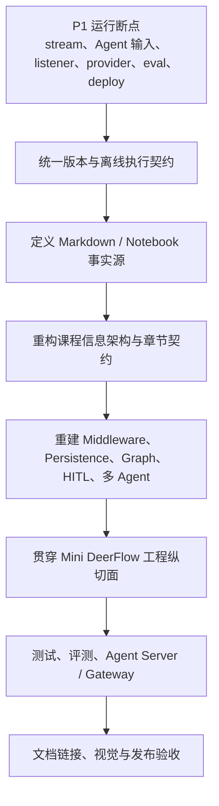

# 现有教程、Notebook 与文档站可执行性审计

> 审计日期：2026-07-13  
> 审计对象：根目录课程说明、9 章 Markdown、9 个 Notebook、附录、Python 依赖、Makefile、GitHub Actions 与 Astro 文档站  
> 审计原则：保留用户当前未提交修改；本报告只记录证据、处置建议和验收条件，不在审计阶段改写教程正文。

## 1. 结论先行

项目已经具备一套中文 LangChain/LangGraph 课程的雏形：前四章有较完整的解释与示例，RAG、工具运行时、Checkpoint、Interrupt、多 Agent、评测和部署等主题也都已经出现。问题不在于“没有内容”，而在于课程的执行契约尚未闭环：

1. **能解析不等于能运行**：43 个 Markdown Python 代码块和全部 Notebook 代码单元都能通过 AST 语法解析，但多个示例在当前锁定环境中会发生导入错误、参数契约错误或静默语义错误。
2. **Markdown 与 Notebook 不是同一份可验证课程**：两者多数章节标题结构几乎没有交集，部分关键 API 在两种载体中一对一矛盾；没有定义谁是事实源，也没有自动同步或一致性检查。
3. **后半程尚未达到课程宣称的完成度**：第 07 章 Notebook 没有构造可运行图，第 08、09 章 Notebook 从未执行；README 却将所有章节标为完成。
4. **核心教学语义需要校准**：`MemorySaver` 被描述成长久持久化，静态翻译路由被称为 Supervisor，多处把 `create_agent` 描述成应该“摆脱”的黑盒；这些表述会妨碍学习者理解当前 LangGraph 与 DeerFlow。
5. **工程护栏缺失**：`make test` 实际不运行测试，仓库没有 Python CI、Notebook 执行检查、导入冒烟测试、文档链接检查或版本漂移检查。
6. **文档站可以构建，但发布后存在断链**：干净安装后 Astro 构建成功，然而生成站点中的 8 个课程链接失效，GitHub 编辑链接拼接错误，社交链接仍指向上游模板。

因此，本项目不应删减成一套短教程，而应采用“**保留有效原理和实验 → 修复运行契约 → 迁移过期内容 → 补齐工程纵切面**”的方式重构。

## 2. 审计方法与口径

### 2.1 严重度

| 级别 | 定义 | 本项目处置要求 |
|---|---|---|
| P0 | 会造成安全事故、不可逆数据损坏或完全错误的项目方向 | 当前未发现 |
| P1 | 核心示例不可运行、输入被静默忽略，或关键概念与真实运行语义相反 | 进入下一版本前必须修复，并增加自动回归 |
| P2 | 重要工程缺口、载体漂移、过时路径或容易导致错误心智模型的表达 | 对应章节重构时必须处理 |
| P3 | 链接、措辞、性能、结构或维护体验问题 | 在发布验收前处理 |

### 2.2 内容处置词汇

- **保留**：原理和示例仍适合作为主线，只需补测试或边界说明。
- **修正**：教学位置合理，但代码、事实、输入输出契约或措辞必须更新。
- **迁移**：内容仍有教学价值，但不应继续占据当前章节的主线位置，应移动到附录、前置章或兼容说明。
- **删除**：当前路径已退出主线、重复且无额外价值，或会持续误导；删除的是错误路径，不是对应知识点。

### 2.3 已执行的检查

- 盘点 9 章 Markdown 与 9 个 Notebook 的代码单元、执行计数和存储输出。
- 对 Markdown 中 43 个 Python fenced code block 做去缩进后的 AST 解析。
- 对所有 Notebook code cell 做 AST 解析。
- 在项目当前 `.venv` 中执行关键导入冒烟检查。
- 用最小图和 fake model 复现流式事件、listener 回调与 Agent 输入契约。
- 检查 README、`pyproject.toml`、`uv.lock`、`.env.example`、Makefile、GitHub Actions。
- 在临时干净目录运行 `npm ci && npm run build`，并检查生成 HTML 的本地链接。
- 检查文档生成脚本、编辑链接和模板遗留配置。

## 3. 全局基线

### 3.1 章节与执行状态

| 章节 | Markdown 行数 | Markdown Python 块 | Notebook code cell | 有执行计数 | 存储错误 | 判断 |
|---|---:|---:|---:|---:|---:|---|
| 01 Getting Started | 298 | 8 | 8 | 8 | 0 | 可保留，需补运行边界 |
| 02 Structured Output | 206 | 7 | 7 | 7 | 0 | 可保留，需接入 Agent 主线 |
| 03 RAG 2.0 | 251 | 8 | 8 | 3 | 1 | P1：供应商配置与执行失败 |
| 04 Smart Tooling | 182 | 7 | 7 | 6 | 0 | P1：v2 流式契约错误 |
| 05 Agent Middleware | 124 | 6 | 6 | 5 | 0 | P1/P2：标题与实际内容不符 |
| 06 Observability & Persistence | 87 | 9 | 9 | 3 | 0 | P1：Agent 输入和持久化语义错误 |
| 07 StateGraph | 101 | 3 | 3 | 0 | 0 | P1：Notebook 未形成可运行图 |
| 08 Engineering Defense | 131 | 5 | 5 | 0 | 0 | P1/P2：未验证，HITL 路径过时 |
| 09 Multi Agent & Eval | 124 | 4 | 4 | 0 | 0 | P1：评测/部署导入失败，架构命名失真 |

“有执行计数”只代表 Notebook 曾在某个环境执行过，不能证明当前锁文件、当前 API 或当前输入配置下仍然可运行。第 04 章就是反例：Notebook 保存了旧输出，但同样的 v2 解包代码在当前环境会失败。

### 3.2 版本事实并不统一

| 位置 | 声明或实际解析结果 |
|---|---|
| README | `langchain==1.2.14`、`langgraph==1.1.4` |
| `pyproject.toml` | `langchain>=1.2.14`，未直接声明被大量导入的 `langgraph` |
| `uv.lock` | `langchain 1.2.14`、`langgraph 1.1.4`、`langchain-core 1.2.23`、`langsmith 0.7.23` |
| 当前 `.venv` | `langchain 1.2.15`、`langgraph 1.1.6`、`langchain-core 1.2.28`、`langsmith 0.7.29` |
| 2026-07-13 官方基线 | `langchain 1.3.13`、`langgraph 1.2.9`、`langchain-core 1.4.9`、`langsmith 0.10.2` |

详细的官方版本与能力判断见[官方生态能力基线](./01-official-ecosystem-baseline.md)。本审计的结论不是“立即升级到最新版”，而是：

- 课程必须明确一个**已验证主版本组**；
- 直接使用的包必须直接声明；
- README 不应把宽范围依赖称为精确环境；
- CI 必须同时验证锁定环境和有意选择的兼容边界。

### 3.3 Markdown 与 Notebook 缺少同步契约

逐章对比一级到三级标题，Markdown 与 Notebook 的标题重合通常只有 0 或 1 个。这说明两者目前是两套手工维护的叙事，而不是“正文 + 可执行镜像”。这本身不一定错误，但仓库没有定义以下问题：

- Markdown 是事实源，还是 Notebook 是事实源？
- 代码示例是否必须相同，还是 Notebook 允许成为更短的实验册？
- 哪些单元必须离线执行，哪些单元需要 API key？
- 供应商集成单元失败时，如何与主线单元区分？
- 章节更新后，谁负责发现另一个载体的 API 漂移？

当前已经出现实际矛盾：第 04 章两个载体共同使用错误 v2 解包；第 05 章 Markdown listener 签名错误而 Notebook 正确；第 06 章 Markdown 使用错误 Agent 输入而 Notebook 正确；第 09 章两边分别使用两套都已失效的评测导入。

建议在课程信息架构任务中选择一种契约：

1. Markdown 为解释事实源，Notebook 从标记代码块生成；或
2. Markdown 与 Notebook 分工，但为每个关键概念维护共享的可导入示例模块和测试。

不建议继续复制粘贴两套完整代码。

## 4. 可复现的 P1 运行问题

### 4.1 第 04 章：v2 stream 不是二元组

当前代码使用：

```python
async for chunk, metadata in file_agent.astream(
    {"messages": [{"role": "user", "content": "列出所有文件"}]},
    stream_mode=["messages", "updates"],
    version="v2",
):
    ...
```

当前 v2 返回稳定的事件 envelope，形状类似：

```python
{"type": "updates", "ns": (), "data": {...}}
```

可用最小图复现：

```bash
uv run python - <<'PY'
from typing_extensions import TypedDict
from langgraph.graph import StateGraph, START, END

class S(TypedDict):
    value: int

g = StateGraph(S)
g.add_node("inc", lambda s: {"value": s["value"] + 1})
g.add_edge(START, "inc")
g.add_edge("inc", END)
graph = g.compile()

for chunk, metadata in graph.stream(
    {"value": 0}, stream_mode=["updates"], version="v2"
):
    print(chunk, metadata)
PY
```

实际结果：`ValueError: too many values to unpack (expected 2)`。

处置：**修正**第 04 章 Markdown 与 Notebook，统一使用 `part["type"]`、`part["ns"]`、`part["data"]`；第 01 章已经使用 envelope，应抽成全课程统一的流式事件契约与回归测试。

### 4.2 第 05 章：listener 回调签名错误且会静默破坏观测

Markdown 定义 `def on_end(run, output)`，而 `with_listeners` 的 end listener 接收一个 run 对象。最小复现：

```bash
uv run python - <<'PY'
from langchain_core.runnables import RunnableLambda

def bad_on_end(run, output):
    print(output)

runnable = RunnableLambda(lambda x: x + 1).with_listeners(on_end=bad_on_end)
print(runnable.invoke(1))
PY
```

运行时记录：

```text
Error in RootListenersTracer.on_chain_end callback:
TypeError("bad_on_end() missing 1 required positional argument: 'output'")
```

主 Runnable 仍然返回结果，因此这不是显眼的业务失败，而是更危险的“观测静默失效”。Notebook 使用一个参数，进一步证明载体已经漂移。

处置：**修正**签名；将 Runnable listener/fallback 内容**迁移**到 Runnable 基础或附录；第 05 章主线重建为真正的 `AgentMiddleware`、`before_model`、`wrap_model_call`、`wrap_tool_call` 和 middleware ordering。

### 4.3 第 06 章：`{"input": ...}` 被 Agent 静默忽略

默认 `create_agent` state 以 `messages` 作为对话输入。传入未声明的 `input` 字段不会稳定地把用户问题转成 HumanMessage。使用 fake model 可验证输出中没有用户消息：

```bash
uv run python - <<'PY'
from langchain.agents import create_agent
from langchain_core.language_models.fake_chat_models import GenericFakeChatModel
from langchain_core.messages import AIMessage

agent = create_agent(GenericFakeChatModel(messages=iter([AIMessage(content="ok")])), tools=[])
result = agent.invoke({"input": "我的名字是张三"})
print([(type(m).__name__, m.content) for m in result["messages"]])
PY
```

输出只包含 `AIMessage('ok')`，没有 `HumanMessage`。这意味着示例可能“看起来有结果”，但用户查询根本没有进入模型上下文。

处置：**修正**为标准 `messages` 输入，并增加断言“最终 state 必须包含用户消息”；Notebook 的写法可以作为正确基线。

### 4.4 第 09 章：评测导入路径均不可用

Markdown：

```python
from langsmith.evaluation import evaluate, LangChainStringEvaluator
```

Notebook：

```python
from langchain.smith import RunEvalConfig, run_on_dataset
```

当前环境复现：

```bash
uv run python - <<'PY'
checks = [
    "from langsmith.evaluation import evaluate, LangChainStringEvaluator",
    "from langchain.smith import RunEvalConfig, run_on_dataset",
]
for statement in checks:
    try:
        exec(statement)
        print("OK", statement)
    except Exception as exc:
        print(type(exc).__name__, exc)
PY
```

分别得到 `ImportError` 和 `ModuleNotFoundError`。评测代码又被注释，因此当前章节没有一个实际执行的 dataset/evaluator 实验。

处置：旧导入**删除**出主线；评测知识点**保留并重建**，使用当前支持的 `Client.evaluate()` 或 `langsmith.evaluate()`，提供本地确定性 evaluator 和可选在线 LLM-as-judge 两层实验。

### 4.5 第 09 章：LangServe 路径无法导入且已退出当前主线

章节使用：

```python
from fastapi import FastAPI
from langserve import add_routes
```

项目没有声明 FastAPI 和 LangServe，当前环境导入失败。更重要的是，LangServe 仓库已于 2026-05-05 归档，不应再作为“当前 LangGraph 一键生产级 API”的主线。详见[官方生态能力基线](./01-official-ecosystem-baseline.md)。

处置：LangServe 主线路径**删除**；若保留，只能迁移到“历史兼容方案”。部署主线改成 `langgraph.json + Agent Server/SDK`，贯穿项目另实现最小 thread/run/SSE Gateway，以帮助学习者理解 DeerFlow 的产品运行时边界。

## 5. 逐章审计与处置矩阵

### 5.1 README 与课程入口

相关文件：[README](../../../README.md)、[pyproject.toml](../../../pyproject.toml)、[uv.lock](../../../uv.lock)

| 严重度 | 问题 | 证据 | 处置 |
|---|---|---|---|
| P1 | 所有章节均标为完成，与实际执行状态不符 | 07–09 Notebook 无执行计数；07 没有可运行图；09 关键导入失败 | **修正**状态为“已验证 / 草稿 / 待迁移”，由自动验收产生徽标或表格 |
| P2 | “2026 最新”“教科书级严谨”等绝对表述无法由仓库证明 | 当前官方版本已高于 README，且关键示例失败 | **修正**为“在某日期、某版本组验证”，减少不可验证营销措辞 |
| P2 | 学习路线从主题罗列跳到架构能力不足 | 缺少 Context/State/Store、Middleware、durable execution、Subagent、Agent Server 的连续主线 | **重组**入口，以能力地图和 Mini DeerFlow 增量为导航 |
| P2 | 安装说明与依赖事实不一致 | README 精确版本、pyproject 宽范围、lock 和 venv 四套事实 | **修正**安装、锁文件和升级策略 |

保留：中文定位、先修要求、章节导航、当前的渐进学习意图。  
迁移：把详细环境故障排查移到附录或 `CONTRIBUTING.md`。  
删除：无法持续证明的“永远”“彻底”“最新”“一键生产级”等绝对承诺。

### 5.2 第 01 章：Getting Started

相关文件：[Markdown](../../../tutorials/01_Getting_Started.md)、[Notebook](../../../tutorials/01_Getting_Started.ipynb)

总体判断：**主干保留，补强运行与测试契约**。本章是现有课程最接近可作为基线的一章，并且已经正确展示 v2 event envelope。

| 严重度 | 问题 | 建议 |
|---|---|---|
| P2 | 示例高度依赖真实 DeepSeek key，缺少离线替代 | 增加 fake chat model 的离线单元；把供应商调用标为 integration |
| P2 | `full_response`、usage metadata、finish reason 等字段依赖 provider | 明确这些字段是可选能力，示例使用 `.get()` 并展示 capability detection |
| P2 | 对 streaming 只展示成功路径 | 增加取消、超时、provider error、空 token 与 tool event 的失败实验 |
| P3 | 版本说明易随时间失效 | 链接到仓库统一的版本矩阵，不在章节复制“最新版” |

保留：消息模型、`init_chat_model`、invoke/stream、`create_agent` 的第一印象。  
修正：供应商配置、可选字段与错误处理。  
迁移：复杂的 raw response/provider 差异可进入附录。  
删除：无。

### 5.3 第 02 章：Structured Output

相关文件：[Markdown](../../../tutorials/02_Structured_Output.md)、[Notebook](../../../tutorials/02_Structured_Output.ipynb)

总体判断：**大部分保留，但要从“模型技巧”接入 Agent 契约**。

| 严重度 | 问题 | 建议 |
|---|---|---|
| P2 | 主要停留在模型结构化输出，没有说明 Agent 的 `response_format` | 对比模型 structured output、tool calling 与 Agent final response contract |
| P2 | 成功示例多，缺少 validation error、缺字段、重试和 provider 不支持 | 增加确定性失败单元与边界测试 |
| P2 | Schema 只作为输出类型，没有进入后续工具/子代理结果契约 | 让 schema 在 Mini DeerFlow 中复用为 planner/subagent handoff 类型 |
| P3 | Markdown 与 Notebook 的叙事结构不一致 | 用共享示例模块或生成契约消除漂移 |

保留：Pydantic、TypedDict、JSON schema 和结构化结果解析。  
修正：失败模式、重试语义与 provider 差异。  
迁移：单纯格式化技巧放到补充实验。  
删除：无。

### 5.4 第 03 章：RAG 2.0

相关文件：[Markdown](../../../tutorials/03_RAG_2.0.md)、[Notebook](../../../tutorials/03_RAG_2.0.ipynb)、[知识样本](../../../tutorials/knowledge.txt)

总体判断：**索引与检索内容值得保留，但当前不是可复现章节，也没有成为 Agent 工具**。

| 严重度 | 问题 | 证据 | 建议 |
|---|---|---|---|
| P1 | Notebook 保存了真实执行错误 | OpenAI client 报 `api_key` 未设置，只有 3/8 code cell 执行 | 修复后清除错误输出并从头执行 |
| P1 | 使用 `BAILIAN_API_KEY`，但 `.env.example` 未声明 | Notebook 显式读取该变量 | 补配置契约，或将百炼作为可选 integration profile |
| P1 | 当前主线无法离线执行 embedding/vector store | 首次 provider 单元失败后后续均未执行 | 增加确定性 fake embeddings/内存检索基础实验 |
| P2 | `langchain.indexes` 已不可导入 | 当前实现应从 `langchain_classic.indexes` 导入 | 迁移导入，并说明 classic 边界与未来替换策略 |
| P2 | Notebook 会覆盖跟踪中的 `knowledge.txt` | `Path('knowledge.txt').write_text(...)` | 使用 fixture/临时目录，不让实验修改课程源文件 |
| P2 | RAG 没有接入 `create_agent` 工具循环 | 章节结束在 retriever/query | 增加 retriever tool，并在后续 Lead Agent 中复用 |
| P2 | 索引会产生 Chroma 和 SQLite 副作用 | `./chroma_db`、`record_manager_cache.sql` | 显式使用工作目录、清理 fixture 和幂等测试；`.gitignore` 已覆盖产物 |

保留：文档加载、切分、增量索引、向量检索与 metadata。  
修正：embedding 配置、导入路径、工作目录、失败输出。  
迁移：具体百炼配置进入供应商附录。  
删除：直接覆盖仓库 `knowledge.txt` 的实验方式。

### 5.5 第 04 章：Smart Tooling

相关文件：[Markdown](../../../tutorials/04_Smart_Tooling.md)、[Notebook](../../../tutorials/04_Smart_Tooling.ipynb)

总体判断：**工具与 runtime context 是主线资产，但流式示例必须立即修复**。

| 严重度 | 问题 | 建议 |
|---|---|---|
| P1 | Markdown 与 Notebook 都把 v2 event 解包成 `(chunk, metadata)` | 改用 event envelope，并复用第 01 章事件解析器 |
| P2 | `ToolRuntime` 导入来源不统一 | 课程规范统一使用当前公开入口 `langchain.tools.ToolRuntime` |
| P2 | 权限示例只展示通过路径 | 增加拒绝、缺失身份、工具异常、审计记录和不可泄露字段测试 |
| P2 | `InjectedState`/低层注入与 runtime context 的边界不清 | 明确身份、依赖、secret 放 Context；线程内可变业务事实才放 State |
| P2 | 工具返回与 state 更新缺少 `Command` | 增加 tool → `Command(update=...)`，为 DeerFlow reducer/middleware 铺路 |

保留：工具 schema、ToolRuntime、权限意识和文件工具主题。  
修正：stream v2、公开导入入口和失败路径。  
迁移：`InjectedState` 作为底层兼容/进阶内容。  
删除：无。

### 5.6 第 05 章：Agent Middleware

相关文件：[Markdown](../../../tutorials/05_Agent_Middleware.md)、[Notebook](../../../tutorials/05_Agent_Middleware.ipynb)

总体判断：**章节标题应保留，主体必须重建；现有 Runnable 内容不应丢失**。

| 严重度 | 问题 | 建议 |
|---|---|---|
| P1 | Markdown listener 回调签名错误 | 修正并增加观测回调回归测试 |
| P1 | `ChatOpenAI(model="deepseek-chat")` 未配置 DeepSeek endpoint/key | 使用统一 model factory 或显式 provider profile |
| P2 | 全章没有真正的 `AgentMiddleware` | 重建 `before_model`、`after_model`、`wrap_model_call`、`wrap_tool_call` |
| P2 | Runnable listener、fallback、redaction 被当作 Agent middleware | 建立“Runnable lifecycle vs Agent middleware”对照表 |
| P2 | 使用阻塞式 `input()` 做人工审批 | 迁移到第 08 章 durable interrupt；这里只讲策略钩子 |
| P2 | 没有 middleware 顺序、短路、异常传播与 state patch | 以 4–6 个 Mini DeerFlow middleware 做组合实验 |

保留：横切关注点、fallback、观测、脱敏的动机。  
修正：listener 签名与模型配置。  
迁移：Runnable primitives 移到前置基础或附录，作为 middleware 的实现背景。  
删除：把阻塞 `input()` 称作工程级 HITL 的表述。

### 5.7 第 06 章：Observability & Persistence

相关文件：[Markdown](../../../tutorials/06_Observability_Persistence.md)、[Notebook](../../../tutorials/06_Observability_Persistence.ipynb)

总体判断：**概念位置正确，但核心示例和长期记忆叙述必须重写**。

| 严重度 | 问题 | 建议 |
|---|---|---|
| P1 | Markdown 用 `{"input": ...}` 调用默认 AgentState | 改为 `messages` 并断言用户消息进入 state |
| P1 | 把 `MemorySaver` 描述成重启后仍存在的长期记忆 | 明确它只在进程内；持久实验改用 SQLite/Postgres checkpointer |
| P1 | 混淆 checkpointer 与 long-term Store | 分开解释 thread state、checkpoint、cross-thread Store 与业务数据库 |
| P2 | “生产级系统”表述没有运行时证据 | 增加 durability mode、thread_id、恢复、幂等和故障注入后再谈生产边界 |
| P2 | LangSmith 只有概念和环境变量，没有可执行观测验收 | 提供可选 integration test，并让本地 event/log 测试不依赖云服务 |
| P2 | 没有 checkpoint schema/version/migration 讨论 | 增加状态演进与兼容失败实验 |

保留：thread_id、checkpoint、可观测性的必要性。  
修正：输入、MemorySaver 语义、持久化层次与绝对表述。  
迁移：LangSmith UI 操作细节进入可选观测实验。  
删除：“重启 Notebook 后 MemorySaver 仍保留记忆”等错误结论。

### 5.8 第 07 章：StateGraph

相关文件：[Markdown](../../../tutorials/07_StateGraph.md)、[Notebook](../../../tutorials/07_StateGraph.ipynb)

总体判断：**保留 State/Reducer 入门，但从未完成的骨架重建为可运行 Graph 课程**。

| 严重度 | 问题 | 建议 |
|---|---|---|
| P1 | Notebook 只创建 `StateGraph(State)`，没有 node、edge、compile、invoke | 实现完整最小图并从头执行 |
| P1 | 章节宣称构造完整 ReAct，但没有可验证 agent loop | 加入模型节点、工具节点、条件边和终止条件，测试循环上限 |
| P2 | 缺少 `Command`、`Send`、并行 fan-out/fan-in 和 retry | 用 planner/researcher 合作图渐进展示 |
| P2 | 缺少 reducer 冲突、覆盖与非交换更新失败实验 | 用消息、artifact、todo 三种 reducer 对比 |
| P2 | “彻底告别 create_agent 黑盒”与当前生态/DeerFlow 不符 | 改为“理解并扩展 create_agent 下层图运行语义” |
| P2 | 没有 Functional API 的选择边界 | 补 Graph API vs Functional API 决策表和最小对照实验 |

保留：State、TypedDict、Reducer、node/edge 基础解释。  
修正：章节承诺与 `create_agent` 的关系。  
迁移：手写完整 ReAct 可作为深挖实验，不应成为所有业务的默认建议。  
删除：未完成代码占位符作为正式实验的状态。

### 5.9 第 08 章：Engineering Defense

相关文件：[Markdown](../../../tutorials/08_Engineering_Defense.md)、[Notebook](../../../tutorials/08_Engineering_Defense.ipynb)

总体判断：**安全、HITL、time travel 都要保留，但应使用 durable execution 的当前语义重建**。

| 严重度 | 问题 | 建议 |
|---|---|---|
| P1 | Notebook 5 个 code cell 均未执行 | 建立离线可执行路径并保存成功输出 |
| P1 | 主线使用静态 `interrupt_before`，恢复只传 `None` | 改为动态 `interrupt()` + `Command(resume=...)` |
| P2 | 没有 approve/edit/reject 结果契约 | 使用结构化恢复 payload，并测试三条分支 |
| P2 | 没有解释恢复会重新执行节点前半段 | 增加幂等、副作用分离和重复调用失败实验 |
| P2 | 权限/身份 token 放进 Graph State | 身份、secret、依赖优先放 Runtime Context；State 只放需 checkpoint 的业务事实 |
| P2 | 缺少多 interrupt、并行任务与顺序匹配规则 | 增加至少一个多中断实验和恢复顺序图 |
| P2 | 安全只表现为 prompt/tool 参数检查 | 补 sandbox 边界、路径穿越、网络策略、secret redaction 与审计日志 |

保留：HITL、权限、time travel、防御思维。  
修正：interrupt 恢复模式、身份位置与幂等语义。  
迁移：静态 breakpoint 作为调试工具，不作为业务审批主线。  
删除：把单一参数检查称为“彻底解决数据不出库”等绝对结论。

### 5.10 第 09 章：Multi Agent、Eval 与 Deploy

相关文件：[Markdown](../../../tutorials/09_Multi_Agent_Eval.md)、[Notebook](../../../tutorials/09_Multi_Agent_Eval.ipynb)

总体判断：**主题必须保留，但当前三个主题都没有形成可执行的现代实现，应拆分重建**。

| 严重度 | 问题 | 建议 |
|---|---|---|
| P1 | 4 个 Notebook code cell 均未执行 | 拆成离线 multi-agent/eval 与可选 deploy integration |
| P1 | 两套评测 API 均无法导入 | 迁移到当前 LangSmith evaluate API，并真正执行小数据集 |
| P1 | FastAPI/LangServe 不在依赖中，LangServe 已归档 | 主线迁移到 Agent Server；Gateway 单独实现最小纵切面 |
| P1 | DeepSeek 模型用 `model_provider="openai"`，但未显式传 DeepSeek key | 统一 model factory，验证 env var 与 base_url 的组合 |
| P2 | 静态语言路由被称为 Supervisor/Multi-Agent | 改名为“条件子图路由入门”，不要冒充 supervisor |
| P2 | 没有 subagent-as-tool、上下文隔离和结果契约 | 实现 task tool + 两个无 checkpoint subagent |
| P2 | 没有并行、handoff、失败传播、预算或循环上限 | 使用 `Send`/tool fan-out 和结构化 subagent result 测试 |
| P2 | eval、deploy 与 multi-agent 挤在一章，均停在片段 | 拆成多 Agent、评测、运行时交付三个可独立验收模块 |

保留：多 Agent 分工、评测优先、服务化交付的课程位置。  
修正：架构名称、provider 配置、上下文和结果边界。  
迁移：现有翻译 router 作为 subgraph/conditional edge 最小示例。  
删除：旧 LangSmith 导入与 LangServe 主线代码。

### 5.11 附录

相关文件：[APPENDIX](../../../APPENDIX.md)

总体判断：**保留 Runnable、stream、错误处理等参考价值，但需要与主线术语同步**。

- 保留 Runnable composition、sync/async、streaming 和常见故障的快速查询定位。
- 修正“同步 stream 一定阻塞整个 event loop”等缺少调用上下文的绝对表述。
- 增加 legacy/current/preview API 标签，避免附录成为旧 API 的藏身处。
- 把从第 05 章迁移出的 listener、fallback、Runnable lifecycle 放入本附录，并说明它们和 AgentMiddleware 的关系。
- 删除重复 README 的安装和营销性段落，附录只保留可检索参考。

## 6. 供应商与环境配置审计

### 6.1 当前问题

- `.env.example` 只定义 OpenAI 和 DeepSeek，RAG Notebook 却要求 `BAILIAN_API_KEY`。
- 第 05 章 Markdown 用 DeepSeek 模型名调用默认 OpenAI endpoint。
- 第 08、09 章 Notebook 使用 OpenAI-compatible DeepSeek base URL，却没有显式传 `DEEPSEEK_API_KEY`；OpenAI provider 默认读取 `OPENAI_API_KEY`，会产生错 key、缺 key或意外计费边界。
- 教程没有区分“离线核心验收”和“真实供应商集成验收”，导致没有 key 的学习者无法判断是代码错误还是环境缺失。

### 6.2 建议契约

课程统一通过一个 model/embedding factory 读取 profile：

```text
offline      -> fake chat model + deterministic embeddings
deepseek     -> DEEPSEEK_API_KEY + explicit base_url
openai       -> OPENAI_API_KEY + official endpoint
bailian      -> BAILIAN_API_KEY + explicit compatible endpoint
```

- 每个章节的核心原理必须能在 `offline` profile 下运行。
- 真实 provider 单元标记为 `integration`，缺 key 时明确 skip，而不是保存失败输出。
- secret 只从环境或 Runtime Context 注入，不进入 checkpointed state、Notebook 输出或追踪 payload。
- README 记录测试过的 profile，不承诺所有 OpenAI-compatible 服务行为一致。

## 7. 测试、Makefile 与 CI 审计

### 7.1 `make test` 当前是假成功

Makefile 使用 `[ -f "pytest" ]` 判断是否存在测试工具。`pytest` 通常是命令或包，不是仓库根目录中的文件，因此运行：

```bash
make test
```

只输出：

```text
No tests configured yet.
```

仓库同时没有 pytest 依赖、pytest 配置和测试目录。当前“测试通过”不能证明任何课程代码可运行。

处置：**删除假成功逻辑**；没有测试时命令应失败，或者在建立真实测试后固定运行 `uv run pytest`。

### 7.2 CI 只有文档部署

现有 GitHub Actions 只构建和部署文档站，没有：

- Python lock/依赖一致性检查；
- 代码块语法与导入检查；
- Notebook 离线执行；
- 单元、集成和端到端测试；
- 生成文档链接检查；
- Markdown/Notebook 共享示例漂移检查；
- 已存储 Notebook error output 检查。

这些不是“最后再加”的装饰，而是本课程能否长期跟随 LangChain/LangGraph 演进的基础设施。

## 8. 文档站审计

### 8.1 构建结果

仓库没有提交 `docs-site/node_modules`，因此直接 `npm run build` 会提示 `astro: command not found`；这是正常的干净环境状态。执行：

```bash
cd docs-site
npm ci
npm run build
```

构建成功，Astro 报 0 errors、4 hints，9 个章节与附录都生成了页面，Pagefind 索引了 11 个页面。Mermaid 已配置并能工作。

### 8.2 发布后的实际问题

| 严重度 | 问题 | 证据 | 处置 |
|---|---|---|---|
| P2 | 生成站点有 8 个内部断链 | 第 01 章附录链接 + 第 01–07 章 Notebook 链接 | 在生成脚本重写附录链接；决定发布 Notebook 或移除网页端下载链接 |
| P2 | “编辑本页”GitHub URL 拼接错误 | base URL 无尾斜杠，结果类似 `...langchain-logbooksrc/data/...` | 使用 URL join，并指向真实课程源文件而非生成文件 |
| P2 | 社交 GitHub 链接仍指向 AstroPaper 上游 | `docs-site/src/constants.ts` | 改为本仓库地址 |
| P3 | Mermaid chunk 超过 500KB | mermaid core 约 600KB，wardley 约 536KB | 检查按需加载/拆包，不阻塞正确性修复 |
| P3 | Pagefind 对中文 stemming 有提示 | 构建日志显示中文不支持 stemming | 验证中文搜索质量，必要时换 tokenizer/搜索方案 |
| P3 | 生成内容被跟踪但 prebuild 又会覆盖 | `src/data/blog` 与 copy 脚本双重事实源 | 明确生成目录策略，CI 检查生成结果一致性 |
| P3 | RAG 章节 slug 变成 `03_rag_20` | slugify 去掉 `2.0` 中的点 | 固定显式 slug，避免未来链接漂移 |

源 Markdown 中的本地链接都指向存在的文件；断链发生在复制、重写和发布阶段。因此只做源文件链接检查不够，必须对 `dist` 做最终链接检查。

## 9. 课程层面的概念缺口

以下缺口不是要求把每个 API 都塞进现有 9 章，而是决定重构后的章节与贯穿项目必须覆盖什么：

1. **三类上下文**：Runtime Context、Graph State、Store，以及它们与 checkpoint/业务数据库的边界。
2. **真正的 AgentMiddleware**：生命周期、排序、短路、state patch、模型和工具包装、异常传播。
3. **Graph 编排原语**：Reducer、Command、Send、并行汇合、retry、循环上限、Functional API。
4. **Durable execution**：持久 checkpointer、恢复、幂等、副作用隔离、状态版本演进。
5. **当前 HITL**：动态 interrupt、结构化 resume、多中断与 approve/edit/reject。
6. **当前多 Agent**：subagent-as-tool、上下文隔离、无 checkpoint subagent、结果契约和预算。
7. **Agent Harness 工程边界**：文件工作区、sandbox 接口、MCP/Skills、artifact/todo reducer。
8. **运行时边界**：Agent Server 与最小自建 Gateway 的分工、thread/run/event、SSE 重放。
9. **验证闭环**：离线测试、provider integration、trajectory/evaluator、trace、故障注入。
10. **DeerFlow 映射**：课程模块必须能逐一映射到当前 DeerFlow Lead Agent、middleware、tools、subagents、sandbox、persistence 和 gateway。详见[DeerFlow 架构基线](./02-deerflow-architecture-baseline.md)。

## 10. 后续任务可直接消费的验收清单

### 10.1 依赖与版本

- [ ] `pyproject.toml` 直接声明所有直接导入的 runtime/test/docs 包。
- [ ] `uv lock --check`（或等价命令）在 CI 中通过。
- [ ] README、lock 和运行时版本表由脚本验证，无隐式漂移。
- [ ] 锁定环境和课程声明的兼容环境均通过核心离线测试。
- [ ] legacy/current/preview API 在文档中有统一标签。

### 10.2 Markdown 代码

- [ ] 所有 Python fenced code block 通过 AST 解析。
- [ ] 所有关键导入通过当前锁定环境的 import smoke test。
- [ ] 可执行示例来自共享模块或可被 doctest/pytest 调用，而不是不可验证的复制片段。
- [ ] 每章至少有一个失败实验，并断言预期异常或预期降级行为。
- [ ] 禁止使用 `input()` 作为 durable HITL 的正式实现。

### 10.3 Notebook

- [ ] 所有核心 Notebook 能在 offline profile 下从空 kernel 顺序执行。
- [ ] integration cell 使用统一 tag，缺 key 时明确 skip。
- [ ] Notebook 不保存 traceback、secret、绝对用户路径或供应商敏感响应。
- [ ] Notebook 不覆盖仓库中的课程源文件；写入只发生在临时/fixture 工作区。
- [ ] 章节发布前检查所有核心 code cell 均有与当前版本匹配的执行结果，或明确选择清空所有输出。

### 10.4 Agent 与 Graph 契约

- [ ] 默认 Agent 输入统一使用 `messages`，并测试 HumanMessage 实际进入 state。
- [ ] v2 stream 统一使用 `{type, ns, data}` envelope，解析器有回归测试。
- [ ] Context、State、Store、Checkpointer、Run/Event repository 在代码和图中边界一致。
- [ ] reducer 有并行更新、冲突和幂等测试。
- [ ] interrupt 恢复使用 `Command(resume=...)`，覆盖 approve/edit/reject 和重复执行。
- [ ] subagent 有输入/输出 schema、上下文隔离、失败传播和循环/预算上限。

### 10.5 测试命令建议

最终 `make test` 应等价于一组真实失败敏感的命令，例如：

```bash
uv lock --check
uv run python scripts/check_markdown_code.py
uv run python scripts/check_notebook_outputs.py
uv run pytest -m "not integration"
uv run python scripts/execute_notebooks.py --profile offline
```

真实供应商测试单独运行：

```bash
uv run pytest -m integration --provider deepseek
```

没有配置 key 时必须是明确的 `SKIPPED`，不能把导入失败、认证失败或空测试集当作成功。

### 10.6 文档站

- [ ] `npm ci && npm run build` 在干净环境通过。
- [ ] 对生成后的 `dist` 执行内部链接检查，0 broken links。
- [ ] Mermaid 图能渲染，节点文本和术语与正文一致。
- [ ] “编辑本页”、GitHub 社交链接和 Notebook 下载链接指向真实资源。
- [ ] 生成内容的事实源唯一，生成后 `git diff --exit-code` 可用于漂移检查。
- [ ] 至少完成桌面与移动宽度的视觉检查，代码块、表格和 Mermaid 不溢出。

## 11. 推荐的整改优先级



这里的先后关系很重要：如果在没有离线执行契约和载体事实源的情况下直接大规模重写章节，当前的 Markdown/Notebook 漂移会在新内容中再次发生；如果只修眼前导入错误而不重构课程主线，学习者仍然无法从 `create_agent` 走到 DeerFlow 的 Harness 与 Gateway。

## 12. 最终判断

当前项目适合继续演进，不需要推倒重来。建议按以下比例理解现有资产：

- 第 01–04 章约有 65%–80% 的解释和示例可以进入新主线，重点是修复执行契约、补失败实验并接入 Mini DeerFlow。
- 第 05–06 章约有 30%–50% 的动机与基础内容可保留，但章节概念需要重新校准。
- 第 07–09 章的主题选择正确，现有实现只能作为草稿或迁移素材，必须以可运行 Graph、durable HITL、subagent-as-tool、真实 eval 和当前部署路径重建。
- 文档站基础可用，主要问题是生成链路的链接与仓库元数据，而不是需要更换技术栈。

本审计已经给后续“课程信息架构”和“版本、依赖、测试基线”任务提供了明确输入：哪些内容保留、哪些契约必须先固定、哪些失败必须成为 CI 回归，以及哪些旧路径只能进入兼容附录。
