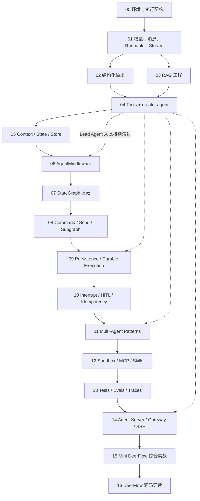

# LangGraph Agent 工程课程信息架构与章节契约

> 决策日期：2026-07-13  
> 输入：[官方生态能力基线](./01-official-ecosystem-baseline.md)、[DeerFlow 架构阅读基线](./02-deerflow-architecture-baseline.md)、[现有内容可执行性审计](./03-current-content-execution-audit.md)  
> 目标：把现有主题型教程重组为一条连续、详细、可运行、可验证的 Agent 工程学习路线，并让每章都为 Mini DeerFlow 提交一个可复用工件。

## 1. 信息架构决策

课程采用 **1 个导学章 + 16 个能力章 + 4 组参考附录**，共 17 个连续学习节点。章节数量增加不是为了堆 API，而是为了解决当前第 05–09 章把多个不同抽象层挤在一起的问题。

主线严格保持下面的能力递进：

```text
可验证环境
→ 增强模型与确定性契约
→ create_agent 与工具循环
→ Context / State / Store
→ AgentMiddleware
→ StateGraph 显式编排
→ durable execution 与 HITL
→ subagent-as-tool 与 Agent Harness
→ 测试、评测、观测
→ Agent Server / Gateway
→ Mini DeerFlow 综合验收
→ DeerFlow 源码阅读
```

### 1.1 为什么不是继续维持 9 章

现有 9 章中的前三章相对细致，后四章却分别压入了过多不同问题：

- “Agent Middleware”实际混合 Runnable listener、fallback、脱敏和阻塞审批；
- “Observability & Persistence”同时混淆 tracing、checkpoint 和长期记忆；
- “Engineering Defense”同时讲静态断点、time travel、权限与依赖注入；
- “Multi Agent & Eval”把多 Agent、评测和部署合并，三个主题都没有执行闭环。

继续只修补原目录会让后半程永远比前半程浅。新结构把**不同运行语义、不同验收方式、不同失败模式**拆开，但保留现有详细解释和可迁移实验。

### 1.2 课程不是两套孤立产物

每一章包含三个互相引用但职责不同的载体：

| 载体 | 职责 | 不承担什么 |
|---|---|---|
| 中文 Markdown 正文 | 原理、边界、流程图、代码解释、失败分析、源码映射 | 不复制全部执行输出 |
| Notebook 实验册 | 最小实验、失败实验、可视化 state/event、练习入口 | 不独立发明另一套 API 叙事 |
| `mini_deerflow` Python 包 | 可复用工程实现、测试、类型、配置与运行时 | 不承载长篇教学解释 |

关键代码以 `mini_deerflow` 可导入模块和测试为事实源；Markdown 与 Notebook 引用或薄包装这些模块。Notebook 可以有探索单元，但不得复制一套不同的业务实现。

## 2. 六阶段课程总目录

| 阶段 | 章节 | 阶段问题 | 阶段产物 |
|---|---|---|---|
| 0. 导航与执行契约 | 00 | 如何确认环境、版本和学习成果可信？ | 配置 profile、能力探针、验证命令 |
| I. 增强模型层 | 01–03 | 如何让模型输入、输出、检索和事件可控？ | 模型工厂、schema、知识索引和 retriever |
| II. Agent 封装层 | 04–06 | 如何用 `create_agent` 构建可扩展 Lead Agent？ | tools、Lead factory、Context/State/Store、middleware chain |
| III. Graph 编排层 | 07–10 | 何时需要显式控制流，如何暂停和恢复？ | Graph labs、reducers、parallel planner、持久化和审批 |
| IV. Agent Harness 层 | 11–12 | 如何安全地委派、使用工作区并接入外部能力？ | task tool、subagents、sandbox、MCP/Skills boundary |
| V. 验证与交付层 | 13–14 | 如何证明 Agent 正确并作为长任务服务交付？ | tests/evals/traces、Agent Server、thread/run/SSE Gateway |
| VI. 综合与迁移阅读 | 15–16 | 如何独立完成类 DeerFlow 项目并进入真实 DeerFlow？ | 完整 Mini DeerFlow、故障演练、源码阅读地图 |

### 2.1 推荐章节目录

```text
00 课程地图、环境与可执行性契约

第一部分：增强模型层
01 消息、模型、Runnable 与流式事件
02 结构化输出：让模型结果成为业务契约
03 RAG 工程：从知识索引到 Agent 检索工具

第二部分：Agent 封装层
04 工具契约与 create_agent：构建第一个 Lead Agent
05 Context Engineering：Runtime Context、Graph State 与 Store
06 AgentMiddleware：把横切能力装入 Agent 生命周期

第三部分：Graph 编排层
07 StateGraph 基础：State、Reducer、Node、Edge 与 ReAct
08 显式控制流：Command、Send、Subgraph 与 Functional API
09 持久化与 Durable Execution：Checkpoint、Store 与恢复
10 Human-in-the-loop：Interrupt、Time Travel 与副作用安全

第四部分：Agent Harness 层
11 多 Agent 模式：Router、Handoff、Supervisor 与 Subagent-as-tool
12 工作区与扩展系统：Sandbox、MCP、Skills 与 Artifact

第五部分：验证与交付层
13 Agent 质量工程：测试、评测、Tracing 与故障注入
14 Agent Runtime：Agent Server、Thread/Run 与 SSE Gateway

第六部分：综合与迁移阅读
15 综合实战：从需求到可运行的 Mini DeerFlow
16 DeerFlow 源码导读：从课程模块进入真实 Agent Harness
```

## 3. 章节依赖与学习路径



第 02、03 章在知识上可以并行学习，但推荐按顺序完成。结构化输出负责“业务结果契约”，RAG 负责“可检索知识能力”；两者都在第 04 章变成 Lead Agent 的能力。这样 RAG 不会取代 LangGraph 主线，也不会成为学完即废弃的孤立 Chain。

### 3.1 快速路径与完整路径

- **完整路径**：00 → 16，面向希望独立构建 Agent 核心业务并阅读 DeerFlow 的学习者。
- **已有 LangChain 基础的快速路径**：完成 00 的能力探针后，可快速通过 01–03 的验收题，但不能跳过 04–16。
- **只想学习 LangGraph 的路径**：仍需通过 01、02、04 的验收，因为消息、结构化契约、tools 和 `create_agent` 是理解 Graph 中业务节点的前置，而不是可忽略的 LangChain 杂项。
- **DeerFlow 阅读路径**：不能从 00 直接跳到 16；至少应完成 04–12，否则会把 middleware、task、sandbox 和 persistence 误读成普通工具集合。

## 4. 每章统一教学契约

每章必须回答以下问题。具体写作粒度、图示类型和错误讲解模板由后续“建立详细教学内容与视觉表达标准”任务定义。

1. **为什么现在学**：说明它依赖上一章的哪个工件，又为下一章解决什么阻塞。
2. **本章核心业务问题**：先提出 Agent 业务中的真实失败，而不是先列 API。
3. **概念边界**：至少包含“它是什么 / 不是什么 / 何时不用”。
4. **最小实验**：尽量使用 fake model、deterministic embeddings 或本地后端，能够离线执行。
5. **工程实验**：修改或扩展 `mini_deerflow` 的一个真实模块。
6. **失败实验**：展示错误代码、可观察现象、根因、修复和防回归断言。
7. **状态与事件观察**：能看到关键 state、event、checkpoint 或 trace，而不是只打印最终文本。
8. **练习**：包含基础修改题、边界推理题和项目扩展题。
9. **自动验收**：列出测试命令与应满足的断言。
10. **Mini DeerFlow 增量**：明确新增文件、接口或测试，不以“理解了”作为产物。
11. **DeerFlow 映射**：指出本章概念未来对应 DeerFlow 哪类模块，但在第 16 章前不要求深读大型源码。

### 4.1 单章完成定义

一章只有同时满足以下条件才能标记“已验证”：

- Markdown 正文通过链接和代码块检查；
- Notebook 从空 kernel 以 offline profile 顺序执行；
- 对应 `mini_deerflow` 模块通过单元测试；
- 至少一个失败实验证明护栏有效；
- 章节项目增量能被下一章直接导入；
- 真实模型实验缺 key 时显示明确 skip，而不是失败或假成功。

## 5. 逐章详细契约

## 第 00 章：课程地图、环境与可执行性契约

### 为什么现在学

现有课程把安装成功等同于项目可运行，但 README、lock 和虚拟环境已经出现版本漂移。本章先让学习者知道“什么叫可复现”，后续每个实验才能区分 API 错误、供应商错误和业务错误。

### 学完能够做什么

- 解释锁定版本、兼容范围和实际运行版本的区别；
- 在 offline、DeepSeek、OpenAI-compatible 等 profile 之间切换；
- 运行一条统一验证命令并读懂 skipped、failed、passed；
- 读懂全课程四层能力图与 Mini DeerFlow 的最终边界。

### 核心内容

- Python/uv/lock、直接依赖与传递依赖；
- `.env`、secret、provider profile 与 capability probe；
- offline test 与 integration test；
- Markdown、Notebook、Python package 三载体契约；
- 当前 API 标签：current、compatibility、legacy、preview。

### 最小与工程实验

- 最小实验：在无 API key 环境调用 fake chat model 和 deterministic embeddings。
- 工程实验：创建 `mini_deerflow.config` 与 `mini_deerflow.models` 的配置接口和能力探针。

### 失败实验

故意用 DeepSeek 模型名连接 OpenAI endpoint，观察认证或模型错误；随后用显式 profile 修复，并断言 secret 不进入输出和日志。

### 练习与验收

- 练习：新增一个 OpenAI-compatible profile，但不在业务代码中分支判断供应商。
- 验收：无 key 时 offline suite 全绿；缺 integration key 时明确 skip；打印的版本与 lock 一致。

### Mini DeerFlow 增量与 DeerFlow 映射

- 增量：配置 schema、model factory、测试标记和统一开发命令。
- 映射：为后续理解 DeerFlow `config.yaml`、model factory 和 `langgraph.json` 建立入口概念。

## 第 01 章：消息、模型、Runnable 与流式事件

### 为什么现在学

Agent 的输入、输出和事件都建立在消息与 Runnable 语义上。若此处不稳定，后面的 tool event、subagent namespace 和 SSE 都会被误解。

### 学完能够做什么

- 组织 System/Human/AI/Tool 消息并判断它们在一次工具循环中的位置；
- 区分 model invoke、Runnable composition、`bind_tools` 和 `create_agent`；
- 正确消费 v2 `StreamPart {type, ns, data}`；
- 识别 provider-specific metadata，避免把可选字段当通用协议。

### 核心内容

- message protocol、Runnable `invoke/ainvoke/stream/astream`；
- `init_chat_model` 与统一 model factory；
- `bind_tools` 只让模型产生 tool call，不负责执行循环；
- v1/v2 streaming 边界，v3 只标记 preview；
- token、updates、custom event 与 namespace。

### 最小与工程实验

- 最小实验：fake model 返回消息与 v2 stream envelope。
- 工程实验：实现 `mini_deerflow.streaming.normalize_stream_part()`，后续 Notebook、SSE adapter 共用。

### 失败实验

把 v2 event 解包成 `(chunk, metadata)`，复现 `ValueError`；再用统一 normalizer 修复并测试 messages/updates 两种 type。

### 练习与验收

- 练习：为 custom event 增加一个不破坏未知 event 的 renderer。
- 验收：输入必须保留 HumanMessage；未知 metadata 不导致 KeyError；异步取消能结束消费。

### Mini DeerFlow 增量与 DeerFlow 映射

- 增量：model adapter、message helpers、stream event normalizer。
- 映射：DeerFlow Gateway SSE adapter 与 LangGraph runtime event 的分层基础。

## 第 02 章：结构化输出——让模型结果成为业务契约

### 为什么现在学

多步骤 Agent 不能只靠自然语言约定 planner、工具和 subagent 的结果。本章在进入 Agent 循环前建立可验证的 schema 思维。

### 学完能够做什么

- 使用 Pydantic、TypedDict 和 JSON Schema 定义不同强度的契约；
- 区分模型 structured output、tool args 和 Agent `response_format`；
- 处理 validation error、缺字段、拒答和 provider 不支持；
- 为后续计划、artifact、delegation result 设计稳定类型。

### 核心内容

- schema 设计、嵌套对象、枚举、约束和版本演进；
- provider-native structured output 与 tool strategy；
- retry/repair 的成本和边界；
- 结构化输出不适用的场景。

### 最小与工程实验

- 最小实验：从用户需求提取 `ResearchRequest`，分别触发成功和 validation error。
- 工程实验：定义 `TaskPlan`、`ArtifactRef`、`SubagentResult`，作为贯穿项目领域模型。

### 失败实验

让模型遗漏必填字段或返回错误枚举；观察解析失败，而不是用字符串默认值掩盖错误；增加有限重试和失败结果类型。

### 练习与验收

- 练习：为 schema 做向后兼容升级，并写旧 payload 迁移测试。
- 验收：成功、拒答、不可修复 validation error 三种结果均有类型和测试。

### Mini DeerFlow 增量与 DeerFlow 映射

- 增量：`schemas.py` 中的计划、产物与委派结果契约。
- 映射：DeerFlow task tool 输入、todo/artifact reducer 与 subagent result 的结构基础。

## 第 03 章：RAG 工程——从知识索引到 Agent 检索工具

### 为什么现在学

RAG 是 Agent 的一项知识能力，不是 LangGraph 控制流本身。此时学习可以保留现有索引工程深度，又能在下一章立刻把 retriever 交给 Lead Agent，而不是形成孤立 Chain。

### 学完能够做什么

- 构建可重复、可增量、可观察的文档索引；
- 理解 chunk、embedding、metadata、record manager 和 hybrid retrieval；
- 评估检索质量，而不是只看最终生成文本；
- 把 retriever 包装为有清晰 schema 和引用结果的工具。

### 核心内容

- loader、splitter、deterministic embeddings、vector store；
- 增量索引、source id、删除与清理策略；
- dense/sparse、RRF、top-k 与 metadata filter；
- retrieval evaluation、引用和 prompt injection 边界。

### 最小与工程实验

- 最小实验：使用临时目录和 deterministic embeddings 索引固定 fixture。
- 工程实验：实现 `knowledge/indexer.py` 和 `tools/search_knowledge.py`，返回带 source 的结构化结果。

### 失败实验

展示错误 key、重复入库、工作目录漂移、chunk 过大和“文档存在但召回失败”；逐项用可观测指标定位，而不是只调 prompt。

### 练习与验收

- 练习：新增 metadata filter 和一个已知难例，比较 dense 与 hybrid 召回。
- 验收：重复索引幂等；不修改仓库源文件；固定查询的 recall 断言稳定；provider 集成可选。

### Mini DeerFlow 增量与 DeerFlow 映射

- 增量：知识 fixture、索引器、retriever tool 和 retrieval tests。
- 映射：DeerFlow 工具系统与外部知识能力；明确它不是 ThreadState 或 Store。

## 第 04 章：工具契约与 `create_agent`——构建第一个 Lead Agent

### 为什么现在学

前面已经有消息协议、结果 schema 和 retriever。现在第一次把它们装入由 LangGraph 支撑的标准 Agent 工具循环，形成贯穿项目的 Lead Agent。

### 学完能够做什么

- 设计模型能理解、应用能验证、权限层能控制的工具；
- 使用 `ToolRuntime` 获取 Context/State/Store；
- 正确以 `messages` 调用 `create_agent`；
- 解释 `create_agent` 与手写 StateGraph 的关系，而不是把前者当黑盒或旧入口。

### 核心内容

- `@tool`、args schema、docstring、错误类型、sync/async；
- tool call → execute → ToolMessage → next model call；
- `ToolRuntime`、`Command(update=...)` 和 tool artifact；
- tool registry、最小权限和副作用分类；
- `create_agent` factory 与 v2 streaming。

### 最小与工程实验

- 最小实验：calculator + knowledge search，观察完整消息循环。
- 工程实验：创建 `agents/lead_agent.py`、`tools/registry.py`，挂载搜索与只读 workspace 工具。

### 失败实验

传入 `{"input": ...}` 并证明 HumanMessage 缺失；再改用 `messages`。另测试 schema 不合法、工具抛错和模型循环超限。

### 练习与验收

- 练习：实现一个返回 `Command(update={"artifacts": ...})` 的工具。
- 验收：用户消息进入 state；工具调用有结构化错误；Lead Agent 离线完整跑通一次工具循环。

### Mini DeerFlow 增量与 DeerFlow 映射

- 增量：首个 Lead Agent factory、tool registry、artifact update。
- 映射：DeerFlow 仍以 `create_agent` 构造 Lead Agent；后续复杂性来自 state、middleware、tools 和 runtime，而不是替换 factory。

## 第 05 章：Context Engineering——Runtime Context、Graph State 与 Store

### 为什么现在学

Lead Agent 已能工作，但身份、线程状态、跨线程偏好和依赖连接如果继续混在 prompt 或全局变量中，后面无法正确持久化、授权或隔离子代理。

### 学完能够做什么

- 判断数据应进入 Runtime Context、Graph State、Store 还是业务数据库；
- 设计 ThreadState 字段及 reducer，而不是把所有数据塞进 messages；
- 使用 Store namespace 管理跨线程应用数据；
- 避免把 secret 和连接对象 checkpoint。

### 核心内容

- transient invocation context、thread-scoped state、cross-thread store；
- checkpointer 只在第 09 章展开，此处先定义边界；
- state schema、messages/todo/artifact reducer；
- identity、permissions、model selection、dependencies；
- context window 与应用上下文的区别。

### 最小与工程实验

- 最小实验：同一请求分别读取 Context、State 和 Store 中的三个事实。
- 工程实验：实现 `RuntimeContext`、`ThreadState`、namespace policy 和 reducer tests。

### 失败实验

把 auth token 放进 State，展示它会进入 checkpoint/trace 的风险；再迁移到 Context 并加入 secret redaction 断言。

### 练习与验收

- 练习：为一个新字段决定存储边界，并用生命周期测试证明判断。
- 验收：两个 thread 的 State 隔离；Store 中明确选择的数据可跨 thread；secret 不出现在 state serialization。

### Mini DeerFlow 增量与 DeerFlow 映射

- 增量：ThreadState、RuntimeContext、Store policy 和三类 reducer。
- 映射：DeerFlow `ThreadState`、runtime context、checkpointer/store 分层的阅读前置。

## 第 06 章：AgentMiddleware——把横切能力装入 Agent 生命周期

### 为什么现在学

已有 Lead Agent 与明确上下文后，才能讨论“在每次模型或工具调用前后统一执行什么”。否则 middleware 会退化成任意 Runnable wrapper 的别名。

### 学完能够做什么

- 使用 `before_model`、`after_model`、`wrap_model_call`、`wrap_tool_call`；
- 解释 middleware 顺序、嵌套、短路、错误传播和同步/异步对称性；
- 实现动态 prompt/model、工具错误、PII、调用限制和摘要；
- 测试 middleware 对 state 和 event 的影响。

### 核心内容

- AgentMiddleware 生命周期与 state schema；
- Runnable listener/fallback 与 AgentMiddleware 对照；
- hook ordering、composition、exception policy；
- context engineering、tool governance、summarization；
- middleware 过多时的隐式控制流风险。

### 最小与工程实验

- 最小实验：一个记录调用顺序的 middleware chain。
- 工程实验：为 Lead Agent 加入 context prompt、tool error、call limit、summarization 和 artifact/todo middleware 中的 4–6 个代表实现。

### 失败实验

故意交换两个 middleware 的顺序并观察 prompt、工具或 state 结果变化；另复现错误 listener 签名只破坏观测而业务仍返回的静默失败。

### 练习与验收

- 练习：实现一个自定义预算 middleware，覆盖 sync/async 和异常路径。
- 验收：顺序可观测；工具异常被结构化处理；middleware 不吞掉取消；state patch 有测试。

### Mini DeerFlow 增量与 DeerFlow 映射

- 增量：`middlewares/` chain、构造器、顺序测试和至少一个自定义 middleware。
- 映射：直接对应 DeerFlow Lead Agent 的 middleware chain，是理解 Harness 的核心章节。

## 第 07 章：StateGraph 基础——State、Reducer、Node、Edge 与 ReAct

### 为什么现在学

学习者已经使用了由 LangGraph 支撑的 `create_agent`。现在进入 StateGraph，不是为了“摆脱黑盒”，而是为了看懂并设计标准 Agent factory 无法清楚表达的确定性业务控制流。

### 学完能够做什么

- 从业务状态变化设计 State、Node、Edge；
- 实现串行、条件和循环图；
- 设计 reducer，理解并发更新为什么不能靠字典覆盖；
- 手写一个完整最小 ReAct 图，并与 `create_agent` 版本比较。

### 核心内容

- START/END、state update、conditional edge、compile/invoke；
- reducer 的覆盖、追加、去重和交换性；
- model/tool node 与循环终止；
- recursion limit、错误路径和图可视化；
- `create_agent` vs custom StateGraph 决策表。

### 最小与工程实验

- 最小实验：确定性订单审核图，再实现最小 ReAct 图。
- 工程实验：为 Mini DeerFlow 构建一个显式 plan/execute/review 工作流实验，不替换 Lead Agent factory。

### 失败实验

两个节点并行写同一无 reducer 字段，复现冲突或覆盖；再分别用 messages、todo、artifact reducer 修复。

### 练习与验收

- 练习：增加失败重试分支和明确的最大循环次数。
- 验收：串行、条件、循环三条路径可运行；Notebook 不留空 node/edge 占位符；状态轨迹可断言。

### Mini DeerFlow 增量与 DeerFlow 映射

- 增量：`graphs/` 教学图、reducer tests、graph visualization。
- 映射：理解 DeerFlow state reducer、Agent 运行图与 middleware 扩展点的下层语义。

## 第 08 章：显式控制流——Command、Send、Subgraph 与 Functional API

### 为什么现在学

基础图能表达单一路径，但真实研究任务需要节点更新状态后路由、并行派发和组合子流程。本章补齐后续多 Agent 与 durable execution 所需控制原语。

### 学完能够做什么

- 使用 `Command` 同时 update 和 goto；
- 使用 `Send` 做动态 fan-out/fan-in；
- 选择 subgraph 的 state 共享或转换边界；
- 根据控制流复杂度选择 Graph API 或 Functional API。

### 核心内容

- `Command`、`Send`、parallel superstep、reducer；
- subgraph compile、state mapping、namespace；
- retry policy、cache policy、错误聚合；
- Functional API 的 task/entrypoint 与 durable 特性；
- 静态图、动态分派和可视化边界。

### 最小与工程实验

- 最小实验：并行研究三个主题并汇总引用。
- 工程实验：实现 planner → parallel research → synthesis 流程，复用第 02 章 schema 和第 03 章 retriever。

### 失败实验

并行 worker 返回不可合并更新或单个任务超时，观察 fan-in 行为；再增加 reducer、错误结果类型和有限重试。

### 练习与验收

- 练习：用 Functional API 重写一个小流程，并解释为何不重写整个 Lead Agent。
- 验收：`Command` 单路由、`Send` 并行、subgraph 三类路径均有可运行测试。

### Mini DeerFlow 增量与 DeerFlow 映射

- 增量：planner/research graph、parallel result reducer、retry policy。
- 映射：为理解 DeerFlow task 并发、namespace event 与结果汇总准备控制流知识。

## 第 09 章：持久化与 Durable Execution——Checkpoint、Store 与恢复

### 为什么现在学

只有在状态和控制流都明确后，才能正确讨论“保存什么、何时恢复、恢复到哪里”。本章彻底拆开 MemorySaver、持久 checkpointer、Store 和产品业务库。

### 学完能够做什么

- 使用 thread_id 和持久 checkpointer 恢复长任务；
- 区分 InMemory、SQLite 和 Postgres 的教学/本地/生产边界；
- 解释 checkpoint、Store、Run/Event repository 各自承担什么；
- 处理进程重启、状态 schema 演进和 durable side effect。

### 核心内容

- checkpoint lifecycle、configurable thread_id、snapshot/history；
- sync/async checkpointer、durability mode；
- Store namespace 与 cross-thread data；
- at-least-once 风险、task boundary、副作用封装；
- checkpoint migration、TTL、清理和隐私。

### 最小与工程实验

- 最小实验：SQLite checkpointer，停止进程后从同一 thread 恢复。
- 工程实验：为 Lead Agent 接入 SQLite checkpointer/store，并建立独立的 Run/Event repository 接口占位。

### 失败实验

先用 MemorySaver 声称“重启后恢复”并证明失败；再切换 SQLite。另修改 state schema，观察旧 checkpoint 兼容问题。

### 练习与验收

- 练习：设计一种 checkpoint 清理策略并测试不会误删活跃 thread。
- 验收：真实进程重启后恢复；两个 thread 隔离；Store 的跨线程行为明确；状态迁移有测试。

### Mini DeerFlow 增量与 DeerFlow 映射

- 增量：persistence factory、SQLite adapters、thread fixtures、state migration。
- 映射：DeerFlow Checkpointer、Store 与 Gateway RunStore/RunEventStore 的多边界模型。

## 第 10 章：Human-in-the-loop——Interrupt、Time Travel 与副作用安全

### 为什么现在学

Interrupt 是 durable execution 上的业务能力，不是 `input()` 或静态调试断点。学习者已经具备持久恢复知识，现在才能正确实现异步审批和安全重放。

### 学完能够做什么

- 使用动态 `interrupt()` 暂停，并以 `Command(resume=...)` 恢复；
- 设计 approve/edit/reject 的结构化 payload；
- 解释恢复为什么可能重新执行节点前半段；
- 使用 time travel/update_state 调试或分叉，同时控制外部副作用。

### 核心内容

- interrupt payload、resume value、multiple interrupts；
- checkpoint 与非阻塞暂停；
- idempotency key、outbox、side-effect boundary；
- static breakpoint 的调试定位；
- state history、update_state、fork/replay。

### 最小与工程实验

- 最小实验：高风险文件写入的 approve/edit/reject。
- 工程实验：实现 approval middleware/tool boundary、结构化审批记录和幂等文件操作。

### 失败实验

在 `interrupt()` 前直接执行一次外部副作用，恢复后观察重复；再通过幂等 key 或事务/outbox 边界修复。

### 练习与验收

- 练习：实现两个有顺序要求的 interrupt，并测试错误恢复顺序。
- 验收：暂停不占住进程；三种审批路径可恢复；重复 resume 不产生重复副作用；time travel 结果可追踪。

### Mini DeerFlow 增量与 DeerFlow 映射

- 增量：approval schema、interrupt workflow、idempotent workspace mutation。
- 映射：DeerFlow human-in-the-loop middleware、线程持久化与文件工具安全边界。

## 第 11 章：多 Agent 模式——Router、Handoff、Supervisor 与 Subagent-as-tool

### 为什么现在学

学习者已经掌握 Graph 的显式路由与持久恢复，现在可以根据控制权、上下文隔离和并发需求选择多 Agent 模式，而不是把任何多个节点都称为 Supervisor。

### 学完能够做什么

- 比较 Router、Handoff、Supervisor、Subgraph、Subagent-as-tool；
- 判断谁拥有下一步控制权、谁保存消息历史、谁负责汇总；
- 设计 subagent 输入裁剪、结果 schema、并发/超时/预算；
- 实现类似 DeerFlow `task` tool 的最小调度模型。

### 核心内容

- central control vs decentralized handoff；
- subgraph state sharing vs stateless subagent；
- task tool、subagent registry、delegation ledger；
- context isolation、result compression、failure propagation；
- `Command` 单路由与 `Send`/tool 并发。

### 最小与工程实验

- 最小实验：用同一需求分别实现静态 router 与 subagent-as-tool，对比 state 和事件。
- 工程实验：Lead Agent 调用 `task`，委派 research 和 coding 两个无 checkpoint subagent。

### 失败实验

把完整主对话和 secret 传给 subagent，展示上下文污染；另触发 timeout、过大输出和部分失败，再通过输入白名单、结果契约和并发上限修复。

### 练习与验收

- 练习：为第三个 subagent 定义 capability、input policy 和 result reducer。
- 验收：两个 subagent 上下文隔离；`checkpointer=False` 或等价无独立历史；失败/超时结构化返回；Lead Agent 能汇总。

### Mini DeerFlow 增量与 DeerFlow 映射

- 增量：task tool、subagent registry/executor、delegation ledger、research/coding agents。
- 映射：直接对应 DeerFlow Lead Agent + task/subagent executor，而不是现有教程的翻译 router。

## 第 12 章：工作区与扩展系统——Sandbox、MCP、Skills 与 Artifact

### 为什么现在学

有了 subagent 后，系统开始读写文件、执行命令和发现外部工具。若不建立 workspace/sandbox/provider 抽象，就无法讨论隔离、可替换后端和真实 Harness。

### 学完能够做什么

- 区分 thread workspace、sandbox abstraction 和容器级安全隔离；
- 防止路径穿越、命令注入、secret 泄漏和无限资源使用；
- 理解 MCP 是工具协议、Skills 是能力说明/工作流，两者不是 state；
- 设计 deferred tool discovery 与 artifact 生命周期。

### 核心内容

- workspace root、path normalization、artifact metadata；
- LocalSandbox 的能力与非隔离边界；
- sandbox provider、timeout、network policy、resource limit；
- MCP server/client、tool discovery、lazy/deferred load；
- skills metadata、prompt injection 边界、审计。

### 最小与工程实验

- 最小实验：受限 workspace 中读写 artifact，拒绝 `../` 逃逸。
- 工程实验：实现 Sandbox protocol、LocalSandbox、artifact service、一个 mock MCP provider 和 skill registry。

### 失败实验

尝试绝对路径、符号链接逃逸、超时命令和恶意 skill 指令；展示 LocalSandbox 不能等价于容器隔离，并记录拒绝原因。

### 练习与验收

- 练习：实现一个替代 sandbox provider 的 fake adapter，不修改工具业务代码。
- 验收：路径逃逸被拒绝；资源限制可测试；artifact 有 thread ownership；MCP/skill discovery 可禁用和审计。

### Mini DeerFlow 增量与 DeerFlow 映射

- 增量：sandbox protocol/provider、workspace manager、artifact service、MCP/skills extension seam。
- 映射：DeerFlow sandbox provider、thread workspace、MCP deferred tools 与 skill middleware。

## 第 13 章：Agent 质量工程——测试、评测、Tracing 与故障注入

### 为什么现在学

Agent Harness 已包含模型、工具、middleware、持久化和子代理。此时必须从“输出看起来不错”升级为分层证明：单元行为、轨迹、结果质量、恢复能力和可观测性。

### 学完能够做什么

- 用 fake model 测 node、tool、middleware、graph trajectory；
- 设计 dataset、deterministic evaluator 和可选 LLM-as-judge；
- 使用当前 LangSmith evaluate API，并理解 trace 与 eval 的关系；
- 做超时、工具失败、重复事件、checkpoint 恢复等故障注入。

### 核心内容

- unit/component/integration/e2e/eval pyramid；
- final response、trajectory、retrieval、artifact correctness；
- dataset version、baseline、regression threshold；
- tracing context、PII redaction、cost/latency；
- LangSmith 与可选 Langfuse/本地 event observability 的边界。

### 最小与工程实验

- 最小实验：固定任务集 + 确定性 evaluator，离线比较两个 Agent 版本。
- 工程实验：建立 `tests/`、`evals/`、trace adapter 和 fault fixtures，覆盖 Lead/subagent/persistence/SSE 前置事件。

### 失败实验

让 evaluator 只检查最终字符串，展示错误工具轨迹仍可能得高分；再加入 trajectory、citation 和 artifact evaluator。

### 练习与验收

- 练习：从一次失败 trace 提炼回归数据，但移除 secret 与偶然字段。
- 验收：离线 eval 可重复；旧失效导入不存在；integration 可 skip；质量、成本和延迟阈值独立报告。

### Mini DeerFlow 增量与 DeerFlow 映射

- 增量：测试金字塔、eval datasets/evaluators、trace abstraction、failure injection suite。
- 映射：DeerFlow tracing hooks、测试资产和产品事件观测的分工。

## 第 14 章：Agent Runtime——Agent Server、Thread/Run 与 SSE Gateway

### 为什么现在学

Agent 本身已可验证，但产品需要创建 thread、启动 run、断线重连和消费事件。部署不是把 graph 塞进一个旧的 Runnable HTTP wrapper，而是理解官方 runtime 与最小产品 Gateway 的边界。

### 学完能够做什么

- 用 `langgraph.json` 暴露 graph/agent factory；
- 调用 Agent Server/SDK 的 thread、run 和 stream；
- 设计最小 Gateway 的 RunManager、RunStore、RunEventStore；
- 将内部 v2 event 适配为可重放 SSE，并处理取消、断线和 backpressure。

### 核心内容

- Agent Server 开发/部署路径；
- thread/run lifecycle、assistant/graph registration；
- SSE event id、heartbeat、replay、terminal event；
- runtime event 与产品 event 的转换；
- auth/tenant boundary、error mapping、observability；
- LangServe 仅作为 legacy 迁移说明。

### 最小与工程实验

- 最小实验：本地 Agent Server + SDK stream。
- 工程实验：实现最小 `/threads`、`/runs`、`/runs/{id}/events` 纵切面和 SQLite run/event store。

### 失败实验

模拟客户端中途断开、重复 Last-Event-ID、run cancel 和 worker error；证明事件不会无界丢失或重复应用。

### 练习与验收

- 练习：增加一个鉴权 Context adapter，保证身份不进入 checkpoint state。
- 验收：创建 thread/run、流式输出、断线重放、取消和终态查询可端到端运行；LangServe 不在主线依赖中。

### Mini DeerFlow 增量与 DeerFlow 映射

- 增量：`langgraph.json`、runtime config、Gateway API、RunManager、SSE adapter、repositories。
- 映射：DeerFlow LangGraph-compatible Gateway 与两段异步 SSE 管线的最小可运行模型。

## 第 15 章：综合实战——从需求到可运行的 Mini DeerFlow

### 为什么现在学

此前每章都已提交模块，但“模块各自通过”不等于系统能完成长任务。本章以新的需求从入口走完整链路，进行集成、取舍、故障演练与架构复盘。

### 业务场景

用户提交一个需要检索本地知识、并行研究、生成代码/报告、写入工作区并经过高风险操作审批的长任务。Lead Agent 可以委派 research/coding subagent；运行可暂停、恢复、断线重连并产出带引用 artifact。

### 学完能够做什么

- 从领域需求设计 Context、State、Store、tools、middleware 和 graph boundary；
- 对委派、审批、工作区和持久化做威胁建模；
- 运行一套离线端到端测试、故障注入和评测；
- 解释哪些设计是教程简化，哪些接口可替换为生产实现。

### 综合迭代

1. 建立 thread 和运行上下文；
2. Lead Agent 解析结构化任务；
3. 检索知识并形成计划；
4. 通过 task tool 并行委派；
5. 汇总结果并生成 artifact；
6. 高风险写操作触发 interrupt；
7. 恢复后幂等提交；
8. SSE 向客户端输出事件；
9. trace/evaluator 验证结果与轨迹。

### 失败实验

组合注入：一个 subagent 超时、一次 SSE 断线、一次审批 edit、一次进程重启。系统必须恢复到可解释终态，而不是只验证顺畅路径。

### 练习与验收

- 练习：学习者独立增加一个领域工具和一个 subagent，并给出边界决策记录。
- 验收：从空数据库启动；offline e2e 通过；重启恢复；路径隔离；审批幂等；事件重放；eval 达到基线；所有架构图与代码一致。

### Mini DeerFlow 增量与 DeerFlow 映射

- 增量：最终 assembly、example scenario、e2e/fault suite、架构说明、运行手册。
- 映射：形成进入 DeerFlow 前的“缩小版同构关系”，但不复制前端、SSO、IM、调度和 Kubernetes 复杂度。

## 第 16 章：DeerFlow 源码导读——从课程模块进入真实 Agent Harness

### 为什么现在学

只有亲手实现过相同职责的较小模块，阅读 DeerFlow 时才能围绕接口、状态和调用链提问，而不是按目录逐文件浏览。

### 学完能够做什么

- 用“原生 LangGraph runtime / DeerFlow Harness / Gateway 产品运行时”三层模型定位代码；
- 沿一次请求追踪 Lead Agent、middleware、tools、task/subagent、sandbox、persistence 和 SSE；
- 判断一个能力来自 LangGraph 原生、DeerFlow 扩展还是产品运行时；
- 为自己的业务写一份基于 DeerFlow 思想但不过度复制的扩展设计。

### 阅读顺序

1. `langgraph.json` 与 Lead Agent factory；
2. ThreadState、reducers、Runtime Context；
3. middleware 构造与执行顺序；
4. tool registry、ToolRuntime、Command；
5. task tool 与 subagent executor；
6. sandbox/workspace、MCP/skills；
7. checkpointer/store/run/event persistence；
8. Gateway thread/run/SSE 调用链；
9. tests/traces 反向验证理解。

### 最小与工程实验

- 最小实验：给一条 DeerFlow 请求调用链做源码书签和时序图。
- 工程实验：维护 Mini DeerFlow → DeerFlow 模块映射表，并选一个差异写 ADR/扩展提案，不直接复制源码。

### 失败实验

分别尝试按目录顺序阅读、把所有“memory”视为同一存储、把 LocalSandbox 当容器隔离、把 subagent 当共享完整消息的子图；用源码证据纠正这些阅读陷阱。

### 练习与验收

- 练习：为一个新能力回答“属于哪一层、修改哪个 seam、影响哪些 state/event/persistence”。
- 验收：学习者能画出端到端调用时序；能解释 middleware 顺序；能指出 subagent 上下文边界；能给出不复制产品边缘复杂度的业务架构方案。

### Mini DeerFlow 增量

本章不再增加运行时代码，而是交付架构映射、阅读问卷和扩展 ADR。这些是证明学习者能迁移知识、而不仅是照抄教程的最终工件。

## 6. Mini DeerFlow 逐章演进表

| 章 | 新增或强化的工程工件 | 可见能力 |
|---|---|---|
| 00 | config、model factory、profiles、test command | 无 key 也能验证环境 |
| 01 | messages helpers、stream normalizer | 统一消费 Agent 事件 |
| 02 | TaskPlan、ArtifactRef、SubagentResult | 模型结果成为业务契约 |
| 03 | indexer、retriever tool | Lead Agent 可检索本地知识 |
| 04 | Lead Agent factory、tool registry | 完整工具循环 |
| 05 | RuntimeContext、ThreadState、reducers、Store policy | 数据按生命周期归位 |
| 06 | middleware chain | 横切能力可组合、可测试 |
| 07 | teaching graphs、ReAct graph | 显式控制流与状态轨迹 |
| 08 | planner/research graph、Send/retry | 动态并行研究 |
| 09 | SQLite checkpointer/store、migration | 重启后恢复长任务 |
| 10 | approval workflow、idempotent mutation | 可异步审批高风险动作 |
| 11 | task tool、subagent executor/registry | 受控委派两个子代理 |
| 12 | workspace、sandbox、MCP/skills seams | 安全使用文件和扩展能力 |
| 13 | tests、evals、trace、fault fixtures | 质量与轨迹可证明 |
| 14 | Agent Server config、Gateway、SSE | thread/run/event 对外服务 |
| 15 | assembly、e2e、fault scenario | 完整长任务业务闭环 |
| 16 | source map、reading worksheet、ADR | 能进入 DeerFlow 并迁移设计 |

## 7. 现有 01–09 内容迁移矩阵

| 现有内容 | 新位置 | 处置 | 说明 |
|---|---|---|---|
| README 全局大图、学习阶梯 | 00 + 新 README | 保留并重组 | 用已验证状态替代全量完成标记 |
| 01 模型、消息、入口边界、stream | 00、01、04 | 保留并修正 | v2 正确示例成为共享 event contract |
| 02 Pydantic structured output | 02 | 大部分保留并扩展 | 接入 Agent response、plan 和 subagent result |
| 03 loader/splitter/index/RRF | 03 | 保留工程深度并修正 | 加离线 embedding、retriever tool 和检索评测 |
| 04 tool schema、ToolRuntime、文件工具 | 04、05、10、12 | 拆分迁移 | 工具契约、context、审批、workspace 各归其层 |
| 05 listener/fallback | 01 与附录 A | 迁移 | 作为 Runnable lifecycle，不再冒充 AgentMiddleware |
| 05 脱敏与横切动机 | 06、13 | 保留动机并重写实现 | 使用真正 middleware 和 trace redaction |
| 05 阻塞 `input()` 审批 | 10 | 删除旧实现、保留问题 | 改为 durable interrupt |
| 06 tracing/LangSmith | 13 | 迁移并扩展 | 与测试、dataset/evaluator 组成质量闭环 |
| 06 MemorySaver/checkpoint | 09 | 修正并扩展 | InMemory 仅用于教学，持久实验用 SQLite |
| 07 State/Node/Edge/ReAct 骨架 | 07 | 保留概念、完成实现 | 不再留下空白正式实验 |
| 07 缺失的并行/Command/Send | 08 | 新增 | 与基础图分章，避免一次堆满 |
| 08 static interrupt/time travel | 10 | static 迁移为调试支线 | 主线用动态 interrupt/resume |
| 08 InjectedState/权限 | 05、10、12 | 分层迁移 | 身份进 Context，业务审批进 HITL，文件隔离进 Sandbox |
| 09 翻译 router/subgraph | 08、11 | 降级为最小对照 | 不再称 Supervisor；用于比较 subgraph 与 subagent |
| 09 LangSmith Eval | 13 | 删除旧 API、重建实验 | 使用当前 API 和真实小数据集 |
| 09 LangServe | 14 与附录 D | 主线删除、历史迁移说明 | 当前主线为 Agent Server + 最小 Gateway |
| APPENDIX Runnable/stream/index | 附录 A/B/C | 整理保留 | 添加 current/legacy/preview 标签 |

### 7.1 迁移原则

- “删除旧实现”不等于删除概念。例如 LangServe 从主线删除，但服务化交付扩展成完整 Agent Runtime 章节。
- 不因新章节增多而复制内容。重复 API 解释链接到首次定义位置，后续章节只解释新的运行语义。
- 现有用户修改在实施时逐段迁移；不得以覆盖整个文件的方式丢弃当前内容。
- Notebook 已有正确写法优先作为测试样本，但最终仍以共享模块和自动执行验证。

## 8. 四组参考附录

### 附录 A：Runnable 与异步执行参考

- Runnable composition、listener、fallback；
- sync/async 对称与 notebook event loop；
- timeout、cancel、batch 和并发限制；
- 与 AgentMiddleware 的对照表。

### 附录 B：Streaming 与事件协议参考

- stream mode、v1/v2、v3 preview；
- StreamPart envelope 和 namespace；
- messages/updates/custom/debug；
- SSE adapter 常见错误。

### 附录 C：供应商、RAG 与存储适配

- DeepSeek/OpenAI-compatible/百炼 profile；
- embeddings/vector store/checkpointer/store 适配表；
- SQLite/Postgres 本地与生产边界；
- API 易变点和版本升级检查表。

### 附录 D：迁移与历史 API

- `langchain.smith`、旧 evaluator、LangServe 等 legacy 路径；
- `langchain_classic` 的使用边界；
- 从课程锁定版本升级时的验证步骤；
- 不把历史 API 混入当前章节主线。

附录是查询入口，不承担课程主线所必需的首次解释。任何主线必需概念都必须在对应章节完整出现，不能用“见附录”掩盖内容缺失。

## 9. 课程能力与 DeerFlow 架构映射

| 课程能力 | Mini DeerFlow 模块 | DeerFlow 阅读目标 |
|---|---|---|
| Model/message/stream | models、streaming | model factory、runtime stream event |
| Structured contracts | schemas | task input、todo/artifact/result contracts |
| RAG/tool schema | knowledge、tools | tool registry、ToolRuntime |
| Lead Agent | agents/lead_agent | `create_agent` factory |
| Context/State/Store | context、state、persistence | ThreadState、reducers、runtime context、Store |
| Middleware | middlewares | Lead middleware chain 与顺序 |
| Graph control | graphs | LangGraph runtime、Command/Send/subgraph |
| Durable/HITL | persistence、approval | checkpointer、interrupt、resume |
| Subagent | subagents、task tool | task tool、executor、context isolation |
| Sandbox/MCP/Skills | sandbox、extensions | workspace、providers、deferred tools、skills |
| Tests/evals/traces | tests、evals、observability | trace hooks、test assets、evaluation boundary |
| Runtime/Gateway/SSE | runtime、api、repositories | thread/run、RunManager、RunEventStore、SSE adapter |

## 10. 学习成果验收矩阵

| 最终能力 | 最迟在哪章证明 | 证明方式 |
|---|---|---|
| 正确调用模型并消费流式事件 | 01 | fake model + event contract tests |
| 设计结构化业务契约 | 02 | schema success/failure/migration tests |
| 将检索作为 Agent 能力 | 04 | Lead Agent 调用 retriever tool |
| 构建标准工具 Agent | 04 | 完整 tool loop trajectory |
| 正确放置 Context/State/Store | 05 | 生命周期与隔离测试 |
| 编写和组合 AgentMiddleware | 06 | ordering/error/state patch tests |
| 独立设计 StateGraph | 08 | 串行、条件、循环、并行、subgraph |
| 实现可恢复长任务 | 09 | 跨进程 checkpoint 恢复 |
| 实现 durable HITL | 10 | approve/edit/reject + idempotency |
| 选择并实现多 Agent 模式 | 11 | task tool + two isolated subagents |
| 建立工具执行安全边界 | 12 | traversal/timeout/resource tests |
| 建立质量回归体系 | 13 | offline tests/evals/fault injection |
| 交付 thread/run/SSE 服务 | 14 | disconnect/replay/cancel e2e |
| 构建核心 Agent 业务闭环 | 15 | 综合场景和故障演练 |
| 看懂 DeerFlow 架构 | 16 | 调用链、映射表和扩展 ADR |

## 11. 防止内容重新失控的边界

### 11.1 不在早期章节提前展开

- 第 01 章可以展示 stream namespace，但不提前讲 SSE replay。
- 第 03 章只把 RAG 做成能力，不提前讲 Graph orchestration。
- 第 04 章介绍 `ToolRuntime`，但 Context/State/Store 的完整生命周期留到第 05 章。
- 第 06 章只讲 middleware 的审批钩子概念，durable interrupt 完整实现留到第 10 章。
- 第 08 章用 worker 展示并行，但不提前把 worker 称作独立 Agent；多 Agent 判断留到第 11 章。
- 第 13 章产生 trace/event，产品级 Run/Event 持久化与 SSE 留到第 14 章。

### 11.2 不在后期章节补前置知识

- 第 11 章不得临时补 schema、Context 或 Send；这些必须在 02、05、08 完成。
- 第 14 章不得临时补 stream event 或 persistence；这些必须在 01、09 完成。
- 第 16 章不得首次解释 middleware、subagent 或 sandbox；它只做真实源码映射与差异分析。

### 11.3 明确主动省略

Mini DeerFlow 第一版不实现完整 Web 前端、Nginx、SSO、多租户计费、IM/GitHub channels、调度器、多 worker lease、Kubernetes sandbox warm pool。正文会解释这些能力属于哪一层以及何时需要，但不让它们挤占“构建核心 Agent 业务”的主线。

## 12. 文档与目录落地建议

后续实施可使用如下稳定目录，具体脚手架由“设计并搭建 Mini DeerFlow 工程骨架”任务创建：

```text
README.md
CONTEXT.md
tutorials/
  00_...md / 00_...ipynb
  ...
  16_...md / 16_...ipynb
appendices/
  A_runnable_async.md
  B_streaming_events.md
  C_providers_storage.md
  D_legacy_migration.md
mini_deerflow/
  agents/
  middlewares/
  tools/
  graphs/
  knowledge/
  subagents/
  sandbox/
  persistence/
  runtime/
  api/
  schemas.py
  state.py
  context.py
tests/
evals/
scripts/
langgraph.json
```

Markdown 与 Notebook 的具体命名、是否保留英文 slug、生成机制和视觉模板由紧随其后的内容标准与工程脚手架任务决定。本任务只固定职责、顺序和交付契约，避免提前把目录命名变成不可逆实现。

## 13. 最终决策摘要

1. 课程从 9 个主题章重组为 00–16 的连续能力路线；这是拆开不同运行语义，不是简化或稀释内容。
2. `create_agent` 是贯穿 Lead Agent 的标准入口，StateGraph 用于理解和实现显式业务控制流，两者不制造替代关系。
3. RAG 与结构化输出保留完整工程深度，但定位为进入 Lead Agent 的能力，不占据 LangGraph 控制流主轴。
4. Context/State/Store、Middleware、Graph、Persistence、HITL、Multi-Agent、Sandbox、Quality、Runtime 各自拥有独立可执行章节。
5. Mini DeerFlow 从第 00 章开始演进，每章必须提交可被后续导入的模块或验证工件；第 16 章以源码映射和 ADR 证明知识迁移。
6. Markdown 负责解释，Notebook 负责实验，Python package 负责可复用实现；关键业务代码不再手工维护两份。
7. 最终实战是研究、文件、审批、委派、恢复和 SSE 组成的长任务系统，不是翻译、天气或静态路由 Demo。
8. 学完课程后进入 DeerFlow 的阅读顺序是 Lead factory → State/Context → Middleware → Tools → Task/Subagents → Sandbox/Extensions → Persistence → Gateway，而不是按仓库目录漫游。
