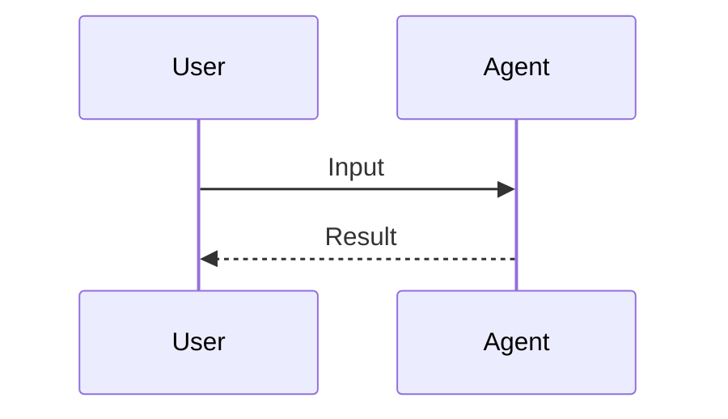
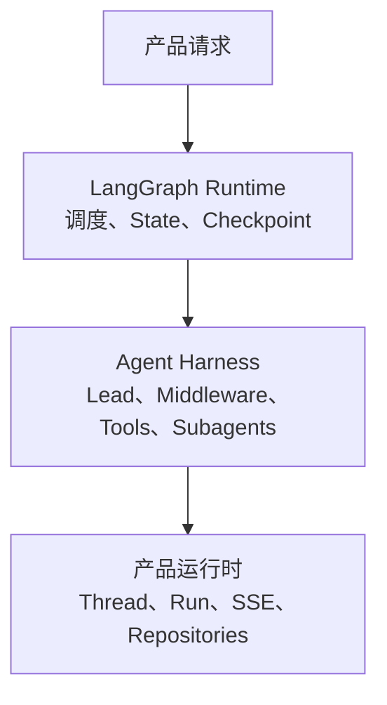
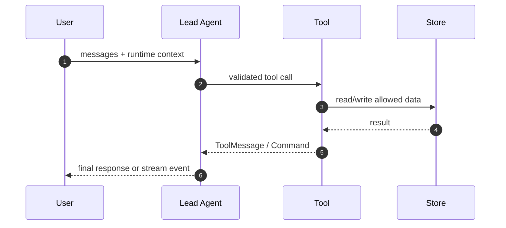
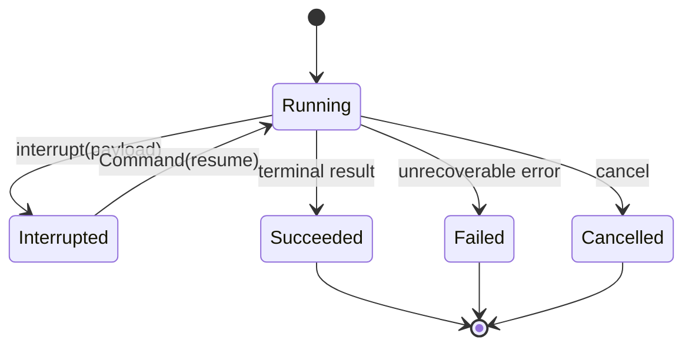
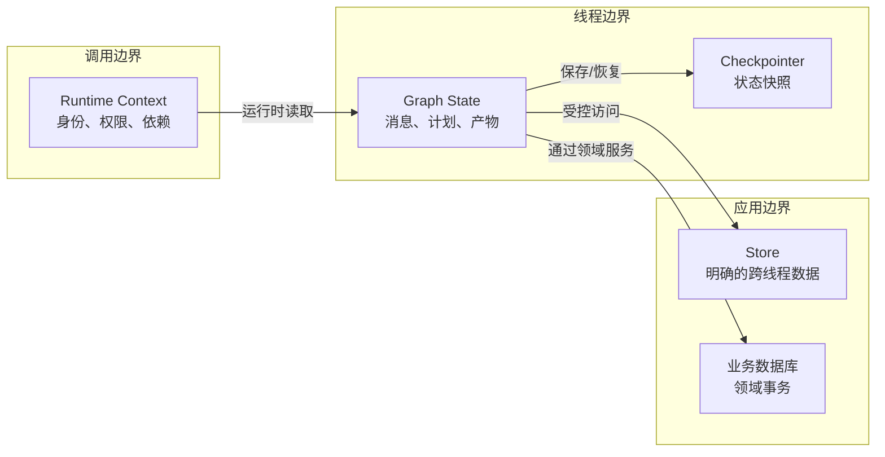
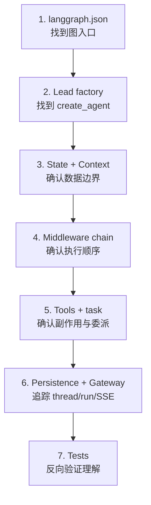
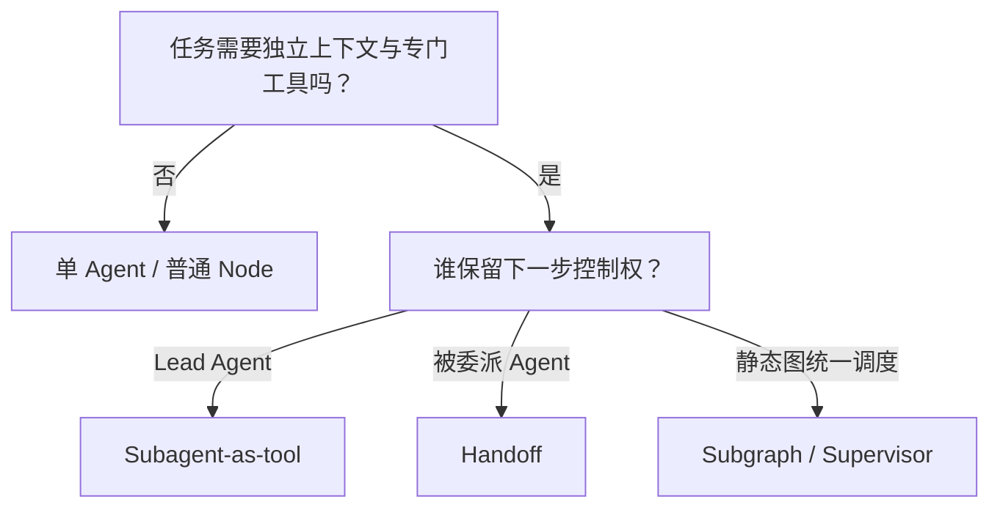
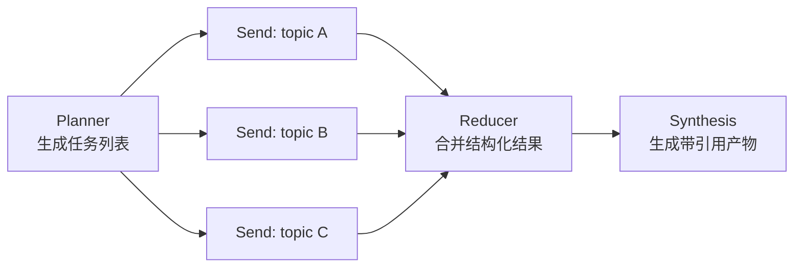

# LangGraph Agent 工程课程中文写作与视觉表达标准

> 决策日期：2026-07-13  
> 适用范围：00–16 章 Markdown、Notebook、Mini DeerFlow 代码讲解、附录、Astro 文档站与 DeerFlow 源码导读  
> 上游约束：[课程信息架构与章节契约](./04-curriculum-information-architecture.md)  
> 核心原则：详细不等于堆砌，清晰不等于简化；通过结构、层次、实验和图示降低理解成本，不通过删除原理和工程边界缩短内容。

> 2026-07-21 教学顺序更新：章节结构、实验 marker 与 Notebook 生成以[双层案例章节契约与可观察反馈格式](../../learning-experience-v2/artifacts/02-two-layer-lesson-contract.md)为准。该契约覆盖本文件旧模板中“正确实现早于失败实验”的顺序，但不替代语言、图示、安全和资料标准。

## 1. 标准的目的

本标准解决当前课程中五类不一致：

1. 有的章节先讲比喻，有的章节直接贴 API，学习者无法建立统一阅读节奏；
2. 成功示例很多，失败现象、根因和防回归断言不足；
3. Markdown 与 Notebook 手工维护两套叙事，技术结论已经漂移；
4. 流程图有时展示业务流，有时展示代码结构，但缺少图型选择规则；
5. “详细解释”容易退化成逐行翻译代码，既冗长又没有形成可迁移的心智模型。

标准的最终目标不是让所有章节长得一模一样，而是让学习者在每章都能回答：

- 我正在解决什么真实问题？
- 这个概念位于哪一层，与相邻概念的边界是什么？
- 运行时到底发生了什么？
- 错误会如何出现，怎样用证据定位？
- 我亲手修改了什么，系统如何立即反馈？
- 这项能力如何进入 Mini DeerFlow，未来如何映射到 DeerFlow？

## 2. 受众、语言与教学基调

### 2.1 默认学习者

课程默认学习者具备：

- Python 函数、类、类型提示、异步语法的基础阅读能力；
- 知道 HTTP、JSON、环境变量和虚拟环境的基本概念；
- 使用过至少一次聊天模型 API，但不要求熟悉 LangChain 或 LangGraph；
- 最终目标是构建真实 Agent 业务，而不是只运行 Notebook Demo。

对超出前置要求的内容，正文必须就地给出最小解释或链接到附录，不能用“读者应该知道”跳过控制流、持久化、并发和副作用等关键工程知识。

### 2.2 中文与英文术语

- 中文负责解释，官方 API、类型、协议和源码标识保留英文。
- 第一次出现时使用“中文概念（English Term）”，随后选择一个固定称呼。
- 不生造会掩盖技术边界的华丽译名。例如使用“流式事件（stream event）”，不使用“流光推送光栅”。
- `Runtime Context`、`Graph State`、`Store`、`Checkpointer`、`AgentMiddleware`、`Subagent` 等边界词遵循根目录 `CONTEXT.md`。
- `memory` 必须指明是模型上下文、线程状态、checkpoint、跨线程 Store，还是产品数据库，不能笼统翻译为“记忆”。
- “生产级”“工业级”“彻底解决”“永远不会”只能在给出边界、测试和失败条件时使用；一般改写为可验证的具体能力。

### 2.3 语气

- 以协作式工程讲解为主：先陈述结果，再拆解机制和权衡。
- 可以使用类比，但类比之后必须给出技术映射和类比失效边界。
- 不用“魔法”“黑盒”“一行搞定”替代机制解释。
- 不通过贬低高层 API 来突出底层 API。`create_agent` 与 StateGraph 分别解决不同抽象层的问题。
- 对易变 API 标注验证日期和状态，不使用无日期的“最新”。
- 全书默认使用同一个“研究交付任务”推进 Mini DeerFlow。新增概念应由上一版系统的可观察失败引出，不能每章重新建立人物、数据和业务场景。
- 避免连续使用“不是……而是……”“最重要的是”“你应该”等结论模板。优先写清现场、证据、判断和代价，让作者结论从工程事实中自然出现。
- 不再使用 `[知识背景 / Background]`、`[为什么要学 / Why This Matters]`、`知识点一` 等机械双语标签。官方术语可以保留英文，叙事标题使用自然中文。
- Mini DeerFlow 增量属于正文实现，不作为章末追加映射。章节结尾记录系统快照，并明确下一章必须解决的唯一主要约束。

## 3. 深度模型：怎样做到详细而不混乱

每个核心概念按照六层深度展开。不是所有段落都要重复六个标题，但正文必须覆盖这些问题。

| 层次 | 必答问题 | 示例：Checkpointer |
|---|---|---|
| 1. 业务动机 | 没有它会出现什么可观察失败？ | 进程中断后长任务从头开始 |
| 2. 概念定义 | 它是什么？由谁拥有？ | 保存 thread 的 graph checkpoint |
| 3. 相邻边界 | 它不是什么？何时不用？ | 不是跨线程 Store，也不是 RunEventStore |
| 4. 运行机制 | 数据在何时、以什么形状流动？ | superstep 后按 thread_id 写 snapshot |
| 5. 工程权衡 | 成本、性能、一致性、安全如何？ | SQLite 适合本地，生产需评估并发和 HA |
| 6. 证据与迁移 | 如何测试？如何映射到项目/源码？ | 跨进程恢复测试与 DeerFlow persistence map |

如果一个章节只完成第 1–2 层，它是概念简介；只完成第 4 层，它是 API 手册；只有六层连起来，学习者才能把知识迁移到自己的项目。

### 3.1 认知负荷控制不是删内容

使用以下方式分层，而不是减少原理：

- 先给本章一张“小地图”，再逐段放大；
- 最小实验只引入一个新变量，工程实验再组合旧能力；
- 主线讲 current API，legacy/preview 进入显式侧栏或附录；
- 重复概念链接到首次定义，但新边界必须就地解释；
- 长代码拆成可导入模块，用局部片段解释关键 seam；
- 大图拆成“总览图 + 局部时序/状态图”，不把 30 个节点塞进一张图；
- 长表格只用于精确映射和比较，不把连续论证切成表格碎片。

## 4. 单章中文 Markdown 模板

下列模板记录第一轮课程改造时的章节要素，不再规定它们的先后顺序。新版章节必须先按双层案例契约完成“真实失败 → 设计问题 → 最小概念 → 从零修复 → 工程迁移”；不能继续照抄本节中“工程实现 → 失败实验”的历史顺序。

````markdown
# 第 NN 章：中文标题（Official Term）

> 验证环境：Python X.Y / langchain X / langgraph X  
> API 状态：current / compatibility / legacy / preview  
> 前置章节：第 NN 章  
> 本章工件：`mini_deerflow/...`

## 本章先回答什么

用 2–4 段描述一个真实业务失败、为什么上一章的能力还不够，以及本章完成后的可观察变化。

### 学习目标

完成本章后，你能够：

- 用动作动词描述可验证能力；
- 避免“理解、熟悉、掌握”但没有证据的目标；
- 指出能力的适用边界。

### 前置工件检查

```bash
uv run ...
```

说明命令为什么运行、成功输出是什么、失败时优先检查什么。

## 1. 先建立边界

### 1.1 它是什么

给出准确技术定义。

### 1.2 它不是什么

与最容易混淆的两个概念对比。

### 1.3 什么时候使用，什么时候不用

给出业务判断条件和反例。

## 2. 运行时发生了什么

先写一段图的结论，再给 Mermaid 图，图后写节点/箭头说明与文本替代。

<!-- diagram:id=NN-runtime-sequence -->


**图的文本替代**：用户输入进入 Agent，Agent 完成处理后返回结果。

逐步解释输入、关键状态、调用顺序、输出和失败出口。

## 3. 最小可运行实验

### 3.1 先看完整代码

只包含本章唯一的新变量，默认离线可运行。

### 3.2 按职责解释

- 输入契约：……
- 核心调用：……
- 状态变化：……
- 输出与断言：……

### 3.3 运行并观察

```bash
uv run ...
```

列出需要观察的 state/event/checkpoint/trace，而不只展示最终文本。

## 4. 工程实现：扩展 Mini DeerFlow

### 4.1 本次改动边界

列出新增/修改模块、接口和依赖方向。

### 4.2 关键实现

展示真实模块的关键 seam，解释为什么接口这样设计。

### 4.3 与最小实验的差异

说明配置、错误处理、异步、持久化、安全和测试中新增了什么。

## 5. 失败实验：让错误可见

### 5.1 错误版本

展示最小错误代码。

### 5.2 可观察现象

给出异常类型、错误事件、错误 state 或错误副作用，不只说“不能运行”。

### 5.3 根因

沿输入 → 状态 → 控制流 → 副作用定位。

### 5.4 修复与防回归

展示最小修复，并给出会在错误复发时失败的自动断言。

## 6. 工程权衡与适用边界

讨论性能、一致性、安全、可维护性、供应商差异和替代方案。

## 7. 动手练习

### 练习 A：单点修改
### 练习 B：边界判断
### 练习 C：项目扩展
### 延迟回忆题

题目后不立即暴露答案；答案进入折叠区或独立 solution。

## 8. 自动验收

```bash
uv run pytest ...
```

- [ ] 行为断言
- [ ] 失败路径断言
- [ ] 项目集成断言
- [ ] Notebook 离线执行

## 9. 本章交付与下一章接口

- Mini DeerFlow 新增：……
- 下一章会直接使用：……
- 尚未解决且有意延后：……

## 10. DeerFlow 映射与继续阅读

指出未来对应模块和一个阅读问题，不要求此时通读大型源码。

## 参考资料

优先列官方文档、官方源码固定提交和高质量原始资料，并注明访问/验证日期。
````

## 5. 各小节的写作规则

### 5.1 标题必须表达问题或能力

推荐：

- “Runtime Context 为什么不能放进 checkpoint？”
- “用 `Command(resume=...)` 恢复审批”
- “两个并行节点如何合并 artifact？”

避免：

- “核心知识点一”
- “高级用法”
- “魔法操作”
- “工业级实战”

标题本身应帮助读者从目录恢复章节逻辑。

### 5.2 段落结构

- 第一段先给结论或问题，不用长背景热身。
- 一个段落尽量只推进一个因果关系。
- API 名称后立即说明它在运行链中的职责。
- 连续 3 个以上精确映射适合表格；因果论证仍使用段落。
- 列表项必须处于同一抽象层，避免把“一个 API”“一个架构原则”“一条命令”混在同一列表。
- 每个大节结束用 1–3 句连接下一节，不重复整个小结。

### 5.3 概念定义公式

首次定义采用：

```text
概念 = 所有者 + 生命周期 + 数据形状 + 读写者 + 失败边界
```

例如：

> Graph State 是由同一图运行中的节点共同读写、通过 reducer 合并、可由 checkpointer 按 thread 保存的业务状态；它不负责保存数据库连接、身份 secret 或所有跨线程长期数据。

这比“State 就像共享白板”更精确。类比可以随后出现，但不能替代定义。

### 5.4 类比的三段式约束

每个类比必须包含：

1. **类比**：帮助建立第一印象；
2. **技术映射**：类比中的每个角色对应哪个真实对象；
3. **失效边界**：真实系统在哪些地方不像该类比。

示例：

> 可以暂时把 Graph State 想成团队共享白板。白板对应 thread 内 state，成员对应 nodes，书写规则对应 reducers。但白板类比无法表达 checkpoint 的历史版本、并行 superstep 和序列化约束，因此工程判断仍以 state schema 与 reducer 为准。

### 5.5 版本与事实声明

- 易变 API 第一次出现时标注验证版本和日期。
- 引用 DeerFlow 源码使用固定 commit，而不是只链接 `main`。
- current、compatibility、legacy、preview 使用统一标记。
- 不把 provider-specific 行为写成 LangChain 通用保证。
- 对来源做推断时显式写“由源码调用关系推断”，不把推断伪装成官方承诺。

## 6. 代码展示与解释粒度

### 6.1 三种代码粒度

| 粒度 | 何时使用 | 解释方式 |
|---|---|---|
| 完整最小示例 | 第一次建立可运行闭环 | 展示全部代码，按输入/核心/输出解释 |
| 工程关键片段 | 模块较长，只需解释 seam | 标明真实文件路径，展示 10–35 行关键片段 |
| 差异片段 | 修复、重构或版本迁移 | 使用 diff，解释行为差异而非语法 |

禁止只展示无法运行的省略代码并称为完整实验。使用 `...` 时必须明确它是片段，并链接到真实完整文件。

### 6.2 哪些代码需要逐行解释

逐行解释只用于：

- 本章首次出现的新协议或控制原语；
- 容易产生静默错误的参数；
- 数据生命周期或安全边界；
- reducer、interrupt、stream envelope 等行为不直观代码；
- 与上一版本不同且会改变运行结果的迁移点。

常规 import、显而易见的变量赋值和已经解释过的样板代码按职责分组说明，不重复翻译每行。

### 6.3 代码前后必须回答什么

代码前：

- 输入是什么；
- 代码只演示哪个新变量；
- 依赖 offline 还是 integration profile；
- 预期观察什么。

代码后：

- 实际 state/event/output 的形状；
- 为什么得到这个结果；
- 哪个断言证明它；
- 真实项目还需要哪些工程边界。

### 6.4 输出展示

- 输出只保留支持结论的字段，长 JSON 使用折叠或注释截断。
- 截断时写清“省略了什么”，不得伪造完整 payload。
- 异常展示至少包含异常类型和关键消息，不粘贴整屏无关堆栈。
- Notebook 不保存 secret、绝对用户路径、真实敏感 prompt 或失败 traceback。
- 随机、时间、模型生成结果不能作为唯一断言；应断言结构、事件和不变量。

### 6.5 代码注释

- 注释解释“为什么”或“不变量”，不翻译语句。
- 教学编号注释如 `# 1.` 只用于 3–7 步的短闭环。
- 不用 emoji 表示关键语义；终端和屏幕阅读器下必须仍可理解。
- TODO 只出现在明确练习区域，正式实现不得留“省略核心逻辑”的 TODO。

## 7. Markdown、Notebook 与 Python 包同步标准

### 7.1 单一事实源

- 可复用业务逻辑、schema、tool、middleware、graph 和 adapter 以 Python 包为事实源。
- 概念实验的透明短代码以 Markdown lesson lab 为事实源，并按原顺序生成到 Notebook；它不承担生产复用。
- Markdown 引用工程关键片段并解释架构。
- Notebook 在概念层执行透明实验，在迁移层 import 真实模块，负责交互观察、失败注入和练习。
- 不在 Markdown 和 Notebook 分别复制一份不同的 Lead Agent 或 StateGraph。

### 7.2 Notebook 单元顺序

每个 Notebook 保持 Markdown lesson lab 的因果顺序，不再按 sync id 把所有成功实验、事件实验和失败实验重新分组。

1. 标题、上一刻系统能力、环境与预计用时；
2. 前置能力探针；
3. 按正文顺序生成预测、代码、输出、解释和修改提示；
4. 同一问题的 failure 与 repair 相邻；
5. 概念实验全部完成后再进入 Mini DeerFlow 工程迁移；
6. 分层练习、自动验收摘要和清理。

核心单元必须从空 kernel 顺序执行。integration 单元使用统一 tag，缺 key 时明确跳过。

### 7.3 代码片段标识

后续同步工具应使用稳定 marker，而不是按行号抽取：

```python
# region tutorial:05-context-schema
class RuntimeContext(...):
    ...
# endregion tutorial:05-context-schema
```

正文引用 marker，测试检查 marker 存在且唯一。这样工程文件重排不会让教材悄悄引用错误片段。

### 7.4 图示单一来源

正文中的 Mermaid 之前使用稳定标识：

```html
<!-- diagram:id=05-context-boundaries -->
```

- Markdown/Astro 直接渲染同一 Mermaid 源；
- 同步脚本从 marker 提取 Mermaid 并生成 SVG；
- Notebook 显示生成 SVG，同时保留一句文本替代；
- SVG 标记生成来源和 hash，源变化后 CI 能发现过期快照；
- 不手工在 Notebook 重画同一张图。

## 8. 失败实验标准

每章至少一个失败实验。失败实验不是“附带 troubleshooting”，而是建立调试能力和长期记忆的核心练习。

### 8.1 五段式模板

```markdown
### 失败实验：<准确描述错误>

#### 1. 错误版本
给出能稳定触发问题的最小代码。

#### 2. 先做预测
在运行前要求学习者写下：会在哪一层失败？为什么？

#### 3. 可观察现象
- 异常类型：
- 错误 state/event：
- 是否存在静默错误：
- 是否产生外部副作用：

#### 4. 根因路径
输入 → schema/context/state → control flow → side effect → output

#### 5. 修复与防回归
给出最小修复、自动断言和仍未解决的边界。
```

### 8.2 失败实验必须可重复

- 优先使用 fake model、固定 clock、临时目录、SQLite fixture 和 deterministic timeout。
- 不以“模型偶尔不听话”作为唯一失败来源。
- 外部 API 错误可以作为 integration 补充，但核心根因必须能离线复现。
- 失败单元不能污染后续 Notebook state；修复后从干净 fixture 重新运行。
- 对静默错误必须断言缺失的业务事实。例如 Agent 返回了 AIMessage，但 state 中没有 HumanMessage。

### 8.3 错误分类

失败实验覆盖面按课程推进逐渐交错：

| 类别 | 典型问题 |
|---|---|
| 配置 | 错 key、错 endpoint、版本漂移 |
| 契约 | schema validation、错误 input key、event shape |
| 状态 | reducer 冲突、context/state 混放、旧 checkpoint |
| 控制流 | 无限循环、错误路由、interrupt 恢复顺序 |
| 副作用 | 重复写入、路径逃逸、取消后仍执行 |
| 并发 | 部分失败、超时、fan-in 冲突 |
| 质量 | 答案表面正确但轨迹/引用错误 |
| 运行时 | SSE 断线、重复事件、cancel 与终态竞争 |

## 9. 练习、反馈与知识保持

teach 方法在本项目中的落点是“紧反馈 + 检索练习 + 延迟复现”，不是另建一套 HTML 课程。

### 9.1 每章四类练习

| 类型 | 目标 | 反馈方式 |
|---|---|---|
| A. 单点修改 | 熟悉本章新 API | 单元测试立即反馈 |
| B. 边界判断 | 区分相邻概念 | 给出分类结果和解释 |
| C. 项目扩展 | 把能力迁移到 Mini DeerFlow | component/integration test |
| D. 延迟回忆 | 提升长期保持，不依赖眼前代码 | 下一章开头无提示问答 |

练习不能只问术语定义。至少一题要求学习者根据生命周期判断 Context/State/Store，或根据控制权判断 Router/Subagent/Handoff。

### 9.2 难度分层

- **基础层**：只改变一个变量，测试名称直接提示目标。
- **迁移层**：换一个业务场景，不提示使用哪个 API。
- **工程层**：加入失败、并发、持久化或安全约束，需要解释设计选择。

正文最小实验解决基础层；Notebook 练习覆盖迁移层；Mini DeerFlow 任务覆盖工程层。这样“详细解释”不会夺走学习者主动推理的机会。

### 9.3 答案与提示

- 第一次提示指出观察位置，不直接给代码。
- 第二次提示指出概念或接口。
- 完整解答放在折叠区、独立 solution 或测试通过后可查看的位置。
- 多选题选项长度和格式尽量一致，避免视觉泄题。
- 设计题没有唯一答案时提供评分量规：边界、正确性、可恢复性、安全、可测试性。

### 9.4 间隔与交错

- 每章开头回忆 1 个上一章概念和 1 个更早概念。
- 第 06 章重新判断第 04 章工具数据属于 Context 还是 State。
- 第 09 章重新检查第 05 章的数据生命周期。
- 第 11 章同时使用第 02 章 schema、第 05 章 context 和第 08 章 Send/Command。
- 第 14 章重新使用第 01 章 stream contract 与第 09 章 persistence。
- 第 15 章故障演练交错此前所有能力，不按章节顺序提示解法。

## 10. 图示选择决策

先判断“关系类型”，再选择图，不因 Mermaid 能画就随意使用 flowchart。

| 需要表达的关系 | 首选图型 | 不应使用 |
|---|---|---|
| 模块、层级、所有权 | 分层/边界图 `flowchart` + `subgraph` | sequenceDiagram |
| 一次调用的时间顺序 | `sequenceDiagram` | 大量交叉的 flowchart |
| 状态与事件迁移 | `stateDiagram-v2` | 只有步骤编号的流程图 |
| 数据在存储边界间流动 | 数据边界图 `flowchart` | 无所有者的概念云 |
| 源码阅读顺序与依赖 | 导航图 `flowchart` | 按目录截图 |
| 模式选择与反例 | 决策树 `flowchart` | 一张无结论对比表 |
| 并发、恢复、故障发生顺序 | 时序图或 timeline | 静态架构图 |
| 精确字段一一对应 | 表格 | 为两列映射画图 |

## 11. Mermaid 通用规范

### 11.1 可读性

- 每张图只回答一个主问题，标题或前置段落直接写出该问题。
- 一张局部图建议 4–12 个节点；超过 15 个节点优先拆图。
- 默认 `flowchart TD` 表达学习/处理顺序，`LR` 只用于较短的管线或宽屏架构。
- 节点文本使用双引号：`A["Runtime Context"]`，包含括号、标点或 `<br/>` 时尤其如此。
- 节点先写职责，再写类名；必要时分两行，不在节点里塞段落。
- 箭头必须能读出语义。关键边使用 `-- "读取" -->`、`-. "可选" .->` 等标签。
- 同一张图的边方向保持一致，避免读者来回追线。
- 时序参与者按调用顺序从左到右，不按字母排序。
- Mermaid 源码本身应可读，即使当前 Notebook 不支持渲染，学习者仍能理解基本关系。

### 11.2 可访问性

- 颜色只做辅助，不能仅用红/绿区分成功与失败；同时使用文字、线型或图标词。
- 每张图前有一句结论，图后有“图的文本替代”。
- 文本替代应描述节点、主要边和结论，不写“如图所示”。
- 不使用只能靠悬停才能看到的信息。
- 默认字号和对比度由站点主题控制；避免硬编码浅色背景 + 浅色文字。
- 生成 SVG 必须保留可选择文本，不把架构图栅格化成低分辨率 PNG。
- 图与正文使用相同术语，缩写第一次出现时展开。

### 11.3 主题与样式

- 优先使用 Mermaid 默认主题，保证 Astro 亮/暗主题和外部 Markdown 渲染器兼容。
- `classDef` 只用于稳定语义，如 external/trust-boundary/error，不用于装饰。
- 每种语义仍写在节点文本中，样式丢失后图不能失去含义。
- 禁止依赖自定义 JavaScript click handler、远程字体或外部 CDN 才能理解图。
- 不在每张图复制大型 `init` 配置；全局主题由文档站统一管理。

### 11.4 图前与图后

推荐结构：

````markdown
下图要回答的问题是：身份、线程状态和跨线程偏好分别由谁拥有？

<!-- diagram:id=05-context-boundaries -->
```mermaid
...
```

**读图顺序**：先看请求边界，再看 thread 边界，最后看跨 thread 存储。

**图的文本替代**：Runtime Context 随调用进入；Graph State 由节点更新并按 thread checkpoint；Store 保存应用明确选择的跨线程数据。

这张图没有把业务数据库归入 Store，因为业务数据库仍有独立事务和领域模型。
````

## 12. 七类可复用 Mermaid 模板

以下模板使用课程术语演示，可复制后替换节点。每张图都必须配套本章具体文本替代。

### 12.1 概念层级图

适用：课程能力层、DeerFlow 三层架构、Agent Harness 模块关系。



文本替代模板：产品请求依次经过原生运行时、Agent Harness 和产品运行时；三层职责不同，不能把所有能力归为 Agent 本身。

### 12.2 调用时序图

适用：工具循环、interrupt/resume、subagent 委派、SSE 管线。



文本替代模板：用户输入 Lead Agent；Agent 产生校验后的工具调用；工具按权限访问 Store，并通过 ToolMessage 或 Command 返回；Agent 最终返回回答或事件。

### 12.3 状态机图

适用：Run lifecycle、HITL、retry/cancel、业务审批。



文本替代模板：运行可以进入等待审批，收到 resume 后继续；也可以成功、失败或取消，三种终态不再继续运行。

### 12.4 数据与信任边界图

适用：Context/State/Store、Sandbox、secret、业务数据库。



文本替代模板：调用身份与依赖位于 Runtime Context；线程业务事实位于 Graph State 并由 Checkpointer 保存；跨线程应用数据进入 Store；领域事务仍由业务数据库负责。

### 12.5 源码导航图

适用：DeerFlow 阅读顺序、从入口到实现的代码地图。



文本替代模板：先从图注册找到 Lead factory，再依次阅读状态、middleware、工具委派、持久化与 Gateway，最后用测试验证调用关系。

### 12.6 模式选择决策树

适用：Graph API/Functional API、Router/Handoff/Subagent、Context/State/Store。



文本替代模板：不需要独立上下文时保持单 Agent；需要时根据下一步控制权选择 subagent-as-tool、handoff 或统一调度的 subgraph/supervisor。

### 12.7 并行与汇总图

适用：`Send`、并行 subagent、fan-out/fan-in 和 reducer。



文本替代模板：Planner 将三个任务并行派发；各 worker 返回结构化结果；Reducer 汇合后交给 synthesis 生成最终产物。

## 13. 视觉资产清单（00–16）

每章至少一张关键图，但图的数量由关系复杂度决定，不设“为了好看”而强制的配额。

| 章 | 必要图 | 图型 | 回答的问题 |
|---|---|---|---|
| 00 | 课程能力路线、三载体事实源 | 层级图 | 学习顺序与验证工件如何连接？ |
| 01 | 模型/工具/Agent 入口边界、StreamPart anatomy | 概念图 + 时序图 | 谁执行工具？一个 v2 event 有什么？ |
| 02 | schema 生成与验证管线 | 数据流图 | 非结构化模型输出如何成为业务结果？ |
| 03 | 索引流与查询流 | 双管线图 | 文档入库和在线检索为何是两条路径？ |
| 04 | `create_agent` 工具循环 | 时序图 | messages、tool call、ToolMessage 如何循环？ |
| 05 | Context/State/Store/DB | 数据边界图 | 数据按什么生命周期归位？ |
| 06 | middleware 嵌套顺序 | 时序/洋葱图 | before/wrap/after 的真实执行次序是什么？ |
| 07 | StateGraph 与 reducer | 状态/控制流图 | 节点如何更新、路由和终止？ |
| 08 | Command/Send 并行汇总 | fan-out/fan-in 图 | 动态任务如何派发和合并？ |
| 09 | 四类持久化边界、恢复时序 | 边界图 + 时序图 | checkpoint、Store、Run、Event 谁负责？ |
| 10 | interrupt/resume 状态机、副作用重放 | 状态图 + 时序图 | 为什么恢复可能重复执行？ |
| 11 | 多 Agent 选择树、task 委派 | 决策树 + 时序图 | 何时选择 router/handoff/subagent？ |
| 12 | Sandbox 信任边界、扩展发现 | 边界图 | LocalSandbox 保护什么、不保护什么？ |
| 13 | 测试/评测金字塔、trace 反馈环 | 层级图 + feedback loop | 哪类证据证明哪类质量？ |
| 14 | Browser→Gateway→Runtime SSE 双管线 | 架构图 + 时序图 | thread/run/event 如何跨服务流动？ |
| 15 | Mini DeerFlow 总架构、故障演练时间线 | 架构图 + 时序图 | 完整长任务如何暂停、重启和恢复？ |
| 16 | 源码阅读地图、端到端调用链 | 导航图 + 时序图 | 如何从小项目映射到 DeerFlow？ |

可选 imagegen 候选只有两类：

- 第 00 章用于建立“从增强模型到 Agent Harness”的空间隐喻封面；
- 第 16 章用于对比“目录漫游”和“沿调用链阅读”的视觉隐喻。

两者都不是知识主图。即使不生成，也不影响课程完整性。当前阶段没有必要调用 imagegen。

## 14. Imagegen 使用边界与资产记录

### 14.1 什么时候可以用

只有同时满足以下条件才使用 imagegen：

- 需要表达空间、隐喻、氛围或视觉记忆，而不是精确 API 关系；
- Mermaid、表格和代码无法同样清楚地表达；
- 图不承担唯一事实来源；
- 未来 API 变化不需要频繁重画；
- 有明确替代文本，图片缺失不影响学习。

适合：章节封面、抽象心智模型、复杂系统的非精确鸟瞰。  
不适合：调用时序、状态迁移、数据所有权、源码依赖、字段映射、版本矩阵。

### 14.2 生成资产必须记录

每张生成图片旁保存 `<asset-id>.prompt.md`：

```markdown
# Asset: <id>

- 教学目的：
- 使用章节：
- 为什么 Mermaid 不合适：
- Prompt：
- 负面约束：
- 画幅与分辨率：
- 生成日期与工具：
- 是否包含参考图片及来源：
- Alt text：
- 人工复核：技术误导 / 文字错误 / 品牌与版权 / 可访问性
```

- 生成图中避免承载长文字，模型生成文字容易错误。
- 图片不得伪装成官方 LangChain/LangGraph/DeerFlow 架构图。
- 使用官方 logo、人物或第三方视觉资产前核对许可。
- 修改提示词后保留资产版本或变更记录，不静默覆盖。

## 15. 跨 Markdown、Notebook 与 Astro 的图示交付

### 15.1 Markdown

- Mermaid 源直接放在正文，紧邻解释段落。
- 使用稳定 diagram marker。
- 本地渲染器不支持 Mermaid 时，源码和文本替代仍可阅读。

### 15.2 Notebook

- Notebook 不手抄 Mermaid。
- 同步脚本生成 SVG，Notebook Markdown cell 引用 SVG。
- 紧邻 SVG 保留 1 段文本替代和源码 marker 链接。
- 如果 SVG 尚未生成，Notebook 预检必须失败，不能悄悄显示空白。

### 15.3 Astro

- 当前站点已使用 `astro-mermaid`，正文 Mermaid 作为主渲染路径。
- 构建时验证 Mermaid 语法；不能只在浏览器运行时才发现错误。
- 桌面和移动宽度都检查横向溢出；宽时序图允许受控滚动，并提供文本替代。
- Mermaid chunk 体积属于性能问题，后续可按需加载，但不能以删除必要图示解决。

### 15.4 SVG 与位图

- 精确关系图优先 SVG；生成 SVG 带 source hash。
- 位图至少提供 2x 像素密度，移动端不应需要放大才能读字。
- 本地图片引用使用仓库内稳定路径和明确 alt text。
- 不把截图作为代码或架构事实源；截图只用于 UI/trace 界面说明，并标注版本日期。

## 16. 图示 QA 清单

每张图在章节合并前检查：

- [ ] 图只回答一个主要问题；
- [ ] 图前给出问题或结论；
- [ ] 图后有文本替代与读图顺序；
- [ ] 节点和正文术语一致；
- [ ] 箭头方向与标签清晰；
- [ ] 不只靠颜色表达语义；
- [ ] Mermaid 源在构建中通过语法检查；
- [ ] Astro 亮色和暗色主题均可读；
- [ ] 375px 移动宽度不裁掉关键内容；
- [ ] Notebook 的 SVG 与 Mermaid source hash 一致；
- [ ] 图中没有 secret、真实用户数据或不确定的官方承诺；
- [ ] 源码图固定到 commit 或标注验证日期；
- [ ] imagegen 资产有 prompt manifest、alt text 和人工复核记录。

## 17. 章节级视觉预算

“视觉预算”限制认知负担，不限制必要内容：

- 章节开头最多一张全章总览图；
- 每个核心运行机制最多一张主图；
- 同一关系不同时用流程图、表格和长列表重复三次；
- 超过 15 节点的总图应配局部放大图，且正文说明两者关系；
- 图后只解释对结论重要的路径，不逐字朗读每个节点；
- 一个章节通常 2–5 张精确图足够，综合实战与源码导读可更多；
- imagegen 图片不计入知识图数量，但不能抢占正文首屏或弱化代码/架构事实。

## 18. 资料引用标准

- 易变 API 只以官方文档、官方源码或官方发布记录为主要依据。
- 技术搜索优先引用原始来源；社区教程用于补充解释或失败案例。
- 每章“参考资料”控制在真正支撑本章的范围，不堆无关链接。
- 引用源码时记录仓库、commit、文件路径和关键符号。
- 不大段复制文档原文；用中文重述并链接来源。
- Notebook 中的短说明链接到同章参考资料，避免重复维护 URL。

## 19. 作者自检与评审量规

每章按 0–2 分评审，满分 24 分，低于 20 分不得标记“已验证”。任一“正确性、可执行性、安全边界”为 0 分时直接阻断。

| 维度 | 0 分 | 1 分 | 2 分 |
|---|---|---|---|
| 问题建模 | API 清单 | 有场景但不具体 | 可观察失败驱动 |
| 正确性 | 有事实/API 错误 | 边界不完整 | 版本与来源可验证 |
| 概念边界 | 混用术语 | 定义正确 | 含反例与不用场景 |
| 机制解释 | 只给结果 | 有步骤 | state/event/side effect 完整 |
| 最小实验 | 不可运行 | 依赖外部 key | 离线、单变量、可断言 |
| 工程实验 | 与项目脱节 | 片段接入 | 可复用模块与测试 |
| 失败实验 | 没有 | 只展示异常 | 预测、根因、修复、回归 |
| 练习反馈 | 只有阅读题 | 有代码题 | 分层、即时反馈、迁移 |
| 图示 | 无图或装饰图 | 关系基本正确 | 选型准确且可访问 |
| 可执行性 | 未执行 | 手工成功 | CI/Notebook 自动验证 |
| 安全边界 | 未讨论 | 提到风险 | 有拒绝/泄漏/副作用测试 |
| 项目与源码迁移 | 无连接 | 只提名称 | 明确工件与 DeerFlow 问题 |

## 20. 完整章节完成清单

### 内容

- [ ] “为什么现在学”连接前后章节；
- [ ] 学习目标使用可验证动作；
- [ ] 核心概念覆盖六层深度；
- [ ] current/legacy/preview 分离；
- [ ] 类比包含技术映射和失效边界；
- [ ] 工程权衡没有被简化掉。

### 代码与实验

- [ ] 核心概念先有可观察失败，再出现术语和最小修复；
- [ ] 概念实验不导入 Mini DeerFlow，工程迁移位于概念实验之后；
- [ ] failure 与 repair 相邻，Web 与 Notebook 都保留预测和可读输出；
- [ ] 最小实验离线运行；
- [ ] 工程实验落到 Mini DeerFlow；
- [ ] 至少一个可重复失败实验；
- [ ] 输出展示 state/event/checkpoint/trace 中的关键证据；
- [ ] 练习有自动反馈和分层提示；
- [ ] 没有省略核心逻辑的正式代码。

### 图示

- [ ] 图型匹配关系类型；
- [ ] Mermaid marker 唯一；
- [ ] 有文本替代；
- [ ] Markdown、Notebook SVG、Astro 三端一致；
- [ ] 移动端、亮暗主题和无颜色场景可读；
- [ ] imagegen 若使用则有完整 manifest。

### 交付

- [ ] 本章工件可被下一章导入；
- [ ] 自动验收命令明确；
- [ ] DeerFlow 映射引用固定版本或说明阅读问题；
- [ ] Notebook 没有错误输出、secret 和绝对路径；
- [ ] 文档内部链接构建后仍有效。

## 21. 标准如何影响后续实施

后续课程重构与 Mini DeerFlow 实现必须遵循以下硬约束：

1. 先建立离线可执行模块与测试，再写依赖真实供应商的扩展实验；
2. 关键代码只维护一个事实源，Markdown 与 Notebook 不再复制不同实现；
3. 每章至少一个失败实验和一个延迟回忆问题；
4. 每张精确架构图使用 Mermaid、稳定 marker 和文本替代；
5. Imagegen 只用于非精确视觉隐喻，当前规划中没有必需生成图；
6. 章节内容可以很长，但必须用六层深度、总览/局部图和最小/工程实验控制认知负荷；
7. 不以删除 RAG 索引、Graph reducer、durable execution、middleware ordering、sandbox boundary、SSE replay 等工程细节换取篇幅；
8. 课程完成度由测试、Notebook 执行和评审量规决定，不由 README 手工打勾。
9. Notebook 保持 Markdown lesson lab 原始顺序；assert 负责回归，可观察输出负责教学。

本标准与课程信息架构共同构成后续内容任务的验收基线：信息架构决定“教什么、何时教、交付什么”，本标准决定“如何解释、如何练习、如何画图、如何证明学会”。
