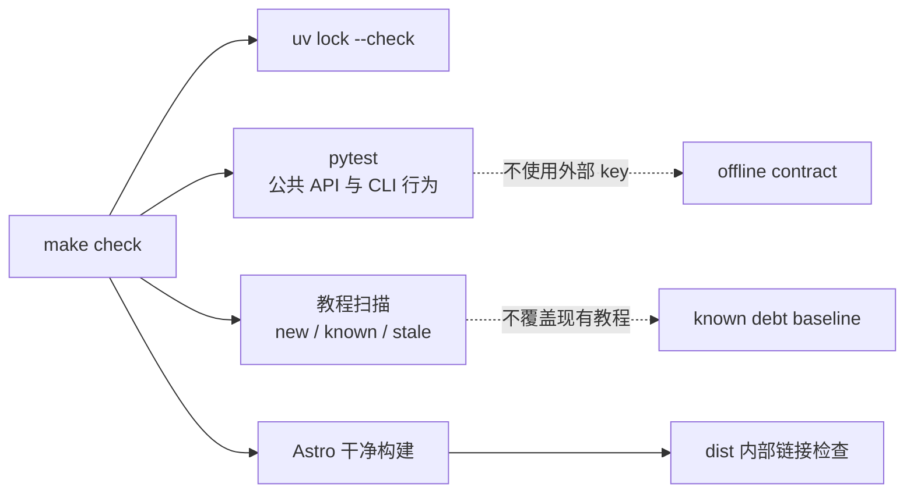

# 版本、依赖与自动验证基线实施记录

> 完成日期：2026-07-13  
> 目标：在不覆盖用户现有教程修改的前提下，为后续 00–16 章重构建立可复现版本、离线测试、教程债务和文档发布门禁。

## 1. 最终版本策略

项目采用三层版本事实：

1. `pyproject.toml` 定义课程允许的 minor 版本窗口；
2. `uv.lock` 保存唯一精确复现环境；
3. 所有课程命令通过 `uv run --locked` 执行，实际环境不得脱离 lock。

当前锁定核心版本：

| 包 | 精确版本 | `pyproject.toml` 窗口 |
|---|---:|---|
| `langchain` | 1.3.13 | `>=1.3.13,<1.4` |
| `langchain-core` | 1.4.9 | `>=1.4.9,<1.5` |
| `langgraph` | 1.2.9 | `>=1.2.9,<1.3` |
| `langsmith` | 0.10.2 | `>=0.10.2,<0.11` |

`langgraph`、`langchain-core`、`langsmith`、`requests`、`pydantic` 等课程直接使用的包已改成直接依赖。Jupyter、ipykernel、bpython、nbformat 和 pytest 进入 `dev` dependency group，避免未来 Mini DeerFlow 运行时被教学工具绑架。

详细维护规则见项目正式文档 [`docs/version-policy.md`](../../../docs/version-policy.md)。

## 2. 模型供应商与离线策略

已经清除路线图中“默认供应商”的不确定项：

- **核心默认 profile：offline**。使用 fake chat model、deterministic embeddings、临时目录和本地存储，不需要付费 API。
- **推荐真实模型 profile：DeepSeek**。它延续项目已有示例，但必须显式使用 `DEEPSEEK_API_KEY` 和 endpoint，不能借用 `OPENAI_API_KEY` 默认行为。
- **其他 integration profile：OpenAI-compatible、百炼、LangSmith、Langfuse**。缺少 key 时必须明确 skip。
- 业务代码只依赖后续统一 model/embedding factory，不按供应商散落分支。

`.env.example` 已补充百炼变量和 offline profile 说明。Secret、身份和权限不得进入 Graph State。

## 3. 本地质量门禁



命令职责：

| 命令 | 用途 |
|---|---|
| `make install` | 严格按 `uv.lock` 安装 runtime + dev group |
| `make test` | 强制 offline profile；运行全部 pytest，外部实验会被收集并明确 skip，再扫描教程债务 |
| `make test-integration` | 显式切换 integration profile；仅在同时提供对应 Key 时发出真实请求 |
| `make check-docs` | `npm ci`、Astro build、Pagefind、最终链接检查 |
| `make check` | 锁文件、Python、教程、文档的完整质量门禁 |

旧 Makefile 的 `[ -f "pytest" ]` 假判断已删除。没有测试、导入失败、契约回归和命令非零退出都不会再显示“成功”。

## 4. 公共 API 离线契约

`tests/test_langgraph_public_contracts.py` 固定了课程当前最重要的三个事实：

1. `AgentMiddleware`、`ToolRuntime`、`Command`、`Send`、`interrupt`、当前 LangSmith evaluate 和 classic indexing 入口可以导入；
2. v2 streaming 返回带 `type`、`ns`、`data` 的 event envelope，而不是 `(chunk, metadata)`；
3. `create_agent` 的标准 `messages` 输入会保留 HumanMessage，避免 `input` 字段被静默忽略。

这些测试使用 fake model 和最小 StateGraph，不访问网络。

## 5. 教程验证器与已知债务

新增 `scripts/validate_tutorials.py`，检查：

- Markdown Python fence 的 AST 语法；
- 当前锁定环境能否导入 Markdown/Notebook 使用的模块与符号；
- Notebook JSON 与 code cell 的 AST 语法；
- Markdown/Notebook 同名配对、章节号和归一化 AST 代码契约一致性；
- Notebook 保存的 error output 和全量未执行状态；
- v2 stream 二元组错误解包；
- 默认 AgentState 的错误 `input` 调用；
- `langchain.smith`、旧 evaluator、LangServe 等 legacy import。

### 为什么需要 baseline

现有教程属于用户正在修改的工作树。本任务不能为了让 CI 变绿而覆盖第 03、04、06、07、08、09 章，因此使用 `quality/tutorial-baseline.json` 显式记录 23 个已知问题：

- 新问题：`[new]`，失败；
- 未变化的已知问题：`[known]`，报告但不阻塞；
- 已修复或移动但 baseline 未更新：`[stale]`，失败并要求清理。

这不是永久忽略。后续章节任务修复一项后必须删除对应 baseline；否则 stale 会阻止合并。

当前 23 项包括：

- 第 01–09 章共 9 项 Markdown/Notebook 代码契约漂移；
- 4 项当前锁定环境不可用的导入，其中包含旧 LangSmith、LangServe，以及第 09 章未声明的 FastAPI；
- 第 04 章 Markdown/Notebook 两处 v2 stream 解包；
- 第 06 章错误 Agent `input`；
- 第 03 章 Notebook 错误输出；
- 第 07–09 章 Notebook 未执行；
- 第 09 章 3 项旧 LangSmith evaluator / dataset runner / LangServe 路径。

代码契约使用去除行号等位置属性后的 AST 指纹。已有漂移可以暂时进入 baseline，但任意一侧继续变化都会生成新指纹，同时产生 `[new]` 与 `[stale]`，不能被旧 baseline 静默放过。验证器本身通过 CLI 行为测试覆盖错误 Python、不可用导入、代码漂移、v2 stream、Notebook error、缺少配对、known/stale baseline，以及站点 base-path/越界断链。

## 6. 文档发布门禁

### 发布转换修复

`docs-site/copy-docs.mjs` 现在会：

- 同时重写 `./...md` 和 `../...md`；
- 把 Notebook 复制到 `public/notebooks` 并重写下载链接；
- 将版本策略发布为独立页面；
- 把 README 中的 `pyproject.toml` / `uv.lock` 链接改为仓库源码链接；
- 不再保留未使用的日期常量。

### base path 修复

严格链接检查首次暴露了 69 处模板根路径问题。已将 favicon、sitemap、BackButton、404、archives redirect、tag link 统一接入 `import.meta.env.BASE_URL`。部署前缀由 `SITE_BASE_PATH` / `SITE_BASE` 集中注入 Astro、复制脚本和链接检查器，修改 GitHub Pages 子路径不再需要散改模板。

### 最终链接检查

`scripts/check_site_links.py` 扫描 `dist/**/*.html` 的页面、脚本、样式和图片内部目标，处理：

- GitHub Pages base path；
- 绝对/相对 URL；
- directory index 和 `.html` 页面；
- query/fragment；
- 越界路径和缺失目标；
- 忘记添加 base 的根绝对链接。

最终验证结果为 22 个构建页面、0 个内部断链。

## 7. CI

新增 `.github/workflows/quality.yml`：

- Python job 使用 Python 3.12、uv 0.7.6、locked dev environment，运行 `make test`；
- Docs job 使用 Node 22 干净安装和构建，再用无第三方依赖的 Python checker 检查 `dist`；
- workflow 在 main/master push、pull request 和手工触发时运行；
- 只授予 contents read 权限。

原 GitHub Pages deploy workflow 保留，质量检查和部署职责没有混在一个 job 中。

## 8. 最终验证证据

完整命令：

```bash
make check
```

结果：

- `uv lock --check`：通过，解析 204 个包；
- pytest：14 passed、1 skipped；被跳过的是缺少 integration profile/Key 的真实 DeepSeek 冒烟测试；
- LangSmith 上游产生 1 个 Python 3.14 相关 DeprecationWarning，不影响当前 Python 3.12；
- tutorial validation：0 new、23 known、0 stale；
- Astro check：0 errors、0 warnings、2 hints；
- Astro build：22 pages；
- Pagefind：12 个可索引页面；中文 stemming 提示保留为后续搜索质量问题；
- site links：0 broken links。

Mermaid 仍产生两个大于 500KB chunk 的性能提示；这是后续文档发布 QA 的性能项，不通过删除必要图示解决。

## 9. 验收映射

| 任务验收 | 实现证据 |
|---|---|
| README、pyproject、uv.lock、实际环境一致 | README 解释范围/lock；核心四包实际版本与 lock 一致 |
| 一条命令完成静态与离线验证 | `make check` 已完整通过 |
| 捕获过期或不可用导入 | 锁定环境实际导入 + legacy 规则 + baseline + CLI tests |
| 捕获错误 stream 解包 | AST rule + fixture test + public v2 contract |
| 捕获 Notebook 不同步 | 同名配对、章节号、Markdown/Notebook AST 指纹、执行状态、error output |
| 捕获文档构建与链接失败 | Astro build + strict base-path link checker |
| 外部 API 缺失时核心测试稳定 | 14 项 offline 测试通过，真实供应商实验被收集并明确显示 1 skipped |

## 10. 后续任务如何消费本基线

- 重构一章时，先运行 `make test`；修复已知问题后更新 baseline，并证明 stale 消失。
- 新增 Mini DeerFlow 模块时，测试默认进入非 integration suite；真实 provider 测试使用 `integration` marker。
- 新增 Markdown 与 Notebook 必须同名、同章节号、代码契约一致；后续课程重构再以 package/marker 生成机制消除手工复制源头。
- 新增站点页面、Notebook 下载或图示后必须运行 `make check-docs`。
- 核心版本升级只通过 `docs/version-policy.md` 中的流程进行。

本任务建立的是可演进基线，不声称当前 9 章已经修复完成。质量门禁让后续大规模重构可以逐项清偿现有债务，同时阻止新问题被隐藏在“教程仍在调整”的理由下。
