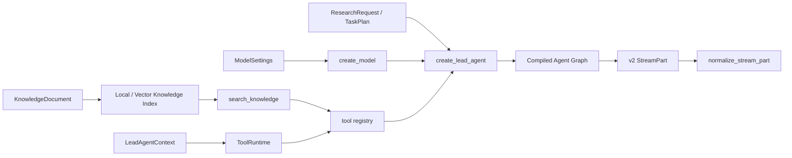

# 01–04 章模型层与 Agent 封装层重构实施记录

> 完成日期：2026-07-13  
> 课程窗口：Python 3.12 / LangChain 1.3.x / LangGraph 1.2.x  
> 对应任务：[重构增强模型层与 Agent 封装层课程](../issues/07-rebuild-model-and-agent-foundations.md)

## 1. 本轮交付结果

本轮没有删除原有详细讲解，而是在原章基础上增加工程边界、失败路径、可执行实验、练习、自动验收和 DeerFlow 对照。01–04 现在形成第一条连续纵切面：

1. 第 01 章把模型调用、Runnable、`bind_tools`、`create_agent` 和 v2 streaming 分层；
2. 第 02 章把模型结构化输出转成业务可依赖的 Schema；
3. 第 03 章把 RAG 从孤立 Chain 提升为可替换的知识 Repository 与 Agent Tool；
4. 第 04 章把模型、Schema、知识库和工具组装成首个 Lead Agent 工具循环。

四章 Markdown 共保留并扩充为 1,600 行以上中文内容；同名 Notebook 由讲义中的实验契约确定性生成并离线执行。

## 2. 学习边界如何重新划分

| 层级 | 学习者控制的对象 | 本轮公共接口 | 仍未在本轮实现 |
|---|---|---|---|
| 增强模型层 | 消息、模型配置、结构化响应、知识召回、工具 Schema | `create_model()`、Schema、Knowledge Index | Agent 生命周期和业务拓扑 |
| Agent 封装层 | 模型—工具—模型循环、Runtime Context、ToolMessage、事件消费 | `create_lead_agent()`、`build_tool_registry()`、`normalize_stream_part()` | 固定阶段、并行分支、审批恢复 |
| Graph 编排层 | State、Reducer、Node、Edge、Command、Send | 本轮只预留稳定输入输出契约 | 第 07–10 章课程任务 |
| 可靠运行层 | Checkpoint、Store、Interrupt、幂等副作用 | 本轮明确标记为后续能力 | Context/Persistence/HITL 任务 |

关键结论是：`bind_tools()` 只让模型能够产生 tool call；`create_agent()` 还拥有校验、执行工具、生成 `ToolMessage` 和再次调用模型的循环；显式 `StateGraph` 则用于表达工具循环之外的业务控制流。

## 3. Mini DeerFlow 的首条可运行纵切面

<!-- diagram:id=07-mini-deerflow-foundation-slice -->

**图的文本替代**：配置经模型工厂创建模型；结构化业务对象、知识索引生成的检索工具和 Runtime Context 共同进入 Lead Agent 工厂；编译后的 Agent Graph 产生 v2 流式事件，再由 adapter 统一解析。

### 3.1 包结构

| 模块 | 已实现责任 | 后续扩展点 |
|---|---|---|
| `mini_deerflow/config.py` | 显式 offline/deepseek profile；不把 Secret 放进状态 | Runtime、Store 和租户级配置 |
| `mini_deerflow/models.py` | 统一模型工厂与支持 tool calling 的脚本化 fake model | provider adapter、限流与回退 |
| `mini_deerflow/streaming.py` | 校验 v2 `{type, ns, data}` envelope，拒绝旧 tuple | SSE 产品事件 adapter |
| `mini_deerflow/schemas.py` | 研究请求、计划、产物引用、Subagent 结果与结构化失败 | Graph 节点之间的版本化契约 |
| `mini_deerflow/knowledge/` | 幂等本地索引、确定性向量索引、metadata filter、recall@k | 生产向量库与混合检索 adapter |
| `mini_deerflow/tools/` | 检索、计算、工作区只读、通过 `Command` 登记产物 | 权限、Sandbox、错误中间件 |
| `mini_deerflow/agents/` | 第一个标准 model → tool → model Lead Agent | Middleware、State、Checkpointer、Store |
| `mini_deerflow/fixtures.py` | 演示模型与演示知识，和生产工厂分离 | 更多离线场景 fixture |

### 3.2 源码是唯一事实源

Markdown 和 Notebook 不复制公共实现。package 用以下稳定 region 标识课程引用位置：

- `tutorial:01-model-factory`、`tutorial:01-stream-normalizer`；
- `tutorial:02-domain-schemas`；
- `tutorial:03-vector-index`、`tutorial:03-retrieval-eval`；
- `tutorial:04-tool-registry`、`tutorial:04-lead-agent-factory`。

`tests/test_tutorial_regions.py` 验证每个 region 恰好存在一对起止标记，防止教程引用静默漂移。

## 4. 四章新增的必备实验

### 第 01 章

- offline model 工厂成功路径；
- v2 stream envelope 正常解析；
- 旧 tuple 输入被 adapter 明确拒绝。

### 第 02 章

- 模型层 `with_structured_output(ResearchRequest)`；
- `TaskPlan` 嵌套校验；
- `ArtifactRef` 阻止工作区逃逸路径；
- Subagent 结构化失败；
- 成功、拒答、验证失败三种可穷尽结果。

### 第 03 章

- 本地索引幂等 upsert；
- 检索结果保留 source；
- retriever repository 包装为 Agent Tool；
- 确定性 embedding、内存 VectorStore 和 metadata filter；
- `recall@k` 离线评测；
- 空召回不伪造答案。

### 第 04 章

- 完整 model → tool → model 离线循环；
- Agent v2 event 消费；
- 计算器与知识检索工具表；
- `ToolRuntime` 注入工作区根目录并阻止目录逃逸；
- 工具用 `Command` 更新 artifact state；
- 达到迭代限制的失败路径。

## 5. Markdown 与 Notebook 同步机制

讲义中只有带 `sync=<id>` 的 Python fence 是 Notebook 的可执行契约。`scripts/sync_lesson_notebooks.py` 将其生成到同名 Notebook，并补齐以下统一学习结构：

1. 目标、环境与预计用时；
2. offline profile 初始化；
3. 版本与导入能力探针；
4. 最小成功实验；
5. 状态/事件观察；
6. 捕获并断言的失败实验；
7. Mini DeerFlow 工程调用；
8. 分层练习与自动验收；
9. 临时资源清理。

执行器使用新的 Python namespace 顺序执行每个代码单元，并在执行窗口内阻断常见 socket、`subprocess.Popen` 与 `os.system` 入口。它的用途是防止基础 Notebook 意外访问真实供应商，不是执行恶意代码的安全 Sandbox；后者仍需进程或容器隔离。四个 Notebook 连续生成两次的 SHA-256 完全一致。

仅比较两侧 AST 仍可能出现“同时删除同一个实验就变绿”的漏洞。因此新增 `quality/lesson-contracts.json`，固定 01–04 的 20 个必备实验 ID；缺少任一实验都会报告 `missing-required-experiment`。

## 6. 审查发现与修正

本任务进行了标准符合性与需求符合性两路审查，随后逐项修正：

- 为 01–04 和 package 架构图增加稳定 diagram id 与中文文本替代；
- 为章节增加 API 校准日期和资料访问日期；
- 将“完美隔离”“无法逾越”等绝对安全表述改为有边界的工程说明；
- 将演示模型与演示知识从 Lead Agent 生产工厂移到 fixtures；
- 补齐结构化输出三态、真实 VectorStore/filter/recall、ToolRuntime/Command 和 loop failure；
- 修复 Notebook 分类器中同时包含 `stream` 与 `failure` 时重复生成单元的问题；
- 让带 marker 的同步校验按 ID 比较，允许 Notebook 按成功/事件/失败的教学顺序组织。

## 7. 验证证据

完整质量结果：

- `uv lock --check`：通过，锁解析 204 个包；
- pytest：42 passed、1 skipped；跳过项是显式 opt-in 的外部集成实验；
- tutorial validation：0 new、16 known、0 stale；
- 01–04 Markdown/Notebook：无 drift、无未执行单元、无保存的 error output；
- Astro check：0 errors、0 warnings、2 hints；
- Astro build：22 pages；
- Pagefind：12 pages；
- site link validation：0 broken links。

教程已知债务从版本基线的 23 项降到 16 项，本轮清除了 01–04 的 7 项债务。剩余 16 项全部位于 05–09，分别由后续 Context/Middleware、Graph/Persistence/HITL 和 Multi-Agent 任务处理。

## 8. 本轮明确没有宣称完成的内容

- `mini_deerflow` 已能安装、导入并运行最小 Lead Agent，但完整工程骨架任务还需要 `langgraph.json`、Middleware/State/Persistence/Subagent/Runtime/API 等目录落点，因此任务 11 仍保持 open；
- 当前 Lead Agent 是标准工具循环，不声称已具有多轮恢复、长期记忆、审批、并行规划或子代理；
- 真实 provider、向量数据库和远程检索属于 integration/eval 层，离线通过不等价于生产质量；
- 课程最终综合实战和 DeerFlow 逐文件阅读指南要等 08–15 完成后整合。

## 9. 下一步

下一前沿是第 08 项：重构 Context Engineering 与 Agent Middleware。它会把本轮已经存在的 `LeadAgentContext`、artifact state 和工具 Runtime seam 扩展为清晰的 Runtime Context / Graph State / Store 三分法，并开始组装 Lead Agent 的横切治理能力。
