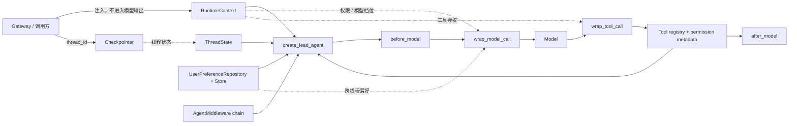

# 05–06 章 Context Engineering 与 Agent Middleware 重构实施记录

> 完成日期：2026-07-13  
> 课程窗口：Python 3.12 / LangChain 1.3.x / LangGraph 1.2.x  
> 对应任务：[重构 Context Engineering 与 Agent Middleware 课程](../issues/08-rebuild-context-and-middleware.md)

## 1. 本轮交付结果

05–06 章已经从“若干 tracing、listener、memory 概念的并列介绍”，重构为两条连续、可执行的 Agent 工程主线：

1. 第 05 章先建立 **Runtime Context / Graph State / Store / Checkpointer / 业务数据库** 的数据边界；
2. 第 06 章再把动态 Prompt、动态模型、PII、权限、工具错误、调用限制、摘要和 HITL 放入 **AgentMiddleware 生命周期**；
3. Mini DeerFlow 的 Lead Agent 工厂已能注入 `context_schema`、`state_schema`、Store、Checkpointer 与 middleware chain；
4. 讲义中的必备实验会确定性生成并离线执行同名 Notebook；
5. 课程中每个核心概念均有成功路径、失败路径或隔离性证据，不把 Runnable listener 冒充 Agent Middleware。

旧内容没有通过删减来“变简单”。Runnable listener、fallback、tracing、摘要和 HITL 都被保留，但重新放到正确的职责边界中，并补足了此前缺少的执行证据。

## 2. 数据应该放在哪里

| 数据 | 正确位置 | 生命周期与主键 | 为什么 |
|---|---|---|---|
| `user_id`、locale、当前权限、模型档位、工作区根 | Runtime Context | 单次 run，由应用注入 | 节点和工具需要读取，但模型不能通过 State 改写 |
| 消息、产物引用、中间件生命周期事件 | Graph State | 一个 `thread_id` 内演进，可被 checkpoint | 它们决定当前图下一步如何执行 |
| 用户明确保存的语言、回答细节、引用样式 | Store | 跨 thread，按 user namespace | 两个会话可共享偏好，但不能跨用户泄漏 |
| Graph 的步骤快照 | Checkpointer | `thread_id` + checkpoint lineage | 用于线程恢复、interrupt/resume 和 time travel |
| 订单、成员资格、权限授权、支付记录 | 业务数据库 | 领域主键与事务 | 它是权威业务事实，不应降格为 Agent memory |
| API key、auth token、数据库密码 | Secret manager / 进程环境 | 显式授权和轮换策略 | 不得复制到 Prompt、State、Store 或 trace |

这一分法解决了旧课程最危险的模糊点：`persistent` 不是一个统一容器。Checkpointer 保存线程执行历史，Store 保存应用主动管理的跨线程数据，业务数据库继续承担领域事务。

## 3. Mini DeerFlow 的 01–06 纵切面

<!-- diagram:id=08-mini-deerflow-context-middleware-slice -->


**图的文本替代**：调用方为一次运行注入 Runtime Context，并用 `thread_id` 选择 Checkpointer 中的线程；Lead Agent 同时组合 Thread State、Store、Middleware 和工具表。Middleware 在模型前后与模型/工具调用包装点读取这些事实；State 由 Checkpointer 按线程保存，Store 偏好可跨线程共享，但权限和模型选择仍由应用注入的 Context 控制。

## 4. 新增与收敛的公共实现

| 模块 | 当前责任 | 关键边界 |
|---|---|---|
| `mini_deerflow/context.py` | `RuntimeContext` 与安全视图 | `auth_token` 不进入 repr 或 Prompt，工作区根不进入模型视图 |
| `mini_deerflow/state.py` | `ThreadState`、`MiddlewareTraceEvent`、checkpoint safety guard | State 使用 `ArtifactRef` 和类型化生命周期事件，不依赖裸字典或编码字符串 |
| `mini_deerflow/store.py` | 用户偏好 allowlist repository | Pydantic 禁止额外字段；namespace 隔离用户；任意文本不能直接拼入 Prompt |
| `mini_deerflow/middleware/` | 生命周期、动态 Context Prompt、模型路由、工具权限、结构化错误、默认治理链 | sync/async hook 对称；权限短路先于工具副作用；普通异常不泄漏原始消息 |
| `mini_deerflow/tools/` | 工具实现与权限 metadata 共置 | 权限要求随工具注册，避免名称表与 registry 静默漂移 |
| `mini_deerflow/agents/lead_agent.py` | 组合 model、tools、state、context、middleware、store、checkpointer | 最小 HITL 可注入 Checkpointer；生产恢复、Subagent、Sandbox 明确留到后续 |

### 4.1 为什么生命周期轨迹是类型，而不是字符串

`"lead:before_model"` 适合日志展示，却不是稳定的 State 契约。代码现在保存：

```python
MiddlewareTraceEvent(middleware="lead", hook="before_model")
```

`hook` 是受限枚举，测试和后续节点可以穷尽处理；只有展示时才调用 `as_text()`。同理，`artifacts` 直接保存已校验的 `ArtifactRef`，不会在 State 中退化成缺少路径约束的裸字典。

### 4.2 Store 为什么使用 allowlist

跨线程不等于可信。若把任意 `dict[str, str]` 从 Store 拼到 system prompt，恶意偏好字段就可能成为持久化 Prompt Injection。`UserPreferences` 只允许：

- `language`；
- `answer_detail = low | medium | high`；
- `citation_style = source-first | inline`。

未知字段、超长文本和不符合枚举的值在写入时被拒绝。Store 仍然不是 Secret 容器或任意业务数据库。

## 5. AgentMiddleware 生命周期与组合顺序

对于 middleware 列表 `[A, B]`，课程用真实执行证明以下顺序：

```text
A.before_model
→ B.before_model
→ A.wrap_model_call 进入
→ B.wrap_model_call 进入
→ model
→ B.wrap_model_call 退出
→ A.wrap_model_call 退出
→ B.after_model
→ A.after_model
```

默认治理链为：

1. 生命周期 trace；
2. Context + Store 动态 Prompt；
3. email PII redaction；
4. 工具权限检查；
5. 工具异常结构化；
6. 单次 run 的模型调用上限。

顺序不是样式问题。例如权限检查必须在工具副作用发生前短路；原始 PII 一旦被外层日志记录，内层再脱敏也无法撤回。第 06 章因此同时保留正确顺序实验和错误顺序断言实验。

## 6. 本轮可执行实验

### 第 05 章：Context Engineering

- Runtime Context 安全视图不含 token；
- 嵌套 secret-shaped State 被 checkpoint safety guard 拒绝；
- Store 偏好跨 thread 共享；
- 两个 user namespace 互不读取；
- 同一个 compiled agent + Checkpointer 下两个 `thread_id` 的消息状态隔离；
- 一次运行中同时读取 Context、State、Store，但不混淆职责。

### 第 06 章：AgentMiddleware

- 自定义 middleware 的 before/after/wrap 完整生命周期；
- 多 middleware 的进入与退出顺序；
- 动态 Prompt 只读取安全 Context 与 allowlisted Store 偏好；
- 模型只可从应用预授权的模型表中路由；
- 工具 RuntimeError、TimeoutError 转成不泄漏细节的结构化错误；
- 权限缺失时 handler 不执行；
- PII redaction 和模型调用上限的成功/失败证据；
- sync/async 对称实现，取消信号不会被误转成工具错误；
- `SummarizationMiddleware` 替换旧消息；
- `HumanInTheLoopMiddleware` 完成 interrupt → reject → resume，拒绝后副作用计数保持为零；
- Runnable listener 错误签名导致“业务成功但观测静默缺失”的失败实验。

## 7. 与 DeerFlow 源码的阅读映射

第 06 章固定到已研究的 DeerFlow commit，并建立逐项映射：

| Mini DeerFlow 概念 | 阅读 DeerFlow 时寻找的结构 |
|---|---|
| `create_lead_agent` 组合入口 | Lead Agent factory / graph assembly |
| `ThreadState` | DeerFlow thread-scoped Agent State |
| `ContextPromptMiddleware` | 动态 prompt / runtime-aware middleware |
| `StructuredToolErrorMiddleware` | 工具异常到模型可见结果的边界 |
| `ToolPermissionMiddleware` + metadata | 工具注册、权限与策略链 |
| middleware 列表顺序 | DeerFlow harness 中的 middleware chain |
| Summary / HITL 最小实验 | 后续 checkpoint、interrupt、resume 阅读路径 |

这使学习者不需要记住 DeerFlow 的文件名就直接跳读，而是先掌握“工厂—State—Context—Middleware—Tool policy”的概念坐标，再沿固定版本源码核对真实实现。

## 8. 审查发现与修正

本任务进行了规格与代码标准两路审查，最终均为 CLOSED。主要修正包括：

- 把 Timeout、Permission、ValueError 和未知工具异常分类，禁止返回原始异常消息；
- Store 从任意字典改为严格 allowlist，关闭持久化 Prompt Injection 入口；
- 工具权限从独立名称表迁移到 `BaseTool.metadata`，与 registry 共置；
- 删除尚无消费者的 `model_calls` 和 `summary` State 字段；
- 将 artifact 与 middleware trace 从裸字典/编码字符串收敛为领域类型；
- 补齐 Checkpointer、Store 偏好和“自主长期记忆”之间的准确措辞；
- 把 Summary、HITL、调用上限、async cancellation、reducer 跨循环追加和 listener 静默失败都变成可执行实验；
- 将 README 中未重构的 07–09 章状态改为进行中，避免虚假完成标记。

## 9. 验证证据

最终质量结果：

- pytest：`60 passed, 1 skipped`；跳过项是显式 opt-in 外部集成实验；
- tutorial validation：`0 new, 13 known, 0 stale`；
- 教程已知债务：`16 → 13`，本轮清除 05/06 drift 与 06 Agent 输入问题；
- 04–06 Notebook 连续生成两次 SHA-256 完全一致；
- 05–06 Notebook 已离线执行，无保存的 error output；
- Astro check：0 errors、0 warnings、2 hints；
- Astro build：22 pages；
- Pagefind：12 pages；
- site link validation：0 broken links。

第一次文档构建在生成 OG 图片时因 Google Fonts TLS 请求中断失败；未修改代码，重试后完整门禁通过。该现象属于外部网络抖动，不是教程或站点结构错误。

## 10. 本轮明确没有宣称完成的内容

- 当前 InMemory Checkpointer/Store 用于证明语义，不等价于跨进程生产持久化；
- HITL 只证明 interrupt/reject/resume 与零副作用，审批 API、幂等副作用和进程重启恢复留到第 09 项；
- 07–09 旧章仍有 13 项已登记债务，不能标记为已完成；
- Subagent、Sandbox、MCP/Skills、Gateway/SSE 和最终综合实战仍由后续任务实现；
- LangSmith/Langfuse 观测与评测的完整闭环仍在后续质量任务，不因本章出现 listener 就宣称完成。

## 11. 下一步

下一前沿是第 09 项：重构 StateGraph、持久化与 HITL。它将把当前的 Thread State、Checkpointer 注入 seam 和最小 HITL 实验扩展为显式 Graph 拓扑、Reducer/Command/Send、稳定 thread 配置、durable execution、恢复协议与幂等副作用。
