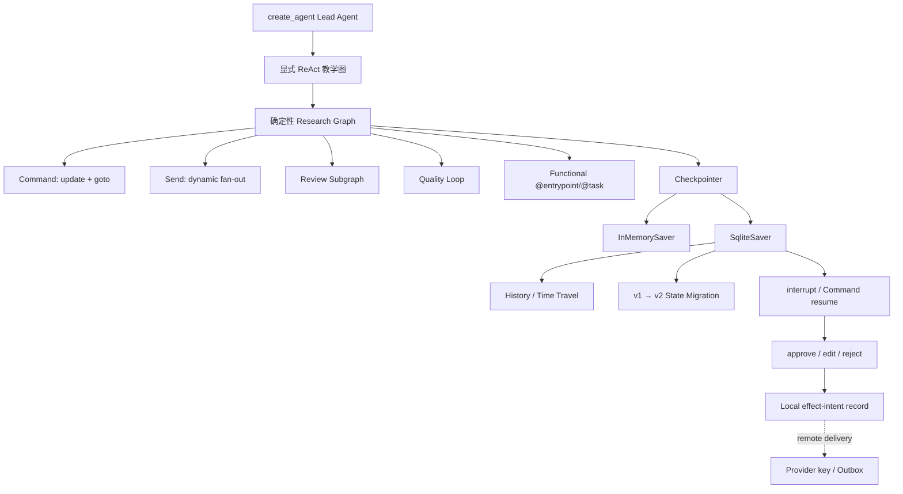

# 07–10 章 StateGraph、Persistence 与 HITL 重构实施记录

> 完成日期：2026-07-13  
> 课程窗口：Python 3.12 / LangGraph 1.2.x / langgraph-checkpoint-sqlite 3.x  
> 对应任务：[重构 StateGraph、持久化与 HITL 课程](../issues/09-rebuild-graph-persistence-hitl.md)

## 1. 本轮结果

原 07–08 只有概念介绍和空白 Notebook，原 09 把多 Agent、旧评测 API 与 LangServe 部署混在一起。本轮将 Graph 编排层重建为四个连续章节：

1. 第 07 章：State、Reducer、Node、Edge 与显式 ReAct；
2. 第 08 章：Command、Send、Subgraph、并行 reducer 与 Functional API；
3. 第 09 章：Checkpoint、Thread、SQLite、history、time travel 与 State migration；
4. 第 10 章：dynamic interrupt、approve/edit/reject、多阶段审批、节点重入与副作用边界。

07–10 的 Markdown 都有问题建模、原理、Mermaid、可执行成功实验、失败实验、练习、自动验收和 DeerFlow 对照；四份 Notebook 从 Markdown sync contract 确定性生成并离线执行。

旧 07–09 Markdown/Notebook 保存在 `legacy-course-before-09/`，其中多 Agent 内容不会被静默丢弃，将由下一路线任务按新的第 11 章职责重建。

## 2. Mini DeerFlow Graph 纵切面

<!-- diagram:id=09-mini-deerflow-graph-reliability-slice -->


**图的文本替代**：高层 Lead Agent 旁增加透明显式 ReAct 图；确定性研究图组合 Command、Send、Subgraph、循环和 Functional task policy；Graph 接入 InMemory/SQLite Checkpointer 后支持 history、time travel、State migration 与 HITL；审批后只记录本地 effect intent，远端投递仍需 provider idempotency key 或 outbox。

## 3. 新增公共模块

| 模块 | 公共接口 | 责任 |
|---|---|---|
| `graph/react.py` | `create_explicit_react_graph()` | 不依赖 prebuilt Agent factory 的 model→tools→model 循环 |
| `graph/research.py` | `create_research_workflow()` | 串行、条件、Send 并行、Subgraph、循环与 reducer |
| `graph/functional.py` | `create_functional_research_flow()` | `@entrypoint/@task`、有限 retry、cache、类型化错误聚合 |
| `graph/migration.py` | `create_research_state_migration_graph()` | 从真实 v1 SQLite checkpoint 升级到 v2 `DraftDocument` |
| `graph/approval.py` | `create_approval_workflow()` | 动态 interrupt、多阶段 resume、approve/edit/reject |
| `graph/events.py` | `WorkflowEvent` | 类型化 node trace 与 audit；字符串只用于展示 |
| `persistence.py` | `SqliteEffectLedger.record_once()` | 本地 effect intent 去重与冲突检测，不冒充远端 exactly-once |

`create_research_workflow(checkpointer=...)` 和 `create_approval_workflow(checkpointer=...)` 使用同一 compiled graph 公共 seam，课程、测试与后续 Gateway 可以直接复用。

## 4. 五类控制流如何验收

| 路径 | 工作流位置 | 外部可观察证据 |
|---|---|---|
| 串行 | intake → plan | trace 先后顺序 |
| 条件 | intake `Command(goto=plan/reject)` | 空目标无 findings，status=rejected |
| 并行 | plan 返回多个 `Send` | updates stream 出现 N 个 research_section |
| 子图 | review compiled subgraph | `get_graph(xray=True)` 包含 `review:score` |
| 循环 | review → revise → review | revision_count=1，review event 两次 |

第 07 章另实现完整显式 ReAct 工具循环，并用 recursion limit 证明无界 tool call 必须终止。第 08 章的失败实验让两个并行节点写无 reducer 字段，捕获 `InvalidUpdateError`，不把竞争静默改成 last-write-wins。

## 5. Functional API 策略

小型 Functional flow 用过程式代码展示 Graph API 以外的 durable seam：

- `TimeoutError` 最多尝试两次，`ValueError` 不重试；
- successful task 结果在 TTL 内缓存；
- 永久失败转换为 `FunctionalTaskResult(status="failed")`，entrypoint 可返回 partial aggregate；
- 第二次调用 stable/flaky task 时 attempt 不增加，证明 cache 生效；
- cache 明确不能代替写操作的 idempotency。

课程没有用 Functional API 重写 Lead Agent 或确定性 Graph，因为可视化共享 State 与复杂拓扑仍更适合 Graph API。

## 6. 持久化与 State migration

新增依赖 `langgraph-checkpoint-sqlite>=3,<4`。真实持久化实验：

1. 用 `SqliteSaver` 运行 Graph；
2. 退出 context，关闭 SQLite 连接；
3. 创建新的 saver 与 compiled graph；
4. 用相同 `thread_id` 读取或恢复 checkpoint。

State migration 实验先用 `LegacyResearchStateV1` 写入字符串 draft，关闭 saver，再由新 graph 从同一 SQLite thread 读取并升级为：

```text
schema_version = 2
draft = DraftDocument(content=..., media_type="text/markdown")
migration_status = "migrated"
```

课程同时说明了兼容前提：旧、新 schema 必须保留可读取的 channel 名；从 root channel 改为完全不同的 channel 结构时，需要离线 checkpoint ETL，而不是普通迁移节点。

## 7. HITL 与副作用边界

审批流程覆盖：

- 初次 invoke 返回 `__interrupt__`，`StateSnapshot.next == ("review",)`；
- 关闭并重新打开 SQLite saver 后，以 `Command(resume=...)` 继续；
- approve 保留 payload；edit 校验并替换；reject 不创建 effect intent；
- risk/compliance 两个 interrupt 按稳定顺序恢复；
- custom stream 连续出现三次 `review_node_entered`，证明节点初次与两次 resume 都从头进入；
- 故意在 interrupt 前 append 外部列表，resume 后出现两次，证明 checkpoint 不会回滚外部世界；
- 从 `record_effect_intent` 前的历史快照 time travel，SQLite intent 表仍只有一行；
- 相同 operation ID 的不同 action/payload 抛 `IdempotencyConflictError`；
- 两个独立 SQLite 连接经 Barrier 同时争抢同一 key，得到一条 `recorded`、一条 `already_recorded`，表中仍只有一行。

这里刻意不宣称任意远端发布 exactly-once。SQLite ledger 是本地副作用替身/意图表；远端写入必须使用供应商 idempotency key、事务 outbox、compare-and-set 或相应领域协议。Graph checkpoint 无法消除 ledger 与远端系统之间的 crash window。

## 8. DeerFlow 阅读映射

课程仍固定 DeerFlow commit `2bd0f56a0f5a418d126cb4a18e23001f54ccf024`：

| 课程能力 | DeerFlow 阅读入口 |
|---|---|
| State/reducer | `agents/thread_state.py` |
| 高层 ReAct | `agents/lead_agent/agent.py::make_lead_agent` |
| Command update | `tool_search`、`task`、`view_image` 等工具 |
| checkpointer backend | `runtime/checkpointer/async_provider.py` |
| Store backend | `runtime/store/async_provider.py` |
| runtime lifecycle | `app/gateway/deps.py` |
| pre-run checkpoint / stream / flush | `runtime/runs/worker.py` |
| cancel / rollback | `app/gateway/routers/thread_runs.py` |

显式研究 Graph 是原语教学，不宣称当前 DeerFlow 使用固定 planner→researcher→reporter 拓扑。当前 DeerFlow 的主要结构仍是 `create_agent + middleware + task/subagent-as-tool + Gateway runtime`。

## 9. 双轴审查修正

规格复核最初发现：State migration 与 Functional API task policy 只有概念，没有执行证据。已分别补充模块、测试、Notebook sync contract 和详细解释，最终 Spec 复核 CLOSED。

标准复核最初发现：

- SQLite ledger 被错误表述为任意外部副作用 exactly-once；
- 只有顺序 replay，没有并发连接竞态测试；
- Graph trace/audit 使用编码字符串。

最终修正为本地 effect-intent 语义，增加双连接并发测试，将 trace/audit 收敛为 `WorkflowEvent`，并在所有 README、图示和讲义中明确远端 outbox/provider key 边界。最终 Standards 复核 CLOSED。

## 10. 验证结果

- pytest：`71 passed, 1 skipped`；
- tutorial validation：`0 new, 0 known, 0 stale`；
- 教程已知债务：`13 → 0`；
- 07–10 Notebook 离线执行，无 error output；
- 四份 Notebook 连续生成两次 SHA-256 一致；
- Astro check：0 errors、0 warnings、2 hints；
- Astro build：23 pages；
- Pagefind：13 pages；
- site link validation：0 broken links。

## 11. 明确没有宣称完成

- SQLite 是本地/单节点教学后端，不等于 Postgres 多 worker 生产验证；
- 课程没有实现远端发布 exactly-once，只建立 effect-intent、outbox/provider key 的正确边界；
- Graph migration 只覆盖 channel 名兼容的 v1→v2，破坏性 channel migration 需要离线工具；
- 当前 Subgraph 是确定控制流，不是拥有独立 Prompt/Tools/Context 的 Subagent；
- 多 Agent、Sandbox、MCP/Skills、Gateway/SSE 与最终实战仍由后续任务完成。

## 12. 下一步

下一前沿是[重构多 Agent 模式与上下文隔离课程](../issues/10-rebuild-multi-agent-patterns.md)：比较 Router、Handoff、Supervisor、Subgraph 与 Subagent-as-tool，并实现类似 DeerFlow `task` 工具的受控并行委派和 delegation ledger。
