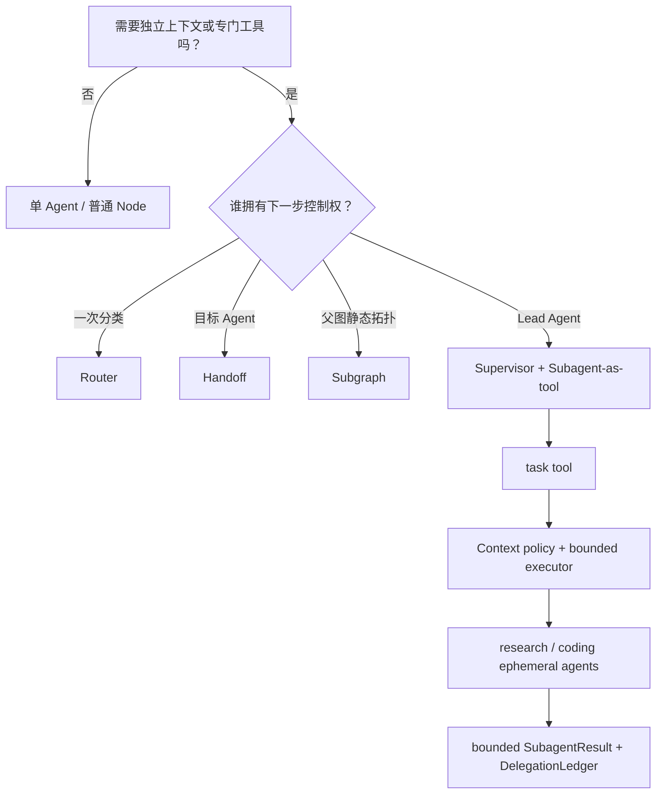
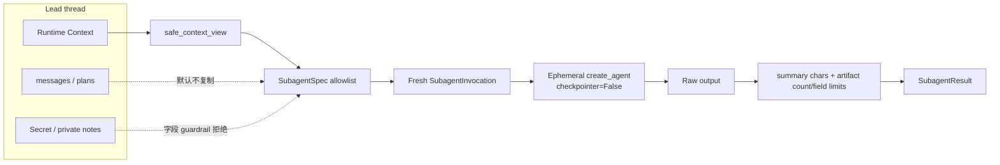

# 多 Agent 模式与上下文隔离实施记录

> 完成日期：2026-07-13  
> 对应任务：[重构多 Agent 模式与上下文隔离课程](../issues/10-rebuild-multi-agent-patterns.md)  
> API 环境：LangChain 1.3.x / LangGraph 1.2.x  
> DeerFlow 校准提交：`216309426fc6f954689ebee138af117029e43f8b`

## 1. 最终结论

第 11 章不再把“多个节点/多个角色 Prompt”统称为多 Agent，而是以**下一步控制权、会话状态所有者、上下文边界和并发需求**选择模式：

- Router：一次分类；`Command` 单路，`Send` 多路；
- Handoff：目标 Agent 成为后续 turn owner；
- Subgraph：父 Graph 固定拥有业务拓扑与显式 state 传播；
- Supervisor：Lead Agent 保存主会话并动态决定委派；
- Subagent-as-tool：临时 specialist 使用独立上下文与工具，结果返回 Lead 综合。

课程主线采用当前官方推荐的 Supervisor + Subagent-as-tool。Mini DeerFlow 使用单一 `task` tool，保留与 DeerFlow `Lead Agent → task → SubagentExecutor` 相同的核心关系，但不复制其 Gateway、线程池和产品运行时复杂度。

## 2. 模式选择流程

**图的文本替代**：不需要隔离时保持单 Agent；一次分类选择 Router；目标 specialist 接管对话选择 Handoff；固定业务拓扑选择 Subgraph；Lead 保留主会话时使用 Supervisor 与 task tool，执行器再施加输入、并发、超时和输出策略。

## 3. Mini DeerFlow 工程增量

| 文件 | 交付能力 |
|---|---|
| `mini_deerflow/subagents/contracts.py` | request、fresh invocation、output、spec 与 context/output policy |
| `mini_deerflow/subagents/registry.py` | specialist 注册、重复拒绝和安全能力摘要 |
| `mini_deerflow/subagents/builtins.py` | research/coding 两个真实 `create_agent(..., checkpointer=False)` 临时 Agent，各自绑定专门工具 |
| `mini_deerflow/subagents/executor.py` | Semaphore、timeout、partial failure、summary/artifact 预算和去敏 ledger |
| `mini_deerflow/subagents/task_tool.py` | 从每次 `ToolRuntime.context` 读取安全视图的单一 task tool |
| `mini_deerflow/subagents/patterns.py` | Command Router、Send Router、跨轮 Handoff、Subgraph reducer adapter |
| `tests/test_mini_deerflow_subagents.py` | 公共 seam、并发峰值、跨用户 Context、跨轮 owner、真实 Agent loop 与故障测试 |

`SubagentResult` 扩展为 `completed/failed/timed_out/output_too_large/rejected` 五种可穷尽状态，并限制 error、ArtifactRef 字段和 artifact 数量。异常原文不会进入 DelegationLedger；ledger 只保存终态 error code、有界 preview、context key 名、大小和 digest。

## 4. 上下文与输出策略

Secret guardrail 同时覆盖 `auth_token`、`access_token`、`refresh_token`、`client_secret`、`openai_api_key` 等常见别名。它是防回归边界，不替代应用的数据分类、工具授权与日志治理。

## 5. 失败策略

- **上下文污染**：完整父 Context 复制会稳定复现 messages/Secret 泄漏；修复为每次 ToolRuntime 安全视图 + spec allowlist。
- **并发过量**：Prompt 提示不算护栏；executor 内 Semaphore 的实测峰值不超过 2。
- **部分失败**：单个 handler exception 不取消同批成功结果，返回顺序与请求一致。
- **超时**：返回 `timed_out`；教程明确 event-loop timeout 不能强杀阻塞副作用。
- **输出过大**：summary 与 ArtifactRef 同时受预算；返回 bounded preview、引用和 SHA-256，不把完整结果注入 Lead history。
- **Reducer 重复**：Subgraph wrapper 只把 child delta 交回父 reducer，避免父输入被再次追加。

## 6. DeerFlow 映射

当前 DeerFlow 的核心路径是：

1. Lead Agent factory 用 `create_agent` 组装 tools/middleware；
2. `task(description, prompt, subagent_type)` 解析 specialist 与父运行上下文；
3. `SubagentExecutor` 再创建 `checkpointer=False` 的临时 Agent；
4. specialist 继承必要身份、workspace/sandbox 和 tool-group policy，但排除递归 task；
5. 后台执行投影 task events，终态通过 ToolMessage 回到 Lead；
6. `SubagentLimitMiddleware` 在 model 后限制同轮 task calls。

本章让学习者先在小型、离线、可测试实现中掌握这些边界；Sandbox、Artifact、MCP 与 Skills 留给第 12 章，background run/SSE 留给第 14 章。

## 7. 审查与验证

- 规格轴审查：`CLOSED`；
- 标准轴审查：`CLOSED`；
- 全量测试：`82 passed, 1 skipped`；
- 教程验证：`0 new / 0 known / 0 stale`；
- Notebook 确定性 SHA-256：`e92fbe0da786fb9e493cf6222a96dfa4d23f6671fe0848532a56faa174455d31`；
- Astro：24 pages，0 errors（模板保留 2 hints）；
- Pagefind：14 pages；
- 站内链接：0 broken links。

唯一 pytest warning 来自 LangSmith 内部对 Python 3.14 将移除的 `ast.Str` 使用，不属于本任务代码。

## 参考

- [LangChain Subagents](https://docs.langchain.com/oss/python/langchain/multi-agent/subagents)
- [LangChain Router](https://docs.langchain.com/oss/python/langchain/multi-agent/router)
- [LangChain Handoffs](https://docs.langchain.com/oss/python/langchain/multi-agent/handoffs)
- [LangChain Custom workflow](https://docs.langchain.com/oss/python/langchain/multi-agent/custom-workflow)
- [DeerFlow task tool（固定提交）](https://github.com/bytedance/deer-flow/blob/216309426fc6f954689ebee138af117029e43f8b/backend/packages/harness/deerflow/tools/builtins/task_tool.py)
- [DeerFlow SubagentExecutor（固定提交）](https://github.com/bytedance/deer-flow/blob/216309426fc6f954689ebee138af117029e43f8b/backend/packages/harness/deerflow/subagents/executor.py)
