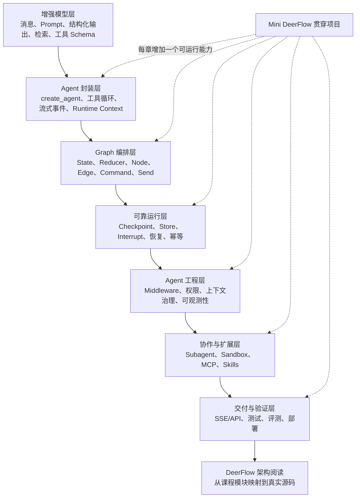
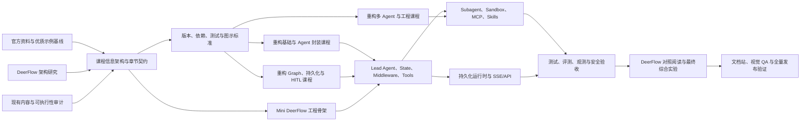

# LangGraph 学习路线与 Mini DeerFlow 改造地图

## Destination

把本项目调整为一套详细、可执行、可验证的中文 LangChain/LangGraph Agent 工程课程：学习者完成课程后能够独立构建核心 Agent 业务，并能沿着明确的源码阅读路径理解当前 DeerFlow 的 Lead Agent、状态、Middleware、工具、Subagent、Sandbox、持久化与 Gateway 架构。

最终课程必须包含一个逐章演进的 **Mini DeerFlow** 实战项目，而不是在最后附加一个与前文脱节的简单 Demo。

## Notes

- 本地图不仅负责调查和决策，也承载后续实现；`task` 类型可以直接修改课程、Notebook、实战代码和测试。
- 所有教学说明、架构解释、任务结论和验收记录以中文为主；官方术语保留英文并解释适用边界。
- 不以减少内容为优化手段。重复内容应合并，但必须补足原理、失败模式、工程权衡和可运行实验。
- 资料优先级：当前官方文档与源码 > 官方教程和模板 > 高质量开源项目 > 社区文章。社区资料只能用于补充讲法，不能作为易变 API 的唯一依据。
- 图示优先使用可版本化、可维护的 Mermaid。只有空间关系、隐喻或视觉对比无法用 Mermaid 清楚表达时才使用 imagegen，并保存提示词与来源说明。
- 修改现有文件前先检查用户未提交变更，避免覆盖已有工作。
- 每个章节必须形成“问题建模 → 原理解释 → 最小示例 → 工程示例 → 失败实验 → 练习 → 自动验收”的章节闭环。

## 学习者能力流程图

## 项目改造流程图

## Decisions so far

- [建立当前 LangChain/LangGraph 官方能力基线](./issues/01-official-ecosystem-baseline.md) — 确认课程主线为 `create_agent → AgentMiddleware → Context/State/Store → Graph/Functional API → durable execution → subagent-as-tool → Agent Server`，并建立推荐、兼容、旧版和预览 API 矩阵。
- [建立当前 DeerFlow 架构阅读基线](./issues/02-deerflow-architecture-baseline.md) — 确认 DeerFlow 是“原生 LangGraph runtime + DeerFlow Harness + Gateway 产品运行时”三层系统；Mini DeerFlow 聚焦 Lead Agent、State/Middleware/Tools/Subagents/Sandbox/Persistence/SSE 的可运行纵切面。
- [审计现有教程、Notebook 与文档站的可执行性](./issues/03-current-content-execution-audit.md) — 确认现有课程“语法基本完整但执行契约未闭环”；已定位 stream、Agent 输入、listener、provider、评测、部署、持久化语义和文档断链，并为每章给出保留、修正、迁移、删除决策及 CI-ready 验收清单。
- [确定课程信息架构与章节契约](./issues/04-curriculum-information-architecture.md) — 将课程确定为 00–16 的六阶段连续能力路线；每章都有失败实验、自动验收、Mini DeerFlow 增量和 DeerFlow 映射，现有 01–09 内容按职责拆分迁移而非简化删除。
- [建立详细教学内容与视觉表达标准](./issues/05-content-and-visual-standard.md) — 确立六层中文解释、章节闭环、失败实验与检索练习标准；精确关系采用七类 Mermaid 模板和跨端单一来源，Imagegen 仅保留给非精确视觉隐喻。
- [建立版本、依赖与自动验证基线](./issues/06-version-dependency-ci-baseline.md) — 锁定 LangChain 1.3.x / LangGraph 1.2.x 课程窗口，以 `uv.lock + make check` 建立离线可复现门禁；实际检查教程导入、Markdown/Notebook AST 漂移、公共运行契约和静态站链接，真实供应商实验默认显式跳过。
- [重构增强模型层与 Agent 封装层课程](./issues/07-rebuild-model-and-agent-foundations.md) — 01–04 已形成 model → schema → retrieval → tool-calling Agent 的可执行纵切面；Markdown 必备实验确定性生成离线 Notebook，Mini DeerFlow 已提供后续 Context、State 与 Middleware 可复用的公共 seam。
- [重构 Context Engineering 与 Agent Middleware 课程](./issues/08-rebuild-context-and-middleware.md) — 05–06 已建立 Context/State/Store/Checkpointer/业务数据库边界与真正的 AgentMiddleware 生命周期；Mini DeerFlow 已具备类型化线程状态、跨线程偏好、工具权限和可测试治理链，并映射到 DeerFlow middleware chain。
- [重构 StateGraph、持久化与 HITL 课程](./issues/09-rebuild-graph-persistence-hitl.md) — 07–10 已形成显式 ReAct、Command/Send/Subgraph/Functional API、SQLite 持久化与 migration、dynamic interrupt 和副作用边界的完整 Graph 编排层；全部旧教程债务已清零。
- [重构多 Agent 模式与上下文隔离课程](./issues/10-rebuild-multi-agent-patterns.md) — 第 11 章已用控制权区分 Router/Handoff/Subgraph/Supervisor/Subagent-as-tool，并实现真实临时 specialist、逐调用 Context、受控并发、输出预算和 delegation ledger。
- [设计并搭建 Mini DeerFlow 工程骨架](./issues/11-scaffold-mini-deerflow.md) — 已用单一组合模块装配前 11 章工件，提供可重复离线应用、依赖注入、Agent Server graph factory、架构依赖门禁，以及 sandbox/runtime/api/evals 的明确扩展落点。
- [实现 Mini DeerFlow 的 Lead Agent 核心](./issues/12-implement-lead-agent-core.md) — 已完成跨 application/SQLite 的多轮恢复、按路径合并 Artifact 的 reducer、严格顺序治理链、独立摘要模型、JSON-safe v2 事件与真实 graph Mermaid；中文专题用四次红绿重构映射 DeerFlow Lead Agent/ThreadState/Middleware。
- [实现 Subagent、Sandbox、MCP 与 Skills 扩展](./issues/13-implement-subagents-sandbox-extensions.md) — 已以 `SandboxProvider` 实现 user/thread 工作区、路径/symlink 护栏、Artifact 写入和审计；Subagent 只继承 `sandbox_id`；MCP 通过 lazy optional adapter + allowlist 接入，Skill 通过 metadata/index + on-demand body 渐进披露，并完成当前 DeerFlow 固定提交阅读映射。
- [实现持久化运行时、线程管理与 SSE/API](./issues/14-implement-runtime-api-streaming.md) — 已以独立 SQLite repository 保存产品 Thread/Run/Event，完成原子终态与取消、启动恢复、真实 interrupt/new-Run resume、四种 v2 stream mode、Last-Event-ID SSE 重放和 FastAPI adapter；专题同时明确 Agent Server/自建 Gateway 与当前 DeerFlow Runtime/StreamBridge 的边界。
- [补齐测试、评测、可观测性与安全验收](./issues/15-add-testing-evaluation-observability.md) — 已建立确定性测试 + 版本化 Dataset + outcome/trajectory/budget + regression 的离线闭环；当前 LangSmith 本地/在线 adapter、组合根唯一 trace root 和关键安全清单均有真实门禁，并映射 DeerFlow tracing/RunJournal/guardrail。
- [整合课程、综合实战与 DeerFlow 源码导读](./issues/16-integrate-course-capstone-deerflow-guide.md) — 已把检索、隔离 Subagent、Workspace 草稿、持久审批、跨重建恢复、幂等发布和三类评测装配为长任务实战；第 01–11 章增量、空目录 M1–M10 路线与 DeerFlow 当前固定提交的四条调用链已形成闭环。
- [完成文档站、视觉质量与全量发布验证](./issues/17-docs-visual-release-qa.md) — 已完成 33 页本地发布候选、21 页中文搜索索引、0 断链和桌面/390 px 窄屏浏览器 QA；10 张最终图、响应式表格、搜索、导航、日期与源码链接均通过，线上依赖和人工检查边界已单独记录。
- [把文档站浏览器发现固化为发布契约](./issues/18-automate-site-release-contracts.md) — 已把 GitHub 事实源、首页返回 base 和 Pagefind bundle base 转换为本地构建契约；缺失、错误、重复属性与越界路径均有 red → green 回归，`make check` 现同时报告内部断链与发布契约失败数。
- [对齐本地门禁、CI 与 GitHub Pages 发布产物](./issues/19-align-ci-pages-release.md) — 已让 Quality 与 Pages build 复用唯一 `make check`；step/job 条件、失败容忍和验证后重建都无法绕过本地契约，Pages 只部署紧邻门禁上传的 `docs-site/dist`，中文发布与回滚手册已进入文档站。
- [把 Posts 改造成按依赖阅读的课程路线](./issues/20-clarify-course-reading-order.md) — 已建立覆盖全部发布内容的课程清单；站点从日期倒序博客改为“全局地图 → 增强模型层 → Agent 封装层 → Graph 编排层 → Agent 工程层 → Capstone/DeerFlow”的分阶段路线，每篇直接说明核心问题与学习结果，维护资料独立为按需参考，首页与单篇导航共用同一顺序。
- [把课程正文改造成连续演进的工程书](./issues/21-turn-lessons-into-a-continuous-book.md) — 已用研究交付任务重写序章与第 01–03 章，课程入口调整为“序章 + 四部”；第一部形成“可观察模型 → 业务契约 → 可核验知识”的连续系统演进，并通过 Notebook、测试、站点、搜索、链接与发布契约验收。
- [重写第二部：让 Agent 成为受控运行时](./issues/22-rewrite-controlled-agent-runtime.md) — 已把第 04–06 章连接为“检索工具进入 Lead Agent → 事实所有权分离 → Middleware 治理”的连续演进，并完成 Notebook 与专项测试。
- [重写第三部：把业务流程写成可恢复的图](./issues/23-rewrite-recoverable-graph.md) — 已把第 07–10 章连接为“显式拓扑 → 动态并行 → 跨进程恢复 → 持久审批与幂等”的研究 Graph 演进，并完成 Notebook 与专项测试。
- [重写第四部：扩展为可交付的 Agent 系统](./issues/24-rewrite-deliverable-agent-system.md) — 已统一第 11 章、应用组合根、四个工程专题、Capstone 与 DeerFlow 导读的系统快照和迁移关系，形成从上下文隔离到真实源码阅读的连续第四部。
- [完成全书统稿与阅读质量验收](./issues/25-book-wide-editorial-qa.md) — 已完成概念依赖、术语、篇章开合、模板化表达、不可见引用与正文节奏统稿；11 个 Notebook、154 个离线测试、站点构建、搜索、链接、发布契约和 1280/390 px 视觉验收全部通过。

## Frontier

- 任务 01–25 已全部解决。课程改造、Mini DeerFlow 实战、DeerFlow 源码导读与全书质量验收均已完成；新的工作只从真实读者反馈或上游 API 变化中产生。

## Not yet specified

- 暂无；后续任务遇到新的关键分叉时再记录，避免提前臆测实现细节。

## Out of scope

- 完整复刻 DeerFlow 的全部产品功能；本项目只保留帮助理解其核心 Agent Harness 的架构关系。
- 为所有模型供应商编写等量适配教程；课程提供统一接口、一个默认实现和可替换边界。
- 构建生产级多租户 SaaS、计费系统或完整 Web 前端；这些不属于“掌握核心 Agent 业务”的必要条件。
- [DeerFlow 产品边缘能力](./issues/02-deerflow-architecture-baseline.md)，包括 IM/GitHub channels、调度器、SSO 管理后台、多 worker lease 和完整前端，只作为源码地图中的可选延伸，不进入 Mini DeerFlow 第一版。
