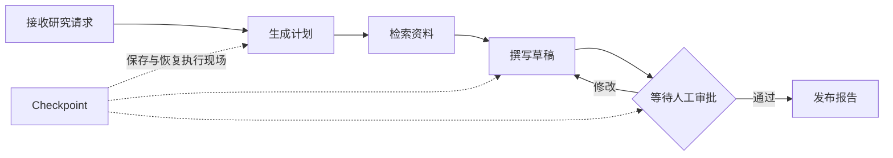

# 第 00 章：先看懂模型、Chain、Agent 和 LangGraph

> [!NOTE]
> **本章只解决一个问题**：这些名词分别位于系统哪一层，为什么课程要按这个顺序学习。
>
> **当前系统**：你会写 Python，也知道大模型可以根据输入生成回答。
>
> **遇到的问题**：模型、Chain、Agent 和 LangGraph 经常同时出现，很难判断它们是替代关系还是协作关系。
>
> **本章目标**：先建立一张坐标图，不深入 API，也不要求运行代码。
>
> **暂时不讲**：Message 细节、工具协议、State、Checkpoint 和部署。
>
> **学完以后**：你能判断一个需求只需模型调用、固定 Chain、Agent 循环，还是显式 Graph。
>
> **预计时间**：10～15 分钟。

## 先看结论

普通模型调用只负责“根据输入生成一次输出”。Chain 把固定步骤串起来；Agent 让模型在运行中选择动作；LangGraph 把必须保存和控制的状态、分支、循环、暂停与恢复写成显式流程。

```text
模型调用：用户问题 → 模型 → 回答

Chain：用户问题 → Prompt → 模型 → 格式处理 → 结果

Agent：用户问题 → 模型选择动作 → 程序执行工具
                   ↑                  ↓
                   └──── 读取结果继续判断

LangGraph：把 Agent 周围必须遵守的状态与业务流程写成图
```

它们不是四个互相竞争的框架。一个真实系统可以同时使用四层：Graph 管业务流程，某个节点运行 Agent，Agent 调用工具，工具之外还有固定 Runnable 管道。

## 1. 一次模型调用：只问一次，只答一次

先想象一个最小程序：

```text
输入：“一句话解释 checkpoint”
  ↓
聊天模型
  ↓
输出：“checkpoint 保存图执行时的状态快照”
```

程序决定何时调用模型。模型只生成这一次输出，不会自己搜索网页、执行 Python 函数或保存任务进度。

在 LangChain 中，常见入口是 `model.invoke(...)`。返回值通常是模型消息（`AIMessage`），不是普通字符串。第 01 章会实际检查它的输入和返回值。

## 2. Chain：步骤由程序提前写好

如果每次都要“套用 Prompt、调用模型、取出字符串”，可以把这三步接成固定管道：

```text
用户问题
  ↓
Prompt 模板
  ↓
模型
  ↓
输出解析器
  ↓
字符串
```

这种按预定顺序执行的组合可以叫 Chain。LangChain 现在通常用可运行组件（Runnable）表达它，例如 `prompt | model | parser`。

关键边界是：Runnable 不是 Agent。模型不能临时跳过 parser，也不能决定再执行一次检索；顺序仍由程序提前写死。

## 3. Agent：模型可以选择下一步动作

研究助手收到“查官方资料，再写一份带来源的说明”时，程序很难提前写死每次需要哪些工具。模型需要先判断是否检索、用什么查询词，以及看到结果后是否继续。

```text
用户请求
  ↓
模型：我要调用 search_docs(query="checkpoint")
  ↓
Agent Runtime：校验并执行工具
  ↓
ToolMessage：把工具结果交回模型
  ↓
模型：继续调用工具，或给出最终回答
```

这条反复判断的过程就是 Agent 循环。模型负责提出动作意图，应用提供的 Agent Runtime 负责真正执行工具，并把结果放回消息历史。

`bind_tools` 只是告诉模型有哪些工具。它不会执行 Python 函数。`create_agent` 则封装了常见的“模型 → 工具 → 模型”循环。

## 4. 为什么不一直写 `while` 循环

最小 Agent 完全可以用普通循环解释：

```text
重复：
  调用模型
  如果模型没有请求工具：结束
  校验并执行每个工具
  把工具结果交回模型
```

当需求只是“让模型在几个工具中选择”，标准 Agent 循环已经够用，不需要为了使用 LangGraph 而画图。

问题出现在业务必须证明某些顺序时。例如报告必须先检索，再审查；发布前必须等待人工审批；进程重启后必须从原位置继续。这些规则不应只写在 Prompt 里。

## 5. LangGraph：把必须控制的流程显式写出来

LangGraph 负责有状态执行。这里的“图”不是为了展示得更复杂，而是把程序必须遵守的状态与转移写成可检查代码。



**图的文本替代**：研究请求依次经过计划、检索和草稿，在人工审批处分支；Checkpoint 保存计划、草稿和等待审批时的执行现场。

你会在后面的章节逐步认识这些正式名称：

- 运行中的业务数据叫运行状态（Graph State）。
- 处理状态的一步叫节点（Node）。
- 节点之间的转移叫边（Edge）。
- 合并并发更新的规则叫状态合并函数（Reducer）。
- 保存执行现场的组件叫 Checkpointer，保存下来的现场叫 Checkpoint。
- 等待人工输入的暂停点叫 Interrupt。

现在不需要记住 API。先记住一句话：Agent 负责开放式决策，Graph 负责应用必须遵守的流程。

## 6. LangChain 和 LangGraph 怎样协作

LangChain 提供高层开发入口：模型、消息、Prompt、Runnable、结构化输出、工具和 `create_agent`。

LangGraph 提供有状态运行时：State、Node、Edge、Command、Send、Checkpoint 和 Interrupt。现在的 `create_agent` 本身也运行在 LangGraph runtime 上。

```text
LangChain：更方便地构造模型输入、工具和 Agent
                         ↓
LangGraph：保存状态，并控制分支、循环、暂停和恢复
                         ↓
应用工程：身份、权限、Sandbox、Run、SSE、评测与交付
```

DeerFlow 位于更外层。它把 Agent、Graph、Subagent、Sandbox、产品 Runtime 和前端交付装成完整系统。本书最后会用 Mini DeerFlow 建立这些边界，再沿调用链阅读真实 DeerFlow。

## 7. 用四个问题选择层级

| 需求 | 优先选择 | 原因 |
| --- | --- | --- |
| 把一句话交给模型并读取回答 | 模型调用 | 没有固定多步处理，也没有开放式动作 |
| 每次都按同一顺序执行 Prompt、模型和解析 | Runnable / Chain | 步骤由程序预先确定 |
| 让模型根据现场选择搜索、计算或写文件 | Agent | 下一步动作需要模型判断 |
| 必须保证审批、并行汇合、暂停和恢复 | LangGraph | 状态与业务转移必须显式、可保存 |

如果一个普通 Python 函数已经能清楚解决问题，就继续用函数。Agent 和 Graph 是在控制权、状态和恢复确实变复杂时才引入的工具。

## 容易混淆的概念

- Chain 不等于 Agent：Chain 的顺序固定，Agent 的下一步由模型在运行中选择。
- 工具调用意图不等于工具已经执行：模型只能请求，应用决定是否批准和执行。
- Agent 不等于 LangGraph：简单工具循环可以直接用 `create_agent`；显式业务流程再进入 Graph。
- Graph State 不等于数据库：它保存图的执行事实，不替代订单、付款、报告发布等权威业务记录。

## 不运行代码也应该回答

1. `prompt | model | parser` 为什么不是 Agent？
2. `bind_tools` 以后，Python 工具函数是否已经执行？
3. 哪类需求会让标准 Agent 循环不够用，必须把流程写进 Graph？

## 下一步

先读[课程序章](./README.md)，接手贯穿全书的研究交付任务。然后进入[第 01 章](./tutorials/01_Getting_Started.md)，实际调用模型并检查 Message 的输入与返回值。
