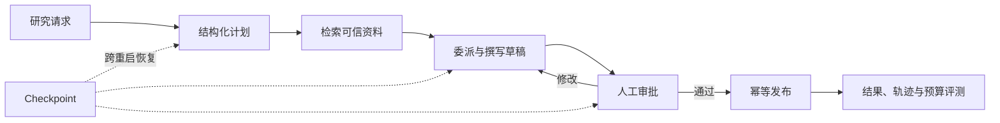
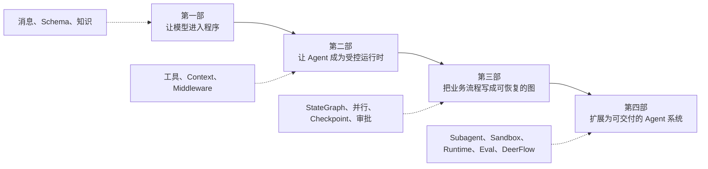

# LangChain / LangGraph Agent 工程实践

这本书只做一个项目：研究助手。起初，它只能把问题交给模型，再返回一段文字。

学到最后，它会变成 Mini DeerFlow，能够检索资料、委派任务、等待审批，并在进程重启后继续工作。

每一章都从上一次运行留下的问题开始。代码可以离线执行；Markdown 负责讲清原因，Notebook 负责让你亲手验证，测试负责守住已经建立的边界。

[在线阅读](https://chengyunlai.github.io/langchain-logbook/) · [课程改造任务](https://github.com/Chengyunlai/langchain-logbook/blob/main/TODO.md) · [版本策略](./docs/version-policy.md) · [SEO 与搜索收录](./docs/seo.md)

如果“Chain、Agent 和 LangGraph 到底是什么关系”还说不清，先读[第 00 章：先看懂模型、Chain、Agent 和 LangGraph](./ORIENTATION.md)。序章只负责介绍贯穿全书的项目，不要求你先理解完整工程架构。

## 序章：接手研究交付任务

一天，团队收到下面的请求：

> 调研 LangGraph 如何恢复长任务，给出一份带来源的中文说明。报告发布前必须由负责人审批；中途重启后不能从头再来。

你手上只有一个聊天模型。它能解释 checkpoint，却不知道什么叫“任务已经发布”，也不会保存刚才做到哪一步。

第一次运行看起来很顺利。模型给出了一段像样的回答。可程序分不清哪些句子是计划，无法验证引用，也不知道负责人是否已经批准。网络一断，刚才的进度全部消失。

我们就从这个现场开始。每一章只解决一个新暴露的问题，并留下后面可以继续使用的代码。你看到的不会是十几个互不相关的 Demo，而是同一个系统逐步长成。

最终系统需要完成下面这条业务链：



**图的文本替代**：研究请求先转换为计划，再经过资料检索、委派写作、人工审批和幂等发布；Checkpoint 保存执行现场，评测同时检查结果、轨迹与预算。

## 全书为什么分成四部

这套系统要升级四次。顺序不能颠倒：输入输出还不稳定时，工具无法安全执行；Agent 尚未受控时，业务图只是把混乱画成节点；Graph 不能恢复时，长任务服务也无从谈起。



### 第一部：让模型进入程序

先别急着画 Graph。前三章只做一件事：让模型产生程序可以读取、验证和追踪的结果。

| 章节 | 当前系统遇到的问题 | 本章交付 |
| --- | --- | --- |
| [第 01 章](./tutorials/01_Getting_Started.md) | 第一次调用模型时，不知道应传入什么、怎样读取返回值 | 模型入口、Message 输入与 AIMessage 返回值；Runnable、工具意图和流事件作为工程深入 |
| [第 02 章](./tutorials/02_Structured_Output.md) | 自然语言计划不能被路由、持久化或验证 | `TaskPlan`、`ArtifactRef`、显式失败结果 |
| [第 03 章](./tutorials/03_RAG_2.0.md) | 计划结构正确，事实却可能过时且没有来源 | 带来源 Retriever、空召回协议、recall@k 与可替换知识索引 |

第一部结束时，系统已经知道如何接收任务、描述任务并查询资料，但仍要由应用代码决定何时检索。第 04 章会让模型第一次自主选择工具。

### 第二部：让 Agent 成为受控运行时

有了稳定的消息、对象和资料来源，模型就可以开始选择工具。第 04 章先把 `model → tool → model` 循环跑通，后两章再处理身份、权限和调用预算。

| 章节 | 当前系统遇到的问题 | 本章交付 |
| --- | --- | --- |
| [第 04 章](./tutorials/04_Smart_Tooling.md) | 应用代码固定调用检索，无法由模型按任务选择工具 | 手动 ToolMessage、`create_agent` 完整循环与工具 registry |
| [第 05 章](./tutorials/05_Agent_Middleware.md) | 身份、线程事实、长期偏好和连接对象混在一起 | Runtime Context、Graph State、Store 边界 |
| [第 06 章](./tutorials/06_Observability_Persistence.md) | 权限、PII、限额和错误处理散落在工具与 Prompt 中 | 可组合、可测试的 AgentMiddleware 治理链 |

这里会第一次看到 LangChain 和 LangGraph 的接缝：入口是 `create_agent`，真正驱动循环和状态演进的是 LangGraph runtime。

### 第三部：把业务流程写成可恢复的图

工具循环适合让模型选择下一步，却无法保证审批一定发生，也说不清三个研究任务何时汇合。到了这里，固定业务规则必须离开 Prompt，进入显式 Graph。

| 章节 | 当前系统遇到的问题 | 本章交付 |
| --- | --- | --- |
| [第 07 章](./tutorials/07_StateGraph.md) | 固定流程隐藏在 Prompt 和 Agent 循环里 | State、Reducer、Node、Edge 与显式 ReAct |
| [第 08 章](./tutorials/08_Engineering_Defense.md) | 单一循环无法表达条件、动态并行和子流程 | Command、Send、Subgraph、显式循环与 Functional task |
| [第 09 章](./tutorials/09_Multi_Agent_Eval.md) | 进程退出后研究进度丢失 | Checkpointer、Thread、SQLite 与跨重启恢复 |
| [第 10 章](./tutorials/10_Human_In_The_Loop.md) | 发布前需要等待人工判断，恢复又可能重放副作用 | Interrupt、审批恢复与幂等意图记录 |

第三部结束时，研究流程已经可以暂停、恢复和重放。新的麻烦是上下文越来越长，文件和工具能力也缺少隔离。这正是第 11 章的起点。

### 第四部：扩展为可交付的 Agent 系统

最后一部把能运行的 Graph 变成可以交付的系统。我们会拆出 Subagent，给文件和命令加上 Sandbox，再为客户端增加 Run、Event 和可重放 SSE。

完成 Mini DeerFlow 后，再用同一组问题阅读 DeerFlow：谁装配 Lead Agent，谁保存运行事实，task 怎样进入 Subagent，断线后事件又从哪里重放。

| 内容 | 解决的问题 |
| --- | --- |
| [第 11 章](./tutorials/11_Multi_Agent_Patterns.md) | 用隔离 Subagent 控制上下文、并发、超时和结果预算 |
| [工程架构总览](./mini_deerflow/ARCHITECTURE.md) | 识别组合根、数据边界、能力边界与交付边界 |
| [Lead Agent 核心](./mini_deerflow/LEAD_AGENT_CORE.md) | 组合 State、Tools、Middleware、Checkpointer 与 Streaming |
| [Sandbox 与扩展](./mini_deerflow/SANDBOX_EXTENSIONS.md) | 隔离文件与命令，通过最小授权接入 MCP 和 Skills |
| [Runtime 与 Gateway](./mini_deerflow/RUNTIME_GATEWAY.md) | 把 Graph 变成可创建、取消、恢复和重连的长任务服务 |
| [评测与可观测性](./mini_deerflow/EVALUATION_OBSERVABILITY.md) | 验证结果、轨迹、预算与安全，定位单次执行失败 |
| [综合实战](./mini_deerflow/CAPSTONE.md) | 装配完整研究交付闭环并完成故障演练 |
| [DeerFlow 源码导读](./mini_deerflow/DEERFLOW_GUIDE.md) | 沿组合根与调用链阅读真实工程，不按目录漫游 |

## LangChain、LangGraph 与 DeerFlow 各自在哪里

LangChain 提供高层开发入口：模型、消息、Prompt、Runnable、结构化输出、工具和 `create_agent`。

LangGraph 负责有状态执行。State、Reducer、Command、Send、Checkpoint 和 Interrupt 让业务控制流从 Prompt 里显露出来。

DeerFlow 把这些能力装进更完整的 Agent Harness 和产品运行时。本书不会照抄它的目录，而会沿 Lead、Middleware、Subagent、Sandbox 和 Gateway 的调用链阅读源码。

```text
LangChain 高层入口
  model / messages / structured output / tools / create_agent
                         ↓
LangGraph 有状态运行时
  StateGraph / Command / Send / Checkpoint / Interrupt
                         ↓
Agent Harness 与产品交付
  Subagent / Sandbox / Runtime / SSE / Eval / DeerFlow
```

三者是叠加关系。我们先用高层接口得到可运行结果，业务需要更多控制权时，再向下一层深入。

## 每一章怎样阅读

每章开头都有一份系统快照：上一章已经能做什么，这一次运行又出了什么问题。

先写下预测，再运行代码。看到输出后，再读解释。这样，Reducer、Checkpoint 或 Middleware 都会对应一个你亲眼见过的失败，而不是一条需要背诵的定义。

真实供应商示例用来观察外部集成；确定性离线实验用来验证应用契约。前者允许随机性，后者必须稳定，两种证据不要混在一起。

如果准备把能力迁移到自己的项目，请下载每章页面顶部的 Notebook，完成“动手修改”和章末测试。只读代码，很容易把“看懂了”误当成“会用了”。

## 运行 Mini DeerFlow

运行同一条真实 Agent 路径的离线示例：

```bash
make mini-deerflow
```

运行确定性的结果、轨迹与预算评测：

```bash
make mini-deerflow-eval
```

完成包含检索、委派、草稿、审批、跨重建恢复和幂等发布的长任务：

```bash
make mini-deerflow-capstone
```

这些命令不需要 API Key。系统仍然运行真实的 `create_agent` 和 LangGraph 工具循环，只把模型回答替换成可预测的 fake model，便于稳定验证业务契约。

## 快速开始

项目使用 Python 3.12+ 和 `uv`。先准备环境：

```bash
make install-uv
make setup
make install
```

如果你使用 PyCharm，可先看 [PyCharm 快速上手](./docs/getting-started-pycharm.md)。无论使用哪种 IDE，都应让 Notebook 选择项目 `.venv` 里的 Python 内核。

需要真实模型实验时，在 `.env` 中配置对应供应商的 API Key。核心离线实验和测试不依赖外部凭证。

启动 Notebook：

```bash
make notebook
```

运行教程、测试、文档构建和链接检查组成的完整门禁：

```bash
make check
```

PR、GitHub Pages、部署后检查与回滚步骤见[发布、验证与回滚手册](./docs/release.md)。

## 版本与资料边界

- Python、LangChain 与 LangGraph 兼容范围以 [`pyproject.toml`](./pyproject.toml) 为准。
- 精确依赖版本以 [`uv.lock`](./uv.lock) 为唯一依据，`make install` 使用 `--locked`。
- DeepSeek、OpenAI-compatible 与百炼属于可选 integration profile。
- 消息、工具调用和流式协议的补充细节放在 [附录](./APPENDIX.md)，无需在第 01 章前通读。
- DeerFlow 源码结论使用固定 commit 链接，避免把持续变化的 `main` 当作稳定教材。
