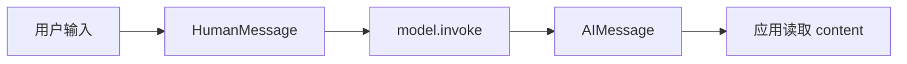

> **课程位置**：增强模型层第 1 章
> **锁定环境**：Python 3.12 / LangChain 1.3.x / LangGraph 1.2.x
> **本章工件**：真实模型入口、Message 输入与 AIMessage 返回值；Runnable、工具意图与 v2 stream 作为工程深入

> **本章导航**
> **本章只解决一个问题**：第一次调用模型时，程序传入什么，又应该怎样读取返回值。
>
> **当前系统**：第 00 章已经分清模型调用、Chain、Agent 与 LangGraph。
>
> **遇到的问题**：很多示例只打印回答正文，读者看不出 LangChain 实际传递的是 Message 对象。
>
> **本章目标**：完成一次真实调用，认清 `HumanMessage → model.invoke → AIMessage`。
>
> **暂时不讲**：Runnable、工具意图、`create_agent` 和 v2 stream 都放在后半篇“工程深入”，第一次阅读可以跳过。
>
> **学完以后**：你能替换模型、构造消息输入，并从返回的 AIMessage 中读取正文。
>
> **预计时间**：初学者主线 15 分钟；工程深入再增加 25～35 分钟。

**Notebook 阅读顺序**：网页与 Markdown 会先展示真实开发写法；Notebook 为了离线执行，首个实验直接使用 Fake Model。它不会调用外部大模型，只按脚本返回固定 AIMessage。第一次只做实验 1；实验 2～7 属于 Runnable、工具意图和 v2 stream 的工程深入。

## 1. 先别做 Agent，先看返回值

长期目标是一份带引用、可恢复、可审批的研究报告。现在先把这个目标放远一点。初学者主线没有工具、Graph 和 Subagent，只有一次模型调用。

第一次阅读只检查三个最普通的问题：输入是什么，输出是什么，为什么返回值不是普通字符串。连这三件事都说不清，后面的 Agent 封装只会像魔法。

完成第 2 节后，可以直接进入第 02 章。第 3～9 节保留 Runnable、工具调用意图和 v2 stream 等工程实验，等需要这些协议时再回来。



**图的文本替代**：用户输入先成为 HumanMessage，模型调用返回 AIMessage，应用再读取其中的 content。

## 2. 模型返回的是 Message

### 真实开发写法

真实项目先初始化一个模型，再调用 `invoke`。下面示例需要配置对应供应商的 API Key，因此不进入离线测试。

```python
from langchain.chat_models import init_chat_model


model = init_chat_model("openai:gpt-4.1-mini")
response = model.invoke("一句话解释什么是 Agent")

print(type(response).__name__)
print(response.content)
```

输入可以先写成字符串，LangChain 会把它转换成用户消息。返回值是 `AIMessage`，正文放在 `content` 中；模型名称、Token 用量等供应商信息通常位于 `response_metadata` 或 `usage_metadata`。

### 确定性测试写法

在线模型会受到网络、凭证和随机输出影响。下面改用 LangChain 自带的 Fake Model。它不会调用外部大模型，只按脚本返回固定 AIMessage，用来稳定观察消息协议；它不能证明真实模型会正确理解问题。
### 调用一次模型并检查返回消息类型

**运行前先预测**：传入 HumanMessage 后，`invoke` 返回普通字符串、字典，还是 AIMessage？

```python sync=ch01-message-invoke
from langchain_core.language_models.fake_chat_models import GenericFakeChatModel
from langchain_core.messages import AIMessage, HumanMessage, SystemMessage


single_model = GenericFakeChatModel(
    messages=iter([AIMessage(content="checkpoint 保存图运行中的状态快照。")])
)
single_input = [
    SystemMessage(content="你是研究助手，只回答当前问题。"),
    HumanMessage(content="一句话解释 checkpoint。"),
]
single_reply = single_model.invoke(single_input)

print("input_types =", [type(message).__name__ for message in single_input])
print("output_type =", type(single_reply).__name__)
print("output_content =", single_reply.content)
```

**观察结果**：

```text output=ch01-message-invoke
input_types = ['SystemMessage', 'HumanMessage']
output_type = AIMessage
output_content = checkpoint 保存图运行中的状态快照。
```

**发生了什么**：返回值是 `AIMessage`，正文放在 `content` 里。消息类型还会区分系统规则、用户输入和工具结果。后面的 Agent 循环正是靠这些类型维持顺序。

这次 `invoke` 到此为止。它不会执行工具，不会保存 Thread，也不会替我们决定下一步。

**动手修改**：增加一条历史 AIMessage 和新的 HumanMessage。预测 fake model 是否会推理历史，再说明确定性 fixture 与真实模型能力的区别。
到这里，初学者主线已经完成。你应该能回答：`invoke` 收到什么，返回什么，正文放在哪里。下面进入协议与工程深入；第一次阅读可以直接跳到[第 02 章](/langchain-logbook/posts/02_structured_output/)。

## 工程深入：固定管道、工具意图与流式事件

下面按真实的使用顺序继续：先把多个固定步骤连成 Runnable，再给模型提供工具，最后观察 Agent 的流式事件。每一步都建立在前一步的输入和输出之上。

## 3. Runnable：可以用同一种方式运行的组件

Runnable 是 LangChain 约定的一套运行接口。一个组件只要实现这套接口，就可以用 `invoke` 接收一个输入并返回一个输出，也可以进一步支持 `batch`、`stream` 和对应的异步方法。

Prompt 模板、Chat Model 和输出解析器都是 Runnable。它们做的事情不同，但调用方式相同，所以可以首尾相接。

LangChain 用 `|` 连接多个 Runnable。`prompt | model | parser` 的意思不是“让模型自己规划”，而是让数据严格按代码写好的顺序经过三个组件：

```text
输入字典 → PromptValue → AIMessage → 字符串
```

这条管道本身也是 Runnable，因此仍然用一次 `invoke` 启动。它适合翻译、分类、抽取等步骤固定的任务；如果下一步需要模型临时决定是否调用工具，就要使用后面介绍的工具调用或 Agent。

### LangChain 怎样运行一条固定管道

**运行前先预测**：最终结果还会是 AIMessage，还是解析后的字符串？模型能否跳过 Prompt 或 parser？

```python sync=ch01-runnable-pipeline
from langchain_core.language_models.fake_chat_models import GenericFakeChatModel
from langchain_core.messages import AIMessage
from langchain_core.output_parsers import StrOutputParser
from langchain_core.prompts import ChatPromptTemplate


fixed_prompt = ChatPromptTemplate.from_messages(
    [
        ("system", "把概念解释压缩成一句话。"),
        ("user", "{question}"),
    ]
)
fixed_model = GenericFakeChatModel(
    messages=iter([AIMessage(content="Runnable 是由程序固定顺序的数据流。")])
)
fixed_chain = fixed_prompt | fixed_model | StrOutputParser()
fixed_result = fixed_chain.invoke({"question": "什么是 Runnable？"})
fixed_text = str(fixed_result)

print("pipeline = prompt -> model -> parser")
print("result_type =", type(fixed_text).__name__)
print("result =", fixed_text)
```

**观察结果**：

```text output=ch01-runnable-pipeline
pipeline = prompt -> model -> parser
result_type = str
result = Runnable 是由程序固定顺序的数据流。
```

**发生了什么**：输入字典先被 Prompt 模板转换成消息，模型收到消息后返回 AIMessage，parser 再取出 `content`，所以最终类型是字符串。

这里由程序控制顺序。模型只负责中间的“消息 → AIMessage”，不能跳过 Prompt，也不能绕过 parser。Runnable 解决的是统一调用和固定组合，不是自主决策。

**动手修改**：去掉 `StrOutputParser()`。预测返回类型后运行，说明下游什么时候更适合保留完整 AIMessage。

## 4. Tool：让模型请求应用完成一件事

模型只能生成消息。它不会因为知道“查询天气”这几个字，就自动访问天气服务，也不能自己运行项目里的 Python 函数。

如果回答问题需要实时数据、数据库、文件或计算能力，应用必须把这些能力明确做成 Tool。Tool 可以理解为一份同时给模型和程序看的函数说明，包含名称、用途、参数格式和真正执行的函数。

### 用 `@tool` 把 Python 函数变成 Tool

LangChain 的 `@tool` 会读取函数名、docstring 和类型标注，生成工具名称、用途说明和参数 Schema：

```python
from langchain_core.tools import tool


@tool
def lookup_weather(city: str) -> str:
    """查询指定城市的天气。"""
    return f"{city}：晴，25°C"
```

这里的 `city: str` 告诉模型参数名和类型，docstring 告诉模型什么时候应该选择它，函数体才是真正执行的代码。说明写得含糊，真实模型就更容易选错工具或传错参数。

### `bind_tools` 只把工具说明交给模型

定义 Tool 后，还要把它绑定到模型：

```python
model_with_tools = model.bind_tools([lookup_weather])
message = model_with_tools.invoke("成都今天天气如何？")
```

`bind_tools` 返回一个带工具说明的模型。调用它时，LangChain 会把工具名称、说明和参数 Schema 一起交给模型。

真实模型读完问题后，可以直接把答案写进 `content`，也可以在 `tool_calls` 中提出调用请求。这个请求通常包含工具名、参数和调用 ID。

关键点是：模型只生成“请调用这个工具”的消息。`bind_tools` 不会执行函数，模型本身也不会执行函数。应用还要读取 `tool_calls`，检查权限和参数，然后决定是否调用。

下面使用固定返回结果的 Fake Model，专门观察这条消息协议。它不会理解“成都天气”，也没有真的选择工具；我们只是预先让它返回一个 `tool_calls`，以便稳定验证“请求已经产生，但函数尚未执行”。

### 错误做法：只读取 `content`

**运行前先预测**：AIMessage 包含天气工具调用请求时，`content` 一定有自然语言吗？工具函数会不会已经执行？

```python sync=ch01-tool-intent-failure
from langchain_core.language_models.fake_chat_models import GenericFakeChatModel
from langchain_core.messages import AIMessage
from langchain_core.tools import tool


weather_execution_count = 0


@tool
def lookup_weather(city: str) -> str:
    """查询指定城市的天气。"""
    global weather_execution_count
    weather_execution_count += 1
    return f"{city}：晴，25°C"


intent_model = GenericFakeChatModel(
    messages=iter(
        [
            AIMessage(
                content="",
                tool_calls=[
                    {
                        "name": "lookup_weather",
                        "args": {"city": "成都"},
                        "id": "weather-intent-1",
                        "type": "tool_call",
                    }
                ],
            )
        ]
    )
)
intent_message = intent_model.invoke("成都今天天气如何？")

print("content =", repr(intent_message.content))
print("naive_has_answer =", bool(intent_message.content))
print("tool_execution_count =", weather_execution_count)
```

**观察结果**：

```text output=ch01-tool-intent-failure
content = ''
naive_has_answer = False
tool_execution_count = 0
```

**发生了什么**：这条预设 AIMessage 的 `content` 是空字符串，所以只检查 `content` 会误以为模型没有返回结果。真正的信息在 `tool_calls`。

执行计数仍然是零，证明 Python 函数没有运行。`tool_calls` 只表达调用请求，不代表应用已经批准并执行。

**动手修改**：打印 `lookup_weather.name`、`description` 和参数 Schema。修改 docstring 并重新定义 Tool，观察说明怎样变化；这个 Fake Model 的预设输出不会随之变化。

### 正确做法：读取 `tool_calls`

**运行前先预测**：tool call 中哪一个字段把未来 ToolMessage 与这次请求关联起来？

```python sync=ch01-tool-intent-repair
from langchain_core.language_models.fake_chat_models import GenericFakeChatModel
from langchain_core.messages import AIMessage
from langchain_core.tools import tool


inspected_execution_count = 0


@tool
def inspectable_weather(city: str) -> str:
    """查询指定城市的天气。"""
    global inspected_execution_count
    inspected_execution_count += 1
    return f"{city}：晴，25°C"


inspectable_model = GenericFakeChatModel(
    messages=iter(
        [
            AIMessage(
                content="",
                tool_calls=[
                    {
                        "name": "inspectable_weather",
                        "args": {"city": "成都"},
                        "id": "weather-intent-2",
                        "type": "tool_call",
                    }
                ],
            )
        ]
    )
)
inspected_message = inspectable_model.invoke("成都今天天气如何？")
tool_intent = inspected_message.tool_calls[0]

print("tool_name =", tool_intent["name"])
print("tool_args =", tool_intent["args"])
print("tool_call_id =", tool_intent["id"])
print("tool_execution_count =", inspected_execution_count)
```

**观察结果**：

```text output=ch01-tool-intent-repair
tool_name = inspectable_weather
tool_args = {'city': '成都'}
tool_call_id = weather-intent-2
tool_execution_count = 0
```

**发生了什么**：`name` 表示模型请求哪个工具，`args` 是模型生成的参数，`id` 用来把未来的工具结果和这次请求配对。

我们只是正确读出了请求，执行计数仍然是零。接下来必须由应用决定是否执行 `inspectable_weather`。

**动手修改**：打印 `inspected_message.content` 和完整的 `inspected_message.tool_calls`，确认自然语言正文与工具调用请求位于 AIMessage 的不同字段。

## 5. `create_agent`：替应用运行标准工具循环

拿到 `tool_calls` 后，应用还要完成四步：

1. 根据 `name` 找到允许调用的 Tool，并校验 `args`。
2. 执行 Tool，把成功结果或错误转换成 `ToolMessage`。
3. 用相同的 tool call ID，把 `ToolMessage` 与原请求配对。
4. 把更新后的消息列表再次交给模型，让模型决定继续调用工具还是给出最终回答。

手动实现可以看清协议，但每个项目都重复编写这套循环很容易出错。`create_agent` 接收模型和 Tool 列表，在内部完成模型调用、工具执行、结果回填和再次调用模型。

```python
from langchain.agents import create_agent

agent = create_agent(model=model, tools=[lookup_weather])
result = agent.invoke({"messages": [("user", "查询成都天气并解释结果")]})
```

`create_agent` 没有改变 Tool 的含义，也没有让模型直接执行 Python。它只是让 LangGraph 运行时接管应用原本需要手写的标准循环。

完整消息顺序是：

```text
HumanMessage
→ AIMessage(tool_calls)
→ 应用执行 Tool
→ ToolMessage
→ AIMessage(最终回答或下一次 tool_calls)
```

第 04 章会手动完成一次 tool call，再使用 `create_agent` 跑完整循环。当前先记住责任边界：模型提出请求，应用执行工具，Agent 负责组织循环。

下面暂时创建一个没有工具的 Agent，只为了观察 LangGraph v2 stream。工具执行仍留在第 04 章。

## 6. Streaming：任务还没结束，也能不断返回进度

`invoke` 会等待整个任务结束，再一次性返回最终结果。模型回答很长或 Agent 连续调用多个工具时，用户只能一直等待，看不出程序是否仍在工作。

Streaming 会把一次运行拆成多个片段。调用 `.stream(...)` 后，程序得到一个可以逐项读取的迭代器；每读到一项，就可以立即显示文本、节点进度或工具状态。

### `stream_mode` 决定要观察哪类信息

LangGraph 可以从同一次运行中提供不同视角。第 01 章先看两种：

- `messages`：模型产生的消息片段。它适合逐步显示模型文本。
- `updates`：某个节点完成后写入的状态更新。它适合更新步骤、进度和调试信息。

传入 `stream_mode=["messages", "updates"]`，表示两类信息都要。它们的用途和数据结构不同，读取时不能混为一谈。

### v2 用统一的事件信封包住不同数据

设置 `version="v2"` 后，每次迭代得到的最外层都是一个事件字典，包含三个字段：

- `type`：事件类型，例如 `messages` 或 `updates`。
- `ns`：事件来自哪一层图。根图使用空元组，子图会带路径。
- `data`：真正的数据，结构由 `type` 决定。

`messages` 事件的 `data` 才是 `(chunk, metadata)`；`updates` 事件的 `data` 是节点状态更新。因此，正确顺序必须是先读 `type`，再按对应规则解释 `data`。

下面为了稳定比较，会先用 `list(...)` 收集事件。真实界面通常直接遍历迭代器，否则收集完再显示就失去了实时输出的意义。

### 错误做法：把整个 v2 event 当成二元组

**运行前先预测**：迭代一个包含三个 key 的 event 字典时，`chunk, metadata = event` 会得到什么？

```python sync=ch01-stream-shape-failure
from langchain.agents import create_agent
from langchain_core.language_models.fake_chat_models import GenericFakeChatModel
from langchain_core.messages import AIMessage


wrong_stream_agent = create_agent(
    GenericFakeChatModel(messages=iter([AIMessage(content="流式回答")])),
    tools=[],
)
wrong_events = list(
    wrong_stream_agent.stream(
        {"messages": [("user", "开始流式回答")]},
        stream_mode=["messages", "updates"],
        version="v2",
    )
)
first_event = wrong_events[0]
print("event_keys =", list(first_event))
try:
    chunk, metadata = first_event
except ValueError as error:
    assert "too many values" in str(error)
    print("ValueError: v2 event has three envelope fields")
else:
    raise AssertionError((chunk, metadata))
```

**观察结果**：

```text output=ch01-stream-shape-failure
event_keys = ['type', 'ns', 'data']
ValueError: v2 event has three envelope fields
```

**发生了什么**：Python 解包字典时得到的是 key，而不是 value。最外层有 `type`、`ns` 和 `data` 三个 key，所以无法解包给两个变量。

即使字典碰巧只有两个 key，代码也只会得到两个 key 字符串，不会得到消息片段。问题不在字段数量，而在读取了错误的层级。

**动手修改**：只打印 `event["data"]`，比较 messages 与 updates 两类 payload。不要假设它们拥有相同结构。

### 正确做法：先识别事件，再读取 `data`

**运行前先预测**：没有子图时 `ns` 是什么？messages 与 updates 分别暴露模型文本还是节点 patch？

```python sync=ch01-stream-envelope
from langchain.agents import create_agent
from langchain_core.language_models.fake_chat_models import GenericFakeChatModel
from langchain_core.messages import AIMessage


correct_stream_agent = create_agent(
    GenericFakeChatModel(messages=iter([AIMessage(content="流式回答")])),
    tools=[],
)
correct_events = list(
    correct_stream_agent.stream(
        {"messages": [("user", "开始流式回答")]},
        stream_mode=["messages", "updates"],
        version="v2",
    )
)

for event in correct_events:
    if event["type"] == "messages":
        chunk, metadata = event["data"]
        print(
            "messages",
            {"ns": event["ns"], "node": metadata.get("langgraph_node"), "text": chunk.content},
        )
    elif event["type"] == "updates":
        print("updates", {"ns": event["ns"], "nodes": list(event["data"])})
```

**观察结果**：

```text output=ch01-stream-envelope
messages {'ns': (), 'node': 'model', 'text': '流式回答'}
updates {'ns': (), 'nodes': ['model']}
```

**发生了什么**：`messages` 分支把 `data` 解包成消息片段和元数据，因此可以取得文本与节点名。`updates` 分支把 `data` 当作节点更新字典，因此可以看到哪个节点刚刚写入状态。

两个事件的 `ns` 都是空元组，说明它们来自根图。以后使用子图或 Subagent 时，`ns` 会指出事件的嵌套路径，界面才能把相同名称的节点区分开。

**动手修改**：只订阅 `messages`，再只订阅 `updates`。说明终端逐字输出和 UI 状态重建分别更依赖哪一种事件。

## 7. 把五种入口放到一起

现在已经见过单次模型、Runnable、Tool、Agent 和 streaming，可以用“谁决定下一步”来选择入口。

| 入口 | 谁控制下一步 | 返回或观察对象 | 本章边界 |
|---|---|---|---|
| `model.invoke` | 调用方只发起一次 | AIMessage | 不执行工具、不持久化 |
| `prompt \| model \| parser` | 程序固定顺序 | parser 输出 | 不自主规划 |
| `model.bind_tools` | 模型决定是否请求工具 | AIMessage.tool_calls | 函数仍未执行 |
| `create_agent` | 运行时重复标准工具循环 | Agent State / events | 第 04 章完整实践 |
| 显式 StateGraph | 应用声明业务拓扑 | State / updates / values | 第 07 章开始实践 |

固定翻译由程序控制，用 Runnable 就够了。模型需要在多个工具之间临时选择时，可以使用 `create_agent`。审批、并行和恢复属于应用必须强制执行的业务规则，后面会用显式 StateGraph 定义节点和连线。

## 8. Mini DeerFlow：在 LangChain 外面提供稳定的项目接口

前面的代码直接创建模型并读取 LangGraph 事件，适合学习协议。进入真实项目后，如果每个调用方都自己选择供应商、读取环境变量和解析事件，配置与兼容逻辑会散落在整个代码库。

Mini DeerFlow 在框架外增加两层很薄的项目接口：

1. 模型工厂接收 `ModelSettings`，明确选择离线模型或真实模型。
2. Stream adapter 把 LangGraph 事件转换成项目内部统一的事件对象。

### 为什么需要模型工厂

离线学习需要固定返回值，集成测试才需要访问真实供应商。模型工厂把这种选择放在 `profile` 中，调用方仍然只拿到一个可以 `invoke` 的 Chat Model。

这样做不是隐藏模型协议，而是集中处理模型名称、温度、API Key 检查和供应商初始化。业务代码不需要到处判断当前使用的是 Fake Model 还是 DeepSeek。

### 为什么需要 Stream adapter

界面和 Gateway 需要长期依赖稳定字段，但上游事件可能随着框架版本或 stream mode 改变。Adapter 在边界处读取 `type`、`ns` 和 `data`，再转换成项目自己的事件类型。

它不能编造或丢弃事件事实。它只统一字段名称和对象类型，让后面的终端、SSE 与测试使用同一种读取方式。

### 对照模型工厂与 Stream adapter

**运行前先预测**：离线 profile 是否仍返回 AIMessage？adapter 会不会丢掉 namespace 或未知 event type？

```python sync=ch01-mini-deerflow-entry
from mini_deerflow.config import ModelProfile, ModelSettings
from mini_deerflow.models import create_model
from mini_deerflow.streaming import normalize_stream_part


project_model = create_model(ModelSettings(profile=ModelProfile.OFFLINE))
project_reply = project_model.invoke("说明离线模型的用途")
project_event = normalize_stream_part(
    {
        "type": "updates",
        "ns": ("lead_agent",),
        "data": {"model": {"messages": []}},
    }
)

print("reply_type =", type(project_reply).__name__)
print("reply_content =", project_reply.content)
print("event_type =", project_event.type)
print("event_namespace =", project_event.namespace)
print("event_nodes =", list(project_event.data))
```

**观察结果**：

```text output=ch01-mini-deerflow-entry
reply_type = AIMessage
reply_content = 这是离线模型的确定性回答。
event_type = updates
event_namespace = ('lead_agent',)
event_nodes = ['model']
```

**发生了什么**：`create_model` 根据 `OFFLINE` profile 返回确定性模型，但它仍遵守 Chat Model 协议，所以 `invoke` 的返回值仍是 AIMessage。

`normalize_stream_part` 把原始事件转换成项目事件，同时保留事件类型、namespace 和节点更新。调用方不需要自己重新解释上游字典。

这个 adapter 以后会连接 Gateway SSE，但当前只负责事件形状，不负责创建产品级 Thread、Run 或持久化事件。

## 9. 真实模型：更换实现，不改变消息协议

离线模型只返回预设消息，适合学习和基础测试；真实模型会访问供应商，并根据输入生成结果。两者能力不同，但都遵守 Chat Model 接口，调用方仍使用 `invoke`、`bind_tools` 和 `stream`。

Mini DeerFlow 的真实 profile 目前接入 DeepSeek。`create_model` 会先检查 `DEEPSEEK_API_KEY`，再在内部调用 `init_chat_model`：

```python
from mini_deerflow.config import ModelProfile, ModelSettings
from mini_deerflow.models import create_model


real_model = create_model(
    ModelSettings(
        profile=ModelProfile.DEEPSEEK,
        model_name="deepseek:deepseek-chat",
    )
)
reply = real_model.invoke("用一句话解释 Runnable。")
print(reply.content)
```

API Key、base URL 和代理属于运行配置，不应写进 Notebook、State 或提交记录。缺少 Key 时，模型工厂会直接报配置错误，而不是悄悄改用另一个供应商。

排查真实模型时，也要遵守依赖顺序：先检查配置和最小网络连通性，再单独运行一次 `model.invoke`。单次调用成功后，才继续绑定 Tool、创建 Agent 和读取 streaming。

否则，Agent、Tool 和 stream 的多层调用栈会把一个简单的凭证或网络问题藏起来。先证明底层模型可用，才能判断上层协议是否真的出错。

不同供应商还会返回不同的 `response_metadata`。业务代码不应直接依赖整块供应商字典；真正需要长期保存的 model、usage 和 finish reason，应在应用边界提取并统一格式。

## 10. 练习：控制权应该交给谁

### 练习 A：消息边界

构造 SystemMessage、两轮历史消息和当前 HumanMessage。让 fake model 返回固定 AIMessage，打印每种消息的类型与正文。

### 练习 B：入口选择

判断固定翻译、可选计算器、并行研究和强制审批分别适合单次 model、Runnable、`create_agent` 还是 StateGraph。每项说明控制权属于谁。

### 练习 C：事件 renderer

为 messages 和 updates 分别编写终端 renderer。renderer 可以决定样式，但不能修改 adapter 中的事件事实。

### 延迟回忆

合上讲义回答：Runnable 解决什么问题？`bind_tools` 为什么不会执行函数？谁负责把 Tool 结果写成 ToolMessage？v2 的 `(chunk, metadata)` 位于哪一层？Mini DeerFlow 为什么还要增加模型工厂和 Stream adapter？

## 11. 我们还不能把结果交给程序

现在，我们已经能区分单次模型、固定 Runnable、工具意图和 Agent 循环，也能正确读取 v2 事件。

问题是，研究计划仍是一段自然语言。人能看懂，程序却无法可靠地路由、保存或校验。第 02 章会先让字符串解析真正失败，再把计划变成业务对象。

运行本章验收：

```bash
TMPDIR="$PWD/.tmp" uv run --locked --group dev python \
  scripts/sync_lesson_notebooks.py tutorials/01_Getting_Started.md --execute
TMPDIR="$PWD/.tmp" uv run --locked --group dev pytest -q \
  tests/test_mini_deerflow_models.py tests/test_mini_deerflow_streaming.py \
  tests/test_notebook_sync.py
TMPDIR="$PWD/.tmp" uv run --locked --group dev python scripts/validate_tutorials.py
```

资料访问日期：2026-07-21。

- [LangChain Models](https://docs.langchain.com/oss/python/langchain/models)
- [LangChain Messages](https://docs.langchain.com/oss/python/langchain/messages)
- [LangChain Agents](https://docs.langchain.com/oss/python/langchain/agents)
- [LangGraph Streaming](https://docs.langchain.com/oss/python/langgraph/streaming)

继续阅读：[第 02 章：把自然语言计划变成业务契约](/langchain-logbook/posts/02_structured_output/)。