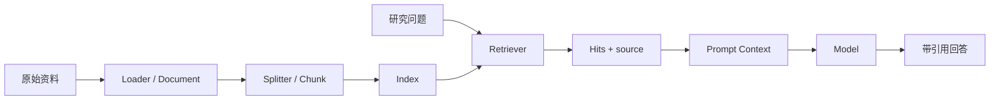

> **课程位置**：增强模型层第 3 章
> **锁定环境**：Python 3.12 / LangChain Core 1.4.x / LangChain 1.3.x
> **本章工件**：Document、Splitter、Retriever、带来源 Context、recall@k 与 Mini DeerFlow 知识索引

## 1. 上一刻系统：计划可以消费，事实仍没有来源

第 02 章把研究请求变成了可验证的 `ResearchRequest` 与 `TaskPlan`。其中有一步是“检索 LangGraph durable execution 的官方资料”。

计划的结构合法，不代表模型知道当前事实。它可能依赖训练数据回答，也可能把旧 API、社区经验和官方行为混在一起。即使结论碰巧正确，系统仍拿不出证据。

这一章只解决一件事：根据问题选出少量相关资料，并让来源一路保留到生成输入。现在还不让模型自主决定是否检索；完整工具循环留到第 04 章。



**图的文本替代**：原始资料先变成带 metadata 的 Document，再切成 Chunk 并进入 Index。查询通过 Retriever 得到带 source 的命中，格式化为 Prompt Context 后才交给模型。

## 2. 第一次失败：资料越多，相关证据反而进不去

最直觉的做法是把所有资料拼进 Prompt。它在两三段短文本上看似有效，一旦超过模型或应用设置的上下文预算，后面的资料就会被截断或根本无法加入。


### 固定预算先装了无关资料

**运行前先预测**：相关资料排在第三个，而预算只能容纳前两个来源时，模型能否看到 `thread_id`？

```python sync=ch03-stuff-all-failure
from langchain_core.documents import Document


documents = [
    Document(
        page_content="structured output schema validates model payload",
        metadata={"source": "official/structured-output.md"},
    ),
    Document(
        page_content="middleware controls tool permissions and retries",
        metadata={"source": "official/middleware.md"},
    ),
    Document(
        page_content="checkpoint uses thread_id to resume durable execution",
        metadata={"source": "official/persistence.md"},
    ),
]

context_budget = 105
included = []
used = 0
for document in documents:
    size = len(document.page_content)
    if used + size > context_budget:
        break
    included.append(document)
    used += size

included_sources = [doc.metadata["source"] for doc in included]
context = "\n".join(doc.page_content for doc in included)
print("context_budget =", context_budget)
print("included_sources =", included_sources)
print("target_source_included =", "official/persistence.md" in included_sources)
print("thread_id_visible =", "thread_id" in context)
```

**观察结果**：

```text output=ch03-stuff-all-failure
context_budget = 105
included_sources = ['official/structured-output.md', 'official/middleware.md']
target_source_included = False
thread_id_visible = False
```

**发生了什么**：预算不是按相关性分配的。系统先遇到的两段无关资料占满了 Context，真正能回答问题的证据没有进入模型输入。

增大上下文窗口只能推迟失败，还会增加延迟与费用。修复方向不是“塞更多”，而是先按问题选择证据。

**动手修改**：把 persistence 文档移到第一位，观察结果变绿。然后解释为什么“依赖资料顺序”仍不是检索方案。


### 用透明词项重叠只选择 top-1

**运行前先预测**：查询包含 `checkpoint thread_id resume` 时，三个来源的分数会怎样排列？

```python sync=ch03-top-k-repair
import re

from langchain_core.documents import Document


documents = [
    Document(
        page_content="structured output schema validates model payload",
        metadata={"source": "official/structured-output.md"},
    ),
    Document(
        page_content="middleware controls tool permissions and retries",
        metadata={"source": "official/middleware.md"},
    ),
    Document(
        page_content="checkpoint uses thread_id to resume durable execution",
        metadata={"source": "official/persistence.md"},
    ),
]


def terms(text: str) -> set[str]:
    return set(re.findall(r"[a-z0-9_]+", text.lower()))


def lexical_search(query: str, docs: list[Document], k: int) -> list[Document]:
    query_terms = terms(query)
    ranked = sorted(
        docs,
        key=lambda doc: (
            -len(query_terms & terms(doc.page_content)),
            str(doc.metadata["source"]),
        ),
    )
    return [
        doc
        for doc in ranked
        if query_terms & terms(doc.page_content)
    ][:k]


query = "checkpoint thread_id resume"
hits = lexical_search(query, documents, k=1)
print("query =", query)
print("hit_count =", len(hits))
print("top_source =", hits[0].metadata["source"])
print("top_content =", hits[0].page_content)
```

**观察结果**：

```text output=ch03-top-k-repair
query = checkpoint thread_id resume
hit_count = 1
top_source = official/persistence.md
top_content = checkpoint uses thread_id to resume durable execution
```

**发生了什么**：检索先根据查询选择候选证据，再把 top-k 交给下游。这里的词项重叠很粗糙，但排序过程完全可见，足以建立第一个 Retriever 心智模型。

Retriever 的职责是“输入 query，输出 Document 列表”。它不生成答案，也不决定是否再调用一次检索。

**动手修改**：把查询换成中文“如何恢复长任务”。观察精确英文词项检索为何返回空，并记录这会怎样推动分词、query rewrite、dense 或 hybrid retrieval。


## 3. 先理解 Document：正文与来源必须一起移动

刚才直接使用了三个短 `Document`。真实资料可能来自文件、网页、数据库或对象存储。Loader 的共同产物通常是：

- `page_content`：可检索正文；
- `metadata`：source、标题、版本、租户、权限域和原文位置等边界事实。

`Document` 不是向量，也不是数据库记录。它是 LangChain 组件之间传递文本与 metadata 的公共载体。

## 4. 第二次失败：切分后只剩文本，来源消失了

长文档通常不能整体作为一个检索单元。若只对字符串调用 `split`，切分虽然成功，`source` 和其他 metadata 却没有跟着 Chunk 移动。


### 用字符串切分制造无来源 Chunk

**运行前先预测**：切分结果是普通字符串时，后续 Retriever 能从哪里恢复 source？

```python sync=ch03-naive-split-source-failure
from langchain_core.documents import Document


raw_document = Document(
    page_content=(
        "Durable execution 会保存执行进度。"
        "Checkpoint 由 checkpointer 持久化。"
        "恢复时必须继续使用同一个 thread_id。"
    ),
    metadata={
        "source": "official/persistence.md",
        "topic": "runtime",
    },
)

naive_chunks = [
    part.strip()
    for part in raw_document.page_content.split("。")
    if part.strip()
]
print("chunk_count =", len(naive_chunks))
print("chunk_type =", type(naive_chunks[0]).__name__)
print("source_available =", hasattr(naive_chunks[0], "metadata"))
print("relevant_chunk =", naive_chunks[-1])
```

**观察结果**：

```text output=ch03-naive-split-source-failure
chunk_count = 3
chunk_type = str
source_available = False
relevant_chunk = 恢复时必须继续使用同一个 thread_id
```

**发生了什么**：关键句仍在，但 Chunk 只剩字符串。后续格式化时无法给它加可靠引用，也无法按知识域或租户过滤。

不要等模型生成回答后再猜 source。来源必须从 Loader 开始，沿 Splitter、Index、Retriever 和 Prompt 一直保留。

**动手修改**：用 `(text, source)` tuple 临时修补，再加入 `topic` 与原文行号。观察 tuple 如何逐渐变成一份自制且不兼容的 Document 协议。


### 让 Splitter 复制 Document metadata

**运行前先预测**：`split_documents` 返回的每个 Chunk 是否仍是 `Document`？三个 Chunk 会不会共享同一个 source？

```python sync=ch03-document-split-repair
from langchain_core.documents import Document
from langchain_text_splitters import RecursiveCharacterTextSplitter


raw_document = Document(
    page_content=(
        "Durable execution 会保存执行进度。"
        "Checkpoint 由 checkpointer 持久化。"
        "恢复时必须继续使用同一个 thread_id。"
    ),
    metadata={
        "source": "official/persistence.md",
        "topic": "runtime",
    },
)
splitter = RecursiveCharacterTextSplitter(
    chunk_size=38,
    chunk_overlap=0,
    separators=["。", ""],
)
chunks = splitter.split_documents([raw_document])
for position, chunk in enumerate(chunks):
    chunk.metadata["chunk_id"] = f"persistence-{position}"

relevant = next(chunk for chunk in chunks if "thread_id" in chunk.page_content)
print("chunk_count =", len(chunks))
print("chunk_types =", sorted({type(chunk).__name__ for chunk in chunks}))
print("all_sources =", sorted({chunk.metadata["source"] for chunk in chunks}))
print("relevant_chunk_id =", relevant.metadata["chunk_id"])
print("relevant_source =", relevant.metadata["source"])
```

**观察结果**：

```text output=ch03-document-split-repair
chunk_count = 3
chunk_types = ['Document']
all_sources = ['official/persistence.md']
relevant_chunk_id = persistence-2
relevant_source = official/persistence.md
```

**发生了什么**：Splitter 产生的仍是 Document，并复制原始 metadata。课程额外加入稳定 `chunk_id`，为调试、引用定位和评测提供身份。

`chunk_size` 与 `chunk_overlap` 会影响召回、语义完整性和成本。Overlap 能缓解边界切断，但不能修复错误的文档结构；代码块、表格和标题常需专门规则。

**动手修改**：把 `chunk_size` 改为 55，并加入 overlap。记录 Chunk 数、相关句是否被重复，以及重复证据会怎样影响 top-k。


## 5. 从透明函数走到 LangChain Retriever

上一节的 `lexical_search` 已经拥有 Retriever 的核心形状。LangChain Retriever 把这种能力统一为 `invoke(query) -> list[Document]`，因此可以独立调用，也可以进入 Runnable 管道。


### 用 BM25Retriever 调用同一份 Document 协议

**运行前先预测**：Retriever 返回文本还是 Document？命中后 source 是否仍在 metadata？

```python sync=ch03-bm25-retriever
from langchain_community.retrievers import BM25Retriever
from langchain_core.documents import Document


chunks = [
    Document(
        page_content="structured output schema validates payload",
        metadata={"source": "official/structured-output.md", "chunk_id": "schema-0"},
    ),
    Document(
        page_content="checkpoint thread_id resume durable execution",
        metadata={"source": "official/persistence.md", "chunk_id": "persistence-0"},
    ),
    Document(
        page_content="middleware permission controls tool calls",
        metadata={"source": "official/middleware.md", "chunk_id": "middleware-0"},
    ),
]
retriever = BM25Retriever.from_documents(chunks, k=1)
hits = retriever.invoke("checkpoint thread_id")

print("retriever_type =", type(retriever).__name__)
print("hit_type =", type(hits[0]).__name__)
print("hit_source =", hits[0].metadata["source"])
print("hit_chunk_id =", hits[0].metadata["chunk_id"])
```

**观察结果**：

```text output=ch03-bm25-retriever
retriever_type = BM25Retriever
hit_type = Document
hit_source = official/persistence.md
hit_chunk_id = persistence-0
```

**发生了什么**：具体排序算法变成 BM25，但输入仍是 query，输出仍是 Document 列表。调用方不需要知道倒排索引的内部结构。

BM25 擅长函数名、错误码和字面匹配。中文通常需要合适的分词预处理；否则“恢复长任务”与英文 `resume durable execution` 不会自然匹配。

**动手修改**：把 `k` 改为 2，打印每个命中的 source。解释第二名为什么不能自动视为可靠证据。


## 6. 第三次失败：Retriever 保留了 source，格式化却丢了

命中带 metadata 不等于最终 Context 带来源。很多引用问题发生在最后一米：`format_docs` 只拼接 `page_content`，把 source 丢掉了。


### 把命中格式化成无来源字符串

**运行前先预测**：Document 内仍有 source，但只拼正文后，Prompt 能否知道句子来自哪里？

```python sync=ch03-source-format-failure
from langchain_core.documents import Document


hits = [
    Document(
        page_content="checkpoint 使用 thread_id 标识可恢复线程。",
        metadata={
            "source": "official/persistence.md",
            "chunk_id": "persistence-2",
        },
    )
]
unsafe_context = "\n\n".join(hit.page_content for hit in hits)

print("document_source =", hits[0].metadata["source"])
print("formatted_context =", unsafe_context)
print("source_in_context =", hits[0].metadata["source"] in unsafe_context)
```

**观察结果**：

```text output=ch03-source-format-failure
document_source = official/persistence.md
formatted_context = checkpoint 使用 thread_id 标识可恢复线程。
source_in_context = False
```

**发生了什么**：Retriever 没有丢 source，格式化函数丢了。此时再要求模型“请给出引用”，模型只能省略或猜测来源。

**动手修改**：让模型固定返回 `[1]`，但 Context 不提供 `[1]` 与 source 的映射。说明形式上有引用为何不等于证据链成立。


### 在模型调用前建立引用标签

**运行前先预测**：把 source 与 chunk_id 一起写入 Context 后，下游是否能验证引用指向哪个 Chunk？

```python sync=ch03-source-format-repair
from langchain_core.documents import Document


hits = [
    Document(
        page_content="checkpoint 使用 thread_id 标识可恢复线程。",
        metadata={
            "source": "official/persistence.md",
            "chunk_id": "persistence-2",
        },
    )
]


def format_evidence(documents: list[Document]) -> str:
    return "\n\n".join(
        (
            f"[source={doc.metadata['source']} "
            f"chunk={doc.metadata['chunk_id']}]\n{doc.page_content}"
        )
        for doc in documents
    )


safe_context = format_evidence(hits)
print(safe_context)
print("source_in_context =", hits[0].metadata["source"] in safe_context)
print("chunk_id_in_context =", hits[0].metadata["chunk_id"] in safe_context)
```

**观察结果**：

```text output=ch03-source-format-repair
[source=official/persistence.md chunk=persistence-2]
checkpoint 使用 thread_id 标识可恢复线程。
source_in_context = True
chunk_id_in_context = True
```

**发生了什么**：引用映射在模型调用前已经确定。模型负责基于证据组织回答，业务代码和评测器仍能检查 source 与 chunk_id。

这还不能证明句子真实。Loader 可能读到错误版本，资料也可能包含 prompt injection。来源、版本、权限域和信任级别仍需由应用验证。

**动手修改**：再加入第二个来源，并用 `[S1]`、`[S2]` 建立短标签映射。确保排序变化时标签与 Document 一起重建，而不是复用旧映射。


## 7. RAG 是普通 Runnable，不等于 Agent

现在已有 query、Retriever、Context formatter 和模型输入。它们可以组成固定数据流：每次都先检索，再生成一次回答。


### 运行 `retrieve → format → prompt → model`

**运行前先预测**：这条链会不会自主跳过检索、再次检索或调用其他工具？

```python sync=ch03-runnable-rag
from operator import itemgetter

from langchain_community.retrievers import BM25Retriever
from langchain_core.documents import Document
from langchain_core.language_models.fake_chat_models import GenericFakeChatModel
from langchain_core.messages import AIMessage
from langchain_core.prompts import ChatPromptTemplate
from langchain_core.runnables import RunnableLambda


documents = [
    Document(
        page_content="checkpoint 使用 thread_id 标识可恢复线程。",
        metadata={"source": "official/persistence.md"},
    ),
    Document(
        page_content="structured output 用 Schema 验证字段。",
        metadata={"source": "official/structured-output.md"},
    ),
]
retriever = BM25Retriever.from_documents(documents, k=1)
format_context = RunnableLambda(
    lambda docs: "\n".join(
        f"[{doc.metadata['source']}] {doc.page_content}" for doc in docs
    )
)
prompt = ChatPromptTemplate.from_messages(
    [
        ("system", "只依据资料回答；资料不足时明确说明。"),
        ("human", "问题：{question}\n资料：{context}"),
    ]
)
model = GenericFakeChatModel(
    messages=iter(
        [
            AIMessage(
                content=(
                    "恢复时继续使用同一个 thread_id。"
                    " [official/persistence.md]"
                )
            )
        ]
    )
)
rag_chain = (
    {
        "question": itemgetter("question"),
        "context": itemgetter("question") | retriever | format_context,
    }
    | prompt
    | model
)
answer = rag_chain.invoke({"question": "checkpoint thread_id"})

print("answer =", answer.content)
print("retrieval_policy = always_once")
print("agent_loop =", False)
```

**观察结果**：

```text output=ch03-runnable-rag
answer = 恢复时继续使用同一个 thread_id。 [official/persistence.md]
retrieval_policy = always_once
agent_loop = False
```

**发生了什么**：Runnable 管道按固定顺序执行一次检索和一次模型调用。它没有 `create_agent`，不会读取 tool call，也没有 `model → tool → model` 循环。

固定 RAG 适合“每次请求都必须先查资料”的用例。只有当模型需要根据任务决定是否检索、改写查询或选择别的能力时，才需要下一章的 Agent 工具循环。

**动手修改**：在 Retriever 前增加一个固定 query rewrite Runnable。然后说明“固定改写步骤”与“模型自主决定是否重试”在控制流上有什么不同。


## 8. 第四次失败：没有重叠，也强行返回最近文档

某些相似度接口总能返回“最近”的结果。最近不等于相关；如果系统没有最低相关性或空结果协议，0 分文档也可能被包装成证据。


### 把 0 分文档伪装成命中

**运行前先预测**：查询“量子引力”时，知识库只有 checkpoint 和 middleware，强制 top-1 会返回什么？

```python sync=ch03-forced-nearest-failure
import re

from langchain_core.documents import Document


documents = [
    Document(
        page_content="checkpoint thread_id durable execution",
        metadata={"source": "official/persistence.md"},
    ),
    Document(
        page_content="middleware permission tool call",
        metadata={"source": "official/middleware.md"},
    ),
]


def terms(text: str) -> set[str]:
    return set(re.findall(r"[a-z0-9_]+", text.lower()))


def unsafe_nearest(query: str) -> tuple[Document, int]:
    query_terms = terms(query)
    scored = [
        (doc, len(query_terms & terms(doc.page_content)))
        for doc in documents
    ]
    return max(scored, key=lambda pair: pair[1])


forced_hit, score = unsafe_nearest("quantum gravity")
print("score =", score)
print("forced_source =", forced_hit.metadata["source"])
print("treated_as_evidence =", True)
```

**观察结果**：

```text output=ch03-forced-nearest-failure
score = 0
forced_source = official/persistence.md
treated_as_evidence = True
```

**发生了什么**：检索器没有找到相关资料，却因为接口必须返回 top-1 而选择了列表中的第一个文档。下游若只看“有一条命中”，就会制造带错误引用的回答。

**动手修改**：交换两个文档的顺序。观察所谓“证据”随存储顺序变化，并解释为什么这不是 Prompt 能修好的问题。


### 把空召回建模为合法业务结果

**运行前先预测**：过滤 0 分结果后，调用方如何区分“资料不足”和“检索器崩溃”？

```python sync=ch03-explicit-empty-repair
import re

from langchain_core.documents import Document


documents = [
    Document(
        page_content="checkpoint thread_id durable execution",
        metadata={"source": "official/persistence.md"},
    ),
    Document(
        page_content="middleware permission tool call",
        metadata={"source": "official/middleware.md"},
    ),
]


def terms(text: str) -> set[str]:
    return set(re.findall(r"[a-z0-9_]+", text.lower()))


def safe_search(query: str) -> dict[str, object]:
    query_terms = terms(query)
    scored = [
        (doc, len(query_terms & terms(doc.page_content)))
        for doc in documents
    ]
    hits = [
        {"source": doc.metadata["source"], "score": score}
        for doc, score in scored
        if score > 0
    ]
    return {
        "status": "ok" if hits else "insufficient_evidence",
        "hits": hits,
    }


outcome = safe_search("quantum gravity")
print("status =", outcome["status"])
print("hits =", outcome["hits"])
print("retriever_crashed =", False)
```

**观察结果**：

```text output=ch03-explicit-empty-repair
status = insufficient_evidence
hits = []
retriever_crashed = False
```

**发生了什么**：空列表是正常检索结果，`insufficient_evidence` 是业务状态；连接失败、超时和程序错误仍应走异常或独立失败协议。

生成 Prompt 应要求资料不足时明确说明未知，但是否有证据必须先由检索边界决定，不能让模型替检索器掩盖空结果。

**动手修改**：给 outcome 增加 `query` 与 `filters_applied`，但不要塞入完整索引配置。说明哪些字段有助于调试，哪些字段会泄露基础设施细节。


## 9. 先评测 Retriever，再评测最终回答

只看最终答案，无法判断模型是依据证据答对，还是绕过检索猜对。最小检索指标是 recall@k：期望文档中有多少出现在 top-k。


### 用两个 case 暴露跨语言召回缺口

**运行前先预测**：精确英文 query 能命中；中文同义 query 交给英文词项检索时，macro recall@1 是多少？

```python sync=ch03-recall-evaluation
import re

from langchain_core.documents import Document


documents = [
    Document(
        page_content="checkpoint thread_id resume durable execution",
        metadata={"id": "persistence"},
    ),
    Document(
        page_content="structured output schema validation",
        metadata={"id": "structured-output"},
    ),
]
cases = [
    {
        "query": "checkpoint thread_id",
        "expected_ids": {"persistence"},
    },
    {
        "query": "如何恢复长任务",
        "expected_ids": {"persistence"},
    },
]


def terms(text: str) -> set[str]:
    return set(re.findall(r"[a-z0-9_]+", text.lower()))


def search_ids(query: str, k: int) -> set[str]:
    query_terms = terms(query)
    scored = [
        (doc, len(query_terms & terms(doc.page_content)))
        for doc in documents
    ]
    ranked = sorted(scored, key=lambda pair: -pair[1])
    return {
        str(doc.metadata["id"])
        for doc, score in ranked[:k]
        if score > 0
    }


recalls = []
for case in cases:
    actual = search_ids(str(case["query"]), k=1)
    expected = set(case["expected_ids"])
    recall = len(actual & expected) / len(expected)
    recalls.append(recall)
    print(f"query={case['query']} actual={sorted(actual)} recall@1={recall:.1f}")

print("macro_recall@1 =", sum(recalls) / len(recalls))
```

**观察结果**：

```text output=ch03-recall-evaluation
query=checkpoint thread_id actual=['persistence'] recall@1=1.0
query=如何恢复长任务 actual=[] recall@1=0.0
macro_recall@1 = 0.5
```

**发生了什么**：同一事实的中文 query 暴露了词项检索缺口。现在可以有针对性地比较分词、query rewrite、dense 或 hybrid，而不是盲目调整生成 Prompt。

评测集应包含真实同义改写、精确标识符、空召回、权限过滤和版本边界。recall 高也不代表最终答案忠实，还需单独验证引用和结果。

**动手修改**：增加一个期望两个文档的多跳 query，并比较 recall@1 与 recall@2。解释提高 k 为什么可能提高召回，却同时带来更多噪声和 token。


## 10. Dense、Sparse 与 Hybrid 解决不同查询形状

刚才的透明词项检索与 BM25 都属于 Sparse retrieval。它们擅长 `thread_id`、错误码、设备编号和原文关键词，但对同义改写、跨语言和语义近似较弱。

Dense retrieval 使用 Embedding 把 query 与 Chunk 投影到向量空间，擅长语义近似，但仍可能错过精确标识符，也可能对无关 query 强行给出最近邻。

Hybrid retrieval 融合 Sparse 与 Dense 的候选或排名。它增加了延迟、调参与解释成本，不是默认更好。是否采用，应由固定评测集和业务查询分布决定。

| 查询形状 | 优先验证 | 仍需注意 |
| --- | --- | --- |
| 函数名、错误码、ID | Sparse / BM25 | 分词与大小写规范化 |
| 同义改写、自然语言问法 | Dense | Embedding 版本与空召回 |
| 两者混合 | Hybrid | 融合权重、延迟、重复结果 |
| 强权限过滤 | 支持 metadata filter 的后端 | filter 必须在召回边界执行 |

## 11. 索引流与查询流不要混成一个函数

查询流在线执行：接收 query，应用权限 filter，返回 top-k hits。索引流通常离线或增量执行：Loader 读取资料，Splitter 生成 Chunk，Embedding 计算向量，Index 写入或清理记录。

一次性 `VectorStore.from_documents(...)` 适合实验。长期知识库还要识别新增、更新、未变化和删除，否则重复运行会浪费 Embedding，并留下过期资料。

`source_id`、content hash 与 Record Manager 解决索引生命周期；Retriever 排名与 recall 解决查询质量。两者都重要，但不是同一个问题。

生产实现还要回答：

1. source ID 在重命名或版本升级后是否稳定；
2. metadata 更新是否触发重新索引；
3. 删除源文档时旧 Chunk 如何清理；
4. Embedding 模型升级时如何建立新索引版本；
5. 租户、权限域和信任级别由谁写入并校验。

## 12. 工程迁移：Mini DeerFlow 固化索引接缝

概念层已经从零实现了选择、Chunk metadata、Retriever、引用格式、空召回与 recall。现在才进入 Mini DeerFlow，观察项目如何把这些事实收敛为可替换接口。

### 12.1 本地索引用于确定性课程与 contract test


### 观察幂等 upsert 与带来源命中

**运行前先预测**：同一 ID、同一内容写入两次，第二次会新增重复文档，还是报告 unchanged？

```python sync=ch03-mini-deerflow-local-index
from mini_deerflow.knowledge import KnowledgeDocument, LocalKnowledgeIndex


index = LocalKnowledgeIndex()
document = KnowledgeDocument(
    id="durable-execution",
    text="checkpoint 使用 thread_id 恢复 durable execution。",
    source="official/persistence.md",
    metadata={"topic": "runtime"},
)
first = index.upsert([document])
second = index.upsert([document])
hits = index.search("checkpoint thread_id", limit=1)

print("first_report =", (first.added, first.updated, first.unchanged))
print("second_report =", (second.added, second.updated, second.unchanged))
print("index_size =", len(index))
print("hit_source =", hits[0].source)
print("hit_topic =", hits[0].metadata["topic"])
```

**观察结果**：

```text output=ch03-mini-deerflow-local-index
first_report = (1, 0, 0)
second_report = (0, 0, 1)
index_size = 1
hit_source = official/persistence.md
hit_topic = runtime
```

**发生了什么**：`LocalKnowledgeIndex` 用稳定文档 ID 建立幂等边界，并返回结构化 `KnowledgeHit`。它采用确定性词项重叠，适合 Notebook、CI 和公共契约验证，不假装具备真实语义能力。

项目比最小实验增加了 `KnowledgeDocument`、`KnowledgeHit`、`IndexReport` 和统一 repository seam。后端可以替换，调用方不必跟着改变。


### 12.2 VectorStore adapter 验证可替换边界


### 用确定性 Embedding 检查 filter 与 recall

**运行前先预测**：metadata filter 限制为 `runtime` 后，结果里是否还会出现 model 主题？固定 case 的 recall@1 是否可重复？

```python sync=ch03-mini-deerflow-vector-index
from mini_deerflow.knowledge import KnowledgeDocument
from mini_deerflow.knowledge.evaluation import RetrievalCase, recall_at_k
from mini_deerflow.knowledge.indexer import VectorKnowledgeIndex


vector_index = VectorKnowledgeIndex(embedding_size=64)
vector_index.upsert(
    [
        KnowledgeDocument(
            id="persistence",
            text="checkpoint thread durable execution recovery",
            source="official/persistence.md",
            metadata={"topic": "runtime"},
        ),
        KnowledgeDocument(
            id="structured-output",
            text="structured output schema validation",
            source="official/structured-output.md",
            metadata={"topic": "model"},
        ),
    ]
)
filtered_hits = vector_index.search(
    "checkpoint thread durable execution recovery",
    limit=2,
    metadata_filter={"topic": "runtime"},
)
cases = [
    RetrievalCase(
        query="checkpoint thread durable execution recovery",
        expected_ids={"persistence"},
    ),
    RetrievalCase(
        query="structured output schema validation",
        expected_ids={"structured-output"},
    ),
]

print("filtered_ids =", [hit.id for hit in filtered_hits])
print("filtered_topics =", [hit.metadata["topic"] for hit in filtered_hits])
print("recall@1 =", recall_at_k(vector_index, cases, k=1))
```

**观察结果**：

```text output=ch03-mini-deerflow-vector-index
filtered_ids = ['persistence']
filtered_topics = ['runtime']
recall@1 = 1.0
```

**发生了什么**：adapter 使用 LangChain `InMemoryVectorStore` 与确定性 fake Embedding，验证 upsert、metadata filter、返回形状和评测接缝。

这组精确文本 fixture 只证明工程契约，不证明语义质量。真实 provider profile 必须加入同义改写与跨语言难例，并单独运行集成测试。


| 概念实验 | Mini DeerFlow 增加的工程边界 |
| --- | --- |
| `Document` + source | `KnowledgeDocument` 与稳定业务 ID |
| 透明 top-k | 可替换 `LocalKnowledgeIndex` / `VectorKnowledgeIndex` |
| 空召回 | 统一的空 `KnowledgeHit` 列表，不强行补最近邻 |
| 手写 recall | `RetrievalCase` 与 `recall_at_k` 评测接缝 |
| metadata | 后端 adapter 的 filter 与返回映射 |

Mini DeerFlow 已有 `build_search_knowledge_tool`，但本章不执行它。第 04 章会先从零解释工具 Schema、`AIMessage.tool_calls` 与 `ToolMessage`，再把索引包装成工具，第一次运行完整 `model → tool → model` 循环。

## 13. 调试顺序：最后才改生成 Prompt

检索不到资料时，按数据流逐层缩小范围：

1. Loader 是否真的读到文档；
2. Chunk 是否保留关键句、source 与权限 metadata；
3. 索引报告是否显示新增、更新或未变化；
4. query 与分词结果是否符合预期；
5. filter 是否错误排除了目标知识域；
6. top-k、分数和命中 Chunk 是否合理；
7. source 是否经过 formatter 进入 Prompt；
8. 以上都正确后，再检查生成模型与 Prompt。

如果一开始就改 Prompt，可能暂时得到更像样的回答，却无法修复 Loader 未加载、Chunk 丢 source、filter 越权或 Retriever 召回为零。

知识索引也不等于 LangGraph Store。索引保存可检索资料；Store 保存跨线程的应用定义数据；订单付款状态等强一致事实仍属于业务数据库。

## 14. 练习：把检索边界变成自己的设计

### 练习 A：Chunk 观察表

准备一份包含标题、代码块和表格的 Markdown。比较两个 splitter 配置，记录 Chunk 数、关键句完整性、重复字符、source 与原文位置。

### 练习 B：索引更新

修改同一 `KnowledgeDocument.id` 的正文后再次 upsert。断言 `updated == 1`、索引长度不变，并解释 content hash 应由哪一层计算。

### 练习 C：检索评测

建立至少 8 个 case：精确 API 名、中文同义问法、跨语言、两跳问题、空召回、错误 filter、过期版本和无权限资料。比较 recall@1、recall@3 与延迟。

### 练习 D：数据边界

把本轮命中、用户长期偏好、产品手册和付款状态分别放入 Graph State、Store、知识索引或业务数据库，并逐项说明所有者与生命周期。

### 延迟回忆

合上讲义回答：Retriever 与 Agent 有什么区别？source 为什么必须从 Loader 开始保留？空列表为何是合法结果？Record Manager 与 recall@k 分别解决什么问题？

## 15. 下一刻系统：知识可检索，程序仍不会自主行动

本章结束后，系统可以把资料变成带 metadata 的 Chunk，按 query 选择 top-k，处理空召回，保留 source，并独立评测 Retriever。

但当前 RAG 管道仍硬编码“先检索一次，再调用模型一次”。它不会判断问题是否需要检索，也不会根据空结果改写 query，更不会选择计算器或工作区工具。

下一章从一条只表达 tool intent、却没有执行工具的 `AIMessage` 开始。你会手动完成 `AIMessage.tool_calls → 执行工具 → ToolMessage → 再次调用模型`，然后才使用 `create_agent` 自动运行同一循环。

运行本章验收：

```bash
TMPDIR="$PWD/.tmp" uv run --locked --group dev python \
  scripts/sync_lesson_notebooks.py tutorials/03_RAG_2.0.md --execute
TMPDIR="$PWD/.tmp" uv run --locked --group dev pytest -q \
  tests/test_mini_deerflow_knowledge.py \
  tests/test_mini_deerflow_vector_index.py \
  tests/test_notebook_sync.py
TMPDIR="$PWD/.tmp" uv run --locked --group dev python scripts/validate_tutorials.py
```

资料访问日期：2026-07-21。

- [LangChain Retrieval](https://docs.langchain.com/oss/python/langchain/retrieval)
- [LangChain RAG Tutorial](https://docs.langchain.com/oss/python/langchain/rag)
- [LangChain Text Splitters](https://docs.langchain.com/oss/python/integrations/splitters)
- [LangChain BM25 Retriever](https://docs.langchain.com/oss/python/integrations/retrievers/bm25)
- [LangChain Indexing](https://python.langchain.com/docs/how_to/indexing/)

继续阅读：[第 04 章：工具契约与首个 Lead Agent](/langchain-logbook/posts/04_smart_tooling/)。