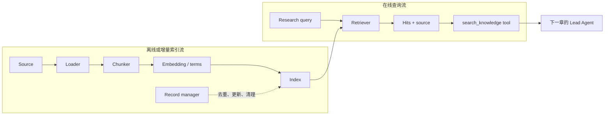

> - 验证环境：Python 3.12 / LangChain 1.3.x / LangGraph 1.2.x
> - 校准日期：2026-07-13
> - API 状态：loader、splitter、retriever、indexing 为 current；具体向量库是可替换实现
> - 本章工件：`mini_deerflow.knowledge`、`mini_deerflow.tools.build_search_knowledge_tool`

## 1. 系统快照：计划已经合法，事实却没有证据

第 02 章把研究请求转换成了 `TaskPlan`：先查找官方持久化资料，再撰写带引用说明。Graph 和数据库现在可以读取这个计划，但“查找资料”仍只是一句指令。

如果直接让模型回答，它会依赖训练数据。回答可能流畅，也可能把旧版 API、社区经验和当前官方行为混在一起。即使结论正确，系统也拿不出来源，评测器无法判断证据链是否完整。

本章为研究任务建立两条数据流：资料怎样增量进入索引，以及一次运行怎样查询索引并保留 source。完成后，Mini DeerFlow 会得到一个可调用的 `search_knowledge` 工具。

<!-- diagram:id=03-index-query-flows -->


**图的文本替代**：离线索引流把资料加工进 Index；在线查询流把研究问题变成带来源的命中，再通过工具契约交给下一章的 Lead Agent。

## 2. RAG 先是一条数据链，不要求 Agent

RAG 可以由普通 Runnable 完成：`retriever → prompt → model → parser`。它解决外部知识接入，不负责决定何时检索、是否继续调用工具，也不拥有长任务控制流。

| 当前缺口 | 对应能力 |
| --- | --- |
| 输出不能被程序验证 | 结构化输出 |
| 模型缺少私有或当前知识 | Retrieval / RAG |
| 模型需要自主决定是否检索 | Agent 工具循环 |
| 业务必须按固定拓扑执行 | StateGraph |

把这些层级分开后，检索器可以独立评测，Agent 也不需要知道 Chroma collection、BM25 tokenizer 或索引数据库路径。

## 3. 先把资料可靠地送进索引

### 3.1 Loader、Splitter 与 Embedding

Loader 读取原始资料，Splitter 生成可检索片段，Embedding 把文本投影到向量空间。`chunk_size` 和 `chunk_overlap` 会同时影响召回范围、上下文完整性与成本。

```python
import os

from langchain.embeddings import init_embeddings
from langchain_community.document_loaders import TextLoader
from langchain_text_splitters import RecursiveCharacterTextSplitter

loader = TextLoader("./knowledge.txt", encoding="utf-8")
documents = loader.load()

splitter = RecursiveCharacterTextSplitter(
    chunk_size=100,
    chunk_overlap=20,
)
chunks = splitter.split_documents(documents)

embeddings = init_embeddings(
    model="text-embedding-v4",
    provider="openai",
    api_key=os.getenv("BAILIAN_API_KEY"),
    base_url="https://dashscope.aliyuncs.com/compatible-mode/v1",
    check_embedding_ctx_length=False,
)
```

Overlap 能缓解句子被切断，却不能修复错误的文档结构。标题、代码块和表格往往需要专门的 splitter 或预处理规则；生产索引还要记录原文位置与权限 metadata。

### 3.2 一次性灌库与增量索引

`VectorStore.from_documents(...)` 适合演示。长期知识库还要识别新增、更新、未变化和删除的资料，否则每次运行都会重复计算 embedding。

```python
from langchain_chroma import Chroma
from langchain_classic.indexes import SQLRecordManager, index

vectorstore = Chroma(
    collection_name="research_knowledge",
    embedding_function=embeddings,
    persist_directory="./chroma_db",
)

record_manager = SQLRecordManager(
    "chroma/research_knowledge",
    db_url="sqlite:///record_manager_cache.sql",
)
record_manager.create_schema()

report = index(
    docs_source=chunks,
    record_manager=record_manager,
    vector_store=vectorstore,
    cleanup="incremental",
    source_id_key="source",
)
```

`source_id_key="source"` 要求每个 `Document.metadata` 都有稳定来源。RecordManager 管理索引生命周期，不负责提高语义召回质量；两项责任不能混为一谈。

### 3.3 Dense、Sparse 与 Hybrid

Dense retrieval 擅长语义近似，Sparse/BM25 擅长函数名、错误码、设备编号和字面匹配。查询同时包含自然语言和精确标识符时，可以组合两路检索。

```python
from langchain_classic.retrievers import EnsembleRetriever
from langchain_community.retrievers import BM25Retriever

bm25 = BM25Retriever.from_documents(chunks)
bm25.k = 2

dense = vectorstore.as_retriever(search_kwargs={"k": 2})
hybrid = EnsembleRetriever(
    retrievers=[bm25, dense],
    weights=[0.5, 0.5],
)

hits = hybrid.invoke("LangGraph checkpoint thread_id")
```

中文 BM25 往往需要分词预处理，混合排序也会增加延迟、调参与解释成本。Hybrid 是待验证的策略，不是默认更优的结论。

### 3.4 检索之后仍是一条普通生成链

Retriever 负责提供候选证据，模型负责把证据组织成回答。缺少证据时，Prompt 应要求明确说明未知。

```python
from operator import itemgetter

from langchain_core.output_parsers import StrOutputParser
from langchain_core.prompts import ChatPromptTemplate

prompt = ChatPromptTemplate.from_messages([
    (
        "system",
        "只依据给定资料回答；资料不足时明确说明，并保留来源。",
    ),
    ("human", "问题：{question}\n\n资料：{context}"),
])

def format_docs(docs):
    return "\n\n".join(
        f"[{doc.metadata.get('source', 'unknown')}] {doc.page_content}"
        for doc in docs
    )

rag_chain = (
    {
        "question": itemgetter("question"),
        "context": itemgetter("question") | hybrid | format_docs,
    }
    | prompt
    | llm
    | StrOutputParser()
)
```

如果在 `format_docs` 时丢掉 source，后面再要求模型“记得引用”已经太晚。引用必须从 Loader metadata 沿 Index、Retriever、ToolMessage 一直传到最终 Artifact。

## 4. 把检索能力装进 Mini DeerFlow

真实向量服务不适合基础 CI。课程同时保留两种实现：确定性的本地词项索引用于验证公共契约，`VectorKnowledgeIndex` 用 fake embedding 验证 LangChain VectorStore adapter。

### 4.1 幂等写入

`LocalKnowledgeIndex` 的文档 ID 是幂等边界。相同内容重复写入应报告 unchanged，而不是生成重复记录。

```python sync=ch03-idempotent-index
from mini_deerflow.knowledge import KnowledgeDocument, LocalKnowledgeIndex

index = LocalKnowledgeIndex()
document = KnowledgeDocument(
    id="durable-execution",
    text="Durable execution 通过 checkpoint 和 thread 恢复长任务。",
    source="official/persistence.md",
    metadata={"topic": "langgraph"},
)
first_report = index.upsert([document])
second_report = index.upsert([document])
assert (first_report.added, first_report.unchanged) == (1, 0)
assert (second_report.added, second_report.unchanged) == (0, 1)
assert len(index) == 1
```

生产索引还要定义 content hash、metadata 更新和删除策略。无论底层采用哪种存储，调用方都应看到同一份 upsert report。

### 4.2 命中结果保留证据

```python sync=ch03-search-with-source
hits = index.search("checkpoint 如何恢复 durable execution", limit=1)
assert len(hits) == 1
assert hits[0].source == "official/persistence.md"
assert "thread" in hits[0].text
hits[0]
```

返回结构化 hit，而不是只返回拼接文本，可以让报告生成器保留 citation，也让评测器验证期望资料是否被召回。

### 4.3 通过工具暴露最小能力

Lead Agent 只需要查询字符串和受限的 `limit`，不应获得索引实例、连接字符串或任意过滤权限。

```python sync=ch03-retriever-tool
from mini_deerflow.tools import build_search_knowledge_tool

search_knowledge = build_search_knowledge_tool(index)
tool_result = search_knowledge.invoke({"query": "checkpoint", "limit": 1})
assert "official/persistence.md" in tool_result
assert "Durable execution" in tool_result
tool_result
```

本章用闭包捕获本地索引以保持实验最小。第 05 章会通过 Runtime Context 注入真实依赖，并解释连接对象为什么不能进入 Graph State。

### 4.4 验证 VectorStore adapter

`DeterministicFakeEmbedding` 不具备真实语义能力，但相同输入会生成稳定向量，适合检查 upsert、metadata filter 与返回形状。

```python sync=ch03-vector-filter
from mini_deerflow.knowledge.indexer import VectorKnowledgeIndex

vector_index = VectorKnowledgeIndex(embedding_size=64)
vector_documents = [
    KnowledgeDocument(
        id="persistence",
        text="checkpoint thread durable execution recovery",
        source="official/persistence.md",
        metadata={"topic": "runtime"},
    ),
    KnowledgeDocument(
        id="structured-output",
        text="structured output schema validation",
        source="official/structured-output.md",
        metadata={"topic": "model"},
    ),
]
vector_index.upsert(vector_documents)
filtered_hits = vector_index.search(
    "checkpoint thread durable execution recovery",
    limit=2,
    metadata_filter={"topic": "runtime"},
)
assert [hit.id for hit in filtered_hits] == ["persistence"]
```

替换真实 embedding 后，contract test 仍验证同一索引边界；同义改写、跨语言查询和长尾术语的召回质量则交给固定评测集。

## 5. 故障实验：资料存在，Retriever 仍然返回空

### 5.1 先观察检索层，而不是先改 Prompt

| 可观察现象 | 更可能的根因 | 应检查的证据 |
| --- | --- | --- |
| 命中 0 条 | Loader、source 或 filter 错误 | 文档数、metadata、filter |
| 命中但排名低 | chunk、embedding、query 不匹配 | top-k、score、命中片段 |
| 重复结果很多 | source ID 或清理模式错误 | upsert report、唯一 ID |
| 答案无引用 | Tool result 丢失 source | hit 与 ToolMessage payload |

下面的查询与本地词项索引完全无重叠，应返回“无证据”而不是随便挑一份文档：

```python sync=ch03-empty-retrieval-failure
empty_hits = index.search("量子引力弦理论", limit=1)
assert empty_hits == []
```

空结果是合法业务结果。工具把它交给 Agent，Agent 再明确说明资料不足。强行返回低分最近邻会把检索失败伪装成有依据的回答。

### 5.2 用 recall@k 隔离检索质量

只看最终回答无法判断“模型依靠证据答对”还是“模型绕过检索猜对”。先验证期望文档是否出现在 top-k：

```python sync=ch03-recall-evaluation
from mini_deerflow.knowledge.evaluation import RetrievalCase, recall_at_k

retrieval_cases = [
    RetrievalCase(
        query="checkpoint thread durable execution recovery",
        expected_ids={"persistence"},
    ),
    RetrievalCase(
        query="structured output schema validation",
        expected_ids={"structured-output"},
    ),
]
assert recall_at_k(vector_index, retrieval_cases, k=1) == 1.0
```

这个 fixture 使用可预测的精确文本，不宣称 fake embedding 具备语义检索能力。真实 profile 应加入同义改写难例，并比较 Dense、Sparse 与 Hybrid 的 recall 和延迟。

### 5.3 Prompt injection 与权限

检索内容属于不可信数据，不能因为它出现在“知识库”就当成 system instruction。索引还应携带知识域、租户和信任级别；在线查询必须应用由运行时提供的权限过滤。

这些策略将在 Context、Middleware 和 Sandbox 章节接入。当前索引契约先保证 metadata 不会在召回过程中丢失。

## 6. 调试顺序与工程取舍

检索不到资料时，按下面顺序缩小范围：

1. Loader 是否实际读到文档；
2. Chunk 是否保留关键句与 source metadata；
3. 索引报告是否显示新增或更新；
4. Filter 是否错误排除了目标知识域；
5. top-k 命中和分数是否合理；
6. source 是否沿 Tool result 进入回答；
7. 最后才调整生成 Prompt。

选择检索方案前，要明确查询是语义为主还是精确标识符为主，数据更新频率如何，是否需要权限 filter，以及可以接受多少延迟。先回答这些问题，再选择向量数据库和融合算法。

知识索引也不等于 LangGraph Store。索引保存可检索资料；Store 保存跨线程的应用定义数据。订单付款状态等强一致业务事实仍应留在业务数据库。

## 7. 本章交付：系统拥有知识，却还不会自主行动

### 动手练习

1. 修改同一 `KnowledgeDocument.id` 的正文，再次 upsert，断言 `updated == 1` 且索引长度不变。
2. 将本轮命中、用户长期偏好、产品手册和付款状态分别放入 Graph State、Store、知识索引或业务数据库，并说明理由。
3. 实现新的 `VectorKnowledgeIndex` adapter，用同一 fixture 跑 contract test，再增加真实 provider integration test。

打开 [03_RAG_2.0.ipynb](/langchain-logbook/notebooks/03_RAG_2.0.ipynb)，依次运行载入与分片、增量索引、Dense/Sparse/Hybrid 对比、带来源检索和 recall 实验。

### 自动验收

```bash
uv run --locked pytest -q tests/test_mini_deerflow_knowledge.py
uv run --locked python scripts/validate_tutorials.py
```

### 系统快照

Mini DeerFlow 现在拥有 `KnowledgeDocument`、幂等 `upsert`、带 source 的 `search`、VectorStore adapter、recall 评测和 `search_knowledge` 工具。

第一部至此完成：模型调用可观察，研究计划可验证，外部知识可检索。但当前程序仍要硬编码“先调用检索，再调用模型”。

第 04 章会把 `search_knowledge` 装入 Lead Agent，让模型根据任务选择工具，并第一次观察完整的 `model → tool → model` 循环。

延迟回忆：RecordManager 与 Retriever 分别解决什么问题？citation 为什么必须从 Loader 开始保留？知识索引为什么不等于 LangGraph Store？

继续阅读：[第 04 章：工具契约与首个 Lead Agent](/langchain-logbook/posts/04_smart_tooling/)。

参考资料（访问日期：2026-07-13）：

- [LangChain Retrieval](https://docs.langchain.com/oss/python/langchain/retrieval)
- [LangChain Indexing](https://python.langchain.com/docs/how_to/indexing/)
- [Retrieval Agent Template](https://github.com/langchain-ai/retrieval-agent-template)