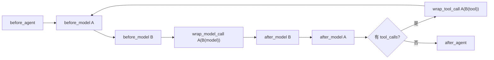

> **课程位置**：Agent 封装层第 3 章
> **锁定环境**：Python 3.12 / LangChain 1.3.x / LangGraph 1.2.x
> **本章工件**：原生 AgentMiddleware 实验与 Mini DeerFlow 默认治理链

> **本章导航**
> **本章只解决一个问题**：怎样让权限、脱敏、预算和错误处理稳定覆盖每次模型与工具调用。
>
> **当前系统**：不同事实已经归入 Runtime Context、Graph State、Store 和业务数据库。
>
> **遇到的问题**：规则仍散落在调用点，新工具很容易漏掉一次检查。
>
> **本章目标**：用 Agent Middleware 治理模型与工具生命周期，并理解注册顺序和短路。
>
> **暂时不讲**：固定业务阶段、并行汇合、跨进程恢复和持久审批。
>
> **学完以后**：你能判断一条规则应放 Middleware，还是应进入显式 Graph。
>
> **预计时间**：首读 35～45 分钟；扩展实验可稍后完成。

## 1. 事实已经归位，权限检查却还会漏

第 05 章已经把研究助手的身份、权限和依赖放入 Runtime Context，把线程事实留在 Graph State，再把跨 Thread 偏好交给 Store。

但数据放对位置不会自动执行规则。每个工具仍要检查权限、记录日志和转换异常；每次模型调用仍要投影安全上下文、选模型和算预算。

把代码复制到调用点最省事，也最容易漏。新工具少一个检查，或两条路径的脱敏与日志顺序相反，都会让同一条规则产生不同结果。

所以先不讲 hook 名称。我们运行一个没有 Middleware 的 Agent，让未授权副作用真正发生，再根据这条失败路径找统一控制点。

### 第一次阅读先走哪条线

本章实验多，但不是十四个并列知识点。第一次阅读先完成[第 2 节](#2-漏掉一次权限检查副作用已经发生)到[第 6 节](#6-工具异常如何回到消息协议)：从权限遗漏出发，依次看工具拦截、Middleware 顺序、模型请求改写和结构化工具错误。然后到[第 10 节](#10-回到主线mini-deerflow-如何固定治理顺序)和[第 11 节](#11-什么该放-middleware什么该进-graph)，把治理链装回 Mini DeerFlow，并判断什么应交给 Graph。

[第 7 节](#7-异步路径不能吞掉取消)是异步取消的可靠性扩展。[第 8 节](#8-扩展预览摘要与审批为什么需要完整协议)的摘要与审批、[第 9 节](#9-可选扩展listener-观测-runnable不治理-agent)的 Runnable listener 是接口预览；它们保留完整实验，但不作为进入第 07 章的前置。学完第 09–10 章后，再回看审批实验的持久化与恢复语义。


**Notebook 阅读顺序**：第一次先做实验 1–8，再做实验 14，形成“权限遗漏 → 统一治理 → Mini DeerFlow”的主线。实验 9–13 分别补充异步取消、摘要、HITL 与 listener；学完第 09–10 章后，再回来看恢复语义。


## 2. 漏掉一次权限检查，副作用已经发生

下面两个工具都能读当前权限。`search_docs` 记得检查，`publish_report` 忘了。模型选中发布工具时，Agent runtime 只看到一个合法 tool call，它不知道这条路径越权。

> **确定性测试写法**：下面的 Fake Model 不会调用外部大模型，只按脚本请求发布工具。它让未授权副作用稳定复现，以便验证 Middleware 是否真正拦截调用。


### 运行一个漏掉权限检查的发布工具

**运行前先预测**：当前权限集合为空，`publish_report` 仍会执行并写入副作用列表吗？

```python sync=ch06-permission-omission
from langchain.agents import create_agent
from langchain_core.language_models.fake_chat_models import GenericFakeChatModel
from langchain_core.messages import AIMessage
from langchain_core.tools import tool


class PublicToolCallingModel(GenericFakeChatModel):
    def bind_tools(self, tools, *, tool_choice=None, **kwargs):
        del tools, tool_choice, kwargs
        return self


active_permissions: frozenset[str] = frozenset()
unguarded_publications: list[str] = []


@tool
def search_docs(query: str) -> str:
    """搜索内部文档。"""
    if "knowledge:read" not in active_permissions:
        raise PermissionError("missing knowledge:read")
    return f"docs:{query}"


@tool
def publish_report(path: str) -> str:
    """发布报告；这个错误版本忘记权限检查。"""
    unguarded_publications.append(path)
    return f"published:{path}"


unsafe_model = PublicToolCallingModel(
    messages=iter(
        [
            AIMessage(
                content="",
                tool_calls=[
                    {
                        "name": "publish_report",
                        "args": {"path": "reports/final.md"},
                        "id": "unsafe-publish-1",
                        "type": "tool_call",
                    }
                ],
            ),
            AIMessage(content="发布完成"),
        ]
    )
)
unsafe_agent = create_agent(unsafe_model, tools=[search_docs, publish_report])
unsafe_result = unsafe_agent.invoke({"messages": [("user", "发布报告")]})

print("permissions =", sorted(active_permissions))
print("publication_side_effects =", unguarded_publications)
print("final_answer =", unsafe_result["messages"][-1].content)
```

**观察结果**：

```text output=ch06-permission-omission
permissions = []
publication_side_effects = ['reports/final.md']
final_answer = 发布完成
```

**发生了什么**：最终答案看起来成功，真正的失败是未授权副作用已经发生。把检查复制到每个工具，无法保证未来新增工具不会遗漏。

日志、调用计数和异常转换也有同样问题：它们不是某个工具的核心业务，却必须覆盖每个调用点。这类职责叫横切关注点。

**动手修改**：把权限检查复制到 `publish_report`。再假设项目新增十个工具，列出 review 怎样证明没有任何遗漏。


## 3. `wrap_tool_call` 在副作用前统一拦截

失败路径给出了控制点：检查必须发生在真实工具之前。`wrap_tool_call` 同时拿到工具请求和内层 handler；它可先读 Context，拒绝时返回 `ToolMessage`，允许时才调用 handler。


### 用 `wrap_tool_call` 阻止未授权副作用

**运行前先预测**：Middleware 返回拒绝消息后，真正的发布函数和后续模型调用会分别发生什么？

```python sync=ch06-tool-permission
from dataclasses import dataclass
import json

from langchain.agents import create_agent
from langchain.agents.middleware import AgentMiddleware, ToolCallRequest
from langchain_core.language_models.fake_chat_models import GenericFakeChatModel
from langchain_core.messages import AIMessage, ToolMessage
from langchain_core.tools import tool


class PermissionToolModel(GenericFakeChatModel):
    def bind_tools(self, tools, *, tool_choice=None, **kwargs):
        del tools, tool_choice, kwargs
        return self


@dataclass(frozen=True)
class PermissionContext:
    permissions: frozenset[str]


class PublishPermissionMiddleware(AgentMiddleware):
    def wrap_tool_call(self, request: ToolCallRequest, handler):
        required = "report:publish"
        context = request.runtime.context
        if required not in context.permissions:
            return ToolMessage(
                content=json.dumps(
                    {"ok": False, "error": "permission_denied", "required": required},
                    ensure_ascii=False,
                ),
                tool_call_id=str(request.tool_call["id"]),
                name=str(request.tool_call["name"]),
                status="error",
            )
        return handler(request)


secured_publications: list[str] = []


@tool
def secured_publish(path: str) -> str:
    """发布报告；权限由 Middleware 统一检查。"""
    secured_publications.append(path)
    return f"published:{path}"


permission_model = PermissionToolModel(
    messages=iter(
        [
            AIMessage(
                content="",
                tool_calls=[
                    {
                        "name": "secured_publish",
                        "args": {"path": "reports/final.md"},
                        "id": "secured-publish-1",
                        "type": "tool_call",
                    }
                ],
            ),
            AIMessage(content="发布被拒绝，我不会声称已经完成。"),
        ]
    )
)
permission_agent = create_agent(
    permission_model,
    tools=[secured_publish],
    middleware=[PublishPermissionMiddleware()],
    context_schema=PermissionContext,
)
permission_result = permission_agent.invoke(
    {"messages": [("user", "发布报告")]},
    context=PermissionContext(permissions=frozenset()),
)
denial = next(
    message for message in permission_result["messages"] if isinstance(message, ToolMessage)
)
print("tool_error =", json.loads(denial.content)["error"])
print("publication_side_effects =", secured_publications)
print("final_answer =", permission_result["messages"][-1].content)
```

**观察结果**：

```text output=ch06-tool-permission
tool_error = permission_denied
publication_side_effects = []
final_answer = 发布被拒绝，我不会声称已经完成。
```

**发生了什么**：Middleware 在 handler 之前拥有控制权。拒绝路径仍产生与 tool call 配对的 `ToolMessage`，所以模型能解释结果；真实工具完全没有运行。

**动手修改**：给 Context 加入 `report:publish` 并重跑。确认允许路径只执行一次，再说明权限为何不能来自模型生成的参数。


这时再看生命周期图，hook 名称就会对应已经见过的控制点，无需把它当作一张孤立的 API 表来背。



**图的文本替代**：before hook 按注册顺序进入，after hook 逆序退出；wrap hook 像洋葱一样由列表前项包住后项。工具完成后回到下一轮模型调用。

## 4. 注册顺序如何改变进入与退出路径

`before_model` 在每次模型调用前检查或准备状态，`after_model` 则读取模型结果。两者的组合像进入和退出调用栈，不是一张从上到下各跑一次的列表。


### 注册两个 Middleware 并观察 after 逆序退出

**运行前先预测**：列表是 `[outer, inner]` 时，四个事件按什么顺序出现？

```python sync=ch06-hook-order
from langchain.agents import create_agent
from langchain.agents.middleware import AgentMiddleware
from langchain_core.language_models.fake_chat_models import GenericFakeChatModel
from langchain_core.messages import AIMessage


lifecycle_events: list[str] = []


class HookTraceMiddleware(AgentMiddleware):
    def __init__(self, label: str) -> None:
        self.label = label

    @property
    def name(self) -> str:
        return f"HookTrace[{self.label}]"

    def before_model(self, state, runtime):
        del state, runtime
        lifecycle_events.append(f"{self.label}:before_model")

    def after_model(self, state, runtime):
        del state, runtime
        lifecycle_events.append(f"{self.label}:after_model")


hook_agent = create_agent(
    GenericFakeChatModel(messages=iter([AIMessage(content="完成")])),
    tools=[],
    middleware=[HookTraceMiddleware("outer"), HookTraceMiddleware("inner")],
)
hook_agent.invoke({"messages": [("user", "观察 hook 顺序")]})
print("events =", lifecycle_events)
```

**观察结果**：

```text output=ch06-hook-order
events = ['outer:before_model', 'inner:before_model', 'inner:after_model', 'outer:after_model']
```

**发生了什么**：before 正序进入，after 逆序退出。若日志早于脱敏读取输入，之后再修改消息也无法撤回已记录的 PII。

**动手修改**：交换两个 Middleware 的注册顺序。先写出预测，再说明哪些治理职责的相对顺序必须由测试锁定。


## 5. `wrap_model_call` 何时改请求，何时短路

before/after 位于模型节点两侧，`wrap_model_call` 则直接包住 handler。它可用 `request.override()` 构造新请求，也可在预算耗尽时根本不调用内层模型。


### 只把安全 Context 投影进 system message

**运行前先预测**：模型收到的消息中会包含 `user_id` 还是 `auth_token`，或两者都有？

```python sync=ch06-context-prompt
from dataclasses import dataclass, field

from langchain.agents import create_agent
from langchain.agents.middleware import AgentMiddleware, ModelRequest
from langchain_core.language_models.fake_chat_models import GenericFakeChatModel
from langchain_core.messages import AIMessage, BaseMessage, SystemMessage
from langchain_core.outputs import ChatResult
from pydantic import Field


class RecordingContextModel(GenericFakeChatModel):
    captured_messages: list[list[BaseMessage]] = Field(default_factory=list)

    def _generate(self, messages, *args, **kwargs) -> ChatResult:
        self.captured_messages.append(list(messages))
        return super()._generate(messages, *args, **kwargs)


@dataclass(frozen=True)
class PromptContext:
    user_id: str
    locale: str
    auth_token: str = field(repr=False)


class SafeContextPromptMiddleware(AgentMiddleware):
    def wrap_model_call(self, request: ModelRequest, handler):
        context = request.runtime.context
        safe_prompt = SystemMessage(
            content=f"user_id={context.user_id}\nlocale={context.locale}"
        )
        return handler(request.override(system_message=safe_prompt))


recording_model = RecordingContextModel(
    messages=iter([AIMessage(content="已读取安全上下文")])
)
context_prompt_agent = create_agent(
    recording_model,
    tools=[],
    middleware=[SafeContextPromptMiddleware()],
    context_schema=PromptContext,
)
context_prompt_agent.invoke(
    {"messages": [("user", "你好")]},
    context=PromptContext(
        user_id="learner-1",
        locale="zh-CN",
        auth_token="never-copy-me",
    ),
)
rendered_model_input = "\n".join(
    str(message.content) for message in recording_model.captured_messages[0]
)
print("contains_user_id =", "learner-1" in rendered_model_input)
print("contains_locale =", "zh-CN" in rendered_model_input)
print("contains_auth_token =", "never-copy-me" in rendered_model_input)
```

**观察结果**：

```text output=ch06-context-prompt
contains_user_id = True
contains_locale = True
contains_auth_token = False
```

**发生了什么**：Middleware 根据应用 Context 构造安全 system message，没有修改原 Context，也没有把 Token 复制进模型输入。

**动手修改**：把整个 `context.__dict__` 拼入 Prompt 并检查输出。解释为什么 `repr=False` 无法阻止显式字典化泄漏。


同一个 wrapper 也能选择模型，但选择依据必须由应用提供。模型不能在自己的输出里要求切换到未授权供应商。


### 根据 Runtime Context 选择已授权模型

**运行前先预测**：默认模型返回 `base`，Context profile 为 `premium` 时最终会调用哪一个？

```python sync=ch06-model-routing
from dataclasses import dataclass

from langchain.agents import create_agent
from langchain.agents.middleware import AgentMiddleware, ModelRequest
from langchain_core.language_models.fake_chat_models import GenericFakeChatModel
from langchain_core.messages import AIMessage


@dataclass(frozen=True)
class ModelProfileContext:
    model_profile: str


class ContextModelRouter(AgentMiddleware):
    def __init__(self, models: dict[str, GenericFakeChatModel]) -> None:
        self.models = models

    def wrap_model_call(self, request: ModelRequest, handler):
        profile = request.runtime.context.model_profile
        selected = self.models.get(profile, request.model)
        return handler(request.override(model=selected))


base_routing_model = GenericFakeChatModel(
    messages=iter([AIMessage(content="base-model")])
)
premium_routing_model = GenericFakeChatModel(
    messages=iter([AIMessage(content="premium-model")])
)
routing_agent = create_agent(
    base_routing_model,
    tools=[],
    middleware=[ContextModelRouter({"premium": premium_routing_model})],
    context_schema=ModelProfileContext,
)
routing_result = routing_agent.invoke(
    {"messages": [("user", "选择模型")]},
    context=ModelProfileContext(model_profile="premium"),
)
print("selected_answer =", routing_result["messages"][-1].content)
```

**观察结果**：

```text output=ch06-model-routing
selected_answer = premium-model
```

**发生了什么**：wrapper 用应用控制的 profile 覆盖 `request.model`。它只在预先允许的模型映射中选择，未知 profile 回退到默认模型。

**动手修改**：传入未知 profile。确认回退行为，再决定生产系统应回退还是 fail closed，并写出理由。


我们还需要证明 wrapper 能完全跳过 handler。调用预算最适合做这个实验：超限时必须在产生费用之前终止，而不是调用后再丢弃结果。


### 把模型调用上限设为零并验证短路

**运行前先预测**：模型 fixture 中虽然准备了回答，`run_limit=0` 时它会被消费吗？

```python sync=ch06-call-limit
from langchain.agents import create_agent
from langchain.agents.middleware import ModelCallLimitMiddleware
from langchain.agents.middleware.model_call_limit import ModelCallLimitExceededError
from langchain_core.language_models.fake_chat_models import GenericFakeChatModel
from langchain_core.messages import AIMessage


unused_model = GenericFakeChatModel(
    messages=iter([AIMessage(content="must-not-run")])
)
limited_agent = create_agent(
    unused_model,
    tools=[],
    middleware=[ModelCallLimitMiddleware(run_limit=0, exit_behavior="error")],
)
try:
    limited_agent.invoke({"messages": [("user", "超出预算")]})
except ModelCallLimitExceededError as error:
    assert isinstance(error, ModelCallLimitExceededError)
    print("ModelCallLimitExceededError: model handler was not called")
else:
    raise AssertionError("模型预算必须在 handler 前短路")
print("fixture_still_available =", next(unused_model.messages).content)
```

**观察结果**：

```text output=ch06-call-limit
ModelCallLimitExceededError: model handler was not called
fixture_still_available = must-not-run
```

**发生了什么**：Middleware 在模型 handler 之前终止，fixture 仍未消费。短路不是“模型回答后再丢弃”，而是避免调用发生。

**动手修改**：把上限改成 1，并让模型产生一次 tool call 后再回到模型。预测第二轮模型调用在哪里被拒绝。


## 6. 工具异常如何回到消息协议

没有工具错误 Middleware 时，异常会直接中断 Agent。消息历史里没有与 tool call 配对的结果，模型也就没有机会解释超时、参数错误或权限拒绝。


### 让原始工具异常直接终止 Agent

**运行前先预测**：工具抛出 `TimeoutError` 后，第二个模型回答会不会执行？

```python sync=ch06-raw-tool-error
from langchain.agents import create_agent
from langchain_core.language_models.fake_chat_models import GenericFakeChatModel
from langchain_core.messages import AIMessage
from langchain_core.tools import tool


class ErrorToolModel(GenericFakeChatModel):
    def bind_tools(self, tools, *, tool_choice=None, **kwargs):
        del tools, tool_choice, kwargs
        return self


@tool
def unstable_search(query: str) -> str:
    """模拟外部搜索超时。"""
    raise TimeoutError(f"internal endpoint failed for {query}")


raw_error_model = ErrorToolModel(
    messages=iter(
        [
            AIMessage(
                content="",
                tool_calls=[
                    {
                        "name": "unstable_search",
                        "args": {"query": "checkpoint"},
                        "id": "raw-error-1",
                        "type": "tool_call",
                    }
                ],
            ),
            AIMessage(content="我已处理超时"),
        ]
    )
)
raw_error_agent = create_agent(raw_error_model, tools=[unstable_search])
try:
    raw_error_agent.invoke({"messages": [("user", "搜索资料")]})
except TimeoutError as error:
    assert "internal endpoint" in str(error)
    print("TimeoutError: raw tool exception aborted the agent")
else:
    raise AssertionError("没有错误边界时工具异常应上抛")
print("second_model_response_unused =", next(raw_error_model.messages).content)
```

**观察结果**：

```text output=ch06-raw-tool-error
TimeoutError: raw tool exception aborted the agent
second_model_response_unused = 我已处理超时
```

**发生了什么**：异常越过工具节点，Agent 无法形成 ToolMessage，后续模型调用没有发生。原始 endpoint 细节也不适合直接暴露给模型或用户。

**动手修改**：在工具函数内部加 `except Exception` 并返回字符串。解释为什么这会让每个工具重复分类逻辑，并可能把程序 bug 伪装成业务结果。


### 用 `wrap_tool_call` 返回结构化错误消息

**运行前先预测**：超时被转换成 `ToolMessage` 后，模型能否继续生成最终回答？内部 endpoint 会不会进入 payload？

```python sync=ch06-structured-tool-error
import json

from langchain.agents import create_agent
from langchain.agents.middleware import AgentMiddleware, ToolCallRequest
from langchain_core.language_models.fake_chat_models import GenericFakeChatModel
from langchain_core.messages import AIMessage, ToolMessage
from langchain_core.tools import tool


class StructuredErrorModel(GenericFakeChatModel):
    def bind_tools(self, tools, *, tool_choice=None, **kwargs):
        del tools, tool_choice, kwargs
        return self


class PublicToolErrorMiddleware(AgentMiddleware):
    def _message(self, request: ToolCallRequest, error: Exception) -> ToolMessage:
        if isinstance(error, TimeoutError):
            error_code, retryable = "tool_timeout", True
        elif isinstance(error, ValueError):
            error_code, retryable = "invalid_tool_input", False
        else:
            error_code, retryable = "tool_execution_failed", False
        return ToolMessage(
            content=json.dumps(
                {"ok": False, "error": error_code, "retryable": retryable},
                ensure_ascii=False,
            ),
            tool_call_id=str(request.tool_call["id"]),
            name=str(request.tool_call["name"]),
            status="error",
        )

    def wrap_tool_call(self, request: ToolCallRequest, handler):
        try:
            return handler(request)
        except Exception as error:
            return self._message(request, error)

    async def awrap_tool_call(self, request: ToolCallRequest, handler):
        try:
            return await handler(request)
        except Exception as error:
            return self._message(request, error)


@tool
def governed_search(query: str) -> str:
    """模拟由 Middleware 处理的外部超时。"""
    raise TimeoutError(f"private endpoint failed for {query}")


structured_model = StructuredErrorModel(
    messages=iter(
        [
            AIMessage(
                content="",
                tool_calls=[
                    {
                        "name": "governed_search",
                        "args": {"query": "checkpoint"},
                        "id": "structured-error-1",
                        "type": "tool_call",
                    }
                ],
            ),
            AIMessage(content="搜索暂时超时，请稍后重试。"),
        ]
    )
)
structured_agent = create_agent(
    structured_model,
    tools=[governed_search],
    middleware=[PublicToolErrorMiddleware()],
)
structured_result = structured_agent.invoke({"messages": [("user", "搜索资料")]})
structured_message = next(
    message for message in structured_result["messages"] if isinstance(message, ToolMessage)
)
structured_payload = json.loads(structured_message.content)
print("tool_status =", structured_message.status)
print("error =", structured_payload["error"])
print("retryable =", structured_payload["retryable"])
print("private_detail_exposed =", "endpoint" in structured_message.content)
print("final_answer =", structured_result["messages"][-1].content)
```

**观察结果**：

```text output=ch06-structured-tool-error
tool_status = error
error = tool_timeout
retryable = True
private_detail_exposed = False
final_answer = 搜索暂时超时，请稍后重试。
```

**发生了什么**：Middleware 统一分类异常并生成稳定 payload。模型得到协议化错误，原始异常保留给受控日志和 trace，而不是进入 ToolMessage。

**动手修改**：让工具分别抛出 `ValueError` 与 `RuntimeError`。完成 error code、retryable、模型可见性和告警级别决策表。


## 7. 异步路径不能吞掉取消

同步 `wrap_tool_call` 正确，不代表异步路径自动受保护。自定义 Middleware 需要显式实现 `awrap_tool_call`，并且不能把调用方取消降格为普通工具错误。


### 验证异步取消不会被错误 Middleware 吞掉

**运行前先预测**：异步工具抛出 `CancelledError` 时，会变成 `ToolMessage`，还是沿 Graph 取消边界上抛？

```python sync=ch06-async-cancellation
import asyncio

from langchain.agents import create_agent
from langchain_core.language_models.fake_chat_models import GenericFakeChatModel
from langchain_core.messages import AIMessage
from langchain_core.tools import tool
from langgraph.errors import NodeCancelledError


class AsyncToolModel(GenericFakeChatModel):
    def bind_tools(self, tools, *, tool_choice=None, **kwargs):
        del tools, tool_choice, kwargs
        return self


@tool
async def cancelled_search(query: str) -> str:
    """模拟调用方取消异步搜索。"""
    del query
    raise asyncio.CancelledError


async def run_cancelled_agent() -> None:
    async_model = AsyncToolModel(
        messages=iter(
            [
                AIMessage(
                    content="",
                    tool_calls=[
                        {
                            "name": "cancelled_search",
                            "args": {"query": "checkpoint"},
                            "id": "cancel-1",
                            "type": "tool_call",
                        }
                    ],
                )
            ]
        )
    )
    async_agent = create_agent(
        async_model,
        tools=[cancelled_search],
        middleware=[PublicToolErrorMiddleware()],
    )
    await async_agent.ainvoke({"messages": [("user", "取消搜索")]})


try:
    await run_cancelled_agent()
except NodeCancelledError as error:
    assert isinstance(error, NodeCancelledError)
    print("NodeCancelledError: cancellation propagated")
else:
    raise AssertionError("取消不能被转换成普通工具错误")
```

**观察结果**：

```text output=ch06-async-cancellation
NodeCancelledError: cancellation propagated
```

**发生了什么**：`except Exception` 处理普通工具失败，但不会吞掉取消控制流。LangGraph 把取消投影为 `NodeCancelledError`，调用方仍能停止任务。这里使用顶层 `await`，因为 Jupyter 内核已经运行着事件循环；`asyncio.run(...)` 是普通 Python 脚本的入口写法，不能嵌套进这个循环。

**动手修改**：把捕获范围错误地扩大为 `BaseException`。解释它会怎样破坏取消、系统退出和运行时控制异常。


## 8. 扩展预览：摘要与审批为什么需要完整协议

有些治理不适合缩成几行回调。摘要会替换后续模型看到的 messages；人机协同（HITL）会暂停 Graph，还需要 checkpointer、`thread_id` 和恢复命令共同工作。

> **首读边界**：这里要观察的是 `SummarizationMiddleware` 与 `HumanInTheLoopMiddleware` 如何进入 Agent 生命周期。暂时不要求解释 checkpoint、节点重入或 `Command(resume=...)`；这些机制会在第 09–10 章从零建立。第一次阅读可以运行实验、确认“发布未发生”，然后继续第 10 节。


### 触发摘要并检查来源标记

**运行前先预测**：超过消息阈值后，旧消息会被怎样替换？主模型还能继续回答吗？

```python sync=ch06-summarization
from langchain.agents import create_agent
from langchain.agents.middleware import SummarizationMiddleware
from langchain_core.language_models.fake_chat_models import GenericFakeChatModel
from langchain_core.messages import AIMessage


summary_model = GenericFakeChatModel(
    messages=iter([AIMessage(content="摘要：用户正在学习 Context 与 Middleware。")])
)
answer_model = GenericFakeChatModel(
    messages=iter([AIMessage(content="基于摘要继续回答")])
)
summary_agent = create_agent(
    answer_model,
    tools=[],
    middleware=[
        SummarizationMiddleware(
            model=summary_model,
            trigger=("messages", 3),
            keep=("messages", 1),
        )
    ],
)
summary_result = summary_agent.invoke(
    {
        "messages": [
            ("user", "第一问"),
            ("assistant", "第一答"),
            ("user", "第二问"),
            ("assistant", "第二答"),
            ("user", "第三问"),
        ]
    }
)
print("summary_source =", summary_result["messages"][0].additional_kwargs["lc_source"])
print("summary_contains_topic =", "Context 与 Middleware" in summary_result["messages"][0].content)
print("final_answer =", summary_result["messages"][-1].content)
```

**观察结果**：

```text output=ch06-summarization
summary_source = summarization
summary_contains_topic = True
final_answer = 基于摘要继续回答
```

**发生了什么**：摘要消息带稳定来源标记，主模型在压缩后的上下文上继续运行。这只证明触发与替换正确，不证明摘要保真。

**动手修改**：让摘要漏掉一个必须保留的 Artifact ID。说明哪些事实应进入结构化 State，而不能只存在有损摘要文本中。


### 在发布副作用之前暂停并拒绝

**运行前先预测**：第一次 invoke 会执行工具吗？恢复时选择 reject 后，副作用列表应有几个元素？

```python sync=ch06-hitl-rejection
from langchain.agents import create_agent
from langchain.agents.middleware import HumanInTheLoopMiddleware
from langchain_core.language_models.fake_chat_models import GenericFakeChatModel
from langchain_core.messages import AIMessage, ToolMessage
from langchain_core.tools import tool
from langgraph.checkpoint.memory import InMemorySaver
from langgraph.types import Command


class HitlToolModel(GenericFakeChatModel):
    def bind_tools(self, tools, *, tool_choice=None, **kwargs):
        del tools, tool_choice, kwargs
        return self


approved_publications: list[str] = []


@tool
def approved_publish(path: str) -> str:
    """只有人工批准后才能发布报告。"""
    approved_publications.append(path)
    return "published"


hitl_model = HitlToolModel(
    messages=iter(
        [
            AIMessage(
                content="",
                tool_calls=[
                    {
                        "name": "approved_publish",
                        "args": {"path": "reports/final.md"},
                        "id": "approval-1",
                        "type": "tool_call",
                    }
                ],
            ),
            AIMessage(content="审批结果已处理"),
        ]
    )
)
hitl_agent = create_agent(
    hitl_model,
    tools=[approved_publish],
    middleware=[HumanInTheLoopMiddleware(interrupt_on={"approved_publish": True})],
    checkpointer=InMemorySaver(),
)
hitl_config = {"configurable": {"thread_id": "chapter06-hitl"}}
interrupted = hitl_agent.invoke(
    {"messages": [("user", "发布报告")]},
    config=hitl_config,
)
resumed = hitl_agent.invoke(
    Command(
        resume={
            "decisions": [
                {"type": "reject", "message": "证据不足，暂不发布"}
            ]
        }
    ),
    config=hitl_config,
)
rejection_message = next(
    message for message in resumed["messages"] if isinstance(message, ToolMessage)
)
print("interrupt_count =", len(interrupted["__interrupt__"]))
print("publication_side_effects =", approved_publications)
print("rejection_visible =", "证据不足" in rejection_message.content)
```

**观察结果**：

```text output=ch06-hitl-rejection
interrupt_count = 1
publication_side_effects = []
rejection_visible = True
```

**发生了什么**：HITL 在工具副作用前暂停。恢复不是再次调用普通输入，而是对同一 Thread 发送 `Command(resume=...)`；拒绝结果通过 ToolMessage 回到模型协议。

**动手修改**：把副作用错误地放到 interrupt 之前。解释恢复或重试为什么可能重复发布，以及幂等键应在哪里生成。


## 9. 可选扩展：listener 观测 Runnable，不治理 Agent

Runnable listener 适合做局部计时和日志。它不自动拥有 Agent State、Runtime Context 或工具循环；即使 listener 已经失败，业务函数仍可能返回成功结果。


### 给 listener 一个错误签名并只看业务结果

**运行前先预测**：listener 抛出 `TypeError` 时，Runnable 的 `1 + 1` 会失败还是仍返回 2？

```python sync=ch06-listener-signature-failure
from contextlib import redirect_stderr
from io import StringIO

from langchain_core.runnables import RunnableLambda


wrong_listener_calls: list[str] = []


def wrong_listener_signature() -> None:
    wrong_listener_calls.append("unexpected")


wrong_listener_runnable = RunnableLambda(lambda value: value + 1).with_listeners(
    on_start=wrong_listener_signature
)
listener_stderr = StringIO()
with redirect_stderr(listener_stderr):
    wrong_listener_result = wrong_listener_runnable.invoke(1)

print("business_result =", wrong_listener_result)
print("listener_calls =", wrong_listener_calls)
print("listener_type_error =", "TypeError" in listener_stderr.getvalue())
```

**观察结果**：

```text output=ch06-listener-signature-failure
business_result = 2
listener_calls = []
listener_type_error = True
```

**发生了什么**：业务返回 2，但 listener 完全没有成功执行。只检查最终答案会漏掉观测链失败。

**动手修改**：先不要查文档，猜测 listener 会收到哪些参数。运行后再根据错误信息修正签名。


### 修正 listener 签名并观察 Run 元数据

**运行前先预测**：正确 listener 会在业务函数之前还是之后记录 `on_start`？

```python sync=ch06-listener-signature-repair
from langchain_core.runnables import RunnableLambda
from langchain_core.tracers.schemas import Run


listener_events: list[str] = []


def correct_on_start(run: Run) -> None:
    listener_events.append(f"start:{run.name}")


correct_listener_runnable = RunnableLambda(
    lambda value: listener_events.append("business") or value + 1
).with_listeners(on_start=correct_on_start)
correct_listener_result = correct_listener_runnable.invoke(1)

print("business_result =", correct_listener_result)
print("event_order =", listener_events)
```

**观察结果**：

```text output=ch06-listener-signature-repair
business_result = 2
event_order = ['start:RunnableLambda', 'business']
```

**发生了什么**：listener 收到 `Run` 对象并在 Runnable 主体前执行。它适合局部计时和日志，但不能替代读取 Agent Context 的权限 Middleware。

**动手修改**：增加 `on_end` 并记录顺序。比较 listener 事件与 `before_model/after_model` 分别属于哪一层生命周期。


## 10. 回到主线：Mini DeerFlow 如何固定治理顺序

现在才导入项目封装。原生实验已经证明每类 hook 拥有什么控制权；Mini DeerFlow 要固定的是同步/异步对称、类型化 State、安全 Context、稳定错误协议和注册顺序。


### 运行默认治理链并检查脱敏与生命周期

**运行前先预测**：用户邮箱进入模型前是否被脱敏？默认链中哪些 Middleware 按顺序注册？

```python sync=ch06-mini-deerflow-governance
from langchain_core.messages import AIMessage

from mini_deerflow.agents import create_lead_agent
from mini_deerflow.context import RuntimeContext
from mini_deerflow.middleware import build_lead_middleware
from mini_deerflow.models import create_offline_model


project_middleware = build_lead_middleware(model_call_limit=3)
project_agent = create_lead_agent(
    model=create_offline_model([AIMessage(content="已处理脱敏输入")]),
    tools=[],
    middleware=project_middleware,
)
project_result = project_agent.invoke(
    {"messages": [("user", "我的邮箱是 alice@example.com")]},
    context=RuntimeContext(
        user_id="learner",
        workspace_root="/tmp/mini-deerflow",
    ),
)

print("middleware_types =", [type(item).__name__ for item in project_middleware])
print("redacted_input =", project_result["messages"][0].content)
print(
    "lifecycle_trace =",
    [event.as_text() for event in project_result["middleware_trace"]],
)
print("final_answer =", project_result["messages"][-1].content)
```

**观察结果**：

```text output=ch06-mini-deerflow-governance
middleware_types = ['LifecycleTraceMiddleware', 'ContextPromptMiddleware', 'PIIMiddleware', 'ToolPermissionMiddleware', 'StructuredToolErrorMiddleware', 'ArtifactTrackingMiddleware', 'ModelCallLimitMiddleware']
redacted_input = 我的邮箱是 [REDACTED_EMAIL]
lifecycle_trace = ['lead:before_model', 'lead:wrap_model_exit', 'lead:after_model']
final_answer = 已处理脱敏输入
```

**发生了什么**：Mini DeerFlow 把已验证机制组合成稳定顺序，并为同步、异步、State patch、权限拒绝与错误消息建立公共类型。

摘要模型只在配置时加入；HITL 需要具体危险工具和 checkpointer，因此不会盲目塞入所有 Agent。Runnable listener 继续属于更外层观测，不混入 Agent 治理链。


| 概念实验 | Mini DeerFlow 所有者 | 工程增加的边界 |
|---|---|---|
| before/after 顺序 | `LifecycleTraceMiddleware` | 类型化 trace、同步/异步一致 |
| 安全 system message | `ContextPromptMiddleware` | 安全 Context、Store 偏好、Token 排除 |
| 动态模型 | `ModelRouterMiddleware` | profile allowlist、应用控制 |
| 工具权限 | `ToolPermissionMiddleware` | tool metadata、拒绝 ToolMessage |
| 错误分类 | `StructuredToolErrorMiddleware` | error code、retryable、详情脱敏 |
| Artifact 更新 | `ArtifactTrackingMiddleware` | State 类型、checkpoint safety |
| 长上下文 | `SummarizationMiddleware` | 独立摘要模型、触发与保留预算 |
| 人工审批 | `HumanInTheLoopMiddleware` | checkpointer、Thread、恢复协议 |

## 11. 什么该放 Middleware，什么该进 Graph

Middleware 适合横切每次模型或工具调用的治理：权限、脱敏、预算、重试、日志和错误投影。它不适合隐藏产品必须证明的阶段、并行、审批流程和长期状态机。

```text
每次调用都要做同一件事 → Middleware
业务在不同状态走不同路径 → StateGraph
标准模型—工具循环 → create_agent
显式业务图中的一个智能步骤 → Graph 节点内调用 create_agent
```

HITL 虽由 Middleware 提供，但它产生 Graph interrupt，并依赖 checkpoint 恢复。只配置 `interrupt_on` 而没有 Thread、恢复 API 和副作用测试，不能算完成审批功能。

## 12. 沿组合顺序读 DeerFlow

沿 Lead Agent factory 的组合顺序阅读，不要按 Middleware 文件名漫游：

```text
make_lead_agent
→ state_schema / context_schema
→ tools
→ build_middlewares() 注册顺序
→ create_agent
→ runtime worker / checkpoint / stream
```

DeerFlow 阅读入口固定到 commit `4af617835805dd7cd78162ebed02fd6b782ea8bf`：

| 本章机制 | DeerFlow 阅读入口 | 阅读问题 |
|---|---|---|
| factory 组合 | `agents/lead_agent/agent.py::make_lead_agent` | model、tools、State 与 Middleware 在哪汇合？ |
| 动态上下文 | `middlewares/dynamic_context_middleware.py` | 哪些值来自 Context，哪些进入 Prompt？ |
| 工具错误 | `middlewares/tool_error_handling_middleware.py` | 哪些异常转 ToolMessage，哪些必须上抛？ |
| 工具可见性与权限 | deferred tool filter / policy | “模型可见”与“允许执行”是否分层？ |
| durable context / summary | durable context middleware | 摘要后哪些结构化事实必须恢复？ |
| 注册顺序 | `build_middlewares()` | before、after、wrap 的顺序如何影响安全？ |

## 13. 练习：为治理顺序写出失败证据

### 练习 A：成本预算

实现一个 cost budget wrapper，同时覆盖 `invoke` 与 `ainvoke`。预算来自 Runtime Context，累计事实进入 Thread State；超限时证明内层 handler 没有运行。

### 练习 B：顺序推理

排列 PII、日志、权限与重试四个 Middleware。分别画请求路径和返回路径，再构造一个“答案成功但 PII 已写日志”的失败实验。

### 练习 C：错误分类

让工具依次产生参数错误、权限拒绝、临时超时与程序 bug。定义 error code、retryable、模型可见性、告警级别和是否允许重试。

### 延迟回忆

合上讲义回答：`before_model` 与 `wrap_model_call` 的控制权有何不同？为什么权限拒绝仍需 ToolMessage？为什么取消不能被普通错误 Middleware 吞掉？何时应改用 StateGraph？

## 14. 调用治理完成后，业务拓扑仍是文字

这个研究助手的模型和工具调用，现在共享权限、上下文、预算、错误、摘要与审批边界。同步和异步路径保持同一业务语义，listener 也回到更外层的 Runnable 观测位置。

但“先规划、再并行搜索、最后汇总”仍只是 Prompt 里的文字。第 07 章会把固定阶段、并行汇合、条件分支和循环预算写成显式 StateGraph。

仓库内的 Markdown 暂时保留历史文件名 `06_Observability_Persistence.md`，以免破坏已有链接；公开下载的 Notebook 使用与本章主题一致的 `06_Agent_Middleware.ipynb`。下面的同步命令操作的是前者。

运行本章验收：

```bash
TMPDIR="$PWD/.tmp" uv run --locked --group dev python \
  scripts/sync_lesson_notebooks.py tutorials/06_Observability_Persistence.md --execute
TMPDIR="$PWD/.tmp" uv run --locked --group dev pytest -q \
  tests/test_mini_deerflow_middleware.py tests/test_notebook_sync.py
TMPDIR="$PWD/.tmp" uv run --locked --group dev python scripts/validate_tutorials.py
```

资料访问日期：2026-07-21。

- [LangChain Middleware Overview](https://docs.langchain.com/oss/python/langchain/middleware/overview)
- [LangChain Custom Middleware](https://docs.langchain.com/oss/python/langchain/middleware/custom)
- [LangChain Built-in Middleware](https://docs.langchain.com/oss/python/langchain/middleware/built-in)
- [LangChain Human-in-the-loop](https://docs.langchain.com/oss/python/langchain/human-in-the-loop)

继续阅读：[第 07 章：把固定业务规则写成 StateGraph](/langchain-logbook/posts/07_stategraph/)。