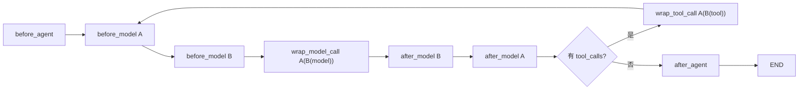
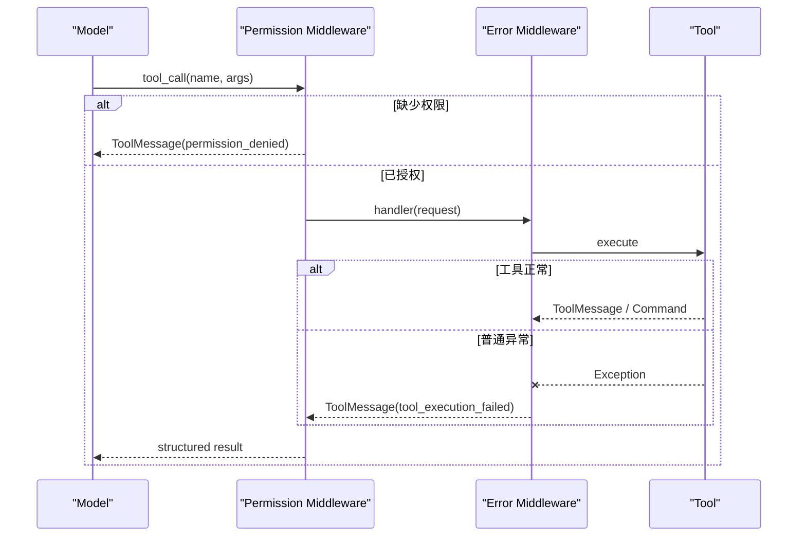

> - 验证环境：Python 3.12 / LangChain 1.3.x / LangGraph 1.2.x
> - 校准日期：2026-07-13
> - API 状态：`AgentMiddleware`、hook decorators、内置 middleware、`create_agent(middleware=...)` 均为 current
> - 本章工件：`mini_deerflow.middleware`、增强后的 `create_lead_agent()`

## 系统快照：边界已经清楚，规则却散落在每个调用点

第 05 章已经明确身份和连接来自 Runtime Context，研究计划与 Artifact 属于 Graph State，语言偏好进入 Store。

现在每次模型调用都要拼接安全上下文，每次工具调用都要检查权限，每条错误路径都要决定是否重试。把这些规则复制到各个工具，很快会产生顺序不一致和遗漏。

本章把横切规则装入同一个 Lead Agent 生命周期。重点不只是会写 hook，而是证明注册顺序、短路、异常传播以及同步/异步路径具有一致的业务语义。

## 1. Middleware 运行在 Agent Graph 生命周期中

<!-- diagram:id=06-agent-middleware-lifecycle -->


**图的文本替代**：Agent 开始时运行 before_agent；每次模型调用前，before_model 按注册顺序执行；wrap_model_call 第一项包住后续项和模型；after_model 逆序退出；若模型产生工具调用，wrap_tool_call 包住工具后回到模型循环；没有工具调用时进入 after_agent 并结束。

这不是普通函数装饰器的比喻，而是 `create_agent` 编译 Graph 时加入的节点与 wrapper。State patch、跳转、流式事件和工具循环都属于同一个 runtime。

## 2. Runnable listener、fallback 与 AgentMiddleware 的边界

旧课程使用 `with_alisteners`、`with_fallbacks` 和 `RunnableLambda` 解释“中间件”。这些能力仍然有价值，但不能冒充 AgentMiddleware。

| 能力 | 适用层级 | 能否读取 Agent Runtime/State | 典型用途 |
|---|---|---|---|
| Runnable listener | 任意 Runnable 的调用观测 | 通常只看到该 Runnable run | 计时、日志、局部 tracing |
| Runnable fallback | Runnable 调用失败后的替代路径 | 不自动理解 Agent 工具循环 | 模型供应商回退 |
| RunnableLambda wrapper | 固定数据转换 | 不自动成为 Agent hook | 输入清洗、Chain 组合 |
| AgentMiddleware | `create_agent` 生命周期 | 可以读取 Context/State/Store | 动态 Prompt、工具治理、HITL、摘要 |

listener 签名写错可能只让观测失效而业务仍返回；Middleware hook 错误通常直接影响 Agent Graph。两者都要测试，但风险模型不同。

## 3. before/after hooks：状态更新与顺序

### 3.1 顺序规则

对于 `[A, B]`：

```text
A.before_model → B.before_model → model → B.after_model → A.after_model
```

它与进入函数栈再退出相同。Mini DeerFlow 用 append-only `middleware_trace` 把顺序变成可测试状态。事实源位于 `tutorial:06-lifecycle-trace-middleware` region。

```python sync=ch06-lifecycle-order
from langchain_core.messages import AIMessage
from mini_deerflow.agents import create_lead_agent
from mini_deerflow.middleware import LifecycleTraceMiddleware
from mini_deerflow.models import create_offline_model

order_agent = create_lead_agent(
    model=create_offline_model([AIMessage(content="完成")]),
    tools=[],
    middleware=[
        LifecycleTraceMiddleware("outer"),
        LifecycleTraceMiddleware("inner"),
    ],
)
order_result = order_agent.invoke({"messages": [("user", "观察顺序")]})
order_trace = [event.as_text() for event in order_result["middleware_trace"]]

assert order_trace == [
    "outer:before_model",
    "inner:before_model",
    "inner:wrap_model_exit",
    "outer:wrap_model_exit",
    "inner:after_model",
    "outer:after_model",
]
```

### 3.2 顺序错误为何可能不报异常

如果 redaction 在日志 Middleware 之后，日志已经记录原始 PII，随后再脱敏也无法撤回；如果权限检查位于会自动重试的工具 Middleware 内层，拒绝可能被错误重试。程序能返回答案，不代表治理顺序正确。

```python sync=ch06-order-failure
expected_wrong_order = [
    "outer:before_model",
    "inner:before_model",
    "outer:after_model",
    "inner:after_model",
]
try:
    assert order_trace == expected_wrong_order
except AssertionError as error:
    order_assumption_error = error
else:
    raise AssertionError("错误的 after hook 顺序假设必须被实验识别")

assert order_assumption_error is not None
```

## 4. wrap_model_call：动态 Prompt 与动态模型

### 4.1 为什么使用 wrap hook

`before_model` 适合返回 State patch；`wrap_model_call` 适合修改 `ModelRequest`、调用 handler、重试、短路或改写 response。多个 wrapper 中第一项是最外层。

### 4.2 动态 Prompt 必须使用安全视图

`ContextPromptMiddleware` 从 Runtime Context 读取 `user_id/locale/permissions/model_profile`，从 Store 读取显式保存的偏好，再用 `request.override(system_message=...)` 创建新请求。它从不把 `auth_token` 复制到 Prompt。

事实源位于 `tutorial:06-context-prompt-middleware` region。第 05 章已经验证安全视图；这里验证默认治理链能运行 PII redaction 和生命周期状态更新。

```python sync=ch06-governance-chain
from mini_deerflow.context import RuntimeContext
from mini_deerflow.middleware import build_lead_middleware

governed_agent = create_lead_agent(
    model=create_offline_model([AIMessage(content="已处理脱敏输入")]),
    tools=[],
    middleware=build_lead_middleware(model_call_limit=3),
)
governed_result = governed_agent.invoke(
    {"messages": [("user", "我的邮箱是 alice@example.com")]},
    context=RuntimeContext(user_id="learner", workspace_root="/tmp"),
)

assert governed_result["messages"][0].content == "我的邮箱是 [REDACTED_EMAIL]"
assert [event.as_text() for event in governed_result["middleware_trace"]] == [
    "lead:before_model",
    "lead:wrap_model_exit",
    "lead:after_model",
]
```

调用上限必须有失败证据，而不是只出现在构造参数中。把本次 run 的模型上限设为 0，Middleware 会在进入模型 handler 前终止：

```python sync=ch06-call-limit-failure
from langchain.agents.middleware.model_call_limit import ModelCallLimitExceededError

limited_agent = create_lead_agent(
    model=create_offline_model([AIMessage(content="不应执行")]),
    tools=[],
    middleware=build_lead_middleware(model_call_limit=0),
)
try:
    limited_agent.invoke(
        {"messages": [("user", "超出预算")]},
        context=RuntimeContext(user_id="learner", workspace_root="/tmp"),
    )
except ModelCallLimitExceededError as error:
    call_limit_error = error
else:
    raise AssertionError("模型调用上限必须在 handler 前阻止执行")

assert "run limit" in str(call_limit_error)
```

### 4.3 动态模型路由由应用配置控制

不要让模型自己把 `model_profile` 改成昂贵或高权限模型。`ModelRouterMiddleware` 只读取应用注入的 Context，并从预授权模型表选择实例。

```python sync=ch06-model-routing
from mini_deerflow.middleware import ModelRouterMiddleware

base_model = create_offline_model([AIMessage(content="base-model")])
premium_model = create_offline_model([AIMessage(content="premium-model")])
router_agent = create_lead_agent(
    model=base_model,
    tools=[],
    middleware=[ModelRouterMiddleware({"premium": premium_model})],
)
router_result = router_agent.invoke(
    {"messages": [("user", "选择模型") ]},
    context=RuntimeContext(
        user_id="learner",
        workspace_root="/tmp",
        model_profile="premium",
    ),
)

assert router_result["messages"][-1].content == "premium-model"
```

生产系统还要在 Gateway 校验谁可以选择哪个 profile，并记录路由原因、成本和 fallback。Middleware 只负责运行时执行已授权决策。

## 5. wrap_tool_call：权限、异常、重试与短路

<!-- diagram:id=06-tool-governance-order -->


**图的文本替代**：模型生成工具调用后，权限 Middleware 先判断 Runtime Context；无权限时直接返回 permission_denied 而不执行工具；有权限时进入错误 Middleware 和工具，普通异常被转为结构化 ToolMessage，再回到模型。

### 5.1 工具异常是数据还是异常

- 参数校验错误：通常作为可修正 ToolMessage 返回模型；
- 临时超时：可按明确策略有限重试；
- 权限拒绝：结构化业务结果，不应靠重试突破；
- 程序 bug：应记录并上抛或转为不泄露内部细节的错误；
- `CancelledError`/系统退出：不能被宽泛捕获吞掉。

`StructuredToolErrorMiddleware` 只捕获普通 `Exception`，返回 error code、工具名、异常类型和 retryable 标志，不把内部堆栈或 Secret 暴露给模型。

```python sync=ch06-tool-error
from langchain_core.messages import ToolMessage
from langchain_core.tools import tool
from mini_deerflow.middleware import StructuredToolErrorMiddleware

@tool
def chapter06_failing_tool(reason: str) -> str:
    """用于观察结构化工具失败。"""
    raise RuntimeError(reason)

failing_model = create_offline_model([
    AIMessage(
        content="",
        tool_calls=[{
            "name": "chapter06_failing_tool",
            "args": {"reason": "temporary outage"},
            "id": "failure-1",
            "type": "tool_call",
        }],
    ),
    AIMessage(content="已收到结构化工具错误"),
])
error_agent = create_lead_agent(
    model=failing_model,
    tools=[chapter06_failing_tool],
    middleware=[StructuredToolErrorMiddleware()],
)
error_result = error_agent.invoke({"messages": [("user", "执行失败工具")]})
error_tool_message = next(
    message for message in error_result["messages"]
    if isinstance(message, ToolMessage)
)

assert error_tool_message.status == "error"
assert "tool_execution_failed" in error_tool_message.content
```

### 5.2 权限拒绝必须短路工具

```python sync=ch06-permission-failure
from mini_deerflow.middleware import ToolPermissionMiddleware

publish_counter = {"calls": 0}

@tool
def chapter06_publish_report(path: str) -> str:
    """发布报告；无权限实验中不得真正执行。"""
    publish_counter["calls"] += 1
    return f"published:{path}"

permission_model = create_offline_model([
    AIMessage(
        content="",
        tool_calls=[{
            "name": "chapter06_publish_report",
            "args": {"path": "reports/a.md"},
            "id": "publish-1",
            "type": "tool_call",
        }],
    ),
    AIMessage(content="发布被拒绝"),
])
permission_agent = create_lead_agent(
    model=permission_model,
    tools=[chapter06_publish_report],
    middleware=[
        ToolPermissionMiddleware({"chapter06_publish_report": "report:publish"})
    ],
)
permission_result = permission_agent.invoke(
    {"messages": [("user", "发布报告")]},
    context=RuntimeContext(
        user_id="reader",
        workspace_root="/tmp",
        permissions=frozenset(),
    ),
)
permission_message = next(
    message for message in permission_result["messages"]
    if isinstance(message, ToolMessage)
)

assert publish_counter["calls"] == 0
assert "permission_denied" in permission_message.content
```

隐藏工具参数与权限 Middleware 是两层防线：前者避免模型生成身份/根目录，后者决定调用是否被允许。两者都不能替代领域服务自己的授权。

## 6. 同步与异步必须对称

只实现 `wrap_model_call` 后调用 `ainvoke`，当前 LangChain 会明确报异步 hook 不可用；反之亦然。课程自定义 wrapper 同时实现 sync/async，并共享纯函数式 request override/denial 逻辑。

```python sync=ch06-async-symmetry
import asyncio
from mini_deerflow.middleware import ContextPromptMiddleware

async def invoke_async_agent() -> str:
    async_agent = create_lead_agent(
        model=create_offline_model([AIMessage(content="异步完成")]),
        tools=[],
        middleware=[ContextPromptMiddleware()],
    )
    result = await async_agent.ainvoke(
        {"messages": [("user", "异步调用")]},
        context=RuntimeContext(user_id="async-user", workspace_root="/tmp"),
    )
    return str(result["messages"][-1].content)

assert asyncio.run(invoke_async_agent()) == "异步完成"
```

不要在 async hook 中调用阻塞 HTTP 或文件 I/O；对称不仅是“两个函数都存在”，还包括取消传播、超时、资源清理和重试语义一致。

## 7. 当前内置 Middleware 能力地图

本章不应该把每个内置 Middleware 都塞进默认链。默认链越长，控制流越隐式，成本和错误组合越难解释。应该按风险与业务需求选择。

| 需求 | 当前能力 | 什么时候加入 | 关键边界 |
|---|---|---|---|
| 动态 Prompt | `dynamic_prompt` 或自定义 wrap hook | 用户/租户/任务规则变化 | 只注入安全、相关视图 |
| 动态模型 | 自定义 `ModelRouterMiddleware` | 成本、能力、地区路由 | profile 必须由应用授权 |
| 模型重试/回退 | `ModelRetryMiddleware`、`ModelFallbackMiddleware` | 临时 provider 故障 | 限次；不可掩盖确定性错误 |
| 工具重试 | `ToolRetryMiddleware` | 幂等、临时失败工具 | 非幂等副作用禁止盲重试 |
| PII | `PIIMiddleware` | Prompt、输出或工具结果含敏感数据 | redaction 不能替代访问控制 |
| 调用限制 | `ModelCallLimitMiddleware`、`ToolCallLimitMiddleware` | 防无限循环与成本失控 | run/thread 语义要明确 |
| 摘要 | `SummarizationMiddleware` | messages 接近 context window | 摘要会丢信息，需评测 |
| HITL | `HumanInTheLoopMiddleware` | 高风险工具执行前 | 需要 checkpointer 和恢复协议 |
| Todo | `TodoListMiddleware` | 多步骤任务可见规划 | Todo 不是业务工作流状态机 |

Mini DeerFlow 默认治理链选择：生命周期 trace、Context Prompt、email redaction、工具权限、结构化工具错误、单次 run 模型调用上限。摘要与 HITL 不进入默认治理链；本章用内存组件验证最小语义，生产级持久化与恢复能力留到后续章节。

## 8. HITL、摘要与持久化的正确关系

旧课程把“危险操作前 `interrupt`”画成概念流程，但没有 Checkpointer 时，进程结束后无法可靠恢复审批点。真正 HITL 至少需要：

1. 可序列化 State；
2. Checkpointer 和稳定 `thread_id`；
3. interrupt payload；
4. 前端/调用方审批协议；
5. `Command(resume=...)` 恢复；
6. 副作用幂等，避免恢复后重复执行。

摘要同样不是简单字符串压缩。它改变模型后续可见信息，需要保留最近消息、处理 tool call 配对、定义触发阈值，并用任务成功率评测信息损失。

本章先用内存组件完成两条最小、可执行验收；第 09–10 章再处理跨进程恢复、审批 API、副作用重放和生产 Checkpointer。

### 8.1 摘要触发会改变后续 messages

```python sync=ch06-summarization
from langchain.agents.middleware import SummarizationMiddleware

summary_model = create_offline_model([
    AIMessage(content="摘要：用户正在学习 Context 与 Middleware。")
])
summary_agent = create_lead_agent(
    model=create_offline_model([AIMessage(content="基于摘要继续回答")]),
    tools=[],
    middleware=[
        SummarizationMiddleware(
            model=summary_model,
            trigger=("messages", 3),
            keep=("messages", 1),
        )
    ],
)
summary_result = summary_agent.invoke({
    "messages": [
        ("user", "第一问"),
        ("assistant", "第一答"),
        ("user", "第二问"),
        ("assistant", "第二答"),
        ("user", "第三问"),
    ]
})

assert summary_result["messages"][0].additional_kwargs["lc_source"] == "summarization"
assert "Context 与 Middleware" in summary_result["messages"][0].content
```

这个断言只证明触发、替换和来源标记正确，不证明摘要保真。摘要质量还要通过后续任务完成率、引用保留率和恢复测试评测。

### 8.2 HITL 拒绝后副作用保持为零

```python sync=ch06-hitl-rejection
from langchain.agents.middleware import HumanInTheLoopMiddleware
from langchain_core.messages import ToolMessage
from langchain_core.tools import tool
from langgraph.checkpoint.memory import InMemorySaver
from langgraph.types import Command

hitl_published = []

@tool
def chapter06_hitl_publish(path: str) -> str:
    """需要人工审批的报告发布工具。"""
    hitl_published.append(path)
    return "published"

hitl_model = create_offline_model([
    AIMessage(
        content="",
        tool_calls=[{
            "name": "chapter06_hitl_publish",
            "args": {"path": "reports/final.md"},
            "id": "hitl-1",
            "type": "tool_call",
        }],
    ),
    AIMessage(content="审批结果已处理"),
])
hitl_agent = create_lead_agent(
    model=hitl_model,
    tools=[chapter06_hitl_publish],
    middleware=[
        HumanInTheLoopMiddleware(interrupt_on={"chapter06_hitl_publish": True})
    ],
    checkpointer=InMemorySaver(),
)
hitl_config = {"configurable": {"thread_id": "chapter06-hitl"}}
interrupted_result = hitl_agent.invoke(
    {"messages": [("user", "发布报告")]},
    config=hitl_config,
)
resumed_result = hitl_agent.invoke(
    Command(resume={
        "decisions": [{"type": "reject", "message": "证据不足，暂不发布"}]
    }),
    config=hitl_config,
)

assert interrupted_result["__interrupt__"]
assert hitl_published == []
assert any(
    isinstance(message, ToolMessage) and "证据不足" in message.content
    for message in resumed_result["messages"]
)
```

### 8.3 错误 listener 可以不破坏业务结果

这条失败实验保留旧课程最有价值的观察，同时明确它属于 Runnable listener，而不是 AgentMiddleware：

```python sync=ch06-listener-signature-failure
from contextlib import redirect_stderr
from io import StringIO
from langchain_core.runnables import RunnableLambda

listener_calls = []

def wrong_listener_signature() -> None:
    listener_calls.append("unexpected")

listener_runnable = RunnableLambda(lambda value: value + 1).with_listeners(
    on_start=wrong_listener_signature
)
listener_stderr = StringIO()
with redirect_stderr(listener_stderr):
    listener_result = listener_runnable.invoke(1)

assert listener_result == 2
assert listener_calls == []
assert "TypeError" in listener_stderr.getvalue()
```

业务返回 2，但 listener 没有执行成功。这正是“只看最终答案”会漏掉的静默观测失败。

## 9. Middleware 组合的工程规则

### 9.1 推荐从外到内思考

一个典型顺序可以是：

```text
观测/trace → PII → 权限 → 限流 → 重试 → 实际模型或工具
```

返回路径反向经过。具体系统可能不同，但必须写下理由并用测试锁定。

### 9.2 不要吞掉所有异常

`except BaseException` 会吞掉取消和系统退出；`except Exception` 仍需要区分业务拒绝、临时失败与 bug。返回给模型的错误应稳定且不泄露内部信息，原始异常交给受控日志和 trace。

### 9.3 横切能力过多时升级为显式 Graph

如果 Middleware 之间开始形成复杂跳转、并行阶段、审批分支和长期状态机，继续叠 wrapper 会让控制流不可见。第 07 章开始学习显式 StateGraph，正是为了把真正的业务拓扑从隐式 hook 中移出。

## 10. 分层练习与即时反馈

### 练习 A：预算 Middleware

实现一个 token/cost 预算 wrapper，同时覆盖 `invoke` 与 `ainvoke`。预算来自 Runtime Context，累计值进入 Thread State。验证超限时不会调用内层 handler。

### 练习 B：顺序推理

将 PII、日志、权限和重试四个 Middleware 排序。分别说明请求路径和返回路径；构造一个顺序错误但业务仍返回的失败测试。

### 练习 C：工具错误分类

让一个工具依次产生参数错误、权限拒绝、临时超时和程序 bug。定义 error code、retryable、是否向模型可见、是否触发告警。

### 延迟回忆题

`before_model` 与 `wrap_model_call` 的控制权差在哪里？为什么 Middleware 列表第一项是 wrapper 外层？为什么 HITL 不能只写一个 `interrupt()` 就算完成？

## 11. 本章交付：Agent 已受治理，但业务流程仍隐藏在循环里

```bash
uv run --locked pytest -q \
  tests/test_mini_deerflow_context_engineering.py \
  tests/test_mini_deerflow_middleware.py \
  tests/test_mini_deerflow_lead_agent.py \
  tests/test_mini_deerflow_tool_contracts.py
uv run --locked python scripts/validate_tutorials.py
```

本章交付 `LifecycleTraceMiddleware`、`ContextPromptMiddleware`、`ModelRouterMiddleware`、`ToolPermissionMiddleware`、`StructuredToolErrorMiddleware` 和 `build_lead_middleware()`。它们直接消费第 05 章的边界，并通过同一个 `create_lead_agent()` 组合。

Lead Agent 现在可观察、可授权、可限制、可摘要。但“检索后必须并行分析、报告发布前必须审批”仍只能依赖 Prompt 和模型选择。第 07 章会把这类固定业务规则写成显式 StateGraph。

DeerFlow 的 Harness 不是一个超大 Prompt，而是 Lead Agent factory 周围有顺序的 Middleware、Tools、State、Store 和后续 Subagent/Sandbox。本课程的 DeerFlow 基线固定在提交 `2bd0f56a0f5a418d126cb4a18e23001f54ccf024`；不要用仓库旧的固定数量流程图代替当前 factory 源码。

| Mini DeerFlow | DeerFlow 固定提交中的入口 | 对照阅读问题 |
|---|---|---|
| `create_lead_agent()` | `backend/packages/harness/deerflow/agents/lead_agent/agent.py::make_lead_agent` | model、tools、middleware、state_schema 在何处汇合？ |
| `ThreadState` | `backend/packages/harness/deerflow/agents/thread_state.py::ThreadState` | 哪些字段追加、覆盖、去重或 fail closed？ |
| `ContextPromptMiddleware` | `middlewares/dynamic_context_middleware.py` 与 durable context 相关 middleware | 哪些上下文每次变化，哪些需要在摘要后恢复？ |
| `StructuredToolErrorMiddleware` | `middlewares/tool_error_handling_middleware.py` | 哪些异常变成 ToolMessage，哪些 Graph 控制异常必须上抛？ |
| `ToolPermissionMiddleware` | tool policy、deferred tool filter 与 Gateway caller context | 工具可见性和执行权限分别在哪层决定？ |
| `LifecycleTraceMiddleware` | `build_middlewares()` 注册顺序 | before 正序、after 逆序、wrap 洋葱如何影响最终行为？ |
| Summary/HITL 最小实验 | summarization、durable context、checkpointer/runtime | 为什么摘要与审批必须和恢复协议一起测试？ |

推荐阅读顺序：先看 `make_lead_agent` 中 `build_middlewares()` 的返回顺序，再只挑 `ThreadData`、`Sandbox`、`DurableContext`、`ToolErrorHandling`、`DeferredToolFilter` 五个代表实现；对每个实现记录 hook、读取的 Context/State/Store、返回的 patch/Command 和异常策略。

资料访问日期：2026-07-13。

继续阅读：

- [LangChain Middleware Overview](https://docs.langchain.com/oss/python/langchain/middleware/overview)
- [LangChain Custom Middleware](https://docs.langchain.com/oss/python/langchain/middleware/custom)
- [LangChain Built-in Middleware](https://docs.langchain.com/oss/python/langchain/middleware/built-in)
- [LangChain Human-in-the-loop](https://docs.langchain.com/oss/python/langchain/human-in-the-loop)

继续阅读：[第 07 章：把固定业务规则写成 StateGraph](/langchain-logbook/posts/07_stategraph/)。