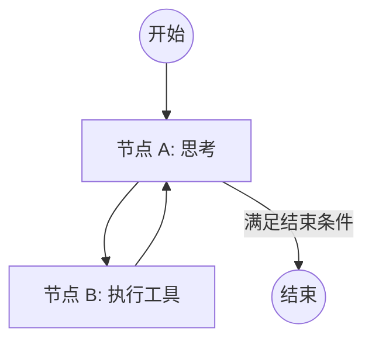

## 0. 本章知识脉络 (Chapter Overview)
在前面的章节中，我们一直使用 `create_agent` 这个高层工厂函数。虽然方便，但它屏蔽了 Agent 的精细化控制。在本章中，我们将拆掉“黑盒”，学习如何使用 `StateGraph` 手动编排每一个节点和边。你将掌握：
- 🎯 **`TypedDict State`**: 定义 Agent 的全局“记忆卡槽”数据结构。
- 🎯 **`Nodes & Edges`**: 手动绘制 Agent 的逻辑图：什么时候推理，什么时候行动。
- 🎯 **`Conditional Edges`**: 允许 Agent 根据 LLM 的输出结果，自主决定是继续寻找新工具，还是直接结束对话。

## 1. 导读与建模

- **[知识背景 / Background]**：在复杂的业务场景（如：多轮纠错、条件分支、循环处理）中，简单的线性逻辑已经捉襟见肘。`StateGraph` 是 LangGraph 的灵魂，它不仅能保存状态，更能通过图论的思维来解决高度动态的对话逻辑。
- **[逻辑全景图 / Overview]**：

- **[学习目标 / Objectives]**：手写一个最简化的 ReAct 状态机，理清节点（Node）、边（Edge）与状态（State）之间的交互真谛。

---

## 2. 核心知识点展开

### 知识点一：TypedDict State —— 状态的容器

- **💡 原理直觉：Agent 的共享白板**
  > `State` 就是所有节点都能读写的“全局变量池”。为了保证类型安全，我们通常使用 `TypedDict` 来定义它。
  
- **🚀 代码实现**：
  ```python
  from typing import TypedDict, Annotated
  from langgraph.graph.message import add_messages

  class AgentState(TypedDict):
      # 使用 Annotated 和 add_messages 告诉图：新消息应该追加到列表末尾，而不是覆盖
      messages: Annotated[list, add_messages]
  ```

### 知识点二：Nodes & Edges —— 逻辑的连线

- **💡 原理直觉：规划 Agent 的思维导图**
  > 节点（Node）就是处理逻辑的函数；边（Edge）就是连接函数的箭头。通过 `workflow.add_node` 和 `workflow.add_edge`，我们像拼积木一样组合出复杂的 Agent。

---

## 3. 实验验证 (Lab)

讲义到此结束。**现在请打开** [07_StateGraph.ipynb](./07_StateGraph.ipynb) 文件进行实战。
你将完成以下硬核任务：
1. **手写状态机**：弃用 `create_agent`，用底层 API 还原一个全功能的 ReAct loop。
2. **可视化验证**：使用 `graph.get_graph().pretty_print()` 生成并查看你亲手绘制的逻辑图。
3. **条件路由**：实现一个具备“自省”能力的 Agent，能根据结果自行判断是否需要二次查询。