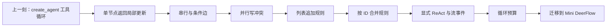
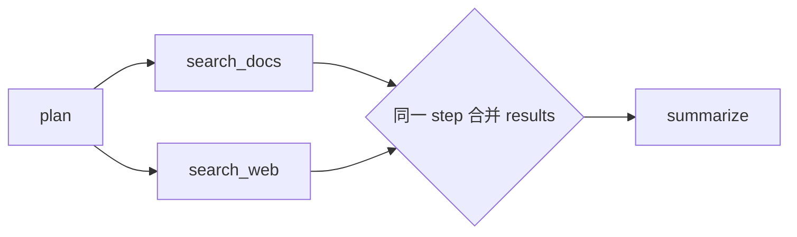

> **课程位置**：Graph 编排层第 1 章  
> **锁定环境**：Python 3.12 / LangChain 1.3.x / LangGraph 1.2.x  
> **本章工件**：一张从零搭建的研究流程图，以及 Mini DeerFlow 显式 ReAct 工厂

> **本章导航**
> **本章只解决一个问题**：当 Prompt 不能保证业务顺序时，怎样把状态与转移写成可检查的 Graph。
>
> **当前系统**：Agent 会调用工具，Middleware 会治理调用生命周期。
>
> **遇到的问题**：“先规划、再并行检索、最后汇总”仍只是给模型的自然语言要求。
>
> **本章目标**：从零建立 State、Node、Edge、Reducer 和显式 ReAct 循环。
>
> **暂时不讲**：动态 worker、跨进程持久化和人工审批。
>
> **学完以后**：你能判断何时标准 `create_agent` 已足够，何时业务规则必须进入 Graph。
>
> **预计时间**：35～45 分钟。

## 1. 工具会调用了，顺序仍然无法证明

上一章结束时，Lead Agent 已经会调用工具，权限、预算和错误也有 Middleware 处理。

现在交给它一个研究任务：“先规划，再同时搜索文档与网页，最后汇总。”多数时候，它确实会照做。

麻烦就在“多数时候”。这句话只是给模型的要求，应用无法从代码证明它一定照这个顺序执行。

规划是否一定先发生？两路搜索能否并行？它们同时交回结果时由谁合并？汇总会不会提前开始？这些已经是产品规则，不能继续留给模型临场判断。

我们先拿掉模型，把研究请求当作普通字符串。等数据如何穿过节点、边和合并点都看清楚，再把模型与工具循环放回来。


```mermaid
flowchart LR
    A["上一刻：create_agent 工具循环"] --> B["单节点返回局部更新"]
    B --> C["串行与条件边"]
    C --> D["并行写冲突"]
    D --> E["列表追加规则"]
    E --> F["按 ID 合并规则"]
    F --> G["显式 ReAct 与流事件"]
    G --> H["循环预算"]
    H --> I["迁移到 Mini DeerFlow"]
```

**图的文本替代**：研究流程先经过单节点、串行边和条件边，再故意制造并行写冲突。

确定字段的合并规则后，我们摊开 ReAct 循环，观察事件与循环预算，最后把这些机制迁回 Mini DeerFlow。

## 2. 先让研究提纲穿过节点和边

第一个版本只做一件事：根据主题写出提纲。节点仍是普通 Python 函数，研究主题则进入 Graph State。运行结果若不符合预测，原因只可能在图的更新规则里。


### 节点只交回自己改动的字段

**运行前先预测**：`write_outline` 返回值中没有 `topic`，最终 State 还会保留输入主题吗？

```python sync=ch07-state-node-patch
from typing import TypedDict

from langgraph.graph import END, START, StateGraph


class OutlineState(TypedDict):
    topic: str
    outline: str


def write_outline(state: OutlineState) -> dict[str, str]:
    patch = {"outline": f"提纲：{state['topic']} 的状态与控制流"}
    print(f"[node:write_outline] input.topic = {state['topic']}")
    print(f"[node:write_outline] patch = {patch}")
    return patch


outline_builder = StateGraph(OutlineState)
outline_builder.add_node("write_outline", write_outline)
outline_builder.add_edge(START, "write_outline")
outline_builder.add_edge("write_outline", END)
outline_graph = outline_builder.compile()

print("[before]", {"topic": "LangGraph", "outline": ""})
outline_result = outline_graph.invoke({"topic": "LangGraph", "outline": ""})
print("[after]", outline_result)
```

**观察结果**：

```text output=ch07-state-node-patch
[before] {'topic': 'LangGraph', 'outline': ''}
[node:write_outline] input.topic = LangGraph
[node:write_outline] patch = {'outline': '提纲：LangGraph 的状态与控制流'}
[after] {'topic': 'LangGraph', 'outline': '提纲：LangGraph 的状态与控制流'}
```

**发生了什么**：State 是一次图运行中的共享事实。节点读取当前快照，返回 patch（局部更新）；LangGraph 把 patch 合入 State，所以没被更新的 `topic` 仍然存在。

**动手修改**：让节点再返回 `topic="被覆盖"`。运行前先判断这是修改输入对象，还是提交一个覆盖该字段的 patch。


State 会参与序列化、checkpoint 和 trace，适合保存这次研究运行的事实。

数据库连接、API Key 和模型对象是运行依赖，应放进 Runtime Context；跨线程偏好属于 Store，权威业务事务仍由数据库保存。


### 用边锁定规划和总结的先后

**运行前先预测**：`summarize` 能否读到 `plan` 刚写入的 `query`？最终 State 会包含哪些字段？

```python sync=ch07-serial-edge
from typing import TypedDict

from langgraph.graph import END, START, StateGraph


class SerialResearchState(TypedDict):
    objective: str
    query: str
    summary: str


def plan_query(state: SerialResearchState) -> dict[str, str]:
    patch = {"query": f"检索：{state['objective']}"}
    print("[node:plan]", patch)
    return patch


def summarize_query(state: SerialResearchState) -> dict[str, str]:
    patch = {"summary": f"已根据“{state['query']}”生成摘要"}
    print("[node:summarize] read.query =", state["query"])
    print("[node:summarize]", patch)
    return patch


serial_builder = StateGraph(SerialResearchState)
serial_builder.add_node("plan", plan_query)
serial_builder.add_node("summarize", summarize_query)
serial_builder.add_edge(START, "plan")
serial_builder.add_edge("plan", "summarize")
serial_builder.add_edge("summarize", END)
serial_graph = serial_builder.compile()

serial_result = serial_graph.invoke(
    {"objective": "解释 checkpoint", "query": "", "summary": ""}
)
print("[after]", serial_result)
```

**观察结果**：

```text output=ch07-serial-edge
[node:plan] {'query': '检索：解释 checkpoint'}
[node:summarize] read.query = 检索：解释 checkpoint
[node:summarize] {'summary': '已根据“检索：解释 checkpoint”生成摘要'}
[after] {'objective': '解释 checkpoint', 'query': '检索：解释 checkpoint', 'summary': '已根据“检索：解释 checkpoint”生成摘要'}
```

**发生了什么**：Node（节点）拥有一步工作，Edge（边）拥有步骤之间的可达关系。`plan → summarize` 跨过两个 step；后一个节点读到的是前一步 patch 合并后的 State。

**动手修改**：删除 `plan → summarize`，改成 `START` 同时连接两个节点。先预测 `summarize` 会读到什么，再运行观察。


固定边适合表达“规划完成后一定总结”。空请求却不该进入研究流程，它的下一站取决于验证结果。

这里加一个 router，只读取已有状态并选择后继，不提交 patch，也不产生副作用。


### 空请求该走向哪里

**运行前先预测**：空白请求会进入 `research`，还是直接进入 `reject`？router 会不会改写 `status`？

```python sync=ch07-conditional-edge
from typing import Literal, TypedDict

from langgraph.graph import END, START, StateGraph


class RoutedState(TypedDict):
    objective: str
    status: str
    answer: str


def validate_request(state: RoutedState) -> dict[str, str]:
    status = "ready" if state["objective"].strip() else "invalid"
    return {"status": status}


def choose_path(state: RoutedState) -> Literal["research", "reject"]:
    return "research" if state["status"] == "ready" else "reject"


def research(state: RoutedState) -> dict[str, str]:
    return {"answer": f"开始研究：{state['objective']}"}


def reject(_: RoutedState) -> dict[str, str]:
    return {"answer": "请求不能为空"}


route_builder = StateGraph(RoutedState)
route_builder.add_node("validate", validate_request)
route_builder.add_node("research", research)
route_builder.add_node("reject", reject)
route_builder.add_edge(START, "validate")
route_builder.add_conditional_edges("validate", choose_path)
route_builder.add_edge("research", END)
route_builder.add_edge("reject", END)
route_graph = route_builder.compile()

for objective in ("解释 reducer", "   "):
    result = route_graph.invoke({"objective": objective, "status": "", "answer": ""})
    print({"objective": objective, "status": result["status"], "answer": result["answer"]})
```

**观察结果**：

```text output=ch07-conditional-edge
{'objective': '解释 reducer', 'status': 'ready', 'answer': '开始研究：解释 reducer'}
{'objective': '   ', 'status': 'invalid', 'answer': '请求不能为空'}
```

**发生了什么**：条件边读取 `validate` 已写入的 `status`，选择后继节点。State 的修改仍由节点完成；router 保持纯净，才不会在调试、恢复或可视化时偷偷产生副作用。

**动手修改**：增加 `needs_clarification` 状态和第三条分支。不要在 router 中直接写 `answer`，而是新增一个拥有该 patch 的节点。


## 3. 两路搜索同时回写 `results`

提纲确定后，文档搜索与网页搜索彼此没有依赖，可以同时运行。研究流程于是变成 `plan → search_docs / search_web → summarize`。

两路搜索会在同一个 step 给 `results` 提交不同 patch。串行流程里从未发生过这种情况，所以先保留最自然的字段声明，看看 LangGraph 会如何处理。


```mermaid
flowchart LR
    P["plan"] --> D["search_docs"]
    P --> W["search_web"]
    D --> M{"同一 step 合并 results"}
    W --> M
    M --> S["summarize"]
```

**图的文本替代**：plan 完成后，文档搜索与网页搜索并行。两份 `results` patch 要在 step 边界合并，summarize 才能读到完整证据。


### 没有合并规则时，LangGraph 拒绝替你覆盖

**运行前先预测**：`results` 会保留 docs、保留 web、自动拼接，还是拒绝这次更新？

```python sync=ch07-parallel-conflict
from typing import TypedDict

from langgraph.errors import InvalidUpdateError
from langgraph.graph import END, START, StateGraph


class ConflictingState(TypedDict):
    query: str
    results: list[str]
    summary: str


observed_parallel_patches: dict[str, dict[str, list[str]]] = {}


def search_docs(state: ConflictingState) -> dict[str, list[str]]:
    patch = {"results": [f"docs:{state['query']}"]}
    observed_parallel_patches["search_docs"] = patch
    return patch


def search_web(state: ConflictingState) -> dict[str, list[str]]:
    patch = {"results": [f"web:{state['query']}"]}
    observed_parallel_patches["search_web"] = patch
    return patch


conflict_builder = StateGraph(ConflictingState)
conflict_builder.add_node("search_docs", search_docs)
conflict_builder.add_node("search_web", search_web)
conflict_builder.add_edge(START, "search_docs")
conflict_builder.add_edge(START, "search_web")
conflict_builder.add_edge("search_docs", END)
conflict_builder.add_edge("search_web", END)
conflict_graph = conflict_builder.compile()

print("[before] results = []")
try:
    conflict_graph.invoke({"query": "checkpoint", "results": [], "summary": ""})
except InvalidUpdateError as error:
    assert isinstance(error, InvalidUpdateError)
    for node_name in sorted(observed_parallel_patches):
        print(f"[node:{node_name}] patch = {observed_parallel_patches[node_name]}")
    print("InvalidUpdateError: results received multiple updates in one step")
else:
    raise AssertionError("并行同字段写入必须暴露冲突")
```

**观察结果**：

```text output=ch07-parallel-conflict
[before] results = []
[node:search_docs] patch = {'results': ['docs:checkpoint']}
[node:search_web] patch = {'results': ['web:checkpoint']}
InvalidUpdateError: results received multiple updates in one step
```

**发生了什么**：这不是线程安全偶发错误，而是 State schema 没回答“多个更新如何成为一个值”。LangGraph 拒绝替业务猜测覆盖顺序。这个字段级合并函数就叫 Reducer（归并器）。

**动手修改**：先不要加 reducer，只交换两个节点的注册顺序。预测它是否会让错误可靠消失，并用运行结果验证。


当前搜索结果只追加，不修改旧项，列表相加正好符合它的业务含义。`Annotated` 把字段类型和 reducer 绑定；各节点仍返回局部列表，LangGraph 在 step 边界调用合并函数。


### 只追加的证据可以用 `operator.add`

**运行前先预测**：输入中的空列表和两个并行 patch 合并后，`results` 有几个元素？

```python sync=ch07-parallel-reducer
import operator
from typing import Annotated, TypedDict

from langgraph.graph import END, START, StateGraph


class AppendResultsState(TypedDict):
    query: str
    results: Annotated[list[str], operator.add]


def docs_result(state: AppendResultsState) -> dict[str, list[str]]:
    return {"results": [f"docs:{state['query']}"]}


def web_result(state: AppendResultsState) -> dict[str, list[str]]:
    return {"results": [f"web:{state['query']}"]}


append_builder = StateGraph(AppendResultsState)
append_builder.add_node("search_docs", docs_result)
append_builder.add_node("search_web", web_result)
append_builder.add_edge(START, "search_docs")
append_builder.add_edge(START, "search_web")
append_builder.add_edge("search_docs", END)
append_builder.add_edge("search_web", END)
append_graph = append_builder.compile()

append_result = append_graph.invoke({"query": "checkpoint", "results": []})
print("[before] results = []")
print("[node:search_docs] patch =", {"results": ["docs:checkpoint"]})
print("[node:search_web] patch =", {"results": ["web:checkpoint"]})
print("[after] results =", sorted(append_result["results"]))
```

**观察结果**：

```text output=ch07-parallel-reducer
[before] results = []
[node:search_docs] patch = {'results': ['docs:checkpoint']}
[node:search_web] patch = {'results': ['web:checkpoint']}
[after] results = ['docs:checkpoint', 'web:checkpoint']
```

**发生了什么**：`operator.add` 给“只追加日志或证据”提供了明确语义。它解决的是同一 step 的合并，不负责去重、替换、排序或验证业务身份。

**动手修改**：把初始 `results` 改成 `['cached:checkpoint']`。先预测最终长度，再确认 reducer 也会合并输入 State 与新 patch。


接下来把 `results` 换成任务表。任务仍是列表，但同一个任务会从 `pending` 变成 `running`、`done`。继续相加后，一项任务会同时保留新旧状态。


### 同一个 reducer 会把任务表合并错

**运行前先预测**：两个节点更新不同任务后，列表长度是 2 还是 4？同一个 ID 会出现几次？

```python sync=ch07-task-list-duplicates
import operator
from typing import Annotated, TypedDict

from langgraph.graph import END, START, StateGraph


class TaskItem(TypedDict):
    id: str
    status: str


class AppendedTaskState(TypedDict):
    tasks: Annotated[list[TaskItem], operator.add]


def finish_docs(_: AppendedTaskState) -> dict[str, list[TaskItem]]:
    return {"tasks": [{"id": "docs", "status": "done"}]}


def finish_web(_: AppendedTaskState) -> dict[str, list[TaskItem]]:
    return {"tasks": [{"id": "web", "status": "done"}]}


task_append_builder = StateGraph(AppendedTaskState)
task_append_builder.add_node("finish_docs", finish_docs)
task_append_builder.add_node("finish_web", finish_web)
task_append_builder.add_edge(START, "finish_docs")
task_append_builder.add_edge(START, "finish_web")
task_append_builder.add_edge("finish_docs", END)
task_append_builder.add_edge("finish_web", END)
task_append_graph = task_append_builder.compile()

task_append_result = task_append_graph.invoke(
    {"tasks": [{"id": "docs", "status": "pending"}, {"id": "web", "status": "pending"}]}
)
for task_id in ("docs", "web"):
    statuses = sorted(
        item["status"] for item in task_append_result["tasks"] if item["id"] == task_id
    )
    print(f"id={task_id} statuses={statuses}")
print("task_count =", len(task_append_result["tasks"]))
```

**观察结果**：

```text output=ch07-task-list-duplicates
id=docs statuses=['done', 'pending']
id=web statuses=['done', 'pending']
task_count = 4
```

**发生了什么**：代码没有异常，但业务状态错了。`operator.add` 忠实完成了“追加”，只是任务表真正需要的是“同 ID 替换，新 ID 追加”。静默错误比异常更需要先写可观察输出。

**动手修改**：把其中一个 patch 的 ID 改为 `pdf`。预测哪些项应追加、哪些项应替换，再写出你的合并规则。


任务表需要“同 ID 替换，新 ID 追加”。自定义 reducer 接收旧值和本次更新，再返回合并结果。这里的 `id` 是任务身份；若以后改成复合键，旧 checkpoint 的解释也会跟着变化。


### 按任务 ID 替换，保留原有顺序

**运行前先预测**：保留初始顺序时，两个 `done` patch 会替换原位置，还是移动到列表末尾？

```python sync=ch07-task-list-merge
from typing import Annotated, TypedDict

from langgraph.graph import END, START, StateGraph


class MergedTaskItem(TypedDict):
    id: str
    status: str


def merge_tasks(
    current: list[MergedTaskItem] | None,
    updates: list[MergedTaskItem] | None,
) -> list[MergedTaskItem]:
    merged = [dict(item) for item in (current or [])]
    positions = {item["id"]: index for index, item in enumerate(merged)}
    for update in updates or []:
        if update["id"] in positions:
            merged[positions[update["id"]]] = dict(update)
        else:
            positions[update["id"]] = len(merged)
            merged.append(dict(update))
    return merged


class MergedTaskState(TypedDict):
    tasks: Annotated[list[MergedTaskItem], merge_tasks]


def complete_docs(_: MergedTaskState) -> dict[str, list[MergedTaskItem]]:
    return {"tasks": [{"id": "docs", "status": "done"}]}


def complete_web(_: MergedTaskState) -> dict[str, list[MergedTaskItem]]:
    return {"tasks": [{"id": "web", "status": "done"}]}


task_merge_builder = StateGraph(MergedTaskState)
task_merge_builder.add_node("complete_docs", complete_docs)
task_merge_builder.add_node("complete_web", complete_web)
task_merge_builder.add_edge(START, "complete_docs")
task_merge_builder.add_edge(START, "complete_web")
task_merge_builder.add_edge("complete_docs", END)
task_merge_builder.add_edge("complete_web", END)
task_merge_graph = task_merge_builder.compile()

task_merge_result = task_merge_graph.invoke(
    {"tasks": [{"id": "docs", "status": "pending"}, {"id": "web", "status": "pending"}]}
)
print("tasks =", task_merge_result["tasks"])
print("unique_ids =", len({item["id"] for item in task_merge_result["tasks"]}))
```

**观察结果**：

```text output=ch07-task-list-merge
tasks = [{'id': 'docs', 'status': 'done'}, {'id': 'web', 'status': 'done'}]
unique_ids = 2
```

**发生了什么**：reducer 用 `id` 建立 identity，更新原位置并保留稳定顺序。此规则适合“当前任务表”，不适合必须保留全部历史的审计日志。

**动手修改**：让两个并行节点同时更新 `docs` 为不同状态。你必须明确选择“固定优先级、拒绝冲突或保存版本”，不要依赖节点注册顺序碰运气。


## 4. 把模型与工具循环摊开来看

State、节点、边、条件分支和合并点现在都能从代码中指出来。把模型放回图里后，ReAct 循环也只是两类节点的往返。

模型决定是否调用工具，工具结果写回消息历史，再由模型继续判断。

标准工具循环仍应优先使用 `create_agent`。这里手写一次，是为了看清 ToolMessage 为什么必须回到模型，以及验证、审批或质量门这类确定性阶段应该接在循环的什么位置。


> **确定性测试写法**：下面的 Fake Model 不会调用外部大模型，也不会自主推理工具轨迹，只按脚本先返回 tool call、再返回最终回答。它用于稳定展示 Graph 节点顺序与 ToolMessage 回流。


### 连接 model、tools 和返回边

**运行前先预测**：模型第一次返回 tool call 后，工具结果会直接成为最终回答吗？节点轨迹会经过几步？

```python sync=ch07-explicit-react
import operator
from typing import Annotated, Literal

from langchain_core.language_models.fake_chat_models import GenericFakeChatModel
from langchain_core.messages import AIMessage, ToolMessage
from langchain_core.tools import tool
from langgraph.graph import END, START, MessagesState, StateGraph
from langgraph.prebuilt import ToolNode


class ToolCallingFakeModel(GenericFakeChatModel):
    def bind_tools(self, tools, *, tool_choice=None, **kwargs):
        del tools, tool_choice, kwargs
        return self


@tool
def multiply(left: int, right: int) -> int:
    """计算两个整数的乘积。"""
    return left * right


class LocalReactState(MessagesState):
    node_trace: Annotated[list[str], operator.add]


local_model = ToolCallingFakeModel(
    messages=iter(
        [
            AIMessage(
                content="",
                tool_calls=[{"name": "multiply", "args": {"left": 6, "right": 7}, "id": "call-42"}],
            ),
            AIMessage(content="根据工具结果，答案是 42。"),
        ]
    )
)
bound_model = local_model.bind_tools([multiply])
local_tool_node = ToolNode([multiply])


def call_local_model(state: LocalReactState) -> dict[str, object]:
    return {"messages": [bound_model.invoke(state["messages"])], "node_trace": ["model"]}


def call_local_tools(state: LocalReactState) -> dict[str, object]:
    update = local_tool_node.invoke(state)
    return {"messages": update["messages"], "node_trace": ["tools"]}


def route_local_model(state: LocalReactState) -> Literal["tools", "__end__"]:
    return "tools" if state["messages"][-1].tool_calls else END


react_builder = StateGraph(LocalReactState)
react_builder.add_node("model", call_local_model)
react_builder.add_node("tools", call_local_tools)
react_builder.add_edge(START, "model")
react_builder.add_conditional_edges("model", route_local_model)
react_builder.add_edge("tools", "model")
local_react_graph = react_builder.compile()

local_react_result = local_react_graph.invoke({"messages": [("user", "计算 6 × 7")]})
tool_message = next(
    message for message in local_react_result["messages"] if isinstance(message, ToolMessage)
)
print("node_trace =", local_react_result["node_trace"])
print("tool_message =", tool_message.content)
print("final_answer =", local_react_result["messages"][-1].content)
```

**观察结果**：

```text output=ch07-explicit-react
node_trace = ['model', 'tools', 'model']
tool_message = 42
final_answer = 根据工具结果，答案是 42。
```

**发生了什么**：第一次 model patch 追加带 tool call 的 AIMessage；tools 节点执行函数并追加配对的 ToolMessage；条件边再回到 model，第二次模型调用才生成面向用户的答案。

**动手修改**：把 `tools → model` 改成 `tools → END`。预测最终消息类型与内容，解释为什么原始工具输出不等于最终回答。


### 谁改了什么，当前又是什么

**运行前先预测**：`updates` 每次包含局部 patch 还是完整 State？`values` 会不会包含之前节点写入的字段？

```python sync=ch07-stream-modes
import operator
from typing import Annotated, TypedDict

from langgraph.graph import END, START, StateGraph


class StreamState(TypedDict):
    count: int
    trace: Annotated[list[str], operator.add]


def step_one(state: StreamState) -> dict[str, object]:
    return {"count": state["count"] + 1, "trace": ["one"]}


def step_two(state: StreamState) -> dict[str, object]:
    return {"count": state["count"] + 1, "trace": ["two"]}


stream_builder = StateGraph(StreamState)
stream_builder.add_node("one", step_one)
stream_builder.add_node("two", step_two)
stream_builder.add_edge(START, "one")
stream_builder.add_edge("one", "two")
stream_builder.add_edge("two", END)
stream_graph = stream_builder.compile()

for mode, chunk in stream_graph.stream(
    {"count": 0, "trace": []}, stream_mode=["updates", "values"]
):
    if mode == "updates":
        node_name, patch = next(iter(chunk.items()))
        print(f"updates node={node_name} patch={patch}")
    else:
        print(f"values count={chunk['count']} trace={chunk['trace']}")
```

**观察结果**：

```text output=ch07-stream-modes
values count=0 trace=[]
updates node=one patch={'count': 1, 'trace': ['one']}
values count=1 trace=['one']
updates node=two patch={'count': 2, 'trace': ['two']}
values count=2 trace=['one', 'two']
```

**发生了什么**：`updates` 暴露本节点提交的 patch，适合解释“谁改了什么”；`values` 暴露合并后的完整快照，适合重建当前 UI。

以后接入 Gateway 时，客户端需要的是稳定事件协议。`updates` 和 `values` 可以作为内部来源，但不能把 Python 对象原样暴露给前端。

**动手修改**：只订阅 `updates`，尝试仅靠最后一个 chunk 还原完整 State。记录你还缺哪些历史信息。


研究助手可能反复搜索或修订。Prompt 里的“最多三次”仍是一句要求，Graph 无法据此保证终止。先让一个无条件循环撞上 `recursion_limit`，看看这根保险丝能提供什么。


### 无条件循环最终只会得到异常

**运行前先预测**：图被终止前，`work` 节点至少执行一次吗？异常发生后还能否从返回值读取最终 State？

```python sync=ch07-recursion-limit
import operator
from typing import Annotated, TypedDict

from langgraph.errors import GraphRecursionError
from langgraph.graph import START, StateGraph


class UnboundedState(TypedDict):
    attempts: Annotated[list[int], operator.add]


observed_attempts: list[int] = []


def repeat_work(state: UnboundedState) -> dict[str, list[int]]:
    attempt = len(state.get("attempts", [])) + 1
    observed_attempts.append(attempt)
    return {"attempts": [attempt]}


unbounded_builder = StateGraph(UnboundedState)
unbounded_builder.add_node("work", repeat_work)
unbounded_builder.add_edge(START, "work")
unbounded_builder.add_edge("work", "work")
unbounded_graph = unbounded_builder.compile()

try:
    unbounded_graph.invoke({"attempts": []}, config={"recursion_limit": 3})
except GraphRecursionError as error:
    assert isinstance(error, GraphRecursionError)
    print("observed_attempts =", observed_attempts)
    print("GraphRecursionError: graph exceeded recursion_limit=3")
else:
    raise AssertionError("无条件循环必须被 recursion limit 终止")
```

**观察结果**：

```text output=ch07-recursion-limit
observed_attempts = [1, 2, 3]
GraphRecursionError: graph exceeded recursion_limit=3
```

**发生了什么**：recursion limit 是运行时保险丝。它终止了执行，却没有产出“为什么结束”的业务状态；调用方只得到异常。真实系统还需要可解释、可测试的预算字段。

**动手修改**：把 limit 改成 1 和 5，记录节点实际执行次数。不要把观察到的数值误当成所有复杂 Graph 的业务轮次。


### 让 State 记录业务停止原因

**运行前先预测**：预算为 3 时，route 在第几次 patch 合并后选择 END？最终结果是异常还是带原因的 State？

```python sync=ch07-loop-budget
import operator
from typing import Annotated, Literal, TypedDict

from langgraph.graph import END, START, StateGraph


class BoundedState(TypedDict):
    attempts: Annotated[list[int], operator.add]
    max_attempts: int
    stop_reason: str


def bounded_work(state: BoundedState) -> dict[str, object]:
    attempt = len(state.get("attempts", [])) + 1
    reason = "budget_exhausted" if attempt >= state["max_attempts"] else ""
    return {"attempts": [attempt], "stop_reason": reason}


def continue_or_stop(state: BoundedState) -> Literal["work", "__end__"]:
    return END if state["stop_reason"] else "work"


bounded_builder = StateGraph(BoundedState)
bounded_builder.add_node("work", bounded_work)
bounded_builder.add_edge(START, "work")
bounded_builder.add_conditional_edges("work", continue_or_stop)
bounded_graph = bounded_builder.compile()

bounded_result = bounded_graph.invoke(
    {"attempts": [], "max_attempts": 3, "stop_reason": ""},
    config={"recursion_limit": 10},
)
print("attempts =", bounded_result["attempts"])
print("stop_reason =", bounded_result["stop_reason"])
```

**观察结果**：

```text output=ch07-loop-budget
attempts = [1, 2, 3]
stop_reason = budget_exhausted
```

**发生了什么**：业务预算负责“何时以及为何停止”，recursion limit 仍保留为更外层保险丝。两者不是二选一：前者产生领域结果，后者防止错误拓扑失控。

**动手修改**：让预算由“尝试次数”改成“累计成本”。指出哪个字段属于 State，哪个价格表或权限依赖应由 Runtime Context 提供。


## 5. Mini DeerFlow 如何保存这些领域规则

最小实验已经说明图如何运行，项目代码还要回答另外几件事：State 类型放在哪里，字段如何保存，工具能更新哪些字段，以及测试从哪个工厂进入。


### 同一条 ReAct 拓扑，不同字段使用不同 reducer

**运行前先预测**：工程工厂的节点轨迹是否仍是 `model → tools → model`？同路径 Artifact 再次写入时是追加还是替换？

```python sync=ch07-mini-deerflow-migration
import operator

from langchain_core.messages import AIMessage

from mini_deerflow.graph import create_explicit_react_graph
from mini_deerflow.models import create_offline_model
from mini_deerflow.schemas import ArtifactRef
from mini_deerflow.state import MiddlewareTraceEvent, merge_artifacts
from mini_deerflow.tools import calculator


project_model = create_offline_model(
    [
        AIMessage(
            content="",
            tool_calls=[
                {
                    "name": "calculator",
                    "args": {"operation": "multiply", "left": 6, "right": 7},
                    "id": "calc-42",
                    "type": "tool_call",
                }
            ],
        ),
        AIMessage(content="结果是 42。"),
    ]
)
project_graph = create_explicit_react_graph(model=project_model, tools=[calculator])
project_result = project_graph.invoke({"messages": [("user", "计算 6 × 7")]})

artifacts = merge_artifacts(
    [ArtifactRef(path="reports/answer.md", media_type="text/markdown")],
    [ArtifactRef(path="reports/answer.md", media_type="application/json")],
)
trace = operator.add(
    [MiddlewareTraceEvent(middleware="permission", hook="before_model")],
    [MiddlewareTraceEvent(middleware="artifact", hook="after_model")],
)

print("node_trace =", [event.as_text() for event in project_result["node_trace"]])
print("artifact_count =", len(artifacts))
print("artifact_media_type =", artifacts[0].media_type)
print("middleware_trace =", [event.as_text() for event in trace])
```

**观察结果**：

```text output=ch07-mini-deerflow-migration
node_trace = ['model', 'tools', 'model']
artifact_count = 1
artifact_media_type = application/json
middleware_trace = ['permission:before_model', 'artifact:after_model']
```

**发生了什么**：工厂保留同一条 ReAct 拓扑，但增加类型化事件、公共工具契约和测试入口。

`artifacts` 按工作区路径替换冲突，`middleware_trace` 才是 append-only；工程代码没有给所有列表套同一个 reducer。


刚才的实验都在一个页面内完成。放进 Mini DeerFlow 后，类型、安全、持久化和回归测试都需要稳定的所有者。

| 边界 | 概念实验 | Mini DeerFlow |
|---|---|---|
| 类型 | 就地 `TypedDict` 与字符串 | `ThreadState`、`ArtifactRef`、类型化事件 |
| 安全 | 无真实身份与权限 | Middleware 校验工具更新，Secret 不进 State |
| 持久化 | 单进程内存运行 | checkpointer 保存可序列化 State |
| 回归 | 页面输出与局部断言 | factory、reducer、恢复和权限测试 |

## 6. 哪些流程值得显式画出来

`create_agent` 本身就运行在 LangGraph 之上。是否改用显式 Graph，只看控制流是否已经成为产品必须证明的规则。普通工具循环没有必要重新实现。

| 需求 | 优先选择 | 原因 |
|---|---|---|
| 标准 model ↔ tools 循环 | `create_agent` | 工厂已处理消息配对、工具执行与循环 |
| 权限、限流、摘要、错误投影 | Agent Middleware | 横切治理不应污染业务拓扑 |
| 固定阶段、条件分支、并行汇合 | `StateGraph` | 顺序和合并本身就是业务规则 |
| 动态 fan-out、子图、人工暂停 | `StateGraph` | 需要显式状态与恢复边界 |
| 两者同时存在 | Graph 外层 + `create_agent` 节点 | 确定性流程包住标准 Agent 循环 |

阅读 DeerFlow 时也沿用这个判断：Lead Agent 的标准工具循环交给 `create_agent`，State schema、Middleware、Sandbox、Subagent 和 Gateway 在外面组成 Harness。

显式 Graph 的价值在于暴露业务拓扑，不在于替换成熟工厂。

## 7. 练习：把字段语义和流程所有权说清楚

### 练习 A：单点修改

给并行搜索结果加入 `source_id`。先用 `operator.add` 运行，再制造同一来源重复返回，最后设计“按来源替换”或“保留版本”的 reducer。写清 identity 与冲突策略。

### 练习 B：边界判断

把下列对象分别放入 State、Runtime Context、Store 或业务数据库：当前 tool call、数据库连接、用户语言偏好、退款事务、研究任务状态、checkpoint ID。每项都说明生命周期与所有者。

### 练习 C：项目扩展

在显式 ReAct 图外增加 `validate_request → agent → quality_gate`。Agent 节点可以调用 `create_agent`，但验证与质量门必须是确定性节点；为每条条件边写一个失败用例。

### 延迟回忆

合上讲义回答：节点为什么返回 patch？Reducer 解决哪一刻的冲突？为什么 router 不应产生副作用？业务预算与 recursion limit 有什么不同？何时不应该手写 ReAct？

## 8. 图已经可见，任务数量还写死在代码里

现在，研究助手的规划、分支、并行汇合和停止条件都能在图中找到。State 的每个共享字段也有了明确合并规则。

不过，文档搜索和网页搜索仍是编译前写死的两个节点。真实计划可能生成三个、五个甚至零个 section。

下一章会让图按运行时计划展开，同时处理规则重复、状态泄露和循环不收敛。

运行本章验收：

```bash
TMPDIR="$PWD/.tmp" uv run --locked --group dev python \
  scripts/sync_lesson_notebooks.py tutorials/07_StateGraph.md --execute
TMPDIR="$PWD/.tmp" uv run --locked --group dev pytest -q \
  tests/test_notebook_sync.py tests/test_quality_cli.py tests/test_mini_deerflow_graph_workflows.py
TMPDIR="$PWD/.tmp" uv run --locked --group dev python scripts/validate_tutorials.py
```

## 9. 资料与 DeerFlow 源码入口

资料访问日期：2026-07-21。

- [LangGraph Graph API](https://docs.langchain.com/oss/python/langgraph/graph-api)：State、Node、Edge、Reducer 与执行步。
- [LangGraph Streaming](https://docs.langchain.com/oss/python/langgraph/streaming)：`updates`、`values` 与其他 stream mode。
- [LangGraph Graph API：recursion limit](https://docs.langchain.com/oss/python/langgraph/graph-api#recursion-limit)：运行时循环保险丝。
- [DeerFlow ThreadState](https://github.com/bytedance/deer-flow/blob/4af617835805dd7cd78162ebed02fd6b782ea8bf/backend/packages/harness/deerflow/agents/thread_state.py)：从字段 identity 与 reducer 开始阅读真实 Harness。

继续阅读：[第 08 章：用 Command、Send 与 Subgraph 展开研究流程](/langchain-logbook/posts/08_engineering_defense/)。