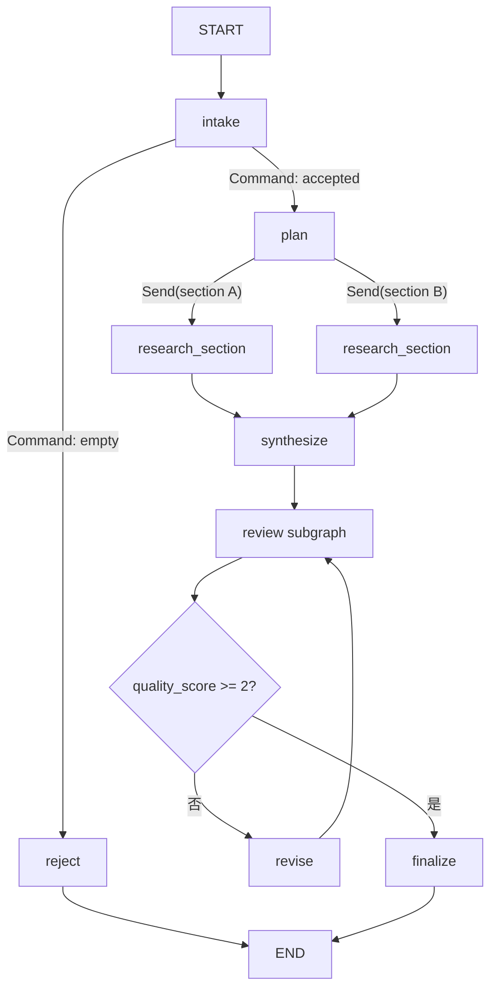

> **课程位置**：Graph 编排层第 2 章  
> **锁定环境**：Python 3.12 / LangGraph 1.2.x  
> **API 校准日期**：2026-07-13  
> **本章工件**：`mini_deerflow.graph.create_research_workflow()`

## 1. 系统快照：一个透明循环仍表达不了完整研究流程

第 07 章把模型—工具循环写成了透明 Graph。研究交付还需要拒绝空请求、动态拆分多个 section、并行汇总、隔离质量审查，以及不达标时返回修订。

这些规则不能全部交给模型自由发挥。本章用一个完全离线、确定性的研究工作流同时实现：

- 串行：intake → plan；
- 条件：空目标直接 reject；
- 并行：用 `Send` 为每个 section 创建任务；
- 子图：review 只看到草稿与评分字段；
- 循环：低分进入 revise，再次 review；
- 汇合：reducer 合并并行 findings 与 trace。

<!-- diagram:id=08-research-control-flow -->


**图的文本替代**：intake 用 Command 将空目标送往 reject、有效目标送往 plan；plan 根据 sections 动态 Send 多个 research_section 并行任务；结果经 reducer 汇合到 synthesize；review 子图评分，低分循环 revise，高分 finalize。

## 2. Conditional Edge、Command 与 Send 不应混用概念

### 2.1 条件边：只决定下一站

纯 router 根据 State 返回节点名，适合“读取现有事实后选择路径”。它不应写数据库或修改 State。

### 2.2 Command：更新状态并跳转

`Command` 的四类能力是：

- `update`：返回 State patch；
- `goto`：选择后继节点或 `Send`；
- `graph`：从子图导航到父图；
- `resume`：作为 Graph 输入恢复 interrupt，第 10 章使用。

当 intake 既要记录 `intake:reject`，又要直接去 reject 时，返回 `Command(update=..., goto=...)` 比“节点更新 + 另写一个重复条件函数”更内聚。为了让 Graph 可视化知道潜在目的地，返回类型应写成 `Command[Literal["plan", "reject"]]`。

### 2.3 Send：运行时才知道有多少条边

静态 edge 在 compile 前确定。`Send("research_section", {"section": item})` 则在运行时为每个 item 创建独立任务和不同输入，适合 map-reduce、批量评测和动态 delegation。

`Send` 不是“启动任意后台线程”的通用并发 API。任务仍属于同一 Graph superstep，最终更新由 State reducer 合并；外部服务并发数、deadline 和取消策略仍需显式治理。

## 3. 完整确定性工作流

事实源位于 `mini_deerflow.graph.research` 的 `tutorial:08-deterministic-research-workflow` region。

```python sync=ch08-research-workflow
from mini_deerflow.graph import create_research_workflow

research_graph = create_research_workflow()
research_result = research_graph.invoke(
    {
        "objective": "解释 LangGraph durable execution",
        "sections": ["checkpoint", "side-effect"],
    }
)

assert research_result["status"] == "completed"
assert research_result["revision_count"] == 1
assert research_result["quality_score"] == 2
assert {finding.section for finding in research_result["findings"]} == {
    "checkpoint",
    "side-effect",
}
rendered_research_trace = [event.as_text() for event in research_result["trace"]]
assert rendered_research_trace.count("review:score") == 2
assert rendered_research_trace[-1] == "finalize"
```

### 3.1 为什么 Finding 是领域类型

每个并行任务返回 `ResearchFinding(section, evidence)`，而不是格式为 `"section:evidence"` 的字符串。类型化对象能独立验证字段、稳定序列化，并让 synthesize 不需要拆字符串。

### 3.2 并行结果顺序不应决定语义

并行完成顺序可能变化。业务断言比较 section 集合；synthesize 在生成确定性草稿时显式按 section 排序。若你的业务必须保留计划顺序，应保存 sequence number 并按它归并，不应依赖 scheduler 恰好按提交顺序完成。

## 4. Command 的拒绝路径

空目标在 fan-out 前拒绝，并记录显式状态：

```python sync=ch08-command-route
rejected_result = create_research_workflow().invoke(
    {"objective": "   ", "sections": ["must-not-run"]}
)

assert rejected_result["status"] == "rejected"
assert [event.as_text() for event in rejected_result["trace"]] == ["intake:reject"]
assert rejected_result["findings"] == []
```

Reducer 字段即使未收到任务更新，也可能以单位元空列表出现在最终 State；因此“未执行 fan-out”的稳定断言是 findings 为空，而不是依赖 key 恰好不存在。

## 5. 观察 Send fan-out 的节点更新

```python sync=ch08-send-stream
send_updates = list(
    create_research_workflow().stream(
        {
            "objective": "比较 State 与 Store",
            "sections": ["state", "store", "checkpoint"],
        },
        stream_mode="updates",
    )
)
send_node_names = [next(iter(update)) for update in send_updates]

assert send_node_names.count("research_section") == 3
assert "synthesize" in send_node_names
assert send_node_names.count("review") == 2
```

同名 `research_section` 出现三次，表示一个节点定义被三个 `Send` task 复用；不是复制出三个永久节点。review 出现两次是质量循环，而不是两个不同的子图。

## 6. Subgraph：隔离局部状态与复用拓扑

review subgraph 使用自己的 `ReviewState`，只声明 `draft/revision_count/quality_score`。它不知道 objective、sections 和 findings，减少局部审查逻辑对父图的耦合。

```python sync=ch08-subgraph-xray
expanded_graph = create_research_workflow().get_graph(xray=True)
expanded_nodes = set(expanded_graph.nodes)

assert "review:score" in expanded_nodes
assert "research_section" in expanded_nodes
```

Subgraph 的三种常见状态关系：

1. 父子共享 key：compiled subgraph 可直接作为 node；
2. Schema 不同：父节点写 adapter，显式转换输入输出；
3. 子图需要跨调用记忆：必须决定它继承父 checkpointer 还是拥有独立 namespace/thread。

不要把 Subgraph 等同于 Subagent。Subgraph 是确定拓扑与状态边界；Subagent 往往拥有独立 Prompt、模型、工具与上下文裁剪，并由 Lead Agent 动态委派。下一任务会专门比较两者。

## 7. 失败实验：并行写入没有 reducer

两个并行节点在同一 superstep 写同一个普通字段时，LangGraph 会拒绝模糊合并。

```python sync=ch08-missing-reducer-failure
from typing import TypedDict
from langgraph.errors import InvalidUpdateError
from langgraph.graph import START, END, StateGraph

class BrokenParallelState(TypedDict):
    notes: list[str]

broken_builder = StateGraph(BrokenParallelState)
broken_builder.add_node("left", lambda state: {"notes": ["left"]})
broken_builder.add_node("right", lambda state: {"notes": ["right"]})
broken_builder.add_edge(START, "left")
broken_builder.add_edge(START, "right")
broken_builder.add_edge("left", END)
broken_builder.add_edge("right", END)
broken_graph = broken_builder.compile()

try:
    broken_graph.invoke({"notes": []})
except InvalidUpdateError as error:
    reducer_error = error
else:
    raise AssertionError("并行节点写同一普通字段必须触发 InvalidUpdateError")

assert "notes" in str(reducer_error)
```

修复不是随手加 `operator.add`，而是先定义业务合并规则：保留全部、按 ID 去重、last-write-wins、最大版本、还是冲突即失败。Fail closed 有时正是正确策略。

## 8. 循环的三个安全条件

显式循环至少需要：

- 可观察进度：本例 `revision_count`；
- 可判定终止：`quality_score >= 2`；
- 强制预算：recursion limit、deadline 或最大修订次数。

如果质量函数由同一个模型自由生成，模型可能永远声称“不够好”或始终自评满分。生产评审应结合确定性规则、独立 evaluator、预算与人工升级路径。

## 9. Functional API：retry、cache 与错误聚合

Graph node 可以接收 `Runtime[Context]`，读取第 05 章的 Runtime Context、Store 和 stream writer；这些依赖不应进入 State。Functional API 使用 `@entrypoint/@task` 为普通函数加入 durable execution，适合已有过程式代码；Graph API 更适合本章这种需要可视化拓扑与显式共享 State 的业务。

两者共享 LangGraph persistence runtime，不是两个互斥框架。课程以 Graph API 为主线，因为它更容易建立 Reducer、Command、Send 与 checkpoint 的结构直觉。

Mini DeerFlow 的小型 Functional flow 为 task 配置：仅对 `TimeoutError` 有限重试两次、成功结果缓存 300 秒、永久失败转换为类型化聚合结果。事实源位于 `tutorial:08-functional-research-flow` region。

```python sync=ch08-functional-policies
from mini_deerflow.graph import create_functional_research_flow

functional_flow = create_functional_research_flow()
functional_first = functional_flow.invoke(["stable", "flaky", "failed"])
functional_second = functional_flow.invoke(["stable", "flaky"])

assert [(item.topic, item.status) for item in functional_first] == [
    ("stable", "completed"),
    ("flaky", "completed"),
    ("failed", "failed"),
]
assert functional_first[2].error_type == "ValueError"
assert functional_flow.attempts_for("stable") == 1
assert functional_flow.attempts_for("flaky") == 2
assert functional_flow.attempts_for("failed") == 1
assert [item.status for item in functional_second] == ["completed", "completed"]
```

第二次调用没有增加 stable/flaky attempt，证明 task cache 生效。cache 只适合输入决定输出、TTL 内允许复用的读取任务；带副作用的 task 不能靠 cache 代替 idempotency。错误聚合也不是吞异常：结果保留 topic、失败状态和错误类型，调用方可以选择 partial result、升级或整体失败。

## 10. Mini DeerFlow 与 DeerFlow 对照

当前 DeerFlow 并没有把 Lead Agent 实现成固定 planner→researcher→reporter 图；它用 `create_agent` + middleware + task/subagent 动态工作。这个确定性研究图的价值是学习 Graph 原语，为阅读 reducer、并行工具、Command update 和恢复机制打基础。

| 本章 | DeerFlow 固定提交中的对应关系 |
|---|---|
| findings reducer | `agents/thread_state.py` 中并行安全的 State 字段 |
| Command update | `tool_search`、`task`、`view_image` 等工具返回 |
| Send map-reduce | 理解同一轮多个 tool/subagent task 的并发与汇总 |
| review subgraph | 对比 DeerFlow subagent-as-tool：控制权和上下文所有权不同 |
| stream updates | Gateway worker 转换 checkpoints/tasks/updates SSE |
| Functional task policy | 对照 task/subagent executor 的 retry、timeout、cache 与结果聚合边界 |

## 11. 练习与验收

### 练习 A

新增第三个 section，证明断言不依赖并行完成顺序。

### 练习 B

解释何时用 conditional edge，何时用 `Command(goto=...)`。给出一个不应使用 `Send` 的反例。

### 练习 C

为 research task 增加结构化失败结果。一个 task 失败时，选择 fail-fast、partial result 或 retry，并把策略写入 reducer，而不是在 synthesize 中吞掉异常。

### 延迟回忆题

合上讲义回答：Send 的输入为何可以不同于父 State？Subgraph 与 Subagent 的核心区别是什么？并行 reducer 为什么是领域规则？

```bash
TMPDIR="$PWD/.tmp" uv run --locked --group dev pytest -q \
  tests/test_mini_deerflow_graph_workflows.py
```

## 12. 资料

资料访问日期：2026-07-13。

- [LangGraph Graph API: Command and Send](https://docs.langchain.com/oss/python/langgraph/graph-api)
- [LangGraph Use Subgraphs](https://docs.langchain.com/oss/python/langgraph/use-subgraphs)
- [LangGraph Functional API](https://docs.langchain.com/oss/python/langgraph/use-functional-api)
- [DeerFlow ThreadState](https://github.com/bytedance/deer-flow/blob/main/backend/packages/harness/deerflow/agents/thread_state.py)

## 本章交付：研究拓扑已经完整，进程退出仍会清空现场

本章交付 Command、Send、Subgraph、Functional API 与并行汇总。研究请求可以动态 fan-out，结果按领域 reducer 汇合，局部失败不会静默覆盖其他结果。

但这些状态仍只活在当前进程。下一章会给同一研究 Graph 注入 Checkpointer，用真实 SQLite 关闭与重开实验验证跨进程恢复。

继续阅读：[第 09 章：让研究 Graph 跨进程恢复](/langchain-logbook/posts/09_multi_agent_eval/)。