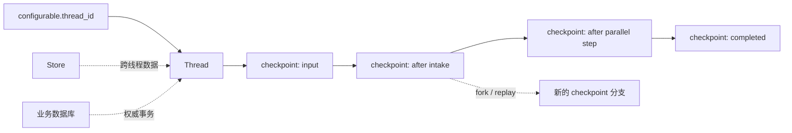

> **课程位置**：Graph 编排层第 3 章  
> **锁定环境**：Python 3.12 / LangGraph 1.2.x / langgraph-checkpoint-sqlite 3.x  
> **API 校准日期**：2026-07-13  
> **本章工件**：可注入 Checkpointer 的 `create_research_workflow()` 与真实 SQLite 恢复实验

## 1. 系统快照：研究 Graph 能并行运行，却不能跨进程继续

第 08 章已经能并行研究并汇总报告。进程在汇总前退出时，内存中的 findings、下一节点和任务都会消失；只保存聊天文本无法恢复执行现场。

Checkpoint 保存 Graph 每个 superstep 的 StateSnapshot：values、下一节点、任务、lineage 与 metadata。编译时注入 checkpointer 后，Graph 才能按 thread 恢复、查看历史、time travel，并为 interrupt 提供暂停点。

<!-- diagram:id=09-checkpoint-thread-lineage -->


**图的文本替代**：thread_id 选择一条 checkpoint lineage；每个 superstep 形成快照，过去快照可用于 replay 或 fork。Store 和业务数据库是独立持久化边界，不属于 checkpoint 链。

## 2. Checkpointer、Store 与产品数据库再次分清

| 组件 | 典型主键 | 保存什么 | 不保存什么 |
|---|---|---|---|
| Checkpointer | thread_id + checkpoint_id + namespace | Graph State、next、tasks、pending writes | 用户全局偏好、订单事务 |
| Store | namespace + key | 跨 thread 偏好、应用定义 memory | Graph 的每一步执行位置 |
| 业务数据库 | 订单、用户、artifact 等领域 ID | 权威事务、审计与产品状态 | 可直接恢复的 Graph 栈 |
| Run/Event repository | run_id、sequence | UI run 状态、SSE replay、usage | LangGraph checkpoint 协议本身 |

DeerFlow 同时拥有 checkpointer、Store、run/event repository，正因为这四种责任无法由“一张 memory 表”替代。

## 3. Thread 是恢复地址，不是用户身份

配置 checkpointer 后，调用至少需要稳定的：

```python
config = {"configurable": {"thread_id": "research-001"}}
```

`thread_id` 应由可信应用层创建和授权，不能让用户凭自然语言选择别人的 thread。一个用户可以有多个 thread；一个 thread 也不应自动等同于某个 authenticated user。多租户系统必须在 Gateway/repository 层检查 thread ownership。

```python sync=ch09-memory-checkpoints
from langgraph.checkpoint.memory import InMemorySaver
from mini_deerflow.graph import create_research_workflow

memory_graph = create_research_workflow(checkpointer=InMemorySaver())
memory_config = {"configurable": {"thread_id": "research-memory-001"}}
memory_graph.invoke(
    {"objective": "解释 checkpoint", "sections": ["state", "history"]},
    config=memory_config,
)
memory_snapshot = memory_graph.get_state(memory_config)

assert memory_snapshot.values["status"] == "completed"
assert memory_snapshot.values["objective"] == "解释 checkpoint"
assert memory_snapshot.next == ()
```

`InMemorySaver` 适合单元测试、Notebook 和语义实验；进程退出后数据消失，不能用它证明“重启恢复”。

## 4. 真实 SQLite：关闭连接再重新打开

官方 SQLite checkpointer 是独立包 `langgraph-checkpoint-sqlite`。同步应用使用 `SqliteSaver`；异步服务应使用 `AsyncSqliteSaver`，不要在 event loop 中调用同步 SQLite I/O。

```python sync=ch09-sqlite-restart
from pathlib import Path
import tempfile
from langgraph.checkpoint.sqlite import SqliteSaver

with tempfile.TemporaryDirectory() as sqlite_directory:
    checkpoint_path = Path(sqlite_directory) / "checkpoints.sqlite"
    sqlite_config = {"configurable": {"thread_id": "sqlite-restart-001"}}

    with SqliteSaver.from_conn_string(str(checkpoint_path)) as first_checkpointer:
        first_process_graph = create_research_workflow(checkpointer=first_checkpointer)
        first_process_graph.invoke(
            {
                "objective": "验证 SQLite 重启恢复",
                "sections": ["checkpoint", "thread"],
            },
            config=sqlite_config,
        )

    # 原连接已经关闭；新 saver + 新 compiled graph 模拟进程重启后的装配。
    with SqliteSaver.from_conn_string(str(checkpoint_path)) as reopened_checkpointer:
        restarted_process_graph = create_research_workflow(
            checkpointer=reopened_checkpointer
        )
        recovered_snapshot = restarted_process_graph.get_state(sqlite_config)

    assert recovered_snapshot.values["status"] == "completed"
    assert recovered_snapshot.values["objective"] == "验证 SQLite 重启恢复"
```

这里证明的是“文件后端跨 checkpointer/compiled graph 实例仍能读取状态”。生产进程重启还需要数据库可达、Schema 初始化、连接池生命周期、相同 Graph 代码/State 迁移策略和 Run Manager 的故障状态处理。

## 5. StateSnapshot 与历史

`get_state(config)` 返回当前快照；`get_state_history(config)` 沿 lineage 返回历史。关键字段：

- `values`：该 checkpoint 的 State；
- `next`：下一步节点；空元组表示完成；
- `tasks`：待执行任务、错误与 interrupts；
- `config`：包含 thread/checkpoint 标识，可作为 time travel 输入；
- `metadata`：step、source、writes 等运行信息。

```python sync=ch09-checkpoint-history
history_graph = create_research_workflow(checkpointer=InMemorySaver())
history_config = {"configurable": {"thread_id": "history-001"}}
history_graph.invoke(
    {"objective": "查看历史", "sections": ["one", "two"]},
    config=history_config,
)
history_snapshots = list(history_graph.get_state_history(history_config))
history_checkpoint_ids = {
    snapshot.config["configurable"]["checkpoint_id"]
    for snapshot in history_snapshots
}

assert len(history_snapshots) >= 6
assert len(history_checkpoint_ids) == len(history_snapshots)
assert history_snapshots[0].values["status"] == "completed"
```

不要依赖“倒数第 3 个 snapshot 一定是某节点”。拓扑、版本和并行度变化会改变历史长度。测试应按 `next`、metadata 或业务状态寻找目标 checkpoint。

## 6. Replay、Fork 与 Time Travel

从历史 `snapshot.config` 调用 `graph.invoke(None, config=...)`，LangGraph 会从对应 checkpoint 的 next tasks 继续执行，形成新的 lineage。它不是把数据库时钟倒转，也不会自动撤销已经发生的邮件、转账或文件发布。

```python sync=ch09-time-travel
before_finalize = next(
    snapshot
    for snapshot in history_graph.get_state_history(history_config)
    if snapshot.next == ("finalize",)
)
replayed_research = history_graph.invoke(None, config=before_finalize.config)

assert replayed_research["status"] == "completed"
assert replayed_research["trace"][-1].as_text() == "finalize"
```

本例 finalize 只更新 State，所以重放安全。只要节点触碰外部世界，就必须使用第 10 章的 idempotency key、outbox 或事务边界。

### 6.1 update_state 不是任意改数据库

`graph.update_state(config, values, as_node=...)` 通过 State reducer 创建新 checkpoint，并影响下一节点推断。它适合人工修正、调试和 fork；不应绕过业务授权，也不会同步修复外部数据库事实。

## 7. Durable Execution 的重放单位

LangGraph 在 superstep 边界提交 checkpoint。失败后通常从最近成功边界恢复：

- 已完成节点的 checkpoint/pending writes 可以复用；
- 失败节点可能重新执行；
- 包含 `interrupt()` 的节点恢复时从节点开头重新执行；
- task 内的外部调用是否重做，取决于任务边界和幂等设计。

因此节点设计应把非确定性和副作用隔离到明确边界。读取 API 可以重试；写 API 要带业务 idempotency key；“先扣款，再 checkpoint”如果中途崩溃，会产生最危险的模糊状态。

## 8. Checkpointer 后端选择

### InMemorySaver

- 适用：测试、Notebook、单进程短时 demo；
- 不适用：重启恢复、多 worker、长期 thread。

### SqliteSaver / AsyncSqliteSaver

- 适用：本地开发、单节点应用、课程真实持久化；
- 注意：同步/异步匹配、文件锁、备份、WAL 与单节点运维；
- 不应宣传为默认多 worker 生产方案。

### PostgresSaver / AsyncPostgresSaver

- 适用：生产数据库、并发 worker、连接池和集中备份；
- 需要独立安装 `langgraph-checkpoint-postgres`、执行 setup/migration、配置 pool 与加密；
- 课程不启动伪 Postgres 容器来制造“生产验证”假象。

### Agent Server

使用 LangGraph Agent Server 时，平台负责 checkpoint 基础设施；应用仍要设计 thread authorization、State schema、幂等副作用和版本迁移。

## 9. 序列化、安全与版本迁移

默认 serializer 支持常见 LangChain/LangGraph 对象和 Pydantic 类型，但不代表所有 Python 对象都适合持久化。避免把文件句柄、数据库连接、lambda、锁和 Secret 放进 State。`pickle_fallback` 增加兼容性也扩大反序列化风险，不能对不可信数据库内容随意启用。

生产 checkpoint 还要考虑：

- 静态加密与密钥轮换；
- State 字段新增、删除、改名的 migration；
- Graph 拓扑升级时旧 `next` 节点是否仍存在；
- retention / GDPR 删除；
- checkpoint 表与业务表的权限隔离。

## 10. State schema 演进：用旧 SQLite checkpoint 验证迁移

“新代码能启动”不等于旧 thread 能恢复。下面先用 v1 TypedDict 写入字符串 draft，关闭 saver，再用 v2 migration graph 从同一 thread 读取并把 draft 升级为 `DraftDocument`。v1 与 v2 必须保留相同 channel 名；如果旧图把整个状态保存在 `__root__`、新图改成多个 channel，就需要离线 checkpoint ETL，而不是普通节点迁移。

```python sync=ch09-state-migration
from langgraph.graph import END, START, StateGraph
from mini_deerflow.graph import (
    LegacyResearchStateV1,
    create_research_state_migration_graph,
)

with tempfile.TemporaryDirectory() as migration_directory:
    migration_path = Path(migration_directory) / "migration.sqlite"
    migration_config = {"configurable": {"thread_id": "legacy-research-001"}}

    with SqliteSaver.from_conn_string(str(migration_path)) as legacy_saver:
        legacy_builder = StateGraph(LegacyResearchStateV1)
        legacy_builder.add_node("save_v1", lambda state: state)
        legacy_builder.add_edge(START, "save_v1")
        legacy_builder.add_edge("save_v1", END)
        legacy_graph = legacy_builder.compile(checkpointer=legacy_saver)
        legacy_graph.invoke(
            {
                "schema_version": 1,
                "request_id": "legacy-research-001",
                "draft": "旧 checkpoint 中的 Markdown 草稿",
            },
            config=migration_config,
        )

    with SqliteSaver.from_conn_string(str(migration_path)) as migration_saver:
        migration_graph = create_research_state_migration_graph(
            checkpointer=migration_saver
        )
        migrated_state = migration_graph.invoke({}, config=migration_config)

    assert migrated_state["schema_version"] == 2
    assert migrated_state["draft"].content == "旧 checkpoint 中的 Markdown 草稿"
    assert migrated_state["draft"].media_type == "text/markdown"
    assert migrated_state["migration_status"] == "migrated"
```

生产迁移还要记录兼容窗口、回滚路径、旧 Graph 版本与迁移批次，并先在 checkpoint 副本验证。迁移节点不应顺便调用模型重写历史内容。

## 11. 失败实验：缺少 thread_id

```python sync=ch09-thread-id-failure
missing_thread_graph = create_research_workflow(checkpointer=InMemorySaver())
try:
    missing_thread_graph.invoke(
        {"objective": "没有恢复地址", "sections": ["x"]}
    )
except ValueError as error:
    missing_thread_error = error
else:
    raise AssertionError("配置 checkpointer 后缺少 thread_id 必须失败")

assert "thread_id" in str(missing_thread_error)
```

框架拒绝没有 thread ID 的调用是正确的 fail-closed 行为。不要通过每次随机生成且不返回给调用方的 ID 来“修复”，那会让数据存在却永远不可恢复。

## 12. DeerFlow 对照阅读

固定提交：`2bd0f56a0f5a418d126cb4a18e23001f54ccf024`。

| 本章概念 | DeerFlow 入口 | 重点 |
|---|---|---|
| checkpointer factory | `runtime/checkpointer/async_provider.py` | memory/SQLite/Postgres 如何按配置选择 |
| Store factory | `runtime/store/async_provider.py` | 为什么 Store 不等于 checkpoint |
| runtime bootstrap | `app/gateway/deps.py` | 启动/关闭顺序如何保护 in-flight writes |
| run worker | `runtime/runs/worker.py` | pre-run checkpoint、stream、flush、状态同步 |
| Run/Event repository | Gateway repositories | 为什么 UI replay 数据不替代 Graph checkpoint |

DeerFlow SQLite 模式可把 checkpointer 与应用表放在同一数据库文件，但它们仍是不同 schema/责任；“同一个文件”不等于“同一个抽象”。

## 13. 练习与验收

### 练习 A

为两个 thread 分别运行 research graph，证明 checkpoint history 不串线。

### 练习 B

解释“SQLite 文件存在”为什么不足以证明生产级 durable execution。

### 练习 C

把 v1→v2 迁移扩展为批处理 dry-run：统计可迁移、已是 v2 和损坏的 thread，但 dry-run 不创建新 checkpoint。

### 延迟回忆题

合上讲义回答：thread_id 与 user_id 有何不同？replay 会自动撤销外部副作用吗？Store 与 checkpointer 的主键分别是什么？

```bash
TMPDIR="$PWD/.tmp" uv run --locked --group dev pytest -q \
  tests/test_mini_deerflow_graph_workflows.py \
  tests/test_mini_deerflow_persistence_hitl.py
```

## 14. 资料

资料访问日期：2026-07-13。

- [LangGraph Persistence](https://docs.langchain.com/oss/python/langgraph/persistence)
- [LangGraph Durable Execution](https://docs.langchain.com/oss/python/langgraph/durable-execution)
- [LangGraph Time Travel](https://docs.langchain.com/oss/python/langgraph/use-time-travel)
- [DeerFlow Checkpointer Runtime](https://github.com/bytedance/deer-flow/tree/main/backend/packages/harness/deerflow/runtime/checkpointer)

## 本章交付：执行现场可以恢复，但高风险动作仍会直接发生

本章交付 SQLite Checkpointer/Store、跨应用恢复和状态迁移边界。实验真正关闭并重新打开连接，避免用同一个内存对象伪装服务重启。

恢复能力让长任务可以等待外部事件。下一章会在正式发布前产生 durable interrupt，并处理 resume 重放可能造成的重复副作用。

继续阅读：[第 10 章：加入持久审批与副作用边界](/langchain-logbook/posts/10_human_in_the_loop/)。