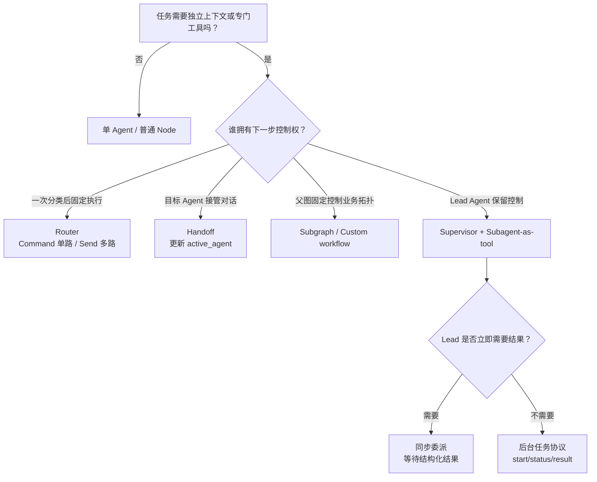
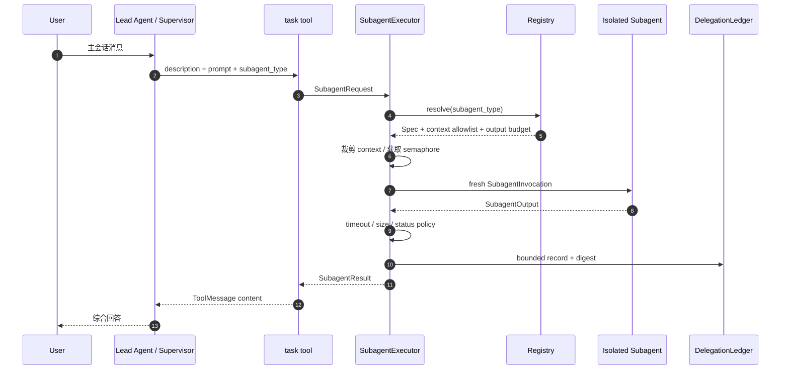
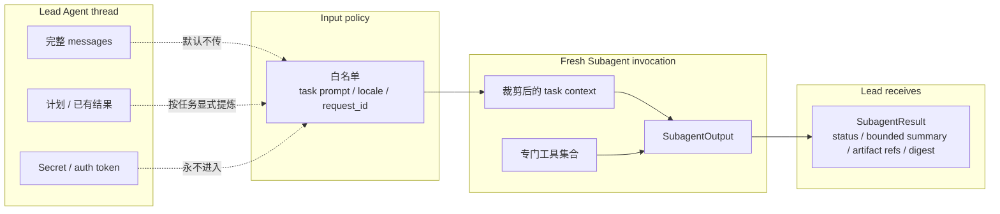
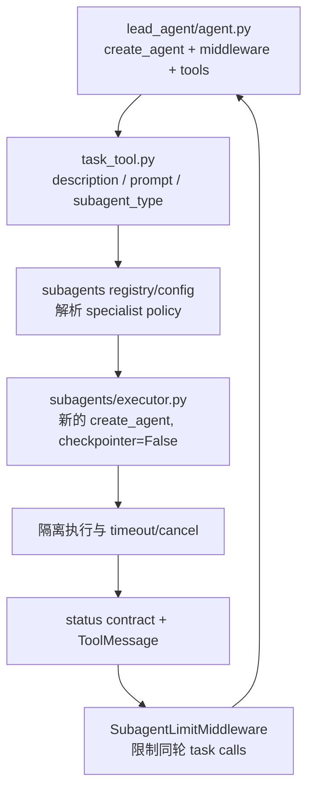

> **课程位置**：Agent Harness 层第 1 章  
> **锁定环境**：Python 3.12 / LangChain 1.3.x / LangGraph 1.2.x  
> **API 校准日期**：2026-07-13  
> **本章工件**：`SubagentRegistry`、`SubagentExecutor`、`task` tool 与 `DelegationLedger`

## 1. 系统快照：流程已经可靠，Lead 的上下文却不断膨胀

第 10 章解决了单个工作流如何暂停、恢复和保护副作用，但它没有解决一个更长任务的上下文预算问题。假设 Lead Agent 同时需要研究 LangGraph 文档、检查 Python 接口并最终写出报告：把所有检索片段、代码输出、工具轨迹和中间推理都塞进主消息历史，会让后续综合越来越昂贵，也更容易被无关上下文干扰。

“再画两个节点”并不会自动解决这个问题。判断系统是否真的形成多个 Agent，至少要回答四个问题：

1. 谁拥有下一步控制权？
2. 谁保存与用户的连续会话？
3. specialist 看见哪些输入，能用哪些工具？
4. specialist 的失败和大输出以什么契约返回？

本章建立一条可验证的委派边界：Lead Agent 通过单一 `task` 工具选择 specialist；执行器创建新的输入上下文并限制并发与时间；specialist 只返回结构化结果；Lead 保留主会话和最终控制权。

### 学习目标

完成本章后，你能够：

- 根据控制权、状态所有权和并发需求选择 Router、Handoff、Subgraph 或 Subagent-as-tool；
- 用 `Command` 实现单路由，用 `Send` 实现并行 fan-out/fan-in；
- 设计 subagent registry、输入白名单、输出预算和 delegation ledger；
- 证明两个 specialist 不会获得主消息历史或 Secret；
- 把 timeout、部分失败、未知类型和输出过大转成 Lead Agent 可穷尽处理的结果；
- 沿着 `Lead Agent → task tool → SubagentExecutor` 阅读当前 DeerFlow。

### 前置工件检查

```bash
uv run --locked pytest -q \
  tests/test_mini_deerflow_graph_workflows.py \
  tests/test_mini_deerflow_persistence_hitl.py
```

这条命令确认第 08–10 章的 `Command`、`Send`、Subgraph、Checkpoint 和 HITL 仍然可用。本章会复用它们，但改变的是“上下文与控制权的所有者”，不是再发明一种 Graph 语法。

## 2. 先用控制权选择模式

下图回答：一个任务出现专业分工时，应该先选择哪种协作模式？

<!-- diagram:id=11-multi-agent-decision-tree -->


**读图顺序**：先判断是否真的需要隔离，再判断下一步控制权，最后判断 Lead Agent 是否必须等待结果。

**图的文本替代**：无需独立上下文时保留单 Agent；一次分类选择 Router；目标 Agent 接管对话选择 Handoff；固定业务拓扑选择 Subgraph；Lead Agent 保持主会话并动态委派时选择 Subagent-as-tool。同步/后台描述业务等待关系，不等同于 Python 的 `async/await`。

### 2.1 五种模式的精确边界

| 模式 | 控制权 | 会话状态所有者 | 最适用 | 典型反例 |
|---|---|---|---|---|
| Router | 分类器派发后进入选中分支 | 通常无持续会话，或由外层管理 | 输入类别清晰、一次请求可独立处理 | 多轮中根据新证据反复决定下一动作 |
| Handoff | 被移交的 Agent 接管后续步骤 | 共享或显式迁移的会话状态 | 客服、分阶段流程、专业角色直接面对用户 | Lead 必须统一审阅所有结果后再回答 |
| Supervisor | 中央 Agent 持续决定调用哪个 specialist | Supervisor/Lead 保存主会话 | 动态多步协调、需要跨轮综合 | 只有一次静态分类，却额外引入完整 Agent 循环 |
| Subgraph | 父 Graph 拥有静态拓扑 | 由父子 state schema/checkpointer 决定 | 可视化业务子流程、需要检查嵌套 state | 只是想释放主模型上下文，却把所有消息原样共享 |
| Subagent-as-tool | Lead Agent 调工具后拿回结果 | Lead 保存主会话；subagent 默认临时 | 隔离上下文、专业工具、动态委派 | specialist 必须长期直接与用户保持独立会话 |

这里的 Supervisor 是一种架构角色，不要求使用名为 `Supervisor` 的包。当前 LangChain 官方文档把“主 Agent 将 subagent 作为工具调用”作为主线，并说明旧的 `langgraph-supervisor` package 已不再积极维护。课程因此实现稳定的 `task` seam，而不依赖一个额外的 Supervisor 框架。

### 2.2 “同步”和“后台”不是 Python 语法分类

如果 Lead Agent 下一步必须使用 specialist 的结果，业务语义是同步委派，即使底层使用 `asyncio` 并行执行多个调用。如果 Lead Agent 启动任务后可以继续与用户交互，业务语义是后台任务，此时需要 `start → status → result/cancel` 协议、持久化任务状态和完成通知。

本章的 Mini DeerFlow 选择前者：`task` 等待一个有界结果返回。当前 DeerFlow 会在后端启动 background execution、轮询终态并流出 task 生命周期事件；对模型而言仍表现为一次最终返回的工具调用。产品长任务与 SSE 见 Runtime/Gateway 专题。

## 3. 四个可运行的控制流对照

这些最小实验全部确定性运行，不调用真实模型。事实源位于 `mini_deerflow.subagents.patterns`。

### 3.1 Router：用 `Command` 选择一个 specialist

Router 的职责是分类，不是持续对话。下面的 router 根据输入选择 research 或 coding，只执行一条分支。

```python sync=ch11-command-router
from mini_deerflow.subagents import build_single_router_graph

single_router = build_single_router_graph()
single_route_result = single_router.invoke({"query": "研究 LangGraph checkpoint"})

assert single_route_result["route"] == "research"
assert single_route_result["trace"] == ["router:research", "research"]
assert single_route_result["answer"] == "research specialist result"
```

这里用节点返回 `Command(goto=..., update=...)`，因为路由决策和 state 更新属于同一个原子结果。如果 route 只依赖静态 state，也可以使用 conditional edge；选择标准是哪个表示更清楚，而不是哪个 API 更高级。

### 3.2 Router：用 `Send` 并行选择多个 specialist

一个请求可能同时需要研究和代码分析。`Send` 为每个 worker 创建独立输入，`results` reducer 再合并结构化结果。

```python sync=ch11-send-router
from mini_deerflow.subagents import build_parallel_router_graph

parallel_router = build_parallel_router_graph()
parallel_route_result = parallel_router.invoke(
    {
        "query": "比较研究结论与 Python 实现",
        "routes": ["research", "coding"],
    }
)

assert sorted(item.agent_name for item in parallel_route_result["results"]) == [
    "coding",
    "research",
]
assert parallel_route_result["answer"] == "coding+research"
```

`Send` 解决 Graph superstep 的 fan-out/fan-in；它本身不保证 specialist 有独立模型上下文。是否传完整 `messages` 仍由 Send payload 和 worker 实现决定。因此“并行节点”与“上下文隔离 subagent”是两个不同维度。

### 3.3 Handoff：目标 Agent 接管下一步

Handoff 的关键不是“调用了另一个函数”，而是 state 中的 active owner 改变，后续用户输入应继续交给该 owner，直到再次 handoff。

```python sync=ch11-handoff
from langgraph.checkpoint.memory import InMemorySaver
from mini_deerflow.subagents import build_handoff_graph

handoff_graph = build_handoff_graph(checkpointer=InMemorySaver())
handoff_config = {"configurable": {"thread_id": "handoff-lesson"}}
first_handoff = handoff_graph.invoke(
    {"request": "请修复 Python 类型错误"},
    config=handoff_config,
)
handoff_result = handoff_graph.invoke(
    {"request": "继续解释这个修复"},
    config=handoff_config,
)

assert first_handoff["active_agent"] == "coding"
assert handoff_result["active_agent"] == "coding"
assert handoff_result["trace"] == [
    "triage->coding",
    "coding:answered",
    "coding:answered",
]
```

第二次 invoke 没有重新执行 triage，证明 `active_agent` 已通过 checkpoint 成为下一轮 owner，而不是换了名称的单次 Router。真实消息型 Handoff 还必须保持合法消息序列：带 tool call 的 `AIMessage` 后要有匹配 `tool_call_id` 的 `ToolMessage`。如果只更新 `active_agent` 却留下悬空 tool call，一些严格校验消息协议的供应商会在下一轮拒绝请求。

### 3.4 Subgraph：共享 state 不是上下文隔离

Subgraph 适合把一段确定性或 Agentic 流程封装为父图节点。下面父子图共享 `query/notes` schema，但 wrapper 只把 child 新增的 notes 写回父 reducer。

```python sync=ch11-subgraph-boundary
from mini_deerflow.subagents import build_shared_subgraph_graph

shared_subgraph = build_shared_subgraph_graph()
subgraph_result = shared_subgraph.invoke(
    {"query": "解释 reducer", "notes": ["parent"]}
)

assert subgraph_result["notes"] == ["parent", "subgraph:解释 reducer"]
```

失败边界很容易忽略：child 的最终 state 已经包含输入 `notes`。若父节点把整份 child state 再交给父 reducer，`parent` 会被追加两次。本章的 wrapper 计算 child 增量后再返回。这个例子说明 Subgraph 的 state 传播和 Subagent 的结果返回都需要显式契约。

## 4. 工程实现：Lead Agent 通过 `task` 委派

Mini DeerFlow 新增以下模块：

| 模块 | 公共 seam | 责任 |
|---|---|---|
| `subagents/contracts.py` | `SubagentRequest/Invocation/Output/Spec` | 固定委派输入、handler 和输出契约 |
| `subagents/registry.py` | `SubagentRegistry` | 能力发现、稳定名称解析、拒绝重复注册 |
| `subagents/executor.py` | `SubagentExecutor` | 上下文裁剪、Semaphore、timeout、结果封装 |
| `subagents/executor.py` | `DelegationLedger` | 保存有界摘要、状态、digest 和实际 context keys |
| `subagents/task_tool.py` | `build_task_tool()` | 把 executor 包装为 Lead Agent 可调用的单一工具 |
| `subagents/builtins.py` | `build_demo_subagent_registry()` | 提供离线 research/coding specialist |

### 4.1 委派运行时

<!-- diagram:id=11-task-delegation-sequence -->


**图的文本替代**：用户消息只进入 Lead Agent；Lead 通过 task 提交简短任务；Executor 从 Registry 取得 policy，裁剪上下文并受控执行全新 Subagent；结果经过 timeout、大小和状态策略，ledger 只记录有界摘要；Lead 最终综合，而不是把 Subagent 的完整轨迹复制进主会话。

### 4.2 两个隔离 specialist

research 和 coding 都是真正由 `create_agent(..., checkpointer=False)` 创建的临时 Agent：research 只绑定 `lookup_evidence`，coding 只绑定 `inspect_interface`。模型响应仍使用离线 scripted fake，以便基础 CI 验证 Agent loop、专门工具和无历史调用，而不把供应商随机性当成正确性证据。

```python sync=ch11-isolated-specialists
import asyncio
from mini_deerflow.subagents import (
    SubagentExecutor,
    SubagentRequest,
    build_demo_subagent_registry,
)

demo_registry = build_demo_subagent_registry()
demo_executor = SubagentExecutor(demo_registry, max_concurrency=2)

async def run_demo_specialists():
    return await demo_executor.dispatch_many(
        [
            SubagentRequest(
                task_id="lesson-research",
                agent_name="research",
                description="研究 reducer",
                prompt="解释并行 reducer 的边界",
            ),
            SubagentRequest(
                task_id="lesson-coding",
                agent_name="coding",
                description="设计 reducer 测试",
                prompt="给出防止重复合并的测试建议",
            ),
        ],
        parent_context={
            "locale": "zh-CN",
            "messages": ["完整主会话不应进入 specialist"],
            "auth_token": "demo-secret-must-not-leak",
        },
    )

demo_results = asyncio.run(run_demo_specialists())
assert [result.status for result in demo_results] == ["completed", "completed"]
assert demo_results[0].summary.startswith("研究摘要")
assert demo_results[1].summary.startswith("代码建议")
assert all("demo-secret" not in result.model_dump_json() for result in demo_results)
```

### 4.3 单一 `task` 工具

一个 agent 一个 tool 的方式能做更细的 schema 定制；单一 dispatch tool 更适合可扩展 registry。Mini DeerFlow 采用与 DeerFlow 相近的 `description + prompt + subagent_type`，额外加入 `task_id` 让测试、ledger 和未来事件流有稳定关联键。

```python sync=ch11-task-tool
import json
from mini_deerflow.schemas import SubagentResult
from mini_deerflow.subagents import build_task_tool

task_tool = build_task_tool(
    demo_executor,
)
assert task_tool.metadata["max_concurrency"] == 2
assert "runtime" not in task_tool.args
```

`runtime` 不出现在模型可见 schema 中。工具真正执行时，LangGraph `ToolNode` 注入本次调用的 `ToolRuntime`；`task` 再通过 `safe_context_view()` 生成 input policy 的候选值。这样同一个 compiled Lead Agent 被不同用户复用时，不会继续使用工具构建时捕获的旧 Context。

### 4.4 把 `task` 真正装入 Lead Agent

Supervisor 不是静态 router。Lead Agent 保留用户消息，在模型决定需要委派时调用 `task`，收到 `ToolMessage` 后继续 model loop 并综合结果。

```python sync=ch11-lead-agent-supervisor
from langchain_core.messages import AIMessage, ToolMessage
from mini_deerflow.agents import create_lead_agent
from mini_deerflow.config import LeadAgentContext
from mini_deerflow.models import create_offline_model

supervisor_model = create_offline_model(
    [
        AIMessage(
            content="",
            tool_calls=[
                {
                    "name": "task",
                    "args": {
                        "task_id": "lead-delegation-001",
                        "description": "研究 checkpoint",
                        "prompt": "只返回三条恢复原则",
                        "subagent_type": "research",
                    },
                    "id": "lead-tool-call-001",
                    "type": "tool_call",
                }
            ],
        ),
        AIMessage(content="Lead Agent 已审阅并汇总 specialist 结果。"),
    ]
)
supervisor = create_lead_agent(model=supervisor_model, tools=[task_tool])
supervisor_state = asyncio.run(
    supervisor.ainvoke(
        {"messages": [{"role": "user", "content": "解释 checkpoint 恢复"}]},
        context=LeadAgentContext(
            user_id="lesson-user",
            workspace_root="/tmp/lesson-workspace",
            auth_token="never-forward",
        ),
    )
)

delegation_message = next(
    message for message in supervisor_state["messages"] if isinstance(message, ToolMessage)
)
delegation_result = SubagentResult.model_validate_json(delegation_message.content)
assert delegation_result.status == "completed"
assert delegation_result.agent_name == "research"
assert supervisor_state["messages"][-1].content.startswith("Lead Agent 已审阅")
```

这段实验使用 fake model 固定工具轨迹，因此测试的是 Agent loop 与 task seam，而不是模型是否“碰巧愿意委派”。真实模型只应进入可选 integration/eval，不能成为基础 CI 的随机依赖。

## 5. 上下文隔离不是“完全不给上下文”

Subagent 必须得到完成任务所需的信息，但不能默认继承所有信息。正确问题不是“传还是不传”，而是逐字段回答“为什么需要、由谁授权、生命周期多长”。

<!-- diagram:id=11-context-isolation-boundary -->


**图的文本替代**：Lead thread 保留完整消息、计划和 Secret；input policy 默认只允许任务 Prompt、locale、request ID 等字段，历史只能显式提炼后传递，Secret 永不进入；Subagent 使用专门工具产生输出，Lead 只收到结构化、有界结果。

### 5.1 失败实验：完整转发造成上下文污染

#### 1. 错误版本

最常见错误是为了“让 specialist 知道背景”直接复制整个父 Context：

```python
unsafe_child_context = dict(parent_context)
```

#### 2. 可观察现象

`messages`、`internal_notes`、`client_secret/openai_api_key/auth_token` 会与真正任务一起进入子模型、trace 或异常。调用仍可能成功，因此这是静默的数据边界错误。

#### 3. 先做预测

运行前先写下：如果只在日志里隐藏 token，但仍把父字典传给 subagent，哪一个边界真正阻止了泄漏？答案应当是“没有”；日志脱敏不会改变模型输入。

#### 4. 根因路径

父 Runtime Context → 无白名单复制 → fresh invocation 实际并不干净 → 子模型/工具可读取无关消息和 Secret → 输出或异常再次进入 Lead/ledger。

#### 5. 修复与防回归

下面先用断言稳定复现错误，再通过 `SubagentSpec.allowed_context_fields` 执行同一任务。policy 使用 Secret 字段名 guardrail，`client_secret`、`openai_api_key` 等别名同样不能加入 allowlist。

```python sync=ch11-context-pollution-failure
from mini_deerflow.subagents import (
    SubagentInvocation,
    SubagentOutput,
    SubagentRegistry,
    SubagentSpec,
)

polluted_parent_context = {
    "user_id": "learner-11",
    "locale": "zh-CN",
    "messages": ["无关的长主会话"],
    "internal_notes": "Lead 私有草稿",
    "auth_token": "leaked-by-unsafe-copy",
}
unsafe_child_context = dict(polluted_parent_context)
assert "messages" in unsafe_child_context
assert unsafe_child_context["auth_token"] == "leaked-by-unsafe-copy"

observed_contexts = []

async def inspect_context(invocation: SubagentInvocation) -> SubagentOutput:
    observed_contexts.append(invocation.context)
    return SubagentOutput(summary="context inspected")

for secret_alias in (
    "client_secret",
    "openai_api_key",
    "auth_token",
    "access_token",
    "refresh_token",
):
    try:
        SubagentSpec(
            name="unsafe",
            description="错误输入策略",
            handler=inspect_context,
            allowed_context_fields=frozenset({secret_alias}),
        )
    except ValueError as secret_policy_error:
        assert "secret 字段" in str(secret_policy_error)
    else:
        raise AssertionError(f"{secret_alias} 不应进入 allowlist")

isolated_registry = SubagentRegistry(
    [
        SubagentSpec(
            name="inspector",
            description="检查输入边界",
            handler=inspect_context,
            allowed_context_fields=frozenset({"user_id", "locale"}),
        )
    ]
)
isolated_executor = SubagentExecutor(isolated_registry)
isolated_result = asyncio.run(
    isolated_executor.dispatch(
        SubagentRequest(
            task_id="context-001",
            agent_name="inspector",
            description="验证输入边界",
            prompt="只报告允许字段",
        ),
        parent_context=polluted_parent_context,
    )
)

assert isolated_result.status == "completed"
assert observed_contexts == [{"user_id": "learner-11", "locale": "zh-CN"}]
assert "leaked-by-unsafe-copy" not in isolated_result.model_dump_json()
```

`auth_token` 不只是默认排除；`SubagentSpec` 还拒绝把 secret-shaped 字段加入 allowlist。隐藏 `repr` 或 prompt 不代表完成授权，真正的工具仍应在服务边界检查身份和权限。

## 6. 并发、超时和部分失败必须是协议

### 6.1 Semaphore 控制的是实际执行数

只在 Prompt 里写“最多并行两个”不是护栏。模型可能同一轮产生更多 tool calls，应用也可能从其他入口调用 executor。Mini DeerFlow 在 executor 内部使用 `asyncio.Semaphore`，所以限制位于不可绕过的执行 seam。

```python sync=ch11-concurrency-limit
from mini_deerflow.subagents import (
    SubagentInvocation,
    SubagentOutput,
    SubagentRegistry,
    SubagentSpec,
)

concurrency = {"active": 0, "peak": 0}

async def measured_worker(invocation: SubagentInvocation) -> SubagentOutput:
    concurrency["active"] += 1
    concurrency["peak"] = max(concurrency["peak"], concurrency["active"])
    await asyncio.sleep(0.01)
    concurrency["active"] -= 1
    return SubagentOutput(summary=f"done:{invocation.prompt}")

measured_executor = SubagentExecutor(
    SubagentRegistry(
        [SubagentSpec(name="worker", description="测量并发", handler=measured_worker)]
    ),
    max_concurrency=2,
)
measured_requests = [
    SubagentRequest(
        task_id=f"concurrency-{index}",
        agent_name="worker",
        description="并发实验",
        prompt=str(index),
    )
    for index in range(4)
]
measured_results = asyncio.run(measured_executor.dispatch_many(measured_requests))

assert concurrency["peak"] == 2
assert all(result.status == "completed" for result in measured_results)
```

Semaphore 不等于生产资源隔离。若 handler 内有阻塞式 CPU、宿主 shell 或无法取消的第三方请求，event-loop timeout 不能强杀它；真正不可信或长时间运行的任务需要进程/容器、provider timeout、取消协议和资源限制。[Sandbox 与扩展专题](/langchain-logbook/posts/sandbox_extensions/) 已把文件能力移入 provider abstraction，同时明确本地工作区仍不是容器级隔离。

### 6.2 失败实验：timeout 与部分失败

#### 1. 错误版本

错误实现直接 `await asyncio.gather(*handlers)` 并让异常向外传播；一个 worker 抛错时，调用方只看到 exception，已成功结果没有稳定业务形状。另一个错误是完全不设 deadline，让 Lead Agent 无限等待。

#### 2. 可观察现象

同一批任务中 success、exception、timeout 同时存在；若没有 failure boundary，Lead 无法判断哪些证据可用，也无法区分供应商失败和预算耗尽。

#### 3. 先做预测

预测下面三个请求的状态顺序，并说明为什么 timeout 不应被改写成普通 `failed`。

#### 4. 根因路径

批量请求 → handler 各自执行 → exception/超时越过未定义边界 → gather 提前失败或长期等待 → synthesis 丢失部分证据。

#### 5. 修复与防回归

`dispatch_many()` 保持请求顺序；每个 `dispatch()` 单独使用 timeout，并把 exception 类型、timeout 和成功结果转成 `SubagentResult`。异常原文不会写入 ledger，防止 provider error 携带敏感输入。

```python sync=ch11-timeout-partial-failure
async def sometimes_fails(invocation: SubagentInvocation) -> SubagentOutput:
    if invocation.prompt == "timeout":
        await asyncio.sleep(0.05)
    if invocation.prompt == "failure":
        raise RuntimeError("offline source unavailable")
    return SubagentOutput(summary=f"ok:{invocation.prompt}")

failure_executor = SubagentExecutor(
    SubagentRegistry(
        [
            SubagentSpec(
                name="unstable",
                description="故障注入 specialist",
                handler=sometimes_fails,
            )
        ]
    ),
    max_concurrency=2,
    timeout_seconds=0.01,
)
failure_results = asyncio.run(
    failure_executor.dispatch_many(
        [
            SubagentRequest(
                task_id=f"failure-{index}",
                agent_name="unstable",
                description="故障实验",
                prompt=value,
            )
            for index, value in enumerate(["success", "failure", "timeout"])
        ]
    )
)

assert [result.status for result in failure_results] == [
    "completed",
    "failed",
    "timed_out",
]
assert failure_results[1].error == "RuntimeError: subagent handler failed"
assert "执行预算" in (failure_results[2].error or "")
```

Lead Agent 的综合策略必须显式区分：

- `completed`：可以进入 synthesis；
- `failed`：决定降级、重试或向用户声明证据缺口；
- `timed_out`：通常不能盲目立即重试，应先检查预算、后端负载和任务粒度；
- `rejected`：输入或 policy 不允许，不能通过重试绕过；
- `output_too_large`：已有结果但不应直接注入模型上下文，需要压缩或 artifact 化。

### 6.3 失败实验：输出过大

#### 1. 错误版本

错误实现把 `SubagentOutput.summary` 和全部 `artifacts` 直接序列化进 ToolMessage。即使 summary 很短，数千个 ArtifactRef 也能让消息和 checkpoint 无界膨胀。

#### 2. 可观察现象

Lead Agent 的下一次 model input 突然变大；checkpoint、trace 与 ledger 重复保存同一批数据；最终可能超过 provider context window，而不是得到明确业务状态。

#### 3. 先做预测

如果 summary 有 160 个字符、artifact 有 5 个，而 policy 分别只允许 32 个字符和 2 个引用，哪些字段可以保留？完整内容还能否仅靠 digest 恢复？

#### 4. 根因路径

Subagent 原始输出 → 缺少 result budget → ToolMessage 无界增长 → Lead history/checkpoint/trace 重复放大 → 后续综合失败。

#### 5. 修复与防回归

Executor 同时限制 summary 字符数和 ArtifactRef 数量，返回 `output_too_large + bounded preview + SHA-256`。只对 Python 字符串和引用计数做限制不是最终 artifact 系统，但先建立了“大输出不能直接进入 Lead history”的不变量。

```python sync=ch11-output-budget-failure
from mini_deerflow.schemas import ArtifactRef

async def verbose_worker(_: SubagentInvocation) -> SubagentOutput:
    return SubagentOutput(
        summary="证据" * 80,
        artifacts=[
            ArtifactRef(path=f"reports/{index}.md", media_type="text/markdown")
            for index in range(5)
        ],
    )

bounded_executor = SubagentExecutor(
    SubagentRegistry(
        [
            SubagentSpec(
                name="verbose",
                description="产生大输出",
                handler=verbose_worker,
                max_output_chars=32,
                max_artifacts=2,
            )
        ]
    )
)
bounded_result = asyncio.run(
    bounded_executor.dispatch(
        SubagentRequest(
            task_id="large-output-001",
            agent_name="verbose",
            description="验证输出预算",
            prompt="返回大量证据",
        )
    )
)

assert bounded_result.status == "output_too_large"
assert bounded_result.truncated is True
assert len(bounded_result.summary) == 32
assert bounded_result.output_chars == 160
assert len(bounded_result.output_sha256 or "") == 64
assert len(bounded_result.artifacts) == 2
```

digest 只能证明两次观察到的完整文本是否相同，不能恢复原文，也不是数字签名。后续 Sandbox 专题已把完整大输出写入受控 workspace，返回 `ArtifactRef + bounded summary + digest`；Lead Agent 再按需读取，而不是把所有内容留在消息里。

## 7. Delegation Ledger 记录什么，不记录什么

Ledger 是应用定义的委派审计边界，不是 Graph Checkpointer、LangGraph Store 或模型消息历史的别名。

| 数据 | 是否记录 | 原因 |
|---|---:|---|
| task ID、agent name、status/error code | 是 | 关联一次委派及其终态，不复制异常原文 |
| 实际传入的 context key 名 | 是 | 证明 input policy 是否生效 |
| 有界 summary preview | 是 | 支持调试，不无限膨胀 |
| output chars 与 SHA-256 | 是 | 判断大小与结果身份 |
| 完整主 messages | 否 | 会破坏隔离并重复存储 |
| auth token / Secret | 否 | 不属于可持久化业务事实 |
| specialist 完整推理轨迹 | 默认否 | 成本高、敏感、供应商形状不稳定 |

```python sync=ch11-delegation-ledger-event
ledger_records = demo_executor.ledger.list_records()

assert len(ledger_records) >= 3
latest_record = ledger_records[-1]
assert latest_record.status == "completed"
assert latest_record.context_keys == ("locale", "request_id")
assert len(latest_record.output_sha256 or "") == 64
assert "never-forward" not in latest_record.model_dump_json()
print(latest_record.model_dump())
```

当前 `DelegationLedger` 是线程安全的进程内教学实现。生产应用应把它替换为 repository，并定义 retention、tenant ownership、PII policy 和事务边界。不要为了“有审计”就把所有 Prompt 与输出永久保存。

## 8. 为什么 DeerFlow 使用 Lead Agent + task/subagent

本章校准的 DeerFlow 源码固定在提交 `216309426fc6f954689ebee138af117029e43f8b`。阅读顺序如下：

<!-- diagram:id=11-deerflow-subagent-reading-path -->


**图的文本替代**：从 Lead Agent factory 看到 task 被装入工具集合；task tool 解析 subagent 类型和运行上下文；executor 创建 checkpointer=False 的临时 Agent 并执行 timeout/cancel；最终状态进入 ToolMessage；SubagentLimitMiddleware 在 model 后限制同轮并行委派数量。

### 8.1 它不是静态翻译小组

当前 DeerFlow 的 Lead Agent 是一个长期会话中的中央协调者。模型可在需要时调用 `task(description, prompt, subagent_type)`；每个 subagent 有自己的 system prompt、tools、skills、模型和预算。Lead 可以同一轮发出多个 task call，但 middleware 会在执行前限制数量。

这比“用户语言是英语就去 EnglishNode”多了四个真实工程层：

1. **动态任务描述**：同一个 specialist 可以处理不同任务，而不是固定图边；
2. **上下文隔离**：subagent 重新 `create_agent(..., checkpointer=False)`，不会获得一个长期独立 thread；
3. **能力继承与收缩**：继承必要身份、workspace/sandbox 和 tool-group policy，同时排除递归 `task`；
4. **运行控制**：后台 execution、轮询、timeout、cancel、token/turn/loop cap 和事件投影。

### 8.2 Mini DeerFlow 保留了哪些骨架

| DeerFlow | Mini DeerFlow 本章 | 有意延后 |
|---|---|---|
| Lead Agent 动态调用 task | `create_lead_agent(tools=[task])` | 动态工具发现 |
| subagent registry/config | `SubagentRegistry + SubagentSpec` | YAML/custom plugins |
| isolated executor | fresh `SubagentInvocation` + handler | 独立 model/tool loop 的真实供应商调用 |
| concurrent task calls | Semaphore + `dispatch_many` | 分布式 queue/worker |
| terminal status contract | `SubagentResult` 五种状态 | cancel、token/turn/loop cap |
| bounded delegation record | `DelegationLedger` | DB repository 与 SSE journal |
| workspace/sandbox inheritance | `task` 只传 `sandbox_id`，provider 解析线程工作区 | 生产容器 Sandbox |

Mini DeerFlow 没有复制 DeerFlow 的线程池、Gateway、SSE 和完整 runtime。它已经在 Sandbox 专题中补上线程工作区、MCP 与 Skills；Gateway/SSE 由后续 Runtime 任务承接。它保留的是帮助学习者读懂源码的稳定关系，而不是把大型项目缩写成不可解释的代码拼贴。

## 9. 工程权衡和反例

### 9.1 何时保持单 Agent

如果 specialist 只是两个简单工具、没有独立 Prompt/上下文预算/权限边界，就让一个 Agent 直接调用工具。额外 Agent 会增加模型调用、延迟、失败面和观测复杂度。

### 9.2 何时用 Router，不用 Supervisor

输入类别稳定、一次分类后直接完成、没有多轮动态计划时，Router 更便宜、更可测。不要把一个 `if category == ...` 包进持续 ReAct loop 后称为“智能编排”。

### 9.3 何时用 Handoff，不用 Subagent-as-tool

当目标 specialist 必须直接向用户提问、保持自己的会话语气或承担下一阶段责任时，Handoff 更自然。若所有输出都必须回到 Lead 审阅，使用 Subagent-as-tool。

### 9.4 何时用 Subgraph，不用临时 Subagent

需要固定拓扑、父图可见的 state/history、嵌套 interrupt 或确定性业务节点时使用 Subgraph。只为释放主模型 context 时，临时 subagent 的输入/输出边界通常更清楚。

### 9.5 何时升级到后台任务

任务持续数分钟、用户不应阻塞等待、需要断线重连或取消时，不要继续扩大 `task` 的单次 await timeout。应升级为 task repository、worker lease、start/status/result API 和 durable events。那是运行时架构变化，不是一处 `asyncio.create_task()` 修改。

## 10. 动手练习

### 练习 A：单点修改

在 demo registry 中增加 `reviewer` specialist，只允许 `locale`，输出上限 500 字符。为重复名称和 secret allowlist 各写一个失败断言。

<details>
<summary>提示</summary>

先构造新的 `SubagentSpec` 并传给 `SubagentRegistry`。不要修改 executor 的 `if agent_name == ...`，否则 registry seam 已经失效。
</details>

### 练习 B：边界判断

给下面场景选择模式，并写出“谁拥有下一步控制权”：

1. 根据工单类型把请求一次性分给退款或物流模块；
2. 身份验证完成后，退款专员接管后续用户对话；
3. Lead Agent 同时委派研究和代码检查，拿到结果后统一回答；
4. 发布流程固定经过 draft → review → approval，并要查看嵌套 checkpoint。

<details>
<summary>参考判断</summary>

1. Router；分类器只决定一次分支。  
2. Handoff；退款专员接管。  
3. Supervisor + Subagent-as-tool；Lead 保持控制。  
4. Subgraph/custom workflow；父图固定控制拓扑。
</details>

### 练习 C：项目扩展

把 `output_too_large` 结果写入 fake artifact repository，只向 Lead 返回 `ArtifactRef + 前 160 字摘要 + digest`。先定义 repository protocol，不要在 executor 中直接依赖本地路径。

完成后对照 Sandbox 专题的 `SandboxProvider` 和 `sandbox_id`，解释 provider seam 为什么能在不修改 executor 业务契约的前提下替换存储与隔离实现。

### 延迟回忆题

合上本章后回答：

1. `Send` 并行为什么不自动等于上下文隔离？
2. Supervisor 和 Router 的根本差异是什么？
3. Subagent 为什么默认不保存独立长期消息历史？
4. timeout 为什么不能证明阻塞式外部副作用已经停止？
5. Delegation Ledger 与 Checkpointer 的责任边界是什么？

## 11. 自动验收

```bash
uv run --locked pytest -q \
  tests/test_mini_deerflow_subagents.py \
  tests/test_mini_deerflow_schemas.py \
  tests/test_tutorial_regions.py \
  tests/test_notebook_sync.py

uv run --locked python scripts/sync_lesson_notebooks.py \
  tutorials/11_Multi_Agent_Patterns.md --execute
```

- [ ] `Command` 单路由只运行一个 specialist；
- [ ] `Send` 并行结果通过 reducer 汇总；
- [ ] Handoff 改变 active owner；
- [ ] Subgraph adapter 不重复应用 reducer；
- [ ] research/coding 两个 specialist 上下文隔离；
- [ ] 实际并发峰值不超过 2；
- [ ] timeout、异常和大输出都是结构化结果；
- [ ] task tool 能进入真实 Lead Agent 工具循环；
- [ ] ledger 不包含主 messages 或 Secret；
- [ ] Notebook 从空 namespace 离线顺序执行。

## 12. 本章交付：单体 Graph 已扩展成最小 Agent Harness

本章交付了可运行的多 Agent Harness 核心：

- Router/Handoff/Subgraph/Subagent-as-tool 的模式对照；
- `SubagentRegistry` 和 research/coding 两个 specialist；
- 上下文白名单、受控并发、timeout 和输出预算；
- 单一 `task` tool、结构化结果与 delegation ledger；
- Lead Agent 调用 task 后继续综合的真实 Agent loop。

下一篇先进入[工程架构总览](/langchain-logbook/posts/architecture/)，把前 11 章的工件放回同一个组合根。随后 Sandbox 与扩展专题会接管三个接口：

1. 用 `SandboxProvider` 实现按 user/thread 分区的 workspace；
2. 让 Subagent 只继承 `sandbox_id`，长结果落为 Artifact；
3. 让 MCP/Skills 通过 allowlist 与 metadata index 渐进发现，但不污染全部上下文。

## 参考资料

- [LangChain Multi-agent overview](https://docs.langchain.com/oss/python/langchain/multi-agent)
- [LangChain Subagents](https://docs.langchain.com/oss/python/langchain/multi-agent/subagents)
- [LangChain Router](https://docs.langchain.com/oss/python/langchain/multi-agent/router)
- [LangChain Handoffs](https://docs.langchain.com/oss/python/langchain/multi-agent/handoffs)
- [LangChain Custom workflow](https://docs.langchain.com/oss/python/langchain/multi-agent/custom-workflow)
- [DeerFlow Lead Agent（固定提交）](https://github.com/bytedance/deer-flow/blob/216309426fc6f954689ebee138af117029e43f8b/backend/packages/harness/deerflow/agents/lead_agent/agent.py)
- [DeerFlow task tool（固定提交）](https://github.com/bytedance/deer-flow/blob/216309426fc6f954689ebee138af117029e43f8b/backend/packages/harness/deerflow/tools/builtins/task_tool.py)
- [DeerFlow SubagentExecutor（固定提交）](https://github.com/bytedance/deer-flow/blob/216309426fc6f954689ebee138af117029e43f8b/backend/packages/harness/deerflow/subagents/executor.py)
- [DeerFlow SubagentLimitMiddleware（固定提交）](https://github.com/bytedance/deer-flow/blob/216309426fc6f954689ebee138af117029e43f8b/backend/packages/harness/deerflow/agents/middlewares/subagent_limit_middleware.py)

以上资料于 2026-07-13 校准。官方文档与 DeerFlow `main` 都会继续演进，阅读时优先检查锁定版本和固定提交，不把社区旧教程中的静态 supervisor 图当成当前唯一实现。

继续阅读：[Mini DeerFlow 工程架构总览](/langchain-logbook/posts/architecture/)。