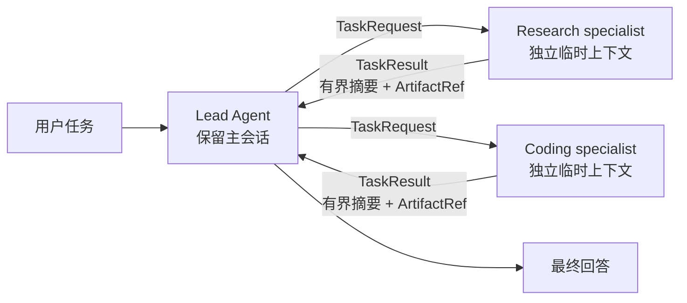
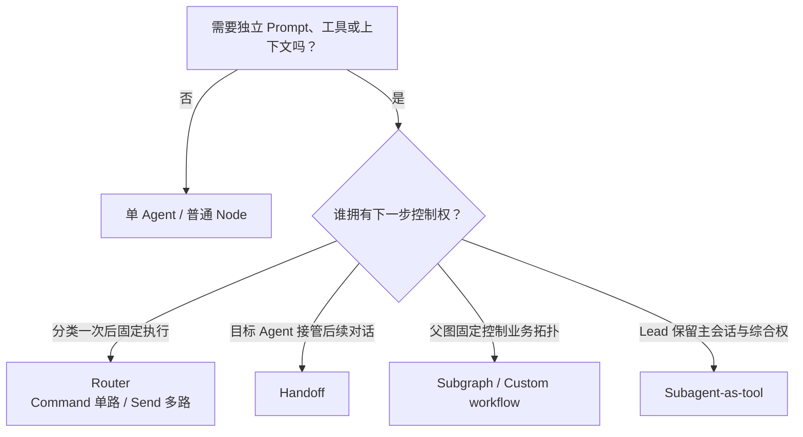
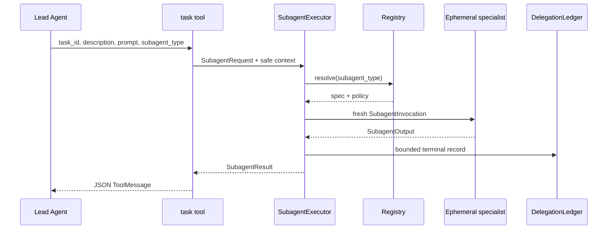
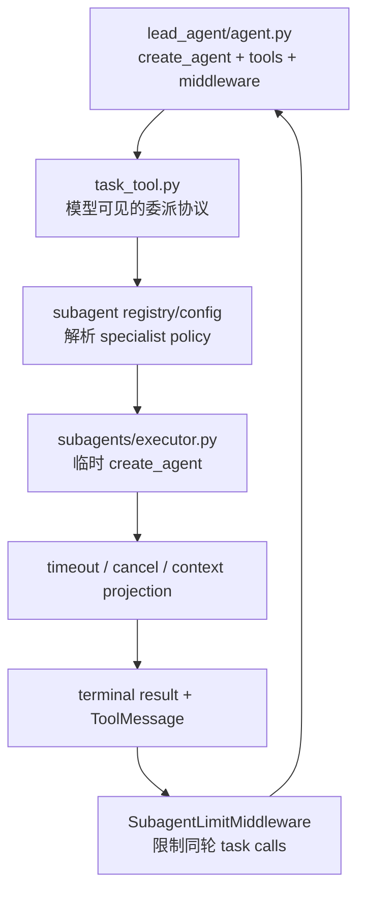

> **课程位置**：Agent Harness 层第 1 章  
> **锁定环境**：Python 3.12 / LangChain 1.3.x / LangGraph 1.2.x  
> **本章工件**：任务协议、上下文投影、控制权选择、SubagentExecutor、task tool 与 DelegationLedger

## 1. 上一刻系统：一个 Agent 已经可靠，但所有工作都挤进了同一段历史

第 10 章让研究流程可以暂停、审批和恢复。现在 Lead Agent 要同时查资料、检查 Python 接口，再综合成报告。

如果它亲自接收每段网页、命令输出和工具轨迹，这些中间材料都会留在主消息历史。任务越长，最终综合面对的噪声越多，Secret 和内部记录也更容易被误传。

先不要急着创建“多个 Agent”。本章会从一个可见失败出发，逐步回答四个问题：

1. 为什么普通函数或工具还不够？
2. specialist 应该看见什么，又返回什么？
3. Router、Handoff、Subgraph 和 Subagent-as-tool 的控制权有何不同？
4. 并发、超时和大输出为什么必须进入协议？



**图的文本替代**：Lead 保留用户会话和最终控制权。它只把最小任务请求交给临时 specialist；specialist 不继承主历史，只返回稳定、有界的结果。

### 学习目标

完成本章后，你能够：

- 从上下文污染推导任务请求、结果协议和输入白名单；
- 用控制权而不是“节点数量”区分四种多 Agent 模式；
- 用 `Command` 做单路由，用 `Send` 做并行 fan-out/fan-in；
- 解释为什么 Subgraph 不自动提供上下文隔离；
- 把并发上限、timeout、部分失败和输出预算放在执行 seam；
- 沿 `Lead Agent → task tool → SubagentExecutor → specialist` 阅读 DeerFlow。

## 2. 第一处失败：Lead 保存了不该长期保存的原始材料

研究和代码检查都可以先用普通函数完成。问题不在函数能否运行，而在它们的原始结果被塞进了哪里。


### 原始 specialist 输出直接进入 Lead 历史

**运行前先预测**：两段 specialist 原始输出共有 2600 字符。最终综合时，Lead 是否仍要重新读取它们？Secret 是否也进入同一输入？

```python sync=ch11-context-pollution-failure
research_raw = "R" * 1200
coding_raw = "C" * 1400
auth_token = "sk-live-course"

lead_history = [
    {"role": "user", "content": "比较 reducer 的语义与 Python 实现"},
    {"role": "tool", "content": research_raw},
    {"role": "tool", "content": coding_raw},
    {"role": "system", "content": f"auth_token={auth_token}"},
]
synthesis_input = "\n".join(message["content"] for message in lead_history)

print("message_count =", len(lead_history))
print("specialist_raw_chars =", len(research_raw) + len(coding_raw))
print("secret_in_synthesis_input =", auth_token in synthesis_input)
print("raw_results_still_in_history =", research_raw in synthesis_input and coding_raw in synthesis_input)
```

**观察结果**：

```text output=ch11-context-pollution-failure
message_count = 4
specialist_raw_chars = 2600
secret_in_synthesis_input = True
raw_results_still_in_history = True
```

**发生了什么**：函数已经完成分工，但没有形成委派边界。原始结果和 Secret 都进入 Lead 的长期输入；后续每轮综合仍要付出读取、存储和误用成本。

**动手修改**：把每段原始输出扩大到 10000 字符。说明为什么“换更大上下文窗口”只会推迟失败，而不会建立权限和生命周期边界。


### 用请求与结果协议切断原始材料

**运行前先预测**：specialist 只收到任务描述和 locale，Lead 只保存 32 字符摘要与 ArtifactRef。原始材料和 auth_token 还会进入结果吗？

```python sync=ch11-bounded-delegation-repair
from typing import Literal

from pydantic import BaseModel, ConfigDict, Field


class TaskRequest(BaseModel):
    model_config = ConfigDict(frozen=True)

    task_id: str
    specialist: Literal["research", "coding"]
    prompt: str = Field(min_length=1, max_length=200)
    context: dict[str, str] = Field(default_factory=dict)


class TaskResult(BaseModel):
    model_config = ConfigDict(frozen=True)

    task_id: str
    specialist: str
    status: Literal["completed", "failed", "timed_out", "output_too_large"]
    summary: str = Field(max_length=32)
    artifact_paths: list[str] = Field(default_factory=list, max_length=2)


request = TaskRequest(
    task_id="research-001",
    specialist="research",
    prompt="比较 reducer 语义",
    context={"locale": "zh-CN"},
)
result = TaskResult(
    task_id=request.task_id,
    specialist=request.specialist,
    status="completed",
    summary="并行更新必须通过 reducer 合并",
    artifact_paths=["artifacts/reducer-notes.md"],
)
serialized = result.model_dump_json()

print("request_context_keys =", sorted(request.context))
print("result_fields =", sorted(result.model_dump()))
print("secret_in_result =", auth_token in serialized)
print("raw_research_in_result =", research_raw in serialized)
print("artifact_count =", len(result.artifact_paths))
```

**观察结果**：

```text output=ch11-bounded-delegation-repair
request_context_keys = ['locale']
result_fields = ['artifact_paths', 'specialist', 'status', 'summary', 'task_id']
secret_in_result = False
raw_research_in_result = False
artifact_count = 1
```

**发生了什么**：Subagent 的核心不是“再调用一次模型”，而是稳定的输入、执行和返回边界。完整材料可以落到 Artifact；Lead 只持有综合所需的摘要和引用。

**动手修改**：尝试构造 33 字符摘要和 3 个 artifact。记录 Pydantic 在模型调用前拒绝了哪两个越界输入。


## 3. 输入隔离必须靠投影，不能靠“请忽略 Secret”

有了协议，仍可能在调用 specialist 时偷懒：把父上下文复制一份，再告诉它只使用其中几个字段。复制已经发生，Prompt 约定不能撤销数据暴露。


### 深拷贝仍然复制了完整主上下文

**运行前先预测**：`deepcopy` 会创建新对象。它是否也会自动删除 messages、auth_token 和 Lead 的内部笔记？

```python sync=ch11-parent-context-leak-failure
from copy import deepcopy


parent_context = {
    "user_id": "learner-11",
    "locale": "zh-CN",
    "messages": ["主会话消息 1", "主会话消息 2"],
    "auth_token": "never-forward",
    "internal_notes": "Lead 的私有规划",
}
naive_child_context = deepcopy(parent_context)

print("child_keys =", sorted(naive_child_context))
print("copied_is_new_object =", naive_child_context is not parent_context)
print("message_count =", len(naive_child_context["messages"]))
print("secret_visible =", naive_child_context["auth_token"] == "never-forward")
```

**观察结果**：

```text output=ch11-parent-context-leak-failure
child_keys = ['auth_token', 'internal_notes', 'locale', 'messages', 'user_id']
copied_is_new_object = True
message_count = 2
secret_visible = True
```

**发生了什么**：对象隔离不等于权限隔离。新 dict 仍包含所有数据；specialist 是否“自觉不用”不能成为安全不变量。

**动手修改**：把 messages 改成 100 条，再观察 child 的键和值。说明深拷贝为何还会增加内存成本。


### 从空上下文开始，只投影允许字段

**运行前先预测**：allowlist 只有 user_id 和 locale。生成的新 invocation 中还会出现 messages、internal_notes 或 auth_token 吗？

```python sync=ch11-context-projection-repair
from dataclasses import dataclass


@dataclass(frozen=True)
class SpecialistInvocation:
    task_id: str
    prompt: str
    context: dict[str, str]


def project_context(source: dict[str, object], allowed: frozenset[str]) -> dict[str, str]:
    return {
        key: str(source[key])
        for key in allowed
        if key in source and isinstance(source[key], str)
    }


allowed_fields = frozenset({"user_id", "locale"})
invocation = SpecialistInvocation(
    task_id="context-001",
    prompt="只比较公开接口",
    context=project_context(parent_context, allowed_fields),
)
rendered_invocation = repr(invocation)

print("projected_keys =", sorted(invocation.context))
print("messages_visible =", "messages" in invocation.context)
print("internal_notes_visible =", "internal_notes" in invocation.context)
print("secret_visible =", "never-forward" in rendered_invocation)
```

**观察结果**：

```text output=ch11-context-projection-repair
projected_keys = ['locale', 'user_id']
messages_visible = False
internal_notes_visible = False
secret_visible = False
```

**发生了什么**：投影从空对象构造新输入，只复制明确允许的字段。它建立的是数据最小化边界；真正工具调用仍需在服务端重新校验身份和权限。

**动手修改**：把 auth_token 加入 allowlist，观察它确实会泄漏。然后在 `project_context` 中拒绝以 token、secret 或 key 结尾的字段名。


## 4. 先问谁拥有下一步控制权，再选择多 Agent 模式

“有多个节点”不等于“有多个 Agent”。模式的分界点是：谁决定下一步、谁持有用户会话、是否需要独立上下文。



**图的文本替代**：一次分类后固定分支用 Router；目标 Agent 接管对话用 Handoff；父图控制固定拓扑用 Subgraph；Lead 动态委派并收回结果时用 Subagent-as-tool。

### 4.1 Router：选择分支，不建立长期 specialist 会话


### Command 在一次路由中同时更新 State 与选择节点

**运行前先预测**：输入包含“Python 修复”。router 会运行 research 和 coding 两个节点，还是只进入 coding？

```python sync=ch11-command-router
import operator
from typing import Annotated, Literal, TypedDict

from langgraph.graph import END, START, StateGraph
from langgraph.types import Command


class RouterState(TypedDict, total=False):
    query: str
    route: Literal["research", "coding"]
    answer: str
    trace: Annotated[list[str], operator.add]


def route_once(state: RouterState) -> Command[Literal["research", "coding"]]:
    selected: Literal["research", "coding"] = (
        "coding" if "Python" in state["query"] or "修复" in state["query"] else "research"
    )
    return Command(goto=selected, update={"route": selected, "trace": [f"router:{selected}"]})


def research(_: RouterState) -> dict[str, object]:
    return {"answer": "research result", "trace": ["research"]}


def coding(_: RouterState) -> dict[str, object]:
    return {"answer": "coding result", "trace": ["coding"]}


builder = StateGraph(RouterState)
builder.add_node("router", route_once)
builder.add_node("research", research)
builder.add_node("coding", coding)
builder.add_edge(START, "router")
builder.add_edge("research", END)
builder.add_edge("coding", END)
router_graph = builder.compile()
router_result = router_graph.invoke({"query": "修复 Python reducer"})

print("selected_route =", router_result["route"])
print("trace =", router_result["trace"])
print("specialist_runs =", len(router_result["trace"]) - 1)
```

**观察结果**：

```text output=ch11-command-router
selected_route = coding
trace = ['router:coding', 'coding']
specialist_runs = 1
```

**发生了什么**：`Command(update=..., goto=...)` 把路由结果写入 State，并只选择一个后继节点。Router 适合分类后固定执行，不要求 Lead 在结果回来后继续动态规划。

**动手修改**：把 query 改成“比较 checkpoint 文档”。先预测 route，再运行；确认 trace 中仍只有一个 specialist。


### Send 为每个目标创建独立输入，并通过 reducer 汇总

**运行前先预测**：routes 同时包含 research 和 coding。两个 worker 返回的列表会覆盖，还是由 reducer 合并？

```python sync=ch11-send-router
from langgraph.types import Send


class FanoutState(TypedDict, total=False):
    query: str
    routes: list[Literal["research", "coding"]]
    specialist: Literal["research", "coding"]
    results: Annotated[list[str], operator.add]
    answer: str


def fan_out(state: FanoutState) -> list[Send]:
    return [
        Send("specialist", {"query": state["query"], "specialist": name})
        for name in state["routes"]
    ]


def run_branch(state: FanoutState) -> dict[str, list[str]]:
    return {"results": [f"{state['specialist']}:{state['query']}"]}


def synthesize(state: FanoutState) -> dict[str, str]:
    names = sorted(item.split(":", 1)[0] for item in state["results"])
    return {"answer": "+".join(names)}


fanout_builder = StateGraph(FanoutState)
fanout_builder.add_node("specialist", run_branch)
fanout_builder.add_node("synthesize", synthesize)
fanout_builder.add_conditional_edges(START, fan_out, ["specialist"])
fanout_builder.add_edge("specialist", "synthesize")
fanout_builder.add_edge("synthesize", END)
fanout_graph = fanout_builder.compile()
fanout_result = fanout_graph.invoke(
    {"query": "比较语义与实现", "routes": ["research", "coding"]}
)

print("result_count =", len(fanout_result["results"]))
print("result_names =", sorted(item.split(":", 1)[0] for item in fanout_result["results"]))
print("answer =", fanout_result["answer"])
```

**观察结果**：

```text output=ch11-send-router
result_count = 2
result_names = ['coding', 'research']
answer = coding+research
```

**发生了什么**：`Send` 为每个分支构造输入，`Annotated[list, operator.add]` 负责 fan-in。并行执行不等于上下文隔离；你传进 Send 的字段仍由应用决定。

**动手修改**：删除 results 的 reducer，再运行两个分支。记录 LangGraph 为什么拒绝同一 superstep 对同一 key 的并发更新。


### 4.2 Handoff：把下一轮对话所有权交给目标 Agent


### active_agent 让后续请求绕过 triage

**运行前先预测**：第一轮选中 coding 后，第二轮带着 active_agent=coding 再进入图。triage 会再次运行吗？

```python sync=ch11-handoff
class HandoffState(TypedDict, total=False):
    request: str
    active_agent: Literal["triage", "research", "coding"]
    answer: str
    trace: Annotated[list[str], operator.add]


def enter(state: HandoffState) -> Command[Literal["triage", "research", "coding"]]:
    owner = state.get("active_agent")
    return Command(goto=owner if owner in {"research", "coding"} else "triage")


def triage(state: HandoffState) -> Command[Literal["research", "coding"]]:
    selected: Literal["research", "coding"] = (
        "coding" if "代码" in state["request"] else "research"
    )
    return Command(goto=selected, update={"active_agent": selected, "trace": [f"triage->{selected}"]})


def specialist_answer(state: HandoffState) -> dict[str, object]:
    owner = state["active_agent"]
    return {"answer": f"{owner} owns this turn", "trace": [f"{owner}:answered"]}


handoff_builder = StateGraph(HandoffState)
handoff_builder.add_node("enter", enter)
handoff_builder.add_node("triage", triage)
handoff_builder.add_node("research", specialist_answer)
handoff_builder.add_node("coding", specialist_answer)
handoff_builder.add_edge(START, "enter")
handoff_builder.add_edge("research", END)
handoff_builder.add_edge("coding", END)
handoff_graph = handoff_builder.compile()

first_turn = handoff_graph.invoke({"request": "检查代码接口"})
second_turn = handoff_graph.invoke(
    {"request": "继续解释", "active_agent": first_turn["active_agent"]}
)

print("first_owner =", first_turn["active_agent"])
print("first_trace =", first_turn["trace"])
print("second_trace =", second_turn["trace"])
print("triage_ran_again =", any("triage" in item for item in second_turn["trace"]))
```

**观察结果**：

```text output=ch11-handoff
first_owner = coding
first_trace = ['triage->coding', 'coding:answered']
second_trace = ['coding:answered']
triage_ran_again = False
```

**发生了什么**：Handoff 把 active owner 写进状态。目标 Agent 不只是返回一次结果，而是接管后续对话；若 Lead 必须统一审阅和综合，这种所有权就不合适。

**动手修改**：去掉第二轮的 active_agent。观察 triage 再次运行，并解释持久化会话中该字段应该由谁保存。


### 4.3 Subgraph：复用固定流程，但不会自动隐藏父 State


### 共享 Schema 的子图能看见父图传入的字段

**运行前先预测**：父图把完整 State 传给共享 Schema 子图。子节点能否看见 messages 和 auth_token？

```python sync=ch11-subgraph-boundary
class SharedState(TypedDict, total=False):
    query: str
    messages: list[str]
    auth_token: str
    child_observed_keys: list[str]
    secret_visible: bool


def inspect_shared_state(state: SharedState) -> dict[str, object]:
    return {
        "child_observed_keys": sorted(state),
        "secret_visible": "auth_token" in state,
    }


child_builder = StateGraph(SharedState)
child_builder.add_node("inspect", inspect_shared_state)
child_builder.add_edge(START, "inspect")
child_builder.add_edge("inspect", END)
child_graph = child_builder.compile()

parent_builder = StateGraph(SharedState)
parent_builder.add_node("specialist_subgraph", child_graph)
parent_builder.add_edge(START, "specialist_subgraph")
parent_builder.add_edge("specialist_subgraph", END)
parent_graph = parent_builder.compile()
shared_result = parent_graph.invoke(
    {"query": "检查边界", "messages": ["主历史"], "auth_token": "hidden"}
)

print("child_observed_keys =", shared_result["child_observed_keys"])
print("messages_visible =", "messages" in shared_result["child_observed_keys"])
print("secret_visible =", shared_result["secret_visible"])
```

**观察结果**：

```text output=ch11-subgraph-boundary
child_observed_keys = ['auth_token', 'messages', 'query']
messages_visible = True
secret_visible = True
```

**发生了什么**：Subgraph 提供嵌套拓扑、复用和 checkpoint 可见性，不自动提供最小上下文。需要隔离时，应使用不同 Schema 或 adapter 显式投影输入和输出。

**动手修改**：在父图和子图之间增加 adapter，只传 query。不要只在子节点中忽略字段；要让未授权数据根本不进入子图输入。


### 4.4 Subagent-as-tool：Lead 委派一次，再收回控制权


### 每次委派创建新的 invocation，只返回稳定结果

**运行前先预测**：连续调用同一个 research specialist 两次。第二次 invocation 是否能看到第一次的 prompt？

```python sync=ch11-ephemeral-specialist
from dataclasses import dataclass, field


@dataclass(frozen=True)
class MinimalTask:
    task_id: str
    specialist: str
    prompt: str


@dataclass(frozen=True)
class MinimalResult:
    task_id: str
    specialist: str
    status: str
    summary: str
    observed_prompts: tuple[str, ...] = field(default_factory=tuple)


def invoke_ephemeral(task: MinimalTask) -> MinimalResult:
    fresh_messages = [task.prompt]
    return MinimalResult(
        task_id=task.task_id,
        specialist=task.specialist,
        status="completed",
        summary=f"摘要:{task.prompt}",
        observed_prompts=tuple(fresh_messages),
    )


first_result = invoke_ephemeral(MinimalTask("task-1", "research", "解释 reducer"))
second_result = invoke_ephemeral(MinimalTask("task-2", "research", "解释 checkpoint"))

print("first_observed =", first_result.observed_prompts)
print("second_observed =", second_result.observed_prompts)
print("first_prompt_leaked_to_second =", "解释 reducer" in second_result.observed_prompts)
print("lead_regains_control =", first_result.status == second_result.status == "completed")
```

**观察结果**：

```text output=ch11-ephemeral-specialist
first_observed = ('解释 reducer',)
second_observed = ('解释 checkpoint',)
first_prompt_leaked_to_second = False
lead_regains_control = True
```

**发生了什么**：临时 Subagent 的生命周期是一笔委派，不是第二条长期会话。Lead 收到结果后继续决定下一步；若 specialist 需要长期直接服务用户，应选择 Handoff。

**动手修改**：故意把 `fresh_messages` 提升为全局 list。运行两次后观察串线，并解释为什么“给每个 specialist 一个永久历史”改变了产品语义。


## 5. 执行器不是薄转发：它必须守住运行边界

协议和输入投影解决“传什么”。执行器还要解决“同时跑多少、等多久、失败怎样回来、结果能有多大”。这些约束不能只写在 Prompt 里。

### 5.1 并发上限要放在所有调用都会经过的 seam


### gather 会一次启动所有 coroutine

**运行前先预测**：同时提交 4 个任务，没有 Semaphore。实际执行峰值是 1、2，还是 4？

```python sync=ch11-unbounded-concurrency-failure
import asyncio


unbounded_counter = {"active": 0, "peak": 0}


async def unbounded_worker(name: str) -> str:
    unbounded_counter["active"] += 1
    unbounded_counter["peak"] = max(
        unbounded_counter["peak"], unbounded_counter["active"]
    )
    await asyncio.sleep(0.01)
    unbounded_counter["active"] -= 1
    return f"done:{name}"


async def run_unbounded() -> list[str]:
    return list(await asyncio.gather(*(unbounded_worker(str(i)) for i in range(4))))


unbounded_results = await run_unbounded()
print("submitted =", len(unbounded_results))
print("peak_concurrency =", unbounded_counter["peak"])
print("all_completed =", all(item.startswith("done:") for item in unbounded_results))
```

**观察结果**：

```text output=ch11-unbounded-concurrency-failure
submitted = 4
peak_concurrency = 4
all_completed = True
```

**发生了什么**：`gather` 负责等待和聚合，不负责资源配额。模型同轮产生多少 tool calls，执行器就可能同时启动多少后端请求。Notebook 已经有运行中的事件循环，所以本章异步实验统一直接 `await`；如果把同一段逻辑移到 `.py` 脚本，才在最外层写 `asyncio.run(run_unbounded())`。

**动手修改**：把任务数改为 20。即使本地仍能完成，也要说明供应商 rate limit、连接池和 Sandbox 资源会怎样放大风险。


### Semaphore 把峰值锁在执行入口

**运行前先预测**：提交数量仍是 4，Semaphore 容量是 2。结果数量和峰值分别是多少？

```python sync=ch11-concurrency-limit
limited_counter = {"active": 0, "peak": 0}


async def run_limited() -> list[str]:
    semaphore = asyncio.Semaphore(2)

    async def limited_worker(name: str) -> str:
        async with semaphore:
            limited_counter["active"] += 1
            limited_counter["peak"] = max(
                limited_counter["peak"], limited_counter["active"]
            )
            await asyncio.sleep(0.01)
            limited_counter["active"] -= 1
            return f"done:{name}"

    return list(await asyncio.gather(*(limited_worker(str(i)) for i in range(4))))


limited_results = await run_limited()
print("submitted =", len(limited_results))
print("peak_concurrency =", limited_counter["peak"])
print("result_order =", limited_results)
```

**观察结果**：

```text output=ch11-concurrency-limit
submitted = 4
peak_concurrency = 2
result_order = ['done:0', 'done:1', 'done:2', 'done:3']
```

**发生了什么**：Semaphore 位于真实执行入口，所以不依赖模型遵守提示。它限制同时运行数，不限制队列长度、CPU、子进程或外部副作用。

**动手修改**：把容量改为 1 和 4，分别观察峰值。再写下生产系统还需要的队列长度与租户配额。


### 5.2 一个任务失败，不应抹掉同批已完成结果


### 裸 gather 抛出异常，调用方拿不到业务结果列表

**运行前先预测**：fast 已先完成，boom 随后抛错，slow 仍在等待。调用方能否拿到包含 fast 的结构化结果列表？

```python sync=ch11-gather-partial-failure
async def run_naive_batch() -> tuple[str, list[str], int, bool]:
    side_effects: list[str] = []

    async def worker(name: str, delay: float, should_fail: bool = False) -> str:
        await asyncio.sleep(delay)
        if should_fail:
            raise RuntimeError("provider unavailable")
        side_effects.append(name)
        return f"ok:{name}"

    tasks = [
        asyncio.create_task(worker("fast", 0.001)),
        asyncio.create_task(worker("boom", 0.01, True)),
        asyncio.create_task(worker("slow", 0.05)),
    ]
    try:
        visible_results = list(await asyncio.gather(*tasks))
        error_type = "none"
    except RuntimeError as error:
        error_type = type(error).__name__
        visible_results = []
    slow_was_pending = not tasks[2].done()
    for task in tasks:
        if not task.done():
            task.cancel()
    await asyncio.gather(*tasks, return_exceptions=True)
    return error_type, side_effects, len(visible_results), slow_was_pending


batch_error, completed_side_effects, visible_count, slow_pending = await run_naive_batch()
print("batch_error =", batch_error)
print("completed_side_effects =", completed_side_effects)
print("visible_result_count =", visible_count)
print("slow_was_pending =", slow_pending)
```

**观察结果**：

```text output=ch11-gather-partial-failure
batch_error = RuntimeError
completed_side_effects = ['fast']
visible_result_count = 0
slow_was_pending = True
```

**发生了什么**：fast 已经产生成功事实，但裸异常越过批量边界，调用方只得到 exception。没有逐任务结果协议，Lead 无法利用部分证据，也无法区分失败与超时。

**动手修改**：给 gather 加 `return_exceptions=True`。观察列表形状改善了什么，再解释为什么裸 Exception 仍不是稳定业务协议。


### 每个任务单独归一化为 completed、failed 或 timed_out

**运行前先预测**：三个请求顺序是 success、failure、timeout。并发执行后，结果协议是否仍保持这个输入顺序？

```python sync=ch11-timeout-partial-failure
async def controlled_worker(name: str) -> str:
    if name == "failure":
        raise RuntimeError("provider unavailable")
    if name == "timeout":
        await asyncio.sleep(0.05)
    return f"ok:{name}"


async def safe_dispatch(name: str) -> dict[str, str]:
    try:
        value = await asyncio.wait_for(controlled_worker(name), timeout=0.01)
    except TimeoutError:
        return {"name": name, "status": "timed_out", "value": ""}
    except Exception as error:
        return {"name": name, "status": "failed", "value": type(error).__name__}
    return {"name": name, "status": "completed", "value": value}


async def run_safe_batch() -> list[dict[str, str]]:
    names = ["success", "failure", "timeout"]
    return list(await asyncio.gather(*(safe_dispatch(name) for name in names)))


safe_results = await run_safe_batch()
print("names =", [item["name"] for item in safe_results])
print("statuses =", [item["status"] for item in safe_results])
print("success_value =", safe_results[0]["value"])
print("failure_value =", safe_results[1]["value"])
```

**观察结果**：

```text output=ch11-timeout-partial-failure
names = ['success', 'failure', 'timeout']
statuses = ['completed', 'failed', 'timed_out']
success_value = ok:success
failure_value = RuntimeError
```

**发生了什么**：每个 task 都有自己的 failure boundary；批量层只聚合稳定结果。`timed_out` 必须独立于 `failed`，因为它表达的是执行预算耗尽，不是业务已失败。

**动手修改**：把 timeout 调到 0.1 秒。观察第三个结果转为 completed，并说明 event-loop timeout 为什么不能证明阻塞式外部进程已被强杀。


### 5.3 大输出不能直接进入 Lead history


### 完整摘要和全部 ArtifactRef 被序列化进消息

**运行前先预测**：summary 有 160 字符、artifact 有 5 个。缺少预算时，消息里会保留多少？

```python sync=ch11-output-budget-failure
import json


full_summary = "证" * 160
full_artifacts = [f"artifacts/{index}.md" for index in range(5)]
unsafe_payload = {
    "status": "completed",
    "summary": full_summary,
    "artifacts": full_artifacts,
}
unsafe_tool_message = json.dumps(unsafe_payload, ensure_ascii=False)

print("summary_chars_in_message =", len(unsafe_payload["summary"]))
print("artifact_refs_in_message =", len(unsafe_payload["artifacts"]))
print("full_summary_present =", full_summary in unsafe_tool_message)
print("message_chars =", len(unsafe_tool_message))
```

**观察结果**：

```text output=ch11-output-budget-failure
summary_chars_in_message = 160
artifact_refs_in_message = 5
full_summary_present = True
message_chars = 303
```

**发生了什么**：状态仍写着 completed，但消息、checkpoint 和 trace 都会复制完整输出。长度问题被推迟到下一轮模型调用，而不是在产生结果的边界显式暴露。

**动手修改**：把 summary 扩大到 10000 字符。比较 ToolMessage、checkpoint 和 trace 可能产生的重复存储。


### 返回有界 preview、原始长度和 digest

**运行前先预测**：预算允许 32 字符和 2 个引用。完整结果能否继续直接进入 Lead？digest 能否恢复原文？

```python sync=ch11-output-budget-repair
import hashlib


digest_payload = json.dumps(
    {"summary": full_summary, "artifacts": full_artifacts},
    ensure_ascii=False,
    sort_keys=True,
)
bounded_payload = {
    "status": "output_too_large",
    "summary": full_summary[:32],
    "artifacts": full_artifacts[:2],
    "output_chars": len(full_summary),
    "output_sha256": hashlib.sha256(digest_payload.encode("utf-8")).hexdigest(),
    "truncated": True,
}

print("status =", bounded_payload["status"])
print("summary_chars =", len(bounded_payload["summary"]))
print("original_chars =", bounded_payload["output_chars"])
print("artifact_refs =", len(bounded_payload["artifacts"]))
print("digest_chars =", len(bounded_payload["output_sha256"]))
```

**观察结果**：

```text output=ch11-output-budget-repair
status = output_too_large
summary_chars = 32
original_chars = 160
artifact_refs = 2
digest_chars = 64
```

**发生了什么**：越界被提升为显式状态，Lead 可以选择压缩、按需读取 Artifact 或向用户声明证据缺口。digest 只用于比较完整内容身份，不能恢复原文，也不是数字签名。

**动手修改**：只改变最后一个字符并重新计算 digest。确认 digest 改变，再说明完整内容应由 Artifact repository 保存，而不是靠 digest 保存。


### 5.4 运行终态需要独立于消息历史的审计记录


### 只记录任务终态和边界事实

**运行前先预测**：审计记录只接收 task_id、status、context key、preview、长度和 digest。它会不会自动复制完整 Prompt、messages 或 Secret？

```python sync=ch11-bounded-delegation-record
from dataclasses import asdict, dataclass


@dataclass(frozen=True)
class DelegationRecord:
    task_id: str
    status: str
    context_keys: tuple[str, ...]
    summary_preview: str
    output_chars: int
    output_sha256: str


record = DelegationRecord(
    task_id="task-001",
    status=bounded_payload["status"],
    context_keys=("locale", "user_id"),
    summary_preview=bounded_payload["summary"][:16],
    output_chars=bounded_payload["output_chars"],
    output_sha256=bounded_payload["output_sha256"],
)
record_text = repr(record)

print("record_fields =", sorted(asdict(record)))
print("preview_chars =", len(record.summary_preview))
print("output_chars =", record.output_chars)
print("messages_recorded =", "主会话消息" in record_text)
print("secret_recorded =", "never-forward" in record_text)
```

**观察结果**：

```text output=ch11-bounded-delegation-record
record_fields = ['context_keys', 'output_chars', 'output_sha256', 'status', 'summary_preview', 'task_id']
preview_chars = 16
output_chars = 160
messages_recorded = False
secret_recorded = False
```

**发生了什么**：Delegation record 记录“谁执行、终态如何、输入边界是否生效、输出身份是什么”，不复制主会话。它与业务 State、模型消息和完整 trace 是不同数据产品。

**动手修改**：加入 tenant_id 和 error_code，但不要加入完整 exception。写下 retention 和 PII 删除策略应由哪一层负责。


## 6. 把原生机制迁入 Mini DeerFlow

到这里，学习者已经从零写过输入投影、控制权模式、Semaphore、部分失败和输出预算。下面才引入 Mini DeerFlow，观察它如何把同一机制收进可复用工程边界。



**图的文本替代**：task tool 将模型参数和安全上下文交给 executor；executor 解析 registry、创建临时 invocation、施加预算并写入 ledger；Lead 只收到结构化结果。

### 6.1 Registry 描述能力，Executor 拥有运行策略


### 两个 specialist 各自创建临时 Agent，并排除主 messages

**运行前先预测**：父上下文包含 locale、request_id、messages 和 auth_token。两个 specialist 的 ledger context_keys 会保留哪些？

```python sync=ch11-isolated-specialists
from mini_deerflow.subagents import (
    SubagentExecutor,
    SubagentRequest,
    build_demo_subagent_registry,
)


demo_registry = build_demo_subagent_registry()
demo_executor = SubagentExecutor(demo_registry, max_concurrency=2)
demo_requests = [
    SubagentRequest(
        task_id="demo-research",
        agent_name="research",
        description="研究 reducer",
        prompt="解释 reducer 的并行合并边界",
    ),
    SubagentRequest(
        task_id="demo-coding",
        agent_name="coding",
        description="设计 reducer 测试",
        prompt="给出防重复合并的测试建议",
    ),
]
demo_results = await demo_executor.dispatch_many(
    demo_requests,
    parent_context={
        "locale": "zh-CN",
        "request_id": "chapter-11",
        "messages": ["主会话不应转发"],
        "auth_token": "never-forward",
    },
)
demo_records = demo_executor.ledger.list_records()

print("capabilities =", demo_registry.describe())
print("statuses =", [result.status for result in demo_results])
print("summary_prefixes =", [result.summary[:4] for result in demo_results])
print("ledger_context_keys =", [record.context_keys for record in demo_records])
print("secret_in_ledger =", "never-forward" in repr(demo_records))
```

**观察结果**：

```text output=ch11-isolated-specialists
capabilities = (('research', '检索、比较并压缩证据'), ('coding', '分析 Python 接口并提出可测试实现'))
statuses = ['completed', 'completed']
summary_prefixes = ['研究摘要', '代码建议']
ledger_context_keys = [('locale', 'request_id'), ('locale', 'request_id')]
secret_in_ledger = False
```

**发生了什么**：Registry 只描述稳定名称、handler 和 policy。Executor 创建新的 `SubagentInvocation`，只投影 allowlist；built-in handler 每次 `create_agent(..., checkpointer=False)`，不持有长期历史。

**动手修改**：在 registry 中增加 reviewer，并重复注册同名 specialist。记录重复名称为何必须在组合根启动时失败，而不能静默覆盖。


### 6.2 task 是 Lead 唯一看见的委派接口


### task tool 隐藏 Registry、Semaphore 与 handler

**运行前先预测**：模型调用 task 时，参数 Schema 中会暴露 executor、handler 或 auth_token 吗？

```python sync=ch11-task-tool
from mini_deerflow.subagents import build_task_tool


task_tool = build_task_tool(demo_executor)
task_schema_fields = sorted(task_tool.tool_call_schema.model_fields)

print("tool_name =", task_tool.name)
print("schema_fields =", task_schema_fields)
print("executor_exposed =", "executor" in task_schema_fields)
print("auth_token_exposed =", "auth_token" in task_schema_fields)
print("max_concurrency_metadata =", task_tool.metadata["max_concurrency"])
```

**观察结果**：

```text output=ch11-task-tool
tool_name = task
schema_fields = ['description', 'prompt', 'subagent_type', 'task_id']
executor_exposed = False
auth_token_exposed = False
max_concurrency_metadata = 2
```

**发生了什么**：模型只选择 specialist 并描述任务。RuntimeContext、Registry、Semaphore 和 Ledger 都留在应用层；这是可测试、不可由模型绕过的执行 seam。

**动手修改**：向 args 添加未知字段。观察工具 Schema 如何拒绝或忽略它，并把期望行为写成测试，避免升级后静默变化。


### Lead 真实调用 task，再读取 ToolMessage 完成综合

**运行前先预测**：一次完整 Agent loop 的消息顺序是什么？最终回答来自 specialist，还是 Lead 的第二次模型响应？

```python sync=ch11-lead-agent-supervisor
import json

from langchain_core.messages import AIMessage, ToolMessage

from mini_deerflow.agents import create_lead_agent
from mini_deerflow.config import LeadAgentContext
from mini_deerflow.models import create_offline_model
from mini_deerflow.schemas import SubagentResult


lead_model = create_offline_model(
    [
        AIMessage(
            content="",
            tool_calls=[
                {
                    "name": "task",
                    "args": {
                        "task_id": "lead-task-1",
                        "description": "研究 checkpoint",
                        "prompt": "压缩成三条恢复原则",
                        "subagent_type": "research",
                    },
                    "id": "lead-call-1",
                    "type": "tool_call",
                }
            ],
        ),
        AIMessage(content="我已读取 Subagent 结果，并完成综合。"),
    ]
)
lead_agent = create_lead_agent(model=lead_model, tools=[task_tool])
lead_state = await lead_agent.ainvoke(
    {"messages": [{"role": "user", "content": "解释 checkpoint"}]},
    context=LeadAgentContext(
        user_id="learner",
        workspace_root="/tmp/lesson",
        auth_token="hidden",
    ),
)
tool_message = next(
    message for message in lead_state["messages"] if isinstance(message, ToolMessage)
)
delegated = SubagentResult.model_validate(json.loads(tool_message.content))

print("message_types =", [type(message).__name__ for message in lead_state["messages"]])
print("delegated_agent =", delegated.agent_name)
print("delegated_status =", delegated.status)
print("final_answer =", lead_state["messages"][-1].content)
print("secret_in_tool_message =", "hidden" in str(tool_message.content))
```

**观察结果**：

```text output=ch11-lead-agent-supervisor
message_types = ['HumanMessage', 'AIMessage', 'ToolMessage', 'AIMessage']
delegated_agent = research
delegated_status = completed
final_answer = 我已读取 Subagent 结果，并完成综合。
secret_in_tool_message = False
```

**发生了什么**：Lead 的第一次模型响应选择 task；工具返回结构化结果；第二次模型响应负责最终综合。控制权始终回到 Lead，这正是 Subagent-as-tool 与 Handoff 的根本差异。

**动手修改**：让模型同轮发出 research 和 coding 两个 task call。检查两条 ToolMessage，再说明并发上限由哪里执行。


### 6.3 Mini DeerFlow 把投影、预算与失败状态放进 Executor


### allowlist 过滤父上下文，并拒绝 secret-shaped 字段

**运行前先预测**：自定义 specialist 只允许 user_id 与 locale。handler 实际看到的 context 是什么？把 access_token 放进 allowlist 会发生什么？

```python sync=ch11-mini-context-projection
from mini_deerflow.subagents import (
    SubagentInvocation,
    SubagentOutput,
    SubagentRegistry,
    SubagentSpec,
)


observed_contexts: list[dict[str, object]] = []


async def inspect_context(invocation: SubagentInvocation) -> SubagentOutput:
    observed_contexts.append(invocation.context)
    return SubagentOutput(summary="context inspected")


context_executor = SubagentExecutor(
    SubagentRegistry(
        [
            SubagentSpec(
                name="inspector",
                description="检查输入投影",
                handler=inspect_context,
                allowed_context_fields=frozenset({"user_id", "locale"}),
            )
        ]
    )
)
context_result = await context_executor.dispatch(
    SubagentRequest(
        task_id="context-mini-001",
        agent_name="inspector",
        description="检查边界",
        prompt="只报告允许字段",
    ),
    parent_context={
        "user_id": "learner-11",
        "locale": "zh-CN",
        "messages": ["主历史"],
        "auth_token": "never-forward",
    },
)
try:
    SubagentSpec(
        name="unsafe",
        description="错误 policy",
        handler=inspect_context,
        allowed_context_fields=frozenset({"access_token"}),
    )
except ValueError as policy_error:
    secret_policy_rejected = "secret 字段" in str(policy_error)
else:
    secret_policy_rejected = False

print("observed_context_items =", sorted(observed_contexts[0].items()))
print("status =", context_result.status)
print("messages_visible =", "messages" in observed_contexts[0])
print("secret_policy_rejected =", secret_policy_rejected)
```

**观察结果**：

```text output=ch11-mini-context-projection
observed_context_items = [('locale', 'zh-CN'), ('user_id', 'learner-11')]
status = completed
messages_visible = False
secret_policy_rejected = True
```

**发生了什么**：Executor 按 spec 投影输入，`SubagentSpec` 还拒绝 secret-shaped allowlist。字段名检查只是第二道护栏；授权仍必须由真实工具和服务端执行。

**动手修改**：加入 sandbox_id 允许字段并重新运行。解释为什么传句柄比复制工作区内容更适合隔离边界。


### Mini DeerFlow 的 Semaphore 限制真实 handler 峰值

**运行前先预测**：Executor max_concurrency=2，提交 4 个请求。handler 的实际峰值和结果顺序是什么？

```python sync=ch11-mini-concurrency-limit
mini_counter = {"active": 0, "peak": 0}


async def measured_handler(invocation: SubagentInvocation) -> SubagentOutput:
    mini_counter["active"] += 1
    mini_counter["peak"] = max(mini_counter["peak"], mini_counter["active"])
    await asyncio.sleep(0.01)
    mini_counter["active"] -= 1
    return SubagentOutput(summary=f"done:{invocation.prompt}")


mini_concurrency_executor = SubagentExecutor(
    SubagentRegistry(
        [SubagentSpec(name="worker", description="测量并发", handler=measured_handler)]
    ),
    max_concurrency=2,
)
mini_concurrency_results = await mini_concurrency_executor.dispatch_many(
    [
        SubagentRequest(
            task_id=f"mini-concurrency-{index}",
            agent_name="worker",
            description="并发实验",
            prompt=str(index),
        )
        for index in range(4)
    ]
)

print("peak_concurrency =", mini_counter["peak"])
print("statuses =", [result.status for result in mini_concurrency_results])
print("summaries =", [result.summary for result in mini_concurrency_results])
```

**观察结果**：

```text output=ch11-mini-concurrency-limit
peak_concurrency = 2
statuses = ['completed', 'completed', 'completed', 'completed']
summaries = ['done:0', 'done:1', 'done:2', 'done:3']
```

**发生了什么**：同一 Executor 的所有 dispatch 都经过一个 Semaphore。`dispatch_many` 并发提交，但 `gather` 按请求顺序返回，因此结果顺序不依赖完成时序。

**动手修改**：把一个 handler 改成阻塞式 `time.sleep`。观察 event loop 受阻，并说明何时必须升级到进程、容器或远程 worker。


### Mini DeerFlow 将异常和 timeout 归一化为 SubagentResult

**运行前先预测**：success、failure、timeout 同批提交。一个异常会不会取消另外两个结果？异常原文会不会完整写入 error？

```python sync=ch11-mini-partial-failure
async def unstable_handler(invocation: SubagentInvocation) -> SubagentOutput:
    if invocation.prompt == "failure":
        raise RuntimeError("sensitive provider payload")
    if invocation.prompt == "timeout":
        await asyncio.sleep(0.05)
    return SubagentOutput(summary=f"ok:{invocation.prompt}")


mini_failure_executor = SubagentExecutor(
    SubagentRegistry(
        [SubagentSpec(name="unstable", description="故障注入", handler=unstable_handler)]
    ),
    max_concurrency=2,
    timeout_seconds=0.01,
)
mini_failure_results = await mini_failure_executor.dispatch_many(
    [
        SubagentRequest(
            task_id=f"mini-failure-{index}",
            agent_name="unstable",
            description="故障实验",
            prompt=value,
        )
        for index, value in enumerate(["success", "failure", "timeout"])
    ]
)

print("statuses =", [result.status for result in mini_failure_results])
print("success_summary =", mini_failure_results[0].summary)
print("failure_error =", mini_failure_results[1].error)
print("timeout_has_budget_message =", "执行预算" in (mini_failure_results[2].error or ""))
```

**观察结果**：

```text output=ch11-mini-partial-failure
statuses = ['completed', 'failed', 'timed_out']
success_summary = ok:success
failure_error = RuntimeError: subagent handler failed
timeout_has_budget_message = True
```

**发生了什么**：Executor 是异常归一化边界。异常类型被保留，供应商原始文本被丢弃；timeout 独立表达预算耗尽；同批成功结果仍可用于综合。

**动手修改**：请求未知 agent_name。观察它返回 failed 而不是让 KeyError 越过 Lead 工具循环。


### Mini DeerFlow 同时限制摘要与 ArtifactRef 数量

**运行前先预测**：spec 允许 32 字符和 2 个 artifact。原始结果有 160 字符和 5 个引用，SubagentResult 会保留哪些审计信息？

```python sync=ch11-mini-output-budget
from mini_deerflow.schemas import ArtifactRef


async def verbose_handler(_: SubagentInvocation) -> SubagentOutput:
    return SubagentOutput(
        summary="证据" * 80,
        artifacts=[
            ArtifactRef(path=f"reports/{index}.md", media_type="text/markdown")
            for index in range(5)
        ],
    )


mini_budget_executor = SubagentExecutor(
    SubagentRegistry(
        [
            SubagentSpec(
                name="verbose",
                description="产生大输出",
                handler=verbose_handler,
                max_output_chars=32,
                max_artifacts=2,
            )
        ]
    )
)
mini_budget_result = await mini_budget_executor.dispatch(
    SubagentRequest(
        task_id="mini-large-output",
        agent_name="verbose",
        description="验证输出预算",
        prompt="返回大量证据",
    )
)

print("status =", mini_budget_result.status)
print("summary_chars =", len(mini_budget_result.summary))
print("original_chars =", mini_budget_result.output_chars)
print("artifact_refs =", len(mini_budget_result.artifacts))
print("digest_chars =", len(mini_budget_result.output_sha256 or ""))
print("truncated =", mini_budget_result.truncated)
```

**观察结果**：

```text output=ch11-mini-output-budget
status = output_too_large
summary_chars = 32
original_chars = 160
artifact_refs = 2
digest_chars = 64
truncated = True
```

**发生了什么**：Mini DeerFlow 把概念实验中的预算规则提升到统一结果协议。完整大输出应由 Sandbox/Artifact provider 保存，Lead 只按需读取。

**动手修改**：只让 artifact 数量越界、摘要不过界。确认状态仍是 output_too_large，并检查 error 明确指出哪项预算超限。


### 6.4 Delegation Ledger 记录终态，不复制完整会话


### Ledger 保存 context key、预览、长度与 digest

**运行前先预测**：demo_executor 已执行多次研究和代码任务。Ledger 会保存完整 messages 和 Secret，还是只保存有界审计字段？

```python sync=ch11-delegation-ledger-event
ledger_records = demo_executor.ledger.list_records()
latest_record = ledger_records[-1]
rendered_records = repr(ledger_records)

print("record_count =", len(ledger_records))
print("latest_task_id =", latest_record.task_id)
print("latest_status =", latest_record.status)
print("latest_context_keys =", latest_record.context_keys)
print("summary_preview_chars =", len(latest_record.summary_preview))
print("digest_chars =", len(latest_record.output_sha256 or ""))
print("messages_in_ledger =", "主会话不应转发" in rendered_records)
print("secret_in_ledger =", "never-forward" in rendered_records)
```

**观察结果**：

```text output=ch11-delegation-ledger-event
record_count = 3
latest_task_id = lead-task-1
latest_status = completed
latest_context_keys = ('locale', 'request_id')
summary_preview_chars = 21
digest_chars = 64
messages_in_ledger = False
secret_in_ledger = False
```

**发生了什么**：同一个 demo_executor 先执行两个直接委派，又通过 task tool 执行一次 Lead 委派。Ledger 记录 task 终态和安全输入键，不是 Graph Checkpointer、模型历史或完整 trace 的替代品。

**动手修改**：把 Ledger 替换为持久化 repository 接口草图。列出 tenant ownership、retention、PII policy 和事务边界，不要直接永久保存所有 Prompt。


## 7. 四种模式放在一起比较

| 模式 | 下一步控制权 | 会话所有者 | 是否天然隔离上下文 | 典型用途 |
|---|---|---|---:|---|
| Router | 分类器选中固定分支 | 外层应用 | 否 | 一次分类、单路或多路并行 |
| Handoff | 目标 Agent 接管 | active agent | 取决于实现 | 专员继续直接和用户对话 |
| Subgraph | 父图固定拓扑 | 父图/checkpointer | 否 | 可恢复的确定性子流程 |
| Subagent-as-tool | Lead 委派后收回 | Lead | 由请求投影建立 | 动态研究、代码检查、压缩上下文 |

“同步委派”和“后台任务”描述的是业务等待关系，不是 Python 是否写了 `async def`。即使使用 asyncio，Lead 仍可能同步等待结果。

任务持续数分钟、用户需要断线重连或取消时，应升级为 task repository、worker lease、start/status/result API 和 durable event。单纯 `asyncio.create_task()` 不会提供这些语义。

## 8. 为什么 DeerFlow 使用 Lead Agent + task/subagent

本章校准的 DeerFlow 源码固定在提交 `216309426fc6f954689ebee138af117029e43f8b`。建议按下面顺序阅读：



**图的文本替代**：从 Lead 组合根找到 task；沿 task 进入 registry 和 executor；观察临时 Agent、超时和结果投影；最后回到限制同轮委派数量的 middleware。

DeerFlow 不是“固定翻译小组”。Lead 在长期会话中动态决定是否调用 `task(description, prompt, subagent_type)`；每个 subagent 有自己的 Prompt、tools、skills、模型和预算。

Mini DeerFlow 没有复制 DeerFlow 的线程池、Gateway、SSE 和完整 runtime。它保留了读懂大项目所需的稳定骨架：单一 task 接口、registry、隔离 invocation、受控并发、终态协议和有界 ledger。

| DeerFlow | Mini DeerFlow | 本轮有意延后 |
|---|---|---|
| Lead 动态调用 task | `create_lead_agent(tools=[task])` | 动态工具发现 |
| subagent registry/config | `SubagentRegistry + SubagentSpec` | YAML/plugin 配置 |
| isolated executor | fresh invocation + handler | 完整供应商 Agent runtime |
| 并发 task calls | Semaphore + dispatch_many | 分布式 queue/worker |
| timeout/cancel/status | 五种稳定终态 | cancel、turn/token/loop cap |
| workspace inheritance | 只传 sandbox_id 句柄 | 生产容器 Sandbox |
| delegation journal | 有界进程内 Ledger | DB repository 与 SSE journal |

## 9. 动手练习：让边界发生一次可观察变化

### 练习 A：增加 reviewer specialist

在 demo registry 中增加 reviewer，只允许 locale，输出上限 500 字符。为重复名称和 secret allowlist 各写一个失败断言。

不要在 executor 里增加 `if agent_name == "reviewer"`。如果需要修改 dispatch，说明 Registry seam 还没有成立。

### 练习 B：按控制权选模式

为下面场景选择模式，并写出“谁拥有下一步控制权”：

1. 工单只按类型一次性分到退款或物流模块；
2. 身份验证后，退款专员接管后续用户对话；
3. Lead 同时委派研究和代码检查，统一综合；
4. 发布固定经过 draft、review、approval，并查看嵌套 checkpoint。

<details>
<summary>参考判断</summary>

1. Router；分类器只决定一次分支。
2. Handoff；退款专员成为 active owner。
3. Subagent-as-tool；Lead 委派后收回控制。
4. Subgraph/custom workflow；父图固定控制拓扑。
</details>

### 练习 C：把大输出落到 Artifact repository

定义 ArtifactRepository protocol。Subagent 完整输出写入 repository；Lead 只收到 `ArtifactRef + 前 160 字摘要 + digest`。

不要让 Executor 直接依赖本地路径。对照 Sandbox 专题的 `SandboxProvider`，解释 provider seam 如何在不改变 SubagentResult 的前提下替换存储实现。

### 延迟回忆题

合上本章后回答：

1. 普通函数分工为什么还不等于 Subagent 边界？
2. `Send` 并行为什么不自动提供上下文隔离？
3. Supervisor 与 Router 的根本差异是什么？
4. timeout 为什么不能证明外部副作用已经停止？
5. DelegationLedger 与 Checkpointer 分别保存什么？

## 10. 自动验收

```bash
uv run --locked python scripts/sync_lesson_notebooks.py \
  tutorials/11_Multi_Agent_Patterns.md --execute

uv run --locked pytest -q \
  tests/test_mini_deerflow_subagents.py \
  tests/test_mini_deerflow_schemas.py \
  tests/test_notebook_sync.py \
  tests/test_quality_cli.py
```

- [ ] 失败与修复实验相邻，并使用同一 concept/pair；
- [ ] 所有 concept lab 均不导入 Mini DeerFlow；
- [ ] Command 只运行一个分支，Send 通过 reducer fan-in；
- [ ] Handoff 改变 active owner，Subgraph 不被误称为隔离；
- [ ] Semaphore 峰值、异常、timeout 和大输出都有可读 stdout；
- [ ] task tool 进入真实 Lead model → tool → model 循环；
- [ ] Ledger 不保存主 messages 或 Secret；
- [ ] Web 与 Notebook 的实验顺序、代码和 stdout 一致。

## 11. 本章交付：从“多画几个节点”上升到 Agent Harness

本章没有从 Mini DeerFlow 封装开始。学习者先亲手经历 Lead 上下文污染，再建立 TaskRequest、TaskResult、输入投影、控制权选择和执行预算。

随后，同一组机制被迁入 Mini DeerFlow：Registry 描述能力，Executor 守住运行边界，task tool 暴露单一接口，Lead 在 ToolMessage 返回后继续综合，Ledger 保存有界终态。

下一篇进入[Mini DeerFlow 工程架构总览](/langchain-logbook/posts/architecture/)。阅读时不要只找类名，要沿着本章已经建立的五条责任边界追踪：组合根、模型接口、执行 seam、持久化事实和外部能力。

## 参考资料

- [LangChain Multi-agent overview](https://docs.langchain.com/oss/python/langchain/multi-agent)
- [LangChain Subagents](https://docs.langchain.com/oss/python/langchain/multi-agent/subagents)
- [LangChain Router](https://docs.langchain.com/oss/python/langchain/multi-agent/router)
- [LangChain Handoffs](https://docs.langchain.com/oss/python/langchain/multi-agent/handoffs)
- [LangChain Custom workflow](https://docs.langchain.com/oss/python/langchain/multi-agent/custom-workflow)
- [DeerFlow Lead Agent（固定提交）](https://github.com/bytedance/deer-flow/blob/216309426fc6f954689ebee138af117029e43f8b/backend/packages/harness/deerflow/agents/lead_agent/agent.py)
- [DeerFlow task tool（固定提交）](https://github.com/bytedance/deer-flow/blob/216309426fc6f954689ebee138af117029e43f8b/backend/packages/harness/deerflow/tools/builtins/task_tool.py)
- [DeerFlow SubagentExecutor（固定提交）](https://github.com/bytedance/deer-flow/blob/216309426fc6f954689ebee138af117029e43f8b/backend/packages/harness/deerflow/subagents/executor.py)
- [DeerFlow SubagentLimitMiddleware（固定提交）](https://github.com/bytedance/deer-flow/blob/216309426fc6f954689ebee138af117029e43f8b/backend/packages/harness/deerflow/agents/middlewares/subagent_limit_middleware.py)

以上资料于 2026-07-13 校准。官方文档和 DeerFlow main 会继续演进；阅读时优先检查锁定版本和固定提交。

继续阅读：[Mini DeerFlow 工程架构总览](/langchain-logbook/posts/architecture/)。