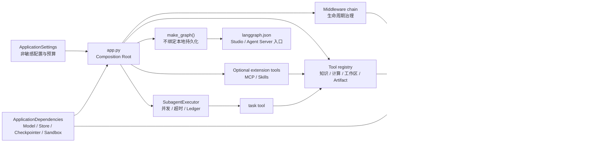
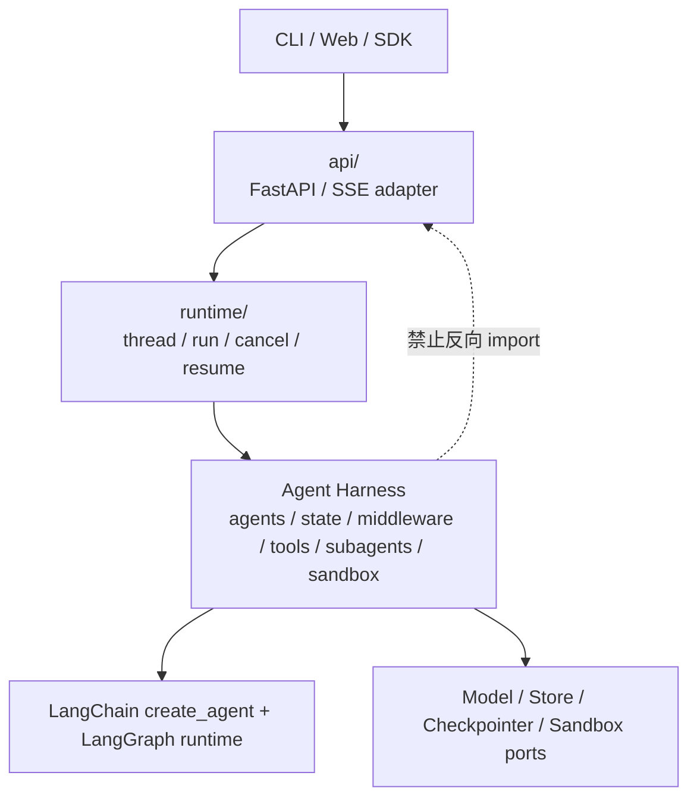
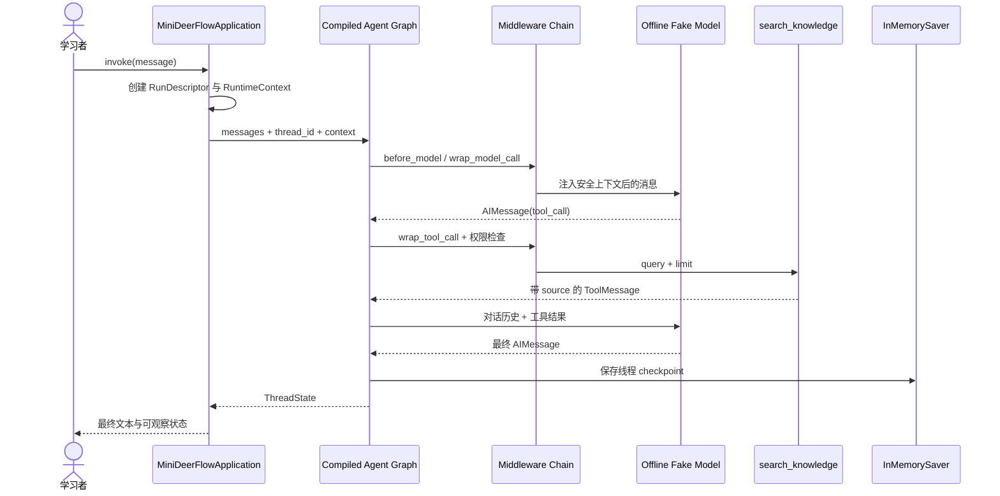

> 校准日期：2026-07-14  
> 适用范围：课程第 01–11 章、Lead Agent 核心、Sandbox/Subagent/MCP/Skills、Runtime/API/SSE、测试/评测/观测与最终综合实战  
> 核心入口：[`app.py`](https://github.com/Chengyunlai/langchain-logbook/blob/main/mini_deerflow/app.py)；LangGraph 工具入口：[`../langgraph.json`](https://github.com/Chengyunlai/langchain-logbook/blob/main/langgraph.json)

## 前 11 章的零件，不能各自留在 Demo 里

前 11 章分别交付模型、Schema、检索、Lead Agent、Context、State、Middleware、Graph、持久化、审批和 Subagent。若每个专题都自行创建模型、Store 和工具表，课程最终仍会产生多套平行 Demo。

第 11 章结束时，`task` 已经能把研究任务交给隔离 Subagent。现在要追问：谁创建 Lead、task、Executor、Store 和 Checkpointer？

若 CLI、Notebook 和 API 各装一套，前面建立的边界会在入口处重新分裂。

本篇先固定 Mini DeerFlow 的组合根、依赖方向和四类数据边界。模型、工具、Graph、Middleware 与 Subagent 要在这里组成同一套应用，外层协议不能反向渗入 Agent Harness。

Mini DeerFlow 保留一组可以迁移的关系：Lead Agent 运行在 LangGraph runtime 上，Middleware 治理生命周期，工具与 Subagent 提供受控能力。

Checkpointer 和 Store 各自保存不同事实，API 只是外层 adapter。

第一次只追一条主链：`build_application → _assemble_graph → create_lead_agent → graph.invoke`。沿途确认工具在哪里创建、注册和授权，再给 State、Runtime Context、Store 与产品数据库分类。

Sandbox、Runtime 和 Evaluation 暂时只看接口。后续专题会继续沿这些接缝展开，并解释 `make_graph()` 与 `build_application()` 为何拥有不同生命周期。

## 0. 先看一轮离线对话

先执行一条确定性离线对话：

```bash
uv run --locked --group dev python -m mini_deerflow \
  --message "解释 create_agent 与 LangGraph 的关系"
```

输出如下：

```text
{"profile": "offline", "tools": ["search_knowledge", "calculator", "read_workspace_file", "write_workspace_file", "record_artifact", "task"], "final_text": "离线工具循环已完成；请查看 ToolMessage 中的引用。", "middleware_events": 6}
```

先从输出提问，不要从文件名猜答案：

1. `profile` 从哪份配置进入模型工厂？
2. 六个工具由谁合并成一张表？
3. `task` 为什么和普通工具出现在同一接口中？
4. 六个 middleware event 在哪里产生，又为何没有直接打印完整 State？

再运行下面的“装配探针”。它不调用模型，只检查组合根创建出的对象关系：

```python
from mini_deerflow.app import build_application, build_default_dependencies
from mini_deerflow.config import ApplicationSettings


settings = ApplicationSettings.offline(workspace_root=".")
dependencies = build_default_dependencies(settings)
application = build_application(settings, dependencies=dependencies)

print("settings_type =", type(application.settings).__name__)
print("dependencies_type =", type(application.dependencies).__name__)
print("graph_type =", type(application.graph).__name__)
print("tool_names =", application.tool_names)
print("same_store =", application.dependencies.store is dependencies.store)
print("same_checkpointer =", application.dependencies.checkpointer is dependencies.checkpointer)
```

```text
settings_type = ApplicationSettings
dependencies_type = ApplicationDependencies
graph_type = CompiledStateGraph
tool_names = ('search_knowledge', 'calculator', 'read_workspace_file', 'write_workspace_file', 'record_artifact', 'task')
same_store = True
same_checkpointer = True
```

最值得看的不是类名，而是最后两行。组合根没有在 Agent factory 内偷换 Store 或 Checkpointer；测试传入的活依赖，就是应用真正使用的实例。

**动手修改**：用 `dataclasses.replace()` 只替换 model，再调用 `build_application()`。如果你必须复制整套工厂才能换模型，依赖注入边界就没有成立。

## 1. 只能有一个地方决定怎样装配

此前每章分别验证一个能力，这对学习原理是必要的，但它还不等于一个应用。真实应用必须有一个地方决定：

- 使用哪个模型、知识索引、Store 和 Checkpointer；
- 向 Lead Agent 注册哪些工具；
- Middleware 的顺序和预算是多少；
- Subagent registry、并发限制和 ledger 使用哪个实例；
- 一次运行的 `thread_id`、`request_id`、用户身份和权限由谁提供。

这个唯一装配位置叫组合根（Composition Root）。本项目把它集中在 `app.py`。

`build_application()` 服务本地 CLI 与测试，`make_graph()` 服务 Agent Server/Studio。二者复用同一个内部装配函数。业务模块只声明依赖，不在 import 时读取 Secret、猜测 provider 或连接外部服务。

常见的错误是：CLI 自己创建模型和工具，Notebook 再创建一份，API 为了持久化又复制第三份。三条路径都能回答问题，却可能使用不同 Middleware 顺序、权限表和 Store。

这种错误很难靠单次演示发现。它通常表现为“Notebook 明明能用，API 却没有 task”“测试替换了模型，线上仍在读取环境变量”“CLI 保存的偏好在 Gateway 看不见”。

组合根解决的不是代码重复本身，而是对象身份和策略只有一个决策点。`_assemble_graph()` 的阅读顺序应固定为：

1. 用 settings 创建 SubagentExecutor 的并发和 timeout policy；
2. 合并核心工具、task tool 和可选 extension tools；
3. 在启动阶段拒绝重复工具名；
4. 按固定顺序构造 Middleware；
5. 把 model、tools、middleware、Store 和 Checkpointer交给 `create_lead_agent()`。

<!-- diagram:id=mini-deerflow-composition-root -->


**图的文本替代**：配置和活依赖进入唯一组合根。组合根创建 Middleware、工作区工具、可选扩展和 SubagentExecutor，再把 `task` 加入 registry，调用 `create_lead_agent()` 得到 compiled graph。

本地应用绑定独享的内存持久化。内存与 SQLite Checkpointer 复用同一份领域类型 allowlist，避免组合根退回宽松反序列化。

`langgraph.json` 调用不绑定本地持久化的 `make_graph()`，让 Agent Server 注入它管理的 Checkpointer 与 Store。

这里刻意把“配置”和“依赖”分开：

- `ApplicationSettings` 是可以序列化和审查的非敏感选择，例如离线 profile、模型调用上限、Subagent 并发和超时预算。
- `ApplicationDependencies` 是活的对象，例如模型实例、知识索引、Store 和 Checkpointer。测试可以用 `dataclasses.replace()` 替换一个依赖，而不复制整套 Agent 工厂。
- `RuntimeContext` 属于一次调用。用户、权限和工作区不能让模型通过请求正文自行选择。

## 2. HTTP 可以依赖 Harness，Harness 不能反过来

课程把系统分成三层。这里的“层”表示依赖方向，不表示一定要部署为三个进程。

<!-- diagram:id=mini-deerflow-layer-boundary -->


**图的文本替代**：客户端进入 API adapter，API 调用 runtime，runtime 再调用 Agent Harness。Harness 建立在 LangChain/LangGraph 和 provider 接口之上，不得反向导入 API。

若工具为了读取 HTTP header 而 import FastAPI request，Notebook、CLI、测试和 Agent Server 都会被某个传输协议绑死。

API 应先验证身份，再把允许暴露的运行事实构造成 `RuntimeContext`。

当前 `api/` 和 `runtime/` 实现了本地单 worker Gateway，包括 SQLite thread/run/event repository、后台执行、取消、interrupt 恢复、SSE 重放和 FastAPI adapter。

它不是生产多 worker 调度器。完整边界见 [`RUNTIME_GATEWAY.md`](/langchain-logbook/posts/runtime_gateway/)，核心工具没有为 HTTP 增加反向依赖。

## 3. 目录只在生命周期不同处拆开

```text
mini_deerflow/
├── app.py                 # 唯一组合根、离线应用对象、标准 graph 导出
├── config.py              # 非敏感配置；不保存 API Key
├── context.py             # 一次 invocation 的身份、权限与依赖事实
├── state.py               # 可 checkpoint 的 ThreadState 与 reducer
├── schemas.py             # Plan、Artifact、SubagentResult 等领域契约
├── models.py              # 真实/离线 model provider factory
├── fixtures.py            # 只供课程和测试使用的确定性数据
├── agents/                # Lead Agent factory 与 prompt
├── middleware/            # 生命周期、权限、错误、预算与上下文治理
├── tools/                 # 最小权限工具、workspace tools 及 registry
├── knowledge/             # 本地索引与检索评测
├── graph/                 # 显式 Graph、持久化、HITL 等课程工作流
├── persistence.py         # 本地 effect-intent ledger
├── store.py               # 跨线程偏好 repository
├── streaming.py           # LangGraph stream event 领域归一化
├── subagents/             # registry、task tool、executor、隔离 specialist
├── sandbox/               # Provider/Session 契约与安全本地线程工作区
├── mcp/                   # 懒加载、allowlist 的可选 MCP tool adapter
├── skills/                # Skill metadata catalog、按需加载工具与教学 Skill
├── runtime/               # thread/run/event repository、worker、SSE 编码
├── api/                   # 传输 DTO、Gateway service 与 FastAPI adapter
├── evals/                 # Dataset、Observation、离线 evaluator、LangSmith adapter
├── observability.py       # tracing context 与唯一 root span 所有权
└── eval_demo.py           # 真实离线 Agent 的可执行质量评测
```

目录拆分来自生命周期、替换原因和安全责任。

例如 `state.py` 与 `context.py` 必须分开：前者会进入 checkpoint/trace，后者可以包含不可持久化的调用级身份与 Secret。

### 3.1 每个模块都能回到前 11 章

| 已学概念 | 进入 Mini DeerFlow 的入口 | 第一次阅读只回答什么 |
|---|---|---|
| Model / Runnable | `models.py` | 离线与真实 provider 在哪里切换？ |
| 结构化输出 | `schemas.py` | 哪些对象跨模块传递，哪些只是内部实现？ |
| Retriever / RAG | `knowledge/` | 检索何时返回 Document，何时变成工具结果？ |
| create_agent / tools | `agents/`、`tools/` | 谁创建工具表，Agent factory 是否自行找工具？ |
| Runtime Context | `context.py` | user、permission 和 Secret 如何避开 State？ |
| Middleware | `middleware/` | 顺序由谁固定，哪些 hook 包裹 model/tool？ |
| State / Reducer | `state.py` | messages 与 artifacts 怎样合并？ |
| Command / Send / Subgraph | `graph/` | 固定工作流与动态 Agent loop 如何共存？ |
| Checkpoint / Store | `persistence.py`、`store.py` | 线程恢复与跨线程偏好为何分开？ |
| Interrupt / effect | `graph/`、`persistence.py` | 暂停点和外部副作用意图各存在哪里？ |
| Subagent | `subagents/` | task 如何进入工具表，Executor 由谁持有？ |

这张表是导航，不是新的学习顺序。若某一行回答不出来，回到对应章节的失败/修复实验；不要通过随机翻遍整个 package 来补概念。

### 3.2 第一次只打开四处

按下面顺序打开代码，每处只带一个问题：

1. `app.py:build_application()`：外部可以传入哪些配置和活依赖？
2. `app.py:_assemble_graph()`：工具、Middleware、Subagent 和持久化怎样汇合？
3. `agents/lead_agent.py:create_lead_agent()`：它是否越权创建了应用依赖？
4. `app.py:MiniDeerFlowApplication.invoke()`：thread_id、RuntimeContext 和 message 怎样进入 Graph？

读到第四处后再回来看目录树，你会看到“不同生命周期的边界”，而不是二十多个陌生文件夹。

## 4. 一条消息如何穿过整套应用

<!-- diagram:id=mini-deerflow-minimal-run-sequence -->


**图的文本替代**：应用生成运行标识与 Runtime Context，再以 `thread_id` 调用 compiled graph。Middleware 包裹模型和工具调用，Checkpointer 保存线程状态，应用最终返回完整 State。

离线模型的回答是脚本化的，但 tool call、工具执行、Middleware、State reducer、Checkpointer 和 compiled LangGraph 都走真实路径。

它只把不确定且收费的模型决策换成确定 fixture，让测试可以精确定位框架与业务错误。

### 4.1 用代码把时序图和运行对象对上

```python
from mini_deerflow.app import build_application
from mini_deerflow.runtime import RunDescriptor


application = build_application()
run = RunDescriptor(
    thread_id="architecture-thread",
    request_id="architecture-request",
    user_id="learner",
)
result = application.invoke("解释 create_agent", run=run)
snapshot = application.state_for(run)

print("first_message =", type(result["messages"][0]).__name__)
print("last_message =", type(result["messages"][-1]).__name__)
print("tool_registered =", "task" in application.tool_names)
print("checkpoint_has_messages =", "messages" in snapshot)
print("auth_token_in_state =", "auth_token" in snapshot)
```

预期输出：

```text
first_message = HumanMessage
last_message = AIMessage
tool_registered = True
checkpoint_has_messages = True
auth_token_in_state = False
```

**运行前先预测**：把第二次调用的 thread_id 改成新值，`state_for()` 读到的是同一条历史还是新线程？先写判断，再运行第 09 章已经学过的 snapshot 检查。

## 5. 同样叫“保存”，其实有四个所有者

| 数据类别 | 当前类型/实现 | 生命周期 | 典型内容 | 不能放什么 |
|---|---|---|---|---|
| Graph State | `ThreadState` | 单线程、多步、可 checkpoint | messages、artifacts、middleware trace | API Key、auth token、数据库连接 |
| Runtime Context | `RuntimeContext` | 单次 invocation | user、request、permissions、workspace、模型 profile | 让模型自行提交的身份/权限 |
| Cross-thread Store | `UserPreferenceRepository` + `BaseStore` | 同一用户跨线程 | 显式保存的语言、回答粒度、引用风格 | 整段聊天历史、隐藏推理、Secret |
| Product Runtime Data | `SqliteRuntimeRepository` | 跨进程/服务 | run 状态、取消、SSE event | 直接冒充 LangGraph checkpoint |

`Checkpointer` 让图从线程状态恢复，Store 让多个线程读取应用定义的长期事实，run/event repository 服务 API、调度和产品状态。

把它们都叫“数据库”或“memory”，会抹掉生命周期与授权差异。

### 5.1 给新字段找位置的四问法

以后想增加一个字段，不要先问“放哪个 dict”。按顺序问：

1. Graph 下一步节点是否需要它？需要且可持久化，才考虑 State。
2. 它是否只属于本次可信调用？是则放 Runtime Context。
3. 它是否是用户明确保存、跨线程复用的事实？是则进入 Store 的应用 namespace。
4. 它是否服务 API 调度、重放或取消？是则进入产品 Runtime repository。

`auth_token` 只属于可信调用且不可进入 checkpoint，因此放 Context。

`preferred_locale` 经用户确认后可跨线程复用，放 Store；`run.status` 服务 Gateway 状态机，放 Runtime repository。

**动手判断**：分别为 `approval_decision`、`Last-Event-ID`、`artifact path` 和 `database connection` 选择边界，并写出排除另外三处的理由。

## 6. `langgraph.json` 只声明怎样加载 Graph

根目录的 `langgraph.json` 注册：

```json
{
  "$schema": "https://langgra.ph/schema.json",
  "python_version": "3.12",
  "dependencies": ["."],
  "graphs": {
    "mini_deerflow": "mini_deerflow.app:make_graph"
  },
  "env": ".env"
}
```

Manifest 表达三件事：从 `pyproject.toml` 安装本地 package；用 `make_graph()` 构建 `mini_deerflow` graph；本地开发时从 `.env` 读取变量。

官方 Application structure 允许入口指向 compiled graph 或 factory。Agent Server 会注入它管理的 Checkpointer 与 Store，Graph 不应自行配置二者。

本地开发则区分轻量 `langgraph dev` 与 Docker 化的 `langgraph up`。

本项目选择 factory，是因为离线 fake model 内部保存一次性脚本迭代器：不同 run 必须获得新模型实例。`make_graph()` 每次创建新的离线依赖，并把本地 Store/Checkpointer 留空。

`build_application()` 默认绑定独享的内存 Store和安全的内存 Checkpointer。Runtime 重建测试再替换为 SQLite provider。

接入真实无状态模型后，应重新评估进程级 compiled graph 与生命周期管理。

Manifest 不负责决定工具权限、State schema、Middleware 顺序或恢复策略。这些都留在可测试的 Python 组合根中。

课程不把 `langgraph-cli[inmem]` 放进核心依赖；需要 Studio/Agent Server 时再显式安装 CLI。Runtime 专题对比两条部署路线：

- 直接使用 Agent Server：复用官方 thread/run/SSE 基础设施；
- 自建 Gateway：只在产品确实需要自定义认证、repository、协议兼容或运行调度时选择。

## 7. 后续专题从哪些接缝继续

| 后续专题 | 在现有骨架中的落点 | 保持不变的接缝 |
|---|---|---|
| Lead Agent 核心闭环 | `agents/`、`state.py`、`middleware/`、`tools/`、`persistence.py`、`streaming.py` | `app.py` 仍是唯一组合模块；详见 `LEAD_AGENT_CORE.md` |
| Subagent/Sandbox/MCP/Skills | `subagents/`、`sandbox/`、`mcp/`、`skills/`、`tools/workspace.py` | `task` 仍是 Lead Agent 的单一委派工具；Subagent 只继承 `sandbox_id`；详见 `SANDBOX_EXTENSIONS.md` |
| Runtime/API/SSE | `runtime/`、`api/`、`streaming.py`、`persistence.py` | API 只构造 Context/Run，不进入 Harness 内部；详见 `RUNTIME_GATEWAY.md` |
| 测试/评测/观测 | `tests/`、`evals/`、`observability.py`、`quality/` | 领域评测不依赖平台；在线同步显式调用；详见 `EVALUATION_OBSERVABILITY.md` |
| 综合实战 | `capstone.py`、`CAPSTONE.md` | 只做业务纵切面装配，不另写一套平行 Agent 框架 |
| DeerFlow 导读 | `DEERFLOW_GUIDE.md` 与固定源码证据 | 沿同一组责任边界进入真实项目，不按目录重新学习 |

`LocalSandboxProvider` 实现 user/thread 目录分区、路径与 symlink 护栏、原子写入和审计，并固定拒绝宿主命令。它不提供进程、网络、CPU/内存或恶意多租户隔离。

未注册的文件、命令、MCP 或 Skill 能力不得在 Prompt 中声称为可用。执行不可信代码时，应以容器或远程 provider 替换实现，保持 `SandboxProvider` 接缝不变。

## 8. 把这条依赖链映射到 DeerFlow

本轮对照 DeerFlow 提交 [`4af6178`](https://github.com/bytedance/deer-flow/tree/4af617835805dd7cd78162ebed02fd6b782ea8bf)，校准日期为 2026-07-14。提交号只是阅读锚点，不表示课程复制其实现。

完整的四条源码路线见 [`DEERFLOW_GUIDE.md`](/langchain-logbook/posts/deerflow_guide/)。

| Mini DeerFlow | DeerFlow 阅读入口 | 应观察的架构关系 |
|---|---|---|
| `app.py:build_application` | [`make_lead_agent`](https://github.com/bytedance/deer-flow/blob/4af617835805dd7cd78162ebed02fd6b782ea8bf/backend/packages/harness/deerflow/agents/lead_agent/agent.py) | 都在组合模型、工具、Middleware 与 State；DeerFlow 多出动态产品配置 |
| `state.py:ThreadState` | `deerflow/agents/thread_state.py` | 自定义字段与 reducer 建立在线程状态上 |
| `middleware/` | `deerflow/agents/middlewares/` | 横切治理有严格顺序，不是随意 callback 列表 |
| `subagents/` | `deerflow/subagents/` 与 `task_tool.py` | Lead 保留控制，specialist 通过 task 被隔离调用 |
| `sandbox/SandboxProvider` | `deerflow/sandbox/` | Sandbox 是 provider/lifecycle abstraction，不是一个 shell 函数 |
| `mcp/MCPToolAdapter` | `deerflow/tools/tools.py` 与 `mcp_metadata.py` | 发现、标记、去重与应用授权是不同阶段 |
| `skills/SkillCatalog` | `deerflow/skills/` | metadata discovery 与技能正文按需加载必须分层 |
| `runtime/` + `api/` | [`Gateway`](https://github.com/bytedance/deer-flow/blob/4af617835805dd7cd78162ebed02fd6b782ea8bf/backend/app/gateway/app.py) 与 `deerflow/runtime/runs/` | Harness 与产品运行时分层；Gateway 管 thread/run/SSE |
| `langgraph.json` | [DeerFlow manifest](https://github.com/bytedance/deer-flow/blob/4af617835805dd7cd78162ebed02fd6b782ea8bf/backend/langgraph.json) | 标准工具入口可以和默认 Gateway 服务入口并存 |

阅读 DeerFlow 时先沿依赖方向走：`langgraph.json / Gateway → make_lead_agent → middleware/tools/state → runtime provider`。不要从某个庞大的工具实现随机开始。

Mini DeerFlow 把同一关系缩小并写进测试，用来区分业务复杂度与 LangGraph 机制。

## 9. 出错时先沿依赖方向定位

| 失败方式 | 可观察后果 | 当前防线 |
|---|---|---|
| 每个模块自行读取环境和创建模型 | 测试不可替换、import 即联网 | 只由组合根创建 `ApplicationDependencies` |
| 把用户请求里的 `user_id/permissions` 直接传给工具 | 模型或客户端可以越权 | `ConversationRequest` 不接受身份；应用构造 `RuntimeContext` |
| 把 auth token 写进 State | checkpoint、trace 或调试输出泄密 | `assert_checkpoint_safe()` 与 Context/State 分离 |
| 工具直接 import API/HTTP 对象 | Notebook、CLI 和 Agent Server 无法复用 | AST 架构测试禁止 Harness → API import |
| 为未来目录放 `pass`/固定成功结果 | 接口看似齐全但无法证明语义 | 提供有约束的 DTO/Protocol，能力未实现时明确说明 |
| 把 `langgraph.json` 当成完整部署 | 忽略认证、持久化、取消和产品数据 | 文档明确 manifest 与 runtime/Gateway 的职责差异 |
| 离线测试绕开 Agent runtime | 测试只证明字符串拼接 | fake model 驱动真实 tool loop、middleware 和 checkpoint |

### 9.1 一条固定的诊断顺序

- 工具没出现：先查 `_assemble_graph()` 的 tool registry，不先改 Lead Prompt。
- 权限错误：先查 API/应用构造的 Runtime Context，再查 Middleware 和工具服务端校验。
- 恢复失败：先确认 thread_id 和 Checkpointer 实例，再检查 Graph State。
- API 能跑、Notebook 不能跑：检查 Harness 是否反向 import 了 API/HTTP 对象。
- 测试替换依赖无效：检查业务模块是否绕过组合根自行读取环境或创建 provider。

这条诊断顺序会在 DeerFlow 中继续使用，只是组合根和 provider 数量更多。

## 10. 开发与验收命令

安装锁定环境：

```bash
make install
```

运行组合根的确定性最小对话：

```bash
make mini-deerflow
```

也可以传入消息：

```bash
uv run --locked --group dev python -m mini_deerflow --message "解释 create_agent"
```

只验证工程骨架：

```bash
uv run --locked --group dev pytest -q \
  tests/test_mini_deerflow_application.py \
  tests/test_mini_deerflow_project_structure.py
```

运行课程全部离线测试和教程契约：

```bash
make test
```

完整验证 lock、测试、Notebook/Markdown 契约、文档站构建和链接：

```bash
make check
```

最小对话通过后，测试还会检查首条消息被规范化为 `HumanMessage`、真实工具循环完成、Middleware trace 可见，以及 `task` 已由组合根注册。

它也验证模型可替换、manifest 可导入，并阻止 Harness 反向依赖 API。

## 11. 下一步：让这些接缝一起承受一次恢复

架构图只能说明依赖方向，不能证明跨重建恢复、Artifact 冲突和 Middleware 顺序真的正确。下一篇会沿同一个组合根执行两轮任务，并用失败实验验证这些核心业务接缝。

继续阅读：[把 Lead Agent 变成可恢复的核心业务](/langchain-logbook/posts/lead_agent_core/)。