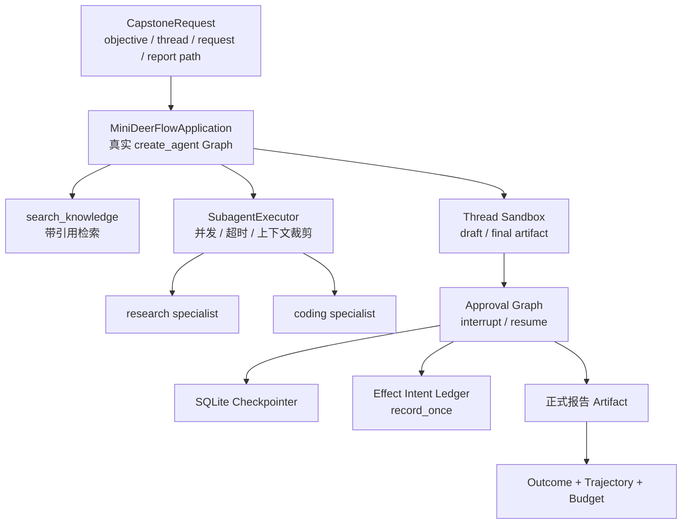
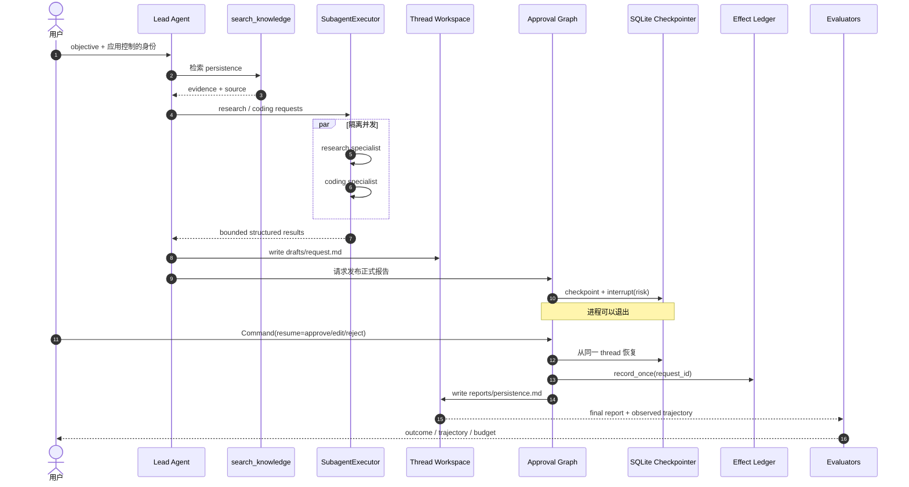
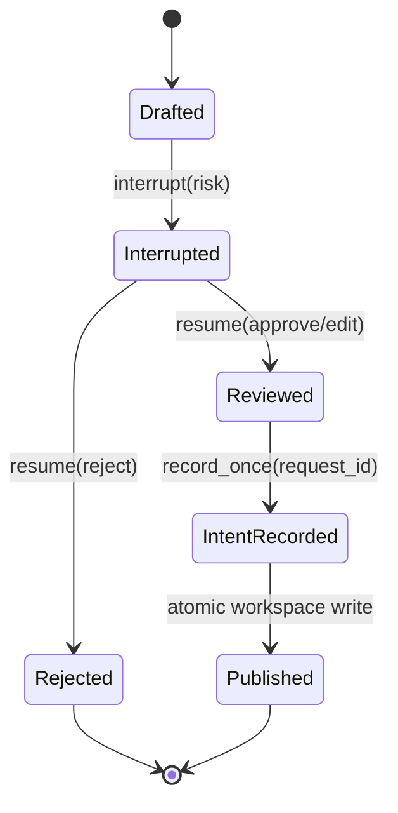

> 校准日期：2026-07-14  
> 前置：课程 01–11、Lead/Sandbox/Runtime/Evaluation 四篇专题  
> 代码事实源：`mini_deerflow/capstone.py`  
> 自动验收：`tests/test_mini_deerflow_capstone.py`

> **本章导航**
> **本篇只解决一个问题**：怎样把前面分别验证的能力装成一条可恢复、可审批、可评测的研究交付链。
>
> **当前系统**：检索、Subagent、Sandbox、Checkpoint、审批、Runtime 与评测都已建立公共接缝。
>
> **遇到的问题**：零件各自通过测试，不代表它们组合后不会在恢复、重复请求或部分失败时互相破坏。
>
> **本篇目标**：装配完整纵切面，并用正常完成、重建恢复、重复 resume 与断线重放验证边界。
>
> **暂时不讲**：重新发明一套 Capstone 框架或复制生产级 DeerFlow。
>
> **读完以后**：你能从空目录按能力依赖重建 Mini DeerFlow，并指出每一步的验证证据。
>
> **预计时间**：60～90 分钟。

## 零件已经齐了，这次只装配一条交付链

用户给出一个研究目标：调查 LangGraph persistence，并交付一份带引用的实现建议。默认场景先让两个 specialist 完成，草稿写完后真实关闭 Checkpointer，再由新实例恢复审批。

主链跑通后，我们会分别注入 research 超时、重复 resume 和 SSE 断线。这些故障共享同一组接缝，但不伪装成已经存在的一条“全故障 runner”。

这不是额外编出的边缘情况。一个长任务只要经过检索、委派、人工审批和外部写入，就迟早会遇到部分失败、进程重建和重复请求。前面各章已经分别解决这些问题，现在要看它们能否共同守住一次真实交付。

这里没有新的“Capstone 框架”。[第 03 章](/langchain-logbook/posts/03_rag_20/)留下本地检索，[Lead 专题](/langchain-logbook/posts/lead_agent_core/)留下 `create_agent` 组合根，[第 11 章](/langchain-logbook/posts/11_multi_agent_patterns/)留下委派接缝。

[Sandbox 专题](/langchain-logbook/posts/sandbox_extensions/)负责草稿与正式产物，[第 06 章](/langchain-logbook/posts/06_observability_persistence/)和[第 10 章](/langchain-logbook/posts/10_human_in_the_loop/)负责跨进程审批，[评测专题](/langchain-logbook/posts/evaluation_observability/)负责判断交付是否真的合格。

`capstone.py` 只把这些公共接缝按业务顺序接起来。若这里又出现一套 Executor、Sandbox、Checkpointer 或 evaluator，装配就已经越界。

## 0. 先让完整交付跑一遍

在读里程碑和目录之前，先看这套装配会留下什么事实：

```bash
make mini-deerflow-capstone
```

默认写入 `.capstone-demo`。输出中先找五个字段：

```json
{
  "status": "completed",
  "subagent_statuses": ["completed", "completed"],
  "effect_status": "recorded",
  "effect_count": 1,
  "checkpoint_reopened": true,
  "evaluation": {"pass_rate": 1.0}
}
```

`checkpoint_reopened=true` 证明暂停与恢复没有共用同一 Checkpointer 对象，`effect_count=1` 证明本地发布意图没有重复记录。后文会拆开这些字段的来源，再逐个破坏交接点。

## 1. 先把一次“交付成功”说清楚

程序返回 `completed`，只能说明函数走到了末尾。若报告写错用户目录、跳过审批，或重放时发布两次，这次交付仍然失败。

开始装配前，先写下下面七个问题。后面的运行输出、持久化记录和 evaluator 必须逐一给出证据：

- 输入中的身份、Thread 和 Request 分别由谁拥有？
- Lead 与 Subagent 是否共享了不该共享的上下文？
- 报告为何先进入 draft，审批前为何不能出现在正式路径？
- interrupt 期间进程退出后，恢复依靠什么事实？
- 同一 Request 重放为何不会增加第二条 effect intent？
- 最终文本正确但跳过审批或写错路径时，哪个 evaluator 会失败？
- SSE 断线、Run 取消和 checkpoint 恢复为什么不是同一机制？

## 2. 一份请求要经过哪些公共接缝

先把研究目标沿调用链走一遍。图中每个方框都来自前文；新增的只有顺序和交接条件。

<!-- diagram:id=capstone-system-boundaries -->


**图的文本替代**：请求先进入 Mini DeerFlow Application 完成检索。装配层继续使用同一组合根中的 Subagent registry 和 Sandbox provider。两个 specialist 只返回有界结果，长正文进入线程工作区。

Approval Graph 把 interrupt 写入 SQLite checkpoint。恢复后，系统先验证待发布内容，再把发布意图写入幂等 ledger，生成正式 Artifact。结果、轨迹和预算随后分别验收。

读图时先沿请求进入 Application，再看检索、委派和工作区如何汇成草稿。最后顺着 Approval Graph 走到 Checkpointer、Ledger、正式报告和评测。这正是任务实际发生的次序。

`capstone.py` 承担综合实战装配（Capstone Assembly）的职责：决定何时调用已有接口，以及上一阶段的什么结果可以进入下一阶段。模型、工具、Subagent、Sandbox、Checkpointer 和 evaluator 都由原模块提供。

### 2.1 先在 `capstone.py` 找六个交接点

先别从第一行顺读。搜索下面六处，可以直接看到一次研究交付如何向前推进：

1. `CapstoneRequest`：report_path 在任何 workspace/effect 出现前验证；
2. `application.invoke()`：真实 Lead model → search → model；
3. `executor.dispatch_many()`：research/coding 并发且只接收安全 context；
4. draft write + draft evaluation：大正文先落 workspace，不合格就停在审批前；
5. 两次 `open_sqlite_checkpointer()`：interrupt 与 resume 之间真实关闭并重开；
6. pre-publish evaluation → ledger → final write → final evaluation：先验收，再记账和交付。

六处连起来后，再打开 helper 查看 Schema 细节。此时每个字段都有业务位置，不会把综合实战读成又一次目录导览。

## 3. 从空目录逐步建立项目

如果直接复制 `capstone.py`，最容易得到一个“能跑但说不清”的项目。更可靠的做法是回到空目录，按全书出现过的依赖顺序重建公共接缝。

下面的里程碑不是第二份课程目录。每一行都回答一个具体问题：此刻新增哪份事实，立刻用什么证据验证，又有哪些机制还不该提前出现。


> **离线运行说明**：里程碑中的 Fake Model 不调用真实供应商，只提供可重复的模型消息。它用于验证完整 Agent/Graph 路径，开放式回答质量仍需真实模型实验和评测。

| 里程碑 | 新增事实源 | 立即反馈 | 失败时不要提前补什么 |
|---|---|---|---|
| M0 环境 | `pyproject.toml`、lock、offline profile | 公共 import 与 fake model | 不接真实 Key |
| M1 契约 | Request、Plan、Artifact、SubagentResult | Pydantic success/failure | 不写 Agent 循环 |
| M2 Lead | model factory、knowledge tool、`create_agent` | model→tool→model 轨迹 | 不先加 Subagent |
| M3 数据边界 | Context、State、Store、reducers | 生命周期/隔离测试 | 不把 Secret 放 State |
| M4 治理 | Middleware chain | 顺序、权限、预算、错误测试 | 不把 hook 当 Graph Node |
| M5 控制与恢复 | StateGraph、SQLite checkpoint、interrupt | 跨重建 resume | 不用 `input()` |
| M6 委派 | registry、executor、task tool | 并发、超时、输出预算 | 不共享完整消息历史 |
| M7 工作区 | Sandbox provider、Artifact | traversal/symlink 拒绝 | 不声称本地目录是容器 |
| M8 产品 Runtime | Thread/Run/Event、SSE Gateway | replay/cancel/ownership | 不让 HTTP body 选择身份 |
| M9 质量闭环 | Dataset、trajectory、trace root | regression/security gate | 不让 judge 代替授权 |
| M10 综合交付 | `capstone.py` | 长任务 e2e + 故障演练 | 不复制平行实现 |

### 3.1 先证明参考工程没有隐藏依赖

先做一次机械验证：把课程仓库当作只读参考源，将最终闭环所需的 package、锁文件、测试和命令入口复制到全新目录。这样不会偷偷借用当前仓库的 `Makefile`、环境变量或工作区文件。

```bash
export COURSE_ROOT=/absolute/path/to/langchain-logbook
mkdir -p /tmp/my-mini-deerflow
cd /tmp/my-mini-deerflow
git init

cp "$COURSE_ROOT/pyproject.toml" "$COURSE_ROOT/uv.lock" "$COURSE_ROOT/README.md" .
cp "$COURSE_ROOT/Makefile" "$COURSE_ROOT/langgraph.json" .
cp -R "$COURSE_ROOT/mini_deerflow" "$COURSE_ROOT/tests" "$COURSE_ROOT/quality" .
mkdir -p scripts
cp "$COURSE_ROOT/scripts/validate_tutorials.py" scripts/

uv sync --locked --group dev
uv run --locked pytest -q tests/test_mini_deerflow_capstone.py
make mini-deerflow-capstone
```

四条命令依次证明：依赖可以锁定安装，Capstone 测试可独立运行，长任务能离线完成。它们验证的是参考工程可复现，不承担学习过程；检查完即可删除 `/tmp/my-mini-deerflow`。

### 3.2 再按全书顺序重建公共接缝

真正练习时另建一个空目录，不复制整个 `mini_deerflow/`。先创建下面的骨架，然后让对应章节和测试驱动每个公共接口出现。

```text
my-agent/
├── pyproject.toml
├── langgraph.json
├── mini_deerflow/
│   ├── schemas.py                 # M1
│   ├── models.py / knowledge/    # M2
│   ├── context.py / state.py     # M3
│   ├── middleware/               # M4
│   ├── graph/ / persistence.py   # M5
│   ├── subagents/                # M6
│   ├── sandbox/ / tools/         # M7
│   ├── runtime/ / api/           # M8
│   ├── evals/ / observability.py # M9
│   └── capstone.py               # M10，只做装配
└── tests/
```

骨架只说明代码放在哪里，还没有证明接口正确。下一张表把每个里程碑接回现有测试：先复制测试观察失败，再实现本关接口，最后同时运行本关测试和全部旧测试。

| 关卡 | 复制的测试契约 | 本关通过命令 |
|---|---|---|
| M1 | `test_mini_deerflow_schemas.py` | `uv run pytest -q tests/test_mini_deerflow_schemas.py` |
| M2 | models/knowledge/lead-agent tests | `uv run pytest -q tests/test_mini_deerflow_{models,knowledge,lead_agent}.py` |
| M3 | context-engineering tests | `uv run pytest -q tests/test_mini_deerflow_context_engineering.py` |
| M4 | middleware tests | `uv run pytest -q tests/test_mini_deerflow_middleware.py` |
| M5 | graph + persistence/HITL tests | `uv run pytest -q tests/test_mini_deerflow_graph_workflows.py tests/test_mini_deerflow_persistence_hitl.py` |
| M6 | subagent tests | `uv run pytest -q tests/test_mini_deerflow_subagents.py` |
| M7 | sandbox extension tests | `uv run pytest -q tests/test_mini_deerflow_sandbox_extensions.py` |
| M8 | Runtime/Gateway tests | `uv run pytest -q tests/test_mini_deerflow_runtime_gateway.py` |
| M9 | evaluation/observability tests | `uv run pytest -q tests/test_mini_deerflow_evaluation_observability.py` |
| M10 | capstone tests | `uv run pytest -q tests/test_mini_deerflow_capstone.py` |

M2 命令使用了 Shell brace 展开；若当前 shell 不支持，就逐个列出文件。每关还要运行 `uv run pytest -q`，确认新增能力没有破坏旧契约。

这里有一条硬约束：不要从 `capstone.py` 反向复制全部模块。综合实战依赖前文公共接缝，不能反过来成为这些接缝的定义来源。

## 4. 进程退出发生在任务正中间

模块关系清楚后，再看时间顺序。最关键的一刻不是最终写文件，而是 Graph 已经保存审批暂停、当前进程却不再存在。

<!-- diagram:id=capstone-long-task-sequence -->


**图的文本替代**：Lead 先检索，再把研究和代码分析并发交给两个隔离 specialist，结果汇成草稿。发布请求在 Approval Graph 中 checkpoint 并 interrupt。即使进程退出，暂停事实仍留在 SQLite 中。

恢复后，ledger 用 request ID 记录一次发布意图，正式报告写入工作区，最终结果和完整轨迹再进入评测。

读图时先看 Lead 如何取得材料，再看 Workspace、Approval Graph 和 Checkpointer 如何保存“尚未发布”的事实。最后沿 Ledger、正式写入和 Evaluators 检查副作用与交付质量。

这条时序把前文三个边界放在一起：第 11 章的委派只返回受控结果，第 10 章的 `interrupt` 只暂停 Graph，Sandbox 保存的大正文也不会被塞进 checkpoint。

## 5. 把批准、重放和拒绝放进同一工作区

刚才的命令使用确定性 fake model 和本地知识库，不需要模型 Key。`pass_rate=1.0` 也不能单独证明安全；现在把 approve、同一 request 重放和 reject 放进同一临时工作区，逐项观察控制流。

共享工作区很重要：若每次都换目录，就观察不到 ledger 如何识别重复发布。

> 这是一段普通 `.py` 脚本，所以用 `asyncio.run(...)` 启动协程。在 Jupyter 中请把三次调用分别改成顶层 `await`，不要在已经运行的事件循环里再次调用 `asyncio.run(...)`。

```python
import asyncio
from pathlib import Path
from tempfile import TemporaryDirectory

from mini_deerflow.capstone import CapstoneRequest, run_capstone_scenario
from mini_deerflow.graph import ApprovalDecision


with TemporaryDirectory() as directory:
    request = CapstoneRequest(
        request_id="capstone-lab",
        thread_id="thread-capstone-lab",
        user_id="learner",
        objective="研究 LangGraph persistence，并交付带引用的实现建议",
        report_path="reports/persistence.md",
    )
    first = asyncio.run(
        run_capstone_scenario(request, workspace_root=directory)
    )
    replay = asyncio.run(
        run_capstone_scenario(request, workspace_root=directory)
    )
    reject = asyncio.run(
        run_capstone_scenario(
            CapstoneRequest(
                request_id="capstone-reject",
                thread_id="thread-capstone-reject",
                user_id="learner",
                objective="研究安全恢复",
                report_path="reports/rejected.md",
            ),
            workspace_root=directory,
            decision=ApprovalDecision(
                decision="reject",
                reason="引用不足",
            ),
        )
    )
    trajectory = first.evaluation.results[0].metrics[1].details["observed"]
    report = Path(first.artifact_path).read_text(encoding="utf-8")

    print("first_status =", first.status)
    print("subagent_statuses =", first.subagent_statuses)
    print("checkpoint_reopened =", first.checkpoint_reopened)
    print("first_effect =", first.effect_status, first.effect_count)
    print("replay_effect =", replay.effect_status, replay.effect_count)
    print("trajectory =", trajectory)
    print(
        "report_sections_present =",
        all(term in report for term in ("研究摘要", "代码建议", "引用")),
    )
    print("reject_status =", reject.status)
    print("reject_effect_count =", reject.effect_count)
    print("reject_has_final_artifact =", reject.artifact_path is not None)
    print("reject_draft_exists =", Path(reject.draft_path).is_file())
```

```text
first_status = completed
subagent_statuses = ('completed', 'completed')
checkpoint_reopened = True
first_effect = recorded 1
replay_effect = already_recorded 1
trajectory = ['model', 'search_knowledge', 'model', 'subagent:research', 'subagent:coding', 'interrupt:risk', 'resume:approve', 'write_workspace_file']
report_sections_present = True
reject_status = rejected
reject_effect_count = 0
reject_has_final_artifact = False
reject_draft_exists = True
```

先比较 `first_effect` 和 `replay_effect`。第二次运行仍会经过研究、草稿和审批，但稳定的 request ID 让 ledger 返回 `already_recorded`，记录总数始终为 1。

再看 reject 的四行。拒绝是一种业务终态，草稿仍然存在；正式 Artifact 和 effect intent 则都没有产生。系统保留了审阅依据，却没有越过用户决定执行发布。

**动手修改一**：把 approve 改成 edit，并且只修改发布 path。确认 draft path 不变、final path 改变、effect count 仍为 1。

**动手修改二**：从 trajectory 中删除 `interrupt:risk`，再单独运行 trajectory evaluator。报告内容可能仍满足 outcome，但执行路径已经绕开人工审批，发布必须被阻止。

最后回到第 1 节的验收问题。一次交付至少要同时留下下面五类证据：

1. `artifact_path` 位于 user/thread digest 对应 workspace；
2. 报告含 Lead 检索结论、研究摘要、代码建议和引用；
3. trajectory 精确为 `model → search → model → research → coding → interrupt → resume → write`；
4. 第二次用同一 request 运行时 `effect_status=already_recorded` 且 `effect_count=1`；
5. `decision=reject` 时 draft 存在、正式 Artifact 不存在、effect count 为 0。

## 6. 草稿不能只活在局部变量里

假设报告正文只保存在 Python 局部变量中。Graph 执行到 `interrupt` 后，SQLite 能恢复审批 state；进程一旦关闭，待审正文却已经消失。用户面对的是一条还能批准、但批准后无物可发的记录。

[Sandbox 专题](/langchain-logbook/posts/sandbox_extensions/)已经给出了线程工作区。这里先把正文写入 `drafts/<request-id>.md`，checkpoint 只保存 path 和 SHA-256。四种事实因此各归其位：

- Workspace 保存大对象正文；
- Graph State/Checkpoint 保存恢复控制所需的小事实；
- Effect Ledger 保存发布意图及其 digest；
- Artifact 引用进入最终结果。

本地文件只是课程中的可执行 adapter。正文若需要协作事务、全文搜索或权限查询，应替换为业务数据库或对象存储 provider；Graph State 仍只保存恢复控制所需的小事实。

## 7. 批准之后，也不能立刻写正式文件

进程重建后，用户可能批准、编辑或拒绝。真正危险的是批准分支：客户端超时重试、worker 重启或消息重复投递，都可能让同一次发布被执行两遍。

状态机把“用户已经决定”“发布意图已经记账”和“正式文件已经写成”拆成三个可检查的事实。

<!-- diagram:id=capstone-approval-state -->


**图的文本替代**：草稿完成后，任务暂停并等待风险审批。拒绝直接结束，不记录发布意图。批准或编辑先通过 request ID 幂等记录 intent，再原子写入正式文件。

读图时从 Drafted 进入 Interrupted，先看 reject 如何短路，再看 approve/edit 如何经过 intent 才抵达 Published。Rejected 和 Published 都是终态，旧 Run 不能被原地改回 running。

本地 ledger 只能证明：相同 operation ID 和相同 payload 只记录一次。若正式副作用是邮件、GitHub push 或支付，还需要 provider idempotency key 或 transactional outbox，不能从本地去重推导远端 exactly-once。

发布前还要经过两道确定性质量门。草稿完成后，先检查 specialist 状态、必需内容和预算；审批恢复后，再检查截至 resume 的精确轨迹。任一道失败，正式 Artifact 都不会出现。

真实写入完成后，最终评测再次检查完整轨迹。前一道门保护副作用，后一道评测保护回归基线；两者复用了[评测专题](/langchain-logbook/posts/evaluation_observability/)的同一观察与 evaluator 接缝。

## 8. 把故障放进接缝，而不是只测顺畅路径

顺畅输出已经跑通，现在要主动破坏每个交接点。下面每种故障都对应一个可观察事实；若只能看到统一的 `error`，就还无法判断边界是否守住。

| 注入点 | 方法 | 预期事实 | 防回归入口 |
|---|---|---|---|
| research specialist 超时 | 缩短 executor timeout + slow handler | research 为 `timed_out`，coding 不被取消，质量门阻止审批/发布 | Capstone + Subagent tests |
| 恶意父上下文 | 加入 auth token/object | 不在 allowlist 中，不进入 specialist | Context/Subagent tests |
| 路径穿越 | report path=`../x.md` | Request 校验立即拒绝，尚未创建 workspace/effect | Capstone + Sandbox tests |
| 审批拒绝 | `ApprovalDecision(reject)` | draft 保留、final/effect 缺失 | Capstone rejection test |
| 审批 edit | 修改 path/digest payload | 新 payload 在 ledger 记账前通过 `PublishIntent` 验证 | Capstone edit tests |
| interrupt 后重建 | 关闭并重新打开 SQLite checkpointer | 同 thread 可继续 | Capstone + persistence tests |
| 同 request 重放 | 完整场景运行两次 | intent count 始终 1 | Capstone replay test |
| SSE 断线 | 关闭 subscriber 后传 Last-Event-ID | producer 继续、journal 可重放 | Runtime tests |
| worker 重启 | 留下 pending/running record | 转为 worker_restarted/error/end | Runtime recovery test |
| 表面正确、路径错误 | 从 trajectory 删除 interrupt | outcome 可能通过、trajectory 失败 | Evaluation tests |

表中最容易混淆的是 checkpoint 恢复、SSE 重放和 worker recovery。它们分别属于 Graph、Runtime Event Journal 和产品 Run，不能用其中一个测试替代另外两个。

先运行四个代表性节点，观察质量门、输入校验和事件日志各自在哪里失败：

```bash
# specialist 超时必须在审批/effect 前被质量门拒绝
uv run pytest -q \
  tests/test_mini_deerflow_capstone.py::MiniDeerFlowCapstoneTests::test_subagent_timeout_fails_quality_gate_before_approval_or_publish

# edit 后的 path 必须在 ledger 记账前验证
uv run pytest -q \
  tests/test_mini_deerflow_capstone.py::MiniDeerFlowCapstoneTests::test_edit_path_is_validated_before_effect_intent_is_recorded

# SSE 断开/Last-Event-ID 重放属于产品 Runtime 纵切面
uv run pytest -q \
  tests/test_mini_deerflow_runtime_gateway.py::SqliteRuntimeRepositoryTests::test_sse_frames_are_replayable_after_last_event_id

# worker 重启后 orphaned Run 必须形成可重放终态
uv run pytest -q \
  tests/test_mini_deerflow_runtime_gateway.py::SqliteRuntimeRepositoryTests::test_local_worker_restart_marks_orphaned_active_runs_error_and_replayable
```

### 8.1 把单点证据写成一次故障演练设计

单点测试通过后，可以扩展 runner：coding specialist 成功、research 超时；草稿生成后 interrupt；关闭进程；恢复时选择 edit；发布事件消费中途断线；重连后重复发送 resume。

当前仓库为每个交接点提供可执行测试，没有声称这条组合故障 runner 已经实现。扩展后的合格结果应是：每一步都有可解释状态，没有越权写入或重复 intent，而且 Run 与 Event 最终一致。

## 9. 把同一业务交给产品 Runtime

`capstone.py` 到这里已经证明 Harness 内的领域闭环。接入产品后，客户端不会直接等待这个 Python 函数返回；[Runtime 专题](/langchain-logbook/posts/runtime_gateway/)中的 `LocalRunManager` 或 Agent Server 要拥有 Run 生命周期：

```text
POST /threads
→ POST /threads/{id}/runs
→ GET events (SSE)
→ interrupted + approval payload
→ POST /threads/{id}/runs/resume
→ 新 Run 继续同一 checkpoint thread
→ replay events after Last-Event-ID
```

这条链中有四种不同 ID：Capstone Request、产品 Run、Graph checkpoint thread 和 HTTP request。它们可以通过 `correlation_id` 关联，但 `run_id`、`thread_id` 和 `request_id` 仍要放进类型明确的 metadata 字段。

默认 runner 只验证 Harness 内的业务闭环，不伪装成 HTTP/SSE 集成测试。断线、重连、取消和 worker recovery 继续由产品纵切面测试负责。

后面的扩展任务 C 会把两条纵切面真正接起来。届时必须运行前面的 SSE/worker 测试，不能拿 capstone 的内存返回值冒充 Runtime Event Journal。

## 10. 一份好报告还不够

模型生成的报告有多种合理写法，固定一篇“黄金全文”反而会惩罚正常差异。这里把交付拆成五类可判定事实：

- Outcome：必须有引用、研究摘要、代码建议；
- Trajectory：必须先检索和委派，再 interrupt/resume，最后写正式文件；
- Budget：Lead + 两个 specialist 的模型/工具调用不得超上限；
- Security：路径、权限、重复副作用由确定性测试硬失败；
- Recovery：checkpointer 必须真的关闭并重新打开，而不是同一对象继续。

Outcome 回答“交付了什么”，Trajectory 回答“怎样交付”，Budget 约束成本，Security 和 Recovery 则守住权限与恢复边界。五者分开，失败时才能知道该修 Prompt、Graph 还是产品外壳。

发布基线要把 `capstone/long-running/critical` tags 分开统计。任何 critical 案例出现新的失败，都应阻止发布。

## 11. 沿公共接缝扩展，不修改装配骨架

下面四项练习分别替换委派能力、发布能力、产品外壳和架构决策。每项都要求沿已有 Protocol 或组合根扩展；如果必须复制 `run_capstone_scenario()`，先停下来检查接缝是否选错。

### A. 让 compliance specialist 加入委派

定义 capability、允许的 Context 字段、最大输出和失败结果，但不要修改 `SubagentExecutor`。把它注册到第 11 章留下的 registry，加入并发委派，再更新 trajectory 契约。

### B. 把本地发布换成 provider

沿 Sandbox 专题中的 Protocol 替换最后一次本地写入，可选择对象存储或 Git provider。必须设计 provider idempotency key，不能把本地 effect ledger 当成远端交付证明。

### C. 让产品 Runtime 接管执行

把 capstone Graph 交给 RunManager。用事件证明 interrupt 让旧 Run 形成 terminal `interrupted/end`，resume 创建新 Run，而且断线重连不会重复应用事件。

### D. 为一个真实分歧写 ADR

从“Graph-owned 还是 Gateway-owned trace root”“本地 Sandbox 还是远程容器”“Agent Server 还是自建 Gateway”任选一个，记录上下文、选项、决策和后果。不要只列优缺点，要给出当前项目的选择。

## 12. 用边界而不是代码量评分

综合实战不按文件数量或框架调用次数计分。下面的量规检查你能否说明事实归属、恢复路径和副作用保证；这些能力才决定项目能否继续扩大。

| 维度 | 0 分 | 1 分 | 2 分 |
|---|---|---|---|
| 领域边界 | ID/State/Context 混用 | 能运行但解释不全 | 所有者和生命周期清楚 |
| 控制流 | 只有顺畅路径 | 有错误返回 | interrupt/reject/replay 可恢复 |
| 委派 | 共享完整上下文 | 有 specialist | 输入裁剪、预算、部分失败 |
| 工作区 | 任意宿主路径 | 相对目录 | user/thread 隔离与 traversal 测试 |
| 副作用 | resume 可重复执行 | 本地去重 | 明确本地/远端保证边界 |
| Runtime | 只返回最终文本 | 有 stream | Run 状态、journal、replay/cancel |
| 质量 | 肉眼看答案 | outcome 分 | trajectory/budget/security 分离 |
| 迁移 | 照抄目录 | 能指出相似模块 | 能选择 seam 并解释不复制什么 |

总分低于 13/16，项目还没有形成稳定闭环。即使总分达标，只要工作区、副作用或恢复任一项为 0，也不算完成；这三项出错会直接造成越权、重复交付或无法继续任务。

## 13. 最后让自动验收复核证据

先运行 Capstone 的窄测试和离线场景，再运行全仓检查。前两条让失败靠近综合实战，最后一条负责发现对既有章节和公共模块的回归。

```bash
uv run --locked pytest -q tests/test_mini_deerflow_capstone.py
make mini-deerflow-capstone
make check
```

三条命令都通过后，再逐项对照业务证据。勾选的是可观察事实，不是“代码大概写过”：

- [ ] approve 路径发布正式报告；
- [ ] reject 路径没有正式报告和 effect intent；
- [ ] Checkpointer 在 interrupt/resume 之间真实重开；
- [ ] 同 Request replay 的 intent count 为 1；
- [ ] research/coding 上下文隔离且均走真实临时 Agent；
- [ ] Outcome/Trajectory/Budget 全通过；
- [ ] 文档图与代码真实路径一致。

## 14. 现在可以进入 DeerFlow 了

这次装配没有增加新框架，却把全书的能力放进了同一次故障频发的交付。你已经看到：Lead 负责主循环，Subagent 接受裁剪后的任务，Workspace 保存大正文，Checkpoint 保存恢复事实，Ledger 约束副作用，Evaluator 检查交付结果和路径。

打开 DeerFlow 源码前，先写下五个答案：哪个模块拥有 root graph？ThreadState 为什么不保存 Workspace 正文？task tool 如何裁剪上下文？RunJournal 与 trace provider 有何不同？Gateway 为什么还需要 Run/Event store？

随后按 [`DEERFLOW_GUIDE.md`](/langchain-logbook/posts/deerflow_guide/) 沿调用链逐一验证。若真实项目采用不同实现，先判断职责落在哪里，再比较目录名称。这样读到的是同一组工程问题在更大系统中的答案。

继续阅读：[从 Mini DeerFlow 进入真实 DeerFlow](/langchain-logbook/posts/deerflow_guide/)。