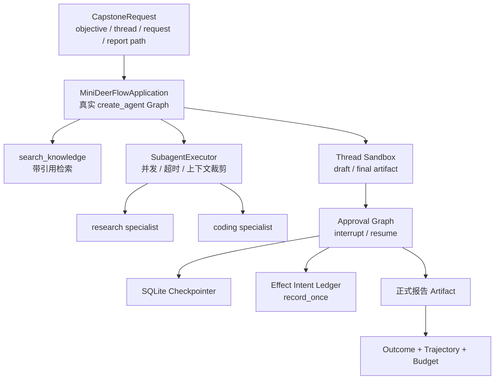
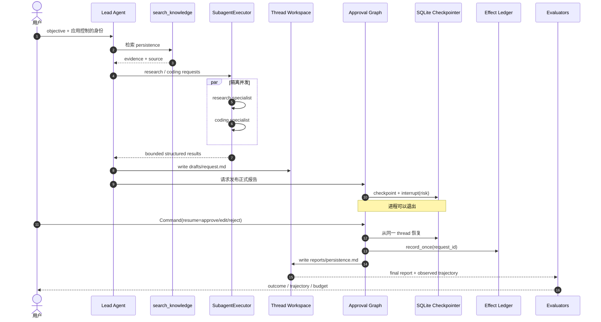
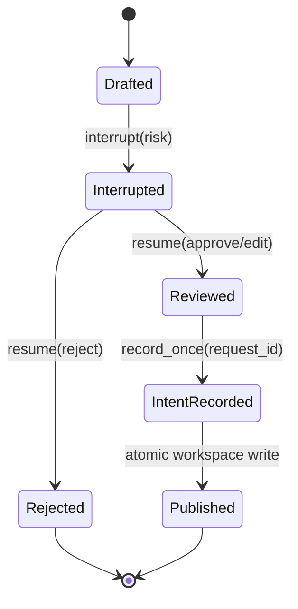

> 校准日期：2026-07-14  
> 前置：课程 01–11、Lead/Sandbox/Runtime/Evaluation 四篇专题  
> 代码事实源：`mini_deerflow/capstone.py`  
> 自动验收：`tests/test_mini_deerflow_capstone.py`

## 系统快照：所有能力都已验证，现在只允许装配，不再发明第二套框架

前面的章节已经分别验证模型、Schema、检索、Lead、Graph、恢复、审批、Subagent、Sandbox、Runtime 和评测。本篇把这些公共接缝装配成同一条研究交付纵切面。

上一篇已经区分 Run success 与交付质量。本篇把两者放到同一任务里：Graph 和 Subagent 先形成草稿，draft quality gate 决定能否进入审批；审批恢复后还有 pre-publish gate，正式写入后再做最终评测。

因此你不会再学新的“Capstone 框架”。所有类都应能在前文找到来源；如果 assembly 中出现第二套 Executor、Sandbox、Checkpointer 或 evaluator，就说明装配已经越界。

最终业务需求是：用户提交研究目标，Lead 检索本地知识，research/coding specialist 并行形成证据与实现建议；报告先写入线程草稿区，服务重建后由用户批准、编辑或拒绝；批准只记录一次副作用意图，并用结果、轨迹和预算评测证明交付质量。

## 1. 验收先于实现

完成后必须能用证据回答：

- 输入中的身份、Thread 和 Request 分别由谁拥有？
- Lead 与 Subagent 是否共享了不该共享的上下文？
- 报告为何先进入 draft，审批前为何不能出现在正式路径？
- interrupt 期间进程退出后，恢复依靠什么事实？
- 同一 Request 重放为何不会增加第二条 effect intent？
- 最终文本正确但跳过审批或写错路径时，哪个 evaluator 会失败？
- SSE 断线、Run 取消和 checkpoint 恢复为什么不是同一机制？

## 2. 总架构：复用已有模块，不造第二套最终版

<!-- diagram:id=capstone-system-boundaries -->


**图的文本替代**：请求进入真实 Mini DeerFlow Application 完成检索；Capstone assembly 复用同一组合根的 Subagent registry 和 Sandbox provider。两个 specialist 返回有界摘要，草稿进入线程工作区。

Approval Graph 把 interrupt 写入 SQLite checkpoint。恢复后，系统把发布意图写入幂等 ledger，发布正式 Artifact，再由三类 evaluator 验收。

**读图顺序**：先沿左上请求进入 Application，再分别追踪检索、委派和工作区三条能力线，最后从 Approval Graph 向 Checkpointer、Ledger、正式报告与评测顺序阅读。

`capstone.py` 是 assembly，不是新 Agent 框架。它不重新实现模型、工具、Subagent、Sandbox、Checkpointer 或 evaluator，只决定本业务纵切面按什么顺序调用已有公共接口。

### 2.1 第一次阅读 capstone.py 的六个停靠点

不要从第一行逐句读到最后。先用下面六个停靠点建立主链：

1. `CapstoneRequest`：report_path 在任何 workspace/effect 出现前验证；
2. `application.invoke()`：真实 Lead model → search → model；
3. `executor.dispatch_many()`：research/coding 并发且只接收安全 context；
4. draft write + draft evaluation：大正文先落 workspace，不合格就停在审批前；
5. 两次 `open_sqlite_checkpointer()`：interrupt 与 resume 之间真实关闭并重开；
6. pre-publish evaluation → ledger → final write → final evaluation：先验收，再记账和交付。

读完这六处，再查看各 helper 的 Schema 细节。这样你追踪的是一条业务事务，而不是重新浏览所有模块。

## 3. 从空目录逐步建立项目

学习者可以在空目录中按以下里程碑重建，而不是复制最终文件。每一步必须先通过对应测试，再进入下一步。

| 里程碑 | 新增事实源 | 立即反馈 | 失败时不要提前补什么 |
|---|---|---|---|
| M0 环境 | `pyproject.toml`、lock、offline profile | 公共 import 与 fake model | 不接真实 Key |
| M1 契约 | Request、Plan、Artifact、SubagentResult | Pydantic success/failure | 不写 Agent 循环 |
| M2 Lead | model factory、knowledge tool、`create_agent` | model→tool→model 轨迹 | 不先加 Subagent |
| M3 数据边界 | Context、State、Store、reducers | 生命周期/隔离测试 | 不把 Secret 放 State |
| M4 治理 | Middleware chain | 顺序、权限、预算、错误测试 | 不把 hook 当 Graph Node |
| M5 控制与恢复 | StateGraph、SQLite checkpoint、interrupt | 跨重建 resume | 不用 `input()` |
| M6 委派 | registry、executor、task tool | 并发、超时、输出预算 | 不共享完整消息历史 |
| M7 工作区 | Sandbox provider、Artifact | traversal/symlink 拒绝 | 不声称本地目录是容器 |
| M8 产品 Runtime | Thread/Run/Event、SSE Gateway | replay/cancel/ownership | 不让 HTTP body 选择身份 |
| M9 质量闭环 | Dataset、trajectory、trace root | regression/security gate | 不让 judge 代替授权 |
| M10 综合交付 | `capstone.py` | 长任务 e2e + 故障演练 | 不复制平行实现 |

### 3.1 路线 A：先在真正的空目录验证最终参考工程

下面命令不会假装空目录里已经存在 `Makefile`。先把本课程仓库的绝对路径设为只读参考源，再把形成最终闭环所需的 package、锁文件、测试和命令入口复制到一个全新目录：

```bash
export COURSE_ROOT=/absolute/path/to/langchain-logbook
mkdir -p /tmp/my-mini-deerflow
cd /tmp/my-mini-deerflow
git init

cp "$COURSE_ROOT/pyproject.toml" "$COURSE_ROOT/uv.lock" "$COURSE_ROOT/README.md" .
cp "$COURSE_ROOT/Makefile" "$COURSE_ROOT/langgraph.json" .
cp -R "$COURSE_ROOT/mini_deerflow" "$COURSE_ROOT/tests" "$COURSE_ROOT/quality" .
mkdir -p scripts
cp "$COURSE_ROOT/scripts/validate_tutorials.py" scripts/

uv sync --locked --group dev
uv run --locked pytest -q tests/test_mini_deerflow_capstone.py
make mini-deerflow-capstone
```

这条路线证明“空目录 → 安装 → 测试 → 长任务”没有隐藏文件依赖。它是最终参考工程的可复现验证，不等于学习过程；验证后删除 `/tmp/my-mini-deerflow` 即可。

### 3.2 路线 B：在自己的空目录按关卡重建

学习时新建另一个目录，不复制整个 `mini_deerflow/`。先建立以下骨架，文件内容由对应课程章节和测试驱动完成：

```text
my-agent/
├── pyproject.toml
├── langgraph.json
├── mini_deerflow/
│   ├── schemas.py                 # M1
│   ├── models.py / knowledge/    # M2
│   ├── context.py / state.py     # M3
│   ├── middleware/               # M4
│   ├── graph/ / persistence.py   # M5
│   ├── subagents/                # M6
│   ├── sandbox/ / tools/         # M7
│   ├── runtime/ / api/           # M8
│   ├── evals/ / observability.py # M9
│   └── capstone.py               # M10，只做装配
└── tests/
```

每关都从课程仓库复制对应测试为“外部行为契约”，先观察失败，再实现最小公共接口，最后运行该关和此前所有测试：

| 关卡 | 复制的测试契约 | 本关通过命令 |
|---|---|---|
| M1 | `test_mini_deerflow_schemas.py` | `uv run pytest -q tests/test_mini_deerflow_schemas.py` |
| M2 | models/knowledge/lead-agent tests | `uv run pytest -q tests/test_mini_deerflow_{models,knowledge,lead_agent}.py` |
| M3 | context-engineering tests | `uv run pytest -q tests/test_mini_deerflow_context_engineering.py` |
| M4 | middleware tests | `uv run pytest -q tests/test_mini_deerflow_middleware.py` |
| M5 | graph + persistence/HITL tests | `uv run pytest -q tests/test_mini_deerflow_graph_workflows.py tests/test_mini_deerflow_persistence_hitl.py` |
| M6 | subagent tests | `uv run pytest -q tests/test_mini_deerflow_subagents.py` |
| M7 | sandbox extension tests | `uv run pytest -q tests/test_mini_deerflow_sandbox_extensions.py` |
| M8 | Runtime/Gateway tests | `uv run pytest -q tests/test_mini_deerflow_runtime_gateway.py` |
| M9 | evaluation/observability tests | `uv run pytest -q tests/test_mini_deerflow_evaluation_observability.py` |
| M10 | capstone tests | `uv run pytest -q tests/test_mini_deerflow_capstone.py` |

Shell brace 展开依赖当前 shell；若环境不支持，逐个列出 M2 文件。每关还要运行 `uv run pytest -q` 防止新能力破坏旧契约。不要从 `capstone.py` 反向复制全部模块；那会得到能运行却无法解释的项目。

## 4. 一次完整长任务的运行时序

<!-- diagram:id=capstone-long-task-sequence -->


**图的文本替代**：Lead 先检索，再把研究和代码分析并发委派给两个隔离 specialist；结果汇总为草稿。发布请求在 Approval Graph 中 checkpoint 并 interrupt，进程退出不丢失暂停事实。恢复后 ledger 以 request ID 记录一次发布意图，正式报告写入工作区，最终结果和全过程轨迹一起进入评测。

**读图顺序**：从用户到 Lead 向下读检索与并行委派，接着沿 Workspace → Approval Graph → Checkpointer 看暂停与重建，最后沿 Ledger → 正式写入 → Evaluators 看交付门禁。

## 5. 运行综合场景并读证据

```bash
make mini-deerflow-capstone
```

命令默认使用 `.capstone-demo`，运行前清理自己的演示目录；不会读取外部模型 Key。关键输出：

```json
{
  "status": "completed",
  "subagent_statuses": ["completed", "completed"],
  "effect_status": "recorded",
  "effect_count": 1,
  "checkpoint_reopened": true,
  "evaluation": {"pass_rate": 1.0}
}
```

上面的摘要适合快速检查。下面的实验把 approve、同 request 重放和 reject 放在同一个临时工作区，并打印每条验收证据：

> 这是一段普通 `.py` 脚本示例，因此用 `asyncio.run(...)` 启动协程。若复制到 Jupyter，请把三次调用分别改为 `first = await run_capstone_scenario(...)`、`replay = await ...` 和 `reject = await ...`，不要嵌套启动事件循环。

```python
import asyncio
from pathlib import Path
from tempfile import TemporaryDirectory

from mini_deerflow.capstone import CapstoneRequest, run_capstone_scenario
from mini_deerflow.graph import ApprovalDecision


with TemporaryDirectory() as directory:
    request = CapstoneRequest(
        request_id="capstone-lab",
        thread_id="thread-capstone-lab",
        user_id="learner",
        objective="研究 LangGraph persistence，并交付带引用的实现建议",
        report_path="reports/persistence.md",
    )
    first = asyncio.run(
        run_capstone_scenario(request, workspace_root=directory)
    )
    replay = asyncio.run(
        run_capstone_scenario(request, workspace_root=directory)
    )
    reject = asyncio.run(
        run_capstone_scenario(
            CapstoneRequest(
                request_id="capstone-reject",
                thread_id="thread-capstone-reject",
                user_id="learner",
                objective="研究安全恢复",
                report_path="reports/rejected.md",
            ),
            workspace_root=directory,
            decision=ApprovalDecision(
                decision="reject",
                reason="引用不足",
            ),
        )
    )
    trajectory = first.evaluation.results[0].metrics[1].details["observed"]
    report = Path(first.artifact_path).read_text(encoding="utf-8")

    print("first_status =", first.status)
    print("subagent_statuses =", first.subagent_statuses)
    print("checkpoint_reopened =", first.checkpoint_reopened)
    print("first_effect =", first.effect_status, first.effect_count)
    print("replay_effect =", replay.effect_status, replay.effect_count)
    print("trajectory =", trajectory)
    print(
        "report_sections_present =",
        all(term in report for term in ("研究摘要", "代码建议", "引用")),
    )
    print("reject_status =", reject.status)
    print("reject_effect_count =", reject.effect_count)
    print("reject_has_final_artifact =", reject.artifact_path is not None)
    print("reject_draft_exists =", Path(reject.draft_path).is_file())
```

```text
first_status = completed
subagent_statuses = ('completed', 'completed')
checkpoint_reopened = True
first_effect = recorded 1
replay_effect = already_recorded 1
trajectory = ['model', 'search_knowledge', 'model', 'subagent:research', 'subagent:coding', 'interrupt:risk', 'resume:approve', 'write_workspace_file']
report_sections_present = True
reject_status = rejected
reject_effect_count = 0
reject_has_final_artifact = False
reject_draft_exists = True
```

先比较 first_effect 与 replay_effect：第二次完整执行仍经过研究、草稿和审批，但稳定 request ID 让 ledger 返回 already_recorded，记录总数保持 1。

再看 reject 四行：拒绝不是异常。草稿仍是可恢复事实，正式 Artifact 和 effect intent 都没有产生；这与“删除所有痕迹”或“先记账再拒绝”都不同。

**动手修改一**：把 approve 改成 edit，并只修改发布 path。确认 draft path 不变、final path 改变、effect count 仍为 1。

**动手修改二**：在 trajectory 中删除 interrupt:risk，再单独运行 trajectory evaluator。说明 outcome 为什么仍可能通过，而发布仍应被阻止。

不要只看 `status`。应同时检查：

1. `artifact_path` 位于 user/thread digest 对应 workspace；
2. 报告含 Lead 检索结论、研究摘要、代码建议和引用；
3. trajectory 精确为 `model → search → model → research → coding → interrupt → resume → write`；
4. 第二次用同一 request 运行时 `effect_status=already_recorded` 且 `effect_count=1`；
5. `decision=reject` 时 draft 存在、正式 Artifact 不存在、effect count 为 0。

## 6. 为什么草稿必须先持久化

初版设计若只把报告正文保存在 Python 局部变量，interrupt 后进程重建虽然能恢复审批 state，却无法恢复待发布内容。综合场景先把正文写入 thread workspace 的 `drafts/<request-id>.md`，checkpoint 只保存 path 和 SHA-256：

- Workspace 保存大对象正文；
- Graph State/Checkpoint 保存恢复控制所需的小事实；
- Effect Ledger 保存发布意图及其 digest；
- Artifact 引用进入最终结果。

这不是“把所有东西都存文件”。如果正文有协作事务、搜索或权限查询需求，应换成业务数据库/对象存储 provider；本地文件只是课程可执行 adapter。

## 7. Approval 状态机与副作用边界

<!-- diagram:id=capstone-approval-state -->


**图的文本替代**：草稿完成后进入风险审批暂停。拒绝直接终止且不记录发布意图；批准或编辑后先以 request ID 幂等记录 intent，再原子写正式文件。发布和拒绝都是终态，不能把旧 Run 原地改回 running。

**读图顺序**：从 Drafted 顺时针进入 Interrupted；先读 reject 短路，再读 approve/edit 经过 intent 和正式发布的路径，最后核对两条终态都不能回到 running。

本地 ledger 证明“相同 operation ID 与相同 payload 只记录一次”。它不证明远程邮件、GitHub push 或支付 exactly-once；远程系统仍需 provider idempotency key 或 transactional outbox。

发布前有两道确定性质量门：草稿完成后先检查 specialist 是否成功、必需内容和预算；审批恢复后再检查截至 resume 的精确轨迹。任一道失败都不会写正式 Artifact。最终评测在真实写入后再次验证完整轨迹，防止文档承诺和实际执行分离。

## 8. 故障注入手册

| 注入点 | 方法 | 预期事实 | 防回归入口 |
|---|---|---|---|
| research specialist 超时 | 缩短 executor timeout + slow handler | research 为 `timed_out`，coding 不被取消，质量门阻止审批/发布 | Capstone + Subagent tests |
| 恶意父上下文 | 加入 auth token/object | 不在 allowlist 中，不进入 specialist | Context/Subagent tests |
| 路径穿越 | report path=`../x.md` | Request 校验立即拒绝，尚未创建 workspace/effect | Capstone + Sandbox tests |
| 审批拒绝 | `ApprovalDecision(reject)` | draft 保留、final/effect 缺失 | Capstone rejection test |
| 审批 edit | 修改 path/digest payload | 新 payload 在 ledger 记账前通过 `PublishIntent` 验证 | Capstone edit tests |
| interrupt 后重建 | 关闭并重新打开 SQLite checkpointer | 同 thread 可继续 | Capstone + persistence tests |
| 同 request 重放 | 完整场景运行两次 | intent count 始终 1 | Capstone replay test |
| SSE 断线 | 关闭 subscriber 后传 Last-Event-ID | producer 继续、journal 可重放 | Runtime tests |
| worker 重启 | 留下 pending/running record | 转为 worker_restarted/error/end | Runtime recovery test |
| 表面正确、路径错误 | 从 trajectory 删除 interrupt | outcome 可能通过、trajectory 失败 | Evaluation tests |

对应的可直接运行证据：

```bash
# specialist 超时必须在审批/effect 前被质量门拒绝
uv run pytest -q \
  tests/test_mini_deerflow_capstone.py::MiniDeerFlowCapstoneTests::test_subagent_timeout_fails_quality_gate_before_approval_or_publish

# edit 后的 path 必须在 ledger 记账前验证
uv run pytest -q \
  tests/test_mini_deerflow_capstone.py::MiniDeerFlowCapstoneTests::test_edit_path_is_validated_before_effect_intent_is_recorded

# SSE 断开/Last-Event-ID 重放属于产品 Runtime 纵切面
uv run pytest -q \
  tests/test_mini_deerflow_runtime_gateway.py::SqliteRuntimeRepositoryTests::test_sse_frames_are_replayable_after_last_event_id

# worker 重启后 orphaned Run 必须形成可重放终态
uv run pytest -q \
  tests/test_mini_deerflow_runtime_gateway.py::SqliteRuntimeRepositoryTests::test_local_worker_restart_marks_orphaned_active_runs_error_and_replayable
```

### 组合故障演练

按顺序执行：coding specialist 成功、research 超时；草稿生成后 interrupt；关闭进程；恢复时选择 edit；发布事件消费中途断线；重连后重复发送 resume。验收不要求所有步骤“成功”，而要求每一步产生可解释状态、无越权写入、无重复 intent、Run/Event 最终一致。

## 9. Runtime/Gateway 如何接入同一业务

`capstone.py` 直接展示领域闭环，产品部署则应让 `LocalRunManager` 或 Agent Server 拥有 Run 生命周期：

```text
POST /threads
→ POST /threads/{id}/runs
→ GET events (SSE)
→ interrupted + approval payload
→ POST /threads/{id}/runs/resume
→ 新 Run 继续同一 checkpoint thread
→ replay events after Last-Event-ID
```

Capstone Request、产品 Run、Graph checkpoint thread 和 HTTP request 四种 ID 不能混叫。Trace 可用 `correlation_id` 关联它们，但仍应把 `run_id/thread_id/request_id` 放在类型明确的 metadata 字段。

默认 capstone runner 故意不伪装成 HTTP/SSE 集成测试：它验证 Harness 内的业务闭环；Runtime/Gateway 断线、重连、取消和 worker recovery 由同一仓库的产品纵切面测试验证。扩展任务 C 要求学习者把两条纵切面真正组合，再运行上面的 SSE/worker 节点，不能用 capstone 的内存返回值代替事件日志。

## 10. 最终评测契约

综合场景不使用唯一“黄金全文”，而检查：

- Outcome：必须有引用、研究摘要、代码建议；
- Trajectory：必须先检索和委派，再 interrupt/resume，最后写正式文件；
- Budget：Lead + 两个 specialist 的模型/工具调用不得超上限；
- Security：路径、权限、重复副作用由确定性测试硬失败；
- Recovery：checkpointer 必须真的关闭并重新打开，而不是同一对象继续。

发布基线应把 `capstone/long-running/critical` tags 分开统计；任何 critical 新失败阻止发布。

## 11. 学习者扩展任务

### A. 新增 compliance specialist

定义 capability、允许的 Context 字段、最大输出和失败结果；不得修改 `SubagentExecutor`。把它插入并发委派并更新 trajectory。

### B. 新增 publish provider

用 Protocol 替换最后的本地写入，可选对象存储或 Git provider。必须设计 provider idempotency key，不能把本地 effect ledger 当远端交付证明。

### C. 接入产品 Runtime

把 capstone Graph 交给 RunManager，证明 interrupt 产生旧 Run 的 terminal `interrupted/end`，resume 创建新 Run，断线重连不重复应用事件。

### D. 写一份 ADR

从“Graph-owned 还是 Gateway-owned trace root”“本地 Sandbox 还是远程容器”“Agent Server 还是自建 Gateway”任选一个，记录上下文、选项、决策和后果。

## 12. 评分量规

| 维度 | 0 分 | 1 分 | 2 分 |
|---|---|---|---|
| 领域边界 | ID/State/Context 混用 | 能运行但解释不全 | 所有者和生命周期清楚 |
| 控制流 | 只有顺畅路径 | 有错误返回 | interrupt/reject/replay 可恢复 |
| 委派 | 共享完整上下文 | 有 specialist | 输入裁剪、预算、部分失败 |
| 工作区 | 任意宿主路径 | 相对目录 | user/thread 隔离与 traversal 测试 |
| 副作用 | resume 可重复执行 | 本地去重 | 明确本地/远端保证边界 |
| Runtime | 只返回最终文本 | 有 stream | Run 状态、journal、replay/cancel |
| 质量 | 肉眼看答案 | outcome 分 | trajectory/budget/security 分离 |
| 迁移 | 照抄目录 | 能指出相似模块 | 能选择 seam 并解释不复制什么 |

总分低于 13/16，或工作区、副作用、恢复任一项为 0，不算完成。

## 13. 自动验收

```bash
uv run --locked pytest -q tests/test_mini_deerflow_capstone.py
make mini-deerflow-capstone
make check
```

- [ ] approve 路径发布正式报告；
- [ ] reject 路径没有正式报告和 effect intent；
- [ ] Checkpointer 在 interrupt/resume 之间真实重开；
- [ ] 同 Request replay 的 intent count 为 1；
- [ ] research/coding 上下文隔离且均走真实临时 Agent；
- [ ] Outcome/Trajectory/Budget 全通过；
- [ ] 文档图与代码真实路径一致。

## 14. 下一步：带着问题进入 DeerFlow

进入 DeerFlow 前先写下答案：哪个模块拥有 root graph？ThreadState 为什么不保存 Workspace 正文？task tool 如何裁剪上下文？RunJournal 与 trace provider 有何不同？Gateway 为什么还需要 Run/Event store？随后按 [`DEERFLOW_GUIDE.md`](/langchain-logbook/posts/deerflow_guide/) 沿调用链验证，而不是按目录漫游。

继续阅读：[从 Mini DeerFlow 进入真实 DeerFlow](/langchain-logbook/posts/deerflow_guide/)。