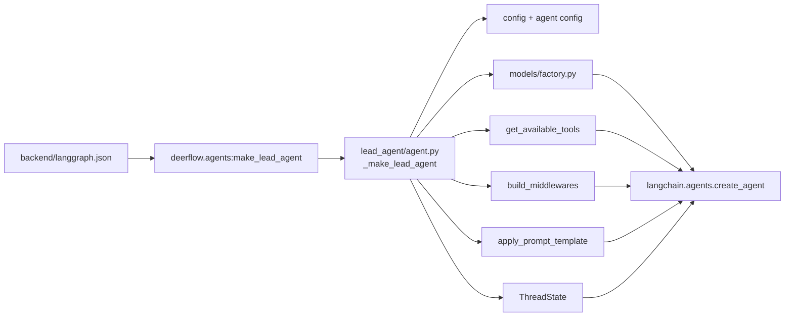
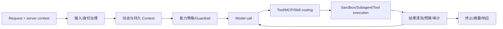
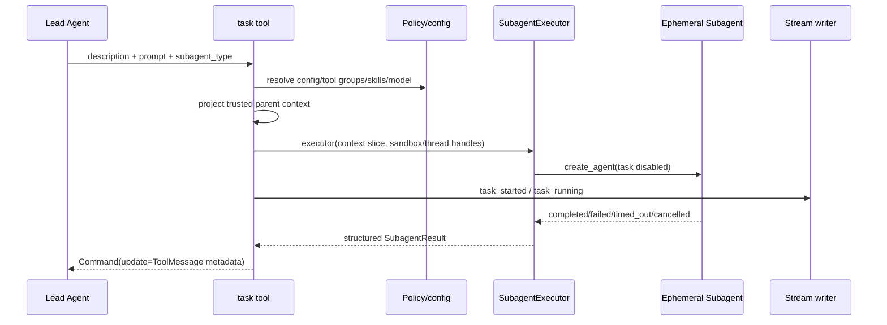
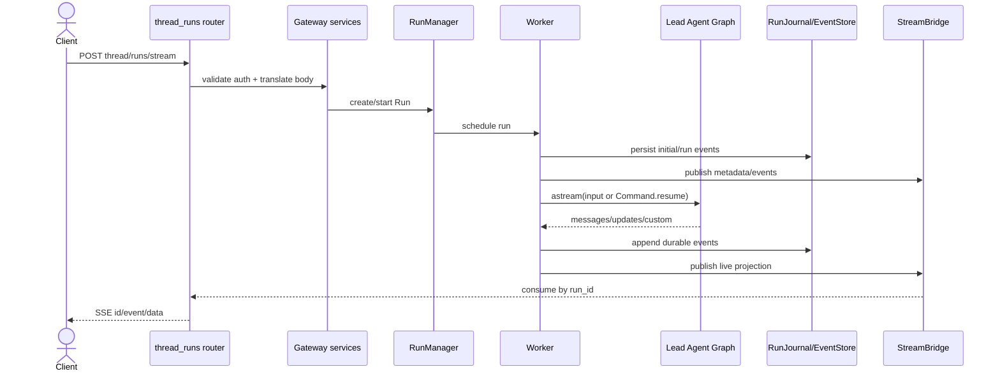
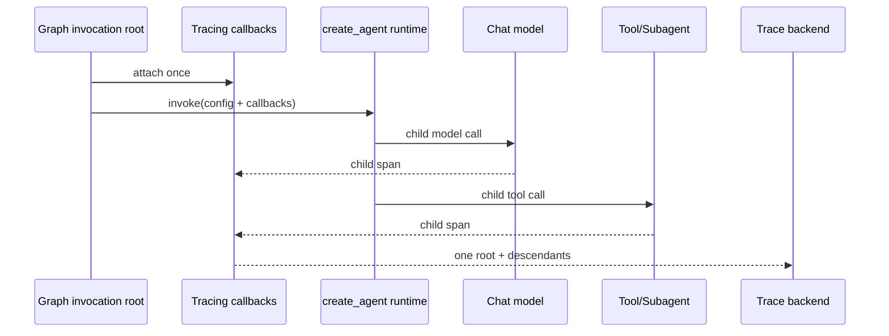
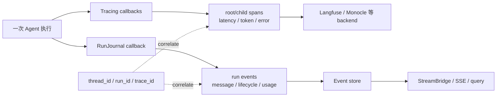
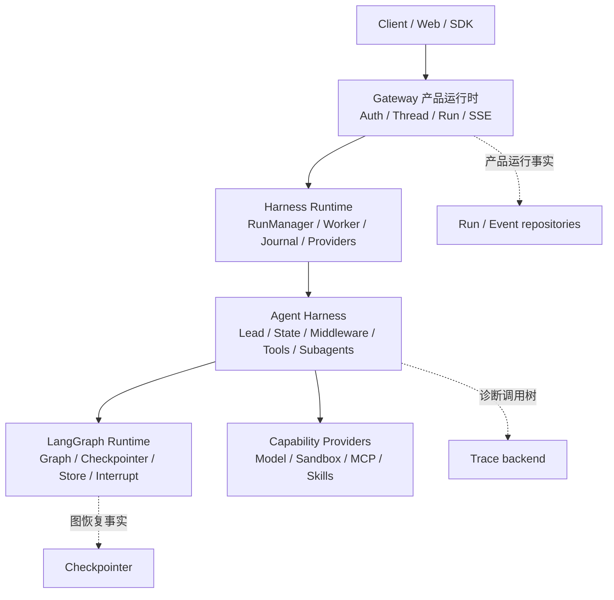

> 校准日期：2026-07-14  
> DeerFlow 官方源码锚点：[`4af617835805dd7cd78162ebed02fd6b782ea8bf`](https://github.com/bytedance/deer-flow/tree/4af617835805dd7cd78162ebed02fd6b782ea8bf)  
> 前置：[最终综合实战](/langchain-logbook/posts/capstone/)、[工程架构总览](/langchain-logbook/posts/architecture/)

## 先用 Mini DeerFlow 作为源码坐标

第一次打开 DeerFlow，最醒目的是目录数量。可目录只能告诉你代码放在哪里，不能解释一次请求为何走到这里，也不能解释故障应由谁处理。

前面的 Mini DeerFlow 已经让你用过组合根、State、Middleware、task、Sandbox、Run/Event 和 SSE。现在不再逐个复习概念，而是拿它们当作坐标，去查真实项目里的调用关系。

我们只追四个现场：用户伪造管理员身份、研究任务委派后写文件、SSE 断线后重连、trace 后端失效。每个现场都从一个请求或故障开始，沿调用关系找到责任边界。

四条路线依次经过：组合根/State/Middleware；Sandbox/Tools/Subagent；Gateway/Thread/Run/SSE；Trace/Journal/安全。它们不覆盖 DeerFlow 的每项产品功能，但足以建立稳定的源码阅读方法。

## 1. 版本为什么必须固定

本章固定到 `2026-07-14T08:58:06+08:00` 的提交，主题是 `feat(trace): add agent observability with Monocle (#4024)`。

相较旧锚点，源码已把 tracing callback 更明确地挂在 graph invocation root，并让内部 model 使用 `attach_tracing=False`。

如果链接只指向 `main`，几个月后同一句结论可能对应另一条调用链。这里固定 commit，是为了让每个判断都能回到同一份证据。

复核当前 HEAD：

```bash
export DEERFLOW_COMMIT=4af617835805dd7cd78162ebed02fd6b782ea8bf
export DEERFLOW_SRC=/tmp/deerflow-course

mkdir -p "$DEERFLOW_SRC"
git -C "$DEERFLOW_SRC" init
git -C "$DEERFLOW_SRC" remote add origin https://github.com/bytedance/deer-flow.git
git -C "$DEERFLOW_SRC" fetch --depth 1 origin "$DEERFLOW_COMMIT"
git -C "$DEERFLOW_SRC" checkout --detach FETCH_HEAD
git -C "$DEERFLOW_SRC" show -s --format='%H%n%cI%n%s'
```

预期第一行必须等于 `4af617835805dd7cd78162ebed02fd6b782ea8bf`。不要退回 `main` 后继续假装结论仍对应固定版本。

### 1.1 完整 fetch 很慢时，下载“证据切片”

`git fetch` 会下载 Git pack；在受限网络中，它可能长时间没有输出。本课程提供一个更小的回退入口，只通过 GitHub Contents API 下载四条必修阅读路线需要的 14 个文件：

```bash
# 回到 langchain-logbook 仓库根目录执行
export DEERFLOW_SRC=/tmp/deerflow-course-snapshot
python scripts/fetch_deerflow_snapshot.py --output "$DEERFLOW_SRC"
python scripts/fetch_deerflow_snapshot.py --output "$DEERFLOW_SRC" --verify-only
cat "$DEERFLOW_SRC/DEERFLOW_COMMIT"
```

脚本只接受本章固定 commit，并用 Git blob SHA 逐文件校验。最后一行仍必须是 `4af617835805dd7cd78162ebed02fd6b782ea8bf`。

匿名 GitHub API 通常足够下载这 14 个文件。若遇到 API 限额，可设置 `GITHUB_TOKEN` 或 `GH_TOKEN` 后重试。

已经用 GitHub CLI 登录但环境变量为空时，可以先执行 `export GH_TOKEN="$(gh auth token)"`。命令不会打印 token；下载结束后可执行 `unset GH_TOKEN`。

这个目录是**源码阅读切片**，不是可安装、可运行的完整 DeerFlow。它足以完成四条路线的证据表，也包含 `gateway/services.py`，可以展开 router → service → RunManager 的调度接缝。

若要阅读 Sandbox、MCP、Skills 的全部 provider 变体，仍需使用完整 checkout 或本章固定源码链接。回退方案缩小了下载范围，没有降低证据标准。

若完整 checkout 目录已经存在，先检查 remote 和 HEAD，不要重复执行 `remote add`。也可以换一个空临时目录；关键是最终 detached HEAD 指向固定提交。若使用证据切片，则每次阅读前运行 `--verify-only`，避免把本地修改误当官方源码。

源码链接全部固定到本章 commit；你可以另外克隆最新 `main` 做差异练习，但不要静默用最新文件替换本章结论。

## 2. 先写下四个故障判断

先别打开目录。下面四个现场，都要求你先写一句判断：谁应当处理它，处理结果保存在哪里。

1. 请求 body 写了 `user_role=admin`。Lead Agent 应该相信它吗？
2. Subagent 研究完成，却把文件写到了别人的 workspace。授权在哪一层丢了？
3. 客户端断开 SSE 后重新连接。后台 Run 应该重跑、继续跑，还是只重放事件？
4. tracing backend 断开。Run 能否完成，客户端又能否收到成功事件？

每读完一条路线，就回来修订对应判断。若答案仍是“框架会处理”或“都算 memory/callback/agent”，说明你还没有找到事实的所有者。

### 2.1 用 `rg` 找候选点，再确认上下文

在固定 checkout 中执行：

```bash
cd "$DEERFLOW_SRC"

rg -n 'def make_lead_agent|def _make_lead_agent|create_agent\(' \
  backend/packages/harness/deerflow/agents/lead_agent/agent.py

rg -n 'class ThreadState|build_middlewares|Runtime\[' \
  backend/packages/harness/deerflow

rg -n 'def task|class SubagentExecutor|subagent_enabled=False' \
  backend/packages/harness/deerflow

rg -n 'RunManager|RunJournal|StreamBridge|Last-Event-ID' \
  backend/app/gateway backend/packages/harness/deerflow/runtime
```

`rg` 只能找到候选点。接着打开定义上下各 20–40 行，确认参数从哪里来、结果到哪里去，再填证据表。

## 3. 路线一：伪造的管理员身份为何不能进入 State

先跟一条危险请求：客户端在正文里写入 `user_role=admin`，随后要求 Agent 调用报告发布工具。

要判断它会不会越权，不能只搜索 `role`。你得先找到 Lead Agent 在哪里组装，再确认 State、Runtime Context 和 Middleware 分别接收什么。最后还要检查工具集合如何被策略过滤。

### 3.1 从注册入口找到组合根

<!-- diagram:id=deerflow-lead-source-navigation -->


**图的文本替代**：manifest 指向 `make_lead_agent`；factory 解析运行配置和 agent 配置，分别构建 model、tools、Middleware、system prompt 与 ThreadState，最后交给 LangChain `create_agent`。因此 DeerFlow 的 Lead 不是手写一个无限 while loop，也不是把全部业务写在单个 Graph node。

**读图顺序**：从最左 manifest 沿入口进入 factory，再从 factory 向右展开五个装配分支，最后确认它们汇入同一个 `create_agent`。

### 3.2 组合根装入了哪些依赖

1. 从 [`make_lead_agent`](https://github.com/bytedance/deer-flow/blob/4af617835805dd7cd78162ebed02fd6b782ea8bf/backend/packages/harness/deerflow/agents/lead_agent/agent.py#L421) 看 factory 签名为什么兼容 LangGraph Server。
2. 在 `_make_lead_agent` 中列出所有来自 runtime config 的开关：model、thinking、plan mode、subagent、并发/总量、agent name、non-interactive 等。
3. 找 `get_available_tools → filter_tools_by_skill_allowed_tools → assemble_deferred_tools`，区分“存在的工具”“策略允许的工具”“本轮提前装入的工具”。
4. 找两处 `create_agent`。bootstrap 与常规 Agent 使用不同能力集合，但都复用相同组合方式。
5. 最后才进入具体 Middleware 或 tool 实现。一开始就随机读 shell/browser tool，只能看到局部动作，看不到它如何被注册和约束。

### 3.3 先验收组合根

关闭源码，凭记忆写出：

```text
manifest → graph factory → config resolution
         → model / tools / middleware / prompt / state
         → create_agent
```

然后回答：若要新增“报告发布工具”，应该改 manifest、model factory，还是工具注册/策略层？请用调用关系说明理由。

### 3.4 身份究竟应该放在哪里

要回答开头的越权问题，先分开三种都带有“线程”色彩的数据。它们的生命周期不同，也不由同一个组件保存。

| 数据 | 示例 | 所有者 | 是否进入 Graph checkpoint |
|---|---|---|---|
| `ThreadState` | messages、sandbox/thread data、Agent 执行事实 | Graph/Harness | 按 schema 与 reducer 保存 |
| `Runtime.context/config` | authenticated user、role、run_id、provider handle | 应用/worker | 不应因方便全部塞入 State |
| 产品 Thread/Run record | owner、status、created_at、event sequence | Gateway repository | 独立于 Graph checkpoint |

[`agents/thread_state.py`](https://github.com/bytedance/deer-flow/blob/4af617835805dd7cd78162ebed02fd6b782ea8bf/backend/packages/harness/deerflow/agents/thread_state.py) 在 `AgentState` 上扩展业务字段。

Worker 在调用 graph 前构建 runtime context，并放入 LangGraph `Runtime`。Gateway repository 另存客户端可查询的 Thread/Run 状态。

### 3.5 Middleware 的顺序会改变授权结果

`agents/middlewares/` 文件很多。先按执行责任分组，再回到真实装配顺序：

1. 输入与身份：input sanitization、thread data、dynamic/durable context；
2. 能力治理：guardrail、MCP routing、deferred tool filter、skill activation；
3. 工具执行防线：read-before-write、sandbox audit、tool error/result sanitization；
4. 长上下文和预算：summarization、token/tool-output budget、subagent limit；
5. 用户体验与终止：progress、title、todo、terminal response、safety finish reason。

分类只是阅读工具。真实顺序必须回到 `build_middlewares(...)` 验证，因为身份注入、策略过滤和工具执行的先后会直接改变授权结果。

<!-- diagram:id=deerflow-middleware-lifecycle -->


**图的文本替代**：服务端身份先进入输入和 Context 治理，再经过能力策略；模型只能选择已注册且允许的工具。工具执行还要经过 Sandbox、错误和结果治理；若未终止，受控结果回到模型。预算、摘要与终止策略围绕循环工作，而不是变成任意顺序的装饰器。

**读图顺序**：从左到右读一次受治理调用；到结果治理后先读回到 Model 的循环边，再读进入终止响应的出口。

### 3.6 回到伪造管理员请求

假设请求 body 带 `user_role=admin`，应用又把它直接合入 `ThreadState`。沿调用链推演，会出现四个后果：

- 客户端可自我提权；
- role 进入 checkpoint 和 trace，后续 resume 继续信任伪造值；
- Subagent 继承时无法区分认证事实和模型文本；
- Gateway owner check 与 Harness tool policy 产生不同身份结论。

身份应由 Gateway/worker 从认证上下文注入，Harness 只消费受信的 runtime context。需要恢复的业务事实和短期 provider handle 也要分开保存。

路线一至此闭合：manifest 找到组合根，组合根装入 State 和 Middleware；Runtime Context 提供受信身份，Middleware 再据此过滤能力。用户正文没有资格改变这条授权链。

## 4. 路线二：研究任务为何写进了别人的 Workspace

第二个现场来自一次正常委派：Lead 调用 `task`，Subagent 完成研究并写入报告。结果内容正确，文件却落进了另一位用户的 workspace。

这个故障横跨 task tool、策略、Sandbox handle 和 SubagentExecutor。只盯着写文件工具，会漏掉句柄从父运行时投影到临时 Agent 的过程。

### 4.1 task 划出委派边界

[`task_tool.py`](https://github.com/bytedance/deer-flow/blob/4af617835805dd7cd78162ebed02fd6b782ea8bf/backend/packages/harness/deerflow/tools/builtins/task_tool.py#L229) 先解析 subagent 配置，再从父 runtime 提取必要数据，创建 `SubagentExecutor` 异步执行。

它还会关闭 Subagent 的 task 工具，避免临时 Agent 继续无界委派。

<!-- diagram:id=deerflow-subagent-call -->


**图的文本替代**：Lead 用 task tool 传任务描述和类型；tool 根据父级策略解析允许的模型、工具和 skills，只投影必要的受信 Context。Executor 创建不能继续调用 task 的临时 Agent，执行状态同时形成进度事件；终态以结构化 ToolMessage/Command 返回 Lead，不把 specialist 全量消息史并入父上下文。

**读图顺序**：先从 Lead 到 task tool 看委派输入，再向右读策略解析与临时 Agent 创建；随后从 terminal status 反向回到 ToolMessage 和 Lead，最后核对旁路的进度事件。

### 4.2 Sandbox、MCP 与 Skills 经过同一条能力链

看到 `sandbox/`，还不能断言“代码已经可以安全执行”。看到 MCP server 或 Skill metadata，也不能断言“模型已经得到调用权限”。先按能力生命周期检查：

```text
发现 discover
→ 描述/渐进披露 describe/load
→ 应用策略过滤 authorize
→ 注册到本轮 Agent register
→ Runtime 注入身份与句柄 bind
→ provider 执行 execute
→ 结果清洗、预算、审计 govern
```

#### Sandbox

从 `sandbox/sandbox_provider.py` 的 provider 接口进入，再区分 local provider、Aio/远程 community provider 与具体 tools。路径隔离、symlink 防护和原子写入，仍不等于容器的进程、网络和资源隔离。

#### MCP

从 `mcp/` 的连接与 tool conversion 进入，再回到 `get_available_tools`、MCP routing Middleware 和 tool policy。远端 server 声明的 tool schema 只是候选能力，不是最终授权。

#### Skills

从 `skills/catalog.py`、metadata/parser/storage 与 `describe_skill` 进入，观察 deferred discovery 如何减少上下文占用。接着检查 skill allowed tools 如何参与工具策略。

Skill 文本负责行为指令和资源导航。它不能绕过 Gateway 身份、工具策略或 Sandbox 授权。

### 4.3 追出五个边界

1. **配置边界**：未知 subagent type 返回结构化 failure，而不是任意 import。
2. **授权边界**：父级 `tool_groups` 和 skill allowlist 会继续约束 specialist。
3. **上下文边界**：身份归因、run/thread/sandbox handle 是显式传播，不等于共享所有父消息。
4. **递归边界**：给 specialist 获取工具时 `subagent_enabled=False`。
5. **终止边界**：completed、failed、cancelled、timed_out、token/turn capped 必须可区分。

### 4.4 Mini DeerFlow 刻意省略了什么

两者的关系相同：Lead 通过单一 `task` 能力委派；registry/config 与 executor 分离；输入经过裁剪；并发、超时和结果预算受控；失败作为数据返回，不直接炸毁父循环。

Mini DeerFlow 用确定性 handler 证明契约。真实 DeerFlow 会为 specialist 重新创建 `create_agent`，并接入动态 model/tools/skills、stream writer、token collector、Guardrail 和 Sandbox provider。

自己的项目应先复用委派契约，再按业务增加 provider。复制 executor 的全部分支，只会把尚未理解的复杂度一起搬进来。

### 4.5 回到 Workspace 串写故障

沿 task tool 检查父 runtime 投影出的 thread、run、sandbox handle 和身份归因，再沿 Executor 检查临时 Agent 得到的 provider。文件内容正确，并不能证明能力绑定正确。

若 task 接收了客户端提供的 workspace path，或 Subagent 自行创建了未绑定认证主体的 local provider，授权边界就在执行前已经丢失。正确修复点通常在受信句柄的创建与投影处，不在 Prompt 里补一句“不要越权”。

现在做一个终态练习：让一个 specialist 超时，另一个成功，然后回答：

- Lead 最终拿到几个 ToolMessage？
- timeout 是异常、terminal status 还是空字符串？
- 已成功结果是否应该被兄弟失败回滚？
- 最终报告可否发布，应该由 task tool、Lead policy 还是 evaluator 决定？

Mini DeerFlow 综合实战用 `forbidden_terms=("specialist 未完成",)` 防止“标题完整但专家失败”的报告被误判通过。生产策略还应按任务 criticality 决定是否允许降级交付。

## 5. 路线三：SSE 断线后为什么不应重跑 Subagent

第三个现场发生在交付末端：研究仍在后台执行，浏览器网络短暂中断。客户端重新连接时，究竟应该重新运行任务，还是读取已经产生的事件？

先区分产品 Thread、一次 Run、Graph checkpoint 和 SSE subscriber。它们可能共享 ID，却不拥有同一种事实。

### 5.1 从 HTTP 接口反向追

起点是 [`gateway/app.py`](https://github.com/bytedance/deer-flow/blob/4af617835805dd7cd78162ebed02fd6b782ea8bf/backend/app/gateway/app.py) 注册的 `thread_runs` 与 `runs` routers。

再读 [`routers/thread_runs.py`](https://github.com/bytedance/deer-flow/blob/4af617835805dd7cd78162ebed02fd6b782ea8bf/backend/app/gateway/routers/thread_runs.py)：

- `POST /{thread_id}/runs`：创建后台 Run；
- `POST /{thread_id}/runs/stream`：创建并返回 SSE；
- `GET /{thread_id}/runs/{run_id}/join`：加入现有流；
- `POST .../cancel`：取消或 rollback；
- existing stream endpoint：取消后排空剩余事件或重连。

Router 先做权限与资源投影。`services.py` 解析输入和 `Command(resume=...)`；RunManager 管状态、任务和 owner/lease；worker 才真正调用 Agent graph。

<!-- diagram:id=deerflow-gateway-run-sequence -->


**图的文本替代**：客户端请求先经 router 权限检查和 service 转换，RunManager 创建产品 Run 并安排 worker。worker 在执行 graph 前后更新 Run 状态，通过 RunJournal/EventStore 保存客户端可见事件，同时把实时投影发布到 StreamBridge；router 的 SSE consumer 再输出给客户端。Graph checkpoint 并不自动等于 Run/Event repository。

**读图顺序**：从 Client 的创建请求向右追到 worker 和 Graph，再从 Graph 返回事件向左追 Journal/Bridge，最后回到 Router 输出 SSE，形成完整往返。

### 5.2 断线、取消、暂停和恢复是四件事

这四个动作都会让界面看起来“停止了”，但它们改变的对象不同：

| 动作 | 发生了什么 | 没发生什么 |
|---|---|---|
| 客户端断开 SSE | subscriber 消失，可稍后 join/replay | 不等于 worker 被取消 |
| Cancel Run | RunManager 协作终止/接管并更新终态 | 不等于删除 Thread/checkpoint |
| Graph interrupt | checkpoint 保存暂停点并返回 interrupt | 不等于原 Run 永远保持 running |
| Resume | 新输入为 `Command(resume=...)`，继续同一 checkpoint thread | 不应伪装为原 HTTP 请求重试 |

Mini DeerFlow 明确让 resume 创建新产品 Run，同时复用 checkpoint thread。阅读 DeerFlow 时也要分别追 Run record 与 `Command(resume=...)`，不能只凭前端按钮文案判断。

### 5.3 回到断线现场

SSE subscriber 消失，不会自动取消 RunManager 拥有的后台任务。客户端重连时，应按 `run_id` 加入现有流，并用事件游标补齐缺口；已经完成的 Subagent 不应重跑。

若 EventStore 没有保存可重放事件，Graph checkpoint 也不能替它恢复客户端已经看过哪些消息。checkpoint 负责图执行恢复，Journal/EventStore 负责产品事件交付。

## 6. 路线四：Trace 后端失效，Run 还能成功吗

最后一个现场容易制造“假成功”：tracing backend 断开，但 Agent 已生成答案；或者 EventStore 写入失败，trace 平台却留下一条绿色执行记录。

两条链都可能由 callback 接入，也都带 `run_id`。它们保存的事实不同，失败策略也不能共用。

### 6.1 先找到唯一的 trace root

当前 commit 在组合根调用 `build_tracing_callbacks()`，把 callback 添加到 graph invocation config；同时 `create_chat_model(..., attach_tracing=False)`。Subagent executor 也为内部 model 传 `attach_tracing=False`。

<!-- diagram:id=deerflow-trace-root -->


**图的文本替代**：一次 graph invocation 在根部挂一次 tracing callback；Agent、model、tool 和 Subagent 调用继承为 child span。内部模型关闭自己的 tracing attachment，避免同一业务请求出现多个无关 root 或重复计数。

**读图顺序**：从 Graph root 向右读一次 callback 安装，再沿 Agent 到 model/tool 的两条子调用，最后看 callback 如何把一个 root 和全部 descendants 送往 backend。

这与 Mini DeerFlow 的 `LangSmithObservability` 原则相同：instrumentation owner 只能有一个。DeerFlow 还要处理多 tracing backend、动态配置和 Gateway 执行入口。

### 6.2 一次执行为何要分成两条记录链

<!-- diagram:id=deerflow-observability-split -->


**图的文本替代**：同一次执行同时进入 tracing callbacks 和 RunJournal callback。Tracing 产生诊断用父子 span 并发往 tracing backend；RunJournal 产生产品可查询、可重放事件并进入 event store/SSE。关联 ID 可把两条链连起来，但任一链都不应成为另一条链唯一的存储。

**读图顺序**：从一次执行向右分叉；先读上方诊断链，再读下方产品事件链，最后看关联 ID 的虚线只负责连接查询、不负责合并存储。

检查 [`runtime/runs/worker.py`](https://github.com/bytedance/deer-flow/blob/4af617835805dd7cd78162ebed02fd6b782ea8bf/backend/packages/harness/deerflow/runtime/runs/worker.py)。它创建 `RunJournal`，暴露给部分 Middleware，并追加为 callback。

随后检查 [`runtime/journal.py`](https://github.com/bytedance/deer-flow/blob/4af617835805dd7cd78162ebed02fd6b782ea8bf/backend/packages/harness/deerflow/runtime/journal.py) 的事件类型和写入目标，再看 worker 注入的 trace metadata。

### 6.3 回到两个失败分支

tracing backend 断开时，系统通常仍应完成 Run 并产生产品事件。诊断能力暂时缺失，不应自动变成业务失败；但故障必须可见，不能悄悄吞掉。

EventStore 失败则不同。只留下 trace，客户端无法可靠查询或重放 Run 的交付事实。此时不能因为 trace 显示执行成功，就向客户端宣称产品 Run 已可靠完成。

### 6.4 安全判断也要沿所有权追

安全事件也不能只看一份日志。Gateway 身份、Middleware 策略、Sandbox 审计、ToolMessage、RunJournal 和 trace span 各自保存一段证据。

以路线一的伪造管理员请求为例：认证主体来自 Gateway，能力过滤发生在 Harness，工具副作用由 provider 审计，客户端可见结果进入 Journal，调用耗时和错误进入 trace。关联 ID 用来串联证据，不能把它们合并成一份万能日志。

## 7. 四条路线共同指向三层系统

四个故障分别落在不同模块，但它们共享同一依赖方向：客户端进入 Gateway，Gateway 调用 Harness Runtime，worker 再运行 Agent Harness 与 LangGraph。

<!-- diagram:id=deerflow-three-layers -->


**图的文本替代**：客户端进入 Gateway；Gateway 用 Harness Runtime 管理 Run 和 worker；worker 调用 Agent Harness；Agent Harness 由 LangGraph 执行，并使用模型、Sandbox、MCP、Skills 等 provider。

产品 Run/Event、Graph checkpoint 与 Trace 分别保存交付事实、恢复事实和诊断事实，不能相互替代。

[`backend/langgraph.json`](https://github.com/bytedance/deer-flow/blob/4af617835805dd7cd78162ebed02fd6b782ea8bf/backend/langgraph.json) 注册：

```text
graphs.lead_agent = deerflow.agents:make_lead_agent
auth.path = app/gateway/langgraph_auth.py:auth
checkpointer.path = deerflow/runtime/checkpointer/async_provider.py:make_checkpointer
```

这里注册 graph factory、认证入口和 checkpointer provider。Agent Harness 继续负责模型、State、Middleware、Tools 与 Subagents；Gateway 则拥有 Thread/Run、取消、重连和事件查询。

## 8. 把 Mini DeerFlow 对回真实源码

四条路线建立了调用关系。下面这张表用于回查具体接缝，不适合当作第一次阅读的目录。

| Mini DeerFlow 入口 | DeerFlow 固定源码入口 | 先比较什么 | 不要复制什么 |
|---|---|---|---|
| `langgraph.json` | [`backend/langgraph.json`](https://github.com/bytedance/deer-flow/blob/4af617835805dd7cd78162ebed02fd6b782ea8bf/backend/langgraph.json) | factory/auth/checkpointer 注册 | 把 manifest 当部署全貌 |
| `app.py` / `agents/` | [`lead_agent/agent.py`](https://github.com/bytedance/deer-flow/blob/4af617835805dd7cd78162ebed02fd6b782ea8bf/backend/packages/harness/deerflow/agents/lead_agent/agent.py) | 单一组合根、可替换依赖 | 所有动态产品开关 |
| `state.py` | [`thread_state.py`](https://github.com/bytedance/deer-flow/blob/4af617835805dd7cd78162ebed02fd6b782ea8bf/backend/packages/harness/deerflow/agents/thread_state.py) | 字段生命周期与 reducer | 未理解的所有字段 |
| `middleware/` | [`agents/middlewares/`](https://github.com/bytedance/deer-flow/tree/4af617835805dd7cd78162ebed02fd6b782ea8bf/backend/packages/harness/deerflow/agents/middlewares) | 治理顺序与失败语义 | 文件数量和类名 |
| `subagents/` | [`task_tool.py`](https://github.com/bytedance/deer-flow/blob/4af617835805dd7cd78162ebed02fd6b782ea8bf/backend/packages/harness/deerflow/tools/builtins/task_tool.py) + [`executor.py`](https://github.com/bytedance/deer-flow/blob/4af617835805dd7cd78162ebed02fd6b782ea8bf/backend/packages/harness/deerflow/subagents/executor.py) | 输入裁剪、策略继承、结构化终态 | background polling 细节 |
| `sandbox/` | [`deerflow/sandbox/`](https://github.com/bytedance/deer-flow/tree/4af617835805dd7cd78162ebed02fd6b782ea8bf/backend/packages/harness/deerflow/sandbox) | provider/lifecycle 接缝 | 未需要的全部 provider |
| `mcp/` / `skills/` | [`mcp/`](https://github.com/bytedance/deer-flow/tree/4af617835805dd7cd78162ebed02fd6b782ea8bf/backend/packages/harness/deerflow/mcp) + [`skills/`](https://github.com/bytedance/deer-flow/tree/4af617835805dd7cd78162ebed02fd6b782ea8bf/backend/packages/harness/deerflow/skills) | 发现、披露、授权、执行 | 把 metadata 当权限 |
| `persistence.py` | [`runtime/checkpointer/`](https://github.com/bytedance/deer-flow/tree/4af617835805dd7cd78162ebed02fd6b782ea8bf/backend/packages/harness/deerflow/runtime/checkpointer) + [`runtime/store/`](https://github.com/bytedance/deer-flow/tree/4af617835805dd7cd78162ebed02fd6b782ea8bf/backend/packages/harness/deerflow/runtime/store) | checkpoint/Store provider | 把两者叫同一种 memory |
| `runtime/` / `api/` | [`thread_runs.py`](https://github.com/bytedance/deer-flow/blob/4af617835805dd7cd78162ebed02fd6b782ea8bf/backend/app/gateway/routers/thread_runs.py) + [`runtime/runs/`](https://github.com/bytedance/deer-flow/tree/4af617835805dd7cd78162ebed02fd6b782ea8bf/backend/packages/harness/deerflow/runtime/runs) | Thread/Run/Event 与 SSE | 产品边缘功能全集 |
| `observability.py` | [`tracing/`](https://github.com/bytedance/deer-flow/tree/4af617835805dd7cd78162ebed02fd6b782ea8bf/backend/packages/harness/deerflow/tracing) + [`journal.py`](https://github.com/bytedance/deer-flow/blob/4af617835805dd7cd78162ebed02fd6b782ea8bf/backend/packages/harness/deerflow/runtime/journal.py) | root owner 与两条观测链 | 多 backend 配置矩阵 |

### 8.1 一次研究委派怎样回到 SSE

现在把四条路线接起来。假设客户端创建一个流式 Run，Lead 调用 task，把研究交给 Subagent，最后返回综合结果。

先不运行应用，只用静态源码完成下面的调用链：

```text
HTTP run/stream endpoint
→ Gateway service input translation
→ RunManager create/claim
→ Worker graph invocation
→ make_lead_agent 创建的 compiled graph
→ Lead model 产生 task tool call
→ task tool 解析 Subagent policy
→ SubagentExecutor 创建隔离 Agent
→ structured terminal result / ToolMessage
→ Lead model 综合
→ RunJournal/EventStore 持久化
→ StreamBridge / SSE 返回客户端
```

为每个箭头记录三项：调用 symbol、传递的最小数据、失败由哪一层投影。例如 task → executor 传任务和裁剪后的 Context；它不传完整 parent messages。

然后回答四个反事实问题：

1. task 超时时，哪个对象把异常归一化为终态？
2. SSE 在最后一条消息后断开，Subagent 是否需要重跑？
3. tracing backend 失败，RunJournal 还能否形成客户端事件？
4. worker 重启后，Graph checkpoint 与产品 Run record 各负责恢复什么？

完成标准不是照抄这条链，而是每个箭头都能用固定 commit 的调用点证明。中间若只能写“框架自动处理”，就回到对应路线继续追。

## 9. 出现这些迹象时，回到对应路线补证据

| 误读迹象 | 回到哪条路线 | 必须补上的证据 |
|---|---|---|
| 只会逐文件摘要，不知道谁调用谁 | 路线一 | 从 manifest 到 factory 的调用链 |
| 把 Checkpointer、Store、Run repository、EventStore、Workspace 都叫 memory | 路线一、三 | 各自的 key、生命周期、读写者与恢复职责 |
| 看到 workspace 路径就宣称能安全执行 shell | 路线二 | 路径、进程、网络、资源、审计与租户边界 |
| 把 Subagent 当作共享父 State 的第二个节点 | 路线二 | task 的 Context 投影与 terminal ToolMessage |
| 有 trace 就认为 SSE 可恢复，有 Journal 就认为质量合格 | 路线四 | Trace、Journal、Evaluation 的输入、输出和失败策略 |

这张表不再制造新的“实验”。它只帮助你在证据不足时回到已经运行过的路线。

## 10. 把综合实战迁移成自己的项目

不要以“复刻 DeerFlow”为项目目标。先写自己的核心业务验收，例如：

```text
输入：用户提交一项需要检索和多专业分析的长任务
控制：Lead 负责计划与整合，specialist 只看裁剪后的任务
副作用：草稿可自动写；正式发布必须审批并幂等
恢复：进程重建后能继续同一 checkpoint thread
交付：产品 Run/Event 可查询、可重连
质量：结果、轨迹、预算、安全和恢复分别验收
```

然后只选择必要接缝：

1. 用 `create_agent` 还是显式 StateGraph 表达主循环；
2. 哪些数据属于 State、Context、Store、业务库；
3. task 是否是最合适的委派模式；
4. 本地/容器/远程 Sandbox provider 的威胁模型；
5. 使用 Agent Server 还是自建 Gateway；
6. 谁拥有唯一 trace root，谁保存产品事件；
7. 远端副作用用 provider idempotency key 还是 outbox。

### 10.1 留下一份 ADR

写一份 `docs/adr/` 决策记录，题目为“我们的 Agent Runtime 采用标准 Agent Server 还是自建 Gateway”。至少包含：业务约束、认证所有权、Thread/Run 查询需求、SSE 重连、取消/恢复、运维成本、被拒方案和迁移触发条件。

## 11. 最终验收清单

- [ ] 能从 `langgraph.json` 追到 `make_lead_agent` 和两处 `create_agent`；
- [ ] 能画出 State、Runtime Context、产品 Thread/Run 的所有权边界；
- [ ] 能解释 Middleware 顺序为何影响权限、错误和预算；
- [ ] 能从 task tool 追到 SubagentExecutor，并指出上下文/递归/终态边界；
- [ ] 能从 run stream endpoint 追到 RunManager、worker、journal、bridge；
- [ ] 能解释 checkpoint 恢复、Run resume 和 SSE replay 的不同；
- [ ] 能解释 trace callback 与 RunJournal 的共同点和根本差异；
- [ ] 能指出 Mini DeerFlow 的三处刻意简化，并给出自己项目是否需要补齐的理由；
- [ ] 能用固定 commit 链接支持结论，而不是引用易漂移的 `main` 页面；
- [ ] 能为自己的核心 Agent 业务写出结果、轨迹、预算、安全与恢复验收。

完成这些项目后，你就不再依赖 DeerFlow 的目录记忆。即使仓库继续演进，也可以从入口、组合根、数据边界、能力边界和产品交付重新定位变化。

## 12. 离开这本书以后

真正有用的不是一份 DeerFlow 文件清单，而是一套可以迁移的设计顺序：先确定核心业务闭环，再划分状态和能力所有权，把固定控制流写进 Graph，为副作用设计恢复协议，最后补齐 Runtime、评测与观测。

新需求出现时，先判断它改变了哪条边界，再决定修改 Tool、Middleware、Graph Node、Runtime adapter 或产品数据库。

如果你能沿一次真实请求找到这个修改点，并说明状态、能力和故障由谁负责，就已经具备用 LangGraph 构建核心 Agent 业务、继续阅读 DeerFlow 的能力。