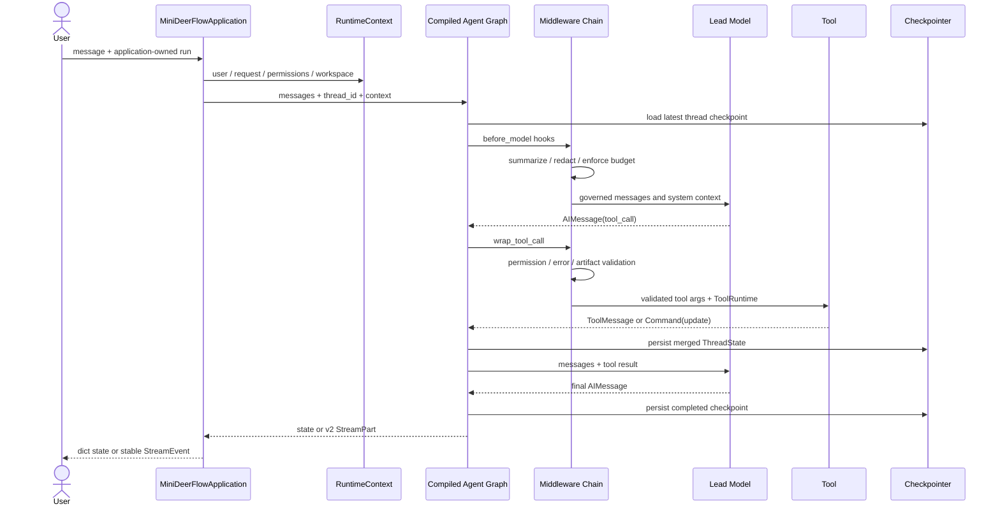
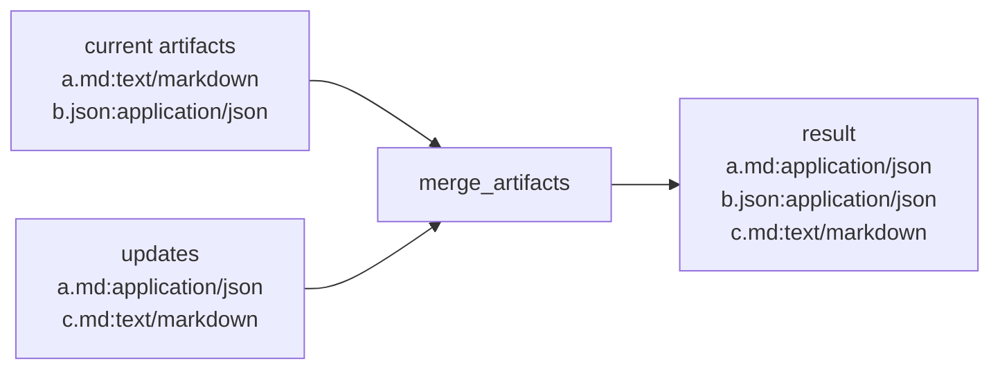
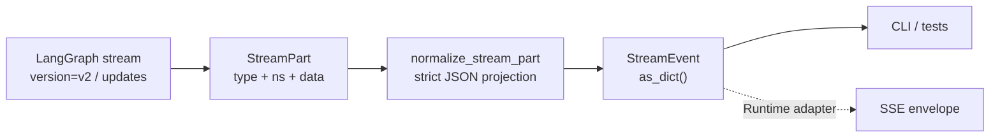

> 验证环境：Python 3.12；LangChain / LangGraph 精确 patch 以 `uv.lock` 为唯一事实源  
> API 状态：current；LangGraph v2 stream 为当前推荐统一 envelope  
> 前置章节：课程第 04–11 章  
> 工程事实源：`mini_deerflow.app`、`state`、`middleware`、`persistence`、`streaming`  
> 验证日期：2026-07-13

兼容 minor 窗口和升级门禁见 [`docs/version-policy.md`](/langchain-logbook/posts/version-policy/)。本文不重复手写精确 patch，避免依赖升级后出现互相冲突的第四套版本事实。

这不是一章新的 API 清单，而是一次纵向集成：把已经分别学过的 State、Tools、Middleware、Checkpointer 和 Streaming 放进同一条业务路径。完成后，你应该能回答一个更接近真实项目的问题：**为什么这个 Agent 在进程重建后仍知道上一轮发生了什么，又怎样证明恢复、权限、摘要和产物合并没有互相破坏？**

上一篇架构总览只追了 `build_application → _assemble_graph → create_lead_agent → graph.invoke`。本专题继续沿这条链，不从目录重新开始，也不引入新的 Agent 框架。

你会复用已经掌握的概念：第 05–06 章的 Context/Middleware，第 07–08 章的 State/Reducer/Command，第 09–10 章的 Checkpoint/Interrupt，以及第 04 章的 model → tool → model 循环。

如果下面某个词仍只能背定义，先回到对应章节的失败/修复实验。这里的任务是把边界一起受压，不是用 Mini DeerFlow 封装替你第一次理解它们。

## 系统快照：组合根已经存在，核心业务接缝还没有一起受压

一个能调用工具的 Agent 仍可能不是核心业务。只要发生以下任一情况，它就更像一次性 Demo：

- 第二轮输入换了进程或 graph 实例，第一轮消息与产物就消失；
- 两次工具都登记同一路径的产物，State 中出现两个互相矛盾的版本；
- 对话不断增长，却没有摘要预算，最终把模型上下文撑爆；
- 工具返回任意 `Command(update=...)`，不安全路径直接进入 checkpoint；
- UI 直接依赖 LangGraph 原始 stream tuple，升级 stream mode 后解析错位；
- 只能展示最终回答，无法看到 Middleware 和 Graph 实际经过哪些节点。

Mini DeerFlow 的核心闭环把这些问题放到同一个验收场景中，而不是为每个问题各写一个互不相干的示例。

### 学习目标

完成本专题后，你能够：

- 用 `thread_id` 和 Checkpointer 让重新构建的应用恢复同一线程；
- 为 Artifact 设计有业务语义的 reducer，而不是机械追加列表；
- 解释 Runtime Context、Thread State、Store 和 RunDescriptor 在一次多轮调用中的不同责任；
- 按顺序组合摘要、动态上下文、PII、权限、工具错误、Artifact 校验和调用上限；
- 把 LangGraph v2 `StreamPart` 转成应用稳定事件；
- 导出 compiled graph 的 Mermaid 文本，用拓扑而不是猜测检查运行路径；
- 沿同样边界阅读 DeerFlow 的 `make_lead_agent`、`ThreadState` 和 middleware chain。

### 前置工件检查

```bash
make mini-deerflow
```

成功时会看到 `profile=offline`、当前工具列表、最终文本和 Middleware event 数量。这个命令不需要 API Key；它用确定性模型驱动真实的 `create_agent` / LangGraph 工具循环。

只运行本专题验收：

```bash
uv run --locked --group dev pytest -q \
  tests/test_mini_deerflow_lead_agent_core.py
```

## 0. 先看演进方法：四次红灯，而不是一次粘贴最终工厂

这一专题按 **Red → Green → Refactor（红灯 → 最小通过 → 重构解释）** 建立纵切面。下面的四个阶段对应真实验收测试，不要求你先读懂全部源码再运行。

| 阶段 | 先制造的可观察失败 | 最小实现边界 | 通过后才做的重构 |
|---|---|---|---|
| A：恢复与 reducer | 重建 application 后没有 `state_for()`；同路径 Artifact 重复 | SQLite checkpointer、领域类型 allowlist、`merge_artifacts()` | 把 thread/request identity 和 serializer 信任边界写进文档 |
| B：治理链 | 长线程不摘要；非法 Artifact Command 进入 State；默认顺序未锁定 | 独立 summary model、Artifact 校验、精确 Middleware 顺序测试 | 解释 hook 嵌套方向和职责顺序 |
| C：稳定事件 | application 没有 `stream()`；事件中的 Message 不能 `json.dumps()` | v2 updates、严格 JSON 投影、`StreamEvent.as_dict()` | 把 Graph runtime 事件与未来 SSE wire protocol 分层 |
| D：拓扑证据 | 只能从代码猜 graph 是否包含 model/tools | `draw_mermaid()` 从 compiled graph 导出真实拓扑 | 用静态图 + 动态 lifecycle trace 交叉验证 |

### 0.1 阶段 A：先证明“对象重建后还能继续”

先只写业务断言，不先设计 repository 大全。测试创建两个独立的 SQLite 连接和两个 application 实例；二者共享 thread，但 request 不同：

```python
first_run = RunDescriptor(
    thread_id="core-thread",
    request_id="core-request-1",
    user_id="learner",
)
second_run = replace(first_run, request_id="core-request-2")

with open_sqlite_checkpointer(path) as saver:
    app_1 = build_application(settings, dependencies=replace(deps, checkpointer=saver))
    app_1.invoke("登记研究报告", run=first_run)

with open_sqlite_checkpointer(path) as saver:
    app_2 = build_application(settings, dependencies=replace(deps, checkpointer=saver))
    state = app_2.invoke("继续线程并更新产物", run=second_run)
    snapshot = app_2.state_for(second_run)
```

第一次运行这个测试时，红灯是 `MiniDeerFlowApplication` 没有 `state_for()`；加入 SQLite 后还会暴露自定义 `ArtifactRef` / `MiddlewareTraceEvent` 的反序列化信任问题。此时只实现三件事：

1. `state_for()` 隐藏 `StateSnapshot` 内部结构，只返回 values；
2. `open_sqlite_checkpointer()` 显式 allowlist 已审查的领域类型；
3. `merge_artifacts()` 用 path 作为 identity，替换冲突而不是追加重复项。

绿色标准不是“没有异常”，而是两个 HumanMessage 都存在、同路径 Artifact 只有一个且第二轮 media type 胜出、snapshot 与 invocation 结果一致。完整测试是 `test_thread_resumes_after_application_rebuild_and_merges_artifact_conflicts`。

只跑这一阶段：

```bash
uv run --locked --group dev pytest -q \
  tests/test_mini_deerflow_lead_agent_core.py \
  -k thread_resumes
```

### 0.2 阶段 B：再把长上下文和工具 State update 放进治理链

第二次红灯分成两个独立失败：把摘要阈值调低时，`ApplicationSettings` 不认识摘要预算；让测试工具返回越界路径时，非法 `Command(update=...)` 没有在工具边界被拒绝。

先固定默认链的顺序契约：

```python
assert [type(item).__name__ for item in middleware] == [
    "LifecycleTraceMiddleware",
    "SummarizationMiddleware",
    "ContextPromptMiddleware",
    "PIIMiddleware",
    "ToolPermissionMiddleware",
    "StructuredToolErrorMiddleware",
    "ArtifactTrackingMiddleware",
    "ModelCallLimitMiddleware",
]
```

然后分别最小实现：摘要模型与 Lead 模型使用独立依赖；Artifact middleware 校验工具返回的 update；结构化错误 middleware 在外层把校验错误投影成 `invalid_tool_input`。`record_artifact` 继续通过隐藏的 `ToolRuntime` 读取 `tool_call_id` 并产生 `ToolMessage`，模型 schema 中不会出现 runtime 参数。

这一阶段的绿色标准有三条：摘要消息带 `lc_source=summarization`；主模型仍完成 model → tool → model；越界路径只产生 error ToolMessage，State 中没有 Artifact。只跑相关测试：

```bash
uv run --locked --group dev pytest -q \
  tests/test_mini_deerflow_lead_agent_core.py \
  -k 'summarizes or artifact_tracking or middleware_chain_order'
```

### 0.3 阶段 C：让事件真的能进入 JSON adapter

只把 v2 envelope 包成 dataclass 还不够。第一次增加下面的断言时，红灯是 `StreamEvent` 没有 `as_dict()`；即使机械加入该方法，Graph update 中的 `AIMessage`、`ToolMessage` 与 Pydantic State 值仍不是标准 JSON 数据：

```python
events = list(application.stream("流式解释 Agent", run=run))
for event in events:
    json.dumps(event.as_dict(), ensure_ascii=False, allow_nan=False)
```

最小实现固定 `version="v2"` 与 `stream_mode=["updates"]`，再在 `normalize_stream_part()` 中递归投影 Mapping、Sequence、Pydantic model、dataclass、Enum、时间和 UUID。未知对象不调用含糊的 `str(value)`，而是立即报出数据路径，迫使新增领域类型建立显式协议投影。

绿色标准包括：每个事件可严格 JSON 序列化；model/tools update 仍可按节点读取；旧 tuple 继续带迁移提示失败；未知 event type 保留以便前向兼容。

### 0.4 阶段 D：最后补静态拓扑，而不是用图代替测试

最后才添加：

```python
diagram = application.draw_mermaid()
assert "model(model)" in diagram
assert "tools(tools)" in diagram
```

它必须从 `compiled_graph.get_graph()` 导出，不能手画一张“理想拓扑”冒充运行事实。Mermaid 只能证明静态节点和边；Middleware wrap hook 的动态顺序仍由阶段 B 的 trace 与精确顺序断言负责。

完成四阶段后再运行整个专题文件。这样一旦失败，你能先判断它属于恢复、治理、协议还是拓扑，而不是面对一个庞大工厂的模糊红灯。

## 1. 先建立边界：核心业务不是“一个更大的 Prompt”

### 1.1 核心 Lead Agent 是什么

本项目中的核心 Lead Agent 是：**由应用组合根拥有、以 `ThreadState` 保存线程事实、由 Middleware 治理模型和工具生命周期、通过 Checkpointer 恢复、并向调用方输出稳定事件的 compiled LangGraph**。

这个定义包含五个所有权判断：

| 问题 | 所有者 | 为什么 |
|---|---|---|
| 选择模型、工具与 Middleware | `app.py` 组合根 | 模型不能给自己增加权限或工具 |
| 保存对话、Artifact 与治理轨迹 | `ThreadState` | 这些事实需要随 thread checkpoint |
| 注入用户、权限、workspace 与 request | `RuntimeContext` | 它们由应用控制，不能成为模型可改写 State |
| 保存 thread 的历史与恢复点 | Checkpointer | graph 每个 superstep 后形成 checkpoint |
| 向 UI/API 暴露事件 | `StreamEvent` adapter | 上游协议变化不能扩散到每个消费者 |

### 1.2 它不是什么

- 它不是“把全部业务放进 State”。HTTP client、数据库连接和 auth token 属于运行依赖或 Secret，不进入 checkpoint。
- 它不是“一个永不结束的模型会话”。每次 invocation 都有独立 request；只有使用相同 `thread_id` 时才延续线程事实。
- 它不是 Gateway。本专题先固定 graph 一侧的接口；后续交付的线程创建、Run、取消和 SSE 重连见 [`RUNTIME_GATEWAY.md`](/langchain-logbook/posts/runtime_gateway/)。
- 它不是手写 ReAct 的唯一方式。标准 model → tool → model 循环继续使用 `create_agent`；只有需要额外确定性拓扑时才外包 StateGraph。

### 1.3 什么时候需要这条纵切面

当 Agent 需要多轮工具调用、线程恢复、Artifact、权限或长上下文时，应尽早建立这条纵切面。如果你的业务只是一次无状态分类，并且结果可以完整重算，普通 model/Runnable 可能更直接，不必为了“用了 LangGraph”引入 thread 和 checkpoint。

## 2. 运行时发生了什么

先看结论：一次运行并不是“输入进模型、文本出来”，而是应用身份、Graph State、Middleware hook、工具 Command 和 checkpoint 共同推进的状态转移。

<!-- diagram:id=lead-agent-core-runtime -->


**图的文本替代**：应用创建 Runtime Context，再用 `thread_id` 调用 compiled graph。Graph 从 Checkpointer 读取线程状态，Middleware 在模型前执行摘要、脱敏和预算治理。

模型产生 tool call 后，工具路径经过权限、错误和 Artifact 校验。结果通过 reducer 合并进 State，在 superstep 边界写 checkpoint，最终 state 或 v2 事件经应用边界返回。

关键点是“恢复发生在模型调用之前”。第二个应用实例只要重新连接同一个 Checkpointer，并使用同一个 `thread_id`，Graph 就会把第一轮 State 作为第二轮输入的一部分。它不是从最终文本猜历史，而是读取 checkpoint。

## 3. 最小实验：同一线程跨应用实例恢复

下面的代码可以直接运行。它没有复用测试内部 helper，也不会在仓库留下 SQLite 文件；`TemporaryDirectory` 退出后会清理实验数据。

```python
from dataclasses import replace
from pathlib import Path
from tempfile import TemporaryDirectory

from langchain_core.messages import AIMessage, HumanMessage

from mini_deerflow.app import build_application, build_default_dependencies
from mini_deerflow.config import ApplicationSettings
from mini_deerflow.models import create_offline_model
from mini_deerflow.persistence import open_sqlite_checkpointer
from mini_deerflow.runtime import RunDescriptor


def artifact_call(media_type: str, call_id: str) -> AIMessage:
    return AIMessage(
        content="",
        tool_calls=[
            {
                "name": "record_artifact",
                "args": {
                    "path": "reports/core-agent.md",
                    "media_type": media_type,
                },
                "id": call_id,
                "type": "tool_call",
            }
        ],
    )


with TemporaryDirectory() as directory:
    checkpoint_path = Path(directory) / "lead-agent.sqlite"
    settings = ApplicationSettings.offline(workspace_root=directory)
    first_run = RunDescriptor("core-thread", "core-request-1", "learner")
    second_run = replace(first_run, request_id="core-request-2")

    with open_sqlite_checkpointer(checkpoint_path) as saver:
        dependencies = replace(
            build_default_dependencies(settings),
            checkpointer=saver,
            model=create_offline_model(
                [
                    artifact_call("text/markdown", "artifact-1"),
                    AIMessage(content="第一轮已登记 Markdown 产物。"),
                ]
            ),
        )
        build_application(settings, dependencies=dependencies).invoke(
            "登记研究报告",
            run=first_run,
            permissions={"artifact:write"},
        )

    # 第一个 saver 和 application 已销毁；第二轮重新打开同一 SQLite 文件。
    with open_sqlite_checkpointer(checkpoint_path) as saver:
        dependencies = replace(
            build_default_dependencies(settings),
            checkpointer=saver,
            model=create_offline_model(
                [
                    artifact_call("application/json", "artifact-2"),
                    AIMessage(content="第二轮已更新同一路径的产物类型。"),
                ]
            ),
        )
        restored = build_application(settings, dependencies=dependencies)
        state = restored.invoke(
            "继续线程并更新产物",
            run=second_run,
            permissions={"artifact:write"},
        )
        snapshot = restored.state_for(second_run)

    human_texts = [
        message.content
        for message in state["messages"]
        if isinstance(message, HumanMessage)
    ]
    print("human_messages =", human_texts)
    print("artifact_count =", len(state["artifacts"]))
    print("artifact_path =", state["artifacts"][0].path)
    print("artifact_media_type =", state["artifacts"][0].media_type)
    print("snapshot_matches =", snapshot["artifacts"] == state["artifacts"])
```

运行结果：

```text
human_messages = ['登记研究报告', '继续线程并更新产物']
artifact_count = 1
artifact_path = reports/core-agent.md
artifact_media_type = application/json
snapshot_matches = True
```

先读第一行：第二个 application 没有接收第一轮 messages，却恢复出两条 HumanMessage。恢复来源是同一 SQLite Checkpointer 与 thread_id，不是 Python 对象仍活着。

再读中间三行：两轮都登记 `reports/core-agent.md`，但 State 中只有一条。第二轮 `application/json` 替换第一轮 `text/markdown`，说明 reducer 的路径 identity 真正参与了恢复后的合并。

最后一行把 invocation 返回值与最新 checkpoint 对齐。若它为 False，就不能只看最终回答判断持久化正确。

**动手修改一**：只把 `second_run.thread_id` 改成 `other-thread`。预测 human_messages 和 artifact_count，再运行。

**动手修改二**：保持 thread_id，但让第二轮连接另一个 SQLite 文件。解释它与“换 thread”为什么是两种不同失败。

**动手修改三**：把第二轮 artifact path 改成 `reports/second.md`。观察 reducer 从“替换”转成“追加”。

### 3.1 按职责解释

- `thread_id` 保持不变：它是 Checkpointer 的线程主键。
- `request_id` 改变：第二次 invocation 是新的请求，不能把 thread 和 request 混成一个 ID。
- `open_sqlite_checkpointer()` 每次创建新连接：这比复用同一个 Python saver 对象更接近进程重建。
- `state_for()` 返回最新 checkpoint 的 `values` 投影：调用方不需要依赖 `StateSnapshot` 的内部字段。
- `RuntimeContext` 每次重建：身份与权限不会因为线程恢复而从旧 State 偷渡进新请求。

### 3.2 为什么显式 serializer allowlist

State 中含有 `ArtifactRef`、`MiddlewareTraceEvent`、审批决定和研究工作流事件等课程领域类型。LangGraph 的 `JsonPlusSerializer` 不应反序列化任意 Python 类型，因为“从数据库恢复构造器”本身就是安全边界。

`create_memory_checkpointer()` 与 `open_sqlite_checkpointer()` 复用同一份显式 allowlist，不启用全局 pickle fallback，也不允许所有模块。这样从内存 Demo 切到 SQLite 时，不会悄悄改变类型信任策略。

这不是说 Pydantic model 天然危险，而是反序列化器必须知道哪些构造器是应用信任的。以后 State 新增自定义类型时，要么将它归一化为 JSON 数据，要么显式审查并更新 allowlist。

## 4. Artifact reducer：冲突必须有业务答案

列表字段最容易写成：

```python
artifacts: Annotated[list[ArtifactRef], operator.add]
```

这只回答“如何追加”，没有回答“同一路径的新版本意味着什么”。如果第一轮登记：

```text
reports/core-agent.md, text/markdown
```

第二轮又登记：

```text
reports/core-agent.md, application/json
```

机械追加会让调用方看到两个路径相同、类型冲突的 Artifact。Mini DeerFlow 的 `merge_artifacts()` 使用工作区相对路径作为业务 identity：

```text
旧路径未出现 → 追加
旧路径已出现 → 在原位置用新 Artifact 替换
不同路径 → 保留原稳定顺序
```

<!-- diagram:id=artifact-reducer-conflict -->


**图的文本替代**：当前 State 有 `a.md` 和 `b.json`；更新包含新版 `a.md` 与新路径 `c.md`。Reducer 在 `a.md` 原位置替换类型，保留 `b.json`，最后追加 `c.md`。

这与数据库“按主键 upsert”相似，但类比到此为止：Reducer 发生在 Graph channel 合并时，不负责检查工作区文件是否真的存在，也不提供跨进程事务。文件存在性属于 Sandbox/Artifact repository。

## 5. Middleware chain：顺序就是业务语义

默认治理链按下面顺序装配：

```text
LifecycleTraceMiddleware
→ SummarizationMiddleware（应用组合时启用）
→ ContextPromptMiddleware
→ PIIMiddleware
→ ToolPermissionMiddleware
→ StructuredToolErrorMiddleware
→ ArtifactTrackingMiddleware
→ ModelCallLimitMiddleware
```

不同 hook 类型不会简单地像普通函数从上到下执行。`before_model` 按声明方向进入；`wrap_model_call` 像嵌套函数；`after_model` 逆序退出。课程测试用两个 `LifecycleTraceMiddleware` 得到：

```text
outer:before_model
inner:before_model
inner:wrap_model_exit
outer:wrap_model_exit
inner:after_model
outer:after_model
```

### 5.1 为什么摘要使用独立模型依赖

`SummarizationMiddleware` 可能在主模型调用前额外调用一次模型。如果离线主模型和摘要模型共享同一个脚本 iterator，摘要会消费本应属于 Lead Agent 的下一条响应，随后工具循环出现难以理解的错位。因此 `ApplicationDependencies` 显式区分：

- `model`：决定 Lead Agent 下一步调用工具还是结束；
- `summary_model`：只把旧消息压缩成带 `lc_source=summarization` 的摘要消息。

真实供应商可以让两者使用同一模型名称，但它们仍是两个职责不同的依赖。生产项目通常会为摘要选择更便宜、更快的模型，并单独设置超时与观测标签。

### 5.2 ArtifactTrackingMiddleware 做什么

工具可以返回 `Command(update={...})`，这意味着工具不只返回文本，还能写 Graph State。`ArtifactTrackingMiddleware` 在 Command 进入 State 前：

1. 要求 `artifacts` update 是列表；
2. 用 `ArtifactRef` 校验 media type 和相对路径；
3. 用 checkpoint safety guard 检查可序列化 payload；
4. 校验失败时由外层 `StructuredToolErrorMiddleware` 转成模型可读的 `invalid_tool_input`，而不是把非法 State 写入 checkpoint。

它不负责扫描磁盘、创建文件或证明 Sandbox 隔离。`record_artifact` 始终只登记引用；实际文件操作已由 [`SANDBOX_EXTENSIONS.md`](/langchain-logbook/posts/sandbox_extensions/) 中的线程工作区工具实现，两者仍通过 `ArtifactRef` 而不是宿主路径耦合。

## 6. 稳定流式事件与 Graph 可视化

调用方不应该在每个页面重复解析上游 envelope。应用提供：

```python
import json

from mini_deerflow.app import build_application
from mini_deerflow.runtime import RunDescriptor


app = build_application()
run = RunDescriptor("stream-thread", "stream-request", "learner")
events = list(app.stream("继续研究", run=run))
diagram = app.draw_mermaid()
updated_nodes = [name for event in events for name in event.data]
json_payloads = [
    json.dumps(event.as_dict(), ensure_ascii=False, allow_nan=False)
    for event in events
]

print("event_count =", len(events))
print("event_types =", sorted({event.type for event in events}))
print("model_updates =", updated_nodes.count("model"))
print("tool_updates =", updated_nodes.count("tools"))
print("all_json_safe =", len(json_payloads) == len(events))
print(
    "diagram_has_model_and_tools =",
    "model(model)" in diagram and "tools(tools)" in diagram,
)
```

```text
event_count = 17
event_types = ['updates']
model_updates = 2
tool_updates = 1
all_json_safe = True
diagram_has_model_and_tools = True
```

两次 model update 中间只有一次 tools update，对应已经学过的 model → tool → model 循环。其余 update 来自拥有 graph node hook 的 Middleware，不应被误读成又调用了十几次模型。

**动手修改**：打印 `updated_nodes`，把 lifecycle、model 和 tools 三类节点分别标色。再说明 Mermaid 静态图与这份动态事件序列各能证明什么。

`app.stream()` 固定请求 `stream_mode=["updates"]` 与 `version="v2"`，再把 `{type, ns, data}` 转为 `StreamEvent`。转换同时把 Message、Pydantic model 和 dataclass 严格投影为 JSON 类型。

固定 `updates` 是本阶段的有意边界，用来展示 Middleware、model 和 tools 的 State update。Runtime/Gateway 专题会在同一 normalizer 上加入四种 mode、取消、重连与 SSE wire protocol。

<!-- diagram:id=lead-agent-stable-stream -->


**图的文本替代**：compiled graph 输出 v2 `StreamPart`，normalizer 把统一 envelope 与其中的领域对象转成严格 JSON-safe 的课程 `StreamEvent`；CLI 和测试现在直接消费它，后续 SSE adapter 继续复用，不重新猜测 tuple 形状或重复序列化 Message。

`draw_mermaid()` 则从真实 compiled graph 导出 Mermaid。它会显示 model、tools 以及拥有 graph node hook 的 Middleware。`wrap_model_call` 或 `wrap_tool_call` 不一定成为独立节点，所以“图上没有一个 middleware 名称”不表示它没有运行；生命周期测试和 stream updates 负责补足动态证据。

## 7. 失败实验：让错误可见

### 7.1 换 thread_id 后声称“恢复失败”

错误版本在第二轮生成了新的 `thread_id`。可观察现象是 `state_for()` 只含第二轮消息。根因不是 SQLite 丢数据，而是 Checkpointer 正确地创建了另一个线程。

防回归断言应检查两个 `HumanMessage` 都存在，并分别检查 thread 和 request ID：thread 相同，request 不同。

### 7.2 每次重建都换一个 SQLite 文件

如果 graph 实例和 saver 都重建，但第二轮连接 `other.sqlite`，自然找不到第一轮 checkpoint。恢复依赖的是持久化后端和 thread identity，不是 Python 变量名相同。

### 7.3 用 `operator.add` 合并 Artifact

可观察现象是同一路径出现两条记录。Prompt 无法可靠修复，因为冲突发生在 State merge，而不是模型文字生成。修复必须进入 reducer，并用两个独立 tool update 证明新事实覆盖旧事实。

### 7.4 让工具写 `../outside.md`

错误工具返回：

```python
Command(update={
    "artifacts": [{"path": "../outside.md", "media_type": "text/markdown"}]
})
```

可观察结果是 error `ToolMessage`，其中 `error=invalid_tool_input`；State 中没有 Artifact。路径校验失败没有被吞掉，也没有让整个 Agent 进程崩溃。

### 7.5 把 v2 event 当旧 tuple 解包

`for chunk, metadata in app.stream(...)` 会错误理解统一 envelope。正确做法是先读取 `event.type`，再针对该类型缩小 `data`。`normalize_stream_part()` 会直接拒绝旧 tuple，并给出 `type/ns/data` 迁移提示。

## 8. 工程权衡与适用边界

### 8.1 SQLite 是本地 durable seam，不是生产 HA 答案

SQLite 足以证明新连接可以恢复 checkpoint，也适合单机开发。但多 worker、高可用、备份、租户隔离和连接池属于部署选择。Agent Server 会管理自己的 Checkpointer/Store，因此 `make_graph()` 仍不绑定本地 saver。

### 8.2 摘要减少上下文，不等于保存全部事实

摘要是有损压缩。必须保留的订单号、审批结果或 Artifact identity 应进入结构化 State/业务数据库，不能只存在摘要文本中。`summary_keep_messages` 还要给最近的 tool call/ToolMessage 保留完整配对，否则模型可能看到不完整协议。

### 8.3 Artifact 的 path identity 是当前领域选择

当前 reducer 假设“同一路径代表同一逻辑产物”。如果未来需要版本历史，应为 Artifact 增加稳定 `artifact_id` 和 version，而不是偷偷改成保留重复路径。Reducer 规则是领域契约，修改时必须考虑旧 checkpoint migration。

### 8.4 Updates stream 不是最终 SSE 协议

`StreamEvent` 稳定的是 `type / namespace / data` 字段和严格 JSON 数据类型；`updates.data` 内部仍按 graph node/state 字段演进，不把所有子键冻结成公共网络 API。Runtime 专题已在外层处理 message chunks、interrupt、error、heartbeat、event id、取消和断线重连；这不会倒过来冻结 Graph 内部每个 node update 的业务子键。

## 9. 动手练习

### 练习 A：单点修改

把默认 `summary_trigger_messages` 调小，在同一 thread 连续调用三次。记录摘要出现前后的消息数量，以及 `lc_source` 字段。

### 练习 B：边界判断

下面的数据应该进入 State、Runtime Context、Store 还是产品数据库？为每项写出所有者和生命周期：

- 当前报告 Artifact；
- 用户默认引用风格；
- 当前 HTTP request id；
- run cancel status；
- 模型 API Key。

### 练习 C：项目扩展

为 `ArtifactRef` 增加可选 checksum。决定 checksum 变化时是替换同路径 Artifact、拒绝冲突，还是保留版本；先写 reducer 测试，再改实现。

### 延迟回忆题

1. 为什么相同 `thread_id` 不意味着相同 `request_id`？
2. 为什么摘要模型不应在离线 fixture 中复用主模型 iterator？
3. 为什么 `Command(update=...)` 需要 middleware 校验？
4. 为什么 Graph Mermaid 不能证明所有 wrap hook 都执行过？

<details>
<summary>练习 B 参考方向</summary>

- 当前 Artifact：Thread State；它随线程恢复并由 reducer 合并。
- 默认引用风格：跨线程 Store；它是用户显式选择的长期偏好。
- request id：Runtime Context；它只属于一次 invocation。
- cancel status：产品 run repository；它服务调度/API，不是 graph 业务事实。
- API Key：Secret/runtime dependency；不进入上述可持久化数据。

</details>

## 10. 自动验收

```bash
uv run --locked --group dev pytest -q \
  tests/test_mini_deerflow_lead_agent_core.py \
  tests/test_mini_deerflow_middleware.py \
  tests/test_mini_deerflow_tool_contracts.py \
  tests/test_mini_deerflow_streaming.py
```

- [ ] 两个重新构建的应用通过同一 SQLite/thread 恢复两轮消息；
- [ ] 同路径 Artifact 只有一条，且新 media type 覆盖旧值；
- [ ] Runtime Context 的 Secret 不进入 prompt、State 或 trace；
- [ ] 摘要带 `lc_source=summarization`，主模型工具循环继续完成；
- [ ] 越界 Artifact update 变成结构化工具错误；
- [ ] v2 updates 全部成为可严格 JSON 序列化的 `StreamEvent`；
- [ ] Mermaid 同时包含 model 与 tools 节点；
- [ ] Middleware before/wrap/after 的进入和退出顺序有精确断言。

## 11. 本专题交付与下一任务接口

本专题新增：

- `merge_artifacts()`：按路径 deduplicate/replace 的 State reducer；
- `open_sqlite_checkpointer()`：带领域类型 allowlist 的本地持久化配置；
- `summary_model` 与摘要预算：默认组合根中的长上下文治理；
- `ArtifactTrackingMiddleware`：工具 Command 的 Artifact/State 安全边界；
- `state_for()`、`stream()`、`StreamEvent.as_dict()`、`draw_mermaid()`：应用级恢复、JSON-safe 事件和拓扑 seam；
- 一个跨应用重建、跨两轮工具调用的端到端测试。

后续 [`SANDBOX_EXTENSIONS.md`](/langchain-logbook/posts/sandbox_extensions/) 已经在这些 seam 上实现 Sandbox、MCP 与 Skills。Sandbox 工具返回的 Artifact 仍经过同一 reducer 和 Middleware；它没有绕过本专题建立的 State 安全边界。

## 12. DeerFlow 映射与继续阅读

本专题固定对照 DeerFlow `main` 提交 [`807c3c521832526c6205ffee23e5f05231eaea5b`](https://github.com/bytedance/deer-flow/tree/807c3c521832526c6205ffee23e5f05231eaea5b)。阅读时按下面顺序，不要先钻进某个大型工具实现：

| Mini DeerFlow | DeerFlow 阅读方向 | 阅读问题 |
|---|---|---|
| `app.py:_assemble_graph` | `agents/lead_agent/agent.py:make_lead_agent` | 模型、工具、State 和 Middleware 在哪里汇合？ |
| `ThreadState` / `merge_artifacts` | `agents/thread_state.py` | 哪些字段有 reducer，冲突 identity 是什么？ |
| `build_lead_middleware` | `agents/middlewares/` 与 `_build_middlewares` | append 顺序怎样改变 hook 执行？ |
| `ArtifactTrackingMiddleware` | Artifact/Middleware 相关模块 | 文件事实怎样被归一化回 State？ |
| `open_sqlite_checkpointer` | runtime checkpointer provider | 本地、Gateway 和 Agent Server 谁拥有持久化生命周期？ |
| `stream()` / `StreamEvent` | runtime worker 与 Gateway SSE bridge | runtime event 怎样被投影为客户端协议？ |

DeerFlow 的 `ThreadState` 也使用 `merge_artifacts` 一类自定义 reducer；它的 Middleware 数量和产品依赖更多，但核心阅读方法相同：先看 State identity 和 factory 装配，再看每个 middleware 解决的失败，不把目录数量误当成新的 LangGraph 原语。

## 参考资料

- [LangChain Middleware Overview](https://docs.langchain.com/oss/python/langchain/middleware/overview)：Middleware 属于 compiled Agent Graph 内部生命周期。
- [LangChain Prebuilt Middleware](https://docs.langchain.com/oss/python/langchain/middleware/built-in)：`SummarizationMiddleware` 的 trigger/keep 语义。
- [LangGraph Persistence](https://docs.langchain.com/oss/python/langgraph/persistence)：thread、checkpoint、`get_state()`、reducer 与 serializer。
- [LangGraph Streaming](https://docs.langchain.com/oss/python/langgraph/streaming)：v2 `StreamPart {type, ns, data}` 与多 stream mode。
- [DeerFlow Backend Architecture](https://github.com/bytedance/deer-flow/blob/807c3c521832526c6205ffee23e5f05231eaea5b/backend/docs/ARCHITECTURE.md)：Lead Agent、Harness、Gateway 和标准 graph 入口。

如果任何一步看起来只是“框架规定”，请回到失败实验，先写出没有这个边界时会出现的可观察错误，再决定是否需要该抽象。

Lead Agent 的状态和治理链已经可以恢复。下一篇会给它受控工作区，并让 Subagent、MCP 与 Skills 通过能力句柄接入，不绕过这里建立的 State 与 Middleware 边界。

继续阅读：[Subagent、Sandbox、MCP 与 Skills 扩展](/langchain-logbook/posts/sandbox_extensions/)。