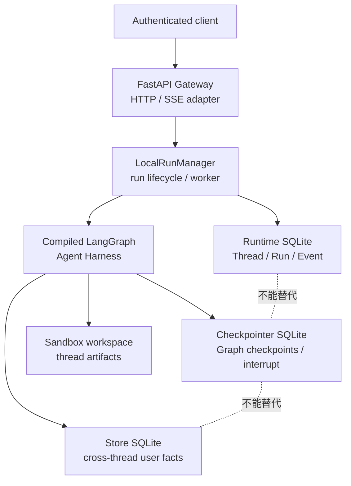
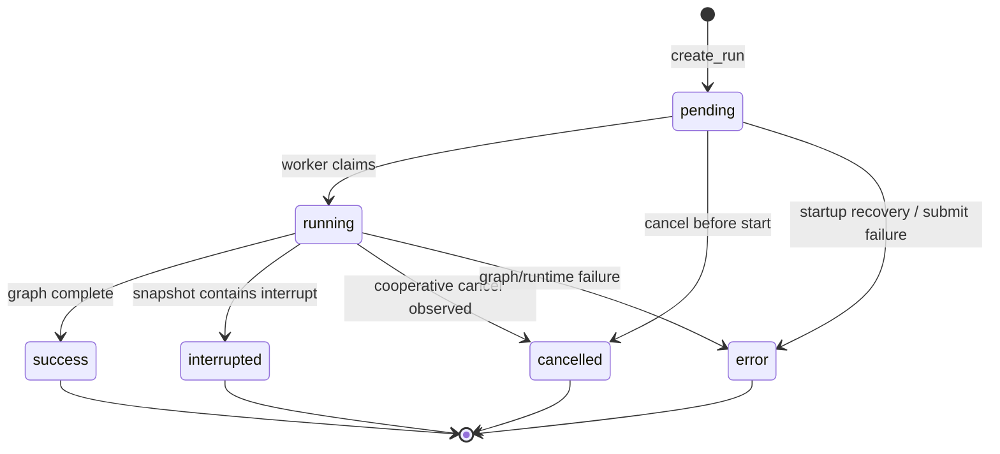
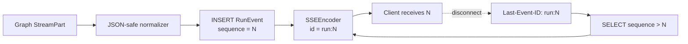

> 校准日期：2026-07-13  
> 前置内容：第 09、10 章、[`LEAD_AGENT_CORE.md`](/langchain-logbook/posts/lead_agent_core/) 与 [`SANDBOX_EXTENSIONS.md`](/langchain-logbook/posts/sandbox_extensions/)  
> 对应实现：`mini_deerflow/runtime/`、`mini_deerflow/api/`、`mini_deerflow/persistence.py`  
> 可执行验收：`tests/test_mini_deerflow_runtime_gateway.py`

## 浏览器一关，任务还在吗

前面的课程已经有了一套完整的 Agent Harness。它能调用工具、保存 Graph State、暂停审批，也能把 Subagent 和工作区隔离开。

现在打开浏览器，提交一份需要几分钟的研究报告。HTTP 请求很快结束，Graph 还在后台检索。此时关闭页面，再从另一台电脑登录：任务是否仍在？已经产生的进度从哪里接着看？

如果任务在审批处暂停，用户第二天点“允许”，系统还要从原来的 checkpoint 继续。如果他点的是“取消”，又不能只关掉一条 SSE 连接就假装任务已经停止。

这些都发生在 Agent Harness 外面。Graph 负责执行节点，却不会替产品确认当前用户是谁、记录一次后台执行，也不会定义浏览器重连协议。

本专题沿这次长任务补齐产品 Runtime：FastAPI 接住认证身份，产品 Thread 绑定用户，Run 记录每次执行，Event journal 保存客户端见过的过程，后台 worker 驱动 LangGraph，SSE 负责重放。

实现会缩小到单进程和 SQLite，但不会省略关键边界。做完以后，你需要能回答这些问题：

1. `checkpoint thread`、产品 `Thread`、一次 `Run` 和 SSE `Event` 的区别；
2. Checkpointer、Store、Runtime Repository 为什么不能合成一张“万能状态表”；
3. pending → running → success/interrupted/error/cancelled 的状态转换；
4. `messages`、`updates`、`values`、`custom` 四种 stream mode 的消费方式；
5. `id/event/data`、heartbeat、`Last-Event-ID` 和 terminal event 如何组成可重放 SSE；
6. disconnect、cancel、interrupt/resume 和进程重启分别改变什么；
7. `langgraph.json`/Agent Server 与自建 FastAPI Gateway 的职责差异；
8. 怎样沿同样的边界阅读 DeerFlow 的 Gateway、RunManager、EventStore 和 StreamBridge。

## 1. 一次 HTTP 请求装不下长任务

先从已经会写的代码开始。最小 LangGraph 调用通常只有：

```python
config = {"configurable": {"thread_id": "thread-1"}}
for part in graph.stream(
    {"messages": [("user", "解释 durable execution")]},
    config=config,
    stream_mode=["updates"],
    version="v2",
):
    print(part)
```

这段代码可以在 Python 进程里跑完。放到 HTTP 路由后，麻烦才出现：谁有权使用 `thread-1`？请求返回以后，执行由谁持有？浏览器断线后，已经输出的事件在哪里？

把 Graph 直接暴露给客户端，会留下下面这些空位：

| 缺口 | 直接暴露 Graph 的后果 |
|---|---|
| authenticated ownership | 客户端可能猜测别人的 `thread_id` 并读取状态 |
| Run identity | 无法查询某次执行处于排队、运行、失败还是中断 |
| durable event journal | 网络断线后只能重新开始，或丢失已经产生的事件 |
| cancellation policy | 关闭页面究竟是取消任务还是只取消订阅，没有协议 |
| error projection | Python exception、HTTP 状态和客户端错误混成一层 |
| worker ownership | 进程重启后，数据库里的 `running` 可能永远占住线程 |
| backpressure | 慢客户端可能拖住 Graph 执行或无限占用内存 |

这里先划一条边界：**Graph runtime 执行图；产品 runtime 把执行变成可查询、可授权、可恢复的业务对象。** 后文出现的 Thread、Run 和 Event，都属于后一侧。

## 2. 先认出四种不同的事实

<!-- diagram:id=runtime-four-storage-boundaries -->


**图的文本替代**：客户端先进入完成认证的 Gateway。Gateway 调用 RunManager 执行 compiled LangGraph；RunManager 把产品 Thread、Run 和 Event 写入 Runtime SQLite。

Graph 还会把 checkpoint 和 interrupt 写入 Checkpointer，把跨线程偏好写入 Store。报告、数据文件等 Artifact 则进入 Sandbox。它们碰巧都要持久化，生命周期却不同。

先用一张表回答“某个事实应去哪里”。等这些职责清楚以后，再看数据库表会轻松得多。

| 事实 | 本项目实现 | 主键/namespace | 回答的问题 |
|---|---|---|---|
| 产品 Thread | `runtime_threads` | `thread_id + user_id` ownership | 谁拥有这段业务会话？元数据是什么？ |
| 一次 Run | `runtime_runs` | `run_id` | 某次执行的状态、输入类型、stream policy 是什么？ |
| 事件日志 | `runtime_events` | `run_id + sequence` | 客户端从哪个事件继续？之前发生了什么？ |
| Graph checkpoint | `SqliteSaver` | LangGraph `thread_id/checkpoint_id` | 图的 State、next tasks、interrupt 在哪里？ |
| 跨线程 Store | `SqliteStore` | 应用定义 namespace/key | 同一用户跨 thread 要记住什么？ |
| Workspace | `SandboxProvider` | opaque `sandbox_id` | 报告、数据文件等大对象在哪里？ |

最容易犯的错，是把聊天消息同时复制到产品 Thread、checkpoint 和 event journal。第一次运行看不出问题；更新或恢复以后，三个副本便可能给出三种答案。

本项目只让 Graph State 保存消息真相。产品 Thread 保存 ownership 和 metadata；event journal 记录客户端已经可见的运行事件。它不是另一份 Graph State。

## 3. 一条请求穿过哪些模块

```text
mini_deerflow/
├── runtime/
│   ├── models.py       # Thread/Run/Event/StateView 领域契约
│   ├── repository.py   # SQLite ownership、状态转换、单调 sequence
│   ├── manager.py      # 后台 worker、Graph 输入、取消、interrupt 判定
│   └── sse.py          # id/event/data 与 Last-Event-ID
├── api/
│   ├── contracts.py    # 不含 user_id 的请求 DTO、稳定响应投影
│   ├── gateway.py      # 传输无关的应用服务、事件订阅
│   └── fastapi.py      # 认证依赖、路由、HTTP 状态、StreamingResponse
├── persistence.py      # SqliteSaver / SqliteStore provider
└── streaming.py        # LangGraph v2 StreamPart → JSON-safe StreamEvent
```

目录看起来不少，不过请求只沿一个方向移动：

```text
FastAPI adapter → Gateway → RunManager → GraphRuntime protocol
                         ↘ SqliteRuntimeRepository
Graph/Agent Harness ──X──→ FastAPI
```

`GraphRuntime` 只要求 `stream()` 和 `get_state()`。因此测试 RunManager 时，不必启动 HTTP，也不必连接真实模型。

反方向的依赖被禁止：Agent tool 和 middleware 不导入 FastAPI `Request`。adapter 先验证身份，再把由应用控制的 Context 交给 Graph。模型没有机会从请求正文里挑选自己的身份。

### 3.1 先沿创建 Run 的路径读代码

第一次读这部分代码，先别逐表检查 repository。只跟一条“创建并等待 Run”的调用：

1. `MiniDeerFlowGateway.start_run()`：把认证 user_id 与请求 DTO 分开传入；
2. `LocalRunManager.start_message()`：创建 pending Run，并立即提交后台 worker；
3. `LocalRunManager._execute()`：claim、写 metadata、消费 Graph stream、写终态；
4. `SqliteRuntimeRepository.append_event()`：在事务中分配 sequence；
5. `MiniDeerFlowGateway.iter_run_events()`：只读取已持久化事件并编码 SSE。

走完这条链，再回头看 FastAPI router。它只负责身份解析、DTO 验证、错误映射和 `StreamingResponse`。Run 状态机不在路由里，这个判断会贯穿后面的实现。

## 4. 先把身份写进产品 Thread

浏览器提交请求时，最先需要固定的不是 prompt，而是身份。`identity_resolver` 从可信 session 或 JWT 得到 `user_id`，Gateway 再用这个身份创建产品 Thread。

这个 Thread 是产品资源。它证明谁拥有会话，也保存业务 metadata。客户端可以提供消息，却不能在 JSON body 中自选 `user_id`、权限、工作区根目录或模型 provider。

### 4.1 同一个 thread_id，两种对象

产品 Thread 与 checkpoint thread 可以共享同一个 `thread_id`。这个复用方便从产品会话找到图状态，但不会把两者变成同一个对象：

- 产品 Thread 证明 `learner-a` 拥有 `thread-runtime-1`；
- LangGraph Checkpointer 用同一 ID 找到图状态；
- 查询层必须同时带 authenticated `user_id`，找不到或不属于该用户都返回 `not_found`；
- 请求 DTO 不接受 `user_id`，避免客户端在 JSON body 中自选身份。

最后一条是刻意的“不可枚举”策略。无权用户得到 404，而不是从 403 中确认某个 Run 或 Thread 的确存在。

### 4.2 Run 记录一次执行

同一个 Thread 可以先提交消息，稍后暂停审批，再由用户恢复。每次动作需要一个独立的 Run，才能分别查询、取消、计费和审计。

<!-- diagram:id=runtime-run-state-machine -->


**图的文本替代**：Run 创建时是 pending，worker 领取后进入 running。pending 可在开始前取消或失败；running 可成功、中断、取消或失败。四个终态都不可再次转换。

恢复 interrupt 时会创建新 Run，旧的 interrupted Run 不会改回 running。稍后看到恢复流程时，这条限制会直接决定事件和审计记录怎样组织。

Repository 不允许随意执行 `status = ?`，只接受图中的显式转换。这样可以阻止：

- success Run 被重复领取；
- interrupted Run 原地复活，破坏审计历史；
- 两个 worker 同时执行同一线程；
- cancel 与 complete 竞态产生互相矛盾的终态。

SQLite partial unique index 保证同一 Thread 同时最多有一个 pending 或 running Run。这个约束够本地实验使用；到了多 worker 环境，还需要真正的分布式 lease。

### 4.3 事件编号不能放在内存里

Run 开始后会不断产生 metadata、updates、interrupt 和 end。浏览器重连要准确指出“我已经看到第几个”，所以每个 Run 都需要严格递增的 sequence。

`runtime_runs.next_sequence` 与 event insert 在同一个 `BEGIN IMMEDIATE` 事务中完成。事件 ID 固定为：

```text
<run_id>:<sequence>
run-a1:1
run-a1:2
```

如果先在 Python 内存里执行 `counter += 1`，两个 producer 可能生成重复 ID，服务重启也会忘记上次序号。sequence 是持久化协议状态，不是展示用的数组下标。

### 4.4 服务重启，running 不能永远挂着

假设进程在执行中崩溃。重启以后，数据库仍写着 running，active-run 唯一索引便会阻止同一 Thread 创建新任务。

本地 `LocalRunManager` 启动时会调用 `recover_inflight_runs()`，把遗留的 pending 或 running Run 写成：

```text
status = error
error_code = worker_restarted
event = error
event = end {"status": "error"}
```

这样既释放 active-run 唯一索引，也让重连客户端收到明确终态。不过，它只适用于“一个进程拥有该 SQLite”的教学部署。

多 worker 服务不能在每个进程启动时终止其他进程的 Run。那时要用 queue、lease、heartbeat 和 worker ownership 判断任务究竟还活着，还是已经失去执行者。

## 5. 请求已经返回，后台任务才刚开始

### 5.1 POST 只创建 pending Run

Gateway 把认证身份和请求 DTO 分开传给 RunManager。RunManager 验证消息与 stream modes，创建 pending Run，然后立即返回。真正的 Graph 执行被提交到线程池：

```python
run = manager.start_message(
    user_id="learner-a",
    thread_id="thread-1",
    message="解释可重放 SSE",
    stream_modes=("messages", "updates", "values", "custom"),
    on_disconnect="continue",
)
```

后台 worker 按以下顺序工作：

1. 检查是否已请求取消；
2. `pending → running`；
3. 持久化 `metadata` 事件；
4. 调用 `graph.stream(..., version="v2")`；
5. 每个 StreamPart 严格 JSON 化后写入事件日志；
6. 调用 `graph.get_state()` 检查 interrupts；
7. 在一个 Repository 事务中写 terminal status、可选 `interrupt/error` 与强制 `end`。

终态和 `end` 的写入顺序不能凭感觉决定。本项目在同一个 `BEGIN IMMEDIATE` 事务中先更新状态，再追加可选终端事件和 `end`。事务提交后，它们同时对订阅者可见。

订阅端只把已经持久化的 `end` 当作正常结束。如果旧数据或手工修改破坏了这条不变量，Gateway 会抛出 runtime conflict，不会把残缺事件流伪装成完整结果。

### 5.1.1 看一次 Run 怎样结束

下面运行真实 Mini DeerFlow Graph、后台 worker 和 SQLite event journal。我们暂时不启动 HTTP server，以免路由细节遮住 Run 的生命周期：

```python
from pathlib import Path
from tempfile import TemporaryDirectory

from mini_deerflow.app import build_application
from mini_deerflow.config import ApplicationSettings
from mini_deerflow.runtime import (
    LocalRunManager,
    RuntimeNotFoundError,
    SqliteRuntimeRepository,
)


with TemporaryDirectory() as directory:
    application = build_application(
        ApplicationSettings.offline(workspace_root=directory)
    )
    repository = SqliteRuntimeRepository(Path(directory) / "runtime.sqlite")
    manager = LocalRunManager(
        repository,
        application.graph,
        context_factory=lambda run: application.context_for(
            request_id=run.run_id,
            user_id=run.user_id,
        ),
    )
    thread = manager.create_thread(
        user_id="learner",
        thread_id="thread-runtime-demo",
    )
    created = manager.start_message(
        user_id="learner",
        thread_id=thread.thread_id,
        message="解释可重放 SSE",
        stream_modes=("updates",),
        on_disconnect="continue",
        run_id="run-runtime-demo",
    )
    completed = manager.wait(
        created.run_id,
        user_id="learner",
        timeout=3,
    )
    events = manager.list_events(created.run_id, user_id="learner")
    replayed = manager.list_events(
        created.run_id,
        user_id="learner",
        after_sequence=events[0].sequence,
    )
    state = manager.get_thread_state(thread.thread_id, user_id="learner")
    try:
        repository.get_run(created.run_id, user_id="other-user")
    except RuntimeNotFoundError as error:
        ownership_error = type(error).__name__
    manager.close()

    print("created_status =", created.status.value)
    print("completed_status =", completed.status.value)
    print(
        "event_type_order =",
        list(dict.fromkeys(event.event for event in events)),
    )
    print("update_count =", sum(event.event == "updates" for event in events))
    print(
        "event_ids_are_monotonic =",
        [event.event_id for event in events]
        == [f"run-runtime-demo:{index}" for index in range(1, len(events) + 1)],
    )
    print("replay_starts_after =", replayed[0].event_id)
    print("last_event =", events[-1].event)
    print("ownership_error =", ownership_error)
    print("state_has_messages =", "messages" in state.values)
```

```text
created_status = pending
completed_status = success
event_type_order = ['metadata', 'updates', 'end']
update_count = 17
event_ids_are_monotonic = True
replay_starts_after = run-runtime-demo:2
last_event = end
ownership_error = RuntimeNotFoundError
state_has_messages = True
```

先看前两行。`start_message()` 立即返回 pending；后台 future 完成以后，同一个 Run 才变成 success。17 个 updates 来自 Graph 的 model、tools 和 Middleware，不是 17 个 HTTP response。

`after_sequence=1` 让重放从 `run-runtime-demo:2` 开始。`other-user` 只能得到 not found。最后一行还证明，产品 Runtime 并没有替代 Graph checkpoint。

**动手修改一**：把 after_sequence 改成最后一个事件的 sequence。确认重放为空，而 Run 本身仍是 success。

**动手修改二**：删除 `manager.close()`，观察测试进程为什么可能继续持有 worker。再说明资源生命周期应由哪一层负责。

### 5.2 Graph 事件怎样进入日志

LangGraph Python streaming v2 把每个 part 统一为 `{type, ns, data}`。`normalize_stream_part()` 先把它变成严格可 JSON 化的数据，再包装为持久事件：

```json
{
  "event": "updates",
  "data": {
    "namespace": [],
    "data": {"model": {"messages": ["..."]}}
  }
}
```

| mode | `data` 的含义 | 客户端典型用途 | 误区 |
|---|---|---|---|
| `messages` | LLM message chunk 与 metadata | token/消息增量 UI | 不保证等于最终 State messages |
| `updates` | 每个 node 的 State 增量 | 步骤时间线、调试、局部 UI | 不能当完整 snapshot |
| `values` | 每一步后的完整 State 值 | 状态镜像、恢复 UI | 大 State 可能很重 |
| `custom` | node/tool 通过 writer 发出的应用事件 | 进度、业务阶段、下载提示 | 必须自行定义稳定 schema |

这四种 `data` 不能强转成同一种结构。客户端按 `event` 分派；遇到未知 event 时忽略或记录，以便服务端将来增加事件而不立即破坏旧客户端。

`metadata`、`interrupt`、`error` 和 `end` 由产品 Runtime 添加。它们不属于某个 Graph stream mode，却是客户端管理长任务所必需的事件。

### 5.3 异常只能投影成有界错误

Graph 抛出异常时，RunManager 不会把 traceback 原样发给浏览器，而是转成稳定、有限的错误对象：

```json
{"code": "runtime_error", "message": "有界的非敏感错误信息"}
```

随后 Run 进入 `error` 终态。Repository exception 再由 HTTP adapter 投影：ownership miss 是 404，状态冲突是 409，等待超时是 408，请求 schema 错误则由 FastAPI 返回 422。

下一专题会补 tracing 和内部错误关联 ID。在那之前，Secret、完整 Context 和 traceback 仍不能进入 SSE；客户端需要的是可处理的错误，诊断系统才需要内部细节。

## 6. 用户批准时，为什么要创建新 Run

长任务执行到发布操作时，Graph 通过 interrupt 暂停。Run A 的事件日志已经完整记录这次执行，终态是 interrupted；checkpoint 则保留图停下的位置和审批 payload。

<!-- diagram:id=runtime-interrupt-resume-sequence -->
```mermaid
sequenceDiagram
    actor User as 用户
    participant API as Gateway
    participant RM as RunManager
    participant G as LangGraph
    participant CP as Checkpointer
    participant RR as Run/Event DB

    User->>API: POST /threads/T/runs
    API->>RM: start_message
    RM->>RR: create Run A
    RM->>G: stream(message, thread_id=T)
    G->>CP: checkpoint + interrupt payload
    G-->>RM: stream ends with pending task
    RM->>RR: Run A → interrupted; interrupt; end
    User->>API: GET /threads/T/state
    API-->>User: next + interrupts
    User->>API: POST /threads/T/runs/resume
    API->>RM: start_resume
    RM->>RR: create Run B
    RM->>G: Command(resume=decision), same thread_id=T
    G->>CP: load checkpoint and continue
    RM->>RR: Run B → success; end
```

**图的文本替代**：消息请求创建 Run A。Graph 在同一 thread checkpoint 中保存 interrupt，Run A 以 interrupted 终结。用户读取 state，看到审批问题。

resume 请求创建 Run B，再以 `Command(resume=...)` 和相同 thread ID 继续 checkpoint。Run B 最终成功，Run A 的历史保持不变。

Run B 不是多余记录。第一次执行暂停与用户稍后批准，是两个发生在不同时间的可审计动作，也可能来自不同请求。让旧 Run 保持终态，取消、计费、trace 和事件回放才有清楚边界。

`start_resume()` 会先读取 State。没有 interrupt 时返回 409，防止把一条普通输入错误包装成 `Command(resume=...)`。

## 7. 浏览器重连，从哪个事件继续

现在回到开头那次断线。任务没有因页面关闭而消失，事件也已经进入 journal。剩下的问题是：浏览器怎样告诉服务器，自己最后成功处理了哪一条？

### 7.1 SSE 帧里只有三个业务字段

每个业务事件编码为标准 SSE 的 `id`、`event` 和 `data`：

```text
id: run-a1:3
event: updates
data: {"data":{"model":{"answer":"完成"}},"namespace":[]}

```

没有新事件时，服务器发送 heartbeat comment。它不带 ID：

```text
: heartbeat

```

heartbeat 不能推进浏览器保存的 last event ID，否则重连可能跳过还没处理的业务事件。`data` 使用紧凑 UTF-8 JSON；正文里的换行留在 JSON 字符串中，不会截断 SSE frame。

### 7.2 先写日志，再发给浏览器

<!-- diagram:id=runtime-sse-replay -->


**图的文本替代**：Graph event 先被严格 JSON 化，以单调 sequence 写入数据库，再编码为 SSE 发给客户端。

客户端收到 N 后断线，重连时携带 `Last-Event-ID: run:N`。Gateway 查询并发送 sequence 大于 N 的事件。

这个协议提供 **at-least-once delivery（至少一次投递）**。客户端可能已经收到事件，却在保存游标前断线；重连后，同一个 event ID 会再次出现。

客户端因此要按 event ID 幂等处理，不能假定每条事件只到达一次。这里不承诺 exactly-once，避免把网络窗口藏在一个听起来更漂亮的术语后面。

### 7.3 客户端按事件类型分派

浏览器 `EventSource` 只支持 GET，header 能力也有限。因此，创建 Run 使用普通 POST；拿到 `run_id` 后，再用 GET 订阅 events。命令行可以用 `curl -N` 验证重放：

```bash
curl -N \
  -H 'Authorization: Bearer <token>' \
  -H 'Last-Event-ID: run-a1:3' \
  http://localhost:8000/threads/thread-1/runs/run-a1/events
```

客户端消费逻辑可以缩成下面这段伪代码：

```python
for event in sse_client:
    if event.type == "messages":
        render_message_chunk(event.data)
    elif event.type == "updates":
        append_step_update(event.data)
    elif event.type == "values":
        replace_state_snapshot(event.data)
    elif event.type == "custom":
        dispatch_domain_event(event.data)
    elif event.type == "interrupt":
        show_approval_form(event.data)
    elif event.type == "error":
        show_run_error(event.data)
    elif event.type == "end":
        persist_cursor(event.id)
        break
```

只有在事件成功应用到 UI 后，客户端才保存 cursor。提前推进 cursor 会在渲染失败或页面崩溃时永久跳过事件。

## 8. 关页面和点取消是两件事

网络可能闪断，用户也可能明确放弃任务。产品需要区分这两个动作，因此在创建 Run 时固定 `on_disconnect` 策略：

| 值 | SSE 客户端断开时 | 适用场景 |
|---|---|---|
| `continue` | 只停止订阅，后台 Run 继续，之后可重放 | 研究、报告、长任务 |
| `cancel` | Gateway 请求协作式取消 | 实时问答、结果无人再需要 |

这里的 cancel 是 cooperative。RunManager 在开始执行和每个 stream part 之间检查 `cancel_requested`；Repository 在事务中确认 Run 仍为 active，再设置取消标志。

这个检查可以避免 complete 与 cancel 的竞态改写一个已经成功的 Run，却不能中断任意 Python 代码。

如果节点卡在第三方 HTTP、CPU 循环或宿主进程里，取消标志无法强杀它。Hard cancellation 还需要 provider timeout、任务队列、进程或容器隔离，以及 worker lease。

事件先落 SQLite，慢客户端便不会直接阻塞 Graph producer。不过数据库并非无限队列。生产实现还要补上：

- event retention/compaction；
- 单 Run 最大事件数和 data 大小；
- subscriber 数量、轮询与 heartbeat 预算；
- 慢消费者断开策略；
- Redis/pubsub 或数据库通知，避免高频 polling；
- messages token 事件与 values 大 snapshot 的差异化保留。

## 9. 把刚才的动作固定为 HTTP 契约

至此，浏览器长任务已经走完：创建 Thread、启动 Run、查询状态、订阅或重放事件、取消，以及用新 Run 恢复审批。HTTP 层只需把这些动作稳定地暴露出来：

| Method/Path | 成功码 | 用途 |
|---|---:|---|
| `POST /threads` | 201 | 创建带 ownership 的产品 Thread |
| `GET /threads/{thread}/state` | 200 | 读取 Graph checkpoint 投影 |
| `POST /threads/{thread}/runs` | 202 | 启动消息 Run |
| `GET /threads/{thread}/runs/{run}` | 200 | 查询 Run |
| `POST /threads/{thread}/runs/{run}/wait` | 200 | 教学/测试用有界等待，不取消后台任务 |
| `GET /threads/{thread}/runs/{run}/events` | 200 SSE | 全量订阅或 Last-Event-ID 重放 |
| `POST /threads/{thread}/runs/{run}/cancel` | 200 | 请求协作式取消 |
| `POST /threads/{thread}/runs/resume` | 202 | 以新 Run 恢复当前 interrupt |

`create_fastapi_app()` 故意要求调用方提供 `identity_resolver(Request) -> user_id`。课程测试通过 header 注入假身份；真实服务必须接入可信的 session 或 JWT middleware。

请求体中没有 `user_id`、permissions、workspace root 或 provider 配置。这些值来自应用信任边界，不能交给浏览器选择。

FastAPI adapter 也不拥有 manager、checkpointer 和 store 的生命周期。生产组合根应在 lifespan 中打开资源；关闭时先停止接收新 Run，再 drain 或 cancel worker，最后关闭数据库。

如果每个 request 都重建这些对象，连接无法复用，worker ownership 也失去稳定归属。路由函数越薄，这类生命周期问题越容易集中处理。

## 10. 重启服务后，哪些事实还在

浏览器已经能重连，但服务进程本身也会重启。为了看清恢复来自哪里，重建测试刻意使用三份 SQLite：

```python
from dataclasses import replace

from mini_deerflow.app import build_application, build_default_dependencies
from mini_deerflow.persistence import open_sqlite_checkpointer, open_sqlite_store
from mini_deerflow.runtime import LocalRunManager, SqliteRuntimeRepository

with (
    open_sqlite_checkpointer("data/checkpoints.sqlite") as checkpointer,
    open_sqlite_store("data/store.sqlite") as store,
):
    dependencies = replace(
        build_default_dependencies(settings),
        checkpointer=checkpointer,
        store=store,
    )
    application = build_application(settings, dependencies=dependencies)
    repository = SqliteRuntimeRepository("data/runtime.sqlite")
    manager = LocalRunManager(
        repository,
        application.graph,
        context_factory=lambda run: application.context_for(
            request_id=run.run_id,
            user_id=run.user_id,
        ),
    )
```

关闭服务，再重新打开三份资源，应观察到：

- Runtime Repository 仍能查询旧 Thread、Run 和 Event；
- Checkpointer 恢复旧 messages/interrupt，第二次 Run 继续同一线程；
- Store 恢复用户偏好；
- 新 Run 获得新 ID，不覆盖旧运行历史。

SQLite 适合本地学习和单进程开发。异步高并发服务应考虑 async driver 或 managed database；多 worker 还要引入 queue、lease 和 pubsub。

只把 SQLite URL 换成 PostgreSQL，并不会自动得到分布式调度。数据库能共享记录，仍不能替 worker 决定谁领取、谁续租、失联后由谁接管。

## 11. 哪些工作应该交给 Agent Server

我们刚刚亲手实现了 Thread、Run、事件重放和 worker 生命周期。这样做的价值，是看见产品 Runtime 的边界；它不说明每个项目都应该维护这套基础设施。

`langgraph.json` 是 graph 部署声明，告诉工具链 graph 工厂、依赖和环境在哪里。Agent Server 则在 graph 外提供数据库、任务队列、Thread/Run API、流式传输和 managed persistence。

Agent Server 仍不会替产品定义业务权限、工具安全、State schema 或 UX。下面的比较用来决定基础设施由谁维护，而不是比较哪条路线更“高级”。

| 决策维度 | Agent Server 路线 | 自建 FastAPI Gateway 路线 |
|---|---|---|
| Thread/Run/stream 基础设施 | 官方提供并持续演进 | 团队自行设计、迁移和运维 |
| Checkpointer/Store | Server 管理并注入 | 组合根自己管理 provider 生命周期 |
| 调度与 worker | 内建 queue/worker 语义 | 必须自行实现 lease、重试、drain |
| API 兼容 | 官方 SDK/协议 | 可以只暴露产品需要的窄 API |
| 自定义认证/多租户 | 通过平台/部署能力组合 | 能深度嵌入现有 IAM 与业务数据库 |
| 自定义事件/遗留协议 | 在官方扩展点内工作 | 完全可控，但兼容成本由自己承担 |
| 学习价值 | 快速掌握标准运行平台 | 深入理解 runtime 边界与失败模式 |

我的默认选择很直接：产品没有特殊调度、遗留协议兼容或现有 IAM 深度集成时，先评估 Agent Server。FastAPI 路由看起来简单，真正昂贵的是路由背后的队列、lease、迁移和运维。

Mini DeerFlow 自建 Gateway，是为了让这些边界可见，并为阅读 DeerFlow 做准备。把它学会，不等于以后每个项目都要重写官方运行平台。

## 12. 现在再读 DeerFlow 的 Runtime

本专题对照 DeerFlow `main` 的固定提交 [`3e7baba39a9597e480dd82bbc18aee806679a2bf`](https://github.com/bytedance/deer-flow/tree/3e7baba39a9597e480dd82bbc18aee806679a2bf)。固定提交让每条判断都能复查，并不表示课程复制了完整实现。

> **锚点说明**：这里保留的是本专题写作时的历史对照版本，用来复核 Runtime/Gateway 的局部设计；全书最后四条源码路线的统一验收版本，以 [`DEERFLOW_GUIDE.md`](/langchain-logbook/posts/deerflow_guide/) 的 `4af6178` 为准。

现在已有一条浏览器长任务作为线索，可以按调用方向阅读，不必从 FastAPI router 随机跳转：

```text
gateway routers
→ gateway/services.py
→ runtime/runs/manager.py
→ runtime/runs/worker.py
→ runtime/runs/store.py + runtime/events/store.py
→ runtime/stream_bridge/base.py
→ Agent Harness / compiled graph
```

| Mini DeerFlow | DeerFlow 对应概念 | 读代码时要观察什么 |
|---|---|---|
| `api/fastapi.py` | Gateway thread/run routers | HTTP adapter 如何只做验证、投影和服务调用 |
| `api/gateway.py` | Gateway services | ownership 与 runtime client 如何组合 |
| `LocalRunManager` | `runtime/runs/manager.py` + worker | run 领取、后台执行、取消和终态归属 |
| `SqliteRuntimeRepository` | run store + event store | Run metadata 为什么与 checkpoint 分开 |
| `SSEEncoder`/iterator | StreamBridge | 单调 ID、Last-Event-ID、heartbeat、结束哨兵 |
| `graph.stream(v2)` | Harness graph streaming | Graph modes 如何转成产品事件 |
| `on_disconnect` | async Gateway 与 sync client 两条路径 | transport 断开与 run cancellation 是否解耦 |

沿这条路线会看到四个熟悉的关系：Gateway 与 Agent Harness 分层；Run/Event metadata 独立持久化；StreamBridge 处理重放游标和 heartbeat；取消由 worker 协作执行。

DeerFlow 暴露 LangGraph-compatible surface，也没有完整复制官方平台。Mini DeerFlow 缩小了实现规模，保留的正是这些可迁移的架构关系。

## 13. 出错时，从哪一层开始查

这套 Runtime 有意保留了可以单独破坏的边界。下面每个实验只动一处，再观察故障首先出现在哪里：

| 实验 | 故意破坏 | 预期可观察失败 | 应修复的边界 |
|---|---|---|---|
| ownership | 只按 thread_id 查询 | learner-b 能读 learner-a state | Repository 查询必须带认证 user_id |
| active run | 删除 partial unique index | 同线程两个 Run 同时改 State | queue/claim 与唯一 active 策略 |
| event ID | 用内存 counter | 重启或并发后重复 ID | 数据库事务分配 sequence |
| replay | 先发送后落库 | 断线窗口永久丢 event | 先持久化后发送 |
| heartbeat | 给 comment 分配 ID | 重连跳过未处理业务事件 | comment 不推进游标 |
| resume | 把 interrupted Run 改回 running | 历史、trace、取消边界混乱 | 新 Run + 同 thread + Command(resume) |
| disconnect | 默认把断线当 cancel | 长报告因网络闪断丢失 | 显式 `continue/cancel` policy |
| cancel | 以为 flag 能强杀 node | 阻塞 HTTP 仍继续占 worker | provider timeout/进程隔离 |
| restart | active Run 永远 running | 新 Run 被唯一索引阻塞 | 单 worker startup recovery 或生产 lease |
| error | 把 traceback 放 SSE | Secret/路径泄漏 | 结构化、有界、脱敏错误投影 |

真正诊断时，也按这个方向逐层向内：HTTP 状态 → Run record → Event journal → Graph snapshot/history → Store/workspace。

浏览器最后一行错误只是投影。先找到哪一层的持久事实开始不一致，再去检查 Graph 节点，会比直接猜 prompt 或模型稳定得多。

## 14. 把本地实现推向生产约束

### 练习 A：为 custom event 建立版本契约

定义 `progress.v1`，至少包含 `stage/current/total`，用 Pydantic 验证后再进入 event journal。

增加一个失败测试：`total=0` 或 `current>total` 时，Run 进入结构化 error。最后判断 schema 版本应该放在 event name，还是放进 data。

### 练习 B：实现 event retention

为 success Run 增加 retention policy：保留 metadata/end/error/interrupt，对高频 messages 做有界压缩。

证明 `Last-Event-ID` 落在已清理区间时，API 返回明确的 `replay_window_expired`，不会悄悄从错误位置继续。

### 练习 C：把 polling 换成通知

保持 `MiniDeerFlowGateway.iter_run_events()` 接口不变，用 `Condition`、数据库通知或 Redis pubsub 替换固定 sleep。

验证无事件时 heartbeat 仍准时，Run 进入终态后不再泄漏 subscriber。

### 练习 D：设计生产 worker lease

在 Run 表增加 `worker_id/lease_expires_at/heartbeat_at/attempt`，写出 claim、renew、steal 的状态和事务条件。

用一个竞态测试解释：为什么 `recover_inflight_runs()` 不能直接用于两个进程。

### 练习 E：Agent Server 迁移实验

用根目录 `langgraph.json` 启动标准 graph 服务，对比官方 threads/runs/stream API 与本项目路由。

列出迁移后可以删除的产品代码，以及仍需保留的业务认证、Context 和 tool policy。

## 15. 先跑契约，再关掉正文回忆

先只运行本专题契约：

```bash
uv run --locked --group dev python -m unittest \
  tests.test_mini_deerflow_runtime_gateway -v
```

然后运行全课程：

```bash
make test
make check
```

测试覆盖 repository 重启与 ownership、单调 event ID、原子终态与 SSE 重放、四种 Graph modes、真实 LangGraph interrupt/resume、协作取消、FastAPI 首帧预取后的关闭传播、错误脱敏与错误游标。

最后一组测试会完整重建 Checkpointer、Store 和 Runtime，确认它们各自恢复自己的事实。

隔一天后，不看正文回答：

1. 为什么 Checkpointer 不足以回答“Run 是否已取消”？
2. 为什么 resume 创建新 Run，却复用旧 thread ID？
3. 为什么 heartbeat 不能带新的 event ID？
4. `updates` 与 `values` 的 data 为什么不能由同一个 UI reducer 盲目合并？
5. `continue` disconnect policy 为什么仍需要 event retention？
6. 单进程 startup recovery 到多 worker 时为什么会变成危险行为？
7. 哪些能力应优先交给 Agent Server，哪些仍属于业务应用？

如果只能背出答案，就回到失败实验。先写出缺少某条边界时会出现的具体错误，再重新设计接口；能从故障推回职责，才算真正理解产品 Runtime。

## 16. 继续核对官方资料

- [LangGraph Streaming](https://docs.langchain.com/oss/python/langgraph/streaming)：v2 stream part 与 stream modes。
- [LangGraph Persistence](https://docs.langchain.com/oss/python/langgraph/persistence)：checkpoint、thread、Store 与本地 SQLite provider。
- [LangGraph Interrupts](https://docs.langchain.com/oss/python/langgraph/interrupts)：持久暂停和 `Command(resume=...)`。
- [Agent Server](https://docs.langchain.com/langsmith/agent-server)：graph、数据库、任务队列与服务职责。
- [Join a thread stream](https://docs.langchain.com/langsmith/agent-server-api/threads/join-thread-stream)：重连与 `Last-Event-ID`。
- [Cancel runs](https://docs.langchain.com/langsmith/cancel-run)：官方运行取消语义。
- [WHATWG Server-sent events](https://html.spec.whatwg.org/multipage/server-sent-events.html)：SSE wire format、event ID 与重连。
- [FastAPI StreamingResponse](https://fastapi.tiangolo.com/advanced/stream-data/)：流式响应适配器。
- [DeerFlow STREAMING.md at fixed commit](https://github.com/bytedance/deer-flow/blob/3e7baba39a9597e480dd82bbc18aee806679a2bf/backend/docs/STREAMING.md)：DeerFlow 两条 streaming 路径与消费约定。

现在，这次浏览器长任务可以被创建、取消、恢复和重放。Agent 的运行边界已经闭合，结果质量仍没有得到证明。

下一篇会分别检查“运行结束”“结果正确”“轨迹合规”和“失败可解释”，建立部署前与生产后的质量闭环。

继续阅读：[测试、Agent 评测、可观测性与安全回归](/langchain-logbook/posts/evaluation_observability/)。