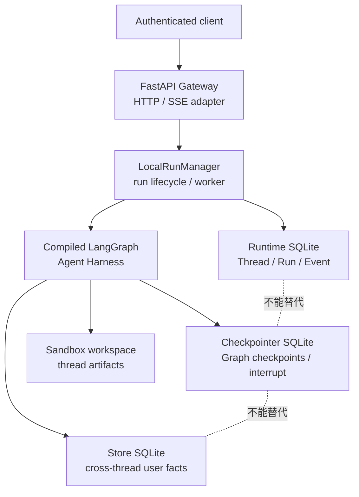
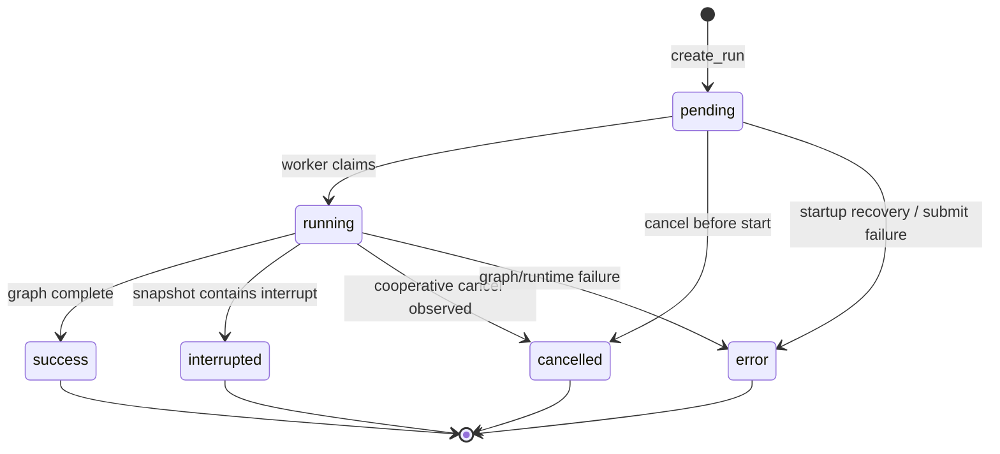
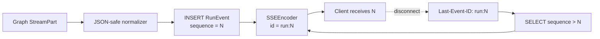

> 校准日期：2026-07-13  
> 前置内容：第 09、10 章、[`LEAD_AGENT_CORE.md`](/langchain-logbook/posts/lead_agent_core/) 与 [`SANDBOX_EXTENSIONS.md`](/langchain-logbook/posts/sandbox_extensions/)  
> 对应实现：`mini_deerflow/runtime/`、`mini_deerflow/api/`、`mini_deerflow/persistence.py`  
> 可执行验收：`tests/test_mini_deerflow_runtime_gateway.py`

## 系统快照：Agent Harness 已经完整，客户端仍无法管理长任务

前面的课程已经能构建 Agent、保存 Graph State、暂停审批、隔离 Subagent 和工作区。但“可以调用一个 compiled graph”还不等于“可以把 Agent 作为业务服务交付”。

上一篇的 Lead/Sandbox 都发生在 Agent Harness 内部。现在把浏览器放到它前面：浏览器发出请求后可能立刻断线，另一个进程稍后恢复服务，用户还会查询、取消或批准任务。Graph 本身不会替产品回答这些问题。

因此本专题不从 FastAPI 路由开始。学习顺序固定为：先区分持久事实，再建立 Thread/Run/Event repository，随后让 RunManager 驱动 Graph，最后才把持久事件投影成 SSE 和 HTTP。

真实客户端还会问：对话线程由谁创建？一次执行为什么有单独 Run ID？浏览器断线后任务是否继续？如何取消？重连从哪个事件继续？服务进程重启后哪些事实还在？

本专题实现一个缩小但不造假的产品运行时：SQLite 保存 Thread/Run/Event，后台 worker 执行 LangGraph，FastAPI 只适配 HTTP，SSE 事件先持久化再发送。学习目标不是复制 Agent Server，而是亲手建立这些边界，然后知道什么时候应直接采用 Agent Server，什么时候自建 Gateway 才有价值。

完成本专题后，你应该能独立解释并实现：

1. `checkpoint thread`、产品 `Thread`、一次 `Run` 和 SSE `Event` 的区别；
2. Checkpointer、Store、Runtime Repository 为什么不能合成一张“万能状态表”；
3. pending → running → success/interrupted/error/cancelled 的状态转换；
4. `messages`、`updates`、`values`、`custom` 四种 stream mode 的消费方式；
5. `id/event/data`、heartbeat、`Last-Event-ID` 和 terminal event 如何组成可重放 SSE；
6. disconnect、cancel、interrupt/resume 和进程重启分别改变什么；
7. `langgraph.json`/Agent Server 与自建 FastAPI Gateway 的职责差异；
8. 怎样沿同样的边界阅读 DeerFlow 的 Gateway、RunManager、EventStore 和 StreamBridge。

## 1. 先从失败模型开始：Graph 能运行，为什么仍不是服务？

最小 LangGraph 调用通常只有：

```python
config = {"configurable": {"thread_id": "thread-1"}}
for part in graph.stream(
    {"messages": [("user", "解释 durable execution")]},
    config=config,
    stream_mode=["updates"],
    version="v2",
):
    print(part)
```

这段代码正确使用了 Graph，但没有回答产品运行时问题：

| 缺口 | 直接暴露 Graph 的后果 |
|---|---|
| authenticated ownership | 客户端可能猜测别人的 `thread_id` 并读取状态 |
| Run identity | 无法查询某次执行处于排队、运行、失败还是中断 |
| durable event journal | 网络断线后只能重新开始，或丢失已经产生的事件 |
| cancellation policy | 关闭页面究竟是取消任务还是只取消订阅，没有协议 |
| error projection | Python exception、HTTP 状态和客户端错误混成一层 |
| worker ownership | 进程重启后，数据库里的 `running` 可能永远占住线程 |
| backpressure | 慢客户端可能拖住 Graph 执行或无限占用内存 |

所以第一条原则是：**Graph runtime 负责执行图，产品 runtime 负责把执行变成可查询、可授权、可恢复的业务对象。**

## 2. 四类持久化事实必须分开

<!-- diagram:id=runtime-four-storage-boundaries -->


**图的文本替代**：客户端进入认证后的 Gateway，Gateway 调用 RunManager 执行 compiled LangGraph。RunManager 把产品 Thread、Run 和 Event 写入 Runtime SQLite。

Graph 把 checkpoint/interrupt 写入 Checkpointer，把跨线程偏好写入 Store；Artifact 进入 Sandbox 工作区。这四类存储生命周期不同，不能互相冒充。

| 事实 | 本项目实现 | 主键/namespace | 回答的问题 |
|---|---|---|---|
| 产品 Thread | `runtime_threads` | `thread_id + user_id` ownership | 谁拥有这段业务会话？元数据是什么？ |
| 一次 Run | `runtime_runs` | `run_id` | 某次执行的状态、输入类型、stream policy 是什么？ |
| 事件日志 | `runtime_events` | `run_id + sequence` | 客户端从哪个事件继续？之前发生了什么？ |
| Graph checkpoint | `SqliteSaver` | LangGraph `thread_id/checkpoint_id` | 图的 State、next tasks、interrupt 在哪里？ |
| 跨线程 Store | `SqliteStore` | 应用定义 namespace/key | 同一用户跨 thread 要记住什么？ |
| Workspace | `SandboxProvider` | opaque `sandbox_id` | 报告、数据文件等大对象在哪里？ |

一个常见错误是把聊天 messages 同时复制到产品 Thread 表、checkpoint 和 event journal，随后三个副本互相漂移。这里的选择是：Graph State 是消息真相；产品 Thread 只保存 ownership/metadata；event journal 保存“客户端已经可见的运行事件”，不是另一个 State 副本。

## 3. 代码结构：深模块与依赖方向

```text
mini_deerflow/
├── runtime/
│   ├── models.py       # Thread/Run/Event/StateView 领域契约
│   ├── repository.py   # SQLite ownership、状态转换、单调 sequence
│   ├── manager.py      # 后台 worker、Graph 输入、取消、interrupt 判定
│   └── sse.py          # id/event/data 与 Last-Event-ID
├── api/
│   ├── contracts.py    # 不含 user_id 的请求 DTO、稳定响应投影
│   ├── gateway.py      # 传输无关的应用服务、事件订阅
│   └── fastapi.py      # 认证依赖、路由、HTTP 状态、StreamingResponse
├── persistence.py      # SqliteSaver / SqliteStore provider
└── streaming.py        # LangGraph v2 StreamPart → JSON-safe StreamEvent
```

依赖方向固定为：

```text
FastAPI adapter → Gateway → RunManager → GraphRuntime protocol
                         ↘ SqliteRuntimeRepository
Graph/Agent Harness ──X──→ FastAPI
```

`GraphRuntime` 只要求 `stream()` 和 `get_state()`，所以 RunManager 测试不需要启动 HTTP，也不需要真实模型。反过来，Agent tool/middleware 不 import FastAPI Request；认证身份由 adapter 验证后，通过应用控制的 Context 进入 Graph。

### 3.1 第一次阅读只追一条请求

先不要逐表阅读 repository。按下面顺序跟一条“创建并等待 Run”的调用：

1. `MiniDeerFlowGateway.start_run()`：把认证 user_id 与请求 DTO 分开传入；
2. `LocalRunManager.start_message()`：创建 pending Run，并立即提交后台 worker；
3. `LocalRunManager._execute()`：claim、写 metadata、消费 Graph stream、写终态；
4. `SqliteRuntimeRepository.append_event()`：在事务中分配 sequence；
5. `MiniDeerFlowGateway.iter_run_events()`：只读取已持久化事件并编码 SSE。

读完这条链，再回头看 FastAPI router。你会发现 router 只做身份解析、DTO 验证、错误映射和 StreamingResponse，不拥有 Run 状态机。

## 4. TDD 纵切面一：Repository 先固定所有权与状态机

### 4.1 产品 Thread 不等于 checkpoint thread

两者可以共享同一个 `thread_id`，但不是同一个对象：

- 产品 Thread 证明 `learner-a` 拥有 `thread-runtime-1`；
- LangGraph Checkpointer 用同一 ID 找到图状态；
- 查询层必须同时带 authenticated `user_id`，找不到或不属于该用户都返回 `not_found`；
- 请求 DTO 不接受 `user_id`，避免客户端在 JSON body 中自选身份。

这是刻意的“不可枚举”策略：对无权用户返回 404，而不是用 403 暴露某个 Run/Thread 的确存在。

### 4.2 Run 状态机

<!-- diagram:id=runtime-run-state-machine -->


**图的文本替代**：Run 创建后为 pending，worker 领取后进入 running。pending 可在开始前取消或失败；running 可成功、中断、取消或失败。四个终态都不可再次转换。恢复 interrupt 会创建一个新的 Run，而不是把旧 interrupted Run 改回 running。

显式转换表比 `status = ?` 任意更新重要，因为它阻止：

- success Run 被重复领取；
- interrupted Run 原地复活，破坏审计历史；
- 两个 worker 同时执行同一线程；
- cancel 与 complete 竞态产生互相矛盾的终态。

SQLite partial unique index保证同一 Thread 同时最多有一个 pending/running Run。它是本地教学实现的并发约束，不等于生产分布式 lease。

### 4.3 Event sequence 必须在事务内分配

`runtime_runs.next_sequence` 与 event insert 在同一个 `BEGIN IMMEDIATE` 事务中完成，因此每个 Run 得到严格递增的 1、2、3……。事件 ID 固定为：

```text
<run_id>:<sequence>
run-a1:1
run-a1:2
```

如果先在 Python 内存中 `counter += 1` 再写数据库，两个 producer 会生成重复 ID；服务重启也会忘记上次序号。sequence 是持久化协议状态，不是展示用的数组下标。

### 4.4 单 worker 的启动恢复

本地 `LocalRunManager` 启动时调用 `recover_inflight_runs()`：数据库里遗留的 pending/running Run 被写成：

```text
status = error
error_code = worker_restarted
event = error
event = end {"status": "error"}
```

这既释放 active-run 唯一索引，也让重连客户端收到明确终态。它只适用于“一个进程拥有该 SQLite”的教学部署。生产多 worker 不能让每个进程启动时终止其他进程的 Run，而应使用 queue、lease、heartbeat 和 worker ownership。

## 5. TDD 纵切面二：RunManager 把 Graph 执行变成业务 Run

### 5.1 启动消息 Run

RunManager 接受经过验证的消息和 stream modes，然后立即返回 pending Run；真正执行进入线程池：

```python
run = manager.start_message(
    user_id="learner-a",
    thread_id="thread-1",
    message="解释可重放 SSE",
    stream_modes=("messages", "updates", "values", "custom"),
    on_disconnect="continue",
)
```

worker 的顺序是：

1. 检查是否已请求取消；
2. `pending → running`；
3. 持久化 `metadata` 事件；
4. 调用 `graph.stream(..., version="v2")`；
5. 每个 StreamPart 严格 JSON 化后写入事件日志；
6. 调用 `graph.get_state()` 检查 interrupts；
7. 在一个 Repository 事务中写 terminal status、可选 `interrupt/error` 与强制 `end`。

“先写 status 还是先写 end”是协议选择。本项目在同一个 `BEGIN IMMEDIATE` 事务中先更新状态，再追加可选终端业务事件和 `end`；提交后它们同时可见，避免崩溃留下“终态但没有 end”。订阅端只把持久化的 end 当正常终止；若旧数据或手工修改破坏该不变量，Gateway 抛出 runtime conflict，而不是静默伪装成完整流。

### 5.1.1 运行一条完整的 pending → success → replay

下面使用真实 Mini DeerFlow Graph、真实后台 worker 和 SQLite event journal，但不启动 HTTP server：

```python
from pathlib import Path
from tempfile import TemporaryDirectory

from mini_deerflow.app import build_application
from mini_deerflow.config import ApplicationSettings
from mini_deerflow.runtime import (
    LocalRunManager,
    RuntimeNotFoundError,
    SqliteRuntimeRepository,
)


with TemporaryDirectory() as directory:
    application = build_application(
        ApplicationSettings.offline(workspace_root=directory)
    )
    repository = SqliteRuntimeRepository(Path(directory) / "runtime.sqlite")
    manager = LocalRunManager(
        repository,
        application.graph,
        context_factory=lambda run: application.context_for(
            request_id=run.run_id,
            user_id=run.user_id,
        ),
    )
    thread = manager.create_thread(
        user_id="learner",
        thread_id="thread-runtime-demo",
    )
    created = manager.start_message(
        user_id="learner",
        thread_id=thread.thread_id,
        message="解释可重放 SSE",
        stream_modes=("updates",),
        on_disconnect="continue",
        run_id="run-runtime-demo",
    )
    completed = manager.wait(
        created.run_id,
        user_id="learner",
        timeout=3,
    )
    events = manager.list_events(created.run_id, user_id="learner")
    replayed = manager.list_events(
        created.run_id,
        user_id="learner",
        after_sequence=events[0].sequence,
    )
    state = manager.get_thread_state(thread.thread_id, user_id="learner")
    try:
        repository.get_run(created.run_id, user_id="other-user")
    except RuntimeNotFoundError as error:
        ownership_error = type(error).__name__
    manager.close()

    print("created_status =", created.status.value)
    print("completed_status =", completed.status.value)
    print(
        "event_type_order =",
        list(dict.fromkeys(event.event for event in events)),
    )
    print("update_count =", sum(event.event == "updates" for event in events))
    print(
        "event_ids_are_monotonic =",
        [event.event_id for event in events]
        == [f"run-runtime-demo:{index}" for index in range(1, len(events) + 1)],
    )
    print("replay_starts_after =", replayed[0].event_id)
    print("last_event =", events[-1].event)
    print("ownership_error =", ownership_error)
    print("state_has_messages =", "messages" in state.values)
```

```text
created_status = pending
completed_status = success
event_type_order = ['metadata', 'updates', 'end']
update_count = 17
event_ids_are_monotonic = True
replay_starts_after = run-runtime-demo:2
last_event = end
ownership_error = RuntimeNotFoundError
state_has_messages = True
```

第一行来自 `start_message()` 的立即返回；第二行来自后台 future 的终态。17 个 updates 是本章 Graph 的 model、tools 和 Middleware 更新，不是 17 个 HTTP response。

`after_sequence=1` 让重放从 `run-runtime-demo:2` 开始。other-user 得到 not found，而不是知道该 Run 确实属于别人；最后一行则证明产品 Runtime 没有替代 Graph checkpoint。

**动手修改一**：把 after_sequence 改成最后一个事件的 sequence。确认重放为空，而 Run 本身仍是 success。

**动手修改二**：删除 `manager.close()`，观察测试进程为何可能继续持有 worker。说明资源生命周期应由哪一层负责。

### 5.2 v2 stream mode 的统一 envelope

当前 LangGraph Python streaming v2 把 part 统一为 `{type, ns, data}`。本项目复用 `normalize_stream_part()`，再把它包装为持久事件：

```json
{
  "event": "updates",
  "data": {
    "namespace": [],
    "data": {"model": {"messages": ["..."]}}
  }
}
```

| mode | `data` 的含义 | 客户端典型用途 | 误区 |
|---|---|---|---|
| `messages` | LLM message chunk 与 metadata | token/消息增量 UI | 不保证等于最终 State messages |
| `updates` | 每个 node 的 State 增量 | 步骤时间线、调试、局部 UI | 不能当完整 snapshot |
| `values` | 每一步后的完整 State 值 | 状态镜像、恢复 UI | 大 State 可能很重 |
| `custom` | node/tool 通过 writer 发出的应用事件 | 进度、业务阶段、下载提示 | 必须自行定义稳定 schema |

客户端应按 `event` 分派，未知 event 默认忽略或记录，不能把四种 data 强转成同一个结构。`metadata`、`interrupt`、`error` 和 `end` 是产品 runtime 增加的事件，不来自某个 Graph stream mode。

### 5.3 错误投影

Graph exception 不直接作为 traceback 发给客户端。RunManager 将其转为：

```json
{"code": "runtime_error", "message": "有界的非敏感错误信息"}
```

并进入 `error` 终态。Repository exception 再由 HTTP adapter 投影：ownership miss → 404，状态冲突 → 409，等待超时 → 408，请求 schema 错误 → FastAPI 422。下一任务会补 tracing 和内部错误关联 ID；在此之前仍不得把 Secret、完整 Context 或 traceback 写进 SSE。

## 6. TDD 纵切面三：interrupt 恢复不是重启旧 Run

<!-- diagram:id=runtime-interrupt-resume-sequence -->
```mermaid
sequenceDiagram
    actor User as 用户
    participant API as Gateway
    participant RM as RunManager
    participant G as LangGraph
    participant CP as Checkpointer
    participant RR as Run/Event DB

    User->>API: POST /threads/T/runs
    API->>RM: start_message
    RM->>RR: create Run A
    RM->>G: stream(message, thread_id=T)
    G->>CP: checkpoint + interrupt payload
    G-->>RM: stream ends with pending task
    RM->>RR: Run A → interrupted; interrupt; end
    User->>API: GET /threads/T/state
    API-->>User: next + interrupts
    User->>API: POST /threads/T/runs/resume
    API->>RM: start_resume
    RM->>RR: create Run B
    RM->>G: Command(resume=decision), same thread_id=T
    G->>CP: load checkpoint and continue
    RM->>RR: Run B → success; end
```

**图的文本替代**：消息请求创建 Run A。Graph 在同一 thread checkpoint 中保存 interrupt，Run A 以 interrupted 终结。用户读取 state 得到审批问题；resume 请求创建 Run B，用 `Command(resume=...)` 和相同 thread ID 继续 checkpoint，Run B 最终成功。

为什么必须创建 Run B？因为“第一次执行暂停”和“用户稍后批准后的继续执行”是两个可审计动作，可能由不同身份、请求和时间触发。旧 Run 终态不可变，使取消、计费、trace 和事件回放都更清楚。

本项目在 `start_resume()` 前读取 State，若没有 interrupt 则返回 409，避免把普通输入错误地包装成 `Command(resume=...)`。

## 7. TDD 纵切面四：SSE 是持久事件的视图

### 7.1 Wire frame

每个业务事件编码为标准 SSE 字段：

```text
id: run-a1:3
event: updates
data: {"data":{"model":{"answer":"完成"}},"namespace":[]}

```

heartbeat 是 comment，不带 ID：

```text
: heartbeat

```

这样 heartbeat 不会推进浏览器保存的 last event ID，也不会让重连跳过业务事件。JSON 使用紧凑 UTF-8 表示，换行被编码在 data JSON 字符串内，不会破坏 SSE frame。

### 7.2 先持久化、后发送

<!-- diagram:id=runtime-sse-replay -->


**图的文本替代**：Graph event 先被严格 JSON 化并以单调 sequence 写入数据库，再编码为 SSE 发给客户端。客户端收到 N 后断线，重连携带 `Last-Event-ID: run:N`，Gateway 只查询并发送 sequence 大于 N 的事件。

这提供的是 **at-least-once delivery（至少一次投递）** 的可实现基础，不是 exactly-once：客户端可能收到事件后、保存本地游标前断线，因此重连会再次看到同一个 event ID。正确客户端应按 event ID 幂等处理。

### 7.3 一个最小客户端分派器

浏览器 `EventSource` 只支持 GET 且 header 能力有限；创建 Run 应用普通 POST，再订阅 GET events。命令行可用 `curl -N`：

```bash
curl -N \
  -H 'Authorization: Bearer <token>' \
  -H 'Last-Event-ID: run-a1:3' \
  http://localhost:8000/threads/thread-1/runs/run-a1/events
```

伪代码消费逻辑：

```python
for event in sse_client:
    if event.type == "messages":
        render_message_chunk(event.data)
    elif event.type == "updates":
        append_step_update(event.data)
    elif event.type == "values":
        replace_state_snapshot(event.data)
    elif event.type == "custom":
        dispatch_domain_event(event.data)
    elif event.type == "interrupt":
        show_approval_form(event.data)
    elif event.type == "error":
        show_run_error(event.data)
    elif event.type == "end":
        persist_cursor(event.id)
        break
```

每次成功应用事件后再保存 cursor；不要在收到 frame 前预先推进 cursor。

## 8. disconnect、cancel 与 backpressure

`on_disconnect` 是 Run 创建时固定的产品策略：

| 值 | SSE 客户端断开时 | 适用场景 |
|---|---|---|
| `continue` | 只停止订阅，后台 Run 继续，之后可重放 | 研究、报告、长任务 |
| `cancel` | Gateway 请求协作式取消 | 实时问答、结果无人再需要 |

这里的 cancel 是 cooperative：RunManager 在开始执行和每个 stream part 之间检查 `cancel_requested`。Repository 在事务中检查 active status 并设置标志，避免 complete/cancel 竞态改写成功 Run。

如果节点卡在第三方 HTTP、CPU 循环或宿主进程中，标志不能强杀它。Hard cancellation 还需要 provider timeout、任务队列、进程或容器隔离，以及 worker lease。

事件先落 SQLite，使慢客户端不直接阻塞 Graph producer；但这不代表无限容量。生产实现还需：

- event retention/compaction；
- 单 Run 最大事件数和 data 大小；
- subscriber 数量、轮询与 heartbeat 预算；
- 慢消费者断开策略；
- Redis/pubsub 或数据库通知，避免高频 polling；
- messages token 事件与 values 大 snapshot 的差异化保留。

## 9. HTTP API 契约

本项目提供以下最小路由：

| Method/Path | 成功码 | 用途 |
|---|---:|---|
| `POST /threads` | 201 | 创建带 ownership 的产品 Thread |
| `GET /threads/{thread}/state` | 200 | 读取 Graph checkpoint 投影 |
| `POST /threads/{thread}/runs` | 202 | 启动消息 Run |
| `GET /threads/{thread}/runs/{run}` | 200 | 查询 Run |
| `POST /threads/{thread}/runs/{run}/wait` | 200 | 教学/测试用有界等待，不取消后台任务 |
| `GET /threads/{thread}/runs/{run}/events` | 200 SSE | 全量订阅或 Last-Event-ID 重放 |
| `POST /threads/{thread}/runs/{run}/cancel` | 200 | 请求协作式取消 |
| `POST /threads/{thread}/runs/resume` | 202 | 以新 Run 恢复当前 interrupt |

`create_fastapi_app()` 故意要求调用方提供 `identity_resolver(Request) -> user_id`。课程测试用 header 注入假身份；真实服务必须接入可信 session/JWT middleware。请求体中不存在 `user_id`、permissions、workspace root 或 provider 配置。

FastAPI adapter 不拥有 manager/checkpointer/store 的生命周期。生产组合根应使用 lifespan 打开资源，关闭时先停止接收新 Run，再 drain/cancel worker，最后关闭数据库。把这些对象在每个 request 内重建会破坏连接复用与 worker ownership。

## 10. 本地持久化组合

服务重建测试使用三份 SQLite：

```python
from dataclasses import replace

from mini_deerflow.app import build_application, build_default_dependencies
from mini_deerflow.persistence import open_sqlite_checkpointer, open_sqlite_store
from mini_deerflow.runtime import LocalRunManager, SqliteRuntimeRepository

with (
    open_sqlite_checkpointer("data/checkpoints.sqlite") as checkpointer,
    open_sqlite_store("data/store.sqlite") as store,
):
    dependencies = replace(
        build_default_dependencies(settings),
        checkpointer=checkpointer,
        store=store,
    )
    application = build_application(settings, dependencies=dependencies)
    repository = SqliteRuntimeRepository("data/runtime.sqlite")
    manager = LocalRunManager(
        repository,
        application.graph,
        context_factory=lambda run: application.context_for(
            request_id=run.run_id,
            user_id=run.user_id,
        ),
    )
```

关闭并重新打开三份资源后：

- Runtime Repository 仍能查询旧 Thread、Run 和 Event；
- Checkpointer 恢复旧 messages/interrupt，第二次 Run 继续同一线程；
- Store 恢复用户偏好；
- 新 Run 获得新 ID，不覆盖旧运行历史。

SQLite 适合本地学习和单进程开发。异步高并发服务应考虑 async driver/managed database；多 worker 还要引入 queue、lease 和 pubsub，不能只把 SQLite URL 换成 PostgreSQL 就声称完成分布式调度。

## 11. `langgraph.json`/Agent Server 与自建 Gateway 怎样选择？

`langgraph.json` 是 graph 部署声明：它告诉工具链 graph 工厂、依赖和环境在哪里。Agent Server 则在 graph 外提供数据库、任务队列、Thread/Run API、流式传输和 managed persistence。它们都不替你定义业务权限、工具安全、State schema 或产品 UX。

| 决策维度 | Agent Server 路线 | 自建 FastAPI Gateway 路线 |
|---|---|---|
| Thread/Run/stream 基础设施 | 官方提供并持续演进 | 团队自行设计、迁移和运维 |
| Checkpointer/Store | Server 管理并注入 | 组合根自己管理 provider 生命周期 |
| 调度与 worker | 内建 queue/worker 语义 | 必须自行实现 lease、重试、drain |
| API 兼容 | 官方 SDK/协议 | 可以只暴露产品需要的窄 API |
| 自定义认证/多租户 | 通过平台/部署能力组合 | 能深度嵌入现有 IAM 与业务数据库 |
| 自定义事件/遗留协议 | 在官方扩展点内工作 | 完全可控，但兼容成本由自己承担 |
| 学习价值 | 快速掌握标准运行平台 | 深入理解 runtime 边界与失败模式 |

默认建议：如果产品不需要特殊调度、协议兼容或强耦合现有业务运行系统，先评估 Agent Server；不要因为 FastAPI 路由“看起来简单”就重写一套队列和持久化。Mini DeerFlow 自建 Gateway 的目的，是让边界可见并为阅读 DeerFlow 做准备，不是在所有项目中否定官方运行平台。

## 12. 对照当前 DeerFlow 阅读架构

本专题对照 DeerFlow `main` 固定提交 [`3e7baba39a9597e480dd82bbc18aee806679a2bf`](https://github.com/bytedance/deer-flow/tree/3e7baba39a9597e480dd82bbc18aee806679a2bf)。固定提交是可复查阅读锚点，不表示课程复制其全部实现。

> **锚点说明**：这里保留的是本专题写作时的历史对照版本，用来复核 Runtime/Gateway 的局部设计；全书最后四条源码路线的统一验收版本，以 [`DEERFLOW_GUIDE.md`](/langchain-logbook/posts/deerflow_guide/) 的 `4af6178` 为准。

建议按下面顺序阅读，而不是从 FastAPI router 随机跳转：

```text
gateway routers
→ gateway/services.py
→ runtime/runs/manager.py
→ runtime/runs/worker.py
→ runtime/runs/store.py + runtime/events/store.py
→ runtime/stream_bridge/base.py
→ Agent Harness / compiled graph
```

| Mini DeerFlow | DeerFlow 对应概念 | 读代码时要观察什么 |
|---|---|---|
| `api/fastapi.py` | Gateway thread/run routers | HTTP adapter 如何只做验证、投影和服务调用 |
| `api/gateway.py` | Gateway services | ownership 与 runtime client 如何组合 |
| `LocalRunManager` | `runtime/runs/manager.py` + worker | run 领取、后台执行、取消和终态归属 |
| `SqliteRuntimeRepository` | run store + event store | Run metadata 为什么与 checkpoint 分开 |
| `SSEEncoder`/iterator | StreamBridge | 单调 ID、Last-Event-ID、heartbeat、结束哨兵 |
| `graph.stream(v2)` | Harness graph streaming | Graph modes 如何转成产品事件 |
| `on_disconnect` | async Gateway 与 sync client 两条路径 | transport 断开与 run cancellation 是否解耦 |

当前 DeerFlow 的关键关系是：Gateway/embedded runtime 和 Agent Harness 分层；Run/Event metadata 独立持久化；StreamBridge 处理重放游标与 heartbeat；取消由 worker 协作执行；Gateway 的 LangGraph-compatible surface 并不等于完整复制官方平台。Mini DeerFlow 缩小了实现规模，但保留了这些关系。

## 13. 失败实验与诊断矩阵

| 实验 | 故意破坏 | 预期可观察失败 | 应修复的边界 |
|---|---|---|---|
| ownership | 只按 thread_id 查询 | learner-b 能读 learner-a state | Repository 查询必须带认证 user_id |
| active run | 删除 partial unique index | 同线程两个 Run 同时改 State | queue/claim 与唯一 active 策略 |
| event ID | 用内存 counter | 重启或并发后重复 ID | 数据库事务分配 sequence |
| replay | 先发送后落库 | 断线窗口永久丢 event | 先持久化后发送 |
| heartbeat | 给 comment 分配 ID | 重连跳过未处理业务事件 | comment 不推进游标 |
| resume | 把 interrupted Run 改回 running | 历史、trace、取消边界混乱 | 新 Run + 同 thread + Command(resume) |
| disconnect | 默认把断线当 cancel | 长报告因网络闪断丢失 | 显式 `continue/cancel` policy |
| cancel | 以为 flag 能强杀 node | 阻塞 HTTP 仍继续占 worker | provider timeout/进程隔离 |
| restart | active Run 永远 running | 新 Run 被唯一索引阻塞 | 单 worker startup recovery 或生产 lease |
| error | 把 traceback 放 SSE | Secret/路径泄漏 | 结构化、有界、脱敏错误投影 |

诊断时按事实层向内走：HTTP 状态 → Run record → Event journal → Graph snapshot/history → Store/workspace。不要只看浏览器最后一行错误就猜 Graph 节点。

## 14. 练习：从会用到会设计

### 练习 A：为 custom event 建立版本契约

定义 `progress.v1`，至少包含 `stage/current/total`，用 Pydantic 验证后再进入 event journal。增加一个失败测试：`total=0` 或 `current>total` 时 Run 进入结构化 error。思考 schema 版本应该位于 event name 还是 data。

### 练习 B：实现 event retention

为 success Run 增加 retention policy：保留 metadata/end/error/interrupt，对高频 messages 做有界压缩。证明任意 `Last-Event-ID` 落在已清理区间时，API 返回明确的 `replay_window_expired`，而不是静默从错误位置继续。

### 练习 C：把 polling 换成通知

保持 `MiniDeerFlowGateway.iter_run_events()` 接口不变，用 `Condition`、数据库通知或 Redis pubsub 替换固定 sleep。验证无事件时 heartbeat 仍准时，终态后不再泄漏 subscriber。

### 练习 D：设计生产 worker lease

在 Run 表增加 `worker_id/lease_expires_at/heartbeat_at/attempt`，写出 claim、renew、steal 的状态与事务条件。解释为什么 `recover_inflight_runs()` 不能直接用于两个进程。

### 练习 E：Agent Server 迁移实验

用根目录 `langgraph.json` 启动标准 graph 服务，对比官方 threads/runs/stream API 与本项目路由。列出哪些产品代码可以删除，哪些业务认证、Context 和 tool policy 仍需保留。

## 15. 自动验收与延迟回忆

只运行本专题契约：

```bash
uv run --locked --group dev python -m unittest \
  tests.test_mini_deerflow_runtime_gateway -v
```

运行全课程：

```bash
make test
make check
```

测试覆盖：repository 重启与 ownership、单调 event ID、原子终态与 SSE 重放、四种 Graph modes、真实 LangGraph interrupt/resume、协作取消、FastAPI 首帧预取后的真实关闭传播、错误脱敏、错误游标、完整 Checkpointer/Store/Runtime 重建。

隔一天后，不看正文回答：

1. 为什么 Checkpointer 不足以回答“Run 是否已取消”？
2. 为什么 resume 创建新 Run，却复用旧 thread ID？
3. 为什么 heartbeat 不能带新的 event ID？
4. `updates` 与 `values` 的 data 为什么不能由同一个 UI reducer 盲目合并？
5. `continue` disconnect policy 为什么仍需要 event retention？
6. 单进程 startup recovery 到多 worker 时为什么会变成危险行为？
7. 哪些能力应优先交给 Agent Server，哪些仍属于业务应用？

如果这些问题只能背结论，请回到失败实验，先写出缺少边界时会出现的具体错误，再重新设计接口。

## 16. 参考资料

- [LangGraph Streaming](https://docs.langchain.com/oss/python/langgraph/streaming)：v2 stream part 与 stream modes。
- [LangGraph Persistence](https://docs.langchain.com/oss/python/langgraph/persistence)：checkpoint、thread、Store 与本地 SQLite provider。
- [LangGraph Interrupts](https://docs.langchain.com/oss/python/langgraph/interrupts)：持久暂停和 `Command(resume=...)`。
- [Agent Server](https://docs.langchain.com/langsmith/agent-server)：graph、数据库、任务队列与服务职责。
- [Join a thread stream](https://docs.langchain.com/langsmith/agent-server-api/threads/join-thread-stream)：重连与 `Last-Event-ID`。
- [Cancel runs](https://docs.langchain.com/langsmith/cancel-run)：官方运行取消语义。
- [WHATWG Server-sent events](https://html.spec.whatwg.org/multipage/server-sent-events.html)：SSE wire format、event ID 与重连。
- [FastAPI StreamingResponse](https://fastapi.tiangolo.com/advanced/stream-data/)：流式响应适配器。
- [DeerFlow STREAMING.md at fixed commit](https://github.com/bytedance/deer-flow/blob/3e7baba39a9597e480dd82bbc18aee806679a2bf/backend/docs/STREAMING.md)：DeerFlow 两条 streaming 路径与消费约定。

Runtime 现在能创建、取消、恢复和重放 Agent 长任务。下一篇会区分“运行结束”“结果正确”“轨迹合规”和“这次失败可解释”，建立部署前与生产后的质量闭环。

继续阅读：[测试、Agent 评测、可观测性与安全回归](/langchain-logbook/posts/evaluation_observability/)。