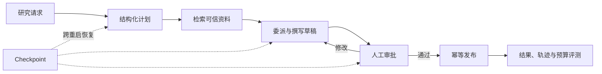
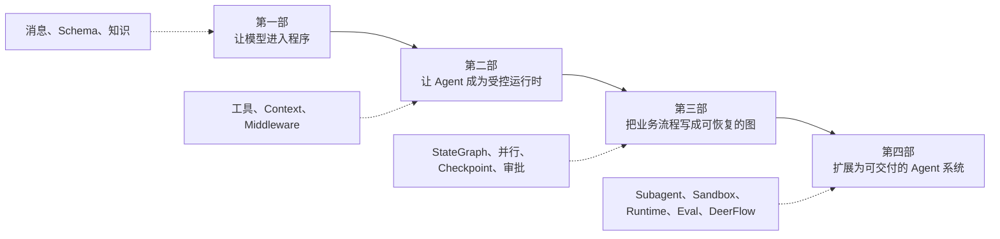

这不是一组按 API 分类的文章。你会接手同一个研究助手，用连续的工程约束把它升级为可恢复、可审计、能够交付带引用报告的 Mini DeerFlow。

课程以仓库锁定版本为准。核心实验可以离线运行，Markdown、Notebook、测试和文档站共同验证同一套实现。

[在线阅读](https://chengyunlai.github.io/langchain-logbook/) · [课程改造任务](https://github.com/Chengyunlai/langchain-logbook/blob/main/TODO.md) · [版本策略](/langchain-logbook/posts/version-policy/) · [SEO 与搜索收录](/langchain-logbook/posts/seo/)

## 第一次在本地打开

如果你正在使用 PyCharm，先阅读 [PyCharm 快速上手](/langchain-logbook/posts/getting-started-pycharm/)。最短路径是：

```bash
make install-uv
make setup
make mini-deerflow
```

前两条命令准备 `uv`，再按 `uv.lock` 创建 `.venv` 并安装开发依赖；最后一条命令运行不需要 API Key 的离线 Mini DeerFlow。确认环境正常后，再从 [第 01 章](/langchain-logbook/posts/01_getting_started/) 开始学习。

LangChain Logbook 是一个独立维护的中文 Agent 工程课程与实验仓库。课程、Mini DeerFlow、测试、Notebook 和文档站共同演进，所有可发布内容都以当前仓库为事实源。

## 序章：接手研究交付任务

假设团队收到下面的请求：

> 调研 LangGraph 如何恢复长任务，给出一份带来源的中文说明。报告发布前必须由负责人审批；中途重启后不能从头再来。

你手上只有一个能接收字符串并返回自然语言的聊天模型。它可以解释概念，却还称不上业务系统。

第一次运行很顺利。模型给出一段像样的回答，但程序不知道哪些句子是任务计划，无法验证来源，也无法判断报告是否已经发布。网络中断后，刚才的进度全部消失。

这本书从这个现场开始。你不是旁观 API 演示，而是这个系统的实现者。每一章都要修改同一个 Mini DeerFlow，并交付一项后续章节可以直接复用的工件。

最终系统需要完成下面这条业务链：



**图的文本替代**：研究请求先转换为计划，再经过资料检索、委派写作、人工审批和幂等发布；Checkpoint 保存执行现场，评测同时检查结果、轨迹与预算。

## 全书为什么分成四部

四部对应系统能力的四次升级。顺序由依赖关系决定：没有稳定输入输出，就无法安全执行工具；没有受控 Agent，就很难设计业务图；没有可恢复的图，也谈不上长任务交付。



### 第一部：让模型进入程序

这一部暂时不要求你设计 Graph。目标是让概率性的模型拥有程序可以依赖的消息、事件、对象和知识边界。

| 章节 | 当前系统遇到的问题 | 本章交付 |
| --- | --- | --- |
| [第 01 章](/langchain-logbook/posts/01_getting_started/) | 模型、Runnable 与 Agent 看起来都像“调用模型”，事件也无法稳定消费 | 模型工厂、消息入口、v2 流式事件 adapter |
| [第 02 章](/langchain-logbook/posts/02_structured_output/) | 自然语言计划不能被路由、持久化或验证 | `TaskPlan`、`ArtifactRef`、显式失败结果 |
| [第 03 章](/langchain-logbook/posts/03_rag_20/) | 计划结构正确，事实却可能过时且没有来源 | 带来源 Retriever、空召回协议、recall@k 与可替换知识索引 |

第一部结束时，系统已经知道如何接收任务、描述任务并查询资料，但仍要由应用代码决定何时检索。第 04 章会让模型第一次自主选择工具。

### 第二部：让 Agent 成为受控运行时

这一部建立标准的 `model → tool → model` 循环，再处理工具型 Agent 很快会暴露的所有权与治理问题。

| 章节 | 当前系统遇到的问题 | 本章交付 |
| --- | --- | --- |
| [第 04 章](/langchain-logbook/posts/04_smart_tooling/) | 应用代码固定调用检索，无法由模型按任务选择工具 | 手动 ToolMessage、`create_agent` 完整循环与工具 registry |
| [第 05 章](/langchain-logbook/posts/05_agent_middleware/) | 身份、线程事实、长期偏好和连接对象混在一起 | Runtime Context、Graph State、Store 边界 |
| [第 06 章](/langchain-logbook/posts/06_observability_persistence/) | 权限、PII、限额和错误处理散落在工具与 Prompt 中 | 可组合、可测试的 AgentMiddleware 治理链 |

`create_agent` 来自 LangChain，但返回的对象由 LangGraph runtime 支撑。第二部会让这种运行时特征逐步显现，同时保留高层 Agent 工厂带来的便利。

### 第三部：把业务流程写成可恢复的图

通用工具循环擅长让模型决定下一步，却不适合表达必须执行的审批、并行研究和恢复规则。这一部开始显式设计业务拓扑。

| 章节 | 当前系统遇到的问题 | 本章交付 |
| --- | --- | --- |
| [第 07 章](/langchain-logbook/posts/07_stategraph/) | 固定流程隐藏在 Prompt 和 Agent 循环里 | State、Reducer、Node、Edge 与显式 ReAct |
| [第 08 章](/langchain-logbook/posts/08_engineering_defense/) | 单一循环无法表达条件、动态并行和子流程 | Command、Send、Subgraph 与 reducer 冲突实验 |
| [第 09 章](/langchain-logbook/posts/09_multi_agent_eval/) | 进程退出后研究进度丢失 | Checkpointer、Thread、SQLite 与跨重启恢复 |
| [第 10 章](/langchain-logbook/posts/10_human_in_the_loop/) | 发布前需要等待人工判断，恢复又可能重放副作用 | Interrupt、审批恢复与幂等意图记录 |

第三部结束时，研究流程已经能暂停、恢复和重放。它仍然是一个上下文不断增长的单体图，尚未形成可隔离、可服务化的 Agent Harness。

### 第四部：扩展为可交付的 Agent 系统

这一部处理长期运行系统的最后一组边界：谁拥有控制权、代码在哪里执行、客户端如何重连、质量如何证明，以及如何把这些经验迁移到 DeerFlow。

| 内容 | 解决的问题 |
| --- | --- |
| [第 11 章](/langchain-logbook/posts/11_multi_agent_patterns/) | 用隔离 Subagent 控制上下文、并发、超时和结果预算 |
| [工程架构总览](/langchain-logbook/posts/architecture/) | 识别组合根、数据边界、能力边界与交付边界 |
| [Lead Agent 核心](/langchain-logbook/posts/lead_agent_core/) | 组合 State、Tools、Middleware、Checkpointer 与 Streaming |
| [Sandbox 与扩展](/langchain-logbook/posts/sandbox_extensions/) | 隔离文件与命令，通过最小授权接入 MCP 和 Skills |
| [Runtime 与 Gateway](/langchain-logbook/posts/runtime_gateway/) | 把 Graph 变成可创建、取消、恢复和重连的长任务服务 |
| [评测与可观测性](/langchain-logbook/posts/evaluation_observability/) | 验证结果、轨迹、预算与安全，定位单次执行失败 |
| [综合实战](/langchain-logbook/posts/capstone/) | 装配完整研究交付闭环并完成故障演练 |
| [DeerFlow 源码导读](/langchain-logbook/posts/deerflow_guide/) | 沿组合根与调用链阅读真实工程，不按目录漫游 |

## LangChain、LangGraph 与 DeerFlow 各自在哪里

LangChain 是本书的高层开发入口。模型初始化、消息、Prompt、Runnable、结构化输出、工具和 `create_agent` 都从这里进入。

LangGraph 负责有状态执行。进入 State、Reducer、Node、Edge、Command、Send、Checkpoint 和 Interrupt 后，你开始显式拥有业务控制流。

DeerFlow 是更完整的 Agent Harness 和产品运行时。它组合 Lead Agent、Middleware、Subagent、Sandbox、Skills、持久化与 Gateway；本书最后沿这些边界阅读它的真实源码。

```text
LangChain 高层入口
  model / messages / structured output / tools / create_agent
                         ↓
LangGraph 有状态运行时
  StateGraph / Command / Send / Checkpoint / Interrupt
                         ↓
Agent Harness 与产品交付
  Subagent / Sandbox / Runtime / SSE / Eval / DeerFlow
```

这三层并非互相替代。课程先使用高层抽象建立可运行结果，再在业务约束要求更多控制权时进入下一层。

## 每一章怎样阅读

每章开头会给出一份“系统快照”：上一章已经能做什么，这一次运行暴露了什么新失败。

正文先解释失败为何发生，再引入恰好足够的机制。真实供应商示例负责观察外部集成，确定性离线实验负责验证应用契约；两者解决的问题不同。

章末不会只做知识摘要。你需要运行测试、完成一个故障实验，并记录系统新增工件与下一项限制。下一章从这项限制继续，不会重新开始一个 Demo。

如果只想浏览概念，可以阅读正文和图示。如果准备把能力迁移到自己的项目，请完成 Notebook、练习和自动验收。

## 运行 Mini DeerFlow

运行同一条真实 Agent 路径的离线示例：

```bash
make mini-deerflow
```

运行确定性的结果、轨迹与预算评测：

```bash
make mini-deerflow-eval
```

完成包含检索、委派、草稿、审批、跨重建恢复和幂等发布的长任务：

```bash
make mini-deerflow-capstone
```

这些命令不需要 API Key。系统仍然运行真实的 `create_agent` 和 LangGraph 工具循环，只把模型回答替换成可预测的 fake model，便于稳定验证业务契约。

## 快速开始

项目使用 Python 3.12+ 和 `uv`。先准备环境：

```bash
make install-uv
make setup
make install
```

需要真实模型实验时，在 `.env` 中配置对应供应商的 API Key。核心离线实验和测试不依赖外部凭证。

启动 Notebook：

```bash
make notebook
```

运行教程、测试、文档构建和链接检查组成的完整门禁：

```bash
make check
```

PR、GitHub Pages、部署后检查与回滚步骤见[发布、验证与回滚手册](/langchain-logbook/posts/release/)。

## 版本与资料边界

- Python、LangChain 与 LangGraph 兼容范围以 [`pyproject.toml`](https://github.com/Chengyunlai/langchain-logbook/blob/main/pyproject.toml) 为准。
- 精确依赖版本以 [`uv.lock`](https://github.com/Chengyunlai/langchain-logbook/blob/main/uv.lock) 为唯一依据，`make install` 使用 `--locked`。
- DeepSeek、OpenAI-compatible 与百炼属于可选 integration profile。
- 消息、工具调用和流式协议的补充细节放在 [附录](/langchain-logbook/posts/appendix/)，无需在第 01 章前通读。
- DeerFlow 源码结论使用固定 commit 链接，避免把持续变化的 `main` 当作稳定教材。