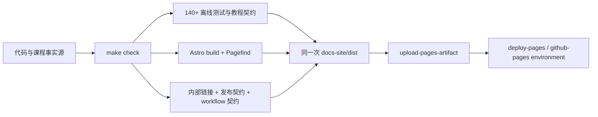

# LangChain Logbook 发布、验证与回滚手册

> 适用范围：课程仓库与 Astro 静态文档站  
> 部署目标：GitHub Pages `/langchain-logbook`  
> 不包含：Mini DeerFlow API/Gateway、真实模型供应商或生产数据库部署

当前 GitHub Actions 校准日期为 2026-07-14：`checkout@v6`、`setup-python@v6`、`setup-node@v6`、`setup-uv@v8.3.2`，以及 Pages 的 `configure-pages@v6`、`upload-pages-artifact@v5`、`deploy-pages@v5`。Pages 版本同时依据 [GitHub 官方自定义 Pages workflow 文档](https://docs.github.com/en/pages/getting-started-with-github-pages/using-custom-workflows-with-github-pages)与三个官方 action 的 release 页面；release 是当前版本事实源，避免文档示例滞后。`setup-uv` 从 v8 起不再发布 `v8`/`v8.0` 浮动 tag，因此必须使用不可变完整版本或提交 SHA。升级时必须重新运行 workflow 契约、完整门禁和线上 run。课程运行时仍固定 Python 3.12、Node 22 和 uv 0.7.6，action 自身升级不等于课程依赖升级。

## 1. 核心发布原则

本项目只有一个离线发布门禁：

```bash
make check
```

本地开发、Pull Request（PR，合并请求）和 GitHub Pages build job 都调用同一命令。Pages 上传的 `docs-site/dist` 必须由这次命令生成，不能在验证后再用另一套 action 隐式重建。



**图的文本替代**：课程与代码先进入唯一的 `make check`。测试、教程、文档构建、链接和三类发布契约全部通过后，得到同一次 `docs-site/dist`。Pages build job 上传该目录，deploy job 只消费已经验证的 artifact。

**读图顺序**：从左侧事实源进入门禁，分别检查三条验证分支，再在 `docs-site/dist` 汇合，最后沿 artifact 上传与 Pages deployment 向右阅读。

## 2. 三条流程分别负责什么

### 2.1 本地发布候选

```bash
make check
```

适合提交前运行。它验证：

- `uv.lock` 与 `pyproject.toml` 同步；
- 离线测试、教程与 Notebook 契约；
- CI/Pages workflow 不绕过公共门禁；
- Astro 类型、静态构建和 Mermaid 转换；
- Pagefind 索引、站内链接和发布 base/source 契约。

它不访问真实模型供应商，也不发布任何内容。

### 2.2 Pull Request Quality

`.github/workflows/quality.yml` 在 PR、主分支 push 和手动触发时运行 `make check`。它只有 `contents: read`，没有 Pages 写权限，因此 Quality 成功只表示“这个提交可作为发布候选”，不表示已经上线。

### 2.3 GitHub Pages

`.github/workflows/deploy.yml` 在 `main`/`master` push 或手动触发时运行：

1. 安装锁定的 Python 3.12、uv 0.7.6 和 Node 22；
2. 执行 `make check`；
3. 上传这次门禁生成的 `docs-site/dist`；
4. deploy job 通过 `needs: build` 消费 artifact；
5. 在 `github-pages` environment 中使用 OIDC 发布。

静态站不需要仓库 Secret。`id-token: write` 只用于 GitHub Pages OIDC；`contents` 保持只读。

## 3. 首次启用 GitHub Pages

仓库管理员需要在 GitHub 中完成一次设置：

1. 打开 **Settings → Pages**；
2. 将 Build and deployment Source 设为 **GitHub Actions**；
3. 确认 `github-pages` environment 存在；
4. 如需人工批准，在 environment protection rules 中配置 reviewer；
5. 确认仓库默认分支是 workflow 监听的 `main` 或 `master`。

这些是 GitHub 仓库状态，不能由本地测试替代。本任务不会自动修改设置或触发部署。

## 4. 发布前检查表

- [ ] 本地 `make check` 通过；
- [ ] PR Quality workflow 通过；
- [ ] 变更没有加入模型 Key、数据库凭据或生成的本地 workspace；
- [ ] Capstone、DeerFlow 导读和版本日期符合本次发布范围；
- [ ] 若修改 base path，同时更新 `SITE_BASE`、Astro 配置和发布契约测试；
- [ ] 若修改仓库地址，同时更新 `sourcePath`/repository URL 契约；
- [ ] 确认本次只部署静态文档，不把教学 SQLite、Runtime worker 或 `.env` 当作 Pages 后端。

## 5. 部署后 smoke

Pages job 成功后，至少观察以下用户路径：

1. 首页 `https://chengyunlai.github.io/langchain-logbook/`；
2. Capstone `/posts/capstone/` 和 DeerFlow 导读 `/posts/deerflow_guide/`；
3. 搜索页查询 `源码调用链导读`；
4. 从首页进入文章，再使用 “Go back” 返回项目首页；
5. “在 GitHub 见证成长”指向事实源而不是生成副本；
6. 390 px 窄屏下菜单、表格和 Mermaid 不扩大页面宽度；
7. `/404.html`、`/rss.xml` 和 sitemap 能访问。

自动门禁可以验证静态地址与本地文件关系，但不能替代 CDN、浏览器执行、真实设备和 GitHub 当前服务状态。

## 6. 失败定位

| 阶段 | 典型信号 | 首先检查 | 不应做什么 |
|---|---|---|---|
| `make check` | 测试或契约失败 | 第一个失败节点与本地复现 | 跳过门禁直接上传 |
| Astro build | 类型、内容或 Mermaid 错误 | 事实源 Markdown、frontmatter、构建日志 | 手改 `dist` |
| link/contracts | broken link / contract failure | base、sourcePath、workflow artifact path | 把检查器静默忽略 |
| artifact upload | build 通过但上传失败 | Pages 配置、artifact action、目录是否存在 | 重新用另一套 builder 构建 |
| deploy job | OIDC/environment 失败 | Pages Source、权限、environment rule | 写入长期 Pages token |
| 线上 smoke | workflow 成功但页面异常 | Pages URL、CDN、base、浏览器控制台 | 宣称本地测试已经证明线上正常 |

## 7. 回滚

优先选择可审计、仍经过门禁的回滚：

1. 找到最后一个已知正常提交和对应成功的 Pages run；
2. 若 GitHub 仍保留该 run 的 artifact，可在 Actions 中重跑其 deploy job，快速恢复旧静态产物；
3. 更稳妥的长期修复是在当前分支创建 `git revert <bad-commit>`，提交并走新的 `make check → artifact → deploy`；
4. 部署后重新执行第 5 节 smoke；
5. 记录失败原因，并把能够静态表达的问题加入契约测试。

不要使用 `git reset --hard` 改写共享主分支，也不要在 Pages 上直接修改生成文件。直接改线上文件既不可复现，也会在下次部署时消失。

## 8. 保留的人工边界

- GitHub Pages 仓库设置与 environment reviewer；
- GitHub 服务、CDN 和上游外链实时可用性；
- 真实移动设备、屏幕阅读器和高对比度模式；
- 真实模型供应商 integration profile；
- Mini DeerFlow Gateway/worker 的生产容器、数据库、队列、租户和密钥管理。

静态文档发布完成不代表 Agent 后端已经生产化。这条边界应在课程演示和实际项目中始终保留。
