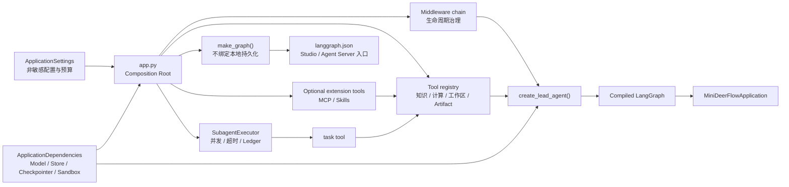
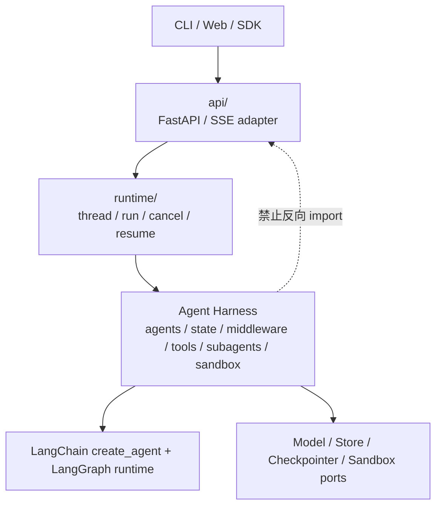
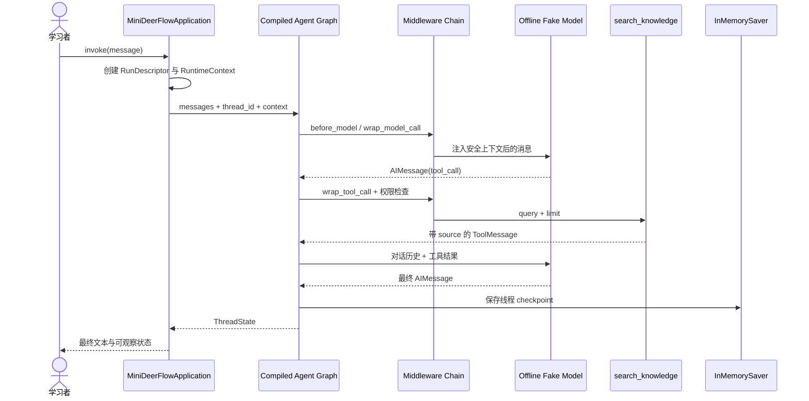

# Mini DeerFlow 工程架构总览

> 校准日期：2026-07-14  
> 适用范围：课程第 01–11 章、Lead Agent 核心、Sandbox/Subagent/MCP/Skills、Runtime/API/SSE、测试/评测/观测与最终综合实战  
> 核心入口：[`app.py`](./app.py)；LangGraph 工具入口：[`../langgraph.json`](../langgraph.json)

## 系统快照：前 11 章已经有零件，现在要确认它们只组成一套应用

前 11 章分别交付模型、Schema、检索、Lead Agent、Context、State、Middleware、Graph、持久化、审批和 Subagent。若每个专题都自行创建模型、Store 和工具表，课程最终仍会产生多套平行 Demo。

本篇先固定 Mini DeerFlow 的组合根、依赖方向和四类数据边界。后续专题都从这里继续：Lead 核心 → Sandbox/扩展 → Runtime/Gateway → 评测/观测 → Capstone → DeerFlow 源码导读。

这份文档回答的不是“每个目录里有什么文件”，而是三个更重要的问题：

1. 已经在 Notebook 中学过的模型、工具、Graph、Middleware 和 Subagent，怎样组成一个真实应用？
2. 哪些数据属于 Graph State，哪些属于 Runtime Context、Store 或产品数据库？
3. Sandbox、可选扩展、SSE Gateway、评测与观测怎样组合，才不会让核心 Agent 反向依赖外层协议或平台对象？

Mini DeerFlow 不复制 DeerFlow 的全部产品复杂度。它保留能够迁移的核心关系：一个 Lead Agent 通过 LangGraph runtime 运行；Middleware 治理生命周期；工具与 Subagent 承担受控能力；Checkpointer/Store 分别负责线程内恢复和跨线程记忆；API 只是外层 adapter。

## 1. 从章节零件到应用组合根

此前每章分别验证一个能力，这对学习原理是必要的，但它还不等于一个应用。真实应用必须有一个地方决定：

- 使用哪个模型、知识索引、Store 和 Checkpointer；
- 向 Lead Agent 注册哪些工具；
- Middleware 的顺序和预算是多少；
- Subagent registry、并发限制和 ledger 使用哪个实例；
- 一次运行的 `thread_id`、`request_id`、用户身份和权限由谁提供。

这个唯一装配位置叫 **Composition Root（组合根）**。本项目把组合根集中在 `app.py`：`build_application()` 服务本地 CLI/测试，`make_graph()` 服务 Agent Server/Studio，二者复用同一个内部装配函数。业务模块只声明自己需要什么，不在 import 时读取 Secret、猜测 provider 或连接外部服务。

<!-- diagram:id=mini-deerflow-composition-root -->


**图的文本替代**：配置和活依赖进入唯一组合根。组合根创建 Middleware、工作区工具、可选扩展和 SubagentExecutor，再把 `task` 加入 registry，调用 `create_lead_agent()` 得到 compiled graph。

本地应用绑定独享的内存持久化；`langgraph.json` 调用不绑定本地持久化的 `make_graph()`，让 Agent Server 注入它管理的 Checkpointer 与 Store。

这里刻意把“配置”和“依赖”分开：

- `ApplicationSettings` 是可以序列化和审查的非敏感选择，例如离线 profile、模型调用上限、Subagent 并发和超时预算。
- `ApplicationDependencies` 是活的对象，例如模型实例、知识索引、Store 和 Checkpointer。测试可以用 `dataclasses.replace()` 替换一个依赖，而不复制整套 Agent 工厂。
- `RuntimeContext` 属于一次调用。用户、权限和工作区不能让模型通过请求正文自行选择。

## 2. 系统边界与依赖方向

课程把系统分成三层。这里的“层”表示依赖方向，不表示一定要部署为三个进程。

<!-- diagram:id=mini-deerflow-layer-boundary -->


**图的文本替代**：客户端进入 API adapter，API 调用 runtime，runtime 调用 Agent Harness，Harness 建立在 LangChain/LangGraph 以及若干 provider 接口之上。Harness 不得反向导入 API；测试会扫描并阻止这种依赖倒置。

为什么禁止 Harness 反向依赖 API？如果一个工具为了读取 HTTP header 而 import FastAPI request，Notebook、CLI、测试和 Agent Server 就都被某个传输协议绑死。正确做法是 API 验证身份后，把允许暴露的运行事实构造成 `RuntimeContext`。

当前 `api/` 和 `runtime/` 已实现本地单 worker Gateway：SQLite thread/run/event repository、后台执行、取消、interrupt 恢复、SSE 重放与 FastAPI adapter。它不是生产多 worker 调度器；完整边界与限制见 [`RUNTIME_GATEWAY.md`](./RUNTIME_GATEWAY.md)。核心工具没有为 HTTP 增加反向依赖。

## 3. 包结构与每个模块的责任

```text
mini_deerflow/
├── app.py                 # 唯一组合根、离线应用对象、标准 graph 导出
├── config.py              # 非敏感配置；不保存 API Key
├── context.py             # 一次 invocation 的身份、权限与依赖事实
├── state.py               # 可 checkpoint 的 ThreadState 与 reducer
├── schemas.py             # Plan、Artifact、SubagentResult 等领域契约
├── models.py              # 真实/离线 model provider factory
├── fixtures.py            # 只供课程和测试使用的确定性数据
├── agents/                # Lead Agent factory 与 prompt
├── middleware/            # 生命周期、权限、错误、预算与上下文治理
├── tools/                 # 最小权限工具、workspace tools 及 registry
├── knowledge/             # 本地索引与检索评测
├── graph/                 # 显式 Graph、持久化、HITL 等课程工作流
├── persistence.py         # 本地 effect-intent ledger
├── store.py               # 跨线程偏好 repository
├── streaming.py           # LangGraph stream event 领域归一化
├── subagents/             # registry、task tool、executor、隔离 specialist
├── sandbox/               # Provider/Session 契约与安全本地线程工作区
├── mcp/                   # 懒加载、allowlist 的可选 MCP tool adapter
├── skills/                # Skill metadata catalog、按需加载工具与教学 Skill
├── runtime/               # thread/run/event repository、worker、SSE 编码
├── api/                   # 传输 DTO、Gateway service 与 FastAPI adapter
├── evals/                 # Dataset、Observation、离线 evaluator、LangSmith adapter
├── observability.py       # tracing context 与唯一 root span 所有权
└── eval_demo.py           # 真实离线 Agent 的可执行质量评测
```

这些目录不是为了追求“企业项目长相”。只有当一个边界具有不同生命周期、不同替换原因或不同安全责任时，才值得单独存在。例如 `state.py` 和 `context.py` 必须分开，因为前者会进入 checkpoint/trace，后者可以包含不可持久化的调用级身份与 Secret。

## 4. 一次离线调用的真实时序

<!-- diagram:id=mini-deerflow-minimal-run-sequence -->


**图的文本替代**：应用先生成运行标识与 Runtime Context，再以 `thread_id` 调用 compiled graph。Middleware 包裹模型和工具调用；离线模型先产生检索 tool call，权限 middleware 放行后工具返回带 source 的结果，模型给出最终消息，Checkpointer 保存线程状态，应用返回完整 state。

注意，离线模型不是“假的 Agent 循环”。模型回答是脚本化的，但 tool call、工具执行、Middleware、State reducer、Checkpointer 和 compiled LangGraph 都是真实运行路径。它把不确定且收费的模型决策替换成确定 fixture，让测试能精确定位框架和业务错误。

## 5. 四类数据不能混装

| 数据类别 | 当前类型/实现 | 生命周期 | 典型内容 | 不能放什么 |
|---|---|---|---|---|
| Graph State | `ThreadState` | 单线程、多步、可 checkpoint | messages、artifacts、middleware trace | API Key、auth token、数据库连接 |
| Runtime Context | `RuntimeContext` | 单次 invocation | user、request、permissions、workspace、模型 profile | 让模型自行提交的身份/权限 |
| Cross-thread Store | `UserPreferenceRepository` + `BaseStore` | 同一用户跨线程 | 显式保存的语言、回答粒度、引用风格 | 整段聊天历史、隐藏推理、Secret |
| Product Runtime Data | `SqliteRuntimeRepository` | 跨进程/服务 | run 状态、取消、SSE event | 直接冒充 LangGraph checkpoint |

`Checkpointer` 和 `Store` 都能“保存东西”，但它们不是同一种 memory。Checkpointer 让图从某个线程状态恢复；Store 让不同线程读取应用定义的长期事实；run/event repository 则服务于 API、调度和产品状态。DeerFlow 源码阅读中最常见的误区，就是把这三者都叫数据库然后忽略语义差异。

## 6. `langgraph.json` 是部署接口，不是业务架构

根目录的 `langgraph.json` 注册：

```json
{
  "$schema": "https://langgra.ph/schema.json",
  "python_version": "3.12",
  "dependencies": ["."],
  "graphs": {
    "mini_deerflow": "mini_deerflow.app:make_graph"
  },
  "env": ".env"
}
```

Manifest 表达三件事：从 `pyproject.toml` 安装本地 package；用 `make_graph()` 构建 `mini_deerflow` graph；本地开发时从 `.env` 读取变量。

官方 Application structure 允许入口指向 compiled graph 或 factory。Agent Server 会注入它管理的 Checkpointer 与 Store，graph 不应自行配置二者；本地开发则区分轻量 `langgraph dev` 与 Docker 化 `langgraph up`。

本项目选择 factory，是因为离线 fake model 内部保存一次性脚本迭代器：不同 run 必须获得新模型实例。`make_graph()` 每次创建新的离线依赖，并把本地 Store/Checkpointer 留空。

`build_application()` 默认绑定独享的内存 Store/Checkpointer，Runtime 重建测试再替换为 SQLite provider。接入真实无状态模型后，应重新评估进程级 compiled graph 与生命周期管理。

但 manifest 不负责决定工具权限、State schema、Middleware 顺序或业务恢复策略，这些必须留在可测试的 Python 组合根中。当前课程不把 `langgraph-cli[inmem]` 强塞进核心依赖；需要 Studio/Agent Server 时可显式安装 CLI。Runtime 专题对比两条部署路线：

- 直接使用 Agent Server：复用官方 thread/run/SSE 基础设施；
- 自建 Gateway：只在产品确实需要自定义认证、repository、协议兼容或运行调度时选择。

## 7. 后续任务的明确落点

| 后续任务 | 在现有骨架中的落点 | 保持不变的接缝 |
|---|---|---|
| 12 Lead Agent 核心闭环（已交付） | `agents/`、`state.py`、`middleware/`、`tools/`、`persistence.py`、`streaming.py` | `app.py` 仍是唯一组合模块；详见 `LEAD_AGENT_CORE.md` |
| 13 Subagent/Sandbox/MCP/Skills（已交付） | `subagents/`、`sandbox/`、`mcp/`、`skills/`、`tools/workspace.py` | `task` 仍是 Lead Agent 的单一委派工具；Subagent 只继承 `sandbox_id`；详见 `SANDBOX_EXTENSIONS.md` |
| 14 Runtime/API/SSE（已交付） | `runtime/`、`api/`、`streaming.py`、`persistence.py` | API 只构造 Context/Run，不进入 Harness 内部；详见 `RUNTIME_GATEWAY.md` |
| 15 测试/评测/观测（已交付） | `tests/`、`evals/`、`observability.py`、`quality/` | 领域评测不依赖平台；在线同步显式调用；详见 `EVALUATION_OBSERVABILITY.md` |
| 16 综合实战与 DeerFlow 导读（已交付） | `capstone.py`、`CAPSTONE.md`、`DEERFLOW_GUIDE.md` | 只做业务纵切面装配，不另写一套平行 Agent 框架 |

`LocalSandboxProvider` 实现 user/thread 目录分区、路径与 symlink 护栏、原子写入和审计，并固定拒绝宿主命令。它不提供进程、网络、CPU/内存或恶意多租户隔离。

未注册的文件、命令、MCP 或 Skill 能力不得在 Prompt 中声称为可用。执行不可信代码时，应以容器或远程 provider 替换实现，保持 `SandboxProvider` 接缝不变。

## 8. 与当前 DeerFlow 的对应关系

本轮对照 DeerFlow 提交 [`4af6178`](https://github.com/bytedance/deer-flow/tree/4af617835805dd7cd78162ebed02fd6b782ea8bf)，校准日期为 2026-07-14。提交号只是阅读锚点，不表示课程复制其实现。

完整的四条源码路线见 [`DEERFLOW_GUIDE.md`](./DEERFLOW_GUIDE.md)。

| Mini DeerFlow | DeerFlow 阅读入口 | 应观察的架构关系 |
|---|---|---|
| `app.py:build_application` | [`make_lead_agent`](https://github.com/bytedance/deer-flow/blob/4af617835805dd7cd78162ebed02fd6b782ea8bf/backend/packages/harness/deerflow/agents/lead_agent/agent.py) | 都在组合模型、工具、Middleware 与 State；DeerFlow 多出动态产品配置 |
| `state.py:ThreadState` | `deerflow/agents/thread_state.py` | 自定义字段与 reducer 建立在线程状态上 |
| `middleware/` | `deerflow/agents/middlewares/` | 横切治理有严格顺序，不是随意 callback 列表 |
| `subagents/` | `deerflow/subagents/` 与 `task_tool.py` | Lead 保留控制，specialist 通过 task 被隔离调用 |
| `sandbox/SandboxProvider` | `deerflow/sandbox/` | Sandbox 是 provider/lifecycle abstraction，不是一个 shell 函数 |
| `mcp/MCPToolAdapter` | `deerflow/tools/tools.py` 与 `mcp_metadata.py` | 发现、标记、去重与应用授权是不同阶段 |
| `skills/SkillCatalog` | `deerflow/skills/` | metadata discovery 与技能正文按需加载必须分层 |
| `runtime/` + `api/` | [`Gateway`](https://github.com/bytedance/deer-flow/blob/4af617835805dd7cd78162ebed02fd6b782ea8bf/backend/app/gateway/app.py) 与 `deerflow/runtime/runs/` | Harness 与产品运行时分层；Gateway 管 thread/run/SSE |
| `langgraph.json` | [DeerFlow manifest](https://github.com/bytedance/deer-flow/blob/4af617835805dd7cd78162ebed02fd6b782ea8bf/backend/langgraph.json) | 标准工具入口可以和默认 Gateway 服务入口并存 |

DeerFlow 的关键阅读技巧是先沿依赖方向走：`langgraph.json / Gateway → make_lead_agent → middleware/tools/state → runtime provider`，不要从某个庞大的工具实现随机开始。Mini DeerFlow 先把相同关系缩小并写进测试，学习者看到真实仓库时才知道哪些复杂度属于业务，哪些来自 LangGraph。

## 9. 常见失败方式与骨架中的防线

| 失败方式 | 可观察后果 | 当前防线 |
|---|---|---|
| 每个模块自行读取环境和创建模型 | 测试不可替换、import 即联网 | 只由组合根创建 `ApplicationDependencies` |
| 把用户请求里的 `user_id/permissions` 直接传给工具 | 模型或客户端可以越权 | `ConversationRequest` 不接受身份；应用构造 `RuntimeContext` |
| 把 auth token 写进 State | checkpoint、trace 或调试输出泄密 | `assert_checkpoint_safe()` 与 Context/State 分离 |
| 工具直接 import API/HTTP 对象 | Notebook、CLI 和 Agent Server 无法复用 | AST 架构测试禁止 Harness → API import |
| 为未来目录放 `pass`/固定成功结果 | 接口看似齐全但无法证明语义 | 提供有约束的 DTO/Protocol，能力未实现时明确说明 |
| 把 `langgraph.json` 当成完整部署 | 忽略认证、持久化、取消和产品数据 | 文档明确 manifest 与 runtime/Gateway 的职责差异 |
| 离线测试绕开 Agent runtime | 测试只证明字符串拼接 | fake model 驱动真实 tool loop、middleware 和 checkpoint |

## 10. 开发与验收命令

安装锁定环境：

```bash
make install
```

运行组合根的确定性最小对话：

```bash
make mini-deerflow
```

也可以传入消息：

```bash
uv run --locked --group dev python -m mini_deerflow --message "解释 create_agent"
```

只验证工程骨架：

```bash
uv run --locked --group dev pytest -q \
  tests/test_mini_deerflow_application.py \
  tests/test_mini_deerflow_project_structure.py
```

运行课程全部离线测试和教程契约：

```bash
make test
```

完整验证 lock、测试、Notebook/Markdown 契约、文档站构建和链接：

```bash
make check
```

最小对话的通过标准不是“进程没报错”。测试还断言：首条消息被规范化为 `HumanMessage`；真实工具循环完成；Middleware trace 可见；`task` 已由组合根注册；注入另一个模型时无需复制工厂；manifest 指向可导入的 compiled graph；Harness 不反向依赖 API。

## 11. 下一步：验证 Lead Agent 纵切面

架构图只能说明依赖方向，不能证明跨重建恢复、Artifact 冲突和 Middleware 顺序真的正确。下一篇会沿同一个组合根执行两轮任务，并用失败实验验证这些核心业务接缝。

继续阅读：[把 Lead Agent 变成可恢复的核心业务](./LEAD_AGENT_CORE.md)。
