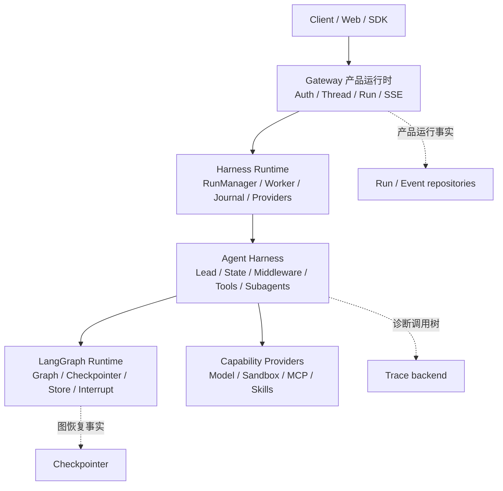
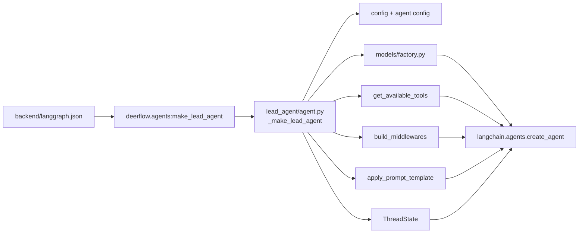
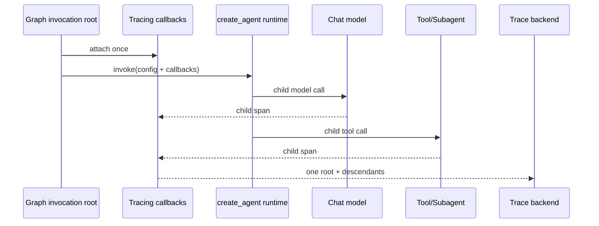
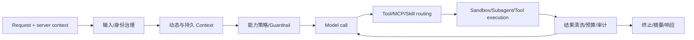
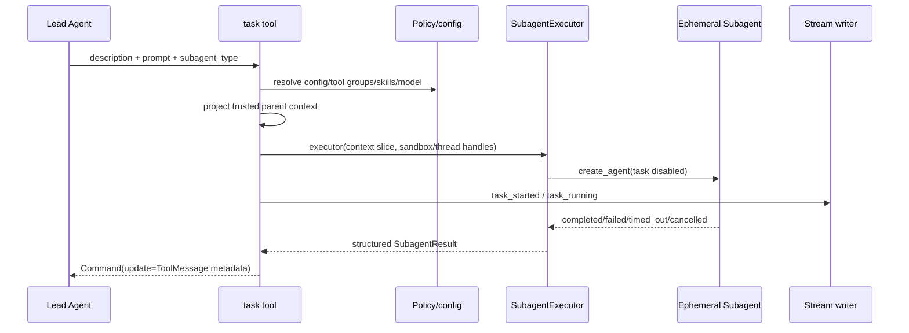
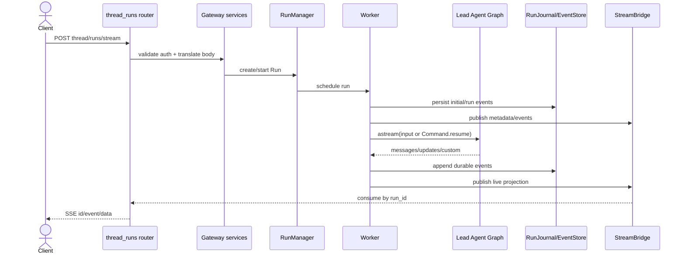
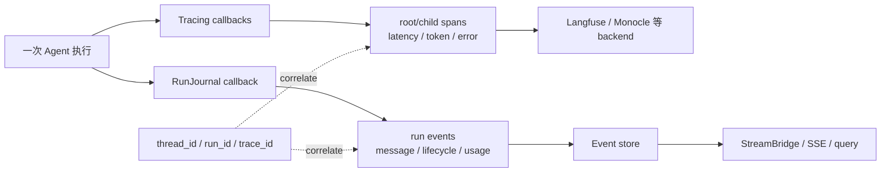

# 从 Mini DeerFlow 进入真实 DeerFlow：源码调用链导读

> 校准日期：2026-07-14  
> DeerFlow 官方源码锚点：[`4af617835805dd7cd78162ebed02fd6b782ea8bf`](https://github.com/bytedance/deer-flow/tree/4af617835805dd7cd78162ebed02fd6b782ea8bf)  
> 前置：[最终综合实战](./CAPSTONE.md)、[工程架构总览](./ARCHITECTURE.md)  
> 学习目标：能沿调用链解释 DeerFlow，而不是只会按目录念文件名

## 系统快照：你已经亲手完成 Mini DeerFlow，现在用它作为源码阅读坐标

在综合实战前直接阅读 DeerFlow，读者容易把目录数量当成架构。现在你已经使用过组合根、State、Middleware、task、Sandbox、Run/Event 和 SSE，可以用已知边界提出故障问题。

本篇不覆盖 DeerFlow 的每个产品功能。阅读顺序是：注册入口和组合根 → State/Context/Middleware 数据边界 → task/Subagent 能力边界 → Gateway/Run/Event/SSE 交付边界。

## 1. 版本为什么必须固定

本章固定到 `2026-07-14T08:58:06+08:00` 的提交，主题是 `feat(trace): add agent observability with Monocle (#4024)`。

相较旧锚点，源码已把 tracing callback 更明确地挂在 graph invocation root，并让内部 model 使用 `attach_tracing=False`。只写“看 main”会让未来读者面对不同调用链，却没有变化证据。

复核当前 HEAD：

```bash
export DEERFLOW_COMMIT=4af617835805dd7cd78162ebed02fd6b782ea8bf
export DEERFLOW_SRC=/tmp/deerflow-course

mkdir -p "$DEERFLOW_SRC"
git -C "$DEERFLOW_SRC" init
git -C "$DEERFLOW_SRC" remote add origin https://github.com/bytedance/deer-flow.git
git -C "$DEERFLOW_SRC" fetch --depth 1 origin "$DEERFLOW_COMMIT"
git -C "$DEERFLOW_SRC" checkout --detach FETCH_HEAD
git -C "$DEERFLOW_SRC" show -s --format='%H%n%cI%n%s'
```

预期第一行必须等于 `4af617835805dd7cd78162ebed02fd6b782ea8bf`。不要退回 `main` 后继续假装结论仍对应固定版本。

### 1.1 完整 fetch 很慢时，下载“证据切片”

`git fetch` 会下载 Git pack；在受限网络中，它可能长时间没有输出。本课程提供一个更小的回退入口，只通过 GitHub Contents API 下载四条必修阅读路线需要的 14 个文件：

```bash
# 回到 langchain-logbook 仓库根目录执行
export DEERFLOW_SRC=/tmp/deerflow-course-snapshot
python scripts/fetch_deerflow_snapshot.py --output "$DEERFLOW_SRC"
python scripts/fetch_deerflow_snapshot.py --output "$DEERFLOW_SRC" --verify-only
cat "$DEERFLOW_SRC/DEERFLOW_COMMIT"
```

脚本只接受本章固定 commit，并用 Git blob SHA 逐文件校验；最后一行仍必须是 `4af617835805dd7cd78162ebed02fd6b782ea8bf`。匿名 GitHub API 通常足够下载这 14 个文件；若遇到 API 限额，可设置 `GITHUB_TOKEN` 或 `GH_TOKEN` 后重试。已经用 GitHub CLI 登录但环境变量为空时，可以先执行 `export GH_TOKEN="$(gh auth token)"`；命令不会打印 token，下载结束后可执行 `unset GH_TOKEN`。

这个目录是**源码阅读切片**，不是可安装、可运行的完整 DeerFlow。它足以完成 Lead、State/Context/Middleware、task/Subagent、Gateway/Run/SSE 四张证据表，并包含 `gateway/services.py`，可以把 router → service → RunManager 的调度接缝展开；阅读 Sandbox、MCP、Skills 的全部 provider 变体时，仍使用完整 checkout 或本章固定源码链接。也就是说，回退方案缩小下载范围，没有缩小证据标准。

若完整 checkout 目录已经存在，先检查 remote 和 HEAD，不要重复执行 `remote add`。也可以换一个空临时目录；关键是最终 detached HEAD 指向固定提交。若使用证据切片，则每次阅读前运行 `--verify-only`，避免把本地修改误当官方源码。

源码链接全部固定到本章 commit；你可以另外克隆最新 `main` 做差异练习，但不要静默用最新文件替换本章结论。

## 2. 先回答五道检索题

不要先看答案。带着问题进入源码，阅读效率会高很多。

1. `langgraph.json` 注册的是一个 compiled graph、factory，还是 Gateway app？
2. `ThreadState`、`Runtime.context`、产品 Thread record 分别由谁保存？
3. `task` 是第二张共享父状态的 Graph，还是 Lead 调用隔离 Agent 的工具？
4. SSE 客户端断线后，哪个对象拥有 Run，哪个对象保存可重放事件？
5. tracing callback 与 `RunJournal` 都是 callback，它们记录的是同一事实吗？

读完每条路线后回来修订答案。若只能说“都差不多是 memory / callback / agent”，说明边界仍未建立。

### 2.1 每条结论都要留下四类证据

“我看过这个文件”不算完成。为四条路线各复制一行表格，并在本地 Markdown 中填写：

| 路线 | 可执行入口 | 调用者 → 被调用者 | 经过的数据/能力 | 没有该边界时的失败 |
|---|---|---|---|---|
| Lead 组合根 |  |  |  |  |
| State/Context/Middleware |  |  |  |  |
| task/Subagent |  |  |  |  |
| Gateway/Run/SSE |  |  |  |  |

每一格至少引用一个固定 commit 下的 symbol 或文件路径。调用关系来自 import、函数调用或 factory 参数；不要用“看起来应该调用”代替证据。

第四列只记录跨边界的数据，例如 Runtime Context、ToolMessage、RunEvent 或 sandbox handle。第五列必须能回指课程中的一个失败实验。

### 2.2 先用 rg 建立候选点，再打开上下文

在固定 checkout 中执行：

```bash
cd "$DEERFLOW_SRC"

rg -n 'def make_lead_agent|def _make_lead_agent|create_agent\(' \
  backend/packages/harness/deerflow/agents/lead_agent/agent.py

rg -n 'class ThreadState|build_middlewares|Runtime\[' \
  backend/packages/harness/deerflow

rg -n 'def task|class SubagentExecutor|subagent_enabled=False' \
  backend/packages/harness/deerflow

rg -n 'RunManager|RunJournal|StreamBridge|Last-Event-ID' \
  backend/app/gateway backend/packages/harness/deerflow/runtime
```

`rg` 结果只是候选点。下一步要打开定义上下各 20–40 行，确认参数从哪里来、结果到哪里去，再填证据表。

## 3. 三层系统：不要把 DeerFlow 看成一个大 Graph

<!-- diagram:id=deerflow-three-layers -->


**图的文本替代**：客户端进入 Gateway；Gateway 用 Harness Runtime 管理 Run 和 worker；worker 调用 Agent Harness；Agent Harness 由 LangGraph 执行，并使用模型、Sandbox、MCP、Skills 等 provider。产品 Run/Event、Graph checkpoint、Trace 分别保存交付事实、恢复事实和诊断事实，不能相互替代。

**读图顺序**：先自上而下追客户端到 LangGraph，再分别沿右侧 provider 和三条虚线存储关系核对“执行依赖”与“事实所有权”。

### 3.1 LangGraph runtime 层

[`backend/langgraph.json`](https://github.com/bytedance/deer-flow/blob/4af617835805dd7cd78162ebed02fd6b782ea8bf/backend/langgraph.json) 注册：

```text
graphs.lead_agent = deerflow.agents:make_lead_agent
auth.path = app/gateway/langgraph_auth.py:auth
checkpointer.path = deerflow/runtime/checkpointer/async_provider.py:make_checkpointer
```

这里注册的是 graph factory、认证入口和 checkpointer provider，不是完整产品部署说明。模型能力、Middleware 顺序、Run repository、SSE 重放策略都不由 manifest 自动决定。

### 3.2 DeerFlow Agent Harness 层

`backend/packages/harness/deerflow/` 包含 Lead Agent、State、Middleware、Tools、Subagents、Sandbox、MCP、Skills、模型与 runtime provider。它回答“Agent 能做什么、以什么数据和治理规则做”。

### 3.3 Gateway 产品运行时层

`backend/app/gateway/` 的 FastAPI app、routers、services 与 Harness `runtime/runs/` 共同回答“谁能创建 Thread/Run、Run 在哪执行、如何取消、客户端如何重连、事件如何查询”。这层不是 Agent Prompt 的一部分。

## 4. 路线一：注册入口 → Lead Agent 组合根

### 4.1 先画静态导航图

<!-- diagram:id=deerflow-lead-source-navigation -->


**图的文本替代**：manifest 指向 `make_lead_agent`；factory 解析运行配置和 agent 配置，分别构建 model、tools、Middleware、system prompt 与 ThreadState，最后交给 LangChain `create_agent`。因此 DeerFlow 的 Lead 不是手写一个无限 while loop，也不是把全部业务写在单个 Graph node。

**读图顺序**：从最左 manifest 沿入口进入 factory，再从 factory 向右展开五个装配分支，最后确认它们汇入同一个 `create_agent`。

### 4.2 按这个顺序读

1. 从 [`make_lead_agent`](https://github.com/bytedance/deer-flow/blob/4af617835805dd7cd78162ebed02fd6b782ea8bf/backend/packages/harness/deerflow/agents/lead_agent/agent.py#L421) 看 factory 签名为什么兼容 LangGraph Server。
2. 在 `_make_lead_agent` 中列出所有来自 runtime config 的开关：model、thinking、plan mode、subagent、并发/总量、agent name、non-interactive 等。
3. 找 `get_available_tools → filter_tools_by_skill_allowed_tools → assemble_deferred_tools`，区分“存在的工具”“策略允许的工具”“本轮提前装入的工具”。
4. 找两处 `create_agent`。bootstrap 与常规 Agent 使用不同能力集合，但都复用相同组合方式。
5. 最后才进入具体 Middleware 或 tool 实现。若一开始随机读 shell/browser tool，很难知道它如何被注册和约束。

### 4.3 tracing 为什么在这里装

当前 commit 在组合根调用 `build_tracing_callbacks()`，把 callback 添加到 graph invocation config；同时 `create_chat_model(..., attach_tracing=False)`。Subagent executor 也为内部 model 传 `attach_tracing=False`。

<!-- diagram:id=deerflow-trace-root -->


**图的文本替代**：一次 graph invocation 在根部挂一次 tracing callback；Agent、model、tool 和 Subagent 调用继承为 child span。内部模型关闭自己的 tracing attachment，避免同一业务请求出现多个无关 root 或重复计数。

**读图顺序**：从 Graph root 向右读一次 callback 安装，再沿 Agent 到 model/tool 的两条子调用，最后看 callback 如何把一个 root 和全部 descendants 送往 backend。

这与 Mini DeerFlow 的 `LangSmithObservability` 原则相同：instrumentation owner 只能有一个。不同点是 DeerFlow 还需要处理多 tracing backend、动态配置和 Gateway 执行入口。

### 4.4 路线一验收

关闭源码，凭记忆写出：

```text
manifest → graph factory → config resolution
         → model / tools / middleware / prompt / state
         → create_agent
```

然后回答：如果要新增“报告发布工具”，应该直接改 manifest、model factory，还是工具注册/策略层？为什么？

## 5. 路线二：State → Runtime Context → Middleware

### 5.1 三种“线程相关数据”不是一回事

| 数据 | 示例 | 所有者 | 是否进入 Graph checkpoint |
|---|---|---|---|
| `ThreadState` | messages、sandbox/thread data、Agent 执行事实 | Graph/Harness | 按 schema 与 reducer 保存 |
| `Runtime.context/config` | authenticated user、role、run_id、provider handle | 应用/worker | 不应因方便全部塞入 State |
| 产品 Thread/Run record | owner、status、created_at、event sequence | Gateway repository | 独立于 Graph checkpoint |

[`agents/thread_state.py`](https://github.com/bytedance/deer-flow/blob/4af617835805dd7cd78162ebed02fd6b782ea8bf/backend/packages/harness/deerflow/agents/thread_state.py) 在 `AgentState` 上扩展业务字段。

Worker 在调用 graph 前构建 runtime context，并放入 LangGraph `Runtime`；Gateway repository 另存客户端可查询的 Thread/Run 状态。

### 5.2 Middleware 要按执行责任读

`agents/middlewares/` 文件很多。不要按字母顺序背诵，先建立分组：

1. 输入与身份：input sanitization、thread data、dynamic/durable context；
2. 能力治理：guardrail、MCP routing、deferred tool filter、skill activation；
3. 工具执行防线：read-before-write、sandbox audit、tool error/result sanitization；
4. 长上下文和预算：summarization、token/tool-output budget、subagent limit；
5. 用户体验与终止：progress、title、todo、terminal response、safety finish reason。

真实顺序必须回到 `build_middlewares(...)` 验证。分类帮助理解责任，不能代替运行顺序。

<!-- diagram:id=deerflow-middleware-lifecycle -->


**图的文本替代**：服务端身份先进入输入和 Context 治理，再经过能力策略；模型只能选择已注册且允许的工具。工具执行还要经过 Sandbox、错误和结果治理；若未终止，受控结果回到模型。预算、摘要与终止策略围绕循环工作，而不是变成任意顺序的装饰器。

**读图顺序**：从左到右读一次受治理调用；到结果治理后先读回到 Model 的循环边，再读进入终止响应的出口。

### 5.3 失败实验：把权限放进用户正文

错误改法：让请求 body 带 `user_role=admin`，然后把它直接合入 `ThreadState`。推演后果：

- 客户端可自我提权；
- role 进入 checkpoint 和 trace，后续 resume 继续信任伪造值；
- Subagent 继承时无法区分认证事实和模型文本；
- Gateway owner check 与 Harness tool policy 产生不同身份结论。

正确方向是 Gateway/worker 从认证上下文注入身份，Harness 只消费受信 runtime context；需要恢复的业务事实和短期 provider handle 分开保存。

## 6. 路线三：task tool → SubagentExecutor → 隔离 Agent

### 6.1 task 是能力边界，不是目录别名

[`task_tool.py`](https://github.com/bytedance/deer-flow/blob/4af617835805dd7cd78162ebed02fd6b782ea8bf/backend/packages/harness/deerflow/tools/builtins/task_tool.py#L229) 先解析 subagent 配置，再从父 runtime 提取必要数据，创建 `SubagentExecutor` 异步执行。

它明确关闭 Subagent 的 task 工具，避免无界递归委派。

<!-- diagram:id=deerflow-subagent-call -->


**图的文本替代**：Lead 用 task tool 传任务描述和类型；tool 根据父级策略解析允许的模型、工具和 skills，只投影必要的受信 Context。Executor 创建不能继续调用 task 的临时 Agent，执行状态同时形成进度事件；终态以结构化 ToolMessage/Command 返回 Lead，不把 specialist 全量消息史并入父上下文。

**读图顺序**：先从 Lead 到 task tool 看委派输入，再向右读策略解析与临时 Agent 创建；随后从 terminal status 反向回到 ToolMessage 和 Lead，最后核对旁路的进度事件。

### 6.2 阅读时必须找出的五个边界

1. **配置边界**：未知 subagent type 返回结构化 failure，而不是任意 import。
2. **授权边界**：父级 `tool_groups` 和 skill allowlist 会继续约束 specialist。
3. **上下文边界**：身份归因、run/thread/sandbox handle 是显式传播，不等于共享所有父消息。
4. **递归边界**：给 specialist 获取工具时 `subagent_enabled=False`。
5. **终止边界**：completed、failed、cancelled、timed_out、token/turn capped 必须可区分。

### 6.3 与 Mini DeerFlow 的相同和不同

相同关系：Lead 通过单一 `task` 能力委派；registry/config 与 executor 分离；输入裁剪；并发/超时/结果预算；失败是数据，不应直接炸毁父循环。

不同规模：Mini DeerFlow 用确定性 handler 证明契约；真实 DeerFlow 为 specialist 重新创建 `create_agent`，接入动态 model/tools/skills、stream writer、token collector、Guardrail 和 Sandbox provider。自己的项目应先复用契约，再按业务增加 provider，不能从复制 executor 的全部分支开始。

### 6.4 故障练习

让一个 specialist 超时、另一个成功，回答：

- Lead 最终拿到几个 ToolMessage？
- timeout 是异常、terminal status 还是空字符串？
- 已成功结果是否应该被兄弟失败回滚？
- 最终报告可否发布，应该由 task tool、Lead policy 还是 evaluator 决定？

Mini DeerFlow 综合实战用 `forbidden_terms=("specialist 未完成",)` 防止“标题完整但专家失败”的报告被误判通过；生产策略还应按任务 criticality 决定是否允许降级交付。

## 7. 路线四：Gateway → RunManager → Worker → Journal → SSE

### 7.1 从接口反向追，不从 Event 类正向猜

起点是 [`gateway/app.py`](https://github.com/bytedance/deer-flow/blob/4af617835805dd7cd78162ebed02fd6b782ea8bf/backend/app/gateway/app.py) 注册的 `thread_runs` 与 `runs` routers。

再读 [`routers/thread_runs.py`](https://github.com/bytedance/deer-flow/blob/4af617835805dd7cd78162ebed02fd6b782ea8bf/backend/app/gateway/routers/thread_runs.py)：

- `POST /{thread_id}/runs`：创建后台 Run；
- `POST /{thread_id}/runs/stream`：创建并返回 SSE；
- `GET /{thread_id}/runs/{run_id}/join`：加入现有流；
- `POST .../cancel`：取消或 rollback；
- existing stream endpoint：取消后排空剩余事件或重连。

Router 先做权限/资源投影；`services.py` 解析输入和 `Command(resume=...)`；RunManager 管状态、任务和 owner/lease；worker 真正调用 Agent graph。

<!-- diagram:id=deerflow-gateway-run-sequence -->


**图的文本替代**：客户端请求先经 router 权限检查和 service 转换，RunManager 创建产品 Run 并安排 worker。worker 在执行 graph 前后更新 Run 状态，通过 RunJournal/EventStore 保存客户端可见事件，同时把实时投影发布到 StreamBridge；router 的 SSE consumer 再输出给客户端。Graph checkpoint 并不自动等于 Run/Event repository。

**读图顺序**：从 Client 的创建请求向右追到 worker 和 Graph，再从 Graph 返回事件向左追 Journal/Bridge，最后回到 Router 输出 SSE，形成完整往返。

### 7.2 四个动作必须区分

| 动作 | 发生了什么 | 没发生什么 |
|---|---|---|
| 客户端断开 SSE | subscriber 消失，可稍后 join/replay | 不等于 worker 被取消 |
| Cancel Run | RunManager 协作终止/接管并更新终态 | 不等于删除 Thread/checkpoint |
| Graph interrupt | checkpoint 保存暂停点并返回 interrupt | 不等于原 Run 永远保持 running |
| Resume | 新输入为 `Command(resume=...)`，继续同一 checkpoint thread | 不应伪装为原 HTTP 请求重试 |

Mini DeerFlow 明确让 resume 创建新产品 Run，同时复用 checkpoint thread。阅读 DeerFlow 时也要分别追 Run record 与 `Command(resume=...)`，不能只看前端按钮文案。

## 8. 观测专题：Trace 与 RunJournal 只是都用了 callback

<!-- diagram:id=deerflow-observability-split -->


**图的文本替代**：同一次执行同时进入 tracing callbacks 和 RunJournal callback。Tracing 产生诊断用父子 span 并发往 tracing backend；RunJournal 产生产品可查询、可重放事件并进入 event store/SSE。关联 ID 可把两条链连起来，但任一链都不应成为另一条链唯一的存储。

**读图顺序**：从一次执行向右分叉；先读上方诊断链，再读下方产品事件链，最后看关联 ID 的虚线只负责连接查询、不负责合并存储。

检查 [`runtime/runs/worker.py`](https://github.com/bytedance/deer-flow/blob/4af617835805dd7cd78162ebed02fd6b782ea8bf/backend/packages/harness/deerflow/runtime/runs/worker.py)。它创建 `RunJournal`，暴露给部分 Middleware，并追加为 callback。

随后检查 [`runtime/journal.py`](https://github.com/bytedance/deer-flow/blob/4af617835805dd7cd78162ebed02fd6b782ea8bf/backend/packages/harness/deerflow/runtime/journal.py) 的事件类型和写入目标，以及 worker 注入的 trace metadata。

失败问题：若 tracing backend 断开，Run 是否仍应完成并产生事件？若 EventStore 失败，能否只写 trace 后向客户端宣称 Run 成功？这两个问题的答案不应相同。

## 9. Sandbox、MCP 与 Skills：按能力生命周期读

不要看到 `sandbox/` 就断言“已经安全执行任意代码”，也不要看到 MCP server/Skill metadata 就断言“模型已经可以调用”。按以下链检查：

```text
发现 discover
→ 描述/渐进披露 describe/load
→ 应用策略过滤 authorize
→ 注册到本轮 Agent register
→ Runtime 注入身份与句柄 bind
→ provider 执行 execute
→ 结果清洗、预算、审计 govern
```

### Sandbox

从 `sandbox/sandbox_provider.py` 的 provider 接口进入，再区分 local provider、Aio/远程 community provider 与具体 tools。路径隔离、symlink 防护和原子写入不等于容器的进程/网络/资源隔离。

### MCP

从 `mcp/` 的连接与 tool conversion 进入，再回到 `get_available_tools`、MCP routing Middleware 和 tool policy。远端 server 宣称的 tool schema 是候选能力，不是最终授权。

### Skills

从 `skills/catalog.py`、metadata/parser/storage 与 `describe_skill` 进入，观察 deferred discovery 如何减少上下文占用；再检查 skill allowed tools 如何参与工具策略。Skill 文本是行为指令和资源导航，不是越过 Gateway/Sandbox 授权的通行证。

## 10. Mini DeerFlow → DeerFlow 精确映射表

| Mini DeerFlow 入口 | DeerFlow 固定源码入口 | 先比较什么 | 不要复制什么 |
|---|---|---|---|
| `langgraph.json` | [`backend/langgraph.json`](https://github.com/bytedance/deer-flow/blob/4af617835805dd7cd78162ebed02fd6b782ea8bf/backend/langgraph.json) | factory/auth/checkpointer 注册 | 把 manifest 当部署全貌 |
| `app.py` / `agents/` | [`lead_agent/agent.py`](https://github.com/bytedance/deer-flow/blob/4af617835805dd7cd78162ebed02fd6b782ea8bf/backend/packages/harness/deerflow/agents/lead_agent/agent.py) | 单一组合根、可替换依赖 | 所有动态产品开关 |
| `state.py` | [`thread_state.py`](https://github.com/bytedance/deer-flow/blob/4af617835805dd7cd78162ebed02fd6b782ea8bf/backend/packages/harness/deerflow/agents/thread_state.py) | 字段生命周期与 reducer | 未理解的所有字段 |
| `middleware/` | [`agents/middlewares/`](https://github.com/bytedance/deer-flow/tree/4af617835805dd7cd78162ebed02fd6b782ea8bf/backend/packages/harness/deerflow/agents/middlewares) | 治理顺序与失败语义 | 文件数量和类名 |
| `subagents/` | [`task_tool.py`](https://github.com/bytedance/deer-flow/blob/4af617835805dd7cd78162ebed02fd6b782ea8bf/backend/packages/harness/deerflow/tools/builtins/task_tool.py) + [`executor.py`](https://github.com/bytedance/deer-flow/blob/4af617835805dd7cd78162ebed02fd6b782ea8bf/backend/packages/harness/deerflow/subagents/executor.py) | 输入裁剪、策略继承、结构化终态 | background polling 细节 |
| `sandbox/` | [`deerflow/sandbox/`](https://github.com/bytedance/deer-flow/tree/4af617835805dd7cd78162ebed02fd6b782ea8bf/backend/packages/harness/deerflow/sandbox) | provider/lifecycle 接缝 | 未需要的全部 provider |
| `mcp/` / `skills/` | [`mcp/`](https://github.com/bytedance/deer-flow/tree/4af617835805dd7cd78162ebed02fd6b782ea8bf/backend/packages/harness/deerflow/mcp) + [`skills/`](https://github.com/bytedance/deer-flow/tree/4af617835805dd7cd78162ebed02fd6b782ea8bf/backend/packages/harness/deerflow/skills) | 发现、披露、授权、执行 | 把 metadata 当权限 |
| `persistence.py` | [`runtime/checkpointer/`](https://github.com/bytedance/deer-flow/tree/4af617835805dd7cd78162ebed02fd6b782ea8bf/backend/packages/harness/deerflow/runtime/checkpointer) + [`runtime/store/`](https://github.com/bytedance/deer-flow/tree/4af617835805dd7cd78162ebed02fd6b782ea8bf/backend/packages/harness/deerflow/runtime/store) | checkpoint/Store provider | 把两者叫同一种 memory |
| `runtime/` / `api/` | [`thread_runs.py`](https://github.com/bytedance/deer-flow/blob/4af617835805dd7cd78162ebed02fd6b782ea8bf/backend/app/gateway/routers/thread_runs.py) + [`runtime/runs/`](https://github.com/bytedance/deer-flow/tree/4af617835805dd7cd78162ebed02fd6b782ea8bf/backend/packages/harness/deerflow/runtime/runs) | Thread/Run/Event 与 SSE | 产品边缘功能全集 |
| `observability.py` | [`tracing/`](https://github.com/bytedance/deer-flow/tree/4af617835805dd7cd78162ebed02fd6b782ea8bf/backend/packages/harness/deerflow/tracing) + [`journal.py`](https://github.com/bytedance/deer-flow/blob/4af617835805dd7cd78162ebed02fd6b782ea8bf/backend/packages/harness/deerflow/runtime/journal.py) | root owner 与两条观测链 | 多 backend 配置矩阵 |

### 10.1 端到端检索实战：一次研究委派怎样回到 SSE

假设客户端创建一个流式 Run，Lead 决定调用 task，把研究交给 Subagent，最后返回综合结果。不要运行应用，先用静态源码完成下面的调用链：

```text
HTTP run/stream endpoint
→ Gateway service input translation
→ RunManager create/claim
→ Worker graph invocation
→ make_lead_agent 创建的 compiled graph
→ Lead model 产生 task tool call
→ task tool 解析 Subagent policy
→ SubagentExecutor 创建隔离 Agent
→ structured terminal result / ToolMessage
→ Lead model 综合
→ RunJournal/EventStore 持久化
→ StreamBridge / SSE 返回客户端
```

为每个箭头记录三项：调用 symbol、传递的最小数据、失败由哪一层投影。例如 task → executor 传任务和裁剪后的 Context；它不传完整 parent messages。

然后回答四个反事实问题：

1. task 超时时，哪个对象把异常归一化为终态？
2. SSE 在最后一条消息后断开，Subagent 是否需要重跑？
3. tracing backend 失败，RunJournal 还能否形成客户端事件？
4. worker 重启后，Graph checkpoint 与产品 Run record 各负责恢复什么？

完成标准不是链条与上面文字完全相同，而是每个箭头都能用固定 commit 的调用点证明。若中间只能写“框架自动处理”，就回到对应路线继续追。

## 11. 五个错误阅读实验

### 实验 A：目录漫游

错误方式：依次打开所有 `.py`，给每个文件写一句摘要。结果是知道“有什么”，不知道“谁调用谁、谁拥有状态”。修正：每条路线必须从可执行入口开始，并画出调用链。

### 实验 B：所有持久化都叫 memory

错误方式：把 Checkpointer、Store、Run repository、EventStore、Workspace 都归为数据库。修正：为每个对象写“key、生命周期、写入者、读取者、恢复时是否必需”。

### 实验 C：本地目录就是 Sandbox

错误方式：看到路径在 workspace 下，就宣称可以安全运行不可信 shell。修正：分别验收路径隔离、进程隔离、网络、资源限制、审计和租户边界。

### 实验 D：Subagent 是共享父图的第二个节点

错误方式：把完整 parent messages/state 交给 specialist，再把 specialist 全历史合回。修正：从 task tool 的 context projection 和 terminal ToolMessage 证明控制权与信息边界。

### 实验 E：Trace、Journal、Evaluation 是一个系统

错误方式：有 trace 就认为 SSE 可恢复，有事件日志就认为能比较质量。修正：Trace 诊断单次执行，Journal 交付产品事实，Evaluation 对版本化 Dataset 产生质量判断。

## 12. 把综合实战迁移成自己的项目

不要以“复刻 DeerFlow”为项目目标。先写自己的核心业务验收，例如：

```text
输入：用户提交一项需要检索和多专业分析的长任务
控制：Lead 负责计划与整合，specialist 只看裁剪后的任务
副作用：草稿可自动写；正式发布必须审批并幂等
恢复：进程重建后能继续同一 checkpoint thread
交付：产品 Run/Event 可查询、可重连
质量：结果、轨迹、预算、安全和恢复分别验收
```

然后只选择必要接缝：

1. 用 `create_agent` 还是显式 StateGraph 表达主循环；
2. 哪些数据属于 State、Context、Store、业务库；
3. task 是否是最合适的委派模式；
4. 本地/容器/远程 Sandbox provider 的威胁模型；
5. 使用 Agent Server 还是自建 Gateway；
6. 谁拥有唯一 trace root，谁保存产品事件；
7. 远端副作用用 provider idempotency key 还是 outbox。

### 建议 ADR

写一份 `docs/adr/` 决策记录，题目为“我们的 Agent Runtime 采用标准 Agent Server 还是自建 Gateway”。至少包含：业务约束、认证所有权、Thread/Run 查询需求、SSE 重连、取消/恢复、运维成本、被拒方案和迁移触发条件。

## 13. 最终验收清单

- [ ] 能从 `langgraph.json` 追到 `make_lead_agent` 和两处 `create_agent`；
- [ ] 能画出 State、Runtime Context、产品 Thread/Run 的所有权边界；
- [ ] 能解释 Middleware 顺序为何影响权限、错误和预算；
- [ ] 能从 task tool 追到 SubagentExecutor，并指出上下文/递归/终态边界；
- [ ] 能从 run stream endpoint 追到 RunManager、worker、journal、bridge；
- [ ] 能解释 checkpoint 恢复、Run resume 和 SSE replay 的不同；
- [ ] 能解释 trace callback 与 RunJournal 的共同点和根本差异；
- [ ] 能指出 Mini DeerFlow 的三处刻意简化，并给出自己项目是否需要补齐的理由；
- [ ] 能用固定 commit 链接支持结论，而不是引用易漂移的 `main` 页面；
- [ ] 能为自己的核心 Agent 业务写出结果、轨迹、预算、安全与恢复验收。

完成这些项目后，你已经不再依赖 DeerFlow 的目录记忆。即使仓库继续演进，也可以重新从“入口 → 组合根 → 数据边界 → 能力边界 → 产品交付”定位变化。

## 14. 全书结束时，你应当带走什么

你现在拥有的不是一份 DeerFlow 文件清单，而是一套可以迁移到自己项目的设计顺序：先确定核心业务闭环，再划分状态和能力所有权，把固定控制流写进 Graph，为副作用设计恢复协议，最后补齐 Runtime、评测与观测。

当新需求出现时，先问它改变了哪条边界，再决定修改 Tool、Middleware、Graph Node、Runtime adapter 或产品数据库。能做出这个判断，才算真正掌握了用 LangGraph 构建核心 Agent 业务。
