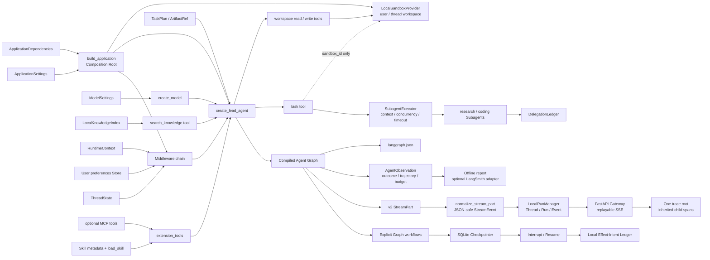

# Mini DeerFlow：从 Agent Harness 到持久化 Runtime 的工程纵切面

这一目录是课程贯穿项目的可导入 Python package。当前已经实现“增强模型层 → Agent 封装层 → Context/Middleware → 显式 Graph → Persistence/HITL → 隔离 Subagent → 线程工作区/MCP/Skills → 持久化 Thread/Run/Event → FastAPI/SSE → 测试/评测/观测/安全门禁 → 最终长任务”的闭环，并通过 [`app.py`](./app.py) 把它们装配为可恢复、可扩展、可验证的 Lead Agent 核心。完整分层见[工程架构总览](./ARCHITECTURE.md)；从零件到多轮恢复见 [Lead Agent 核心专题](./LEAD_AGENT_CORE.md)；工作区与扩展见 [Sandbox 专题](./SANDBOX_EXTENSIONS.md)；产品运行、取消、恢复与可重放事件见 [Runtime/Gateway 专题](./RUNTIME_GATEWAY.md)；结果/轨迹评测、唯一 trace root 与安全回归见 [评测与观测专题](./EVALUATION_OBSERVABILITY.md)；从空目录重建与组合故障演练见 [最终综合实战](./CAPSTONE.md)，完成后沿 [DeerFlow 源码调用链导读](./DEERFLOW_GUIDE.md) 进入真实架构。


**图的文本替代**：应用配置和可替换依赖先进入组合根；组合根装配知识工具、Runtime Context、Thread State、Store、Middleware 与 Lead Agent。显式 Graph 工作流进一步接入 SQLite Checkpointer、Interrupt/Resume 与本地 effect-intent Ledger；Lead Agent 可通过 task tool 调用受上下文、并发、超时和输出预算约束的 Subagent，只向它传递 `sandbox_id`。工作区工具由 provider 按 user/thread 分区；MCP 和 Skills 通过可选 extension tools 进入组合根。compiled graph 的 v2 事件经 normalizer 进入 RunManager、持久化事件和 FastAPI/SSE，同时可通过 `langgraph.json` 交给 Agent Server。远端投递仍需 provider idempotency key 或 outbox。

## 当前公共接口

| 模块 | 公共接口 | 当前责任 |
|---|---|---|
| `app.py` | `build_application()`、`ApplicationDependencies`、`make_graph()` | 唯一组合根、依赖注入和标准 LangGraph factory 入口 |
| `config.py` | `ApplicationSettings`、模型/摘要/Subagent 预算 | 保存不含 Secret 的显式应用配置 |
| `models.py` | `create_model()`、`create_offline_model()` | 隔离供应商初始化并提供确定性 fake model |
| `streaming.py` | `normalize_stream_part()`、`StreamEvent.as_dict()` | 把 LangGraph v2 envelope 与领域对象转成可严格 JSON 序列化的稳定事件 |
| `schemas.py` | `TaskPlan`、`ArtifactRef`、`SubagentResult` | 固定后续模块之间的业务数据契约 |
| `knowledge/` | `LocalKnowledgeIndex` | 提供幂等 upsert 和带 source 的离线检索 seam |
| `tools/` | `build_tool_registry()`、`build_sandbox_workspace_tools()` | 把检索与线程工作区能力变成最小权限 Agent 工具 |
| `agents/` | `create_lead_agent()` | 构建首个 model → tool → model 循环 |
| `context.py` | `RuntimeContext`、`safe_context_view()` | 保存一次运行的身份、权限与依赖，隔离 Secret |
| `state.py` | `ThreadState`、`merge_artifacts()`、checkpoint safety | 声明线程状态与按路径解决冲突的 reducer |
| `store.py` | `UserPreferenceRepository` | 用用户 namespace 保存显式选择的跨线程偏好 |
| `middleware/` | trace、摘要、动态 Context、PII、权限、错误、Artifact、预算 | 按严格顺序把横切治理装入 Agent 生命周期 |
| `graph/` | 显式 ReAct、确定性研究图、审批图 | 演示 State/Reducer/Command/Send/Subgraph 与 HITL |
| `persistence.py` | `open_sqlite_checkpointer()`、`open_sqlite_store()`、`SqliteEffectLedger` | 提供本地持久化 provider，并记录本地 effect intent |
| `subagents/` | registry、executor、task tool、ledger、pattern labs | 隔离 specialist 输入，限制并发/超时/输出，并对比 Router/Handoff/Subgraph |
| `sandbox/` | `SandboxProvider`、`SandboxSession`、`LocalSandboxProvider` | 提供 user/thread 分区、路径护栏、原子文件写入与有界审计；本地 provider 明确禁用宿主命令 |
| `mcp/` | `MCPToolAdapter` | 懒加载可选 MCP tools，经应用 allowlist 后才注册 |
| `skills/` | `SkillCatalog`、`build_load_skill_tool()` | 只发现 metadata，技能正文由 `load_skill` 按需进入上下文 |
| `runtime/` | `ThreadRecord`、`RunRecord`、`RunEvent`、`LocalRunManager` | 持久化产品运行状态、执行 Graph、取消与恢复 |
| `api/` | Gateway DTO、`MiniDeerFlowGateway`、FastAPI adapter | 不允许正文选择身份；提供 Thread/Run API 与可重放 SSE |
| `evals/` | Dataset/Case/Observation/Report、LangSmith adapters | 提供版本化 outcome/trajectory/budget 评测与回归比较；远程同步必须显式调用 |
| `observability.py` | `LangSmithObservability`、`LangSmithTracingConfig` | 约束 Graph/Gateway trace root 所有权并注入关联 metadata |
| `capstone.py` | `CapstoneRequest/Result`、`PublishIntent`、`run_capstone_scenario()` | 编排真实检索、并行委派、发布前质量门、跨重建审批、幂等发布和评测 |
| `quality/` | `critical-regressions.json` | 把关键安全与恢复风险映射到真实测试 node ID |

## 离线验证

先运行一条完整的 model → tool → model 最小对话：

```bash
make mini-deerflow
```

运行真实离线 Agent 的结果、轨迹和预算评测：

```bash
make mini-deerflow-eval
```

运行最终长任务：

```bash
make mini-deerflow-capstone
```

生产装配可把 `LangSmithObservability` 显式传给 `build_application()`；远程在线 experiment 还必须在 CLI 中同时给出 Dataset 名称与 `--confirm-upload`，详见评测专题。

```bash
uv run --locked pytest -q \
  tests/test_mini_deerflow_models.py \
  tests/test_mini_deerflow_streaming.py \
  tests/test_mini_deerflow_schemas.py \
  tests/test_mini_deerflow_knowledge.py \
  tests/test_mini_deerflow_lead_agent.py \
  tests/test_mini_deerflow_context_engineering.py \
  tests/test_mini_deerflow_middleware.py \
  tests/test_mini_deerflow_graph_workflows.py \
  tests/test_mini_deerflow_persistence_hitl.py \
  tests/test_mini_deerflow_subagents.py \
  tests/test_mini_deerflow_sandbox_extensions.py \
  tests/test_mini_deerflow_lead_agent_core.py \
  tests/test_mini_deerflow_runtime_gateway.py \
  tests/test_mini_deerflow_evaluation_observability.py \
  tests/test_mini_deerflow_application.py \
  tests/test_mini_deerflow_project_structure.py
```

## 有意延后的能力

- 文档站视觉检查、全量发布 QA 与最终发布记录（任务 17）。

这样分期可以让每个新抽象都解决一个已经观察到的业务失败，而不是一次生成一个看似完整、实际上无法解释和验证的大型脚手架。
