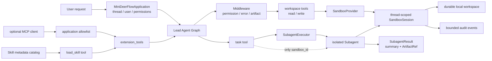
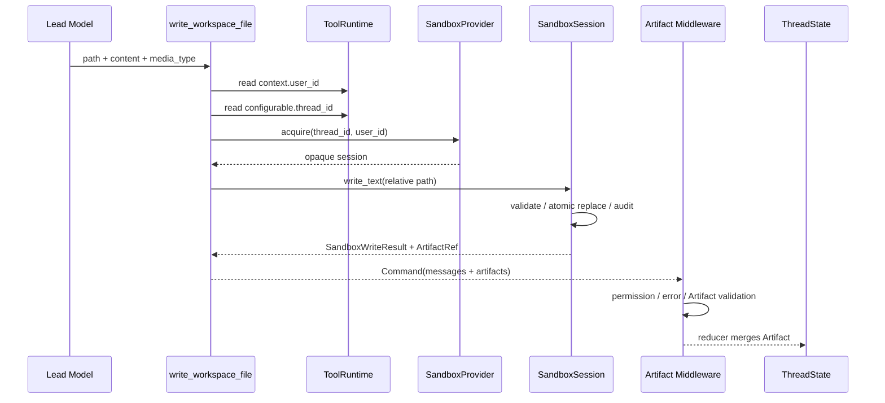
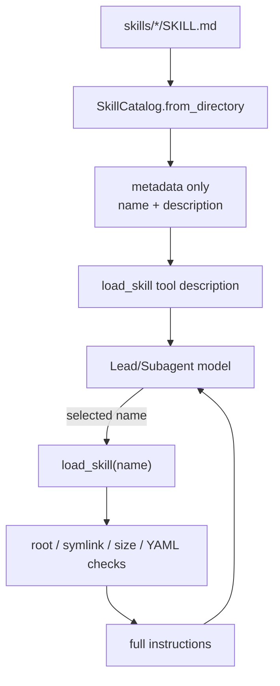

# Mini DeerFlow 专题：ArtifactRef 只有路径，文件究竟写到哪里

> 验证环境：Python 3.12；精确依赖版本以 `uv.lock` 为唯一事实源  
> API 状态：Sandbox/Skills 为课程稳定契约；`langchain-mcp-adapters` 为显式 opt-in 可选依赖  
> 前置内容：第 04、06、10、11 章与 [`LEAD_AGENT_CORE.md`](./LEAD_AGENT_CORE.md)  
> DeerFlow 阅读锚点：`807c3c521832526c6205ffee23e5f05231eaea5b`  
> 校准日期：2026-07-13

## ArtifactRef 已经入 State，文件却还没有落点

第 11 章让 Lead 通过 `task` 委派隔离 specialist。上一篇又把 `ArtifactRef` 合并进 State。此时引用已经存在，文件落点、写入身份和可复用能力仍没有答案。

最危险的捷径，是把宿主绝对路径、shell 和全部远端工具直接交给 Subagent。上下文虽然隔离，specialist 仍能绕过 Lead 的授权边界访问宿主环境。

我会沿一次文件写入向外扩展：先建立 thread workspace，再让工具通过 Runtime 身份写入，只把 capability handle 交给 Subagent，最后接入 MCP 工具来源和 Skill 知识来源。

这条链始终由应用决定身份、thread 和权限。模型只能选择已经注册的能力，不能自己指定 provider、宿主目录或认证用户。

这条链会依次留下五类证据：thread/user 分区的工作区、`ToolRuntime` 绑定的身份、写入后的 ToolMessage/Artifact/audit、Subagent 继承的 opaque handle，以及 MCP allowlist 与按需加载的 Skill 正文。

先从 `reports/final.md` 的路径检查开始。当前只讨论工作区护栏与本地文件 provider；进程、网络和资源隔离要由容器或远程 Sandbox 继续提供。

## 1. 路径通过校验，进程仍拥有宿主权限

### 1.1 `resolve()` 拒绝父目录，只解决路径问题

先看一个常见的路径检查：

```python
candidate = (root / relative_path).resolve()
if not candidate.is_relative_to(root):
    raise ValueError("outside workspace")
```

这段代码限制了路径。运行它的 Python 进程仍拥有宿主用户权限；同一模型若再接入 unrestricted shell，仍可能读取任意宿主文件。

### 1.2 `LocalSandboxProvider` 的保证到哪里为止

本地 provider 明确保证：

- `(user_id, thread_id)` 映射到不同目录和稳定 `sandbox_id`；
- 只接受 workspace 相对路径；
- 拒绝 `..`、绝对路径和任何符号链接路径；
- 文本读写有字节预算，写入使用同目录临时文件 + `os.replace()`；
- release 后会话对象消失，但线程目录保留，重新 acquire 可继续读取；
- 宿主命令执行固定返回 exit code 126；
- 审计只保存 action/path/outcome/大小，不复制文件正文。

它明确不保证：

- 对抗同一宿主上的恶意进程；
- 防止外部进程在检查和打开之间制造 TOCTOU 竞态；
- CPU、内存、网络、进程数或磁盘 quota；
- 容器逃逸防护；
- 多租户生产隔离。

准确地说，它是线程工作区 local provider。需要运行不可信代码时，应换成容器或远端 Sandbox provider，同时保持应用接口不变。

官方 Deep Agents 文档也区分 `FilesystemBackend` 与 Sandbox：本地文件后端适合受控开发场景，生产执行应使用 Sandbox backend。[LangChain Deep Agents Backends](https://docs.langchain.com/oss/python/deepagents/backends)

## 2. 一张图看清身份、句柄与扩展来源

<!-- diagram:id=sandbox-extension-capability-map -->


**图的文本替代**：应用拥有 thread、user 和 permissions。Workspace 工具先经过 Middleware，再由 SandboxProvider 取得线程会话，操作 durable workspace 并记录有界审计。

`task` 创建隔离 Subagent，只传 opaque `sandbox_id`。MCP 工具经过应用 allowlist，Skill 启动时只暴露 metadata；两者最终都由组合根决定是否进入 Agent。

沿调用方向看，所有权有三条：

1. 模型选择“调用哪个已注册工具”，但不能选择 provider、用户或 thread。
2. Subagent 可以继承 capability handle，但不能因此自动继承全部 Context。
3. MCP/Skill discovery 不等于授权；真正进入 Lead Agent 的工具仍由应用组合根决定。

## 3. 同一 user/thread 重开后还要找到文件

### 3.1 先运行 acquire、write、release、reacquire

```python
from pathlib import Path
from tempfile import TemporaryDirectory

from mini_deerflow.sandbox import (
    LocalSandboxProvider,
    SandboxCommand,
    SandboxPathError,
)


with TemporaryDirectory() as directory:
    provider = LocalSandboxProvider(Path(directory) / "sandboxes")
    session = provider.acquire("thread-42", user_id="learner")
    other_user = provider.acquire("thread-42", user_id="other-learner")
    write = session.write_text(
        "reports/result.md",
        "线程内研究结果",
        media_type="text/markdown",
    )
    content = session.read_text("reports/result.md")

    try:
        session.write_text("../outside.md", "blocked")
    except SandboxPathError as error:
        traversal_error = type(error).__name__

    denied = session.execute(SandboxCommand(("python", "-V")))
    original_id = session.sandbox_id
    provider.release(original_id)
    missing_after_release = provider.get(original_id) is None
    restored = provider.acquire("thread-42", user_id="learner")

    print("artifact_path =", write.artifact.path)
    print("content =", content)
    print("other_user_isolated =", other_user.sandbox_id != original_id)
    print("traversal_error =", traversal_error)
    print("command_exit_code =", denied.exit_code)
    print("session_released =", missing_after_release)
    print("workspace_survived =", restored.read_text("reports/result.md") == content)
    print(
        "audit_outcomes =",
        [(event.action, event.outcome) for event in session.audit_events()],
    )
```

```text
artifact_path = reports/result.md
content = 线程内研究结果
other_user_isolated = True
traversal_error = SandboxPathError
command_exit_code = 126
session_released = True
workspace_survived = True
audit_outcomes = [('write_text', 'completed'), ('read_text', 'completed'), ('write_text', 'rejected'), ('execute', 'denied')]
```

这组输出把四件事分开：Artifact 使用虚拟相对路径；user/thread 共同决定 workspace；路径越界与宿主命令分别被拒绝；release 只释放会话对象，不删除线程数据。

**动手修改**：把 other_user 改回 learner，再比较 sandbox_id；随后只修改 thread_id。写出 identity 为什么必须同时包含 user 和 thread。

### 3.2 目录名不应暴露原始身份

用户 ID 可能包含邮箱、斜线、Unicode 或外部系统格式。直接拼进宿主路径会带来路径注入、长度和隐私问题。provider 只把规范化身份的短 SHA-256 digest 放入目录与 `sandbox_id`。

Digest 只处理目录映射，不负责鉴权。调用者仍要从已认证 runtime 取得 user ID；模型提交的字符串不会因为被 hash 就变可信。

### 3.3 release 释放会话，不删除线程数据

`release(sandbox_id)` 只释放当前 provider 会话。重新 acquire 同一 user/thread 会创建新的 session 与 audit buffer，同时继续使用原目录。

删除线程 workspace 是产品数据生命周期操作，需要：

- 明确的 thread ownership；
- retention policy；
- 正在运行的任务检查；
- Artifact/上传/输出的一致清理；
- 审计与失败恢复。

这些属于后续 Runtime/Gateway 的产品用例，不应藏进通用 `release()`。

## 4. `write_workspace_file` 怎样把文件带回 State

<!-- diagram:id=workspace-write-sequence -->


**图的文本替代**：模型只提交相对路径、正文和 media type。工具从 ToolRuntime 读取 user 与 thread，再取得 session。Session 校验路径、原子写入并审计，最后返回 ArtifactRef。

工具把 ArtifactRef 放进 Command：一条更新产生 ToolMessage，另一条经 Artifact middleware 校验后进入 ThreadState reducer。

模型可见 schema 中没有：

- `workspace_root`；
- `thread_id`；
- `user_id`；
- `sandbox_id`；
- provider 类型。

下面让真实 Lead Agent 调用写工具。模型只提交 path、content 和 media_type；user 与 thread 从 Runtime 进入工具：

```python
from dataclasses import replace
from tempfile import TemporaryDirectory

from langchain_core.messages import AIMessage, ToolMessage

from mini_deerflow.app import build_application, build_default_dependencies
from mini_deerflow.config import ApplicationSettings
from mini_deerflow.models import create_offline_model
from mini_deerflow.runtime import RunDescriptor


with TemporaryDirectory() as directory:
    settings = ApplicationSettings.offline(workspace_root=directory)
    dependencies = build_default_dependencies(settings)
    model = create_offline_model(
        [
            AIMessage(
                content="",
                tool_calls=[
                    {
                        "name": "write_workspace_file",
                        "args": {
                            "path": "reports/application.md",
                            "content": "组合根写入",
                            "media_type": "text/markdown",
                        },
                        "id": "application-write-1",
                        "type": "tool_call",
                    }
                ],
            ),
            AIMessage(content="应用写入完成。"),
        ]
    )
    application = build_application(
        settings,
        dependencies=replace(dependencies, model=model),
    )
    run = RunDescriptor("application-thread", "application-request", "learner")
    state = application.invoke(
        "写入应用报告",
        run=run,
        permissions={"workspace:write"},
    )
    session = dependencies.sandbox_provider.acquire(
        run.thread_id,
        user_id=run.user_id,
    )
    tool_message = next(
        message for message in state["messages"] if isinstance(message, ToolMessage)
    )

    print(
        "workspace_tool_registered =",
        "write_workspace_file" in application.tool_names,
    )
    print("artifact_path =", state["artifacts"][0].path)
    print("file_content =", session.read_text("reports/application.md"))
    print(
        "tool_message_has_path =",
        "reports/application.md" in str(tool_message.content),
    )
    print("final_answer =", state["messages"][-1].content)
```

```text
workspace_tool_registered = True
artifact_path = reports/application.md
file_content = 组合根写入
tool_message_has_path = True
final_answer = 应用写入完成。
```

一次写入留下三类事实：workspace 中的文件、State 中的 ArtifactRef、消息协议中的 ToolMessage。少一项，后续 UI、恢复或模型循环都会看到不完整状态。

**动手修改**：把 permission 改为空集合。预测 handler 是否执行、Artifact 是否进入 State、ToolMessage 是 success 还是 error，然后运行。

### 4.1 写成功后同时更新消息和 Artifact

纯字符串只能告诉模型“写成功了”，调用方无法可靠发现产物。`Command(update=...)` 同时写入：

- `messages`：满足 model → tool → model 协议；
- `artifacts`：让 Graph State、UI 和后续 Subagent 有结构化引用。

已有的 `ArtifactTrackingMiddleware` 和 `merge_artifacts()` 继续生效。Workspace 写入不能绕过既有 State 安全边界。

### 4.2 路径安全与写权限分别校验

读写工具 metadata 分别声明 `workspace:read` 和 `workspace:write`。默认 Middleware 在执行前根据 Runtime Context permissions 决定是否放行。

路径安全回答“允许写到哪里”，权限回答“这次调用能不能写”。两项检查位于不同边界。

## 5. `sandbox_id` 给 Subagent 的究竟是什么

第 11 章已经实现 registry、并发限制、timeout、输出预算和 ledger。这里不重写 executor，只扩展 `task` 的 parent context 投影：

```text
Lead Runtime
├── user_id ──────────────┐
├── configurable.thread_id│ 应用内部 acquire
├── auth_token            │ 不传
├── messages              │ 不传
└── workspace_root        │ 不传
                          ▼
                    sandbox_id
                          │
                          ▼
SubagentInvocation.context = spec allowlist ∩ {safe context, sandbox_id}
```

`sandbox_id` 是能力句柄（capability handle）。只有持有同一 provider 的 handler 或 tool 才能用它 `get()` 会话。demo specialist 看不到 provider 参数，Prompt 中也没有宿主路径。

### 5.1 绝对路径会把 Subagent 绑死在宿主机

绝对路径会泄露宿主布局，并把 Subagent 绑定到 Local provider。换成远端容器后，Lead 的宿主路径可能毫无意义；opaque ID 让 provider 自己定位实际环境。

### 5.2 长内容留在 workspace，Lead 只收有界结果

Subagent 写长内容到 workspace，只返回：

```text
SubagentResult
├── status
├── bounded summary
├── ArtifactRef[]
├── output_chars / digest
└── bounded error
```

整份报告不会复制进主消息。Lead 先读摘要，需要证据时再沿 Artifact 路径读取文件。

下面的离线实验让边界可见：Subagent handler 只用 `sandbox_id` 取回 session，不会收到 workspace_root、messages 或 auth_token。

> 下面按普通 `.py` 脚本书写，所以最外层使用 `asyncio.run(...)`。若复制到 Jupyter，请直接写 `state = await lead.ainvoke(...)`；不要在 Notebook 已运行的事件循环里再次调用 `asyncio.run(...)`。本篇后续异步示例同理。

```python
import asyncio
import json
from pathlib import Path
from tempfile import TemporaryDirectory

from langchain_core.messages import AIMessage, ToolMessage

from mini_deerflow.agents import create_lead_agent
from mini_deerflow.context import RuntimeContext
from mini_deerflow.models import create_offline_model
from mini_deerflow.sandbox import LocalSandboxProvider
from mini_deerflow.schemas import SubagentResult
from mini_deerflow.subagents import (
    DelegationLedger,
    SubagentExecutor,
    SubagentInvocation,
    SubagentOutput,
    SubagentRegistry,
    SubagentSpec,
    build_task_tool,
)


with TemporaryDirectory() as directory:
    provider = LocalSandboxProvider(Path(directory) / "sandboxes")
    observed_contexts = []

    async def report_writer(invocation: SubagentInvocation) -> SubagentOutput:
        observed_contexts.append(invocation.context)
        session = provider.get(str(invocation.context["sandbox_id"]))
        if session is None:
            raise RuntimeError("sandbox session missing")
        write = session.write_text(
            "reports/subagent.md",
            "Subagent 的有界结果",
            media_type="text/markdown",
        )
        return SubagentOutput(
            summary="已生成 Subagent 报告",
            artifacts=[write.artifact],
        )

    ledger = DelegationLedger()
    executor = SubagentExecutor(
        SubagentRegistry(
            [
                SubagentSpec(
                    name="report-writer",
                    description="写入线程报告",
                    handler=report_writer,
                    allowed_context_fields=frozenset({"sandbox_id"}),
                )
            ]
        ),
        ledger=ledger,
    )
    task = build_task_tool(executor, sandbox_provider=provider)
    lead = create_lead_agent(
        model=create_offline_model(
            [
                AIMessage(
                    content="",
                    tool_calls=[
                        {
                            "name": "task",
                            "args": {
                                "task_id": "sandbox-task-1",
                                "description": "生成线程报告",
                                "prompt": "只写入有界结论",
                                "subagent_type": "report-writer",
                            },
                            "id": "sandbox-task-call-1",
                            "type": "tool_call",
                        }
                    ],
                ),
                AIMessage(content="已接收 Subagent 结果。"),
            ]
        ),
        tools=[task],
    )
    state = asyncio.run(
        lead.ainvoke(
            {"messages": [("user", "委派报告")]},
            config={"configurable": {"thread_id": "shared-thread"}},
            context=RuntimeContext(
                user_id="learner",
                workspace_root="/must-not-be-delegated",
                auth_token="must-not-leak",
            ),
        )
    )
    raw = next(
        message.content
        for message in state["messages"]
        if isinstance(message, ToolMessage)
    )
    result = SubagentResult.model_validate(json.loads(str(raw)))
    content = provider.acquire(
        "shared-thread",
        user_id="learner",
    ).read_text("reports/subagent.md")

    print("context_keys =", sorted(observed_contexts[0]))
    print("result_status =", result.status)
    print("artifact_path =", result.artifacts[0].path)
    print(
        "secret_leaked =",
        "must-not-leak" in json.dumps(observed_contexts[0]),
    )
    print("workspace_content =", content)
    print("ledger_context_keys =", ledger.list_records()[0].context_keys)
```

```text
context_keys = ['sandbox_id']
result_status = completed
artifact_path = reports/subagent.md
secret_leaked = False
workspace_content = Subagent 的有界结果
ledger_context_keys = ('sandbox_id',)
```

真正的能力来自 handler 持有 provider。把随机 ID 交给没有 provider 的模型，不会突然赋予宿主文件权限。

**动手修改**：从 spec allowlist 删除 sandbox_id。预测结果状态和 ledger context_keys；不要把修复写成重新传 workspace_root。

## 6. MCP server 暴露工具，不代表应用授权

LangChain 的 `MultiServerMCPClient.get_tools()` 会把 MCP server 工具转换为 LangChain tools。Client 默认 stateless，每次调用建立新 session。

MCP server 运行在独立进程，不能直接访问 LangGraph Context、State 或 Store。需要跨越这条边界时，应通过官方 interceptor 显式桥接。参见 [LangChain MCP](https://docs.langchain.com/oss/python/langchain/mcp)。

Mini DeerFlow 在 client 外再放一层应用 adapter：

先用 fake client 对照 server 发现列表与 application 授权列表。实验不安装 MCP extra，也不启动外部进程：

```python
import asyncio

from langchain.tools import tool

from mini_deerflow.mcp import MCPToolAdapter


@tool("approved_echo")
def approved_echo(text: str) -> str:
    """离线回显。"""
    return f"approved:{text}"


@tool("unapproved_delete")
def unapproved_delete(path: str) -> str:
    """代表未授权破坏性工具。"""
    return f"deleted:{path}"


factory_calls = {"count": 0}


class FakeMCPClient:
    async def get_tools(self):
        return [approved_echo, unapproved_delete]


def client_factory():
    factory_calls["count"] += 1
    return FakeMCPClient()


async def inspect_policy():
    disabled = MCPToolAdapter(
        client_factory=client_factory,
        enabled=False,
        allowed_tool_names=frozenset({"approved_echo"}),
    )
    disabled_tools = await disabled.load_tools()
    calls_while_disabled = factory_calls["count"]

    enabled = MCPToolAdapter(
        client_factory=client_factory,
        enabled=True,
        allowed_tool_names=frozenset({"approved_echo"}),
    )
    loaded = await enabled.load_tools()
    return disabled_tools, calls_while_disabled, loaded


disabled_tools, calls_while_disabled, loaded = asyncio.run(inspect_policy())
print("disabled_tools =", [item.name for item in disabled_tools])
print("factory_calls_while_disabled =", calls_while_disabled)
print("server_tools =", ["approved_echo", "unapproved_delete"])
print("application_tools =", [item.name for item in loaded])
print("source =", loaded[0].metadata["source"])
```

```text
disabled_tools = []
factory_calls_while_disabled = 0
server_tools = ['approved_echo', 'unapproved_delete']
application_tools = ['approved_echo']
source = mcp
```

disabled 时 client factory 没有执行。enabled 后 server 暴露两个工具，应用只接收 allowlist 中的 approved_echo；unapproved_delete 不会因远端发现而获得权限。

**动手修改**：把 allowed_tool_names 改为空集合。确认 client 仍可被发现，但组合根拿到空工具表；然后解释“连接成功”为什么不是“授权成功”。

接入真实 LangChain MCP server 时，factory 可以这样创建：

```python
from mini_deerflow.mcp import MCPToolAdapter

adapter = MCPToolAdapter.from_langchain_servers(
    {
        "research": {
            "transport": "stdio",
            "command": "python",
            "args": ["/absolute/path/to/server.py"],
        }
    },
    enabled=True,
    allowed_tool_names=frozenset({"search_papers"}),
)

mcp_tools = await adapter.load_tools()
dependencies = replace(
    build_default_dependencies(settings),
    extension_tools=mcp_tools,
)
application = build_application(settings, dependencies=dependencies)
```

先安装显式 extra：

```bash
uv sync --locked --group dev --extra mcp
```

### 6.1 disabled 时连 optional package 都不加载

`enabled=False` 时：

- 不 import `langchain_mcp_adapters`；
- 不构造 client；
- 不连接 stdio/HTTP server；
- 返回空工具 tuple。

核心离线测试因此不需要 MCP server，也不会把“未安装 optional package”误报为 Agent 失败。

### 6.2 远端工具变化不能自动改写本地权限

MCP server 可以新增或修改工具。若应用把 `get_tools()` 的全部结果直接绑定给模型，远端配置变化就会改写权限。Mini DeerFlow 只接收 `allowed_tool_names` 中的工具，并标记 `source=mcp`。

allowlist 之后仍要验证：

- server identity 与 transport；
- OAuth/API credential 注入位置；
- tool schema 变更；
- read/write/destructive 风险等级；
- timeout、retry、rate limit；
- 返回内容中的 prompt injection；
- 人工审批和审计。

## 7. Skill 正文何时进入上下文

Skill 保存任务相关的工作流知识。它不负责远端执行；一个标准目录至少包含：

```text
research-report/
├── SKILL.md
├── references/   # 可选
├── scripts/      # 可选；仍需 Sandbox/权限才能执行
└── assets/       # 可选
```

`SKILL.md` 用 YAML frontmatter 保存 `name` 和 `description`，正文再放完整说明。Deep Agents 同样采用启动时读 metadata、需要时读正文的渐进披露。[LangChain Deep Agents Skills](https://docs.langchain.com/oss/python/deepagents/skills)

### 7.1 启动时只展示 name 和 description

<!-- diagram:id=skill-progressive-disclosure -->


**图的文本替代**：Catalog 扫描每个 SKILL.md，只把 name 与 description 放入 `load_skill` 工具描述。模型选定名称后调用工具，工具复查路径、大小、YAML 与 metadata，再返回正文。

使用 package 内置示例：

```python
from mini_deerflow.skills import (
    build_demo_skill_catalog,
    build_load_skill_tool,
)

catalog = build_demo_skill_catalog()
index = catalog.render_index()
loaded = catalog.load("research-report")
load_skill = build_load_skill_tool(catalog)

print("skill_names =", [item.name for item in catalog.list_metadata()])
print("body_in_index =", "引用核验流程" in index)
print("body_after_load =", "引用核验流程" in loaded.instructions)
print("tool_name =", load_skill.name)
print("tool_schema =", sorted(load_skill.tool_call_schema.model_fields))
```

```text
skill_names = ['research-report']
body_in_index = False
body_after_load = True
tool_name = load_skill
tool_schema = ['name']
```

启动索引只暴露 metadata；完整“引用核验流程”在显式 load 后才出现。模型可见参数只有 name，没有任意宿主路径。

是否把工具加入组合根，仍由应用决定：

```python
dependencies = replace(
    build_default_dependencies(settings),
    extension_tools=(load_skill,),
)
```

**动手修改**：在 index 阶段直接拼接 `loaded.instructions`，记录启动 Prompt 增加的字符数。然后恢复两阶段加载，并说明这既是预算边界也是信任边界。

### 7.2 本地 Skill 也要经过信任边界

安装到本地的 Skill 仍可能包含：

- 要求忽略系统规则的 Prompt injection；
- 诱导读取 Secret 的步骤；
- 指向外部目录的符号链接；
- scripts 中的破坏性命令；
- 与 description 不一致的正文；
- 超大文件导致上下文或内存压力。

当前 catalog 拒绝越界或符号链接主文件，限制 256 KB，并在 load 时确认 metadata 未被替换。它不执行 scripts，也不自动加载 references/assets。

生产系统还需要安装审查、签名与来源、allowed-tools、Secret policy 和版本管理。

## 8. MCP 提供能力，Skill 提供工作流知识

两者都能扩展 Agent，但授权对象不同。下面的表只用于核对职责，不替代前面的调用证据。

| 维度 | MCP Tool | Agent Skill |
|---|---|---|
| 主要作用 | 让模型调用外部能力 | 给模型任务相关工作流知识 |
| 发现结果 | Tool schema | name/description metadata |
| 真正使用 | 远端/本地 server 执行调用 | 加载 Markdown 指令后由 Agent 继续工作 |
| 权限边界 | server、transport、tool allowlist、interceptor | catalog root、review、allowed-tools、Sandbox |
| 默认策略 | disabled + deny by default | metadata visible、body on demand |
| 典型失败 | server 新增破坏性工具、credential 泄漏 | 正文 prompt injection、脚本越权 |

Skill 即使需要 MCP 工具，两者仍分别授权。加载 Skill 不会自动扩充 registry；注册 MCP 工具也不会自动加载某个 Skill。

## 9. 沿授权链定位七种失败

前文已经分别运行过这些失败。现在把它们放在一起，目的只是定位责任边界：

| 失败输入或现场 | 必须观察到的结果 | 负责拒绝的边界 |
|---|---|---|
| `../outside.md` | `SandboxPathError`；audit 为 `write_text/rejected`；外部无文件 | 路径护栏 |
| 同 thread、不同 user | 两个 `sandbox_id` 和目录 | 身份分区 |
| symlink 指向外部 | read/write 均拒绝 | 解析后的路径检查 |
| Local provider 执行 shell | exit code 126；audit 为 `execute/denied` | provider 能力策略 |
| MCP extra 未安装 | 离线核心正常；启用并 load 时才给安装提示 | lazy optional adapter |
| MCP server 暴露未授权工具 | 能发现，但不返回组合根 | 应用 allowlist |
| Skill 正文进入启动 Prompt | 测试失败；正文只允许出现在 `load_skill` 的 ToolMessage | progressive disclosure |

这张表汇总前文证据，不代替各节的运行记录。尤其是 symlink 与 `..` 属于两种路径攻击，MCP discovery 与本地 policy 也属于两个步骤。

## 10. 这些边界为什么不交给一个框架名

### 10.1 先看清边界，再决定是否复用 Deep Agents

Deep Agents 已提供成熟的 filesystem backend、Subagent、Skills 和 Sandbox 集成，真实项目可以直接采用。课程仍保留小型 contract，因为下面这些关系必须可见：

- thread/user identity 怎样进入 provider；
- ToolRuntime 与模型 schema 怎样分离；
- 文件副作用怎样投影成 Artifact State；
- MCP discovery 和应用授权为何是两步；
- progressive disclosure 到底减少了哪部分上下文。

理解这些关系后，再选择 Deep Agents，就是复用成熟实现，而不是用框架名掩盖授权边界。

### 10.2 provider 不拥有数据 retention

自动清理会混淆运行生命周期与数据 retention。后续 Gateway 应拥有明确的 thread cleanup use case，provider 只管理 capability 生命周期。

### 10.3 审计只记操作事实，不复制正文

正文可能含用户数据、Secret 或大量内容。audit 保存 action、path、outcome 和大小，完整内容仍由 workspace 与 Artifact 管理。

需要防篡改审计时，应接入 append-only repository，不能依赖进程内 list。

## 11. 练习：替换 provider 也不改调用方

### 练习 A：读取预算

创建一个超过 `max_bytes` 的文件，证明 `read_text()` 拒绝并记录 `read_text/rejected`。解释为什么不能先 `read_text()` 再检查字符串长度。

### 练习 B：provider 替换

实现一个纯内存 `SandboxProvider` 测试替身，保持 acquire/get/release 和 Artifact 契约不变。不要修改 workspace tool。

### 练习 C：MCP 风险分级

为 MCP allowlist 增加 `read / write / destructive` 风险元数据；让 destructive 工具必须经过 HITL。先写测试证明模型不能通过工具参数降低风险等级。

### 练习 D：Skill allowed-tools

读取 Skill frontmatter 的 `allowed-tools`，把它与应用已有 tools 做交集。加载 Skill 不能凭空增加工具。

### 延迟回忆

1. 为什么 `sandbox_id` 可以传给 Subagent，而 `workspace_root` 不应传？
2. 为什么 LocalSandboxProvider 禁用 shell 后仍不能称为生产隔离？
3. 为什么 MCP discovery 与 tool authorization 必须分开？
4. Skill metadata 和正文分别在什么时候进入模型上下文？
5. 为什么 release 不应该偷偷删除线程文件？

<details>
<summary>参考方向</summary>

1. ID 是 provider 可解释的 opaque handle，绝对路径泄露宿主实现并妨碍远端 provider 替换。
2. 文件路径护栏没有提供进程、网络、资源或多租户隔离。
3. Server 能力集合可以变化；本地应用必须保留最终授权权力。
4. Metadata 在工具描述/index；正文只有显式 `load_skill(name)` 后进入 ToolMessage。
5. 会话生命周期和数据 retention 是两个 use case，删除需要 ownership、并发和审计策略。

</details>

## 12. 用契约检查整条能力链

先只运行本专题：

```bash
uv run --locked --group dev pytest -q \
  tests/test_mini_deerflow_sandbox_extensions.py
```

再检查它没有绕过 Subagent、Tool 与 Lead 已有契约：

```bash
uv run --locked --group dev pytest -q \
  tests/test_mini_deerflow_sandbox_extensions.py \
  tests/test_mini_deerflow_subagents.py \
  tests/test_mini_deerflow_tool_contracts.py \
  tests/test_mini_deerflow_lead_agent_core.py
```

- [ ] 同 user/thread acquire 稳定，不同 user 或 thread 隔离；
- [ ] release 后 session 消失，重新 acquire 后 workspace 文件仍在；
- [ ] `..`、绝对路径与 symlink traversal 被拒绝；
- [ ] local command 固定 denied，不调用宿主 shell；
- [ ] workspace tool schema 不暴露 user/thread/workspace/provider；
- [ ] write tool 产生 ArtifactRef 并经过现有 middleware/reducer；
- [ ] Subagent 只继承 allowlisted `sandbox_id`，结果有界；
- [ ] MCP disabled 时不 import、不连接；enabled 后只返回 allowlist；
- [ ] Skill index 不含正文，正文只通过 load_skill 返回；
- [ ] MCP/Skills 未启用时全部核心离线测试保持通过。

## 13. 沿同一能力链阅读 DeerFlow

固定提交：[`807c3c521832526c6205ffee23e5f05231eaea5b`](https://github.com/bytedance/deer-flow/tree/807c3c521832526c6205ffee23e5f05231eaea5b)。课程只缩小关系，不复制产品规模。

> **锚点说明**：这里保留的是本专题写作时的历史对照版本，用来观察 Sandbox/MCP/Skills 当时的模块关系；全书最后四条源码路线的统一验收版本，以 [`DEERFLOW_GUIDE.md`](./DEERFLOW_GUIDE.md) 的 `4af6178` 为准。

| Mini DeerFlow | DeerFlow 固定提交阅读入口 | 重点问题 |
|---|---|---|
| `SandboxProvider.acquire/get/release` | `backend/packages/harness/deerflow/sandbox/sandbox_provider.py` | provider 生命周期由谁拥有？ |
| `LocalSandboxProvider` | `sandbox/local/local_sandbox_provider.py` 与 `local_sandbox.py` | user/thread path mapping、local shell 默认策略是什么？ |
| workspace tools | `sandbox/tools.py`、`sandbox/security.py` | 虚拟路径、宿主路径和权限怎样隔离？ |
| task sandbox handle | `tools/builtins/task_tool.py`、`subagents/executor.py` | parent sandbox state、tool groups 和 Skill allowlist 怎样收缩后传给 Subagent？ |
| `MCPToolAdapter` | `tools/tools.py`、`tools/mcp_metadata.py` | MCP 工具何时初始化、缓存、标记、去重和过滤？ |
| `SkillCatalog` | `skills/catalog.py`、`skills/frontmatter.py`、`skills/types.py` | metadata discovery、完整正文、allowed-tools 和 Secret requirements 怎样分层？ |
| `extension_tools` | `agents/lead_agent/agent.py:make_lead_agent` | built-in、Sandbox、MCP、community、Subagent 工具在哪里汇合？ |

推荐阅读顺序：

```text
sandbox_provider.py
→ local_sandbox_provider.py
→ sandbox middleware/tools/security
→ task_tool.py 与 subagents/executor.py
→ tools.py / mcp_metadata.py
→ skills/frontmatter.py / catalog.py / types.py
→ make_lead_agent 的最终装配
```

先回答谁拥有身份与 lifecycle，再读具体文件函数。否则很容易把 DeerFlow 的目录数量误认为新的 LangGraph 原语。

## 参考资料

- [LangChain MCP](https://docs.langchain.com/oss/python/langchain/mcp)：`MultiServerMCPClient`、tools/resources/prompts 与 interceptor。
- [LangChain Deep Agents Backends](https://docs.langchain.com/oss/python/deepagents/backends)：State/Filesystem/Store/Sandbox backend、安全边界与 virtual filesystem。
- [LangChain Deep Agents Skills](https://docs.langchain.com/oss/python/deepagents/skills)：标准 Skill 目录、frontmatter 与 progressive disclosure。
- [Model Context Protocol](https://modelcontextprotocol.io/docs/getting-started/intro)：协议角色与 server 暴露能力的官方入口。
- [DeerFlow repository](https://github.com/bytedance/deer-flow/tree/807c3c521832526c6205ffee23e5f05231eaea5b)：本专题固定源码阅读锚点。

工作区、MCP 和 Skills 已通过同一授权链接入组合根。仍未解决的是产品交付：浏览器无法查询、取消或恢复一次长任务。下一篇让 Runtime 只消费这些稳定契约，不反向进入工具内部。

继续阅读：[持久化 Runtime、FastAPI Gateway 与可重放 SSE](./RUNTIME_GATEWAY.md)。
