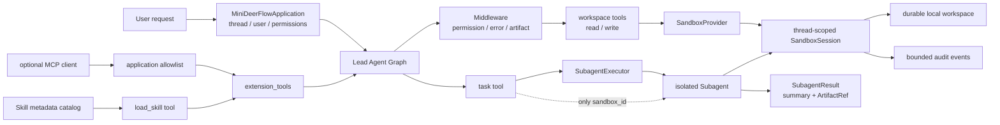
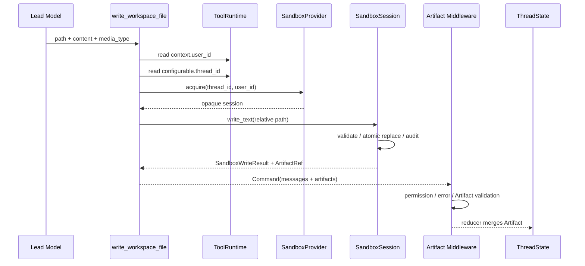
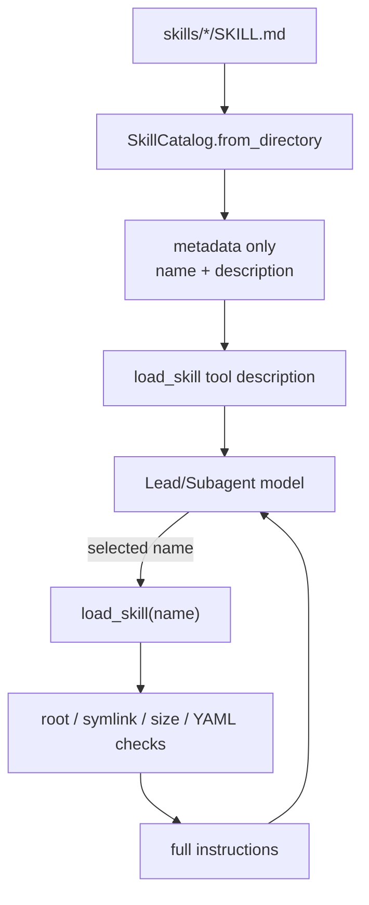

# Mini DeerFlow 专题实战：Subagent、Sandbox、MCP 与 Skills 扩展

> 验证环境：Python 3.12；精确依赖版本以 `uv.lock` 为唯一事实源  
> API 状态：Sandbox/Skills 为课程稳定契约；`langchain-mcp-adapters` 为显式 opt-in 可选依赖  
> 前置内容：第 04、06、10、11 章与 [`LEAD_AGENT_CORE.md`](./LEAD_AGENT_CORE.md)  
> DeerFlow 阅读锚点：`807c3c521832526c6205ffee23e5f05231eaea5b`  
> 校准日期：2026-07-13

## 系统快照：Subagent 已经隔离上下文，能力仍直接指向宿主环境

第 11 章让 Lead 通过 `task` 委派隔离 specialist。若 Subagent 直接获得宿主绝对路径、shell 和全部远端工具，上下文虽已隔离，能力边界仍然失控。

本专题要回答：模型获得文件、命令、远端工具和技能说明之后，谁决定它能看到什么、在哪个线程执行、结果怎样回到 State，以及如何证明主 Agent 与 Subagent 没有互相泄漏上下文？

完成后，Mini DeerFlow 不再只是能研究和委派的聊天循环。它拥有一个按用户/线程分区的本地工作区、通过 `ToolRuntime` 绑定身份的读写工具、只继承 opaque sandbox handle 的 Subagent、默认关闭的 MCP adapter，以及遵循 progressive disclosure（渐进披露）的 Skill catalog。

## 学习目标

完成本专题后，你应该能够：

- 区分“工作区路径护栏”“本地文件 provider”“进程/容器 Sandbox”三种不同强度的边界；
- 设计 `acquire → get → release` 生命周期，而不是把 shell 函数直接叫 Sandbox；
- 用 `ToolRuntime` 取得应用控制的 `thread_id/user_id`，不让模型把身份写进工具参数；
- 让文件写入同时形成 `ToolMessage`、`ArtifactRef` 和审计事实；
- 让 Subagent 共享受控 workspace 能力，但不继承主消息、Secret 或宿主绝对路径；
- 把 MCP 作为可选工具来源，并在应用边界再次 allowlist；
- 只展示 Skill 的 name/description，正文由 `load_skill` 按需加载；
- 沿相同关系阅读 DeerFlow 的 sandbox provider、task tool、MCP tool assembly 和 skills catalog。

只运行本专题测试：

```bash
uv run --locked --group dev pytest -q \
  tests/test_mini_deerflow_sandbox_extensions.py
```

## 0. 实现顺序：四条纵切面，而不是先建四个空目录

| 阶段 | 红灯 | 最小绿色结果 | 没有提前实现什么 |
|---|---|---|---|
| A：Sandbox lifecycle | `LocalSandboxProvider` 不存在 | thread/user 隔离、durable workspace、release、审计、默认禁用命令 | 容器调度、CPU/memory quota |
| B：Agent workspace tool | `build_sandbox_workspace_tools` 不存在 | Runtime identity → session → atomic write → Artifact State | HTTP 上传、对象存储 |
| C：Subagent inheritance | `task` 不接受 provider | 只传 `sandbox_id`，有界结果经 `SubagentResult` 返回 | 复制主消息、递归 task |
| D：MCP/Skills | 模块不存在 | lazy MCP allowlist；Skill metadata/index + on-demand body | 自动信任远端工具、启动时注入全部 Skill |

每个阶段都从公共行为测试开始。这样路径穿越失败时，不需要先排查 MCP client；Skill 正文泄漏时，也不会误认为是 LangGraph reducer 问题。

## 1. 先建立正确的安全词汇

### 1.1 路径护栏不等于 Sandbox

一个函数做了下面检查：

```python
candidate = (root / relative_path).resolve()
if not candidate.is_relative_to(root):
    raise ValueError("outside workspace")
```

它提供的是路径限制，不是进程隔离。运行该函数的 Python 进程仍拥有宿主用户的权限；如果随后把同一个模型接到 unrestricted shell，模型仍可能读取任意宿主文件。

### 1.2 本专题的 `LocalSandboxProvider` 到底保证什么

它保证：

- `(user_id, thread_id)` 映射到不同目录和稳定 `sandbox_id`；
- 只接受 workspace 相对路径；
- 拒绝 `..`、绝对路径和任何符号链接路径；
- 文本读写有字节预算，写入使用同目录临时文件 + `os.replace()`；
- release 后会话对象消失，但线程目录保留，重新 acquire 可继续读取；
- 宿主命令执行固定返回 exit code 126；
- 审计只保存 action/path/outcome/大小，不复制文件正文。

它**不保证**：

- 对抗同一宿主上的恶意进程；
- 防止外部进程在检查和打开之间制造 TOCTOU 竞态；
- CPU、内存、网络、进程数或磁盘 quota；
- 容器逃逸防护；
- 多租户生产隔离。

因此它的准确名字是“线程工作区 local provider”。需要运行不可信代码时，应替换为容器/远端 Sandbox provider，并保持相同应用接口。

官方 Deep Agents 文档同样明确区分 `FilesystemBackend` 与 Sandbox：本地文件后端适合受控开发场景；宿主 shell 不是安全隔离，生产执行应使用 Sandbox backend。[LangChain Deep Agents Backends](https://docs.langchain.com/oss/python/deepagents/backends)

## 2. 总体能力图

<!-- diagram:id=sandbox-extension-capability-map -->


**图的文本替代**：应用拥有 thread、user 和 permissions。Workspace 工具经过 Middleware 后通过 SandboxProvider 取得线程会话，操作 durable workspace 并记录有界审计。

`task` 创建隔离 Subagent，只传 opaque `sandbox_id`。MCP 工具先经过应用 allowlist；Skills 只暴露 metadata，正文按需加载。它们最终作为 extension tools 进入组合根。

这张图有三个所有权结论：

1. 模型选择“调用哪个已注册工具”，但不能选择 provider、用户或 thread。
2. Subagent 可以继承 capability handle，但不能因此自动继承全部 Context。
3. MCP/Skill discovery 不等于授权；真正进入 Lead Agent 的工具仍由应用组合根决定。

## 3. 阶段 A：线程工作区生命周期

### 3.1 公共用法

```python
from pathlib import Path

from mini_deerflow.sandbox import LocalSandboxProvider, SandboxCommand

provider = LocalSandboxProvider(Path(".local/sandboxes"))
session = provider.acquire("thread-42", user_id="learner")

write = session.write_text(
    "reports/result.md",
    "线程内研究结果",
    media_type="text/markdown",
)
content = session.read_text("reports/result.md")

assert write.artifact.path == "reports/result.md"
assert content == "线程内研究结果"

# 本地 provider 不执行宿主命令。
denied = session.execute(SandboxCommand(("python", "-V")))
assert denied.exit_code == 126
```

### 3.2 为什么目录名使用 identity digest

用户 ID 可能含邮箱、斜线、Unicode 或外部系统格式。把它直接拼进宿主路径会产生路径注入、长度和隐私问题。provider 对规范化后的 user/thread 字符串做 SHA-256 digest，只把短 digest 放入目录和 `sandbox_id`。

Digest 不是鉴权。调用者仍必须从已认证 runtime 取得 user ID；模型提交一个字符串后再 hash，并不会让它变可信。

### 3.3 release 为什么不删除 workspace

`release(sandbox_id)` 表达“释放当前 provider 会话对象”，不是“删除用户数据”。重新 acquire 同一 user/thread 会产生新 session/audit buffer，但继续使用原目录。

删除线程 workspace 是产品数据生命周期操作，需要：

- 明确的 thread ownership；
- retention policy；
- 正在运行的任务检查；
- Artifact/上传/输出的一致清理；
- 审计与失败恢复。

这些属于后续 Runtime/Gateway，不应藏进一个通用 release。

## 4. 阶段 B：从 ToolRuntime 到 Artifact State

<!-- diagram:id=workspace-write-sequence -->


**图的文本替代**：模型只提交相对路径、正文和 media type。工具从 ToolRuntime 读取应用控制的 user 和 thread，再 acquire session。Session 做路径检查、原子写入和审计，返回 ArtifactRef；工具把它放进 Command，既产生 ToolMessage，也由 Artifact middleware 校验后进入 ThreadState reducer。

模型可见 schema 中没有：

- `workspace_root`；
- `thread_id`；
- `user_id`；
- `sandbox_id`；
- provider 类型。

验证：

```python
tools = build_sandbox_workspace_tools(provider)
for item in tools:
    assert "thread_id" not in item.tool_call_schema.model_fields
    assert "user_id" not in item.tool_call_schema.model_fields
```

### 4.1 为什么写工具返回 `Command`

纯字符串只能告诉模型“写成功了”，调用方却无法可靠发现产物。`Command(update=...)` 同时写入：

- `messages`：满足 model → tool → model 协议；
- `artifacts`：让 Graph State、UI 和后续 Subagent 有结构化引用。

任务 12 的 `ArtifactTrackingMiddleware` 和 `merge_artifacts()` 继续生效。Sandbox 不能绕开既有 State 安全边界。

### 4.2 权限不是文件函数自己猜

读写工具 metadata 分别声明 `workspace:read` 和 `workspace:write`。默认 Middleware 在执行前根据 Runtime Context permissions 决定是否放行。

路径安全回答“允许写到哪里”；权限回答“这次调用能不能写”。二者不能互相替代。

## 5. 阶段 C：Subagent 共享能力，不共享主上下文

第 11 章已经实现 registry、并发限制、timeout、输出预算和 ledger。本专题不另写一套 executor，只扩展 `task` 工具的 parent context 投影：

```text
Lead Runtime
├── user_id ──────────────┐
├── configurable.thread_id│ 应用内部 acquire
├── auth_token            │ 不传
├── messages              │ 不传
└── workspace_root        │ 不传
                          ▼
                    sandbox_id
                          │
                          ▼
SubagentInvocation.context = spec allowlist ∩ {safe context, sandbox_id}
```

`sandbox_id` 是 capability handle（能力句柄）：知道它并不等于拥有 provider；只有注册时获得同一 provider 的 handler/tool 才能 `get()` 会话。当前 demo specialist 没有模型可见的 provider 参数，也不会把宿主路径放进 Prompt。

### 5.1 为什么不直接传 workspace_root

绝对路径泄露宿主布局，并把 Subagent 绑定到 Local provider。换成远端容器时，Lead 的宿主路径与容器路径可能完全不同。opaque ID 让 provider 决定如何定位实际环境。

### 5.2 结果怎样回到 Lead

Subagent 写长内容到 workspace，只返回：

```text
SubagentResult
├── status
├── bounded summary
├── ArtifactRef[]
├── output_chars / digest
└── bounded error
```

这避免把整份报告复制进主消息。Lead 可先读摘要，需要证据时再通过 Artifact 路径读取文件。

## 6. 阶段 D1：MCP 是工具传输协议，不是自动授权

LangChain 的 `MultiServerMCPClient.get_tools()` 会把 MCP server 工具转换为 LangChain tools。Client 默认 stateless，每次工具调用建立新 session。

MCP server 运行在独立进程，不能直接访问 LangGraph Context、State 或 Store；需要时应通过官方 interceptor 显式桥接。参见 [LangChain MCP](https://docs.langchain.com/oss/python/langchain/mcp)。

Mini DeerFlow 增加一层更小的应用 adapter：

```python
from mini_deerflow.mcp import MCPToolAdapter

adapter = MCPToolAdapter.from_langchain_servers(
    {
        "research": {
            "transport": "stdio",
            "command": "python",
            "args": ["/absolute/path/to/server.py"],
        }
    },
    enabled=True,
    allowed_tool_names=frozenset({"search_papers"}),
)

mcp_tools = await adapter.load_tools()
dependencies = replace(
    build_default_dependencies(settings),
    extension_tools=mcp_tools,
)
application = build_application(settings, dependencies=dependencies)
```

先安装显式 extra：

```bash
uv sync --locked --group dev --extra mcp
```

### 6.1 为什么 factory 必须 lazy

`enabled=False` 时：

- 不 import `langchain_mcp_adapters`；
- 不构造 client；
- 不连接 stdio/HTTP server；
- 返回空工具 tuple。

因此核心离线测试不需要 MCP server，也不会把“没有安装 optional package”误报为 Agent 失败。

### 6.2 为什么发现后仍需 allowlist

MCP server 可以新增或修改工具。应用如果把 `get_tools()` 的全部结果直接绑定给模型，远端配置变化就等于权限变化。Mini DeerFlow 只接受 `allowed_tool_names` 中的工具，并为工具加上 `source=mcp` metadata。

这仍不是完整安全方案。真实系统还应验证：

- server identity 与 transport；
- OAuth/API credential 注入位置；
- tool schema 变更；
- read/write/destructive 风险等级；
- timeout、retry、rate limit；
- 返回内容中的 prompt injection；
- 人工审批和审计。

## 7. 阶段 D2：Skills 用渐进披露控制上下文

Skill 是“任务相关的工作流知识”，不是远端可执行工具本身。一个标准 Skill 目录至少有：

```text
research-report/
├── SKILL.md
├── references/   # 可选
├── scripts/      # 可选；仍需 Sandbox/权限才能执行
└── assets/       # 可选
```

`SKILL.md` 使用 YAML frontmatter 的 `name` 和 `description`，随后是完整说明。LangChain Deep Agents 也采用“启动时读 metadata，需要时再读完整文件”的 progressive disclosure。[LangChain Deep Agents Skills](https://docs.langchain.com/oss/python/deepagents/skills)

### 7.1 Mini DeerFlow 的两阶段加载

<!-- diagram:id=skill-progressive-disclosure -->


**图的文本替代**：Catalog 扫描每个 SKILL.md，只把 name/description 放入 load_skill 工具描述。模型选择某个名称后调用工具；工具再次检查根目录、符号链接、文件大小、YAML 和 metadata 一致性，最后才返回正文。

使用 package 内置示例：

```python
from mini_deerflow.skills import (
    build_demo_skill_catalog,
    build_load_skill_tool,
)

catalog = build_demo_skill_catalog()
print(catalog.render_index())
# - research-report: 把多来源证据整理为可核验、可交付的中文研究报告

load_skill = build_load_skill_tool(catalog)
dependencies = replace(
    build_default_dependencies(settings),
    extension_tools=(load_skill,),
)
```

### 7.2 Skill 也属于不可信输入

本地文件不天然可信。安装的 Skill 可能包含：

- 要求忽略系统规则的 Prompt injection；
- 诱导读取 Secret 的步骤；
- 指向外部目录的符号链接；
- scripts 中的破坏性命令；
- 与 description 不一致的正文；
- 超大文件导致上下文或内存压力。

当前 catalog 拒绝越界/符号链接主文件，限制 256 KB，并在 load 时验证 metadata 没有自 discovery 后被更改。它不自动执行 scripts，也不自动加载 references/assets。生产系统还需要安装时 review、签名/来源、allowed-tools、Secret policy 与版本管理。

## 8. MCP 与 Skills 不要混为一谈

| 维度 | MCP Tool | Agent Skill |
|---|---|---|
| 主要作用 | 让模型调用外部能力 | 给模型任务相关工作流知识 |
| 发现结果 | Tool schema | name/description metadata |
| 真正使用 | 远端/本地 server 执行调用 | 加载 Markdown 指令后由 Agent 继续工作 |
| 权限边界 | server、transport、tool allowlist、interceptor | catalog root、review、allowed-tools、Sandbox |
| 默认策略 | disabled + deny by default | metadata visible、body on demand |
| 典型失败 | server 新增破坏性工具、credential 泄漏 | 正文 prompt injection、脚本越权 |

如果一个 Skill 需要调用 MCP 工具，二者仍分别授权：加载 Skill 不会自动把 MCP 工具加入 registry；注册 MCP 工具也不会自动加载某个 Skill。

## 9. 失败实验

### 9.1 `../outside.md`

预期：`SandboxPathError`，audit 记录 `write_text/rejected`，workspace 外没有文件。

### 9.2 同 thread，不同 user

预期：两个不同 `sandbox_id` 和目录。Thread id 不是全局授权主键，必须与已认证 user identity 共同分区。

### 9.3 符号链接指向外部

预期：read/write 均拒绝。只检查字符串 `..` 不足以阻止 symlink traversal。

### 9.4 Local provider 执行 shell

预期：exit code 126，stderr 明确说明 host execution disabled，audit 为 `execute/denied`。不要为了演示“成功”偷偷调用 `subprocess.run()`。

### 9.5 MCP extra 未安装

预期：核心离线应用正常；只有 `enabled=True` 且真正 load 时才抛 `MCPAdapterUnavailableError`，并给出 `uv sync --locked --group dev --extra mcp` 提示。

### 9.6 MCP server 暴露未授权工具

预期：adapter 发现它，但不返回给组合根；远端 discovery 不是本地 policy。

### 9.7 Skill 正文在启动 Prompt 出现

预期：测试失败。`render_index()` 和 tool description 只能含 metadata；正文只出现在 `load_skill` 的 ToolMessage。

## 10. 工程权衡

### 10.1 为什么不用 Deep Agents 直接替代本项目

Deep Agents 已提供成熟的 filesystem backend、Subagent、Skills 和 Sandbox 集成，真实项目可以直接采用。本课程仍实现小型 contract，是为了让学习者看见：

- thread/user identity 怎样进入 provider；
- ToolRuntime 与模型 schema 怎样分离；
- 文件副作用怎样投影成 Artifact State；
- MCP discovery 和应用授权为何是两步；
- progressive disclosure 到底减少了哪部分上下文。

理解这些关系后，选择 Deep Agents 是复用成熟实现，而不是因为“Agent 必须再套一层框架”。

### 10.2 为什么不让 provider 自动删除文件

自动清理会把运行生命周期和数据 retention 混在一起。后续 Gateway 应拥有明确的 thread cleanup use case，provider 只实现 capability 生命周期。

### 10.3 为什么审计不保存正文

正文可能含用户数据、Secret 或大量内容。audit 保存 action/path/outcome/大小足以定位大部分操作问题；完整内容由 workspace 与 Artifact 管理。需要防篡改审计时，应接入 append-only repository，而不是把 list 放在进程内。

## 11. 动手练习

### 练习 A：读取预算

创建一个超过 `max_bytes` 的文件，证明 `read_text()` 拒绝并记录 `read_text/rejected`。解释为什么不能先 `read_text()` 再检查字符串长度。

### 练习 B：provider 替换

实现一个纯内存 `SandboxProvider` 测试替身，保持 acquire/get/release 和 Artifact 契约不变。不要修改 workspace tool。

### 练习 C：MCP 风险分级

为 MCP allowlist 增加 `read / write / destructive` 风险元数据；让 destructive 工具必须经过 HITL。先写测试证明模型不能通过工具参数降低风险等级。

### 练习 D：Skill allowed-tools

读取 Skill frontmatter 的 `allowed-tools`，把它与应用已有 tools 做交集。加载 Skill 不能凭空增加工具。

### 延迟回忆

1. 为什么 `sandbox_id` 可以传给 Subagent，而 `workspace_root` 不应传？
2. 为什么 LocalSandboxProvider 禁用 shell 后仍不能称为生产隔离？
3. 为什么 MCP discovery 与 tool authorization 必须分开？
4. Skill metadata 和正文分别在什么时候进入模型上下文？
5. 为什么 release 不应该偷偷删除线程文件？

<details>
<summary>参考方向</summary>

1. ID 是 provider 可解释的 opaque handle，绝对路径泄露宿主实现并妨碍远端 provider 替换。
2. 文件路径护栏没有提供进程、网络、资源或多租户隔离。
3. Server 能力集合可以变化；本地应用必须保留最终授权权力。
4. Metadata 在工具描述/index；正文只有显式 `load_skill(name)` 后进入 ToolMessage。
5. 会话生命周期和数据 retention 是两个 use case，删除需要 ownership、并发和审计策略。

</details>

## 12. 自动验收

```bash
uv run --locked --group dev pytest -q \
  tests/test_mini_deerflow_sandbox_extensions.py \
  tests/test_mini_deerflow_subagents.py \
  tests/test_mini_deerflow_tool_contracts.py \
  tests/test_mini_deerflow_lead_agent_core.py
```

- [ ] 同 user/thread acquire 稳定，不同 user 或 thread 隔离；
- [ ] release 后 session 消失，重新 acquire 后 workspace 文件仍在；
- [ ] `..`、绝对路径与 symlink traversal 被拒绝；
- [ ] local command 固定 denied，不调用宿主 shell；
- [ ] workspace tool schema 不暴露 user/thread/workspace/provider；
- [ ] write tool 产生 ArtifactRef 并经过现有 middleware/reducer；
- [ ] Subagent 只继承 allowlisted `sandbox_id`，结果有界；
- [ ] MCP disabled 时不 import、不连接；enabled 后只返回 allowlist；
- [ ] Skill index 不含正文，正文只通过 load_skill 返回；
- [ ] MCP/Skills 未启用时全部核心离线测试保持通过。

## 13. 与当前 DeerFlow 对照阅读

固定提交：[`807c3c521832526c6205ffee23e5f05231eaea5b`](https://github.com/bytedance/deer-flow/tree/807c3c521832526c6205ffee23e5f05231eaea5b)。课程只缩小关系，不复制产品规模。

| Mini DeerFlow | DeerFlow 固定提交阅读入口 | 重点问题 |
|---|---|---|
| `SandboxProvider.acquire/get/release` | `backend/packages/harness/deerflow/sandbox/sandbox_provider.py` | provider 生命周期由谁拥有？ |
| `LocalSandboxProvider` | `sandbox/local/local_sandbox_provider.py` 与 `local_sandbox.py` | user/thread path mapping、local shell 默认策略是什么？ |
| workspace tools | `sandbox/tools.py`、`sandbox/security.py` | 虚拟路径、宿主路径和权限怎样隔离？ |
| task sandbox handle | `tools/builtins/task_tool.py`、`subagents/executor.py` | parent sandbox state、tool groups 和 Skill allowlist 怎样收缩后传给 Subagent？ |
| `MCPToolAdapter` | `tools/tools.py`、`tools/mcp_metadata.py` | MCP 工具何时初始化、缓存、标记、去重和过滤？ |
| `SkillCatalog` | `skills/catalog.py`、`skills/frontmatter.py`、`skills/types.py` | metadata discovery、完整正文、allowed-tools 和 Secret requirements 怎样分层？ |
| `extension_tools` | `agents/lead_agent/agent.py:make_lead_agent` | built-in、Sandbox、MCP、community、Subagent 工具在哪里汇合？ |

推荐阅读顺序：

```text
sandbox_provider.py
→ local_sandbox_provider.py
→ sandbox middleware/tools/security
→ task_tool.py 与 subagents/executor.py
→ tools.py / mcp_metadata.py
→ skills/frontmatter.py / catalog.py / types.py
→ make_lead_agent 的最终装配
```

先回答“谁拥有身份和 lifecycle”，再读具体文件函数；否则很容易把 DeerFlow 的目录数量误认为新的 LangGraph 原语。

## 参考资料

- [LangChain MCP](https://docs.langchain.com/oss/python/langchain/mcp)：`MultiServerMCPClient`、tools/resources/prompts 与 interceptor。
- [LangChain Deep Agents Backends](https://docs.langchain.com/oss/python/deepagents/backends)：State/Filesystem/Store/Sandbox backend、安全边界与 virtual filesystem。
- [LangChain Deep Agents Skills](https://docs.langchain.com/oss/python/deepagents/skills)：标准 Skill 目录、frontmatter 与 progressive disclosure。
- [Model Context Protocol](https://modelcontextprotocol.io/docs/getting-started/intro)：协议角色与 server 暴露能力的官方入口。
- [DeerFlow repository](https://github.com/bytedance/deer-flow/tree/807c3c521832526c6205ffee23e5f05231eaea5b)：本专题固定源码阅读锚点。

工作区、MCP 和 Skills 已通过最小授权接入同一组合根。下一篇会把这个 Graph 交付为产品 Thread/Run/Event 与可重放 SSE；产品运行时只消费稳定契约，不反向进入工具内部。

继续阅读：[持久化 Runtime、FastAPI Gateway 与可重放 SSE](./RUNTIME_GATEWAY.md)。
