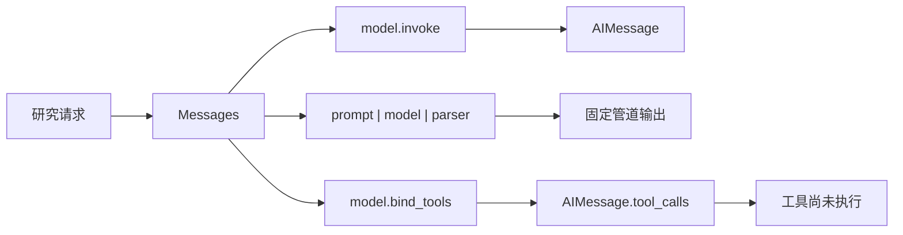

# 第 01 章：模型、消息与第一次可观察调用

<!-- lesson-contract:v2 -->

> **课程位置**：增强模型层第 1 章
> **锁定环境**：Python 3.12 / LangChain 1.3.x / LangGraph 1.2.x
> **本章工件**：可替换模型入口、Messages、Runnable 与 v2 stream envelope

## 1. 从一个真实限制开始：字符串回答无法支撑 Agent 工程

我们的长期任务是交付一份带引用、可恢复、可审批的研究报告。第一步还没有工具、Graph 和 Subagent，只有一次模型调用。

即使模型回答正确，程序仍要知道输入是什么消息、返回什么对象、谁决定下一步，以及长任务运行过程如何被观察。若这些边界不清楚，后续所有封装都会像魔法。

本章只建立四块地基：一次模型调用、固定 Runnable、工具调用意图和基础 stream envelope。完整工具循环留到第 04 章。



**图的文本替代**：同一请求可以进入单次模型调用、固定 Runnable 或绑定工具的模型。前两者由应用决定顺序；`bind_tools` 只允许模型表达工具意图，不执行函数。

## 2. 第一次调用：字符串进去，Message 对象出来

在线模型会受网络、凭证和随机输出影响。概念实验先使用 LangChain 公共 fake model，把注意力放在调用协议，而不是供应商质量。

<!-- lesson-lab:id=ch01-message-invoke layer=concept kind=baseline concept=model-message -->
### 调用一次模型并检查返回消息类型

**运行前先预测**：传入 HumanMessage 后，`invoke` 返回普通字符串、字典，还是 AIMessage？

```python sync=ch01-message-invoke
from langchain_core.language_models.fake_chat_models import GenericFakeChatModel
from langchain_core.messages import AIMessage, HumanMessage, SystemMessage


single_model = GenericFakeChatModel(
    messages=iter([AIMessage(content="checkpoint 保存图运行中的状态快照。")])
)
single_input = [
    SystemMessage(content="你是研究助手，只回答当前问题。"),
    HumanMessage(content="一句话解释 checkpoint。"),
]
single_reply = single_model.invoke(single_input)

print("input_types =", [type(message).__name__ for message in single_input])
print("output_type =", type(single_reply).__name__)
print("output_content =", single_reply.content)
```

**观察结果**：

```text output=ch01-message-invoke
input_types = ['SystemMessage', 'HumanMessage']
output_type = AIMessage
output_content = checkpoint 保存图运行中的状态快照。
```

**发生了什么**：Message 不只是文本。类型区分系统规则、用户输入、模型回答和后续工具结果；`content` 才是当前消息的正文。

这次 `invoke` 只调用一次模型。它不会自动执行工具、保存 Thread 或决定下一阶段。

**动手修改**：增加一条历史 AIMessage 和新的 HumanMessage。预测 fake model 是否会推理历史，再说明确定性 fixture 与真实模型能力的区别。
<!-- /lesson-lab -->

## 3. Runnable：当步骤必须由程序固定

有些任务不需要 Agent 决策，例如“套用 Prompt → 调用模型 → 取出字符串”。Runnable 的 `|` 把这些步骤组成固定数据流。

<!-- lesson-lab:id=ch01-runnable-pipeline layer=concept kind=contrast concept=runnable-pipeline -->
### 运行一个顺序完全固定的 Prompt 管道

**运行前先预测**：最终结果还会是 AIMessage，还是解析后的字符串？模型能否跳过 Prompt 或 parser？

```python sync=ch01-runnable-pipeline
from langchain_core.language_models.fake_chat_models import GenericFakeChatModel
from langchain_core.messages import AIMessage
from langchain_core.output_parsers import StrOutputParser
from langchain_core.prompts import ChatPromptTemplate


fixed_prompt = ChatPromptTemplate.from_messages(
    [
        ("system", "把概念解释压缩成一句话。"),
        ("user", "{question}"),
    ]
)
fixed_model = GenericFakeChatModel(
    messages=iter([AIMessage(content="Runnable 是由程序固定顺序的数据流。")])
)
fixed_chain = fixed_prompt | fixed_model | StrOutputParser()
fixed_result = fixed_chain.invoke({"question": "什么是 Runnable？"})
fixed_text = str(fixed_result)

print("pipeline = prompt -> model -> parser")
print("result_type =", type(fixed_text).__name__)
print("result =", fixed_text)
```

**观察结果**：

```text output=ch01-runnable-pipeline
pipeline = prompt -> model -> parser
result_type = str
result = Runnable 是由程序固定顺序的数据流。
```

**发生了什么**：输入必定经过 Prompt、模型和 parser。模型只负责其中一步，不能改变管道顺序。这种确定性正是 Runnable 的价值。

**动手修改**：去掉 `StrOutputParser()`。预测返回类型后运行，说明下游什么时候更适合保留完整 AIMessage。
<!-- /lesson-lab -->

## 4. 第一个容易误解的信号：模型“没有回答”

当模型绑定工具后，AIMessage 的有效输出可能不在 `content`，而在 `tool_calls`。只打印正文，会把一个正确工具意图误判成空回答。

<!-- lesson-lab:id=ch01-tool-intent-failure layer=concept kind=failure concept=tool-intent pair=tool-intent -->
### 只读取 content 并误判工具意图

**运行前先预测**：模型选择天气工具时，AIMessage 的 `content` 一定包含自然语言吗？工具函数会不会已经执行？

```python sync=ch01-tool-intent-failure
from langchain_core.language_models.fake_chat_models import GenericFakeChatModel
from langchain_core.messages import AIMessage
from langchain_core.tools import tool


class IntentFakeModel(GenericFakeChatModel):
    def bind_tools(self, tools, *, tool_choice=None, **kwargs):
        del tools, tool_choice, kwargs
        return self


weather_execution_count = 0


@tool
def lookup_weather(city: str) -> str:
    """查询指定城市的天气。"""
    global weather_execution_count
    weather_execution_count += 1
    return f"{city}：晴，25°C"


intent_model = IntentFakeModel(
    messages=iter(
        [
            AIMessage(
                content="",
                tool_calls=[
                    {
                        "name": "lookup_weather",
                        "args": {"city": "成都"},
                        "id": "weather-intent-1",
                        "type": "tool_call",
                    }
                ],
            )
        ]
    )
)
intent_message = intent_model.bind_tools([lookup_weather]).invoke(
    "成都今天天气如何？"
)

print("content =", repr(intent_message.content))
print("naive_has_answer =", bool(intent_message.content))
print("tool_execution_count =", weather_execution_count)
```

**观察结果**：

```text output=ch01-tool-intent-failure
content = ''
naive_has_answer = False
tool_execution_count = 0
```

**发生了什么**：正文为空不等于模型没有输出。当前 AIMessage 表达的是“希望调用工具”，而 Python 函数仍未执行。

`bind_tools` 只把工具名称、说明和参数 Schema 提供给模型。执行权限、参数校验、真正调用和结果配对仍由应用负责。

**动手修改**：把 docstring 改得含糊，再思考真实模型会怎样误选工具。不要手动调用函数，先修正消息读取方式。
<!-- /lesson-lab -->

<!-- lesson-lab:id=ch01-tool-intent-repair layer=concept kind=repair concept=tool-intent pair=tool-intent -->
### 正确读取 tool_calls 并确认工具尚未执行

**运行前先预测**：tool call 中哪一个字段把未来 ToolMessage 与这次请求关联起来？

```python sync=ch01-tool-intent-repair
from langchain_core.language_models.fake_chat_models import GenericFakeChatModel
from langchain_core.messages import AIMessage
from langchain_core.tools import tool


class InspectableIntentModel(GenericFakeChatModel):
    def bind_tools(self, tools, *, tool_choice=None, **kwargs):
        del tools, tool_choice, kwargs
        return self


inspected_execution_count = 0


@tool
def inspectable_weather(city: str) -> str:
    """查询指定城市的天气。"""
    global inspected_execution_count
    inspected_execution_count += 1
    return f"{city}：晴，25°C"


inspectable_model = InspectableIntentModel(
    messages=iter(
        [
            AIMessage(
                content="",
                tool_calls=[
                    {
                        "name": "inspectable_weather",
                        "args": {"city": "成都"},
                        "id": "weather-intent-2",
                        "type": "tool_call",
                    }
                ],
            )
        ]
    )
)
inspected_message = inspectable_model.bind_tools([inspectable_weather]).invoke(
    "成都今天天气如何？"
)
tool_intent = inspected_message.tool_calls[0]

print("tool_name =", tool_intent["name"])
print("tool_args =", tool_intent["args"])
print("tool_call_id =", tool_intent["id"])
print("tool_execution_count =", inspected_execution_count)
```

**观察结果**：

```text output=ch01-tool-intent-repair
tool_name = inspectable_weather
tool_args = {'city': '成都'}
tool_call_id = weather-intent-2
tool_execution_count = 0
```

**发生了什么**：`name` 和 `args` 描述意图，`id` 用于和未来的 `ToolMessage.tool_call_id` 配对。读取正确后，执行计数仍为零。

**动手修改**：手动执行工具并构造 ToolMessage 前，先列出应用必须完成的权限、参数、错误和配对职责。第 04 章会逐项实现。
<!-- /lesson-lab -->

## 5. `create_agent` 在哪里出现

标准工具循环需要反复完成：模型产生 tool call、应用执行工具、写入 ToolMessage、模型读取结果并继续回答。LangChain 的 `create_agent` 会建立这条循环。

```python
from langchain.agents import create_agent

agent = create_agent(model=model, tools=[lookup_weather])
result = agent.invoke({"messages": [("user", "查询成都天气并解释结果")]})
```

这段代码回答了“最终如何使用”，但本章不把它当成已掌握能力。第 04 章会先手动执行一次 tool call，再运行完整 `HumanMessage → AIMessage(tool_calls) → ToolMessage → AIMessage` 循环。

当前只借用一个没有工具的 `create_agent` 来产生 LangGraph v2 stream envelope。它不会发生工具执行，也不会抢先解决第 04 章的问题。

## 6. 第二个容易误解的信号：把 v2 event 当成旧二元组

长任务不能只等最终结果。v2 streaming 把事件统一成包含 `type`、`ns` 和 `data` 的 envelope；只有 messages 事件的 `data` 通常才是 `(chunk, metadata)`。

<!-- lesson-lab:id=ch01-stream-shape-failure layer=concept kind=failure concept=stream-envelope pair=v2-envelope -->
### 直接把整个 v2 event 解包成 chunk 和 metadata

**运行前先预测**：迭代一个包含三个 key 的 event 字典时，`chunk, metadata = event` 会得到什么？

```python sync=ch01-stream-shape-failure
from langchain.agents import create_agent
from langchain_core.language_models.fake_chat_models import GenericFakeChatModel
from langchain_core.messages import AIMessage


wrong_stream_agent = create_agent(
    GenericFakeChatModel(messages=iter([AIMessage(content="流式回答")])),
    tools=[],
)
wrong_events = list(
    wrong_stream_agent.stream(
        {"messages": [("user", "开始流式回答")]},
        stream_mode=["messages", "updates"],
        version="v2",
    )
)
first_event = wrong_events[0]
print("event_keys =", list(first_event))
try:
    chunk, metadata = first_event
except ValueError as error:
    assert "too many values" in str(error)
    print("ValueError: v2 event has three envelope fields")
else:
    raise AssertionError((chunk, metadata))
```

**观察结果**：

```text output=ch01-stream-shape-failure
event_keys = ['type', 'ns', 'data']
ValueError: v2 event has three envelope fields
```

**发生了什么**：Python 解包字典时迭代的是 key，而不是 event payload。旧式二元组假设在 v2 envelope 外层已经失效。

更隐蔽的错误是字典恰好只有两个 key，代码不报错，却得到两个字符串。消费者应先解析 envelope，再根据 `type` 缩小 `data` 的形状。

**动手修改**：只打印 `event["data"]`，比较 messages 与 updates 两类 payload。不要假设它们拥有相同结构。
<!-- /lesson-lab -->

<!-- lesson-lab:id=ch01-stream-envelope layer=concept kind=repair concept=stream-envelope pair=v2-envelope -->
### 先读取 type 和 ns，再解析对应 data

**运行前先预测**：没有子图时 `ns` 是什么？messages 与 updates 分别暴露模型文本还是节点 patch？

```python sync=ch01-stream-envelope
from langchain.agents import create_agent
from langchain_core.language_models.fake_chat_models import GenericFakeChatModel
from langchain_core.messages import AIMessage


correct_stream_agent = create_agent(
    GenericFakeChatModel(messages=iter([AIMessage(content="流式回答")])),
    tools=[],
)
correct_events = list(
    correct_stream_agent.stream(
        {"messages": [("user", "开始流式回答")]},
        stream_mode=["messages", "updates"],
        version="v2",
    )
)

for event in correct_events:
    if event["type"] == "messages":
        chunk, metadata = event["data"]
        print(
            "messages",
            {"ns": event["ns"], "node": metadata.get("langgraph_node"), "text": chunk.content},
        )
    elif event["type"] == "updates":
        print("updates", {"ns": event["ns"], "nodes": list(event["data"])})
```

**观察结果**：

```text output=ch01-stream-envelope
messages {'ns': (), 'node': 'model', 'text': '流式回答'}
updates {'ns': (), 'nodes': ['model']}
```

**发生了什么**：`type` 决定 data 的解释方式，`ns` 标识事件来自哪一层图。根图 namespace 为空；未来 Subagent 和子图会产生非空路径。

**动手修改**：只订阅 `messages`，再只订阅 `updates`。说明终端逐字输出和 UI 状态重建分别更依赖哪一种事件。
<!-- /lesson-lab -->

## 7. 现在再比较调用入口

| 入口 | 谁控制下一步 | 返回或观察对象 | 本章边界 |
|---|---|---|---|
| `model.invoke` | 调用方只发起一次 | AIMessage | 不执行工具、不持久化 |
| `prompt \| model \| parser` | 程序固定顺序 | parser 输出 | 不自主规划 |
| `model.bind_tools` | 模型可表达工具意图 | AIMessage.tool_calls | 函数仍未执行 |
| `create_agent` | 标准模型—工具循环 | Agent State / events | 第 04 章完整实践 |
| 显式 StateGraph | 应用声明业务拓扑 | State / updates / values | 第 07 章开始实践 |

选择入口时不要问“哪个更高级”，而要问谁应该拥有控制权。固定翻译管道不需要 Agent；开放式工具选择适合 `create_agent`；审批、并行和恢复等业务规则需要显式 Graph。

## 8. 工程迁移：Mini DeerFlow 只统一模型与事件入口

概念实验已经解释 Message 与 envelope。现在再导入 Mini DeerFlow，观察工程层如何锁定离线/真实模型 profile，并把上游 event 适配成稳定内部类型。

<!-- lesson-lab:id=ch01-mini-deerflow-entry layer=migration kind=contrast concept=model-message -->
### 对照模型工厂与 stream adapter

**运行前先预测**：离线 profile 是否仍返回 AIMessage？adapter 会不会丢掉 namespace 或未知 event type？

```python sync=ch01-mini-deerflow-entry
from mini_deerflow.config import ModelProfile, ModelSettings
from mini_deerflow.models import create_model
from mini_deerflow.streaming import normalize_stream_part


project_model = create_model(ModelSettings(profile=ModelProfile.OFFLINE))
project_reply = project_model.invoke("说明离线模型的用途")
project_event = normalize_stream_part(
    {
        "type": "updates",
        "ns": ("lead_agent",),
        "data": {"model": {"messages": []}},
    }
)

print("reply_type =", type(project_reply).__name__)
print("reply_content =", project_reply.content)
print("event_type =", project_event.type)
print("event_namespace =", project_event.namespace)
print("event_nodes =", list(project_event.data))
```

**观察结果**：

```text output=ch01-mini-deerflow-entry
reply_type = AIMessage
reply_content = 这是离线模型的确定性回答。
event_type = updates
event_namespace = ('lead_agent',)
event_nodes = ['model']
```

**发生了什么**：模型工厂把供应商选择收敛到配置层；stream adapter 保留 type、namespace 与 payload。业务代码不必各自解析框架原始字典。

真实模型用于 integration test，离线模型用于基础 CI。adapter 是内部 Graph event 与未来 Gateway SSE 之间的接缝，但它还不是产品事件协议。
<!-- /lesson-lab -->

## 9. 真实模型、网络与调试边界

真实 profile 可以通过 `init_chat_model` 接入 DeepSeek、OpenAI 或其他供应商。API Key、base URL 和代理属于运行配置，不应写进 Notebook、State 或提交记录。

网络错误时按层定位：先检查配置与最小 HTTP 连通性，再运行单次 `model.invoke`，最后才接入 Agent 和 streaming。供应商响应随机性不能成为基础课程唯一证据。

不要把 provider-specific `response_metadata` 当成稳定业务协议。业务需要的 model、usage、finish reason 应在应用边界显式归一化。

## 10. 练习：先判断控制权，再选择 API

### 练习 A：消息边界

构造 SystemMessage、两轮历史消息和当前 HumanMessage。让 fake model 返回固定 AIMessage，打印每种消息的类型与正文。

### 练习 B：入口选择

判断固定翻译、可选计算器、并行研究和强制审批分别适合单次 model、Runnable、`create_agent` 还是 StateGraph。每项说明控制权属于谁。

### 练习 C：事件 renderer

为 messages 和 updates 分别编写终端 renderer。renderer 可以决定样式，但不能修改 adapter 中的事件事实。

### 延迟回忆

合上讲义回答：AIMessage.content 为空时还要检查什么？`bind_tools` 与工具执行的责任差在哪里？v2 的 `(chunk, metadata)` 位于哪一层？为什么 `ns` 对 Subagent 很重要？

## 11. 下一刻系统：调用和观察已经稳定，结果仍只是自然语言

本章结束后，学习者能区分单次模型、固定 Runnable、tool intent 和标准 Agent 循环，并能按 v2 envelope 观察基础事件。

Mini DeerFlow 现在拥有可替换模型入口和稳定 stream adapter，但研究请求与任务计划仍是一段自然语言。下一章会先让脆弱字符串解析失败，再引入结构化输出业务契约。

运行本章验收：

```bash
TMPDIR="$PWD/.tmp" uv run --locked --group dev python \
  scripts/sync_lesson_notebooks.py tutorials/01_Getting_Started.md --execute
TMPDIR="$PWD/.tmp" uv run --locked --group dev pytest -q \
  tests/test_mini_deerflow_models.py tests/test_mini_deerflow_streaming.py \
  tests/test_notebook_sync.py
TMPDIR="$PWD/.tmp" uv run --locked --group dev python scripts/validate_tutorials.py
```

资料访问日期：2026-07-21。

- [LangChain Models](https://docs.langchain.com/oss/python/langchain/models)
- [LangChain Messages](https://docs.langchain.com/oss/python/langchain/messages)
- [LangChain Agents](https://docs.langchain.com/oss/python/langchain/agents)
- [LangGraph Streaming](https://docs.langchain.com/oss/python/langgraph/streaming)

继续阅读：[第 02 章：把自然语言计划变成业务契约](./02_Structured_Output.md)。
