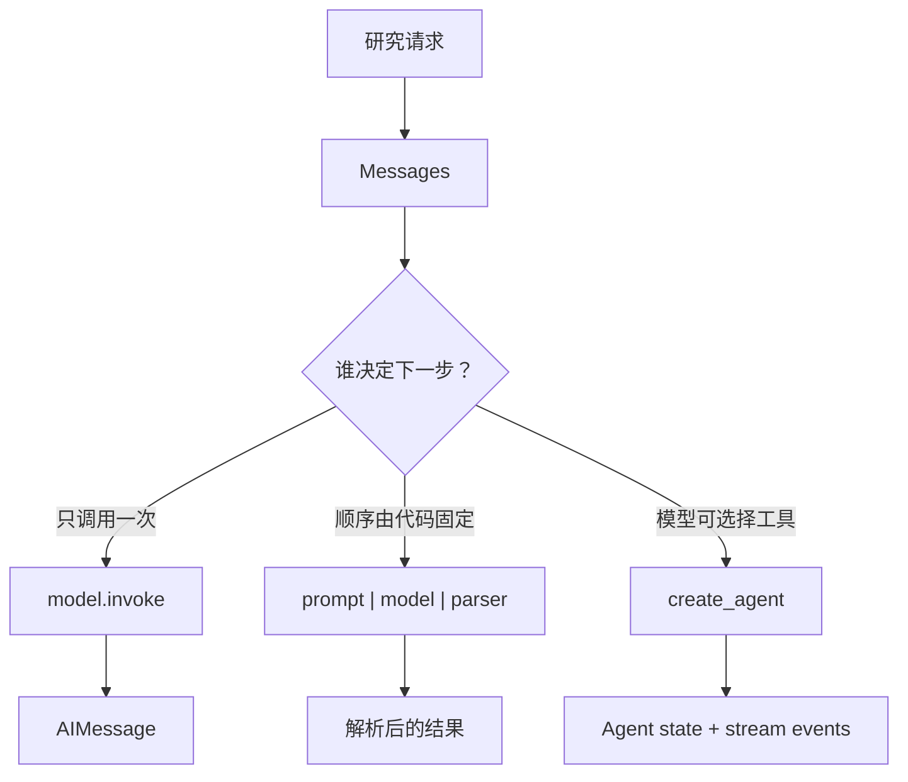
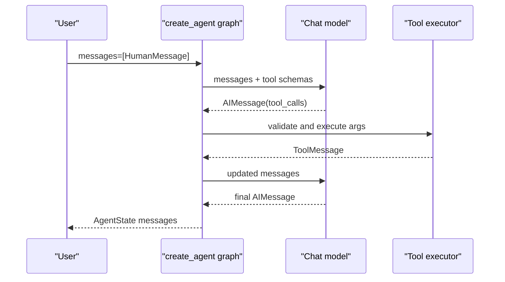

# 第 01 章：先看见一次 Agent 运行

> - 验证环境：Python 3.12 / LangChain 1.3.x / LangGraph 1.2.x
> - 校准日期：2026-07-13
> - API 状态：`invoke`、Runnable、`create_agent`、v2 streaming 均为 current
> - 本章工件：`mini_deerflow.models`、`mini_deerflow.streaming`

## 1. 系统快照：一个能回答，却无法接入产品的模型

序章留下了一项研究任务：调研 LangGraph 如何恢复长任务，并交付带引用、经过审批的中文报告。

我们先从最小系统开始。它把用户问题交给聊天模型，再打印一段回答。只要网络和模型都正常，这个程序看起来已经“能工作”。

问题出在下一步。界面想逐字显示结果，日志想知道当前事件来自模型还是工具，业务代码又想区分一次模型调用、固定管道和会自主调用工具的 Agent。此时“调用模型”这个说法已经不够精确。

本章先建立两个边界：调用入口决定谁拥有控制权；流式协议决定运行过程如何被程序观察。完成后，Mini DeerFlow 仍不会研究资料，但已经有稳定的模型入口和事件入口。

<!-- diagram:id=01-entry-boundaries -->


**图的文本替代**：研究请求先成为 Messages。单次模型调用、固定 Runnable 管道和 Agent 工具循环拥有不同的控制权，并返回不同层级的结果。

## 2. 先分清四个调用入口

### 2.1 `invoke`：只完成一次模型调用

`model.invoke(messages)` 的责任很窄：把当前输入交给模型并等待一个结果。分类、改写、摘要和抽取等单步任务通常从这里开始。

它不会执行工具，也不会替你保存任务进度。即使模型返回了 tool call，后续动作仍由调用方负责。

### 2.2 Runnable：顺序由程序确定

Runnable 的 `|` 运算符把 Prompt、模型和解析器组合成固定数据流：

```python
from langchain_core.output_parsers import StrOutputParser
from langchain_core.prompts import ChatPromptTemplate

prompt = ChatPromptTemplate.from_messages([
    ("system", "你是一个严谨的研究助手。"),
    ("user", "{question}"),
])

chain = prompt | llm | StrOutputParser()
answer = chain.invoke({"question": "什么是 durable execution？"})
```

这里没有“自主规划”。输入必定先经过 Prompt，再经过模型和解析器。可预测的顺序正是 Runnable 的价值。

### 2.3 `bind_tools`：模型可以表达工具意图

`bind_tools` 把工具名称、参数 Schema 和说明交给模型。模型因此可以返回 tool call，但它不会自动执行函数。

```python
from langchain.tools import tool

@tool
def search_knowledge(query: str) -> str:
    """在课程知识库中查找与研究问题有关的资料。"""
    return f"待检索：{query}"

model_with_tools = llm.bind_tools([search_knowledge])
message = model_with_tools.invoke("查找 LangGraph 持久化资料")
print(message.tool_calls)
```

工具 docstring 会进入模型看到的工具说明。含糊的说明会让模型误选工具，过宽的参数又会扩大能力边界。第 04 章会专门处理工具契约和执行责任。

### 2.4 `create_agent`：运行标准工具循环

当模型需要选择工具、读取结果并继续判断时，可以使用 `create_agent`：

```python
from langchain.agents import create_agent

agent = create_agent(model=llm, tools=[search_knowledge])
result = agent.invoke({
    "messages": [("user", "查找 LangGraph 持久化资料并概括要点")]
})
print(result["messages"][-1].content)
```

`create_agent` 来自 LangChain，返回的却是由 LangGraph runtime 支撑的 compiled graph。它负责标准的模型—工具—模型循环，但不负责替你定义审批、并行研究等外层业务拓扑。

| 入口 | 增加的能力 | 仍由应用负责 | 适合场景 |
| --- | --- | --- | --- |
| `model.invoke` | 一次模型调用 | 工具执行、流程、持久化 | 分类、改写、抽取 |
| `prompt \| model \| parser` | 固定数据流组合 | 自主决策与循环 | 可预测的 Chain |
| `model.bind_tools` | 生成 tool call | 参数授权与工具执行 | 观察或定制路由 |
| `create_agent` | 标准工具循环 | 业务拓扑与产品运行时 | 工具型 Agent |

下图要回答的问题是：`create_agent` 如何在模型和工具之间维护一次完整的消息循环？

<!-- diagram:id=01-agent-tool-loop -->


**图的文本替代**：用户消息进入 `create_agent` Graph；模型先返回包含工具请求的 `AIMessage`，工具执行节点写入匹配的 `ToolMessage`，模型读取更新后的消息历史，再生成最终 `AIMessage`。

### 2.5 这张图描述的是哪一种 Agent

它描述的是 `create_agent` 提供的标准工具循环，不代表所有 Agent 都必须采用同一套业务流程。它适合“模型决定是否调用工具，读取工具结果后继续回答”这类开放式任务。

调用方只需要向 `agent.invoke()` 提交初始消息。`create_agent` 生成的 Graph 负责调用模型、判断是否存在 `tool_calls`、执行工具，并把结果重新交给模型。

模型本身不会执行 Python 函数。它只返回“希望调用哪个工具、传入什么参数”；Graph 中的工具执行节点完成参数校验和函数调用，再把结果包装成 `ToolMessage`。

一次工具循环会留下四条关键消息：

1. `HumanMessage`：用户问题；
2. `AIMessage(tool_calls=...)`：模型提出工具调用请求；
3. `ToolMessage`：工具执行结果；
4. `AIMessage`：模型读取结果后给出的最终回答。

工具请求的 `id` 必须与结果的 `tool_call_id` 一致。这个关联让模型知道每条工具结果属于哪次调用，也是恢复执行、并行工具和 Subagent 协作能够正确拼接消息的基础。

下面使用项目内的确定性离线模型，完整运行一次 `create_agent` 工具循环。离线模型固定返回两次决策，因此实验关注的是消息协议，而不是模型措辞是否稳定。

```python sync=ch01-create-agent-tool-loop
from langchain.agents import create_agent
from langchain.tools import tool
from langchain_core.messages import AIMessage, HumanMessage, ToolMessage

from mini_deerflow.models import create_offline_model


@tool
def get_weather(city: str) -> str:
    """查询指定城市的天气。"""
    return f"{city}：晴，25°C"


scripted_model = create_offline_model(
    [
        AIMessage(
            content="",
            tool_calls=[
                {
                    "name": "get_weather",
                    "args": {"city": "成都"},
                    "id": "call-weather-1",
                    "type": "tool_call",
                }
            ],
        ),
        AIMessage(content="成都今天晴，25°C，适合出行。"),
    ]
)

weather_agent = create_agent(
    model=scripted_model,
    tools=[get_weather],
)
weather_result = weather_agent.invoke(
    {"messages": [("user", "成都今天天气如何？")]}
)

weather_messages = weather_result["messages"]
assert [type(message) for message in weather_messages] == [
    HumanMessage,
    AIMessage,
    ToolMessage,
    AIMessage,
]
assert weather_messages[1].tool_calls[0]["id"] == "call-weather-1"
assert weather_messages[2].tool_call_id == "call-weather-1"

for message in weather_messages:
    print(type(message).__name__, message.content)
```

运行后可以看到 `HumanMessage → AIMessage(tool_calls) → ToolMessage → AIMessage`。第二条 `AIMessage` 的正文可以为空，因为这一轮的有效输出是工具调用请求；第四条消息才是交给用户的最终回答。

`bind_tools` 只完成“让模型表达工具意图”这一步，工具执行仍由应用负责。`create_agent` 则把整个标准循环封装成 compiled graph。如果流程还包含固定审批、动态并行或跨进程恢复，应在外层继续设计显式 `StateGraph`。

## 3. 建立可替换的模型与消息入口

### 3.1 用统一工厂初始化真实模型

`init_chat_model` 把供应商差异收敛到配置层。下面的 DeepSeek profile 用于真实集成实验：

```python
import os
from dotenv import load_dotenv
from langchain.chat_models import init_chat_model

load_dotenv()

llm = init_chat_model(
    model="deepseek-chat",
    model_provider="deepseek",
    base_url="https://api.deepseek.com",
    api_key=os.getenv("DEEPSEEK_API_KEY"),
    streaming=True,
)
```

供应商 profile 证明网络、凭证和模型能力可用。它不适合作为基础测试，因为响应措辞、延迟和可用性都不由项目控制。

### 3.2 Messages 是后续状态的共同语言

字符串适合最小调用，研究 Agent 则需要区分系统规则、历史对话和当前请求：

```python
def prepare_inputs(user_query: str, chat_history: list | None = None):
    return {
        "messages": [
            ("system", "你负责交付可核验的研究报告。"),
            *(chat_history or []),
            ("user", user_query),
        ]
    }
```

工具结果、摘要和恢复后的对话最终都会回到消息协议。消息又只是 Graph State 的一部分；身份、数据库连接和跨线程偏好将在第 05 章拆到各自边界。

### 3.3 离线模型验证应用契约

Mini DeerFlow 通过模型工厂选择真实 profile 或确定性离线 profile。下面的实验不测试自然语言质量，只证明业务代码依赖的调用协议稳定。

```python sync=ch01-offline-model
from mini_deerflow.config import ModelProfile, ModelSettings
from mini_deerflow.models import create_model

model = create_model(ModelSettings(profile=ModelProfile.OFFLINE))
reply = model.invoke("请用一句话说明离线模型的用途。")
assert reply.content == "这是离线模型的确定性回答。"
reply.content
```

真实模型进入 integration test；离线模型进入基础 CI。把两者分开后，供应商故障不会伪装成应用逻辑故障，应用回归也不会被随机措辞掩盖。

## 4. 让运行过程可以被观察

一次 `invoke` 只能在结束后返回结果。研究任务持续数分钟时，界面还需要看到模型 token、工具结果、节点更新和子图事件。

LangGraph v2 streaming 使用统一 envelope：

```text
{
  "type": "updates | messages | custom | ...",
  "ns": ["subgraph", ...],
  "data": "由 type 决定的 payload"
}
```

`type` 说明事件种类，`ns` 标识子图命名空间，`data` 才是真正 payload。只有 `type == "messages"` 时，`data` 才通常是 `(message_chunk, metadata)`。

真实 Agent 可以这样消费消息流：

```python
async for event in agent.astream(
    input_dict,
    stream_mode="messages",
    version="v2",
):
    if event["type"] != "messages":
        continue
    chunk, metadata = event["data"]
    if metadata.get("langgraph_node") == "model" and chunk.content:
        print(chunk.content, end="", flush=True)
```

Mini DeerFlow 不让 UI、Notebook 和 Gateway 各自解析上游字典，而是在 `mini_deerflow.streaming` 设置 adapter：

```python sync=ch01-stream-envelope
from mini_deerflow.streaming import normalize_stream_part

raw_part = {
    "type": "updates",
    "ns": ("lead_agent",),
    "data": {"model": {"messages": []}},
}
event = normalize_stream_part(raw_part)
assert event.type == "updates"
assert event.namespace == ("lead_agent",)
assert event.data == {"model": {"messages": []}}
event
```

这个 adapter 会成为内部 Graph 事件与后续 SSE 产品事件之间的接缝。上游协议变化集中在这里，业务状态不直接依赖供应商或框架的原始响应字典。

## 5. 故障实验：把 v2 事件当成二元组

旧示例常直接解包 stream item：

```text
async for chunk, metadata in graph.astream(..., version="v2"):
    print(chunk.content)
```

在 v2 中，循环拿到的是包含 `type`、`ns`、`data` 的字典。Python 会迭代字典的 key，常见结果是 `ValueError: too many values to unpack`。

更隐蔽的风险是字典恰好只有两个 key，代码没有报错，却把两个字符串当成 chunk 和 metadata。边界 adapter 应主动拒绝旧形状：

```python sync=ch01-stream-failure
from mini_deerflow.streaming import normalize_stream_part

try:
    normalize_stream_part(("chunk", {"langgraph_node": "model"}))
except ValueError as error:
    stream_shape_error = error
else:
    raise AssertionError("旧 tuple 流式形状必须被拒绝")

assert "v2" in str(stream_shape_error)
```

根因不是异步语法，而是消费者依赖了旧版或特定 stream mode 的形状。修复时先解析 envelope，再按 `event.type` 缩小 payload 类型。

## 6. 调试顺序与工程边界

### 6.1 模型连不上时先分层定位

出现 `SSL_ERROR_SYSCALL`、`Connection error` 或超时时，先检查 `.env`、API Key、base URL 和代理，再运行最小连通性探针：

```python
import requests

try:
    response = requests.get("https://api.deepseek.com", timeout=5)
    print(response.status_code)
except Exception as error:
    print(f"连接失败：{error}")
```

连通性探针只能证明网络路径，不证明模型凭证和请求参数正确。下一步应运行最小 `model.invoke`，最后才接入 Agent 和 streaming。

### 6.2 本章边界

- 不把 provider-specific `response_metadata` 当成稳定业务字段。
- 需要一次性结果时使用 `invoke`；需要长任务反馈时使用 streaming。
- adapter 保留未知事件，业务层再决定如何展示或忽略。
- 离线模型不证明 Prompt 质量、模型能力和线上延迟。
- `create_agent` 提供标准工具循环，不替代显式业务 Graph。

消息、v1/v2 和各类 stream mode 的完整返回矩阵见[附录 A5](../APPENDIX.md#a5-stream-mode-与-v1v2-返回形状)。

## 7. 本章交付：系统已经可观察，但结果仍不可消费

### 动手练习

1. 把 `raw_part["type"]` 改成 `custom`，确认 normalizer 保留未知类型。
2. 判断固定翻译管道、可选计算器和强制审批分别适合 model、Runnable、Agent 还是显式 Graph。
3. 为 `StreamEvent` 编写终端 renderer，确保 ANSI 样式没有进入 normalizer。

打开 [01_Getting_Started.ipynb](./01_Getting_Started.ipynb)，依次运行真实模型最小调用、离线模型契约、Agent 工具循环和 v2 事件实验。

### 自动验收

```bash
uv run --locked pytest -q \
  tests/test_mini_deerflow_models.py \
  tests/test_mini_deerflow_streaming.py
uv run --locked python scripts/validate_tutorials.py
```

### 系统快照

Mini DeerFlow 现在拥有 `ModelSettings`、`create_model()`、消息入口、`StreamEvent` 和 `normalize_stream_part()`。它可以替换模型 profile，也能稳定观察运行事件。

但模型返回的仍是一段自然语言。下一章会把研究请求和任务计划变成 Pydantic 对象，让 Graph、数据库和后续工具不再靠字符串猜测语义。

延迟回忆：`bind_tools` 与 `create_agent` 的执行责任差在哪里？v2 的 `(message, metadata)` 位于哪一层？为什么 `ns` 对未来 Subagent 很重要？

继续阅读：[第 02 章：把自然语言计划变成业务契约](./02_Structured_Output.md)。

参考资料（访问日期：2026-07-13）：

- [LangChain Models](https://docs.langchain.com/oss/python/langchain/models)
- [LangChain Agents](https://docs.langchain.com/oss/python/langchain/agents)
- [LangGraph Streaming](https://docs.langchain.com/oss/python/langgraph/streaming)
