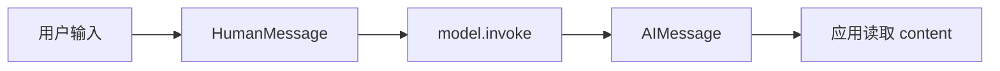

# 第 01 章：第一次调用大模型，程序拿到的是什么

<!-- lesson-contract:v2 -->

> **课程位置**：增强模型层第 1 章
> **锁定环境**：Python 3.12 / LangChain 1.3.x / LangGraph 1.2.x
> **本章工件**：真实模型入口、Message 输入与 AIMessage 返回值；Runnable、工具意图与 v2 stream 作为工程深入

> [!NOTE]
> **本章只解决一个问题**：第一次调用模型时，程序传入什么，又应该怎样读取返回值。
>
> **当前系统**：第 00 章已经分清模型调用、Chain、Agent 与 LangGraph。
>
> **遇到的问题**：很多示例只打印回答正文，读者看不出 LangChain 实际传递的是 Message 对象。
>
> **本章目标**：完成一次真实调用，认清 `HumanMessage → model.invoke → AIMessage`。
>
> **暂时不讲**：Runnable、工具意图、`create_agent` 和 v2 stream 都放在后半篇“工程深入”，第一次阅读可以跳过。
>
> **学完以后**：你能替换模型、构造消息输入，并从返回的 AIMessage 中读取正文。
>
> **预计时间**：初学者主线 15 分钟；工程深入再增加 25～35 分钟。

## 1. 先别做 Agent，先看返回值

长期目标是一份带引用、可恢复、可审批的研究报告。现在先把这个目标放远一点。初学者主线没有工具、Graph 和 Subagent，只有一次模型调用。

第一次阅读只检查三个最普通的问题：输入是什么，输出是什么，为什么返回值不是普通字符串。连这三件事都说不清，后面的 Agent 封装只会像魔法。

完成第 2 节后，可以直接进入第 02 章。第 3～9 节保留 Runnable、工具调用意图和 v2 stream 等工程实验，等需要这些协议时再回来。



**图的文本替代**：用户输入先成为 HumanMessage，模型调用返回 AIMessage，应用再读取其中的 content。

## 2. 模型返回的是 Message

### 真实开发写法

真实项目先初始化一个模型，再调用 `invoke`。下面示例需要配置对应供应商的 API Key，因此不进入离线测试。

```python
from langchain.chat_models import init_chat_model


model = init_chat_model("openai:gpt-4.1-mini")
response = model.invoke("一句话解释什么是 Agent")

print(type(response).__name__)
print(response.content)
```

输入可以先写成字符串，LangChain 会把它转换成用户消息。返回值是 `AIMessage`，正文放在 `content` 中；模型名称、Token 用量等供应商信息通常位于 `response_metadata` 或 `usage_metadata`。

### 确定性测试写法

在线模型会受到网络、凭证和随机输出影响。下面改用 LangChain 自带的 Fake Model。它不会调用外部大模型，只按脚本返回固定 AIMessage，用来稳定观察消息协议；它不能证明真实模型会正确理解问题。

<!-- lesson-lab:id=ch01-message-invoke layer=concept kind=baseline concept=model-message -->
### 调用一次模型并检查返回消息类型

**运行前先预测**：传入 HumanMessage 后，`invoke` 返回普通字符串、字典，还是 AIMessage？

```python sync=ch01-message-invoke
from langchain_core.language_models.fake_chat_models import GenericFakeChatModel
from langchain_core.messages import AIMessage, HumanMessage, SystemMessage


single_model = GenericFakeChatModel(
    messages=iter([AIMessage(content="checkpoint 保存图运行中的状态快照。")])
)
single_input = [
    SystemMessage(content="你是研究助手，只回答当前问题。"),
    HumanMessage(content="一句话解释 checkpoint。"),
]
single_reply = single_model.invoke(single_input)

print("input_types =", [type(message).__name__ for message in single_input])
print("output_type =", type(single_reply).__name__)
print("output_content =", single_reply.content)
```

**观察结果**：

```text output=ch01-message-invoke
input_types = ['SystemMessage', 'HumanMessage']
output_type = AIMessage
output_content = checkpoint 保存图运行中的状态快照。
```

**发生了什么**：返回值是 `AIMessage`，正文放在 `content` 里。消息类型还会区分系统规则、用户输入和工具结果。后面的 Agent 循环正是靠这些类型维持顺序。

这次 `invoke` 到此为止。它不会执行工具，不会保存 Thread，也不会替我们决定下一步。

**动手修改**：增加一条历史 AIMessage 和新的 HumanMessage。预测 fake model 是否会推理历史，再说明确定性 fixture 与真实模型能力的区别。
<!-- /lesson-lab -->

到这里，初学者主线已经完成。你应该能回答：`invoke` 收到什么，返回什么，正文放在哪里。下面进入协议与工程深入；第一次阅读可以直接跳到[第 02 章](./02_Structured_Output.md)。

## 工程深入：固定管道、工具意图与流式事件

后面的实验不再回答“怎样第一次调用模型”，而是比较不同入口由谁控制下一步，并观察 Agent 的 v2 stream 协议。它们仍然是工程所需证据，但不是理解 Message 的前置。

## 3. 步骤固定时，用 Runnable

“套用 Prompt → 调用模型 → 取出字符串”没有任何开放式决策。这样的步骤适合写成 Runnable，让数据按程序规定的顺序流动。

<!-- lesson-lab:id=ch01-runnable-pipeline layer=concept kind=contrast concept=runnable-pipeline -->
### 运行一个顺序完全固定的 Prompt 管道

**运行前先预测**：最终结果还会是 AIMessage，还是解析后的字符串？模型能否跳过 Prompt 或 parser？

```python sync=ch01-runnable-pipeline
from langchain_core.language_models.fake_chat_models import GenericFakeChatModel
from langchain_core.messages import AIMessage
from langchain_core.output_parsers import StrOutputParser
from langchain_core.prompts import ChatPromptTemplate


fixed_prompt = ChatPromptTemplate.from_messages(
    [
        ("system", "把概念解释压缩成一句话。"),
        ("user", "{question}"),
    ]
)
fixed_model = GenericFakeChatModel(
    messages=iter([AIMessage(content="Runnable 是由程序固定顺序的数据流。")])
)
fixed_chain = fixed_prompt | fixed_model | StrOutputParser()
fixed_result = fixed_chain.invoke({"question": "什么是 Runnable？"})
fixed_text = str(fixed_result)

print("pipeline = prompt -> model -> parser")
print("result_type =", type(fixed_text).__name__)
print("result =", fixed_text)
```

**观察结果**：

```text output=ch01-runnable-pipeline
pipeline = prompt -> model -> parser
result_type = str
result = Runnable 是由程序固定顺序的数据流。
```

**发生了什么**：输入依次经过 Prompt、模型和 parser，最后得到字符串。模型只负责中间一步，不能跳过前后环节。Runnable 的价值就在这个固定顺序。

**动手修改**：去掉 `StrOutputParser()`。预测返回类型后运行，说明下游什么时候更适合保留完整 AIMessage。
<!-- /lesson-lab -->

## 4. `content` 为空，模型也可能已经做出决定

给模型绑定工具后，它可能不再直接回答，而是请求调用某个函数。这时 `content` 可以是空字符串，真正的输出在 `tool_calls`。

<!-- lesson-lab:id=ch01-tool-intent-failure layer=concept kind=failure concept=tool-intent pair=tool-intent -->
### 只读取 content 并误判工具意图

**运行前先预测**：模型选择天气工具时，AIMessage 的 `content` 一定包含自然语言吗？工具函数会不会已经执行？

```python sync=ch01-tool-intent-failure
from langchain_core.language_models.fake_chat_models import GenericFakeChatModel
from langchain_core.messages import AIMessage
from langchain_core.tools import tool


class IntentFakeModel(GenericFakeChatModel):
    def bind_tools(self, tools, *, tool_choice=None, **kwargs):
        del tools, tool_choice, kwargs
        return self


weather_execution_count = 0


@tool
def lookup_weather(city: str) -> str:
    """查询指定城市的天气。"""
    global weather_execution_count
    weather_execution_count += 1
    return f"{city}：晴，25°C"


intent_model = IntentFakeModel(
    messages=iter(
        [
            AIMessage(
                content="",
                tool_calls=[
                    {
                        "name": "lookup_weather",
                        "args": {"city": "成都"},
                        "id": "weather-intent-1",
                        "type": "tool_call",
                    }
                ],
            )
        ]
    )
)
intent_message = intent_model.bind_tools([lookup_weather]).invoke(
    "成都今天天气如何？"
)

print("content =", repr(intent_message.content))
print("naive_has_answer =", bool(intent_message.content))
print("tool_execution_count =", weather_execution_count)
```

**观察结果**：

```text output=ch01-tool-intent-failure
content = ''
naive_has_answer = False
tool_execution_count = 0
```

**发生了什么**：模型已经选择了 `lookup_weather`，但 Python 函数一次也没运行。`tool_calls` 表达请求，不代表应用已经批准并执行。

`bind_tools` 只把名称、说明和参数 Schema 交给模型。权限、参数校验、函数调用和结果配对，仍是应用的责任。

**动手修改**：把 docstring 改得含糊，再思考真实模型会怎样误选工具。不要手动调用函数，先修正消息读取方式。
<!-- /lesson-lab -->

<!-- lesson-lab:id=ch01-tool-intent-repair layer=concept kind=repair concept=tool-intent pair=tool-intent -->
### 正确读取 tool_calls 并确认工具尚未执行

**运行前先预测**：tool call 中哪一个字段把未来 ToolMessage 与这次请求关联起来？

```python sync=ch01-tool-intent-repair
from langchain_core.language_models.fake_chat_models import GenericFakeChatModel
from langchain_core.messages import AIMessage
from langchain_core.tools import tool


class InspectableIntentModel(GenericFakeChatModel):
    def bind_tools(self, tools, *, tool_choice=None, **kwargs):
        del tools, tool_choice, kwargs
        return self


inspected_execution_count = 0


@tool
def inspectable_weather(city: str) -> str:
    """查询指定城市的天气。"""
    global inspected_execution_count
    inspected_execution_count += 1
    return f"{city}：晴，25°C"


inspectable_model = InspectableIntentModel(
    messages=iter(
        [
            AIMessage(
                content="",
                tool_calls=[
                    {
                        "name": "inspectable_weather",
                        "args": {"city": "成都"},
                        "id": "weather-intent-2",
                        "type": "tool_call",
                    }
                ],
            )
        ]
    )
)
inspected_message = inspectable_model.bind_tools([inspectable_weather]).invoke(
    "成都今天天气如何？"
)
tool_intent = inspected_message.tool_calls[0]

print("tool_name =", tool_intent["name"])
print("tool_args =", tool_intent["args"])
print("tool_call_id =", tool_intent["id"])
print("tool_execution_count =", inspected_execution_count)
```

**观察结果**：

```text output=ch01-tool-intent-repair
tool_name = inspectable_weather
tool_args = {'city': '成都'}
tool_call_id = weather-intent-2
tool_execution_count = 0
```

**发生了什么**：`name` 和 `args` 说明要调用什么，`id` 留给未来的 `ToolMessage` 配对。我们已经正确读出请求，执行计数仍然是零。

**动手修改**：手动执行工具并构造 ToolMessage 前，先列出应用必须完成的权限、参数、错误和配对职责。第 04 章会逐项实现。
<!-- /lesson-lab -->

## 5. 先看一眼 `create_agent`

完整工具循环要重复四步：模型请求工具，应用执行函数，结果写成 `ToolMessage`，模型再读取消息继续回答。LangChain 用 `create_agent` 封装了这条循环。

```python
from langchain.agents import create_agent

agent = create_agent(model=model, tools=[lookup_weather])
result = agent.invoke({"messages": [("user", "查询成都天气并解释结果")]})
```

现在只看它的最终用法，不急着把封装当成理解。第 04 章会先手动完成一次 tool call，再对照完整的 `HumanMessage → AIMessage(tool_calls) → ToolMessage → AIMessage`。

下面暂时创建一个没有工具的 Agent，只为了观察 LangGraph v2 stream。工具执行仍留在第 04 章。

## 6. v2 stream 的外层是事件信封

长任务不能等到最后才输出。v2 streaming 会连续产生事件，每个事件都有 `type`、`ns` 和 `data`。常见的 `(chunk, metadata)` 位于 messages 事件的 `data`，不在最外层。

<!-- lesson-lab:id=ch01-stream-shape-failure layer=concept kind=failure concept=stream-envelope pair=v2-envelope -->
### 直接把整个 v2 event 解包成 chunk 和 metadata

**运行前先预测**：迭代一个包含三个 key 的 event 字典时，`chunk, metadata = event` 会得到什么？

```python sync=ch01-stream-shape-failure
from langchain.agents import create_agent
from langchain_core.language_models.fake_chat_models import GenericFakeChatModel
from langchain_core.messages import AIMessage


wrong_stream_agent = create_agent(
    GenericFakeChatModel(messages=iter([AIMessage(content="流式回答")])),
    tools=[],
)
wrong_events = list(
    wrong_stream_agent.stream(
        {"messages": [("user", "开始流式回答")]},
        stream_mode=["messages", "updates"],
        version="v2",
    )
)
first_event = wrong_events[0]
print("event_keys =", list(first_event))
try:
    chunk, metadata = first_event
except ValueError as error:
    assert "too many values" in str(error)
    print("ValueError: v2 event has three envelope fields")
else:
    raise AssertionError((chunk, metadata))
```

**观察结果**：

```text output=ch01-stream-shape-failure
event_keys = ['type', 'ns', 'data']
ValueError: v2 event has three envelope fields
```

**发生了什么**：Python 解包字典时得到的是 key。v2 最外层已经是事件对象，旧的二元组写法用错了层级。

如果字典恰好只有两个 key，代码甚至不会报错，只会悄悄得到两个字符串。可靠的消费者要先读 `type`，再决定怎样解释 `data`。

**动手修改**：只打印 `event["data"]`，比较 messages 与 updates 两类 payload。不要假设它们拥有相同结构。
<!-- /lesson-lab -->

<!-- lesson-lab:id=ch01-stream-envelope layer=concept kind=repair concept=stream-envelope pair=v2-envelope -->
### 先读取 type 和 ns，再解析对应 data

**运行前先预测**：没有子图时 `ns` 是什么？messages 与 updates 分别暴露模型文本还是节点 patch？

```python sync=ch01-stream-envelope
from langchain.agents import create_agent
from langchain_core.language_models.fake_chat_models import GenericFakeChatModel
from langchain_core.messages import AIMessage


correct_stream_agent = create_agent(
    GenericFakeChatModel(messages=iter([AIMessage(content="流式回答")])),
    tools=[],
)
correct_events = list(
    correct_stream_agent.stream(
        {"messages": [("user", "开始流式回答")]},
        stream_mode=["messages", "updates"],
        version="v2",
    )
)

for event in correct_events:
    if event["type"] == "messages":
        chunk, metadata = event["data"]
        print(
            "messages",
            {"ns": event["ns"], "node": metadata.get("langgraph_node"), "text": chunk.content},
        )
    elif event["type"] == "updates":
        print("updates", {"ns": event["ns"], "nodes": list(event["data"])})
```

**观察结果**：

```text output=ch01-stream-envelope
messages {'ns': (), 'node': 'model', 'text': '流式回答'}
updates {'ns': (), 'nodes': ['model']}
```

**发生了什么**：`type` 告诉我们怎样读取 `data`，`ns` 说明事件来自哪一层图。根图的 namespace 为空；以后遇到子图和 Subagent，这里会出现路径。

**动手修改**：只订阅 `messages`，再只订阅 `updates`。说明终端逐字输出和 UI 状态重建分别更依赖哪一种事件。
<!-- /lesson-lab -->

## 7. 把五种入口放到一起

| 入口 | 谁控制下一步 | 返回或观察对象 | 本章边界 |
|---|---|---|---|
| `model.invoke` | 调用方只发起一次 | AIMessage | 不执行工具、不持久化 |
| `prompt \| model \| parser` | 程序固定顺序 | parser 输出 | 不自主规划 |
| `model.bind_tools` | 模型可表达工具意图 | AIMessage.tool_calls | 函数仍未执行 |
| `create_agent` | 标准模型—工具循环 | Agent State / events | 第 04 章完整实践 |
| 显式 StateGraph | 应用声明业务拓扑 | State / updates / values | 第 07 章开始实践 |

入口没有高低之分，差别在控制权。固定翻译由程序控制，用 Runnable 就够了；开放式工具选择交给 `create_agent`；审批、并行和恢复属于业务规则，需要显式 Graph。

## 8. Mini DeerFlow 在这里增加了什么

到目前为止，我们只使用了框架原生对象。Mini DeerFlow 在外面增加两层薄封装：模型工厂选择离线或真实 profile，stream adapter 把上游事件转成应用内部的稳定类型。

<!-- lesson-lab:id=ch01-mini-deerflow-entry layer=migration kind=contrast concept=model-message -->
### 对照模型工厂与 stream adapter

**运行前先预测**：离线 profile 是否仍返回 AIMessage？adapter 会不会丢掉 namespace 或未知 event type？

```python sync=ch01-mini-deerflow-entry
from mini_deerflow.config import ModelProfile, ModelSettings
from mini_deerflow.models import create_model
from mini_deerflow.streaming import normalize_stream_part


project_model = create_model(ModelSettings(profile=ModelProfile.OFFLINE))
project_reply = project_model.invoke("说明离线模型的用途")
project_event = normalize_stream_part(
    {
        "type": "updates",
        "ns": ("lead_agent",),
        "data": {"model": {"messages": []}},
    }
)

print("reply_type =", type(project_reply).__name__)
print("reply_content =", project_reply.content)
print("event_type =", project_event.type)
print("event_namespace =", project_event.namespace)
print("event_nodes =", list(project_event.data))
```

**观察结果**：

```text output=ch01-mini-deerflow-entry
reply_type = AIMessage
reply_content = 这是离线模型的确定性回答。
event_type = updates
event_namespace = ('lead_agent',)
event_nodes = ['model']
```

**发生了什么**：供应商选择进入配置层，stream adapter 保留 type、namespace 和 payload。调用方不再各写一套事件解析代码。

真实模型用于 integration test，离线模型用于基础 CI。这个 adapter 以后会连接 Gateway SSE，但此时还没有产品级 Run 和 Event 协议。
<!-- /lesson-lab -->

## 9. 接入真实模型时，先缩小故障范围

真实 profile 可以通过 `init_chat_model` 接入 DeepSeek、OpenAI 或其他供应商。API Key、base URL 和代理属于运行配置，不应写进 Notebook、State 或提交记录。

遇到网络错误时，先检查配置和最小 HTTP 连通性，再运行一次 `model.invoke`。单次调用正常后，才接入 Agent 和 streaming。否则，五层调用栈会把一个简单的凭证问题藏起来。

供应商特有的 `response_metadata` 也不适合直接进入业务协议。真正需要长期依赖的 model、usage 和 finish reason，应在应用边界统一格式。

## 10. 练习：控制权应该交给谁

### 练习 A：消息边界

构造 SystemMessage、两轮历史消息和当前 HumanMessage。让 fake model 返回固定 AIMessage，打印每种消息的类型与正文。

### 练习 B：入口选择

判断固定翻译、可选计算器、并行研究和强制审批分别适合单次 model、Runnable、`create_agent` 还是 StateGraph。每项说明控制权属于谁。

### 练习 C：事件 renderer

为 messages 和 updates 分别编写终端 renderer。renderer 可以决定样式，但不能修改 adapter 中的事件事实。

### 延迟回忆

合上讲义回答：AIMessage.content 为空时还要检查什么？`bind_tools` 与工具执行的责任差在哪里？v2 的 `(chunk, metadata)` 位于哪一层？为什么 `ns` 对 Subagent 很重要？

## 11. 我们还不能把结果交给程序

现在，我们已经能区分单次模型、固定 Runnable、工具意图和 Agent 循环，也能正确读取 v2 事件。

问题是，研究计划仍是一段自然语言。人能看懂，程序却无法可靠地路由、保存或校验。第 02 章会先让字符串解析真正失败，再把计划变成业务对象。

运行本章验收：

```bash
TMPDIR="$PWD/.tmp" uv run --locked --group dev python \
  scripts/sync_lesson_notebooks.py tutorials/01_Getting_Started.md --execute
TMPDIR="$PWD/.tmp" uv run --locked --group dev pytest -q \
  tests/test_mini_deerflow_models.py tests/test_mini_deerflow_streaming.py \
  tests/test_notebook_sync.py
TMPDIR="$PWD/.tmp" uv run --locked --group dev python scripts/validate_tutorials.py
```

资料访问日期：2026-07-21。

- [LangChain Models](https://docs.langchain.com/oss/python/langchain/models)
- [LangChain Messages](https://docs.langchain.com/oss/python/langchain/messages)
- [LangChain Agents](https://docs.langchain.com/oss/python/langchain/agents)
- [LangGraph Streaming](https://docs.langchain.com/oss/python/langgraph/streaming)

继续阅读：[第 02 章：把自然语言计划变成业务契约](./02_Structured_Output.md)。
