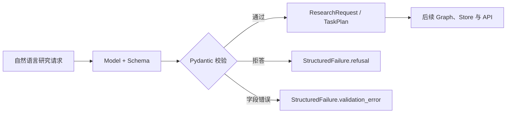

# 第 02 章：把自然语言计划变成业务契约

> - 验证环境：Python 3.12 / Pydantic 2.12.x / LangChain 1.3.x
> - 校准日期：2026-07-13
> - API 状态：模型层 `with_structured_output` 与 Agent `response_format` 均为 current
> - 本章工件：`mini_deerflow.schemas`

## 1. 系统快照：回答可以显示，却无法驱动下一步

第 01 章已经让 Mini DeerFlow 稳定调用模型并消费 v2 事件。我们现在把序章中的研究请求交给它：

> 调研 LangGraph 如何恢复长任务，给出一份带来源的中文说明。

模型很可能返回“先查资料，再整理机制，最后撰写报告”。人能理解这句话，程序却无法可靠回答：共有几个步骤？哪个步骤依赖检索？最多允许多少来源？报告应该保存到哪里？

如果路由、持久化和评测都靠正则或标题文本猜测，措辞稍变，整个流程就会断裂。本章要把请求、计划、Artifact 和失败结果变成显式业务对象。

<!-- diagram:id=02-structured-output-validation -->


**图的文本替代**：模型生成的候选结构先经过 Pydantic；成功结果和失败结果都有稳定形状，后续模块只依赖这些契约。

## 2. Schema 位于模型与业务代码之间

### 2.1 从字符串进入对象世界

`with_structured_output` 发生在模型调用层。它把 Schema 绑定到模型，再把模型响应解析成 Python 对象；这一步没有创建工具循环，也没有开始 Graph 编排。

```python
from pydantic import BaseModel, Field

class UserProfile(BaseModel):
    name: str = Field(description="用户全名")
    age: int = Field(ge=0, description="用户年龄")
    interests: list[str] = Field(
        default_factory=list,
        description="用户明确提到的兴趣",
    )

structured_model = llm.with_structured_output(UserProfile)
profile = structured_model.invoke(
    "我叫张三，今年 25 岁，喜欢游泳和篮球。"
)
print(type(profile), profile.interests)
```

`Field(description=...)` 同时服务模型和维护者。字段名、类型和描述共同定义语义；描述含糊时，即使 JSON 语法完全正确，业务含义仍可能出错。

### 2.2 嵌套对象表达真实关系

真实业务很少只有一层字段。嵌套 Schema 可以在一次结构化调用中描述对象关系：

```python
class DeliveryAddress(BaseModel):
    province: str = Field(description="省份，不含省字后缀")
    city: str = Field(description="城市，不含市字后缀")
    detail: str = Field(description="详细地址")

class OrderReceipt(BaseModel):
    customer_name: str = Field(description="客户姓名")
    shipping_address: DeliveryAddress

order_model = llm.with_structured_output(OrderReceipt)
receipt = order_model.invoke(
    "我是老李，请发到四川成都武侯区科华北路 66 号。"
)
print(receipt.shipping_address.city)
```

这里不是先调用一次模型抽姓名，再调用一次抽地址。模型在同一次响应中填充整棵对象树，Pydantic 随后验证层级与类型。

### 2.3 Schema 只能证明形状，不能证明事实

`age: int` 可以拒绝无法解析的文本，却无法证明年龄真实；`steps: list[PlanStep]` 可以证明计划有步骤，却无法证明计划覆盖了研究问题。

因此本书把验证分成两层：Pydantic 负责确定性结构，进入基础 CI；事实正确性、计划质量和拒答行为进入真实模型 integration test 或数据集评测。

## 3. 同样是 Pydantic，三类契约拥有不同生命周期

| Schema 所在位置 | 约束对象 | 典型 API | 失败时机 |
| --- | --- | --- | --- |
| 模型结构化输出 | 一次模型回答 | `model.with_structured_output(...)` | 模型解析阶段 |
| 工具参数 | 一次 tool call 的输入 | `@tool(args_schema=...)` | 工具执行前 |
| Agent 最终响应 | 完整工具循环的结果 | `create_agent(..., response_format=...)` | Agent 结束前 |

把三者混用，会让错误在错误的层级重试。例如，研究计划是模型输出契约；检索查询是工具参数契约；最终报告元数据才是完整 Agent 的响应契约。

下面的离线模型返回标准 tool call，再由 LangChain structured output parser 转换成 `ResearchRequest`。这条路径真实经过模型结构化输出协议，并非直接实例化 Pydantic 后声称“模型已结构化”。

```python sync=ch02-model-structured-output
from langchain_core.messages import AIMessage

from mini_deerflow.models import create_offline_model
from mini_deerflow.schemas import ResearchRequest

structured_model = create_offline_model(
    [
        AIMessage(
            content="",
            tool_calls=[
                {
                    "name": "ResearchRequest",
                    "args": {
                        "question": "LangGraph 如何恢复长任务？",
                        "deliverable": "带引用的中文说明",
                        "max_sources": 4,
                    },
                    "id": "structured-1",
                    "type": "tool_call",
                }
            ],
        )
    ]
).with_structured_output(ResearchRequest)
research_request = structured_model.invoke("把用户需求整理成研究请求")
assert isinstance(research_request, ResearchRequest)
assert research_request.max_sources == 4
research_request
```

## 4. 把契约装进 Mini DeerFlow

本章业务 Schema 的唯一事实源位于 `mini_deerflow.schemas`。讲义和 Notebook 只构造输入与断言结果，避免教程里的示例类和实际项目类各自演化。

### 4.1 用 `TaskPlan` 承接研究请求

`TaskPlan` 保存目标和步骤依赖。显式 `schema_version` 为 checkpoint、评测数据集和外部 API 中的历史数据提供迁移入口。

```python sync=ch02-task-plan
from mini_deerflow.schemas import PlanStep, TaskPlan

plan = TaskPlan(
    objective="解释 LangGraph durable execution",
    steps=[
        PlanStep(id="research", instruction="检索官方持久化资料"),
        PlanStep(
            id="write",
            instruction="生成带引用的中文说明",
            depends_on=["research"],
        ),
    ],
)
assert plan.schema_version == 1
assert plan.steps[1].depends_on == ["research"]
plan.model_dump()
```

`depends_on` 目前只是数据。第 07–08 章才会把它编译成顺序、条件或并行 edge。本章只保证后续控制流拿到的计划形状明确。

### 4.2 Artifact 路径同时是安全边界

Artifact 会在模块间传递并最终落入 Sandbox。若领域对象接受绝对路径或 `../`，文件工具接入后就可能逃出工作区。

```python sync=ch02-artifact-boundary
from pydantic import ValidationError

from mini_deerflow.schemas import ArtifactRef

try:
    ArtifactRef(path="../secret.txt", media_type="text/plain")
except ValidationError as error:
    artifact_error = error
else:
    raise AssertionError("越界路径必须被拒绝")

assert "工作区内的相对路径" in str(artifact_error)
```

这项校验只拒绝明显非法的数据，不等于完整 Sandbox。符号链接、路径解析、provider 生命周期和容器隔离将在 [Sandbox 与扩展专题](../mini_deerflow/SANDBOX_EXTENSIONS.md)继续处理。

### 4.3 失败也要有稳定形状

如果成功时返回对象，超时时抛字符串，拒答时又返回空字典，Lead Agent、API 和评测器就必须各写一套猜测逻辑。

`SubagentResult` 让失败保留任务类型、状态、原因和 Artifact 列表：

```python sync=ch02-subagent-failure
from mini_deerflow.schemas import SubagentResult

failed = SubagentResult.failed("research", "timeout")
assert failed.status == "failed"
assert failed.error == "timeout"
assert failed.artifacts == []
failed.model_dump()
```

用户拒答与字段验证失败同样需要可穷尽处理：

```python sync=ch02-outcome-triad
from mini_deerflow.schemas import StructuredFailure, validate_research_request

refusal = StructuredFailure.refused("请求涉及未授权数据")
invalid = validate_research_request(
    {"question": "", "deliverable": "报告", "max_sources": 0}
)
assert refusal.kind == "refusal"
assert isinstance(invalid, StructuredFailure)
assert invalid.kind == "validation_error"
```

## 5. 故障实验：看似友好的默认值推迟了错误

下面的 Schema 会把缺失目标静默补成“继续处理”：

```text
class UnsafePlan(BaseModel):
    objective: str = "继续处理"
    steps: list[str] = []
```

调用者得到一个合法对象，却无法知道目标来自模型还是默认值。Graph 可能继续执行，直到工具准备产生副作用时才发现任务含糊。

业务必填字段应尽早失败；集合默认值应使用 `default_factory`；拒答、超时和不可修复错误应成为显式结果。重试还要设置上限并记录原始 validation error。

对应回归位于 `tests/test_mini_deerflow_schemas.py`。测试只断言稳定业务边界，不绑定模型的自然语言措辞。

## 6. 策略选择、调试与适用边界

### 6.1 Provider-native 与 Tool Strategy

支持原生 JSON Schema 的模型可以在服务端约束输出；其他模型通常通过 tool calling strategy 返回结构。两种策略最终都要经过业务验证，也都无法保证事实正确。

开放式长文、头脑风暴和创意草稿不必强制套入庞大 Schema。常见做法是先生成文本，再单独抽取少量控制字段与报告元数据。

结构化对象通常要等完整 payload 收齐后再落成。不要把 token streaming 与“半个 Pydantic 对象”混在一起；需要进度反馈时，可以流式发送阶段事件，在结束处验证完整对象。

### 6.2 结果仍是文本时

按下面顺序检查：

1. 调用对象是否为 `structured_model`，而不是原始 `llm`；
2. Schema 是否真的传给 `with_structured_output`；
3. 当前模型和 profile 是否支持选择的结构化策略；
4. `type(result)` 是否为预期 BaseModel；
5. validation error 是否被上层捕获后错误地降级成字符串。

### 6.3 字段类型摇摆时

先检查字段描述和输入证据，再缩小 Schema。把十几个模糊字段一次交给模型，往往比增加重试次数更难定位问题。

## 7. 本章交付：计划可验证，但事实仍无来源

### 动手练习

1. 给 `PlanStep` 增加 `expected_output` 必填字段，并先为旧 payload 编写迁移函数。
2. 判断“天气工具城市参数”“研究计划”“最终报告元数据”分别属于哪类 Schema。
3. 为 `SubagentResult` 增加 `cancelled` 状态，并写穷尽分支测试说明它与 `failed` 的差别。

打开 [02_Structured_Output.ipynb](./02_Structured_Output.ipynb)，依次运行真实模型抽取、离线结构化协议、计划、路径和失败结果实验。

### 自动验收

```bash
uv run --locked pytest -q tests/test_mini_deerflow_schemas.py
uv run --locked python scripts/validate_tutorials.py
```

### 系统快照

Mini DeerFlow 现在拥有 `ResearchRequest`、`TaskPlan`、`PlanStep`、`ArtifactRef`、`SubagentResult` 和 `StructuredFailure`。计划可以被验证、持久化和迁移。

但一个结构完全正确的计划仍可能建立在过时知识上。下一章会建立幂等知识索引、带来源的检索结果和检索质量评测，让研究步骤有证据可用。

延迟回忆：Schema 合法为什么不等于业务结果正确？`schema_version` 为什么应存在于持久化数据，而不只写在 README？

继续阅读：[第 03 章：为研究任务接入可核验知识](./03_RAG_2.0.md)。

参考资料（访问日期：2026-07-13）：

- [LangChain Structured Output](https://docs.langchain.com/oss/python/langchain/structured-output)
- [Pydantic Models](https://docs.pydantic.dev/latest/concepts/models/)
- [Pydantic Validators](https://docs.pydantic.dev/latest/concepts/validators/)
