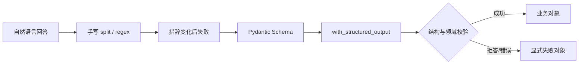

# 第 02 章：“目标”换个写法，计划解析器就崩了

<!-- lesson-contract:v2 -->

> **课程位置**：增强模型层第 2 章
> **锁定环境**：Python 3.12 / Pydantic 2.12.x / LangChain 1.3.x
> **本章工件**：ResearchRequest、TaskPlan、ArtifactRef 与结构化失败边界

> [!NOTE]
> **本章只解决一个问题**：怎样把不稳定的自然语言计划变成程序可以验证的 Python 对象。
>
> **当前系统**：研究助手能调用模型并读取 AIMessage。
>
> **遇到的问题**：模型把“目标”换成“研究主题”，手写字符串解析就失去字段。
>
> **本章目标**：用 Pydantic 和 `with_structured_output` 建立可验证的请求、计划与失败结果。
>
> **暂时不讲**：事实是否真实、资料怎样检索，以及 Graph 如何保存这些对象。
>
> **学完以后**：你能区分候选模型输出、Schema 校验和业务对象。
>
> **预计时间**：25～35 分钟。

## 1. 研究助手给出计划，程序却找不到字段

第 01 章留下了一个能调用模型、读取 Message 和观察 stream envelope 的研究助手。现在交给它第一项真实任务：调研 LangGraph 如何恢复长任务，并生成带来源的中文说明。

模型回答：“先查资料，再整理机制，最后撰写报告。”这对人已经够清楚，程序却只能从标题、冒号和换行里猜目标、步骤、来源预算与交付位置。

先让这套猜法失败，再引入 Pydantic。这里使用 Schema 的理由很直接：模型输出进入 Graph、数据库或 API 前，必须先成为可验证的业务对象。



**图的文本替代**：自然语言经过脆弱解析后失败。模型给出的候选结构再经过 Pydantic 与领域校验，最终把成功和失败都交给下游稳定处理。

## 2. “目标”改成“研究主题”后发生了什么

下面的解析器只认“目标：”和“步骤：”。只要模型换一种同义表达，业务含义没变，解析器就会失去目标字段。提示词无法把这种表面格式变成可靠协议。

<!-- lesson-lab:id=ch02-string-parse-failure layer=concept kind=failure concept=research-request pair=research-request -->
### 把“目标”改成“研究主题”

**运行前先预测**：模型把“目标”改写成“研究主题”后，依赖固定标签的解析器会怎样？

```python sync=ch02-string-parse-failure
def parse_labeled_plan(text: str) -> dict[str, object]:
    fields = {}
    for line in text.splitlines():
        key, value = line.split("：", 1)
        fields[key] = value
    return {
        "objective": fields["目标"],
        "steps": [item.strip() for item in fields["步骤"].split("→")],
    }


model_text = (
    "研究主题：解释 LangGraph durable execution\n"
    "步骤：检索官方资料 → 整理机制 → 生成报告"
)
print("model_text =", model_text.replace("\n", " | "))
try:
    parse_labeled_plan(model_text)
except KeyError as error:
    assert error.args == ("目标",)
    print("KeyError: required label '目标' is missing")
else:
    raise AssertionError("固定标签变化后应暴露解析失败")
```

**观察结果**：

```text output=ch02-string-parse-failure
model_text = 研究主题：解释 LangGraph durable execution | 步骤：检索官方资料 → 整理机制 → 生成报告
KeyError: required label '目标' is missing
```

**发生了什么**：回答语义没有变化，字符串协议已经断裂。继续增加正则别名，只是在解析器里追赶模型可能采用的每一种说法。

我更关心下游真正依赖什么：哪些字段必填，类型是什么，哪些值不能进入系统。这些要求应该写进显式 Schema，而不是分散在 Prompt 和 `split` 代码里。

**动手修改**：让步骤分隔符从 `→` 变成编号列表。记录需要继续增加多少分支，直到你愿意停止修补字符串格式。
<!-- /lesson-lab -->

## 3. `max_sources=0` 应该在哪一层失败

先把候选数据交给 Pydantic。它负责类型转换，并在业务代码运行前拒绝缺失字段、错误类型和越界值。它不判断研究事实，也不调用模型。

<!-- lesson-lab:id=ch02-pydantic-request layer=concept kind=repair concept=research-request pair=research-request -->
### 让 ResearchRequest 拒绝越界来源数

**运行前先预测**：`max_sources="4"` 会被转换成整数吗？值为 0 时会在哪里失败？

```python sync=ch02-pydantic-request
from pydantic import BaseModel, Field, ValidationError


class ResearchRequest(BaseModel):
    question: str = Field(min_length=1)
    deliverable: str = Field(min_length=1)
    max_sources: int = Field(ge=1, le=8)


request_candidate = {
    "question": "LangGraph 如何恢复长任务？",
    "deliverable": "带引用的中文说明",
    "max_sources": "4",
}
validated_request = ResearchRequest.model_validate(request_candidate)
print("request =", validated_request.model_dump())
print("max_sources_type =", type(validated_request.max_sources).__name__)

try:
    ResearchRequest.model_validate({**request_candidate, "max_sources": 0})
except ValidationError as error:
    first_error = error.errors()[0]
    print("invalid_field =", first_error["loc"])
    print("error_type =", first_error["type"])
else:
    raise AssertionError("来源预算必须大于零")
```

**观察结果**：

```text output=ch02-pydantic-request
request = {'question': 'LangGraph 如何恢复长任务？', 'deliverable': '带引用的中文说明', 'max_sources': 4}
max_sources_type = int
invalid_field = ('max_sources',)
error_type = greater_than_equal
```

**发生了什么**：`"4"` 被确定性转换成整数，0 则在业务代码执行前被拒绝。调用方现在可以依赖字段名和错误位置，不必再解析异常文本。

这个结果只证明结构满足约束。问题是否真实、来源是否可信、计划是否足够好，还要由后续检索与评测回答。

**动手修改**：把 `max_sources` 改成无法转换的字符串，再比较错误类型。然后决定严格模式是否更符合你的 API 边界。
<!-- /lesson-lab -->

## 4. AIMessage 正文为空，为什么仍能得到对象

`model_validate` 只能证明 Schema 自己可用。接下来让 LangChain 返回结构化 tool call，再由 `with_structured_output` 转成同一个 Pydantic 对象。

<!-- fake-model-notice:v1 -->
> **确定性测试写法**：下面的 Fake Model 不会调用外部大模型，只按脚本返回一个结构化 tool call。它用于验证 `with_structured_output` 的解析协议，不能证明真实模型一定会生成正确字段。

<!-- lesson-lab:id=ch02-model-structured-output layer=concept kind=baseline concept=model-structured-output -->
### 从结构化 tool call 解析 ResearchRequest

**运行前先预测**：模型返回的 AIMessage 正文为空时，结构化调用结果仍能成为 Pydantic 对象吗？

```python sync=ch02-model-structured-output
from langchain_core.language_models.fake_chat_models import GenericFakeChatModel
from langchain_core.messages import AIMessage
from pydantic import BaseModel, Field


class ModelResearchRequest(BaseModel):
    question: str = Field(min_length=1)
    deliverable: str = Field(min_length=1)
    max_sources: int = Field(ge=1, le=8)


class StructuredFakeModel(GenericFakeChatModel):
    def bind_tools(self, tools, *, tool_choice=None, **kwargs):
        del tools, tool_choice, kwargs
        return self


raw_structured_model = StructuredFakeModel(
    messages=iter(
        [
            AIMessage(
                content="",
                tool_calls=[
                    {
                        "name": "ModelResearchRequest",
                        "args": {
                            "question": "LangGraph 如何恢复长任务？",
                            "deliverable": "带引用的中文说明",
                            "max_sources": 4,
                        },
                        "id": "structured-request-1",
                        "type": "tool_call",
                    }
                ],
            )
        ]
    )
)
structured_model = raw_structured_model.with_structured_output(
    ModelResearchRequest
)
model_request = structured_model.invoke("把用户需求整理成研究请求")

print("result_type =", type(model_request).__name__)
print("question =", model_request.question)
print("max_sources =", model_request.max_sources)
```

**观察结果**：

```text output=ch02-model-structured-output
result_type = ModelResearchRequest
question = LangGraph 如何恢复长任务？
max_sources = 4
```

**发生了什么**：模型先产生符合 Schema 的 tool call，LangChain 再把参数解析并验证为 Pydantic 对象。这里没有执行业务工具，也没有 Agent 循环。

Provider-native JSON Schema 与 tool strategy 只是两种候选结构生成方式。无论选哪一种，业务自己的 Pydantic 与领域校验都不能省略。

**动手修改**：让 tool call 缺少 `deliverable`。观察异常发生在结构化解析边界，而不是后续 Graph 节点。
<!-- /lesson-lab -->

## 5. 默认目标让错误一路跑到发布前

默认值适合真正可选的数据。目标显然不在此列。把缺失目标补成“继续处理”后，Graph 会拿到一个合法对象，却无法知道用户究竟要研究什么。

<!-- lesson-lab:id=ch02-default-objective-failure layer=concept kind=failure concept=task-plan pair=required-plan-fields -->
### 用“继续处理”掩盖缺失目标

**运行前先预测**：payload 只有 steps 时，Pydantic 会拒绝，还是生成一个看似完整的计划？

```python sync=ch02-default-objective-failure
from pydantic import BaseModel, Field


class UnsafePlan(BaseModel):
    objective: str = "继续处理"
    steps: list[str] = Field(default_factory=list)


unsafe_plan = UnsafePlan.model_validate(
    {"steps": ["检索官方资料", "生成报告"]}
)
print("plan_is_valid =", isinstance(unsafe_plan, UnsafePlan))
print("objective =", unsafe_plan.objective)
print("objective_was_in_payload =", "objective" in unsafe_plan.model_fields_set)
print("steps =", unsafe_plan.steps)
```

**观察结果**：

```text output=ch02-default-objective-failure
plan_is_valid = True
objective = 继续处理
objective_was_in_payload = False
steps = ['检索官方资料', '生成报告']
```

**发生了什么**：Schema 合法，目标却不是用户或模型提供的。错误被推迟到检索、写文件甚至发布阶段，调用方也无法区分真实目标和默认补值。

**动手修改**：给 `steps` 也设置一个看似合理的默认步骤。列出后续系统会在哪些位置误以为计划已经确认。
<!-- /lesson-lab -->

计划字段只保留下游确实需要的事实。这里先把 `depends_on` 当作数据校验；第 07–08 章再把它变成 Graph 的边与并行任务。

<!-- lesson-lab:id=ch02-task-plan-repair layer=concept kind=repair concept=task-plan pair=required-plan-fields -->
### 在计划执行前拒绝未知依赖

**运行前先预测**：依赖不存在的步骤 ID 时，错误应落在执行 Graph，还是计划进入系统之前？

```python sync=ch02-task-plan-repair
from pydantic import BaseModel, Field, ValidationError, model_validator


class PlanStep(BaseModel):
    id: str = Field(min_length=1)
    instruction: str = Field(min_length=1)
    depends_on: list[str] = Field(default_factory=list)


class TaskPlan(BaseModel):
    schema_version: int = 1
    objective: str = Field(min_length=1)
    steps: list[PlanStep] = Field(min_length=1)

    @model_validator(mode="after")
    def dependencies_exist(self):
        ids = {step.id for step in self.steps}
        missing = sorted(
            dependency
            for step in self.steps
            for dependency in step.depends_on
            if dependency not in ids
        )
        if missing:
            raise ValueError(f"unknown dependencies: {missing}")
        return self


task_plan = TaskPlan(
    objective="解释 LangGraph durable execution",
    steps=[
        PlanStep(id="research", instruction="检索官方资料"),
        PlanStep(
            id="write",
            instruction="生成带引用的中文说明",
            depends_on=["research"],
        ),
    ],
)
print("plan =", task_plan.model_dump())

try:
    TaskPlan(
        objective="错误计划",
        steps=[PlanStep(id="write", instruction="写报告", depends_on=["missing"])],
    )
except ValidationError as error:
    print("dependency_error =", error.errors()[0]["type"])
else:
    raise AssertionError("未知依赖必须在计划边界被拒绝")
```

**观察结果**：

```text output=ch02-task-plan-repair
plan = {'schema_version': 1, 'objective': '解释 LangGraph durable execution', 'steps': [{'id': 'research', 'instruction': '检索官方资料', 'depends_on': []}, {'id': 'write', 'instruction': '生成带引用的中文说明', 'depends_on': ['research']}]}
dependency_error = value_error
```

**发生了什么**：目标和步骤不再由默认值伪造，未知依赖也在计划进入执行层前被拒绝。`schema_version` 为 checkpoint、数据集和 API 的历史 payload 留下迁移入口。

**动手修改**：加入重复步骤 ID。先预测当前 validator 是否会发现，再补充唯一性规则，并说明循环依赖还需要什么检查。
<!-- /lesson-lab -->

## 6. `path: str` 接受了 `../secret.txt`

Artifact path 会从模型流经工具和 Graph，最终到达 Sandbox。若 Schema 只写 `path: str`，`../secret.txt` 在 Python 类型上完全合法。

<!-- lesson-lab:id=ch02-artifact-path-failure layer=concept kind=failure concept=artifact-contract pair=artifact-path -->
### 观察父目录路径通过类型校验

**运行前先预测**：只声明 `path: str` 时，Pydantic 会拒绝 `../secret.txt` 吗？

```python sync=ch02-artifact-path-failure
from pydantic import BaseModel


class UnsafeArtifact(BaseModel):
    path: str
    media_type: str


unsafe_artifact = UnsafeArtifact(
    path="../secret.txt",
    media_type="text/plain",
)
print("artifact_valid =", isinstance(unsafe_artifact, UnsafeArtifact))
print("accepted_path =", unsafe_artifact.path)
print("contains_parent_segment =", ".." in unsafe_artifact.path.split("/"))
```

**观察结果**：

```text output=ch02-artifact-path-failure
artifact_valid = True
accepted_path = ../secret.txt
contains_parent_segment = True
```

**发生了什么**：`str` 只约束 Python 类型，没有表达“工作区内相对路径”。文件工具若直接使用这个值，就可能越过预期目录。

**动手修改**：再尝试绝对路径和空路径。整理 Artifact path 的最小确定性规则，但不要声称它已经解决符号链接和容器隔离。
<!-- /lesson-lab -->

<!-- lesson-lab:id=ch02-artifact-path-repair layer=concept kind=repair concept=artifact-contract pair=artifact-path -->
### 在字段边界拒绝绝对路径和父目录

**运行前先预测**：合法相对路径是否原样保留？非法路径的错误位置会指向哪个字段？

```python sync=ch02-artifact-path-repair
from pathlib import PurePosixPath

from pydantic import BaseModel, Field, ValidationError, field_validator


class ArtifactRef(BaseModel):
    path: str = Field(min_length=1)
    media_type: str = Field(min_length=1)

    @field_validator("path")
    @classmethod
    def workspace_relative_path(cls, value: str) -> str:
        path = PurePosixPath(value)
        if path.is_absolute() or ".." in path.parts:
            raise ValueError("artifact path 必须是工作区内的相对路径")
        return value


valid_artifact = ArtifactRef(
    path="reports/answer.md",
    media_type="text/markdown",
)
print("valid_artifact =", valid_artifact.model_dump())

try:
    ArtifactRef(path="../secret.txt", media_type="text/plain")
except ValidationError as error:
    path_error = error.errors()[0]
    print("invalid_field =", path_error["loc"])
    print("error_type =", path_error["type"])
else:
    raise AssertionError("父目录路径必须被拒绝")
```

**观察结果**：

```text output=ch02-artifact-path-repair
valid_artifact = {'path': 'reports/answer.md', 'media_type': 'text/markdown'}
invalid_field = ('path',)
error_type = value_error
```

**发生了什么**：Schema 现在表达了工作区相对路径规则，错误也稳定落在 `path` 字段。这里仍没有完整 Sandbox。

符号链接解析、真实文件根目录、原子写入、provider 生命周期和 shell 隔离，都要等 Sandbox 专题用真实文件系统继续验证。

**动手修改**：测试 `reports//answer.md`、`.` 和 Windows 风格路径。决定是否规范化，并说明规范化必须发生在校验前还是之后。
<!-- /lesson-lab -->

## 7. 成功、拒答和字段错误需要稳定外形

结构化输出也会失败。成功返回对象、拒答返回 `None`、字段错误直接抛异常时，调用方必须同时猜返回值形状和控制流。

<!-- lesson-lab:id=ch02-outcome-shape-failure layer=concept kind=failure concept=structured-failure pair=outcome-shape -->
### 让调用方同时处理对象、None 和异常

**运行前先预测**：调用方要用多少种分支才能处理成功、拒答和无效字段？

```python sync=ch02-outcome-shape-failure
from pydantic import BaseModel, Field, ValidationError


class OutcomeRequest(BaseModel):
    question: str = Field(min_length=1)
    max_sources: int = Field(ge=1)


def inconsistent_parse(payload: dict[str, object]):
    if payload.get("refusal"):
        return None
    return OutcomeRequest.model_validate(payload)


success_value = inconsistent_parse(
    {"question": "解释 checkpoint", "max_sources": 3}
)
refusal_value = inconsistent_parse({"refusal": "未授权数据"})
try:
    inconsistent_parse({"question": "", "max_sources": 0})
except ValidationError:
    validation_channel = "exception"
else:
    validation_channel = "return-value"

print("success_channel =", type(success_value).__name__)
print("refusal_channel =", type(refusal_value).__name__)
print("validation_channel =", validation_channel)
print("caller_protocols =", 3)
```

**观察结果**：

```text output=ch02-outcome-shape-failure
success_channel = OutcomeRequest
refusal_channel = NoneType
validation_channel = exception
caller_protocols = 3
```

**发生了什么**：三类结果走了对象、`None` 和异常三条通道。Graph、API 与评测器各写一套分支后，很快会产生漂移。

**动手修改**：再加入超时字符串 `"timeout"`。统计调用方需要增加多少类型判断，并思考哪些异常仍应上抛。
<!-- /lesson-lab -->

<!-- lesson-lab:id=ch02-outcome-shape-repair layer=concept kind=repair concept=structured-failure pair=outcome-shape -->
### 用失败对象保留可穷尽的分支

**运行前先预测**：返回类型固定为 Request 或 StructuredFailure 后，调用方还能否区分拒答与字段错误？

```python sync=ch02-outcome-shape-repair
from typing import Literal

from pydantic import BaseModel, Field, ValidationError


class StableRequest(BaseModel):
    question: str = Field(min_length=1)
    max_sources: int = Field(ge=1)


class StructuredFailure(BaseModel):
    kind: Literal["refusal", "validation_error"]
    message: str
    fields: list[str] = Field(default_factory=list)


def stable_parse(payload: dict[str, object]) -> StableRequest | StructuredFailure:
    if reason := payload.get("refusal"):
        return StructuredFailure(kind="refusal", message=str(reason))
    try:
        return StableRequest.model_validate(payload)
    except ValidationError as error:
        fields = [str(item["loc"][0]) for item in error.errors()]
        return StructuredFailure(
            kind="validation_error",
            message="请求字段无效",
            fields=fields,
        )


stable_success = stable_parse({"question": "解释 checkpoint", "max_sources": 3})
stable_refusal = stable_parse({"refusal": "未授权数据"})
stable_invalid = stable_parse({"question": "", "max_sources": 0})

print("success_type =", type(stable_success).__name__)
print("refusal =", stable_refusal.model_dump())
print("validation =", stable_invalid.model_dump())
```

**观察结果**：

```text output=ch02-outcome-shape-repair
success_type = StableRequest
refusal = {'kind': 'refusal', 'message': '未授权数据', 'fields': []}
validation = {'kind': 'validation_error', 'message': '请求字段无效', 'fields': ['question', 'max_sources']}
```

**发生了什么**：调用方只处理成功对象或失败对象，`kind` 仍能穷尽拒答与校验错误。程序 bug、取消和系统错误继续上抛，不能伪装成 `StructuredFailure`。

**动手修改**：加入 `timeout` kind，并决定 retryable 是否属于失败对象。写出 API、Graph 和评测器各自消费哪些字段。
<!-- /lesson-lab -->

## 8. 三个 Schema 分别属于谁

前面的失败已经足够区分三种结构化边界。它们都能用 Pydantic 表达，但各自的所有者和失败时机不同。

<!-- lesson-lab:id=ch02-schema-lifetimes layer=concept kind=contrast concept=schema-lifetimes -->
### 按生命周期放置研究计划、query 和报告元数据

**运行前先预测**：研究计划、检索 query 和最终报告元数据应该使用同一个 Schema 吗？

```python sync=ch02-schema-lifetimes
schema_lifetimes = [
    {
        "boundary": "model_output",
        "example": "ResearchRequest / TaskPlan",
        "validated": "一次模型回答解析时",
    },
    {
        "boundary": "tool_args",
        "example": "SearchQuery",
        "validated": "工具执行之前",
    },
    {
        "boundary": "agent_response",
        "example": "ReportMetadata",
        "validated": "完整工具循环结束时",
    },
]

for item in schema_lifetimes:
    print(
        f"{item['boundary']}: {item['example']} -> {item['validated']}"
    )
```

**观察结果**：

```text output=ch02-schema-lifetimes
model_output: ResearchRequest / TaskPlan -> 一次模型回答解析时
tool_args: SearchQuery -> 工具执行之前
agent_response: ReportMetadata -> 完整工具循环结束时
```

**发生了什么**：研究计划属于模型输出契约，检索 query 属于工具参数契约，最终报告元数据属于 Agent 完整循环的响应契约。

混用三者会让错误在错误层级重试。第 04 章才实现工具参数与 Agent 循环；这里先把所有权差异固定成接口约束。

**动手修改**：为“用户上传文件路径”选择边界。说明它为什么还需要 Sandbox 规则，而不能只依赖工具 args Schema。
<!-- /lesson-lab -->

## 9. 把验证过的对象放进 Mini DeerFlow

请求、计划、Artifact 和失败对象都已在概念实验中经历过失败。现在再导入 Mini DeerFlow，检查项目类型是否保留这些边界，并补上版本、复用与持久化入口。

<!-- lesson-lab:id=ch02-mini-deerflow-schemas layer=migration kind=contrast concept=research-request -->
### 检查项目对象的序列化与路径拒绝

**运行前先预测**：TaskPlan 是否包含 schema version？非法 Artifact 是否仍在项目边界被拒绝？

```python sync=ch02-mini-deerflow-schemas
from pydantic import ValidationError

from mini_deerflow.schemas import (
    ArtifactRef,
    PlanStep,
    ResearchRequest,
    StructuredFailure,
    TaskPlan,
    validate_research_request,
)


project_request = ResearchRequest(
    question="LangGraph 如何恢复长任务？",
    deliverable="带引用的中文说明",
    max_sources=4,
)
project_plan = TaskPlan(
    objective="解释 LangGraph durable execution",
    steps=[
        PlanStep(id="research", instruction="检索官方资料"),
        PlanStep(id="write", instruction="写报告", depends_on=["research"]),
    ],
)
project_invalid = validate_research_request(
    {"question": "", "deliverable": "报告", "max_sources": 0}
)
try:
    ArtifactRef(path="../secret.txt", media_type="text/plain")
except ValidationError:
    artifact_rejected = True
else:
    artifact_rejected = False

print("request =", project_request.model_dump())
print("plan_schema_version =", project_plan.schema_version)
print("plan_dependencies =", project_plan.steps[1].depends_on)
print("invalid_kind =", project_invalid.kind)
print("artifact_rejected =", artifact_rejected)
print("failure_type =", isinstance(project_invalid, StructuredFailure))
```

**观察结果**：

```text output=ch02-mini-deerflow-schemas
request = {'question': 'LangGraph 如何恢复长任务？', 'deliverable': '带引用的中文说明', 'max_sources': 4}
plan_schema_version = 1
plan_dependencies = ['research']
invalid_kind = validation_error
artifact_rejected = True
failure_type = True
```

**发生了什么**：Mini DeerFlow 把请求、计划、Artifact 和失败类型作为公共协议复用。教程、Graph、API 与测试不再各自维护一份近似 Schema。

这里不提前解释 `SubagentResult`。第 11 章会先让委派真实失败，再把同一边界迁移到项目的 Subagent 输出协议。
<!-- /lesson-lab -->

| 概念实验 | Mini DeerFlow 增加的工程边界 |
|---|---|
| ResearchRequest | 字段描述、范围约束、跨模块复用 |
| TaskPlan / PlanStep | schema version、依赖字段、持久化迁移入口 |
| ArtifactRef | 工作区路径、媒体类型、Sandbox 接缝 |
| StructuredFailure | refusal / validation error 的穷尽协议 |

## 10. 字段都合法，事实仍可能错误

Schema 能证明字段存在、类型正确、范围合法。它无法证明来源真实，也无法证明计划覆盖了问题或报告结论正确。

事实正确性要靠检索来源、领域服务与评测数据集。计划质量要看轨迹和任务结果。拒答策略还需要权限与安全规则。

开放式长文和创意草稿不必塞进巨大 Schema。保留正文文本，只结构化控制字段、引用和报告元数据，通常更容易演进。

结构化对象通常要等完整 payload 收齐后再验证。长任务进度交给事件 streaming，别向下游暴露“半个 Pydantic 对象”。

## 11. 练习：把错误推回它所属的边界

### 练习 A：Schema migration

给 PlanStep 增加 `expected_output` 必填字段。先写旧 payload 到新版对象的迁移函数，再提高 schema version。

### 练习 B：领域规则

为 TaskPlan 增加步骤 ID 唯一和无循环依赖校验。分别制造重复 ID、未知依赖和循环依赖的稳定错误输出。

### 练习 C：失败协议

增加 timeout 与 cancelled。说明哪一个可重试，哪一个属于调用方控制流，以及哪些程序 bug 必须继续上抛。

### 延迟回忆

合上讲义回答：Schema 合法为何不等于事实正确？友好默认值为什么会推迟错误？模型输出、工具参数和 Agent response 分别在何时验证？

## 12. 计划可以消费，资料仍没有来源

现在，自然语言请求已经变成可验证的 `ResearchRequest`。任务计划有版本和依赖，Artifact 与失败也有稳定的业务形状。

唯一没有解决的限制是事实来源：结构完全正确的计划仍可能依赖过时知识。下一章从透明文档开始，让来源经过切分、检索和空召回，再进入 Mini DeerFlow 索引。

运行本章验收：

```bash
TMPDIR="$PWD/.tmp" uv run --locked --group dev python \
  scripts/sync_lesson_notebooks.py tutorials/02_Structured_Output.md --execute
TMPDIR="$PWD/.tmp" uv run --locked --group dev pytest -q \
  tests/test_mini_deerflow_schemas.py tests/test_notebook_sync.py
TMPDIR="$PWD/.tmp" uv run --locked --group dev python scripts/validate_tutorials.py
```

资料访问日期：2026-07-21。

- [LangChain Structured Output](https://docs.langchain.com/oss/python/langchain/structured-output)
- [Pydantic Models](https://docs.pydantic.dev/latest/concepts/models/)
- [Pydantic Validators](https://docs.pydantic.dev/latest/concepts/validators/)

继续阅读：[第 03 章：为研究任务接入可核验知识](./03_RAG_2.0.md)。
