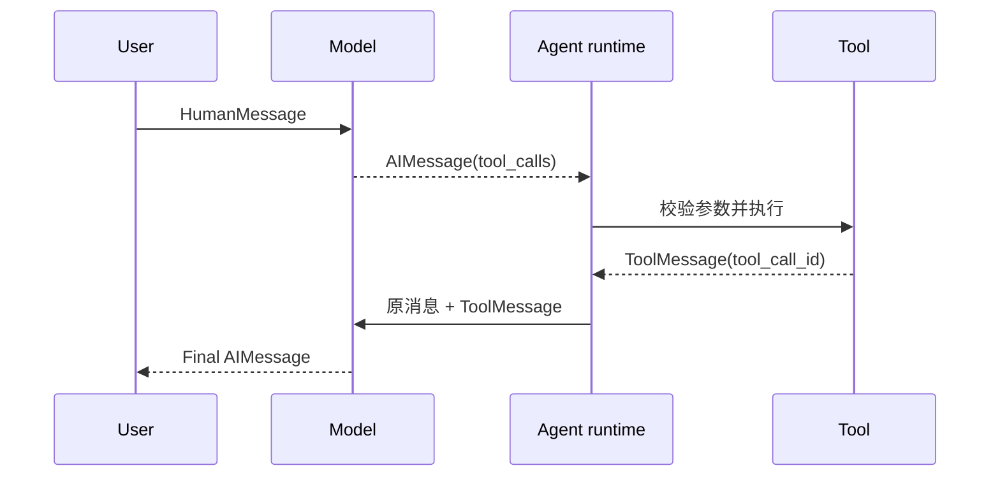

# 第 04 章：模型会调用工具之前，先把协议补完

<!-- lesson-contract:v2 -->

> **课程位置**：Agent 封装层第 1 章
> **锁定环境**：Python 3.12 / LangChain 1.3.x / LangGraph 1.2.x
> **本章工件**：Tool Schema、ToolMessage、`create_agent`、ToolRuntime 与 Mini DeerFlow Lead Agent

## 1. 检索管道为什么还不算 Agent

前三章已经把研究助手的输入输出收紧：消息可观察，请求能校验，检索结果保留 source。可它仍然只是一条固定管道。

第 03 章无论收到“查官方资料”还是“2 × 7 等于多少”，都会执行 `retrieve → model`。连算术题也先检索，说明动作仍由程序写死。

这一章只交给模型一小块行动权：从应用批准的工具中选一项，再填参数。注册工具、注入身份和校验参数仍由应用掌握。



**图的文本替代**：模型用 AIMessage 提出工具调用。Agent runtime 校验、执行，再用同一 call ID 生成 ToolMessage。只有这条结果进入消息历史，模型才能继续回答。

## 2. `limit=100` 为什么能穿过工具边界

先别急着绑定模型。Python 签名只说明 `limit` 是整数，它不知道业务最多允许三条。工具若接受 100，一次调用就会放大延迟、成本和 Context 污染。

<!-- lesson-lab:id=ch04-unbounded-tool-args-failure layer=concept kind=failure concept=tool-schema pair=bounded-tool-args -->
### 让模型可见 Schema 接受任意正负整数

**运行前先预测**：只声明 `limit: int` 时，生成的 JSON Schema 会包含 maximum 吗？传入 100 会不会被拒绝？

```python sync=ch04-unbounded-tool-args-failure
from langchain.tools import tool


@tool
def unsafe_search(query: str, limit: int = 1) -> str:
    """检索课程资料。"""

    return f"query={query};limit={limit}"


schema = unsafe_search.tool_call_schema.model_json_schema()
limit_schema = schema["properties"]["limit"]
result = unsafe_search.invoke({"query": "checkpoint", "limit": 100})

print("visible_fields =", sorted(schema["properties"]))
print("limit_type =", limit_schema["type"])
print("maximum_present =", "maximum" in limit_schema)
print("limit_100_result =", result)
```

**观察结果**：

```text output=ch04-unbounded-tool-args-failure
visible_fields = ['limit', 'query']
limit_type = integer
maximum_present = False
limit_100_result = query=checkpoint;limit=100
```

**发生了什么**：`@tool` 只推导出字段名和 Python 类型。`int` 证明 100 是整数，却没有表达“最多三条”，所以模型能填，工具也照常执行。

我不会把这条上限只写在 docstring 里。Docstring 是给模型的提示，参数边界必须进入 Schema，并在工具执行前确定性拒绝非法值。

**动手修改**：在 docstring 中写“最多 3 条”，但保持 Schema 不变。再次调用 100，解释自然语言提示为何不能替代边界校验。
<!-- /lesson-lab -->

<!-- lesson-lab:id=ch04-bounded-tool-schema-repair layer=concept kind=repair concept=tool-schema pair=bounded-tool-args -->
### 用 Pydantic args_schema 固化范围

**运行前先预测**：`ge=1, le=3` 会同时进入模型可见 JSON Schema 和运行时校验吗？

```python sync=ch04-bounded-tool-schema-repair
from langchain.tools import tool
from pydantic import BaseModel, Field, ValidationError


class SearchArgs(BaseModel):
    query: str = Field(min_length=1, description="需要检索的问题")
    limit: int = Field(default=1, ge=1, le=3, description="最多返回的证据数")


@tool(args_schema=SearchArgs)
def bounded_search(query: str, limit: int = 1) -> str:
    """检索课程资料并保留来源。"""

    return f"query={query};limit={limit}"


schema = bounded_search.tool_call_schema.model_json_schema()
limit_schema = schema["properties"]["limit"]
try:
    bounded_search.invoke({"query": "checkpoint", "limit": 100})
except ValidationError as error:
    error_type = error.errors()[0]["type"]
else:
    raise AssertionError("越界 limit 必须在工具执行前失败")

print("visible_fields =", sorted(schema["properties"]))
print("minimum =", limit_schema["minimum"])
print("maximum =", limit_schema["maximum"])
print("invalid_limit_error =", error_type)
```

**观察结果**：

```text output=ch04-bounded-tool-schema-repair
visible_fields = ['limit', 'query']
minimum = 1
maximum = 3
invalid_limit_error = less_than_equal
```

**发生了什么**：同一份 Schema 同时告诉模型字段约束，并在执行边界做确定性验证。字段 description 影响模型选择，`ge/le` 决定什么输入可以执行。

Schema 无法完成授权。即使参数形状合法，当前用户是否能检索某个知识域仍要由 Runtime Context 与 Middleware 判断。

**动手修改**：让 query 只包含空格。观察 `min_length=1` 为何仍会通过，再增加去空格后的领域校验。
<!-- /lesson-lab -->

## 3. `bind_tools` 只生成调用意图

第 01 章看过 `tool_calls`，这里要把它放回真实消息协议。先只调用绑定工具的模型，然后查执行日志；这能把“表达意图”和“执行动作”分开。

<!-- lesson-lab:id=ch04-bind-tools-intent layer=concept kind=baseline concept=tool-intent -->
### 绑定工具后只得到 AIMessage

**运行前先预测**：调用绑定工具的模型后，执行日志会增加一条记录吗？返回值是工具结果还是 AIMessage？

```python sync=ch04-bind-tools-intent
from typing import Any, Sequence

from langchain.tools import tool
from langchain_core.language_models.fake_chat_models import GenericFakeChatModel
from langchain_core.messages import AIMessage, HumanMessage
from langchain_core.tools import BaseTool


execution_log = []


@tool
def lookup_fact(query: str) -> str:
    """检索一条带来源事实。"""

    execution_log.append(query)
    return "checkpoint 需要 thread_id [official/persistence.md]"


class IntentFakeModel(GenericFakeChatModel):
    def bind_tools(
        self,
        tools: Sequence[dict[str, Any] | type | BaseTool | Any],
        *,
        tool_choice=None,
        **kwargs: Any,
    ):
        del tools, tool_choice, kwargs
        return self


model = IntentFakeModel(
    messages=iter(
        [
            AIMessage(
                content="",
                tool_calls=[
                    {
                        "name": "lookup_fact",
                        "args": {"query": "checkpoint thread_id"},
                        "id": "lookup-1",
                        "type": "tool_call",
                    }
                ],
            )
        ]
    )
)
bound_model = model.bind_tools([lookup_fact])
intent = bound_model.invoke([HumanMessage("如何恢复 checkpoint？")])

print("result_type =", type(intent).__name__)
print("tool_call_name =", intent.tool_calls[0]["name"])
print("tool_call_id =", intent.tool_calls[0]["id"])
print("execution_log =", execution_log)
```

**观察结果**：

```text output=ch04-bind-tools-intent
result_type = AIMessage
tool_call_name = lookup_fact
tool_call_id = lookup-1
execution_log = []
```

**发生了什么**：`bind_tools` 把工具 Schema 交给模型，使其能生成结构化 tool call。执行日志仍为空，因为没有任何组件负责 dispatch。

**动手修改**：把 tool call 名称改成不存在的工具。列出应用在执行前必须验证的三项事实：名称、参数与权限。
<!-- /lesson-lab -->

## 4. 函数执行了，消息历史为什么还是断的

手写路由器调用 Python 函数并不难。难点是把结果写回 `ToolMessage`；少了这步，历史里只剩一个未完成的 tool call，模型无法知道结果属于哪个 call ID。

<!-- lesson-lab:id=ch04-orphan-tool-result-failure layer=concept kind=failure concept=tool-message-protocol pair=tool-result-message -->
### 直接执行 args，留下孤立 tool call

**运行前先预测**：工具函数返回字符串后，如果消息列表仍只有 HumanMessage 与 AIMessage，模型能否从消息历史读取结果？

```python sync=ch04-orphan-tool-result-failure
from langchain.tools import tool
from langchain_core.messages import AIMessage, HumanMessage, ToolMessage


@tool
def search_once(query: str) -> str:
    """检索一条带来源事实。"""

    return "checkpoint 需要 thread_id [official/persistence.md]"


human = HumanMessage("如何恢复 checkpoint？")
intent = AIMessage(
    content="",
    tool_calls=[
        {
            "name": "search_once",
            "args": {"query": "checkpoint thread_id"},
            "id": "search-1",
            "type": "tool_call",
        }
    ],
)
messages = [human, intent]
raw_result = search_once.invoke(intent.tool_calls[0]["args"])

print("raw_result =", raw_result)
print("message_types =", [type(message).__name__ for message in messages])
print("tool_messages =", sum(isinstance(message, ToolMessage) for message in messages))
print("orphan_tool_call_id =", intent.tool_calls[0]["id"])
```

**观察结果**：

```text output=ch04-orphan-tool-result-failure
raw_result = checkpoint 需要 thread_id [official/persistence.md]
message_types = ['HumanMessage', 'AIMessage']
tool_messages = 0
orphan_tool_call_id = search-1
```

**发生了什么**：Python 局部变量拿到了结果，消息协议却不知道。把 `raw_result` 随便拼到下一条 HumanMessage，会丢失角色和 call ID，也无法处理并行工具调用。

**动手修改**：同时产生两个 tool call，只保留一个无标签结果字符串。尝试判断它属于哪个 call，并记录为什么位置顺序不是可靠身份。
<!-- /lesson-lab -->

<!-- lesson-lab:id=ch04-manual-tool-message-repair layer=concept kind=repair concept=tool-message-protocol pair=tool-result-message -->
### 构造 ToolMessage 并完成一次手动循环

**运行前先预测**：ToolMessage 的 `tool_call_id` 与 AIMessage call ID 一致后，完整消息序列会是什么？

```python sync=ch04-manual-tool-message-repair
from langchain.tools import tool
from langchain_core.messages import AIMessage, HumanMessage, ToolMessage


@tool
def search_once_fixed(query: str) -> str:
    """检索一条带来源事实。"""

    return "checkpoint 需要 thread_id [official/persistence.md]"


human = HumanMessage("如何恢复 checkpoint？")
intent = AIMessage(
    content="",
    tool_calls=[
        {
            "name": "search_once_fixed",
            "args": {"query": "checkpoint thread_id"},
            "id": "search-1",
            "type": "tool_call",
        }
    ],
)
tool_call = intent.tool_calls[0]
raw_result = search_once_fixed.invoke(tool_call["args"])
tool_message = ToolMessage(
    content=raw_result,
    tool_call_id=tool_call["id"],
    name=tool_call["name"],
)
final = AIMessage(
    content="恢复时继续使用同一个 thread_id。 [official/persistence.md]"
)
messages = [human, intent, tool_message, final]

print("message_types =", [type(message).__name__ for message in messages])
print("call_id_matches =", tool_message.tool_call_id == tool_call["id"])
print("tool_name =", tool_message.name)
print("final_answer =", final.content)
```

**观察结果**：

```text output=ch04-manual-tool-message-repair
message_types = ['HumanMessage', 'AIMessage', 'ToolMessage', 'AIMessage']
call_id_matches = True
tool_name = search_once_fixed
final_answer = 恢复时继续使用同一个 thread_id。 [official/persistence.md]
```

**发生了什么**：最小 ReAct 循环已经显式出现。真实的第二次模型调用应读取前三条消息；这里故意固定 final，是为了只验证消息协议，不让模型行为干扰证据。

协议看清之后，就没必要继续手写脚手架。未知工具、参数错误、多个 tool call、重试、停止条件和 streaming，都属于 `create_agent` 应接管的通用循环。

**动手修改**：给 ToolMessage 故意填错 call ID。写一个检查函数，在第二次模型调用前拒绝未配对与重复配对。
<!-- /lesson-lab -->

## 5. 让 `create_agent` 接管重复循环

`create_agent` 把刚才的 `model → tools → model` 循环封装成高层入口。它属于 LangChain API，运行时则由 LangGraph compiled graph 支撑；这是上下层关系，不是两套竞争循环。

<!-- lesson-lab:id=ch04-create-agent-loop layer=concept kind=baseline concept=agent-loop -->
### 第一次运行完整 `model → tool → model`

**运行前先预测**：只调用一次 `agent.invoke`，结果消息里会不会自动出现 ToolMessage？

```python sync=ch04-create-agent-loop
from typing import Any, Sequence

from langchain.agents import create_agent
from langchain.tools import tool
from langchain_core.language_models.fake_chat_models import GenericFakeChatModel
from langchain_core.messages import AIMessage, ToolMessage
from langchain_core.tools import BaseTool


@tool
def search_agent_fact(query: str) -> str:
    """检索 Agent runtime 的官方事实。"""

    return "create_agent 构建在 LangGraph runtime 之上。 [official/agents.md]"


class AgentLoopFakeModel(GenericFakeChatModel):
    def bind_tools(
        self,
        tools: Sequence[dict[str, Any] | type | BaseTool | Any],
        *,
        tool_choice=None,
        **kwargs: Any,
    ):
        del tools, tool_choice, kwargs
        return self


model = AgentLoopFakeModel(
    messages=iter(
        [
            AIMessage(
                content="",
                tool_calls=[
                    {
                        "name": "search_agent_fact",
                        "args": {"query": "create_agent LangGraph"},
                        "id": "agent-search-1",
                        "type": "tool_call",
                    }
                ],
            ),
            AIMessage(content="create_agent 使用 LangGraph runtime。"),
        ]
    )
)
agent = create_agent(model, tools=[search_agent_fact])
result = agent.invoke(
    {"messages": [{"role": "user", "content": "create_agent 与 LangGraph 是什么关系？"}]}
)
tool_message = next(
    message for message in result["messages"] if isinstance(message, ToolMessage)
)

print("message_types =", [type(message).__name__ for message in result["messages"]])
print("tool_call_id =", tool_message.tool_call_id)
print("tool_result =", tool_message.content)
print("final_answer =", result["messages"][-1].content)
```

**观察结果**：

```text output=ch04-create-agent-loop
message_types = ['HumanMessage', 'AIMessage', 'ToolMessage', 'AIMessage']
tool_call_id = agent-search-1
tool_result = create_agent 构建在 LangGraph runtime 之上。 [official/agents.md]
final_answer = create_agent 使用 LangGraph runtime。
```

**发生了什么**：Agent 检测 tool call、查找同名工具、验证参数、执行、构造 ToolMessage，并把更新后的消息再次交给模型。没有 tool call 的 AIMessage 成为终态。

fake model 按脚本返回两条 AIMessage，它不证明模型会正确选工具；它让消息轨迹和工具副作用成为确定性测试对象。

**动手修改**：让第二条 AIMessage 继续调用同一工具，再准备第三条最终回答。预测消息序列和模型调用次数。
<!-- /lesson-lab -->

## 6. `updates` 暴露了哪些 Graph 节点

`invoke` 只给最终 State，不足以判断工具是否真的执行。我更关心 `stream` 的 `updates`：它会显示每一步由哪个节点产生局部更新。

<!-- lesson-lab:id=ch04-create-agent-stream layer=concept kind=baseline concept=agent-stream -->
### 观察 model、tools、model 三步更新

**运行前先预测**：完整工具循环会产生几个 v2 envelope？每个 `data` 的顶层 key 是什么？

```python sync=ch04-create-agent-stream
from typing import Any, Sequence

from langchain.agents import create_agent
from langchain.tools import tool
from langchain_core.language_models.fake_chat_models import GenericFakeChatModel
from langchain_core.messages import AIMessage
from langchain_core.tools import BaseTool


@tool
def stream_search(query: str) -> str:
    """检索一条资料。"""

    return "checkpoint thread_id"


class StreamFakeModel(GenericFakeChatModel):
    def bind_tools(
        self,
        tools: Sequence[dict[str, Any] | type | BaseTool | Any],
        *,
        tool_choice=None,
        **kwargs: Any,
    ):
        del tools, tool_choice, kwargs
        return self


stream_model = StreamFakeModel(
    messages=iter(
        [
            AIMessage(
                content="",
                tool_calls=[
                    {
                        "name": "stream_search",
                        "args": {"query": "checkpoint"},
                        "id": "stream-1",
                        "type": "tool_call",
                    }
                ],
            ),
            AIMessage(content="完成"),
        ]
    )
)
stream_agent = create_agent(stream_model, tools=[stream_search])
parts = list(
    stream_agent.stream(
        {"messages": [{"role": "user", "content": "检索 checkpoint"}]},
        stream_mode=["updates"],
        version="v2",
    )
)

print("event_types =", [part["type"] for part in parts])
print("namespaces =", [part["ns"] for part in parts])
print("updated_nodes =", [next(iter(part["data"])) for part in parts])
```

**观察结果**：

```text output=ch04-create-agent-stream
event_types = ['updates', 'updates', 'updates']
namespaces = [(), (), ()]
updated_nodes = ['model', 'tools', 'model']
```

**发生了什么**：`create_agent` 的高层入口仍暴露 LangGraph 节点更新。终态回答相同，轨迹却能揭示是否调用了工具、调用几次以及在哪一步停止。

`messages` stream 适合 token/message UI；`updates` 适合状态变化和 trajectory test。浏览器不应直接依赖原始 Graph 字典，Gateway 后面会投影成领域事件。

**动手修改**：让模型直接回答、不产生 tool call。比较 `updated_nodes`，并说明为何最终文本测试看不出“是否绕过检索”。
<!-- /lesson-lab -->

## 7. `user_id` 为什么不能由模型填写

模型可以选 query、path 和 operation，因为它们表达任务意图。user ID、权限、工作区根目录和数据库连接由应用拥有；把这些字段放进工具 Schema，就等于允许模型冒充。

<!-- lesson-lab:id=ch04-model-spoofs-runtime-failure layer=concept kind=failure concept=runtime-context pair=hidden-runtime -->
### 把 user_id 暴露给模型

**运行前先预测**：`user_id` 出现在普通函数参数时，会不会进入 tool_call_schema？调用方能否填入 `admin`？

```python sync=ch04-model-spoofs-runtime-failure
from langchain.tools import tool


@tool
def unsafe_read(path: str, user_id: str) -> str:
    """以当前用户身份读取文件。"""

    return f"user={user_id};path={path}"


schema = unsafe_read.tool_call_schema.model_json_schema()
spoofed = unsafe_read.invoke({"path": "notes.txt", "user_id": "admin"})

print("visible_fields =", sorted(schema["properties"]))
print("model_can_set_user_id =", "user_id" in schema["properties"])
print("spoofed_result =", spoofed)
```

**观察结果**：

```text output=ch04-model-spoofs-runtime-failure
visible_fields = ['path', 'user_id']
model_can_set_user_id = True
spoofed_result = user=admin;path=notes.txt
```

**发生了什么**：类型和 Schema 都合法，身份所有权却错了。模型输出属于不可信候选数据，不能成为认证事实。

**动手修改**：把 `permission="write"` 也放进模型参数。列出仅靠 Pydantic 仍无法阻止的越权组合。
<!-- /lesson-lab -->

<!-- lesson-lab:id=ch04-tool-runtime-repair layer=concept kind=repair concept=runtime-context pair=hidden-runtime -->
### 用 context_schema 与 ToolRuntime 注入身份

**运行前先预测**：工具函数含 `runtime` 参数时，模型可见 Schema 会不会出现 runtime 或 user_id？

```python sync=ch04-tool-runtime-repair
from dataclasses import dataclass
from typing import Any, Sequence

from langchain.agents import create_agent
from langchain.tools import ToolRuntime, tool
from langchain_core.language_models.fake_chat_models import GenericFakeChatModel
from langchain_core.messages import AIMessage, ToolMessage
from langchain_core.tools import BaseTool


@dataclass
class RuntimeContext:
    user_id: str


@tool
def safe_read(path: str, runtime: ToolRuntime[RuntimeContext]) -> str:
    """使用应用提供的当前身份读取相对路径。"""

    return f"user={runtime.context.user_id};path={path}"


class RuntimeFakeModel(GenericFakeChatModel):
    def bind_tools(
        self,
        tools: Sequence[dict[str, Any] | type | BaseTool | Any],
        *,
        tool_choice=None,
        **kwargs: Any,
    ):
        del tools, tool_choice, kwargs
        return self


runtime_model = RuntimeFakeModel(
    messages=iter(
        [
            AIMessage(
                content="",
                tool_calls=[
                    {
                        "name": "safe_read",
                        "args": {"path": "notes.txt"},
                        "id": "read-1",
                        "type": "tool_call",
                    }
                ],
            ),
            AIMessage(content="读取完成"),
        ]
    )
)
runtime_agent = create_agent(
    runtime_model,
    tools=[safe_read],
    context_schema=RuntimeContext,
)
runtime_result = runtime_agent.invoke(
    {"messages": [{"role": "user", "content": "读取 notes.txt"}]},
    context=RuntimeContext(user_id="learner-1"),
)
tool_message = next(
    message for message in runtime_result["messages"] if isinstance(message, ToolMessage)
)

print("visible_fields =", sorted(safe_read.tool_call_schema.model_fields))
print("tool_result =", tool_message.content)
print("model_supplied_user_id =", False)
```

**观察结果**：

```text output=ch04-tool-runtime-repair
visible_fields = ['path']
tool_result = user=learner-1;path=notes.txt
model_supplied_user_id = False
```

**发生了什么**：模型只填写 path。应用在 `invoke(..., context=...)` 提供身份，Agent runtime 再把 `ToolRuntime` 注入工具。

隐藏字段不等于完成授权。`learner-1` 是否允许读取该路径，仍需权限检查与 Sandbox。下一章会系统区分 Runtime Context、Graph State、Store 和业务数据库。

**动手修改**：在 context 增加 `permissions: frozenset[str]`，让工具拒绝缺少 `workspace:read` 的调用。确认 permissions 仍不进入模型 Schema。
<!-- /lesson-lab -->

## 8. 错误的入口字段为何也能返回答案

默认 Agent State 的入口是 `messages`。调用方若沿用旧教程的 `input`，额外字段可能直接被忽略。scripted model 仍会返回答案，但它从未收到用户消息。

<!-- lesson-lab:id=ch04-wrong-input-key-failure layer=concept kind=failure concept=agent-input pair=messages-input -->
### 用 input 调用，结果里没有 HumanMessage

**运行前先预测**：fake model 固定返回“脚本化回答”时，错误输入字段能否被“最后有文本”这种断言发现？

```python sync=ch04-wrong-input-key-failure
from langchain.agents import create_agent
from langchain_core.language_models.fake_chat_models import GenericFakeChatModel
from langchain_core.messages import AIMessage, HumanMessage


model = GenericFakeChatModel(messages=iter([AIMessage(content="脚本化回答")]))
agent = create_agent(model, tools=[])
result = agent.invoke({"input": "请检索 durable execution"})

print("final_text =", result["messages"][-1].content)
print("message_types =", [type(message).__name__ for message in result["messages"]])
print("human_message_present =", any(
    isinstance(message, HumanMessage) for message in result["messages"]
))
```

**观察结果**：

```text output=ch04-wrong-input-key-failure
final_text = 脚本化回答
message_types = ['AIMessage']
human_message_present = False
```

**发生了什么**：只断言最终文本非空会得到假阳性。这是 State 输入 Schema 错误，不是 Prompt 问题。

**动手修改**：让 fake model 返回一段很像正确答案的文本。解释为何内容越像正确，协议级回归测试越重要。
<!-- /lesson-lab -->

<!-- lesson-lab:id=ch04-messages-input-repair layer=concept kind=repair concept=agent-input pair=messages-input -->
### 用 messages 并验证用户消息未丢失

**运行前先预测**：字典形式的 role/content 输入会被规范化成哪种 Message 类型？

```python sync=ch04-messages-input-repair
from langchain.agents import create_agent
from langchain_core.language_models.fake_chat_models import GenericFakeChatModel
from langchain_core.messages import AIMessage, HumanMessage


model = GenericFakeChatModel(messages=iter([AIMessage(content="离线回答")]))
agent = create_agent(model, tools=[])
result = agent.invoke(
    {"messages": [{"role": "user", "content": "请检索 durable execution"}]}
)

first_message = result["messages"][0]
print("message_types =", [type(message).__name__ for message in result["messages"]])
print("first_is_human =", isinstance(first_message, HumanMessage))
print("human_content =", first_message.content)
print("final_text =", result["messages"][-1].content)
```

**观察结果**：

```text output=ch04-messages-input-repair
message_types = ['HumanMessage', 'AIMessage']
first_is_human = True
human_content = 请检索 durable execution
final_text = 离线回答
```

**发生了什么**：Agent 将标准输入规范化为 HumanMessage，后续 State、checkpoint 和评测都能依赖同一消息协议。

**动手修改**：在 messages 前增加 SystemMessage。记录哪些系统指令应由 `system_prompt` 组合根拥有，而不应接受客户端任意注入。
<!-- /lesson-lab -->

## 9. 把同一循环装进 Mini DeerFlow

现在才需要打开 Mini DeerFlow。原生实验已经证明 Tool Schema、tool call、ToolMessage、`create_agent`、stream 和 Runtime Context；工程迁移要查的是项目又固定了哪些接缝。

### 9.1 Lead Agent 工厂复用同一消息循环

<!-- lesson-lab:id=ch04-mini-deerflow-lead-loop layer=migration kind=contrast concept=agent-loop -->
### 运行带 source 的知识工具循环

**运行前先预测**：Mini DeerFlow 结果是否仍是 HumanMessage、AIMessage、ToolMessage、AIMessage，还是另一套私有协议？

```python sync=ch04-mini-deerflow-lead-loop
from langchain_core.messages import AIMessage, ToolMessage

from mini_deerflow.agents import create_lead_agent
from mini_deerflow.knowledge import KnowledgeDocument, LocalKnowledgeIndex
from mini_deerflow.models import create_offline_model


knowledge_index = LocalKnowledgeIndex()
knowledge_index.upsert(
    [
        KnowledgeDocument(
            id="agent-runtime",
            text="create_agent 构建在 LangGraph runtime 之上。",
            source="official/agents.md",
        )
    ]
)
scripted_model = create_offline_model(
    [
        AIMessage(
            content="",
            tool_calls=[
                {
                    "name": "search_knowledge",
                    "args": {"query": "create_agent LangGraph", "limit": 1},
                    "id": "search-1",
                    "type": "tool_call",
                }
            ],
        ),
        AIMessage(content="create_agent 使用 LangGraph runtime。"),
    ]
)
lead_agent = create_lead_agent(
    model=scripted_model,
    knowledge_index=knowledge_index,
)
result = lead_agent.invoke(
    {"messages": [{"role": "user", "content": "create_agent 与 LangGraph 是什么关系？"}]}
)
tool_message = next(
    message for message in result["messages"] if isinstance(message, ToolMessage)
)

print("message_types =", [type(message).__name__ for message in result["messages"]])
print("citation_present =", "official/agents.md" in tool_message.content)
print("final_answer =", result["messages"][-1].content)
```

**观察结果**：

```text output=ch04-mini-deerflow-lead-loop
message_types = ['HumanMessage', 'AIMessage', 'ToolMessage', 'AIMessage']
citation_present = True
final_answer = create_agent 使用 LangGraph runtime。
```

**发生了什么**：项目没有重造 Agent 消息协议。`create_lead_agent` 组合 system prompt、ThreadState、Runtime Context、工具、Middleware、checkpointer 与 Store，底层循环仍是刚才的原生 `create_agent`。
<!-- /lesson-lab -->

### 9.2 Registry 是能力与权限的组合边界

<!-- lesson-lab:id=ch04-mini-deerflow-tool-registry layer=migration kind=contrast concept=tool-schema -->
### 检查工具名称、Schema 与权限 metadata

**运行前先预测**：registry 是否只有检索工具？工作区根目录会不会出现在 read tool 的模型可见字段？

```python sync=ch04-mini-deerflow-tool-registry
from mini_deerflow.knowledge import LocalKnowledgeIndex
from mini_deerflow.tools import build_tool_registry


registry = {
    tool.name: tool
    for tool in build_tool_registry(LocalKnowledgeIndex())
}
calculation = registry["calculator"].invoke(
    {"operation": "multiply", "left": 6, "right": 7}
)

print("tool_names =", sorted(registry))
print("calculation =", calculation)
print("search_permission =", registry["search_knowledge"].metadata["required_permission"])
print("read_visible_fields =", sorted(
    registry["read_workspace_file"].tool_call_schema.model_fields
))
```

**观察结果**：

```text output=ch04-mini-deerflow-tool-registry
tool_names = ['calculator', 'read_workspace_file', 'record_artifact', 'search_knowledge']
calculation = 42.0
search_permission = knowledge:read
read_visible_fields = ['path']
```

**发生了什么**：Registry 集中声明当前 Agent 能看到的能力，并为治理层提供权限 metadata。连接对象、workspace root 与用户身份不进入 tool schema。

不同用户、阶段和 Subagent 不应默认获得完整 registry。第 06 章会让 Middleware 在统一 hook 中消费这些 metadata。
<!-- /lesson-lab -->

### 9.3 Runtime Context 为工作区工具提供应用事实

<!-- lesson-lab:id=ch04-mini-deerflow-workspace-runtime layer=migration kind=contrast concept=runtime-context -->
### 模型只提交相对路径

**运行前先预测**：模型 tool call 没有 workspace root，工具能否读取应用指定目录里的文件？

```python sync=ch04-mini-deerflow-workspace-runtime
from pathlib import Path
import tempfile

from langchain_core.messages import AIMessage, ToolMessage

from mini_deerflow.agents import create_lead_agent
from mini_deerflow.config import LeadAgentContext
from mini_deerflow.knowledge import LocalKnowledgeIndex
from mini_deerflow.models import create_offline_model


with tempfile.TemporaryDirectory() as workspace:
    Path(workspace, "notes.txt").write_text("只读工作区证据", encoding="utf-8")
    model = create_offline_model(
        [
            AIMessage(
                content="",
                tool_calls=[
                    {
                        "name": "read_workspace_file",
                        "args": {"path": "notes.txt"},
                        "id": "read-1",
                        "type": "tool_call",
                    }
                ],
            ),
            AIMessage(content="已读取文件。"),
        ]
    )
    agent = create_lead_agent(
        model=model,
        knowledge_index=LocalKnowledgeIndex(),
    )
    result = agent.invoke(
        {"messages": [{"role": "user", "content": "读取 notes.txt"}]},
        context=LeadAgentContext(
            user_id="learner",
            workspace_root=workspace,
        ),
    )

tool_message = next(
    message for message in result["messages"] if isinstance(message, ToolMessage)
)
print("tool_result_contains_evidence =", "只读工作区证据" in tool_message.content)
print("tool_call_args =", result["messages"][1].tool_calls[0]["args"])
```

**观察结果**：

```text output=ch04-mini-deerflow-workspace-runtime
tool_result_contains_evidence = True
tool_call_args = {'path': 'notes.txt'}
```

**发生了什么**：模型只生成相对 path，Runtime Context 提供 user 与 workspace root。当前实现只有最小路径护栏；符号链接、挂载、资源限额和进程隔离会在 Sandbox 专题真实失败后补齐。
<!-- /lesson-lab -->

### 9.4 项目事件隔离 LangGraph 原始 envelope

<!-- lesson-lab:id=ch04-mini-deerflow-v2-stream layer=migration kind=contrast concept=agent-stream -->
### 把 updates 投影成稳定 StreamEvent

**运行前先预测**：adapter 会改变节点顺序吗？事件 data 还会不会包含 Message 对象？

```python sync=ch04-mini-deerflow-v2-stream
from mini_deerflow.agents import create_lead_agent
from mini_deerflow.streaming import normalize_stream_part


agent = create_lead_agent()
raw_parts = list(
    agent.stream(
        {"messages": [{"role": "user", "content": "create_agent 是什么？"}]},
        stream_mode=["updates"],
        version="v2",
    )
)
events = [normalize_stream_part(part) for part in raw_parts]

print("event_types =", [event.type for event in events])
print("updated_nodes =", [next(iter(event.data)) for event in events])
print("json_safe_data =", all(
    isinstance(event.as_dict()["data"], dict) for event in events
))
```

**观察结果**：

```text output=ch04-mini-deerflow-v2-stream
event_types = ['updates', 'updates', 'updates']
updated_nodes = ['model', 'tools', 'model']
json_safe_data = True
```

**发生了什么**：Mini DeerFlow 保留节点轨迹，同时把 Message、Pydantic 与 dataclass 显式投影为 JSON-safe 数据。Gateway 不需要把 LangGraph 内部对象直接暴露给浏览器。
<!-- /lesson-lab -->

### 9.5 Recursion limit 是最后护栏，不是业务预算

<!-- lesson-lab:id=ch04-mini-deerflow-recursion-limit layer=migration kind=contrast concept=agent-loop -->
### 让无界 tool call 在 Graph 层停止

**运行前先预测**：模型持续发出 calculator call，`recursion_limit=3` 会返回最终答案，还是抛出明确错误？

```python sync=ch04-mini-deerflow-recursion-limit
from langchain_core.messages import AIMessage
from langgraph.errors import GraphRecursionError

from mini_deerflow.agents import create_lead_agent
from mini_deerflow.knowledge import LocalKnowledgeIndex
from mini_deerflow.models import create_offline_model


looping_model = create_offline_model(
    [
        AIMessage(
            content="",
            tool_calls=[
                {
                    "name": "calculator",
                    "args": {"operation": "add", "left": 1, "right": 1},
                    "id": f"loop-{index}",
                    "type": "tool_call",
                }
            ],
        )
        for index in range(10)
    ]
)
agent = create_lead_agent(
    model=looping_model,
    knowledge_index=LocalKnowledgeIndex(),
)
try:
    agent.invoke(
        {"messages": [{"role": "user", "content": "不停计算"}]},
        config={"recursion_limit": 3},
    )
except GraphRecursionError as error:
    stopped = True
    error_type = type(error).__name__
else:
    stopped = False
    error_type = "none"

print("stopped =", stopped)
print("error_type =", error_type)
print("final_answer_available =", False)
```

**观察结果**：

```text output=ch04-mini-deerflow-recursion-limit
stopped = True
error_type = GraphRecursionError
final_answer_available = False
```

**发生了什么**：Graph recursion limit 防止进程无限循环，但错误对业务用户并不友好。第 06 章会增加模型/工具调用预算与结构化终止；第 07 章再从 Graph 拓扑解释 recursion step。
<!-- /lesson-lab -->

| 原生概念 | Mini DeerFlow 增加的工程边界 |
| --- | --- |
| `@tool` + args_schema | 集中 registry、权限 metadata、统一工具集合 |
| `create_agent` | ThreadState、Context、Middleware、Store、checkpointer 注入点 |
| `ToolRuntime` | 应用拥有的 user/workspace 事实 |
| v2 updates | JSON-safe `StreamEvent` adapter |
| recursion limit | 与后续业务调用预算分层 |

`record_artifact` 已存在于项目 registry，但本章不把 `Command(update=...)` 当作新手第一次需要掌握的概念。第 08 章会在学习 State、Node 与路由之后，从零解释 Command 如何同时更新 State 与控制流，再回看 Artifact 工具。

## 10. 每个工具上线前回答五个问题

每增加一个工具，都要明确：

1. **何时使用**：名称、docstring 与字段 description 是否具体；
2. **谁能填写**：模型参数与 Runtime Context 是否分开；
3. **谁能调用**：registry 和 Middleware 如何执行最小权限；
4. **失败如何表达**：校验错误、业务拒绝、外部超时和程序 bug 是否分层；
5. **副作用如何控制**：是否需要幂等键、审批、Sandbox、补偿或审计。

只读检索通常可以直接执行。写文件、发消息、扣款和删除资源不能因为“已经包装成 @tool”就变得安全。

## 11. 练习：给自己的 Agent 增加一个工具

### 练习 A：计算器契约

给 Mini DeerFlow `calculator` 增加取模操作。定义除数为零的结构化失败，准备 scripted tool call，并断言对应 ToolMessage 的 name、call ID 和 content。

### 练习 B：并行 call 配对

手动构造一个含两个 tool call 的 AIMessage，分别执行并生成 ToolMessage。打乱结果顺序，证明配对依赖 call ID 而不是列表位置。

### 练习 C：权限 Context

给 `RuntimeContext` 增加 permissions，并让工具拒绝无权限调用。确认模型 Schema 仍只有业务参数。

### 练习 D：轨迹测试

为“无需检索”和“必须检索”各写一个 fixture，断言 v2 updates 的节点序列分别是 `model` 与 `model → tools → model`。

### 延迟回忆

合上讲义回答：`bind_tools` 没有负责哪几步？ToolMessage 为什么需要 call ID？`create_agent` 与 LangGraph 是什么关系？Runtime Context 为什么不能由模型填写？

## 12. Agent 能行动后，谁来拥有运行事实

研究助手现在有了标准工具循环。它能在批准的 registry 中选择检索或计算，用 ToolMessage 保留结果，再通过 v2 updates 显示执行轨迹。

但 user ID、工作区、当前计划、跨线程偏好和数据库连接，此时都容易被叫作“上下文”。把它们全塞进 messages 或 Graph State，持久化、权限和复用会立即失去边界。

下一章继续修这个 Lead Agent：为 Runtime Context、Graph State、Store 和业务数据库确定所有者与生命周期。

运行本章验收：

```bash
TMPDIR="$PWD/.tmp" uv run --locked --group dev python \
  scripts/sync_lesson_notebooks.py tutorials/04_Smart_Tooling.md --execute
TMPDIR="$PWD/.tmp" uv run --locked --group dev pytest -q \
  tests/test_mini_deerflow_lead_agent.py \
  tests/test_mini_deerflow_tool_contracts.py \
  tests/test_mini_deerflow_streaming.py \
  tests/test_notebook_sync.py
TMPDIR="$PWD/.tmp" uv run --locked --group dev python scripts/validate_tutorials.py
```

资料访问日期：2026-07-21。

- [LangChain Agents](https://docs.langchain.com/oss/python/langchain/agents)
- [LangChain Tools](https://docs.langchain.com/oss/python/langchain/tools)
- [LangChain Runtime](https://docs.langchain.com/oss/python/langchain/runtime)
- [LangGraph Streaming](https://docs.langchain.com/oss/python/langgraph/streaming)

继续阅读：[第 05 章：为运行时事实确定所有者](./05_Agent_Middleware.md)。
