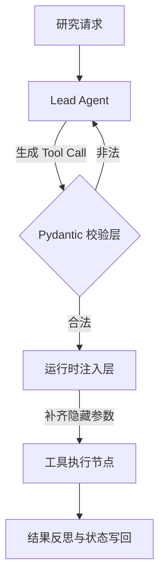
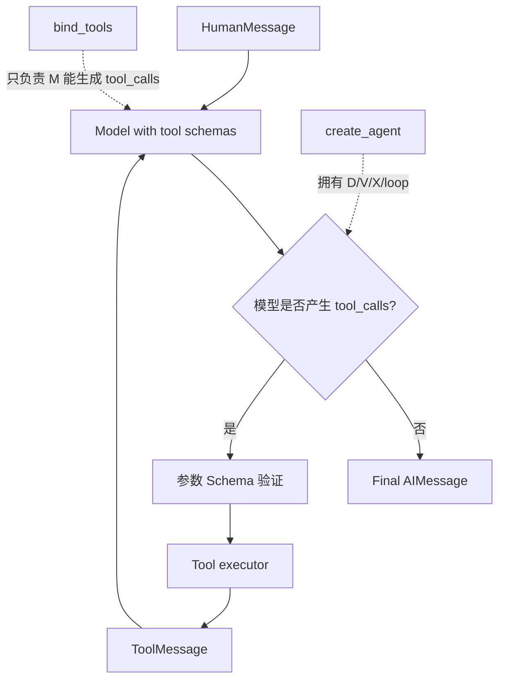

# 第 04 章：工具契约与 `create_agent`——构建第一个 Lead Agent

> - 验证环境：Python 3.12 / LangChain 1.3.x / LangGraph 1.2.x
> - 校准日期：2026-07-13
> - API 状态：`@tool`、`ToolRuntime`、`create_agent` 与 v2 streaming 为 current
> - 本章工件：`mini_deerflow.tools`、`mini_deerflow.agents.create_lead_agent`

## 1. 系统快照：知识工具已经存在，调用时机仍被写死

第一部交付了可观察模型、研究计划和 `search_knowledge` 工具。当前应用仍按固定顺序调用检索器，再把结果交给模型；遇到无需检索的问题，它也会照常查询。

研究助手需要第一次获得有限的行动权：模型可以选择是否调用工具，但只能看到经过批准的工具 Schema。身份、工作区和权限继续由应用在运行时提供，不能由模型编造。

本章会同时观察两条注入路线。Runnable 路线把隐藏参数补入手写管道，便于看清机制；Mini DeerFlow 使用 `create_agent + context + ToolRuntime`，把同一原则落入标准 Agent runtime。

## 2. 一次受控工具调用经历什么

模型产生 tool call 后，参数先经过 Schema 校验；运行时再补入模型无权决定的事实；工具结果最终以 `ToolMessage` 或 State patch 回到 Agent 循环。

<!-- diagram:id=04-tool-contract-flow -->


**图的文本替代**：Agent 产生 Tool Call 后先经过 Pydantic 校验；非法参数回到修正路径，合法参数再由运行时补齐隐藏上下文，工具执行结果最后写回消息或状态。

## 3. 工具契约与运行时注入

### 3.1 用 Pydantic v2 约束模型可填写的参数

Docstring 说明工具何时适用，Pydantic Schema 定义字段、类型和数值范围。显式 `args_schema` 会生成稳定、可检查的 JSON Schema，但运行时仍要处理模型产生的非法参数。

代码如下：
  ```python
  from langchain_core.tools import tool
  from pydantic import BaseModel, Field

  class SearchArgs(BaseModel):
      query: str = Field(description="搜索关键词")
      limit: int = Field(default=5, description="结果数量", ge=1, le=10)

  @tool(args_schema=SearchArgs)
  def smart_search(query: str, limit: int = 5):
      """一个增强型搜索工具，具有严格的数值约束。"""
      return f"Searching for {query} (Limit: {limit})"
  ```
`Field.description` 会进入模型看到的 JSON Schema；`ge=1, le=10` 在执行前拒绝越界参数。重试策略属于 Agent 或 Middleware，工具函数不应递归调用模型自救。

### 3.2 隐藏参数不等于完成授权

模型可以决定查询词，不能决定 `user_id`、工作区根目录和权限集合。`InjectedToolArg` 能把字段从模型可见 Schema 中隐藏；服务端鉴权、最小权限和 Sandbox 仍是独立安全边界。

隐藏参数示例：
  ```python
  from typing import Annotated
  from langchain_core.tools import tool, InjectedToolArg

  @tool
  def secure_delete(
      item_id: str,
      user_id: Annotated[str, InjectedToolArg] # 对 LLM 隐藏
  ):
      """删除指定文件。注意：模型只需提供 item_id 即可。"""
      return f"用户 {user_id} 发起了删除项 {item_id} 的请求。"
  ```

### 3.3 两条注入路线解决不同层级的问题

> **请先建立一个边界感**：
> - 如果你在自己拼 `llm | inject_user_id | tool_router.map()`，优先使用 `@chain + config`。
> - 如果你在使用 `create_agent(...)`，优先使用 `context + ToolRuntime`。
> - 两者都成立，但它们发生在不同的执行层。

#### 路线 A：手写 Runnable 管道

当你仍在 Runnable / Chain 层时，链路是：
> 1. **第一站 (LLM)**：模型只生成它该知道的参数，比如 `file_name` 和 `action`。
> 2. **第二站 (RunnableConfig)**：调用 `invoke(...)` / `astream(...)` 时，把 `user_id` 放进运行时 `config`。
> 3. **第三站 (`@chain`)**：自定义的中间逻辑读取 `config`，把 `user_id` 补到 `tool_call["args"]` 中。
> 4. **第四站 (工具执行)**：工具函数拿到完整参数，但 LLM 从头到尾都没有见过 `user_id`。

`InjectedToolArg` 的隐藏效果体现在提供给模型的 `tool_call_schema`，而不是工具内部使用的完整 `args_schema`。手写管道能明确展示参数由谁补入，但也要求应用自己维护路由和执行循环。

```python
from copy import deepcopy
from langchain_core.messages import AIMessage
from langchain_core.runnables import chain, RunnableLambda

@chain
def inject_user_id(ai_msg: AIMessage, config: dict):
    actual_user_id = config.get("configurable", {}).get("user_id", "guest_001")
    tool_calls = []
    for tool_call in ai_msg.tool_calls:
        new_call = deepcopy(tool_call)
        new_call["args"]["user_id"] = actual_user_id
        tool_calls.append(new_call)
    return tool_calls

tool_map = {"file_operator": file_operator}
tool_router = RunnableLambda(
    lambda tool_call: tool_map[tool_call["name"]].invoke(tool_call["args"])
)

secure_tool_chain = inject_user_id | tool_router.map()
```

#### 路线 B：`create_agent` 的 Runtime Context

使用 `create_agent(...)` 后，链路变为：
> 1. **第一站 (LLM)**：模型仍然只生成它该知道的参数。
> 2. **第二站 (Agent Context)**：调用 `agent.astream(...)` 时，把 `user_id` 放进 `context=...`。
> 3. **第三站 (ToolRuntime)**：工具执行时，通过 `runtime.context.user_id` 读取身份信息。
> 4. **第四站 (工具执行)**：工具拿到完整运行时上下文，但模型依然看不到隐藏参数。

`create_agent` 背后已经是 Graph runtime。`context` 与 `ToolRuntime` 是配对的原生注入入口，应用不必重新实现工具路由器。

```python
from dataclasses import dataclass
from langchain.agents import create_agent
from langchain.tools import ToolRuntime

@dataclass
class FileRuntimeContext:
    user_id: str

@tool
def file_operator_agent(file_name: str, action: str, runtime: ToolRuntime):
    user_id = runtime.context.user_id
    return f"当前用户 {user_id} 正在尝试 {action} {file_name}"

file_agent = create_agent(
    model=llm,
    tools=[file_operator_agent],
    context_schema=FileRuntimeContext,
)

from mini_deerflow.streaming import normalize_stream_part

async for part in file_agent.astream(
    {"messages": [("user", "请读取 secret.txt")]},
    context=FileRuntimeContext(user_id="admin_9527"),
    stream_mode="messages",
    version="v2",
):
    event = normalize_stream_part(part)
    if event.type == "messages":
        chunk, metadata = event.data
        if metadata.get("langgraph_node") == "tools":
            print(chunk.content)
```

---

## 4. 先在最小实验中看清责任

打开 [04_Smart_Tooling.ipynb](./04_Smart_Tooling.ipynb)，依次完成下面四个实验：
你需要完成以下任务：
1. **Schema 打印挑战**：运行代码并观察 `secure_delete.tool_call_schema.model_json_schema()`，验证 `user_id` 是否真的没有暴露给模型。
2. **非法参数验证**：手动把 Tool Call 参数改为越界值，观察校验错误怎样回到 Agent。
3. **Runnable 注入实验**：在不手动向工具传参的情况下，通过 `config={"configurable": {...}}` 跑通 `inject_user_id | tool_router.map()`，看清参数是如何被显式补进 `tool_call["args"]` 的。
4. **Agent 注入实验**：通过 `agent.astream(..., context=FileRuntimeContext(...))` 传入模拟的 `user_id`，观察 `ToolRuntime` 如何在 `create_agent` 路线下读取运行时上下文。

## 5. 把检索工具装进第一个 Mini DeerFlow Lead Agent

到这里，前三章已经交付模型 adapter、结构化领域契约和检索工具。本节第一次把它们装入标准 Agent 工具循环。它是后续课程持续演进的 Lead Agent，不是学完即丢弃的示例。

工具表和 Agent 工厂的唯一事实源是 `tutorial:04-tool-registry` 与 `tutorial:04-lead-agent-factory` region；离线模型脚本和演示知识移到 `mini_deerflow.fixtures`，不会与生产构造逻辑混在一起。

### 5.1 `bind_tools` 与 `create_agent` 的控制权差异

<!-- diagram:id=04-bind-tools-vs-agent -->


**图的文本替代**：绑定工具只让模型能够生成 tool calls；`create_agent` 还负责判断是否调用、参数校验、工具执行、构造 ToolMessage 和再次调用模型的循环。

如果你只调用 `bind_tools`，应用必须自己验证、执行、构造 ToolMessage 并决定是否再次调用模型。`create_agent` 提供这条通用循环，并暴露 middleware、context、state、checkpointer 和 store 等扩展点。只有当业务需要循环外的固定阶段、并行分支或审批拓扑时，才在外层增加 StateGraph。

### 5.2 离线运行完整工具循环

```python sync=ch04-lead-agent-loop
from langchain_core.messages import AIMessage, ToolMessage

from mini_deerflow.agents import create_lead_agent
from mini_deerflow.knowledge import KnowledgeDocument, LocalKnowledgeIndex
from mini_deerflow.models import create_offline_model

knowledge_index = LocalKnowledgeIndex()
knowledge_index.upsert(
    [
        KnowledgeDocument(
            id="agent-runtime",
            text="create_agent 构建在 LangGraph runtime 之上。",
            source="official/agents.md",
        )
    ]
)
scripted_model = create_offline_model(
    [
        AIMessage(
            content="",
            tool_calls=[
                {
                    "name": "search_knowledge",
                    "args": {"query": "create_agent LangGraph", "limit": 1},
                    "id": "search-1",
                    "type": "tool_call",
                }
            ],
        ),
        AIMessage(content="create_agent 使用 LangGraph runtime，并保留高层工具循环。"),
    ]
)
lead_agent = create_lead_agent(model=scripted_model, knowledge_index=knowledge_index)
result = lead_agent.invoke(
    {"messages": [{"role": "user", "content": "create_agent 和 LangGraph 是什么关系？"}]}
)
tool_message = next(message for message in result["messages"] if isinstance(message, ToolMessage))
assert "official/agents.md" in tool_message.content
assert result["messages"][-1].content.startswith("create_agent 使用 LangGraph")
```

这个 fake model 不是根据 Prompt 临场决定工具，而是按 fixture 先发出一个 tool call、再返回最终回答。因此测试能够稳定观察完整 `HumanMessage → AIMessage(tool_calls) → ToolMessage → AIMessage` 序列。

### 5.3 观察 v2 updates，而不是只看最终文本

```python sync=ch04-v2-agent-stream
from mini_deerflow.agents import create_lead_agent
from mini_deerflow.streaming import normalize_stream_part

streaming_agent = create_lead_agent()
raw_parts = list(
    streaming_agent.stream(
        {"messages": [{"role": "user", "content": "create_agent 是什么？"}]},
        stream_mode=["updates"],
        version="v2",
    )
)
events = [normalize_stream_part(part) for part in raw_parts]
updated_nodes = [next(iter(event.data)) for event in events]
assert updated_nodes == ["model", "tools", "model"]
updated_nodes
```

`updates` 展示每个 graph step 更新了哪个节点；`messages` 更适合 token/message 展示。后续 Gateway 可以把二者转换成不同 SSE domain event，但不应让浏览器直接依赖 LangGraph 内部字典。

### 5.4 一个 registry 同时提供计算与检索

```python sync=ch04-tool-registry
from mini_deerflow.tools import build_tool_registry

registry = {tool.name: tool for tool in build_tool_registry(LocalKnowledgeIndex())}
calculation = registry["calculator"].invoke(
    {"operation": "multiply", "left": 6, "right": 7}
)
assert calculation == "42.0"
assert {"calculator", "search_knowledge"}.issubset(registry)
```

calculator 是确定性工具，search 是知识工具；两者都通过 Schema 暴露给模型，但失败策略不同。除零属于可预期输入错误，应该返回模型可修正的结构化结果；索引连接异常则可能需要 retry/fallback middleware。

### 5.5 `ToolRuntime` 注入只读工作区

```python sync=ch04-tool-runtime-workspace
from pathlib import Path
import tempfile

from langchain_core.messages import ToolMessage

from mini_deerflow.config import LeadAgentContext

with tempfile.TemporaryDirectory() as workspace:
    Path(workspace, "notes.txt").write_text("只读工作区证据", encoding="utf-8")
    workspace_model = create_offline_model(
        [
            AIMessage(
                content="",
                tool_calls=[
                    {
                        "name": "read_workspace_file",
                        "args": {"path": "notes.txt"},
                        "id": "read-1",
                        "type": "tool_call",
                    }
                ],
            ),
            AIMessage(content="已读取文件。"),
        ]
    )
    workspace_agent = create_lead_agent(
        model=workspace_model,
        knowledge_index=LocalKnowledgeIndex(),
    )
    workspace_result = workspace_agent.invoke(
        {"messages": [{"role": "user", "content": "读取 notes.txt"}]},
        context=LeadAgentContext(user_id="learner", workspace_root=workspace),
    )

workspace_tool_message = next(
    message for message in workspace_result["messages"] if isinstance(message, ToolMessage)
)
assert "只读工作区证据" in workspace_tool_message.content
assert "workspace_root" not in registry["read_workspace_file"].tool_call_schema.model_fields
```

模型只生成相对 `path`，`workspace_root` 和 `user_id` 从 Runtime Context 注入。这里仍只是只读路径护栏；符号链接、挂载、资源限额和进程隔离属于 Sandbox 章节。

### 5.6 工具用 `Command` 更新 Artifact State

```python sync=ch04-command-artifact
artifact_model = create_offline_model(
    [
        AIMessage(
            content="",
            tool_calls=[
                {
                    "name": "record_artifact",
                    "args": {
                        "path": "reports/answer.md",
                        "media_type": "text/markdown",
                    },
                    "id": "artifact-1",
                    "type": "tool_call",
                }
            ],
        ),
        AIMessage(content="产物已经登记。"),
    ]
)
artifact_agent = create_lead_agent(
    model=artifact_model,
    knowledge_index=LocalKnowledgeIndex(),
)
artifact_result = artifact_agent.invoke(
    {"messages": [{"role": "user", "content": "登记报告"}]}
)
assert artifact_result["artifacts"][0].path == "reports/answer.md"
```

`record_artifact` 返回 `Command(update=...)`，同时补上与 tool call 配对的 ToolMessage。这里的 Artifact reducer 是最小列表追加；第 05–08 章会继续解释 State 生命周期、并行 reducer 和持久化。

### 5.7 失败实验：无界工具循环必须停止

```python sync=ch04-loop-limit-failure
from langgraph.errors import GraphRecursionError

looping_model = create_offline_model(
    [
        AIMessage(
            content="",
            tool_calls=[
                {
                    "name": "calculator",
                    "args": {"operation": "add", "left": 1, "right": 1},
                    "id": f"loop-{index}",
                    "type": "tool_call",
                }
            ],
        )
        for index in range(10)
    ]
)
looping_agent = create_lead_agent(
    model=looping_model,
    knowledge_index=LocalKnowledgeIndex(),
)
try:
    looping_agent.invoke(
        {"messages": [{"role": "user", "content": "不停计算"}]},
        config={"recursion_limit": 3},
    )
except GraphRecursionError as error:
    loop_error = error
else:
    raise AssertionError("无界工具循环必须触发 recursion limit")

assert "recursion" in str(loop_error).lower()
```

Graph recursion limit 是最后护栏，不等于业务层调用预算。后续 Middleware 会按模型调用数、工具调用数和 token 成本更早终止，并返回对用户可解释的结果。

## 6. 失败实验：错误输入为何可能“成功但没回答问题”

### 6.1 错误版本

```text
agent.invoke({"input": "请检索 durable execution"})
```

### 6.2 可观察现象

当前默认 AgentState 的输入字段是 `messages`。额外的 `input` 字段可能被忽略，fake model 仍可能返回脚本化回答，因而调用表面成功，但 state 中没有用户的 HumanMessage。真实模型则可能只看到 system prompt，产生与请求无关的回答。

### 6.3 根因、修复和防回归

这是状态 Schema 错误，不是 Prompt 错误。修复为：

```text
agent.invoke({"messages": [{"role": "user", "content": "..."}]})
```

防回归测试应检查结果第一条消息是 `HumanMessage` 且内容未丢失，而不是只断言最后一条消息非空。`tests/test_mini_deerflow_lead_agent.py` 同时检查用户消息、ToolMessage 引用和最终 AIMessage。

### 6.4 工具失败属于数据还是异常

工具参数验证错误应在执行前反馈给 Agent；可重试的外部超时可以由 tool error middleware 处理；权限拒绝通常应形成结构化业务结果；程序 bug 则不应无限重试。把所有异常都转成一句“工具失败”会丢掉可恢复性和安全语义，第 06 章会把策略放入 Middleware。

## 7. 工具设计的工程边界

- **描述是协议的一部分**：名称、docstring 和字段 description 共同影响模型何时调用工具。
- **隐藏参数不进入 Schema**：用户身份、权限、数据库连接由 `ToolRuntime`/Context 提供，不能让模型生成。
- **副作用分级**：只读检索可以直接执行；写文件、发消息、删除资源需要幂等键、审批或 Sandbox。
- **返回结果可消费**：模型需要简洁文本和 source，应用可能还需要 Artifact/Command；不要只返回不可解析的日志。
- **registry 是权限边界**：不同用户、阶段或 Subagent 不应默认获得全部工具。

当前 `build_tool_registry()` 包含知识检索、计算器、只读 workspace 文件和 Artifact 登记四项能力。`record_artifact` 用 `Command(update=...)` 更新本次 Agent State 中的引用，但它不负责真正写文件，也不等价于持久化；写入、审批与 Sandbox 仍在后续章节加入。

## 8. 动手练习与即时反馈

### 练习 A：单点修改

给现有 `calculator` 增加取模操作，并给离线模型增加对应 tool call fixture。除正常结果外，还要定义除数为零时的结构化失败并断言 `ToolMessage.name`。

### 练习 B：边界判断

判断下列能力属于 Tool、Middleware 还是外围 StateGraph：搜索知识、所有工具调用统一计数、报告发布前审批。解释谁拥有控制权。

### 练习 C：项目扩展

扩展现有只读 workspace 工具：增加允许的文件后缀和最大字节数限制。继续拒绝 `../` 路径，并证明工具 Schema 中没有 workspace 根目录。

### 延迟回忆题

为什么 `create_agent` 与 LangGraph 并不对立？`bind_tools` 没有负责哪三件事？v2 updates 的节点序列为什么能成为 trajectory test 的基础？

## 9. 本章交付：Lead Agent 可以行动，事实边界开始混乱

```bash
uv run --locked pytest -q \
  tests/test_mini_deerflow_lead_agent.py \
  tests/test_mini_deerflow_knowledge.py \
  tests/test_mini_deerflow_vector_index.py \
  tests/test_mini_deerflow_tool_contracts.py \
  tests/test_mini_deerflow_streaming.py
uv run --locked python scripts/validate_tutorials.py
```

本章交付 `build_tool_registry()` 和 `create_lead_agent()`。第一部的检索工具已经进入真实 `model → tool → model` 循环，v2 updates 也能显示每个节点的执行顺序。

新的问题随之出现：用户身份、工作区、当前研究计划、跨线程偏好和数据库连接都被口语化地称为“上下文”。下一章会为这些事实确定所有者和生命周期，不会另起一个 Agent。

DeerFlow 的 Lead Agent 同样从高层 Agent factory 出发。真正形成 Harness 的，是围绕它的 State、Middleware、Tools、Subagent executor、Sandbox 和 Persistence。阅读真实项目时，应先定位 factory 的入参和 middleware/tool registry，再追踪外围 Gateway。

资料访问日期：2026-07-13。

继续阅读：

- [LangChain Agents](https://docs.langchain.com/oss/python/langchain/agents)
- [LangChain Tools](https://docs.langchain.com/oss/python/langchain/tools)
- [LangGraph Streaming](https://docs.langchain.com/oss/python/langgraph/streaming)

继续阅读：[第 05 章：为运行时事实确定所有者](./05_Agent_Middleware.md)。
