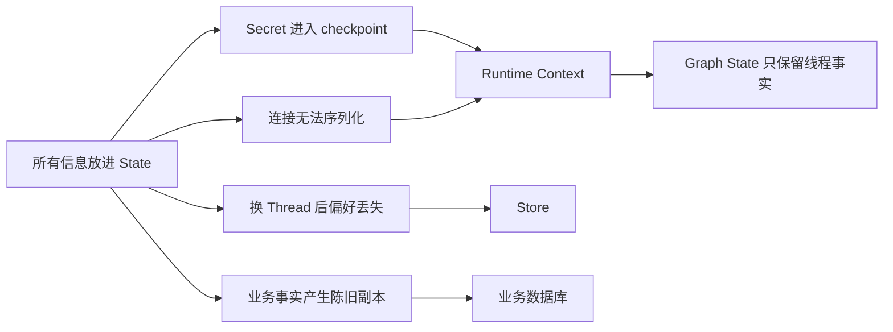

# 第 05 章：Context Engineering——先决定事实由谁拥有

<!-- lesson-contract:v2 -->

> **课程位置**：Agent 封装层第 2 章
> **锁定环境**：Python 3.12 / LangChain 1.3.x / LangGraph 1.2.x
> **本章工件**：原生 Runtime Context、Graph State、Store 与 Mini DeerFlow 数据边界

## 1. 上一刻系统：工具会运行，所有信息却挤在一个袋子里

第 04 章的 Lead Agent 已经能调用检索工具。接入真实用户后，它还需要知道用户身份、权限、语言偏好、当前计划、工作区、数据库连接和短期 Token。

把这些值都叫“上下文”没有错，却不足以指导设计。它们由不同组件拥有，存活时间不同，也不应该拥有相同的读写权限。

本章不先给分类表。我们从一个看似省事的 `UniversalState` 开始，让泄漏、序列化、跨 Thread 和陈旧业务事实依次发生，再从证据推导边界。



**图的文本替代**：万能 State 会造成四类失败。身份、权限和运行依赖进入 Runtime Context；线程内演进事实留在 Graph State。

跨 Thread 偏好进入 Store；账户余额等权威事实留在业务数据库。

## 2. 第一处失败：万能 State 同时破坏安全与持久化

初学者很容易写出一个大字典：节点只收一个参数，调试时也能在一个地方看到所有值。问题是 State 会被节点共享，也可能进入 checkpoint、trace 和调试快照。

<!-- lesson-lab:id=ch05-universal-state-failure layer=concept kind=failure concept=context-boundaries pair=universal-state -->
### 把身份、Token 和数据库连接一起塞进 State

**运行前先预测**：如果 State 被 checkpoint serializer 处理，Token 会不会仍然可见？`sqlite3.Connection` 能否被序列化？

```python sync=ch05-universal-state-failure
import sqlite3

from langgraph.checkpoint.serde.jsonplus import JsonPlusSerializer


unsafe_connection = sqlite3.connect(":memory:")
universal_state = {
    "user_id": "learner-1",
    "auth_token": "chapter05-secret",
    "connection": unsafe_connection,
    "messages": ["研究 checkpoint"],
    "plan": ["检索", "汇总"],
    "language": "zh-CN",
}

print("checkpoint_fields =", sorted(universal_state))
print("secret_visible_in_state =", "auth_token" in universal_state)
try:
    JsonPlusSerializer().dumps_typed(universal_state)
except TypeError as error:
    assert "sqlite3.Connection" in str(error)
    print("TypeError: sqlite3.Connection is not checkpoint serializable")
else:
    raise AssertionError("数据库连接不应进入 checkpoint State")
finally:
    unsafe_connection.close()
```

**观察结果**：

```text output=ch05-universal-state-failure
checkpoint_fields = ['auth_token', 'connection', 'language', 'messages', 'plan', 'user_id']
secret_visible_in_state = True
TypeError: sqlite3.Connection is not checkpoint serializable
```

**发生了什么**：同一个设计同时制造了两个问题。Token 成为可持久化 State 的普通字段；数据库连接则无法通过 LangGraph 的 checkpoint serializer。

“加密 checkpoint”不能解决全部问题。模型、节点、trace 和调试工具仍可能读到本不该出现的值；连接对象也不是需要恢复的业务事实。

**动手修改**：先只删除 `connection`，再预测 Token 是否已经安全。列出仍能读取 `auth_token` 的组件。
<!-- /lesson-lab -->

失败暴露的不是某个 serializer 用法，而是所有权问题：谁提供身份和连接？节点能不能修改它们？它们是否需要随线程恢复？

## 3. 最小修复：Context 由应用注入，State 由图演进

Runtime Context 是一次运行需要、但不由 Agent 自己决定的配置与依赖。Graph State 是节点共同读写、需要随当前 Thread 演进的事实。

下面仍不导入 Mini DeerFlow。我们直接使用 LangGraph 的 `context_schema` 和 `Runtime`，观察两条数据通道怎样进入同一个节点。

<!-- lesson-lab:id=ch05-runtime-state-repair layer=concept kind=repair concept=context-boundaries pair=universal-state -->
### 用原生 Runtime 拆开运行依赖与线程事实

**运行前先预测**：节点返回 patch 后，最终 State 会不会出现 `auth_token` 或数据库连接？

```python sync=ch05-runtime-state-repair
from dataclasses import dataclass, field
import sqlite3
from typing import TypedDict

from langgraph.graph import END, START, StateGraph
from langgraph.runtime import Runtime


@dataclass(frozen=True)
class ResearchContext:
    user_id: str
    permissions: frozenset[str]
    connection: sqlite3.Connection = field(repr=False)
    auth_token: str = field(repr=False)


class ResearchState(TypedDict):
    objective: str
    plan: list[str]


def build_plan(
    state: ResearchState,
    runtime: Runtime[ResearchContext],
) -> dict[str, list[str]]:
    context = runtime.context
    assert context.connection.execute("SELECT 1").fetchone() == (1,)
    print("context_user =", context.user_id)
    print("context_permissions =", sorted(context.permissions))
    patch = {"plan": [f"为 {state['objective']} 检索资料", "整理引用"]}
    print("state_patch =", patch)
    return patch


context_builder = StateGraph(ResearchState, context_schema=ResearchContext)
context_builder.add_node("build_plan", build_plan)
context_builder.add_edge(START, "build_plan")
context_builder.add_edge("build_plan", END)
context_graph = context_builder.compile()

safe_connection = sqlite3.connect(":memory:")
context_result = context_graph.invoke(
    {"objective": "解释 checkpoint", "plan": []},
    context=ResearchContext(
        user_id="learner-1",
        permissions=frozenset({"knowledge:read"}),
        connection=safe_connection,
        auth_token="runtime-only",
    ),
)
safe_connection.close()
print("final_state =", context_result)
print("secret_in_state =", "auth_token" in context_result)
```

**观察结果**：

```text output=ch05-runtime-state-repair
context_user = learner-1
context_permissions = ['knowledge:read']
state_patch = {'plan': ['为 解释 checkpoint 检索资料', '整理引用']}
final_state = {'objective': '解释 checkpoint', 'plan': ['为 解释 checkpoint 检索资料', '整理引用']}
secret_in_state = False
```

**发生了什么**：应用通过 `context=` 注入身份、权限和连接；节点只能读取 frozen context。节点返回的 `plan` patch 才进入 Graph State。

Context 不会自动进入 Prompt。应用仍要选择哪些安全字段可以给模型；`repr=False` 也只是降低误打印概率，不替代权限检查和日志脱敏。

**动手修改**：尝试在节点中改写 `runtime.context.user_id`，观察 frozen dataclass 如何阻止修改。再解释为什么真正鉴权仍必须发生在服务端。
<!-- /lesson-lab -->

## 4. 第二处失败：线程 State 不是跨线程记忆

语言和引用风格常被称为“用户记忆”。把它们放进 State，在当前 Thread 内确实能工作；当同一用户新建另一个 Thread，旧 checkpoint 不会自动参与。

<!-- lesson-lab:id=ch05-preference-state-failure layer=concept kind=failure concept=store pair=preference-lifetime -->
### 把用户偏好放进 Thread State 后切换会话

**运行前先预测**：同一个 `user_id` 使用新的 `thread_id` 时，新 Thread 能否读到旧 Thread 的 `language`？

```python sync=ch05-preference-state-failure
from typing import TypedDict

from langgraph.checkpoint.memory import InMemorySaver
from langgraph.graph import END, START, StateGraph


class PreferenceInState(TypedDict, total=False):
    user_id: str
    language: str
    observed_language: str


def read_state_preference(state: PreferenceInState) -> dict[str, str]:
    return {"observed_language": state.get("language", "<missing>")}


preference_state_builder = StateGraph(PreferenceInState)
preference_state_builder.add_node("read_preference", read_state_preference)
preference_state_builder.add_edge(START, "read_preference")
preference_state_builder.add_edge("read_preference", END)
preference_state_graph = preference_state_builder.compile(
    checkpointer=InMemorySaver()
)

pref_thread_a = {"configurable": {"thread_id": "preference-a"}}
pref_thread_b = {"configurable": {"thread_id": "preference-b"}}
pref_a = preference_state_graph.invoke(
    {"user_id": "learner-1", "language": "zh-CN"}, config=pref_thread_a
)
pref_b = preference_state_graph.invoke(
    {"user_id": "learner-1"}, config=pref_thread_b
)
print("thread_a_language =", pref_a["observed_language"])
print("thread_b_language =", pref_b["observed_language"])
```

**观察结果**：

```text output=ch05-preference-state-failure
thread_a_language = zh-CN
thread_b_language = <missing>
```

**发生了什么**：Checkpointer 按 `thread_id` 保存 Graph State。相同 `user_id` 只是普通字段，不会让两个 Thread 自动共享 State。

这正是正确的消息隔离，却不符合“用户偏好跨会话复用”的生命周期。我们需要一个不绑定单一 Thread、由应用显式读写的边界。

**动手修改**：把两个 config 改成相同 `thread_id`。预测结果后说明：这为什么不能作为跨 Thread 偏好的修复方案？
<!-- /lesson-lab -->

## 5. Store：应用选择哪些事实值得跨 Thread 保存

LangGraph Store 使用 namespace 和 key 显式读写数据。Store 不会自动复制全部 State；应用必须决定保存什么、按谁隔离、何时删除。

<!-- lesson-lab:id=ch05-store-cross-thread layer=concept kind=repair concept=store pair=preference-lifetime -->
### 用同一用户 namespace 跨 Thread 读取偏好

**运行前先预测**：Thread A 保存偏好后，Thread B 使用相同用户 Context，能否从 Store 读取？

```python sync=ch05-store-cross-thread
from dataclasses import dataclass
from typing import TypedDict

from langgraph.graph import END, START, StateGraph
from langgraph.runtime import Runtime
from langgraph.store.memory import InMemoryStore


@dataclass(frozen=True)
class PreferenceContext:
    user_id: str


class PreferenceActionState(TypedDict):
    action: str
    language: str
    observed_language: str


def manage_preference(
    state: PreferenceActionState,
    runtime: Runtime[PreferenceContext],
) -> dict[str, str]:
    namespace = ("users", runtime.context.user_id)
    if state["action"] == "save":
        runtime.store.put(namespace, "preferences", {"language": state["language"]})
    saved = runtime.store.get(namespace, "preferences")
    language = saved.value["language"] if saved else "<missing>"
    return {"observed_language": language}


preference_store = InMemoryStore()
preference_builder = StateGraph(
    PreferenceActionState,
    context_schema=PreferenceContext,
)
preference_builder.add_node("manage_preference", manage_preference)
preference_builder.add_edge(START, "manage_preference")
preference_builder.add_edge("manage_preference", END)
preference_graph = preference_builder.compile(store=preference_store)

saved_pref = preference_graph.invoke(
    {"action": "save", "language": "zh-CN", "observed_language": ""},
    context=PreferenceContext(user_id="learner-1"),
)
loaded_pref = preference_graph.invoke(
    {"action": "load", "language": "", "observed_language": ""},
    context=PreferenceContext(user_id="learner-1"),
)
print("thread_a_saved =", saved_pref["observed_language"])
print("thread_b_loaded =", loaded_pref["observed_language"])
print("namespace =", ("users", "learner-1"))
```

**观察结果**：

```text output=ch05-store-cross-thread
thread_a_saved = zh-CN
thread_b_loaded = zh-CN
namespace = ('users', 'learner-1')
```

**发生了什么**：Store 的 namespace 使用应用提供的用户身份，因此数据生命周期独立于 Thread。代码只保存 `language`，没有把消息、计划和 Token 一起复制进去。

**动手修改**：把保存的 value 扩成任意自由文本。列出长度、字段白名单、删除、Prompt injection 与隐私保留期方面的新风险。
<!-- /lesson-lab -->

跨 Thread 不等于跨用户。namespace 既是组织方式，也是隔离协议；其中的用户身份必须来自已认证 Context，不能相信模型参数。

<!-- lesson-lab:id=ch05-store-user-isolation layer=concept kind=contrast concept=store -->
### 验证不同用户不会共享偏好

**运行前先预测**：两个 namespace 使用相同 key `preferences`，它们会覆盖还是隔离？

```python sync=ch05-store-user-isolation
from langgraph.store.memory import InMemoryStore


isolation_store = InMemoryStore()
isolation_store.put(
    ("users", "learner-1"),
    "preferences",
    {"language": "zh-CN"},
)
isolation_store.put(
    ("users", "learner-2"),
    "preferences",
    {"language": "en-US"},
)

learner_1 = isolation_store.get(("users", "learner-1"), "preferences")
learner_2 = isolation_store.get(("users", "learner-2"), "preferences")
unknown = isolation_store.get(("users", "unknown"), "preferences")
print("learner-1 =", learner_1.value)
print("learner-2 =", learner_2.value)
print("unknown =", unknown)
```

**观察结果**：

```text output=ch05-store-user-isolation
learner-1 = {'language': 'zh-CN'}
learner-2 = {'language': 'en-US'}
unknown = None
```

**发生了什么**：key 相同并不会跨 namespace 冲突。隔离是否可靠取决于 namespace 身份是否可信，以及底层 Store 是否执行相应访问控制。

**动手修改**：故意用请求参数中的 `user_id` 替代认证 Context。描述攻击者如何读取另一个用户的 namespace，以及 Gateway 应在哪里拒绝。
<!-- /lesson-lab -->

## 6. 第三处失败：Store 不是业务数据库

既然 Store 能跨 Thread，很容易继续把余额、订单状态或权限也存进去。这会制造第二份“看起来像真的”业务事实，却没有事务、约束和统一更新路径。

<!-- lesson-lab:id=ch05-stale-business-fact layer=concept kind=failure concept=business-database pair=business-authority -->
### 把账户余额复制进 Store 后观察陈旧值

**运行前先预测**：业务数据库把余额从 100 更新为 60 后，Store 中旧快照会不会自动变化？

```python sync=ch05-stale-business-fact
import sqlite3

from langgraph.store.memory import InMemoryStore


account_db = sqlite3.connect(":memory:")
account_db.execute("CREATE TABLE accounts (user_id TEXT PRIMARY KEY, balance INTEGER)")
account_db.execute("INSERT INTO accounts VALUES ('learner-1', 100)")

business_copy_store = InMemoryStore()
business_copy_store.put(
    ("users", "learner-1"),
    "account",
    {"balance": 100},
)

account_db.execute(
    "UPDATE accounts SET balance = 60 WHERE user_id = 'learner-1'"
)
database_balance = account_db.execute(
    "SELECT balance FROM accounts WHERE user_id = 'learner-1'"
).fetchone()[0]
store_balance = business_copy_store.get(
    ("users", "learner-1"), "account"
).value["balance"]

print("database_balance =", database_balance)
print("store_balance =", store_balance)
print("facts_disagree =", database_balance != store_balance)
account_db.close()
```

**观察结果**：

```text output=ch05-stale-business-fact
database_balance = 60
store_balance = 100
facts_disagree = True
```

**发生了什么**：Store 正常保存了应用写入的值；错误在于应用把权威业务事实复制成了无人维护的长期记忆。Prompt 可能据此给出错误承诺。

**动手修改**：尝试在每次余额变化时同步更新 Store。列出并发、失败重试、事务和补偿会让这条“双写”方案增加哪些成本。
<!-- /lesson-lab -->

业务数据库拥有账户、订单、退款与权限等领域事实。Agent 工具通过受控 Repository 或服务读取它们；State 和 Store 只保留任务需要的引用或非权威偏好。

<!-- lesson-lab:id=ch05-business-database-repair layer=concept kind=repair concept=business-database pair=business-authority -->
### 每次通过业务 Repository 读取权威余额

**运行前先预测**：数据库更新后再次调用 `get_balance`，是否还需要同步 Store？

```python sync=ch05-business-database-repair
import sqlite3

from langgraph.store.memory import InMemoryStore


class AccountRepository:
    def __init__(self, connection: sqlite3.Connection) -> None:
        self.connection = connection

    def get_balance(self, user_id: str) -> int:
        row = self.connection.execute(
            "SELECT balance FROM accounts WHERE user_id = ?",
            (user_id,),
        ).fetchone()
        if row is None:
            raise KeyError(user_id)
        return int(row[0])


authority_db = sqlite3.connect(":memory:")
authority_db.execute("CREATE TABLE accounts (user_id TEXT PRIMARY KEY, balance INTEGER)")
authority_db.execute("INSERT INTO accounts VALUES ('learner-1', 100)")
accounts = AccountRepository(authority_db)

preference_only_store = InMemoryStore()
preference_only_store.put(
    ("users", "learner-1"),
    "preferences",
    {"language": "zh-CN"},
)
print("balance_before =", accounts.get_balance("learner-1"))
authority_db.execute(
    "UPDATE accounts SET balance = 60 WHERE user_id = 'learner-1'"
)
print("balance_after =", accounts.get_balance("learner-1"))
print(
    "stored_preference =",
    preference_only_store.get(("users", "learner-1"), "preferences").value,
)
authority_db.close()
```

**观察结果**：

```text output=ch05-business-database-repair
balance_before = 100
balance_after = 60
stored_preference = {'language': 'zh-CN'}
```

**发生了什么**：Repository 是业务数据库的受控访问边界，读取结果随权威事务变化。Store 继续保存语言偏好，两类数据不再争夺“真相来源”。

**动手修改**：让 Repository 返回退款状态，并要求工具执行退款。指出读取、权限检查、幂等键、事务和审计分别应由哪一层拥有。
<!-- /lesson-lab -->

## 7. Thread 隔离：Checkpoint 保存当前会话，不保存整个用户

现在回到 Graph State。两个 Thread 可以使用同一个 compiled graph 和 checkpointer，但必须通过不同 `thread_id` 得到独立快照。

<!-- lesson-lab:id=ch05-thread-state-isolation layer=concept kind=contrast concept=thread-state -->
### 用两个 thread_id 保存互不相同的研究问题

**运行前先预测**：读取 Thread A 的 snapshot 时，会不会出现 Thread B 的问题或答案？

```python sync=ch05-thread-state-isolation
from typing import TypedDict

from langgraph.checkpoint.memory import InMemorySaver
from langgraph.graph import END, START, StateGraph


class ThreadResearchState(TypedDict):
    question: str
    answer: str


def answer_question(state: ThreadResearchState) -> dict[str, str]:
    return {"answer": f"已记录：{state['question']}"}


thread_builder = StateGraph(ThreadResearchState)
thread_builder.add_node("answer", answer_question)
thread_builder.add_edge(START, "answer")
thread_builder.add_edge("answer", END)
thread_graph = thread_builder.compile(checkpointer=InMemorySaver())

thread_a_config = {"configurable": {"thread_id": "research-a"}}
thread_b_config = {"configurable": {"thread_id": "research-b"}}
thread_graph.invoke(
    {"question": "解释 checkpoint", "answer": ""}, config=thread_a_config
)
thread_graph.invoke(
    {"question": "解释 store", "answer": ""}, config=thread_b_config
)
snapshot_a = thread_graph.get_state(thread_a_config).values
snapshot_b = thread_graph.get_state(thread_b_config).values
print("thread_a =", snapshot_a)
print("thread_b =", snapshot_b)
print("questions_isolated =", snapshot_a["question"] != snapshot_b["question"])
```

**观察结果**：

```text output=ch05-thread-state-isolation
thread_a = {'question': '解释 checkpoint', 'answer': '已记录：解释 checkpoint'}
thread_b = {'question': '解释 store', 'answer': '已记录：解释 store'}
questions_isolated = True
```

**发生了什么**：Checkpointer 以 `thread_id` 组织 State 历史。同一用户可以拥有多个 Thread；一个 Thread 也可能经历多次 Run 和恢复。

**动手修改**：故意让两个请求共用同一个 `thread_id`。观察第二次输入怎样继承旧 snapshot，并解释为什么产品 Thread 必须绑定认证用户。
<!-- /lesson-lab -->

## 8. 现在再给判断表：按所有权与生命周期分类

前面的失败提供了四个问题。分类任何数据前，依次问：谁提供？谁能改？要活多久？是否需要恢复？哪个系统拥有权威真相？

| 数据 | 位置 | 由谁提供或修改 | 生命周期与理由 |
|---|---|---|---|
| `user_id`、权限、请求 ID | Runtime Context | Gateway / 应用 | 每次运行注入，模型不能改写 |
| 数据库连接、HTTP Client | Runtime Context | 组合根 | 运行依赖，不进入 checkpoint |
| API Key、短期 Token | Secret Manager → Context | 服务端 | 只给必要组件，不能进入 Prompt/State |
| messages、计划、产物引用 | Graph State | 节点与 Middleware | 当前 Thread 演进，可 checkpoint |
| 用户语言、引用风格 | Store | 应用显式保存 | 跨 Thread 复用，按用户隔离 |
| 订单、余额、退款、权限记录 | 业务数据库 | 领域服务 | 权威事务、约束与审计来源 |

不要用“是否经常变化”分类。权限可能频繁变化，但一次 Run 中仍由应用固定；偏好也可能变化，却需要跨 Thread 显式保存和删除。

### 8.1 Context window 不是 Runtime Context

模型 context window 指一次模型调用能接收多少 token。Runtime Context 指应用注入的身份、权限和依赖。

摘要 Middleware 可以缩短 messages，却不会自动完成权限隔离；Store 能保存偏好，也不意味着每次都应把全部偏好塞进 Prompt。

### 8.2 Checkpointer 不是 Store

Checkpointer 保存 Thread State 的 step 快照，用于恢复和 time travel。Store 由应用按 namespace/key 主动读写，用于跨 Thread 的选择性数据。

### 8.3 Store 不是业务数据库

Store 没有自动获得订单唯一约束、余额一致性和领域事务。Agent 工具应调用真正的领域服务，不要把“长期可保存”误写成“业务权威”。

## 9. 工程迁移：Mini DeerFlow 怎样固化这些边界

概念层已经用原生 API 证明了边界。现在再看 Mini DeerFlow：它没有发明新的上下文种类，而是给类型、安全视图、namespace policy 和 checkpoint guard 建立稳定公共接口。

<!-- lesson-lab:id=ch05-mini-deerflow-context layer=migration kind=contrast concept=context-boundaries -->
### 对照安全 Context、ThreadState 与偏好 Repository

**运行前先预测**：安全视图是否包含 Token？同一路径 Artifact 是否保持类型化？不同用户的偏好是否使用不同 namespace？

```python sync=ch05-mini-deerflow-context
from langgraph.store.memory import InMemoryStore

from mini_deerflow.context import RuntimeContext, safe_context_view
from mini_deerflow.schemas import ArtifactRef
from mini_deerflow.state import MiddlewareTraceEvent, assert_checkpoint_safe
from mini_deerflow.store import UserPreferenceRepository, preference_namespace


project_context = RuntimeContext(
    user_id="learner-1",
    workspace_root="/tmp/mini-deerflow",
    request_id="req-05-001",
    permissions=frozenset({"knowledge:read", "workspace:read"}),
    locale="zh-CN",
    auth_token="never-publish-me",
)
safe_view = safe_context_view(project_context)

project_state = {
    "messages": [],
    "artifacts": [
        ArtifactRef(path="reports/context.md", media_type="text/markdown")
    ],
    "middleware_trace": [
        MiddlewareTraceEvent(middleware="lead", hook="before_model")
    ],
}
assert_checkpoint_safe(project_state)

project_store = InMemoryStore()
preferences = UserPreferenceRepository(project_store)
preferences.save(
    "learner-1",
    {"language": "zh-CN", "citation_style": "source-first"},
)

print("safe_context_keys =", sorted(safe_view))
print("auth_token_exposed =", "auth_token" in safe_view)
print("artifact =", project_state["artifacts"][0].model_dump())
print("preference_namespace =", preference_namespace("learner-1"))
print("preferences =", preferences.load("learner-1"))
```

**观察结果**：

```text output=ch05-mini-deerflow-context
safe_context_keys = ['locale', 'model_profile', 'permissions', 'request_id', 'user_id']
auth_token_exposed = False
artifact = {'path': 'reports/context.md', 'media_type': 'text/markdown'}
preference_namespace = ('users', 'learner-1')
preferences = {'language': 'zh-CN', 'citation_style': 'source-first'}
```

**发生了什么**：Mini DeerFlow 增加了类型化 Context、安全投影视图、checkpoint safety guard、Artifact 协议和受约束偏好 Repository。

概念实验省略的工程边界现在有了拥有者：Gateway 认证身份，Middleware 校验权限，State 类型限制可持久化事实，Repository 执行字段白名单与用户隔离。
<!-- /lesson-lab -->

| 概念实验职责 | Mini DeerFlow 所有者 | 额外工程边界 |
|---|---|---|
| 应用注入身份与依赖 | `RuntimeContext` | frozen 类型、安全 `repr`、权限集合 |
| 节点共享线程事实 | `ThreadState` | Artifact 类型、trace 类型、checkpoint guard |
| 跨 Thread 偏好 | `UserPreferenceRepository` | namespace policy、字段校验、未知用户空值 |
| 权威业务事实 | 产品 Repository / Gateway 依赖 | 事务、幂等、审计，不复制到 Store |

## 10. 从这里开始读 DeerFlow

不要先搜索 Prompt 中出现了哪些用户信息。沿调用链寻找所有权：

```text
Gateway 认证请求
→ worker 构建 Runtime Context
→ Lead Agent factory 组合 State schema 与 Middleware
→ Tool / Middleware 读取 Context
→ Checkpointer 保存 Thread State
→ Store 或业务服务处理跨 Thread / 权威事实
```

DeerFlow 阅读入口固定到 commit `4af617835805dd7cd78162ebed02fd6b782ea8bf`：

| 本章问题 | 阅读入口 | 验证问题 |
|---|---|---|
| Thread 中保存什么 | `agents/thread_state.py` | 哪些字段有 reducer，哪些字段被排除？ |
| Runtime Context 从哪来 | `runtime/runs/worker.py` | user、thread、run 与 AppConfig 怎样组合？ |
| Tool 怎样拿到依赖 | `tools/` 与 harness factory | 模型 schema 是否暴露内部身份和连接？ |
| 长期数据由谁拥有 | Store / Sandbox / Gateway 模块 | 它是偏好、Artifact，还是权威业务事务？ |

## 11. 练习：用生命周期而不是名词做判断

### 练习 A：重新分类

把 `tenant_id`、当前研究计划、默认输出格式、Stripe payment intent、HTTP client、最近一次 summary 分入四个边界。每项写出提供者、可修改者和生命周期。

### 练习 B：制造恢复问题

在 State 中放入打开的文件对象，运行 checkpoint serializer。修复时只移动这一项，不要把计划和消息也移出 State。

### 练习 C：设计 Store policy

为偏好增加 `schema_version`、字段白名单和删除方法。拒绝保存 `auth_token`，并说明自由文本偏好进入 Prompt 前需要哪些检查。

### 延迟回忆

合上讲义回答：数据库连接为什么属于 Context？Checkpoint 与 Store 的主键分别是什么？跨 Thread 为什么不等于跨用户？Store 为什么不能成为余额的权威来源？

## 12. 下一刻系统：事实各归其位，治理逻辑仍然散落

本章结束后，身份、权限和依赖由 Runtime Context 注入；消息、计划和 Artifact 属于当前 Thread State；偏好由 Store 跨 Thread 保存；业务事务继续由数据库负责。

新的问题随之出现：每个模型和工具调用都要重复检查权限、计数、日志与异常。第 06 章会先让这些重复和遗漏真实发生，再用 Agent Middleware 把横切治理收回统一边界。

运行本章验收：

```bash
TMPDIR="$PWD/.tmp" uv run --locked --group dev python \
  scripts/sync_lesson_notebooks.py tutorials/05_Agent_Middleware.md --execute
TMPDIR="$PWD/.tmp" uv run --locked --group dev pytest -q \
  tests/test_mini_deerflow_context_engineering.py tests/test_notebook_sync.py
TMPDIR="$PWD/.tmp" uv run --locked --group dev python scripts/validate_tutorials.py
```

资料访问日期：2026-07-21。

- [LangChain Context Engineering](https://docs.langchain.com/oss/python/langchain/context-engineering)
- [LangChain Runtime](https://docs.langchain.com/oss/python/langchain/runtime)
- [LangGraph Persistence](https://docs.langchain.com/oss/python/langgraph/persistence)
- [LangGraph Memory](https://docs.langchain.com/oss/python/langgraph/add-memory)

继续阅读：[第 06 章：从重复治理逻辑推导 Agent Middleware](./06_Observability_Persistence.md)。
