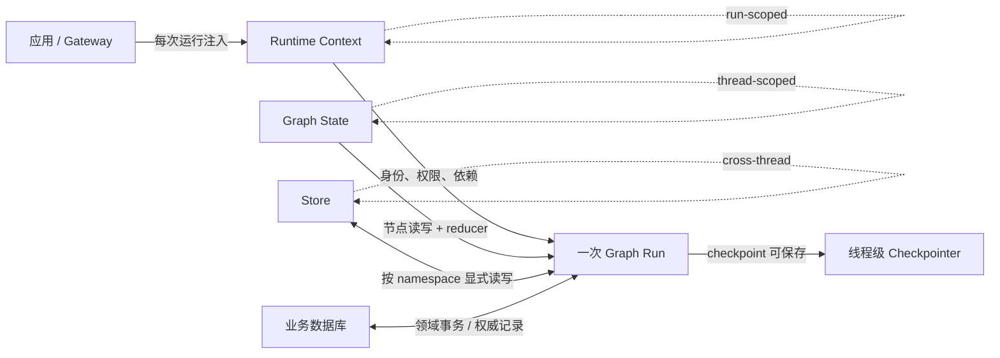
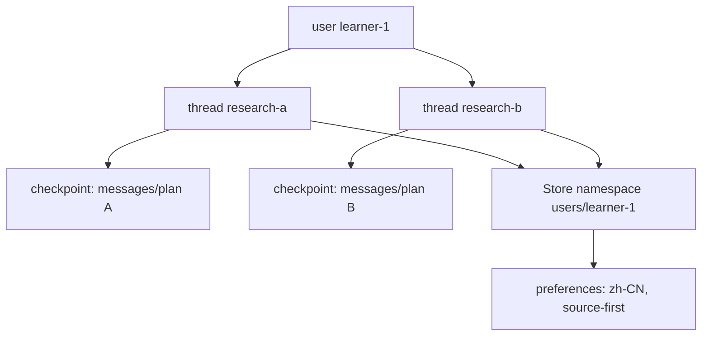

# 第 05 章：Context Engineering——Runtime Context、Graph State 与 Store

> - 验证环境：Python 3.12 / LangChain 1.3.x / LangGraph 1.2.x
> - 校准日期：2026-07-13
> - API 状态：`context_schema`、`AgentState`、`Runtime`、`ToolRuntime`、`BaseStore` 均为 current
> - 本章工件：`mini_deerflow.context`、`mini_deerflow.state`、`mini_deerflow.store`

## 系统快照：Lead Agent 能调用工具，却分不清事实由谁拥有

第 04 章的 Lead Agent 已能自主调用 `search_knowledge`。接入真实用户后，我们还要提供身份、权限、工作区、当前计划、语言偏好、数据库连接和 API Token。

如果把这些数据全部塞进 `messages` 或一个通用字典，模型可能看到 Secret，checkpoint 可能序列化连接对象，不同用户的偏好也可能互相污染。

本章不增加新工具，而是为事实确定所有者、生命周期和写入方式。完成后，同一个 Lead Agent 会拥有 Runtime Context、Graph State、Store 和业务数据库四条明确边界。

## 1. 问题建模：不要把“上下文”当成一个大袋子

Agent 需要的信息很多：用户是谁、有哪些权限、当前对话说了什么、计划做到哪一步、用户偏好什么语言、数据库连接在哪里。它们都可以被口语化地称为“上下文”，但生命周期和控制权完全不同。

<!-- diagram:id=05-context-state-store-lifetimes -->


**图的文本替代**：Gateway 在每次运行时注入 Runtime Context；Graph 节点共同读写 State，State 可由 Checkpointer 按线程保存；Store 由应用按 namespace 显式保存跨线程数据；业务数据库继续负责订单、权限等权威领域事务。

### 1.1 一张先背后理解的判断表

| 数据 | 应放位置 | 原因 |
|---|---|---|
| `user_id`、权限集合、请求 ID | Runtime Context | 由应用控制，模型不能改写 |
| 数据库连接、HTTP Client | Runtime Context | 是运行依赖，通常不可序列化 |
| API Key、Auth Token | Runtime Context 或进程 Secret Manager | 不能进入 checkpoint、Prompt 和 trace |
| messages、计划步骤、artifact 引用 | Graph State | 属于当前线程的演进事实 |
| middleware 调用计数、执行轨迹 | Graph State | 节点间共享，可能需要恢复或测试 |
| 用户回答语言、引用风格 | Store | 跨线程复用，但必须显式选择保存 |
| 订单、付款、账户余额 | 业务数据库 | 需要领域事务、审计和一致性，不是“记忆” |

不要用“是否经常变化”判断边界。权限可以在运行间变化，但一次运行内仍应由 Context 固定；用户偏好也可能变化，却适合用 Store 做显式版本化更新。

## 2. Runtime Context：应用注入的运行依赖

### 2.1 它是什么

Runtime Context 是一次图运行所需、但不属于 Agent 自己演进状态的数据。LangChain `create_agent(..., context_schema=...)` 声明它的类型；调用方通过 `agent.invoke(..., context=...)` 提供；Middleware 通过 `request.runtime.context`，工具通过 `ToolRuntime.context` 读取。

这条控制链很重要：

```text
Gateway / Application → Runtime Context → Middleware / Tool
```

模型可以请求“读取文件”，但不能自行选择 `workspace_root`；模型可以请求“发布报告”，但不能自行把权限集合改成管理员。

### 2.2 它不是什么

- 不是 Prompt 的另一个名字：Context 可以包含连接对象，Prompt 只能得到经过筛选的安全视图；
- 不是 Graph State：Context 不由节点返回 patch，也不应被 reducer 合并；
- 不是聊天模型的 context window：后者是模型一次能接收的 token 范围；
- 不是认证系统：隐藏 `user_id` 或 Token 不等价于完成服务端鉴权。

### 2.3 Mini DeerFlow 的安全视图

可复用实现的唯一事实源位于 `mini_deerflow.context` 的 `tutorial:05-runtime-context` region。

```python sync=ch05-safe-context
from mini_deerflow.context import RuntimeContext, safe_context_view

runtime_context = RuntimeContext(
    user_id="learner-1",
    workspace_root="/tmp/mini-deerflow",
    request_id="req-05-001",
    permissions=frozenset({"knowledge:read", "workspace:read"}),
    locale="zh-CN",
    auth_token="never-copy-me",
)
safe_context = safe_context_view(runtime_context)

assert safe_context["user_id"] == "learner-1"
assert safe_context["permissions"] == ["knowledge:read", "workspace:read"]
assert "auth_token" not in safe_context
assert "never-copy-me" not in repr(runtime_context)
```

`repr=False` 和安全视图只是在降低误泄露概率。工具仍需校验权限，日志系统仍需 redaction，真正 Secret 仍应来自环境或 Secret Manager。

## 3. Graph State：当前线程中会演进的事实

### 3.1 State 不是任意 Python 字典

State 是图节点共享的数据协议。节点读取旧 State，返回局部更新；当多个节点或多个 middleware 更新同一字段时，Reducer 决定如何合并。

Mini DeerFlow 的 `ThreadState` 包含：

- `messages`：继承 `AgentState` 的消息 reducer；
- `artifacts`：追加产物引用；
- `middleware_trace`：追加生命周期轨迹；

事实源位于 `mini_deerflow.state` 的 `tutorial:05-thread-state` region。

```python sync=ch05-checkpoint-safe-state
from mini_deerflow.schemas import ArtifactRef
from mini_deerflow.state import MiddlewareTraceEvent, assert_checkpoint_safe

thread_state = {
    "messages": [],
    "artifacts": [
        ArtifactRef(path="reports/context-boundary.md", media_type="text/markdown")
    ],
    "middleware_trace": [
        MiddlewareTraceEvent(middleware="lead", hook="before_model")
    ],
}
assert_checkpoint_safe(thread_state)
```

### 3.2 Reducer 为什么不是可选装饰

如果两个并行节点都返回 `{"artifacts": [...]}`，普通覆盖语义只能保留其中一份。`Annotated[list[T], operator.add]` 把“冲突时怎么办”写进 Schema。后续 StateGraph 并行章节会实际制造并发更新；本章先让学习者看到 reducer 属于领域契约，而不是 LangGraph 的神秘语法。

Reducer 也不能一律使用 `operator.add`：

- append-only event 或 artifact 适合追加；
- 当前 summary 通常需要覆盖；
- 任务状态可能需要按 ID 合并；
- 金额、版本号等业务字段需要明确的领域规则。

### 3.3 为什么 Secret 不能进入 State

一旦配置 Checkpointer 或 tracing，State 可能进入数据库、调试快照和观测系统。即使当前使用内存运行，也应该按“未来会持久化”设计。

```python sync=ch05-secret-state-failure
from mini_deerflow.state import UnsafeStateError, assert_checkpoint_safe

unsafe_state = {
    "messages": [],
    "runtime": {"auth_token": "secret-value"},
}
try:
    assert_checkpoint_safe(unsafe_state)
except UnsafeStateError as error:
    secret_boundary_error = error
else:
    raise AssertionError("Secret 字段必须被 checkpoint safety guard 拒绝")

assert "auth_token" in str(secret_boundary_error)
```

这里按字段名拦截是教学护栏，不是完整 DLP 系统。把 Token 藏进 `notes` 字符串仍可能绕过；生产系统还需要类型约束、日志 redaction、访问控制和数据保留策略。

## 4. Store：跨线程、显式选择的应用记忆

### 4.1 Store 与 Checkpointer 的差别

Checkpointer 通常按 `thread_id` 保存一次线程的 State 演进；Store 不绑定单一线程，应用通过 namespace/key 主动读写。一个用户开启两个研究线程时，两份消息历史应隔离，但用户选择的语言偏好可以共享。

<!-- diagram:id=05-thread-checkpoint-store-isolation -->


**图的文本替代**：同一用户的两个 thread 拥有互相隔离的消息和计划 checkpoint，但都通过相同用户 namespace 读取显式保存的语言与引用偏好。

### 4.2 namespace 是数据隔离策略

事实源位于 `mini_deerflow.store` 的 `tutorial:05-store-policy` region。`UserPreferences` 使用字段 allowlist、枚举值和长度/字符约束；未知字段直接拒绝，避免任意长期文本未经审查就进入 system prompt。若产品需要自由文本偏好，应单独建立内容审核、长度预算与 Prompt injection 防护，而不是放宽这个对象。

```python sync=ch05-store-cross-thread
from langgraph.store.memory import InMemoryStore
from mini_deerflow.store import UserPreferenceRepository, preference_namespace

memory_store = InMemoryStore()
preferences = UserPreferenceRepository(memory_store)
preferences.save(
    "learner-1",
    {"language": "zh-CN", "citation_style": "source-first"},
)

thread_a_preferences = preferences.load("learner-1")
thread_b_preferences = preferences.load("learner-1")

assert thread_a_preferences == thread_b_preferences
assert preference_namespace("learner-1") == ("users", "learner-1")
```

### 4.3 跨线程不等于跨用户

```python sync=ch05-store-user-isolation
preferences.save("learner-2", {"language": "en-US"})

assert preferences.load("learner-1")["language"] == "zh-CN"
assert preferences.load("learner-2") == {"language": "en-US"}
assert preferences.load("unknown-user") == {}
```

namespace 中使用 `user_id` 只是隔离键；它必须来自已经认证的应用上下文，不能相信模型或未验证的请求参数。

Store 可以跨 thread，不代表 Thread State 会串线。下面用同一个 compiled agent 和同一个内存 Checkpointer 运行两个 `thread_id`，再读取各自快照：

```python sync=ch05-thread-state-isolation
from langchain_core.messages import AIMessage
from langgraph.checkpoint.memory import InMemorySaver
from mini_deerflow.agents import create_lead_agent
from mini_deerflow.models import create_offline_model

thread_agent = create_lead_agent(
    model=create_offline_model([
        AIMessage(content="thread-a-answer"),
        AIMessage(content="thread-b-answer"),
    ]),
    tools=[],
    checkpointer=InMemorySaver(),
)
thread_a_config = {"configurable": {"thread_id": "chapter05-thread-a"}}
thread_b_config = {"configurable": {"thread_id": "chapter05-thread-b"}}

thread_agent.invoke({"messages": [("user", "question-a")]}, config=thread_a_config)
thread_agent.invoke({"messages": [("user", "question-b")]}, config=thread_b_config)

thread_a_messages = thread_agent.get_state(thread_a_config).values["messages"]
thread_b_messages = thread_agent.get_state(thread_b_config).values["messages"]
assert "question-b" not in [message.content for message in thread_a_messages]
assert "question-a" not in [message.content for message in thread_b_messages]
```

## 5. 在一次运行中同时读取三种事实

`langgraph.runtime.Runtime` 把 Context、Store、stream writer 等运行能力组合给节点和 Middleware。State 则作为独立参数传入。下面不运行完整 Agent，只验证三者在接口上互不混淆：

```python sync=ch05-three-boundaries
from langgraph.runtime import Runtime

runtime = Runtime(context=runtime_context, store=memory_store)
current_state = {
    "messages": [],
    "middleware_trace": [
        MiddlewareTraceEvent(middleware="lead", hook="before_model")
    ],
}

context_fact = runtime.context.user_id
state_fact = current_state["middleware_trace"][0].as_text()
store_fact = UserPreferenceRepository(runtime.store).load(context_fact)["language"]

assert (context_fact, state_fact, store_fact) == (
    "learner-1",
    "lead:before_model",
    "zh-CN",
)
```

这段代码的价值不在三行读取，而在所有权：

- Context 由调用方给出；
- State 由图执行过程演进；
- Store 数据由 Repository 显式选择保存。

## 6. Context window 与应用上下文不要混为一谈

模型 context window 管理“这次模型调用能看到多少 token”。应用 Context Engineering 管理“系统应该把哪些信息交给哪个组件”。摘要 Middleware 可以缩短 messages，却不会替你完成权限隔离；Store 能保存偏好，却不意味着每次都应把所有偏好塞进 Prompt。

一个稳健流程通常是：

1. Gateway 认证请求并创建 Runtime Context；
2. Middleware 从 Context 和 Store 选择当前任务必要信息；
3. Prompt 只接收安全、相关、大小受控的视图；
4. Agent 节点更新 Thread State；
5. Checkpointer 保存线程恢复所需 State；
6. 只有明确有长期价值的数据才写 Store。

## 7. 观测、持久化与本章边界

旧课程把 LangSmith、Langfuse、Checkpointer 和 Agent Middleware 混在一个“基础设施”章节。它们都重要，但职责不同：

- LangSmith/Langfuse 记录 trace、span、token、输入输出和评测信息，属于可观测性；
- Checkpointer 保存 Graph State 的步骤快照，属于线程恢复；
- Store 保存跨线程的应用记忆；
- Middleware 决定模型/工具调用前后统一执行什么；
- 业务数据库保存订单、权限等权威状态。

本章只建立数据边界。第 09–10 章会详细实现 Checkpointer、thread、interrupt 和恢复；评测与观测在后续质量任务统一收口。这样学习者不会误以为“打开 tracing 就拥有持久化”，也不会把 Store 当成任意数据库的别名。

## 8. 常见失败模式

### 8.1 把 Context 复制进 State

这样做看似方便，实际会让权限和 Token 进入 checkpoint。节点还可能意外修改本应由应用控制的身份。

### 8.2 把整个 State 写入 Store

跨线程偏好与完整消息历史具有不同保留周期和隐私风险。只保存经过选择、版本化、可删除的数据。

### 8.3 用全局变量保存用户身份

并发请求会互相污染，测试也会依赖执行顺序。身份必须沿 Runtime Context 显式传递。

### 8.4 把 Store 当作业务事务数据库

Agent Store 不替代订单唯一约束、余额一致性、审计日志和数据库事务。工具应调用真正的领域服务。

## 9. 分层练习与即时反馈

### 练习 A：分类

把以下字段分入 Context、State、Store 或业务数据库：`tenant_id`、当前研究计划、用户默认输出格式、Stripe payment intent、HTTP client、最近一次 summary。每项写一句生命周期理由。

### 练习 B：边界测试

给 `ThreadState` 增加 `todos` reducer。构造两个并行更新的 worked example，证明简单覆盖会丢数据，并说明按 ID 合并是否比列表追加更合适。

### 练习 C：Store policy

为偏好增加 `schema_version` 和允许字段白名单。拒绝保存 `auth_token`，并为用户删除偏好提供显式方法。

### 延迟回忆题

合上本章后回答：Checkpointer 与 Store 的主键和生命周期分别是什么？为什么数据库连接适合 Context 而不适合 State？“跨线程”为什么不自动等于“跨用户”？

## 10. 本章交付：事实各归其位，治理逻辑仍然散落

```bash
uv run --locked pytest -q \
  tests/test_mini_deerflow_context_engineering.py \
  tests/test_mini_deerflow_tool_contracts.py
uv run --locked python scripts/validate_tutorials.py
```

本章交付 `RuntimeContext`、`ThreadState`、checkpoint safety guard、Store namespace 与 `UserPreferenceRepository`。身份和依赖由应用注入，线程事实可恢复，跨线程偏好按用户隔离。

边界清楚后，新的重复出现了：每个模型和工具调用都要检查权限、限额、PII 与错误。第 06 章会让真正的 AgentMiddleware 统一消费这些边界。

在 DeerFlow 固定提交 `2bd0f56a0f5a418d126cb4a18e23001f54ccf024` 中，`thread_state.py` 定义线程字段与 reducer，`worker.py::_build_runtime_context` 组合 thread、run 与 AppConfig。

Gateway 再加入白名单认证上下文，短期 token 只进入 Runtime Context。阅读时先找 factory 的 Context、State 与 Store，再看 Middleware 如何消费它们；不要从 Prompt 文本反推数据所有权。

资料访问日期：2026-07-13。

继续阅读：

- [LangChain Context Engineering](https://docs.langchain.com/oss/python/langchain/context-engineering)
- [LangChain Runtime](https://docs.langchain.com/oss/python/langchain/runtime)
- [LangGraph Persistence](https://docs.langchain.com/oss/python/langgraph/persistence)
- [LangGraph Memory](https://docs.langchain.com/oss/python/langgraph/add-memory)

继续阅读：[第 06 章：把横切规则装入 Agent 生命周期](./06_Observability_Persistence.md)。
