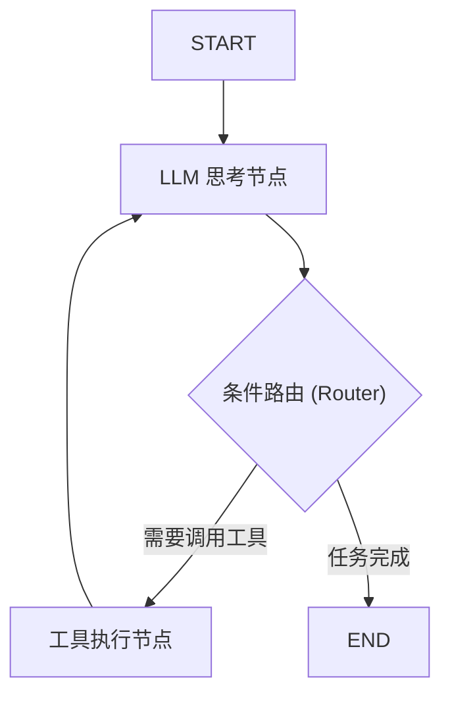

# 第 07 章：核心编排 (StateGraph 状态机)

## 0. 本章知识脉络 (Chapter Overview)

在之前的章节中，我们一直依仗 `create_agent` 这把“万能瑞士军刀”。虽然它能快速解决问题，但当我们需要实现复杂的业务逻辑（如：多轮强制人工介入、多模型协作并行处理等）时，黑盒工具就显得捉紧见肘。

本章我们将正式进入 LangGraph 的核心——**StateGraph (状态图)**。你将亲自担任架构师，手动定义 Agent 的大脑结构（State）与思维路径（Nodes & Edges）。

掌握本章后，你将学到：

- 🎯 **状态容器 (State)**：如何设计一个健壮的共享白板，并利用 `Reducer` 处理状态累加。
- 🎯 **节点逻辑 (Nodes)**：编写独立的执行单元，让 Agent 具备“分段思考”的能力。
- 🎯 **路径控制 (Edges)**：掌握从简单连线到复杂的“条件分支”路由机制。

## 1. 导读与建模：为什么需要“图”？

- **[知识背景 / Background]**：
  传统的程序是线性执行的，但在 Agent 世界里，我们需要**控制流（Control Flow）**。比如：如果 LLM 给出的回答不专业，我们需要它回退到检索节点重新查资料。这种“回头路”在 LangChain 旧版的 `Chain` 中很难优雅实现，而在 `StateGraph` 中，它只是一个指向之前的“边（Edge）”。

- **[逻辑全景图 / Overview]**：
  在 LangGraph 中，Agent 的运行可以看作是在这张图上的“跳跃”：



- **[学习目标 / Objectives]**：
  构建一个完全不使用 prebuilt 函数的、透明的 ReAct 状态循环，并理解 `State` 是如何在各节点间流转的。

---

## 2. 核心知识点深度解析

### 知识点一：State —— Agent 的“共享白板”

`State` 是整个图运行过程中的唯一事实来源。所有节点其实都是在“读取白板 -> 修改数据 -> 写回白板”。

- **🚀 核心代码定义**：

  ```python
  from typing import Annotated, TypedDict
  from langgraph.graph.message import add_messages

  class AgentState(TypedDict):
      # Annotated 的作用是为这个字段挂载一个 'Reducer' 逻辑
      # add_messages 会确保新产生的回答是 [追加] 到 messages 列表中，而不是 [覆盖] 掉它
      messages: Annotated[list, add_messages]
      # 你也可以自定义其他字段，比如记录搜索次数
      search_count: int
  ```

- **🔍 深度注脚：Reducers (累加器)**：
  如果没有 `add_messages`，由于 `TypedDict` 的默认行为是覆盖，Agent 每轮对话都会丢失之前的上下文。`add_messages` 是 LangGraph 预设好的 Reducer，它理解如何合并消息列表（即使包含了 ToolMessage）。

### 知识点二：Nodes & Edges —— 逻辑的乐高积木

#### 1. Node (节点)

节点本质上是一个 **Python 函数**。它接收当前 `State` 为输入，并输出更新后的 `State` 部分。

```python
def call_model(state: AgentState):
    messages = state["messages"]
    response = llm.invoke(messages)
    # 节点只需返回它想修改的那一部分字段
    return {"messages": [response]}
```

#### 2. Edge (边)

边定义了节点之间的流转关系。
- **普通边 (`add_edge`)**：从 A 必经 B。
- **条件边 (`add_conditional_edges`)**：从 A 出来后，根据状态动态决定去向。

```python
# 一个典型的 ReAct 指挥逻辑
workflow.add_conditional_edges(
    "llm_node",           # 起点：LLM 思考完之后
    tools_condition,      # 判断函数：检查 LLM 最后一条消息是否包含 tool_calls
)
```

---

## 3. 实验验证 (Lab)

讲义到此结束。**现在请打开** [07_StateGraph.ipynb](./07_StateGraph.ipynb) 文件进行实战。

你将攻克以下难关：

1. **重构 ReAct 循环**：不使用 `create_react_agent`，手动拼装出完整的状态流转。
2. **状态拦截**：在节点中打印 `search_count`，直观感受状态如何在循环中被不断累加。
3. **图可视化**：使用代码打印出你的逻辑图，验证它是否符合我们本章开篇的建模草图。
