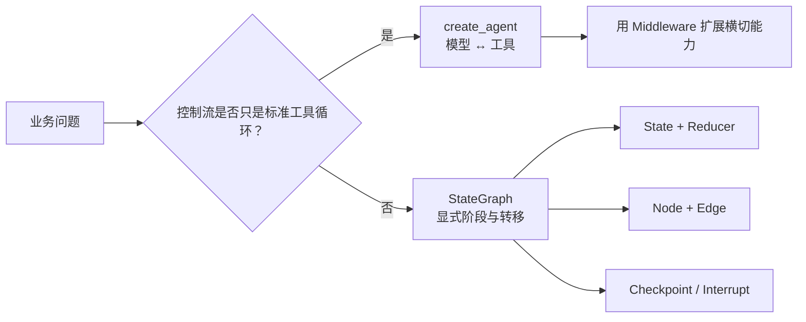
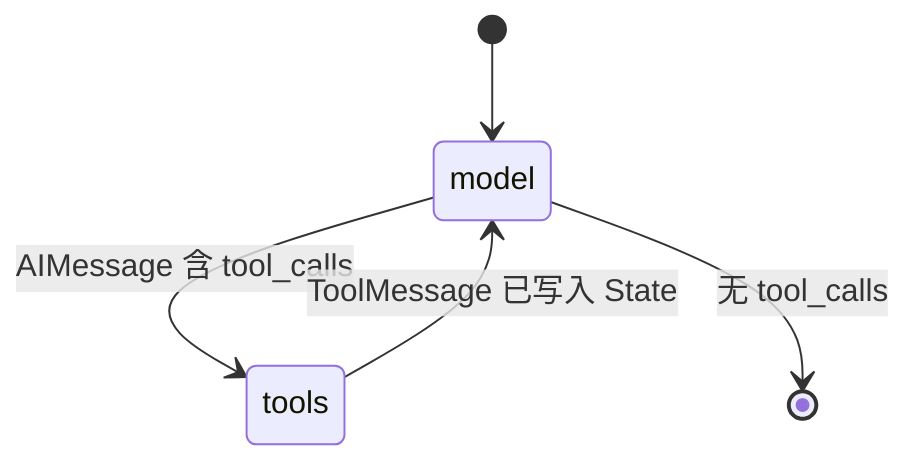

# 第 07 章：StateGraph 基础——State、Reducer、Node、Edge 与显式 ReAct

> **课程位置**：Graph 编排层第 1 章  
> **锁定环境**：Python 3.12 / LangChain 1.3.x / LangGraph 1.2.x  
> **API 校准日期**：2026-07-13  
> **本章工件**：`mini_deerflow.graph.create_explicit_react_graph()`

## 1. 系统快照：Lead Agent 受治理，固定流程却仍靠 Prompt

第二部交付的 Lead Agent 已能检索、读取安全上下文并接受 Middleware 治理。但“先验证研究请求，再查资料，最后检查报告”仍写在 Prompt 中，模型可以跳过或改变顺序。

`create_agent` 已经是生产可用的高层 Agent 工厂。DeerFlow 的 Lead Agent 也建立在它之上；本章学习显式 Graph，是为了接管属于业务规则的控制流，不是把所有 Agent 重写一遍。

当业务要求固定阶段、并行分支、循环质量门、人工审批或故障恢复时，控制流本身就是业务规则。此时只靠 Prompt 说“先规划、再研究、最后检查”无法证明模型真的按顺序执行；`StateGraph` 把阶段、共享事实和转移条件变成可检查、可测试、可持久化的程序。

<!-- diagram:id=07-create-agent-vs-explicit-graph -->

```mermaid
flowchart LR
    Q["业务问题"] --> D{"控制流是否只是标准工具循环？"}
    D -->|"是"| A["create_agent<br/>模型 ↔ 工具"]
    D -->|"否"| G["StateGraph<br/>显式阶段与转移"]
    A --> E["用 Middleware 扩展横切能力"]
    G --> S["State + Reducer"]
    G --> N["Node + Edge"]
    G --> P["Checkpoint / Interrupt"]
```

**图的文本替代**：若业务只是标准模型—工具循环，优先使用 `create_agent` 并通过 Middleware 扩展；若顺序、分支、并行、循环或恢复本身属于业务规则，使用 StateGraph 显式声明 State、Node、Edge 和持久化边界。

## 2. Graph 的运行模型：State、Step 与局部更新

### 2.1 State 是协议，不是全局可变字典

State 描述线程内节点可以共同观察的事实。节点接收当前快照并返回**局部更新**，LangGraph 在 superstep 边界通过 reducer 合并更新。节点不应原地修改传入对象，也不应把数据库连接、API token 或模型实例塞进 State。

第 05 章的边界仍然成立：

- State：会随图演进、需要 checkpoint 的线程事实；
- Runtime Context：本次运行由应用注入、模型不可改写的配置和依赖；
- Store：应用显式保存的跨线程数据；
- 业务数据库：权威领域事务。

### 2.2 Reducer 决定并发写入的语义

没有 reducer 的字段默认使用覆盖语义；同一个 superstep 中若多个节点同时写该字段，LangGraph 不会替你猜“保留谁”，而会拒绝含糊更新。典型 reducer：

```python
from typing import Annotated, TypedDict
import operator
from langgraph.graph.message import add_messages

class ExampleState(TypedDict):
    messages: Annotated[list, add_messages]
    events: Annotated[list[str], operator.add]
    current_status: str
```

`messages` 需要理解消息 ID 与替换规则，所以用 `add_messages`；append-only 事件可用 `operator.add`；`current_status` 只允许当前节点覆盖。不要机械地给所有列表添加 `operator.add`：摘要、任务表和按 ID 去重的 Artifact 可能需要完全不同的 reducer。

## 3. Node 与 Edge 分别负责什么

Node 是执行单元：读取 State/Runtime，调用确定性代码、模型或工具，然后返回 update 或 `Command`。Edge 是控制流：说明某个节点完成后，哪些节点可以进入下一 superstep。

常见边：

- `add_edge(A, B)`：固定串行；
- `add_conditional_edges(A, router)`：根据 State 选择后继；
- 节点返回 `Command(goto=...)`：在同一个返回值中组合 State update 与路由；
- 条件边返回 `Send(...)`：动态创建并行任务，第 08 章详解。

节点要“小而完整”：它应有清晰输入输出与失败边界，而不是把整个业务塞进一个 `run_everything()`。反过来，也不要为每行 Python 创建节点；只有需要单独重试、观测、并行、审批或持久化的阶段才值得成为 Graph seam。

## 4. 手写一个透明的 ReAct 循环

高层 `create_agent` 帮我们完成了模型调用、工具执行、`ToolMessage` 配对和循环。本章用一次显式实现拆开它，目的是看清 Graph 语义，而不是以后拒绝高层工厂。

<!-- diagram:id=07-explicit-react-loop -->

```mermaid
stateDiagram-v2
    [*] --> model
    model --> tools: AIMessage 含 tool_calls
    tools --> model: ToolMessage 已写入 State
    model --> [*]: 无 tool_calls
```

**图的文本替代**：Graph 从 model 节点开始；若模型消息带工具调用则进入 tools，工具结果以 ToolMessage 追加后回到 model；若没有工具调用则结束。

事实源位于 `mini_deerflow.graph.react` 的 `tutorial:07-explicit-react-graph` region。

```python sync=ch07-explicit-react
from langchain_core.messages import AIMessage, ToolMessage
from mini_deerflow.graph import create_explicit_react_graph
from mini_deerflow.models import create_offline_model
from mini_deerflow.tools import calculator

react_model = create_offline_model(
    [
        AIMessage(
            content="",
            tool_calls=[
                {
                    "name": "calculator",
                    "args": {"operation": "multiply", "left": 6, "right": 7},
                    "id": "calc-42",
                    "type": "tool_call",
                }
            ],
        ),
        AIMessage(content="结果是 42。"),
    ]
)
react_graph = create_explicit_react_graph(model=react_model, tools=[calculator])
react_result = react_graph.invoke({"messages": [("user", "计算 6 × 7")]})

assert [event.as_text() for event in react_result["node_trace"]] == [
    "model",
    "tools",
    "model",
]
assert react_result["messages"][-1].content == "结果是 42。"
assert next(
    message.content
    for message in react_result["messages"]
    if isinstance(message, ToolMessage)
) == "42.0"
```

### 4.1 为什么 ToolNode 之后必须回到 model

工具输出不是最终答案。工具节点需要生成与 `tool_call_id` 配对的 `ToolMessage`，再让模型基于工具证据生成回答。如果 tools 直接连到 `END`，调用方只能看到原始 JSON/数字，模型没有机会解释结果；如果没有 ToolMessage 配对，后续模型或 provider 会拒绝无效消息序列。

### 4.2 条件函数应保持纯净

`route_after_model()` 只读取最后一条消息并返回目标节点。不要在 router 中写数据库或修改 State：router 可能在调试、可视化或恢复时被多次调用，而且它没有稳定的 update/reducer 语义。需要“更新并跳转”时使用返回 `Command` 的节点。

## 5. 不只看最终答案：观察 updates stream

`invoke()` 适合获取最终 State；`stream(..., stream_mode="updates")` 会按节点给出局部更新，能直接看到 Graph 轨迹。

```python sync=ch07-stream-updates
stream_model = create_offline_model(
    [
        AIMessage(
            content="",
            tool_calls=[
                {
                    "name": "calculator",
                    "args": {"operation": "add", "left": 1, "right": 2},
                    "id": "calc-3",
                    "type": "tool_call",
                }
            ],
        ),
        AIMessage(content="3"),
    ]
)
stream_graph = create_explicit_react_graph(model=stream_model, tools=[calculator])
react_updates = list(
    stream_graph.stream(
        {"messages": [("user", "1 + 2")]},
        stream_mode="updates",
    )
)

assert [next(iter(update)) for update in react_updates] == ["model", "tools", "model"]
assert [
    event.as_text() for event in react_updates[1]["tools"]["node_trace"]
] == ["tools"]
```

`updates` 是局部 patch，不是每一步完整 State；需要完整快照时使用 `values`。未来 Gateway 将这些 runtime stream mode 适配为 SSE 产品事件，不能把 Python 内部对象直接暴露为长期外部协议。

## 6. 失败实验：循环必须有终止预算

只要模型持续产生 tool call，显式 ReAct 就会继续循环。生产系统需要模型调用上限、业务轮次、deadline 或 Graph recursion limit；不能只在 Prompt 中要求“不要无限循环”。

```python sync=ch07-loop-limit-failure
from langgraph.errors import GraphRecursionError

loop_messages = [
    AIMessage(
        content="",
        tool_calls=[
            {
                "name": "calculator",
                "args": {"operation": "add", "left": 1, "right": 1},
                "id": f"loop-{index}",
                "type": "tool_call",
            }
        ],
    )
    for index in range(10)
]
loop_graph = create_explicit_react_graph(
    model=create_offline_model(loop_messages),
    tools=[calculator],
)
try:
    loop_graph.invoke(
        {"messages": [("user", "持续调用工具")]},
        config={"recursion_limit": 3},
    )
except GraphRecursionError as error:
    loop_error = error
else:
    raise AssertionError("无界工具循环必须被 recursion_limit 终止")

assert "Recursion limit" in str(loop_error)
```

recursion limit 是最后一道保险，不是业务策略。第 06 章的 `ModelCallLimitMiddleware` 更接近 Agent 预算；复杂业务图还应在 State 中记录 attempt、deadline 和失败原因。

## 7. State Schema 的工程检查清单

设计字段时逐项回答：

1. 它是否需要跨节点、跨暂停恢复？否则留在节点局部变量或 Runtime Context。
2. 它是否可能被多个并行节点写入？若会，reducer 的冲突语义是什么？
3. 它能否被默认 serializer 保存？连接、生成器、锁对象不能进入 State。
4. 它是否含 Secret 或无界大对象？若含，改为安全引用或外部存储。
5. 它是领域类型还是靠字符串编码的约定？优先使用 `ArtifactRef` 等可验证类型。
6. 它被谁消费？没有消费者的“以后也许有用”字段应删除。

## 8. Mini DeerFlow 与 DeerFlow 对照

Mini DeerFlow 的显式 ReAct 是教学剖面；当前 DeerFlow Lead Agent 仍优先使用 `create_agent`，不会为了“更底层”而复制一套模型—工具图。对照阅读固定到 DeerFlow commit `2bd0f56a0f5a418d126cb4a18e23001f54ccf024`：

| 本章概念 | DeerFlow 阅读入口 | 阅读问题 |
|---|---|---|
| `ReactGraphState.messages` | `agents/thread_state.py::ThreadState` | 消息以外哪些线程事实需要 reducer？ |
| model ↔ tools loop | `agents/lead_agent/agent.py::make_lead_agent` | 为什么当前实现选择 `create_agent`？ |
| ToolMessage / Command update | `tools/builtins/*` | 哪些工具不仅返回文本，还更新业务 State？ |
| updates/values stream | `runtime/runs/worker.py` | Graph mode 如何被适配为 Gateway SSE？ |
| recursion / model limit | middleware chain | 预算在哪层 fail closed？ |

不要把早期 DeerFlow research graph 文章当作当前主架构。学习显式 StateGraph 是为了理解 runtime 与复杂业务拓扑，阅读当前 DeerFlow 时仍应以真实 Lead Agent factory 为准。

## 9. 练习与自动验收

### 练习 A：单点修改

为 `ReactGraphState` 增加类型化 `model_attempts` reducer，并让模型节点每次追加一个 attempt 事件。解释为何它不应只是一个全局整数。

### 练习 B：边界判断

判断下列对象属于 State、Context、Store 还是业务数据库：当前 tool call、数据库连接、用户语言偏好、订单退款状态、checkpoint ID。

### 练习 C：项目扩展

增加一个“工具连续失败两次即结束”的显式节点。失败计数必须由 ToolMessage 的结构化状态推导或显式更新，不能搜索自然语言回答中的“失败”二字。

### 延迟回忆题

合上讲义回答：Reducer 解决的是哪种冲突？为什么 router 不应产生副作用？`create_agent` 与显式 ReAct 的选择标准是什么？

```bash
TMPDIR="$PWD/.tmp" uv run --locked --group dev pytest -q \
  tests/test_mini_deerflow_graph_workflows.py
TMPDIR="$PWD/.tmp" uv run --locked --group dev python scripts/validate_tutorials.py
```

## 10. 资料

资料访问日期：2026-07-13。

- [LangGraph Graph API Overview](https://docs.langchain.com/oss/python/langgraph/graph-api)
- [LangGraph Workflows and Agents](https://docs.langchain.com/oss/python/langgraph/workflows-agents)
- [LangGraph Streaming](https://docs.langchain.com/oss/python/langgraph/streaming)
- [DeerFlow ThreadState](https://github.com/bytedance/deer-flow/blob/main/backend/packages/harness/deerflow/agents/thread_state.py)

## 本章交付：控制流已经可见，但仍只有一个循环

本章交付显式 State、Reducer、Node、Edge 和 ReAct 控制流实验。Mini DeerFlow 保留高层 Lead Agent，同时获得表达确定性业务阶段的 Graph 语言。

当前图仍只有一个模型—工具循环。下一章会把研究请求动态拆成多个 section，并用 Command、Send、Subgraph 和 reducer 表达拒绝、并行、汇合与修订。

继续阅读：[第 08 章：把研究流程展开为显式控制流](./08_Engineering_Defense.md)。
