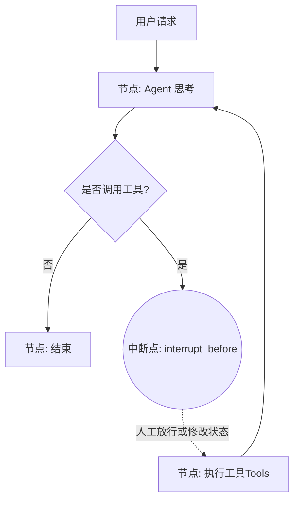

# 第 08 章：工程防御：安全断点与状态注入

## 0. 学习进度预览
| 状态 | 章节名称 | 核心知识点 | 预计难度 |
| :--- | :--- | :--- | :--- |
| 🔄 | **08: 工程防御：安全断点与状态注入** | Breakpoints (HITL), InjectedState, Time Travel | ⭐⭐⭐⭐ |

## 1. 导读与建模 (The Orientation)

- **[知识背景 / Background]**：在传统的大语言模型对话中，模型仅仅返回文本内容。但在 Agent 时代，模型通过工具调用（Tool Calling）直接触碰物理与数字世界。LangGraph 将这种执行固化为状态机的转移。
- **[为什么要学 / Why This Matters]**：完全自动化的“狂奔图”是高度危险的。如果在不给予人类介入的情况下允许 Agent 自由执行高危操作（如删表、转账），一次幻觉就可能导致重大生产事故。学习本章，是你将 Agent 从“玩具”变为“企业级安全应用”的核心路径。
- **[逻辑全景图 / Overview]**：

- **[学习目标 / Objectives]**：
  1. 掌握如何利用 `interrupt_before` 和持久化设置安全审批流程（HITL）。
  2. 理解并在代码中执行状态的时间旅行（Time Travel）和人工注入更新。
  3. 通过 `InjectedState` 实现权限隔离传递，保障工具调用时的隐性安全。

---

## 2. 渐进式知识点展开

### 知识点一：Human-in-the-loop (HITL) 与断点

- **💡 原理直觉：红绿灯系统**
  > 就像是路口的红绿灯。Agent 的思考过程是一路通行的绿灯；但当它打算执行修改数据库、发邮件等关键操作时，LangGraph 设置了“红灯（Breakpoint）”。图的运行在这里被原位冻结，直到人类管理员审核完毕给出绿灯。

- **🔍 深度注脚：挂起 (Suspend) 不是阻塞 (Block)**
  > 注意：这里的暂停并非传统的 `time.sleep` 或 `input()`。在图结构配合 `checkpointer` 时，挂起意味着当前执行栈被作为一个 Snapshot 存入物理介质，彻底释放了服务器资源。你完全可以在三天以后再来恢复这个执行。

- **🚀 代码实现**
```python
from langgraph.graph import StateGraph

# ... 前置的节点与边配置 ...

app = builder.compile(
    checkpointer=memory_saver,  # 必须开启持久化
    interrupt_before=["tools"]  # 在进入正式执行工具的阶段前，冻结大图
)
```

- **⚠️ 专家避坑**
  **关键提醒**: 绝对不要试图在没有配置 `checkpointer` 的情况下使用 `interrupt_before`，这会导致执行中途抛锚，所有的中间记忆和状态瞬间丢失。

---

### 知识点二：状态更新与时间旅行 (Time Travel)

一旦 Graph 暂停，开发者（或有权限的用户）就可以直接修改图的状态。如果模型生成了一个错误的提议，我们不必让它重新思考，可以直接“覆写”它的决定，然后继续运行。

- **💡 原理直觉：游戏读档与修改器**
  > 就像是在玩 RPG 游戏。你不仅可以读取昨天的存档点重新打怪（Time Travel），你甚至可以在读取图存档后，直接用修改器把关键数据强行覆盖（Update State），从被修改后的平行现实继续运行图！

- **🚀 代码实现**

**更新当前状态 (Update State)**
我们可以拦截并手动修改模型的意图：
```python
# 假设状态停在了断点，模型本打算破坏文件
# 我们通过 update_state 强行塞入一条干预消息
graph.update_state(
    config, 
    {"messages": [AIMessage(content="操作被管理员强行拦截！")]},
    as_node="model" # 伪装成是模型自己生成的消息
)
# 送入 None，继续运行图
graph.invoke(None, config)
```

**时间旅行 (Time Travel)**
直接跳转回过去的历史节点展开平行执行：
```python
# 获取历史快照
snapshots = list(graph.get_state_history(config))
past_config = snapshots[-3].config # 回到 3 步之前的状态

# 从过去的时间点重新执行
graph.invoke(None, past_config)
```

---

### 知识点三：InjectedState 与依赖倒置隔离

在处理复杂工具时，我们需要传递当前对话的状态数据（如用户的权限 Token）给工具。但我们**绝不希望**让模型自己通过工具参数来传输这些敏感数据，因为模型可能被越权劫持（Prompt Injection）。

- **💡 原理直觉：厨师与暗门传递**
  > 模型是前台的服务员，可以帮顾客点单。但厨房里的核心秘方（权限），必须由餐厅经理通过内部通道偷偷塞给厨师。前台的服务员完全看不见这个暗箱操作。

- **🚀 最佳实践**
把特定的状态通过 `InjectedState` 注入到工具的上下文中。模型在调用工具时不需要也看不见这个参数，LangGraph 框架会在后台自动对齐它。

```python
from langchain.tools import tool
from langgraph.prebuilt import InjectedState
from typing import Annotated

@tool
def process_refund(order_id: str, current_role: Annotated[str, InjectedState("user_role")]):
    """处理退款。模型视界中只有 order_id，不知道 current_role。"""
    if current_role != "admin":
        return "权限不足！"
    return f"订单 {order_id} 退款成功。"
```
这种工程上的依赖倒置，确保了最底层的 API 安全边界。

---

## 🚀 实验验证 (Lab)

请打开 `08_Engineering_Defense.ipynb` 体验实战：

1. 尝试构建一个具有“删除表”高危工具的智能体。
2. 配置 `interrupt_before` 断点，观察执行挂起的底层逻辑。
3. 手动尝试放行审批。
4. 在其中观察 `InjectedState` 是如何在后台为工具悄无声息铺排数据的。

---
*Antigravity 教学规范体系 (2026).*
